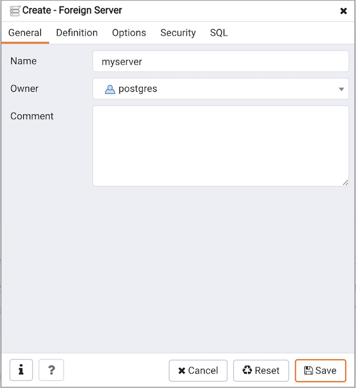
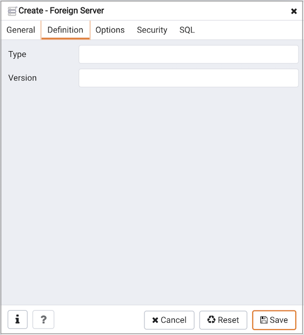
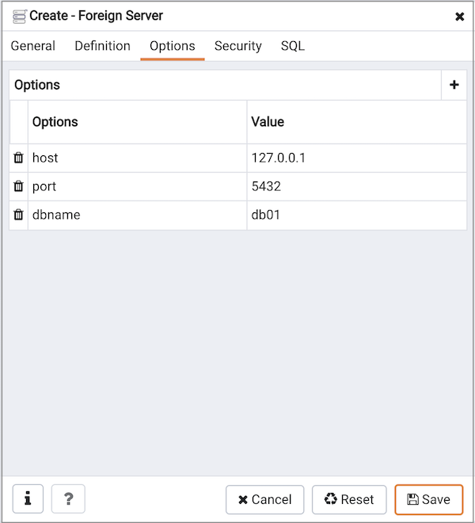
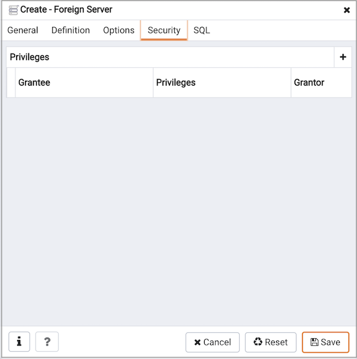
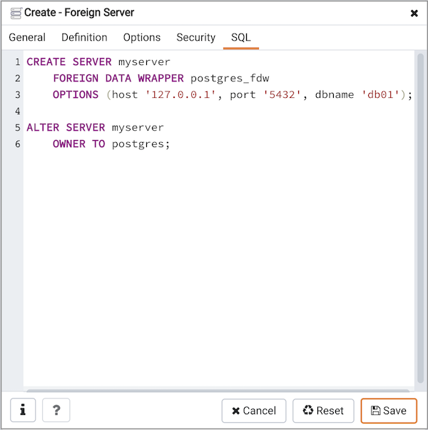

Use the `Foreign Server` dialog to create a foreign server. A foreign server typically encapsulates connection information that a foreign-data wrapper uses to access an external data resource. Each foreign data wrapper may connect to a different foreign server; in the `Browser` tree control, expand the node of the applicable foreign data wrapper to launch the `Foreign Server` dialog.

The `Foreign Server` dialog organizes the development of a foreign server through the following dialog tabs: `General`, `Definition`, `Options`, and `Security`. The `SQL` tab displays the SQL code generated by dialog selections.

Use the fields in the `General` tab to identify the foreign server:

-   Use the `Name` field to add a descriptive name for the foreign server. The name will be displayed in the `Browser` tree control. It must be unique within the database.
-   Use the drop-down listbox next to `Owner` to select a role.
-   Store notes about the foreign server in the `Comment` field.

Click the `Definition` tab to continue.

Use the fields in the `Definition` tab to set parameters:

-   Use the `Type` field to specify a server type.
-   Use the `Version` field to specify a server version.

Click the `Options` tab to continue.

Use the fields in the `Options` tab to specify options. Click the `Add` button to create an option clause for the foreign server.

-   Specify the option name in the `Option` field.
-   Provide a corresponding value in the `Value` field.

Click `Add` to create each additional clause; to discard an option, click the trash icon to the left of the row and confirm deletion in the `Delete Row` popup.

Click the `Security` tab to continue.

Use the `Security` tab to assign security privileges to the foreign server. Click `Add` before you assign a set of privileges.

-   Select the name of the role from the drop-down listbox in the `Grantee` field.
-   Click inside the `Privileges` field. Check the boxes to the left of one or more privileges to grant the selected privileges to the specified user.
-   The current user, who is the default grantor for granting the privilege, is displayed in the `Grantor` field.

Click `Add` to assign a new set of privileges; to discard a privilege, click the trash icon to the left of the row and confirm deletion in the `Delete Row` dialog.

Click the `SQL` tab to continue.

Your entries in the `Foreign Server` dialog generate a SQL command (see an example below). Use the `SQL` tab for review; revisit or switch tabs to make any changes to the SQL command.

**Example**

The following is an example of the sql command generated by user selections in the `Foreign Server` dialog:

The example shown demonstrates creating a foreign server for the foreign data wrapper `hdfs_fdw`. It has the name `hdfs_server`; its type is `hiveserver2`. Options for the foreign server include a host and a port.

-   Click the `Info` button (i) to access online help. View context-sensitive help in the `Tabbed browser`, where a new tab displays the PostgreSQL core documentation.
-   Click the `Save` button to save work.
-   Click the `Cancel` button to exit without saving work.
-   Click the `Reset` button to restore configuration parameters.
