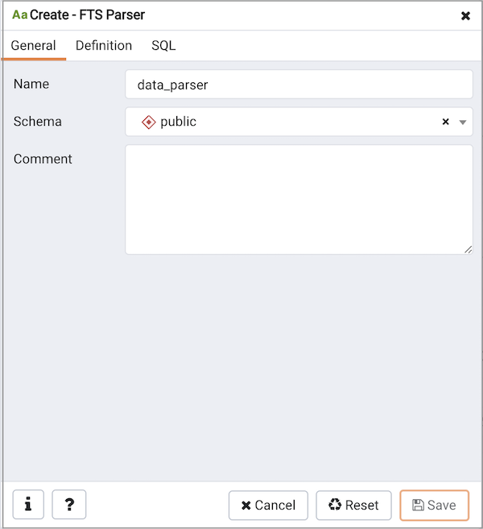
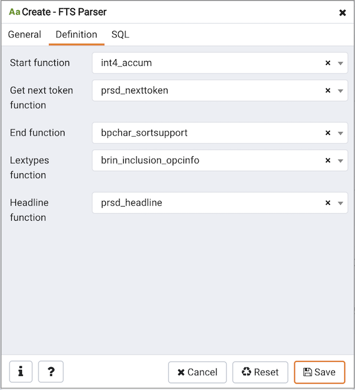

Use the `FTS Parser` dialog to create a new text search parser. A text search parser defines a method for splitting a text string into tokens and assigning types (categories) to the tokens.

The `FTS Parser` dialog organizes the development of a text search parser through the following dialog tabs: `General`, and `Definition`. The `SQL` tab displays the SQL code generated by dialog selections.

Use the fields in the `General` tab to identify a text search parser:

-   Use the `Name` field to add a descriptive name for the parser. The name will be displayed in the `Browser` tree control.
-   Select the name of the schema in which the parser will reside from the drop-down listbox in the `Schema` field.
-   Store notes about the domain in the `Comment` field.

Click the `Definition` tab to continue.

Use the fields in the `Definition` tab to define parameters:

-   Use the drop-down listbox next to `Start function` to select the name of the function that will initialize the parser.
-   Use the drop-down listbox next to `Get next token function` to select the name of the function that will return the next token.
-   Use the drop-down listbox next to `End function` to select the name of the function that is called when the parser is finished.
-   Use the drop-down listbox next to `Lextypes function` to select the name of the lextypes function for the parser. The lextypes function returns an array that contains the id, alias, and a description of the tokens used by the parser.
-   Use the drop-down listbox next to `Headline function` to select the name of the headline function for the parser. The headline function returns an excerpt from the document in which the terms of the query are highlighted.

Click the `SQL` tab to continue.

Your entries in the `FTS Parser` dialog generate a generate a SQL command. Use the `SQL` tab for review; revisit or switch tabs to make any changes to the SQL command.

-   Click the `Info` button (i) to access online help. View context-sensitive help in the `Tabbed browser`, where a new tab displays the PostgreSQL core documentation.
-   Click the `Save` button to save work.
-   Click the `Cancel` button to exit without saving work.
-   Click the `Reset` button to restore configuration parameters.
