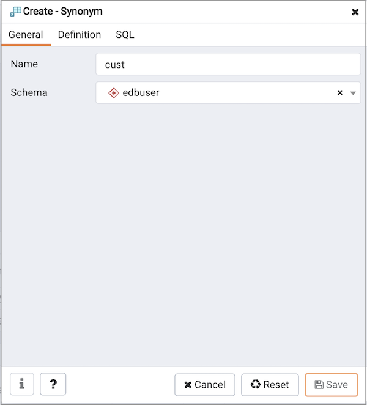
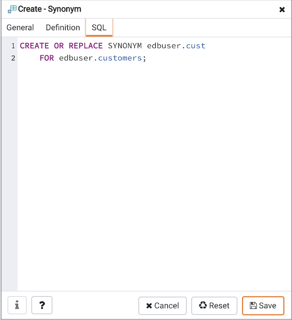

Use the `Synonym` dialog to substitute the name of a target object with a user-defined synonym.

The `Synonym` dialog organizes the development of a synonym through the `General` tab. The `SQL` tab displays the SQL code generated by dialog selections.

Use the fields in the `General` tab to identify the synonym:

-   Use the `Name` field to specify the name of synonym. The name will be displayed in the `Browser` tree control.
-   Select the name of the schema in which the synonym will reside from the drop-down listbox in the `Schema` field.

In the definition panel, identify the target:

-   Use the drop-down listbox next to `Target Type` to select the the type of object referenced by the synonym.
-   Use the drop-down listbox next to `Target Schema` to select the name of the schema in which the object resides.
-   Use the drop-down listbox next to `Target Object` to select the name of the object referenced by the synonym.

Click the `SQL` tab to continue.

Your selections and entries in the `Synonym` dialog generate a SQL command.

The example creates a synonym for the `emp` table named `emp_hist`.

-   Click the `Save` button to save work.
-   Click the `Cancel` button to exit without saving work.
-   Click the `Reset` button to restore configuration parameters.
