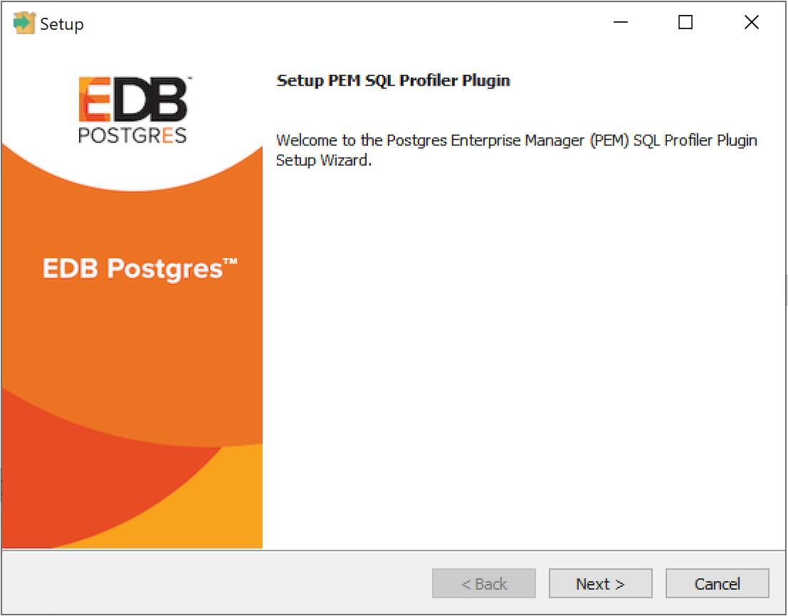

SQL Profiler allows a database superuser to locate and optimize poorly-running SQL code. Users of Microsoft SQL Server’s Profiler will find PEM’s SQL Profiler very similar in operation and capabilities. SQL Profiler is installed with each Advanced Server instance; if you are using PostgreSQL, you must download the SQL Profiler installer or packages and install the SQL Profiler product into each managed database instance you wish to profile.

SQL Profiler is officially supported only on the EnterpriseDB distributions of PostgreSQL version 9.4 or above and Advanced Server version 9.4 or above. The plugin is distributed via StackBuilder, or is available from the [EnterpriseDB website](https://www.enterprisedb.com/advanced-downloads)

You can use the graphical installer to install any version of SQL Profiler on Windows platform.

On Linux, if you have installed your database server through graphical installer then you must use the graphical installer to install the SQL Profiler. If you have installed your database server using the RPM or DEB package, then you must use the RPM or DEB package to install the SQL Profiler.

## Installing SQL Profiler on Windows

To invoke the SQL Profiler graphical installer, assume superuser privileges (or `Administrator` privileges on Windows), navigate into the directory that contains the installer, and invoke the installer:

> `sqlprofiler-pg-<pg_version>-<sql_profiler_version>-windows-x64.exe`

Where, `pg_version` is the version of your PostgreSQL and `sql_profiler_version` is the version of SQL Profiler.

The SQL Profiler installer welcomes you to the Setup Wizard.

Click `Next` to continue to the `License Agreement`.

Carefully review the license agreement before highlighting the appropriate radio button and accepting the agreement; click `Next` to continue to the `Installation Directory` dialog.

Specify an alternate location for the installation directory, or accept the default location and click `Next` to continue.

The wizard is now ready to install the SQL Profiler plugin. Click `Next` to continue.

The SQL Profiler plugin installer displays progress bars as it copies files to your system.

When the installation is complete, the SQL Profiler plugin is ready to be configured.

## Installing SQL Profiler on Linux using RPMs

Note

You may be required to add the `sslutils` package to your PostgreSQL database servers before installing SQL Profiler.

You can install SQL Profiler using rpm on RHEL or Centos 6 or 7, using yum command as root user:

> `yum install postgresql<pg_version>-sqlprofiler`

Where, `pg_version` is the version of your PostgreSQL.

When the installation is complete, the SQL Profiler plugin is ready to be configured.

## Installing SQL Profiler on Debian/Ubuntu using DEB

Note

You may be required to add the `sslutils` package to your PostgreSQL database servers before installing SQL Profiler.

You can install SQL Profiler using DEB on Debian 9.x or Ubuntu 18, using apt command as root user:

> `apt install postgresql-<pg_version>-sqlprofiler`

Where, `pg_version` is the version of your PostgreSQL.

When the installation is complete, the SQL Profiler plugin is ready to be configured.
