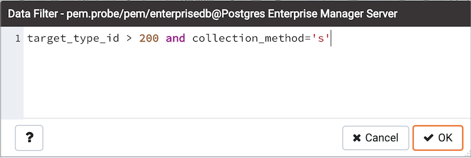

You can access `Data Filter dialog` by clicking on `Filtered Rows` toolbar button visible on the Browser panel or by selecting *View/Edit Data -> Filtered Rows* context menu option.

This allows you to specify an SQL Filter to limit the data displayed in the edit grid window:

Note

Use SHIFT + ENTER keys to apply filter.

