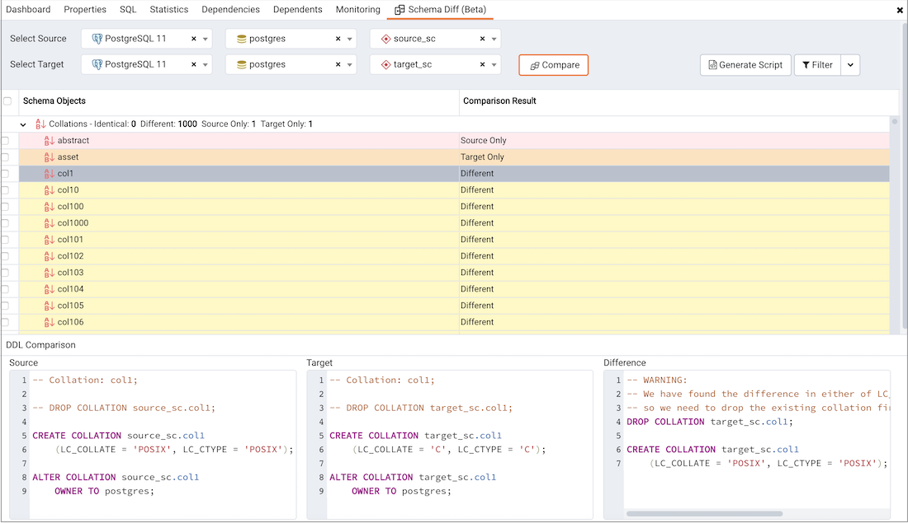
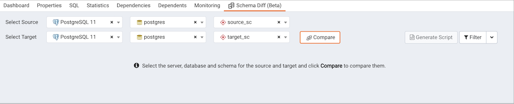
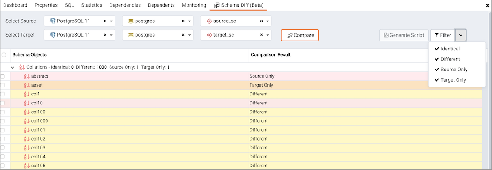
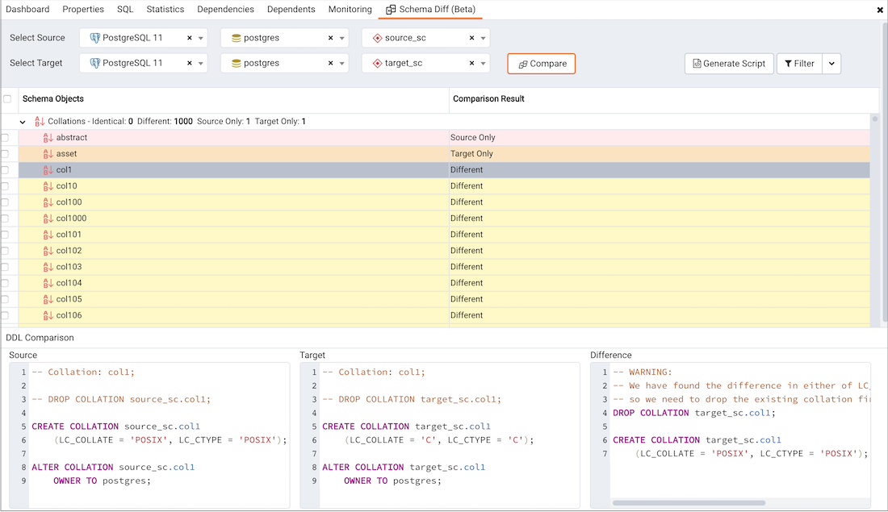

**Schema Diff** is a feature that allows you to compare objects between two database or two schemas. Use the `Tools` menu to access Schema Diff.

The Schema Diff feature allows you to:

> -   Compare and synchronize the database objects (from source to target).
> -   Visualize the differences between database objects.
> -   List the differences in SQL statement for target database objects.
> -   Generate synchronization scripts.

!!! Note
    > -   The source and target database servers must be of the same major version.
    > -   If you compare two **schemas** then dependencies won't be resolved.

Click on *Schema Diff* under the *Tools* menu to open a selection panel. To compare **databases** choose the source and target servers, and databases. To compare **schemas** choose the source and target servers, databases, and schemas. After selecting the objects, click on the *Compare* button.

You can open multiple copies of `Schema Diff` in individual tabs simultaneously. To close a copy of Schema Diff, click the \*X\* in the upper-right hand corner of the tab bar. You can rename the panel title by right-clicking and select the "Rename Panel" option.

Use the [Preferences](../03_toc_pem_client/04_preferences/#preferences) dialog to specify following:

> -   *Schema Diff* should open in a new browser tab. Set *Open in new browser tab* option to true.
> -   *Schema Diff* should ignore the whitespaces while comparing string objects. Set *Ignore whitespaces* option to true.
> -   *Schema Diff* should ignore the owner while comparing objects. Set *Ignore owner* option to true.

The `Schema Diff` panel is divided into two panels; an Object Comparison panel and a DDL Comparison panel.

## The Schema Diff Object Comparison Panel

In the object comparison panel, you can select the source and target servers of the same major version, and databases to be compared. You can select any server listed under the browser tree whether it is connected or disconnected. If you select a server that is not connected then it will prompt you for the password before using the server.

Next, select the databases that will be compared. The databases can be the same or different (and within the same server or from different servers).

After you select servers and databases, click on the *Compare* button to obtain the `Comparison Result`.

Use the drop-down lists of Database Objects to view the DDL statements.

In the upper-right hand corner of the object comparison panel is a *Filter* option that you can use to filter the database objects based on the following comparison criteria:

> -   Identical – If the object is found in both databases with the same SQL statement, then the comparison result is identical.
> -   Different – If the object is found in both databases but have different SQL statements, then the comparison result is different.
> -   Source Only – If the object is found in source database only and not in target database, then the comparison result is source only.
> -   Target Only – If the object is found in target database only and not in source database, then the comparison result is target only.

Click on any of the database objects in the object comparison panel to display the DDL Statements of that object in the DDL Comparison panel.

## Schema Diff DDL Comparison Panel

The `DDL Comparison` panel displays three columns:

-   The first column displays the DDL statement of the object from the source database.
-   The second column displays the DDL statement of the object from the target database.
-   The third column displays the difference in the SQL statement of the target database object.

You can review the DDL statements of all the database objects to check for the differences in the SQL statements.

Also, you can generate the SQL script of the differences found in the target database object based on the SQL statement of the source database object. To generate the script, select the checkboxes of the database objects in the object comparison panel and then click on the *Generate Script* button in the upper-right hand corner of the object comparison panel.

Select the database objects and click on the *Generate Script* button to open the `Query Tool` in a new tab, with the difference in the SQL statement displayed in the `Query Editor`.

If you have clicked on the database object to check the difference generated in the `DDL Comparison` Panel, and you have not selected the checkbox of the database object, PEM will open the `Query Tool` in a new tab, with the differences in the SQL statements displayed in the `Query Editor`.

You can also use the `Copy` button to copy the difference generated in the `DDL Comparison` panel.

Apply the SQL Statement in the target database to synchronize the databases.
