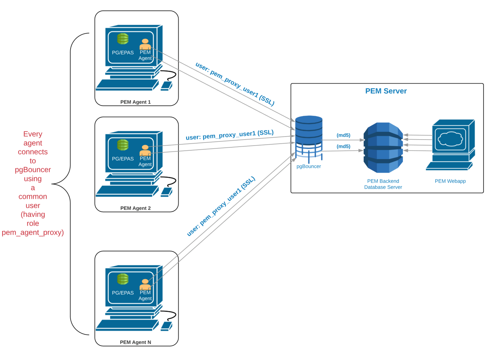

Each PEM agent connects to the PEM database server using the SSL certificates for each individual user. For example, an agent with ID#1 connects to the PEM database server using the agent1 user.

Prior to PEM version 7.5, the following limitations did not allow use of the connection pooler between the PEM server and PEM agent: \* The PEM agent uses an SSL Certificate to connect the PEM database server. \* It uses an individual user identifier when connecting to the PEM database server. EnterpriseDB has modified the PEM agent to allow the agent to use a common database user (instead of the dedicated agent users) to connect the PEM database server.

We recommend using pgBouncer versions equal to or later than version 1.9.0 as the connection pooler. Since versions 1.9.0 or later support cert authentication; PEM Agents can connect to pgBouncer using SSL certificates.
