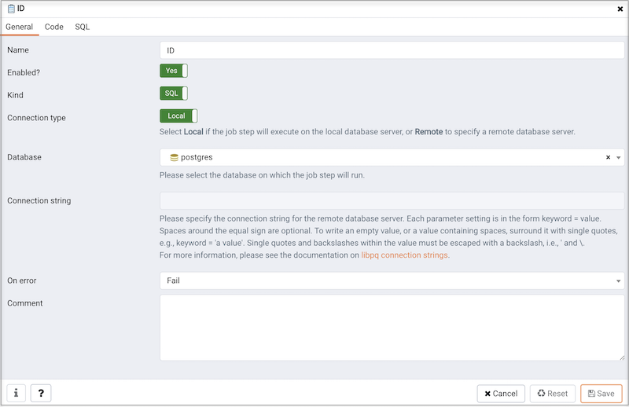

Each Job consists of a number of steps, each of which may be an SQL script, or an operating system batch/shell script. Each step in a given job is run in turn, in alphanumeric name order.

Steps may be added to a job through the job properties dialogue, or added as a sub-object. The `Properties` tab of the main PEM client window will display details of the selected step, and the `Statistics` tab will display details of each run of the step, including and output or errors from the script.

Each step consists of the details shown on the screenshot below, most of which are self-explanatory. If `Kind` is set to SQL, then it goes without saying that a database against which to run the script must be selected. If set to `Batch`, the database/connection string should be left blank. The `On Error` option controls how failure of this step will affect the status of the overall job.

The `Definition` tab contains a single text box into which the step script should be entered. For SQL steps, this should be a series of one or more SQL statements. For batch jobs, when running on a Windows server, standard batch file syntax must be used, and when running on a *nix server, any shell script may be used, provided that a suitable interpreter is specified on the first line (e.g.*#!/bin/sh\*).
