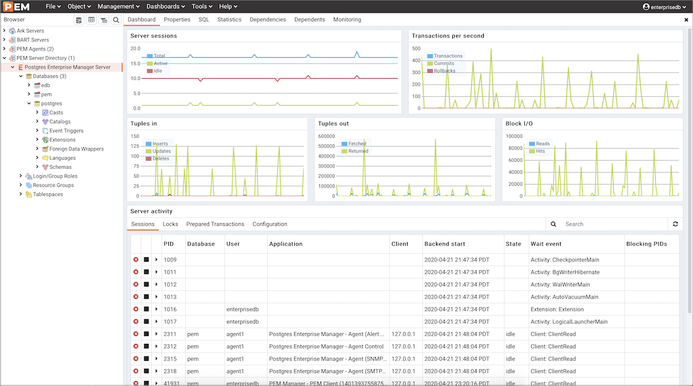
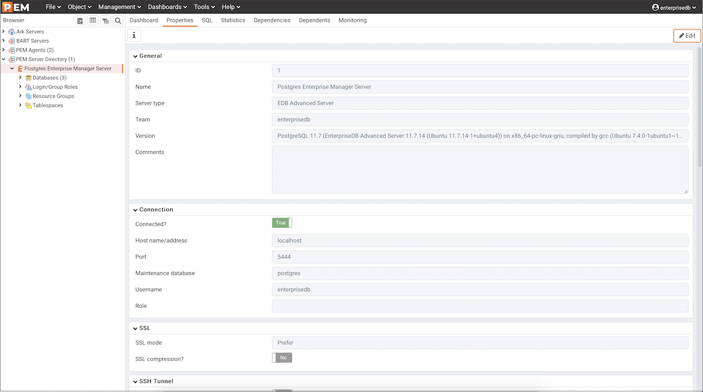
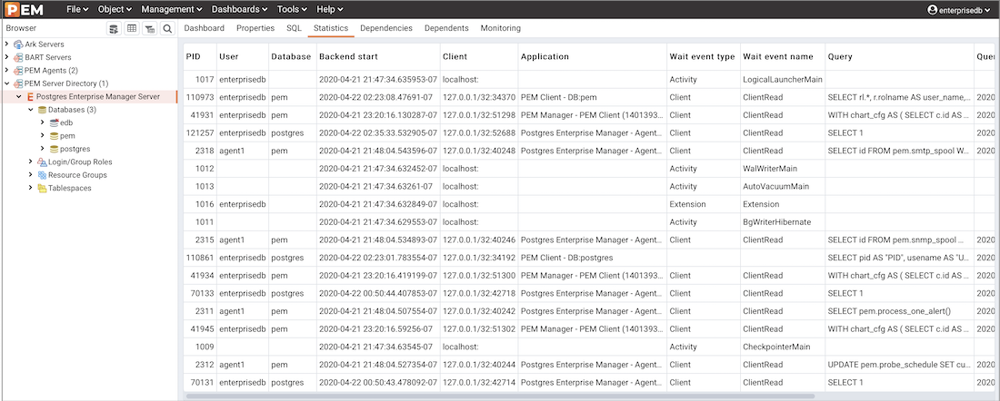
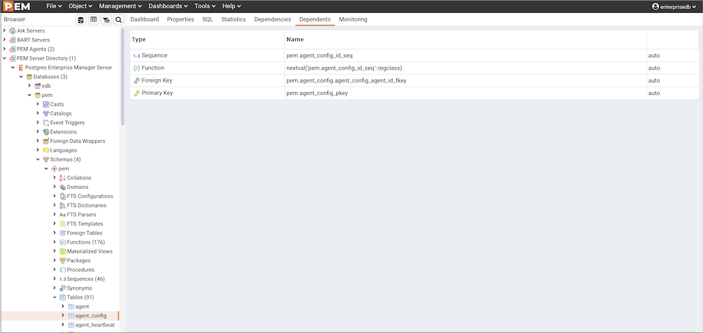
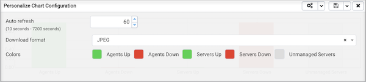

The PEM client features a menu bar and a window divided into two panes: the `Browser` tree control in the left pane, and a tabbed browser in the right pane.

[Menus](../03_toc_pem_client/#pem_menu_bar) displayed across the top of the browser window provide quick, context-sensitive access to PEM features and functionality.

## The PEM Client Object Browser

The `Browser` tree control provides access to information and management options for the database objects that reside on each server. The tree control expands to display a hierarchical view of the servers and objects that are monitored by the PEM server. You can use context menu options (accessed by right-clicking on nodes of the tree control) to create new objects, and modify and delete existing objects if your role holds the required privileges.

Expand nodes in the tree control to display a hierarchical view of the database objects that reside on a selected server:

-   Use the plus sign (+) to the left of a node to expand a segment of the tree control.
-   Click the minus sign (-) to the left of a node to close that node.

Right-click on a node of the tree control to access a context-sensitive menu and perform common tasks. Context menu options may include one or more of the following selections:

<table><colgroup><col style="width: 17%" /><col style="width: 82%" /></colgroup><thead><tr class="header"><th>Option</th><th>Action</th></tr></thead><tbody><tr class="odd"><td><code>Add named restore point</code></td><td>
Click to create and enter the name of a restore point.
</td></tr><tr class="even"><td><code>Backup...</code></td><td>
Click to open the <a href="#backup_dialog">Backup...</a> dialog to backup database objects.
</td></tr><tr class="odd"><td><code>Backup Globals...</code></td><td>
Click to open the <a href="#backup_globals_dialog">Backup Globals...</a> dialog to backup cluster objects.
</td></tr><tr class="even"><td><code>Backup Server...</code></td><td>
Click to open the <a href="#backup_server_dialog">Backup Server...</a> dialog to backup a server.
</td></tr><tr class="odd"><td><code>Connect Server</code></td><td>
Click to establish a connection with the selected server.
</td></tr><tr class="even"><td><code>Create</code></td><td>
Click to access a context menu that provides context-sensitive selections.
Your selection opens a <code>Create</code> dialog for creating a new object.</td></tr><tr class="odd"><td><code>CREATE Script</code></td><td>
Click to open the <a href="#query_tool">Query tool</a> to edit or view the CREATE script.
</td></tr><tr class="even"><td><code>CREATE Script</code></td><td>
Click to open the <a href="#query_tool">Query tool</a> to edit or view the CREATE script.
</td></tr><tr class="odd"><td><code>Dashboards</code></td><td>
Click through for quick access to PEM dashboards.
</td></tr><tr class="even"><td><code>Delete/Drop</code></td><td>
Click to delete the currently selected object from the server.
</td></tr><tr class="odd"><td><code>Disconnect Database...</code></td><td>
Click to terminate a database connection.
</td></tr><tr class="even"><td><code>Disconnect Server...</code></td><td>
Click to refresh the currently selected object.
</td></tr><tr class="odd"><td><code>Drop Cascade</code></td><td>
Click to delete the currently selected object and all dependent objects from the server.
</td></tr><tr class="even"><td><code>Debugging</code></td><td>
Click to access the <a href="#debugger">Debugger</a> tool.
</td></tr><tr class="odd"><td><code>Grant Wizard</code></td><td>
Click to access the <a href="#grant_wizard">Grant Wizard</a> tool.
</td></tr><tr class="even"><td><code>Maintenance...</code></td><td>
Click to open the <a href="#maintenance_dialog">Maintenance...</a> dialog to VACUUM, ANALYZE, REINDEX, or CLUSTER.
</td></tr><tr class="odd"><td><code>Management</code></td><td>
Click to access management tasks that are relevant to the node.
</td></tr><tr class="even"><td><code>Properties...</code></td><td>
Click to review or modify the currently selected object's properties.
</td></tr><tr class="odd"><td><code>Refresh...</code></td><td>
Click to refresh the currently selected object.
</td></tr><tr class="even"><td><code>Reload Configuration...</code></td><td>
Click to update configuration files without restarting the server.
</td></tr><tr class="odd"><td><code>Restore...</code></td><td>
Click to access the <a href="#restore_dialog">Restore</a> dialog to restore database files from a backup.
</td></tr><tr class="even"><td><code>View Data</code></td><td>
Use the <code>View Data</code> option to access the data stored in a selected table with the <code>Data Output</code> tab of the <code>Query Tool</code>.
</td></tr></tbody></table>

The context-sensitive menus associated with `Tables` and nested `Table` nodes provides additional display options:

<table><colgroup><col style="width: 16%" /><col style="width: 83%" /></colgroup><thead><tr class="header"><th>Option</th><th>Action</th></tr></thead><tbody><tr class="odd"><td><code>Import/Export...</code></td><td>
Click open the Import/Export... &lt;import_export_data&gt; dialog to import data to or export data from the selected table.
</td></tr><tr class="even"><td><code>Reset Statistics</code></td><td>
Click to reset statistics for the selected table.
</td></tr><tr class="odd"><td><code>Scripts</code></td><td>
Click to open the <a href="#query_tool">Query tool</a> to edit or view the selected script from the flyout menu.
</td></tr><tr class="even"><td><code>Truncate</code></td><td>
Click to remove all rows from a table.
</td></tr><tr class="odd"><td><code>Truncate Cascade</code></td><td>
Click to remove all rows from a table and its child tables.
</td></tr><tr class="even"><td><code>View First 100 Rows</code></td><td>
Click to access <a href="#editgrid">the data grid</a> that displays the first 100 rows of the selected table.
</td></tr><tr class="odd"><td><code>View Last 100 Rows</code></td><td>
Click to access <a href="#editgrid">the data grid</a> that displays the last 100 rows of the selected table.
</td></tr><tr class="even"><td><code>View All Rows</code></td><td>
Click to access <a href="#editgrid">the data grid</a> that displays all rows of the selected table.
</td></tr><tr class="odd"><td><code>View Filtered Rows...</code></td><td>
Click to access the <code>Data Filter</code> popup to apply a filter to a set of data.
</td></tr></tbody></table>

## The PEM Tabbed Browser Window

The main panel of the PEM client contains a collection of tabs that display information about the object currently selected in the tree control.

The `Dashboard` tab is context-sensitive; when you navigate to the `Dashboard` tab from a server group or the `PEM Agents` node, the EDB Postgres `Welcome` window opens, allowing you to:

-   Click the `Add New Server` icon to open the [Create - Server dialog](../01_toc_pem_getting_started/#pem_define_connection) to define a connection to a server.
-   Click the `Configure PEM` icon to open the [Server Configuration dialog](../04_toc_pem_features/02_pem_server_config/#pem_server_config) and modify server parameters.
-   Click the `Getting Started` icon to open a new tab, displaying the PEM Getting Started Guide at the EnterpriseDB website.
-   Click the `EDB Website` icon to navigate to the home page of the EnterpriseDB website. The EnterpriseDB website features news about upcoming events and other projects.
-   Click the `PostgreSQL Website` icon to navigate to the PostgreSQL project website. The PostgreSQL site features news about recent releases and other project information.
-   Click the `EDB Blogs` icon to navigate to the EDB Blog page, where you can review the most-recent employee posts to Postgres related blogs.

Highlight the name of an agent or server and navigate to the `Dashboard` tab to review session or server activity for the currently selected object.

When opened from the name of an agent or server, the `Dashboard` tab provides a graphical analysis of usage statistics:

-   The `Server sessions` or `Database sessions` graph displays the interactions with the server or database.
-   The `Transactions per second` graph displays the commits, rollbacks, and total transactions per second that are taking place on the server or database.
-   The `Tuples In` graph displays the number of tuples inserted, updated, and deleted on the server or database.
-   The `Tuples out` graph displays the number of tuples fetched and returned from the server or database.
-   The `Block I/O` graph displays the number of blocks read from the filesystem or fetched from the buffer cache (but not the operating system's file system cache) for the server or database.
-   The `Server activity` tabbed panel displays tables that contain session information, session locks, prepared transactions and configuration.

Navigate to the `Properties` tab to review the properties of the item currently highlighted in the tree control.

The `SQL` tab displays the SQL code used to generate the object currently selected in the Browser tree control.

The `Statistics` tab displays the statistics gathered for each object on the tree control; the statistics displayed in the table vary by the type of object that is highlighted. Click a column heading to sort the table by the data displayed in the column; click again to reverse the sort order. The following table lists some of the statistics that may be displayed:

| Panel                     | Description                                                                                                |
|---------------------------|------------------------------------------------------------------------------------------------------------|
| `PID`                     | The process ID associated with the row.                                                                    |
| `User`                    | The name of the user that owns the object.                                                                 |
| `Database`                | displays the database name.                                                                                |
| `Backends`                | displays the number of current connections to the database.                                                |
| `Backend start`           | The start time of the backend process.                                                                     |
| `Xact Committed`          | displays the number of transactions committed to the database within the last week.                        |
| `Xact Rolled Back`        | displays the number of transactions rolled back within the last week.                                      |
| `Blocks Read`             | displays the number of blocks read from memory (in megabytes) within the last week.                        |
| `Blocks Hit`              | displays the number of blocks hit in the cache (in megabytes) within the last week.                        |
| `Tuples Returned`         | displays the number of tuples returned within the last week.                                               |
| `Tuples Fetched`          | displays the number of tuples fetched within the last week.                                                |
| `Tuples Inserted`         | displays the number of tuples inserted into the database within the last week.                             |
| `Tuples Updated`          | displays the number of tuples updated in the database within the last week.                                |
| `Tuples Deleted`          | displays the number of tuples deleted from the database within the last week.                              |
| `Last statistics reset`   | displays the time of the last statistics reset for the database.                                           |
| `Tablespace conflicts`    | displays the number of queries canceled because of recovery conflict with dropped tablespaces in database. |
| `Lock conflicts`          | displays the number of queries canceled because of recovery conflict with locks in database.               |
| `Snapshot conflicts`      | displays the number of queries canceled because of recovery conflict with old snapshots in database.       |
| `Bufferpin conflicts`     | displays the number of queries canceled because of recovery conflict with pinned buffers in database.      |
| `Temporary files`         | displays the total number of temporary files, including those used by the statistics collector.            |
| `Size of temporary files` | displays the size of the temporary files.                                                                  |
| `Deadlocks`               | displays the number of queries canceled because of a recovery conflict with deadlocks in database.         |
| `Block read time`         | displays the number of milliseconds required to read the blocks read.                                      |
| `Block write time`        | displays the number of milliseconds required to write the blocks read.                                     |
| `Size`                    | displays the size (in megabytes) of the selected database.                                                 |

The `Dependencies` tab displays the objects on which the currently selected object depends. To ensure the integrity of the database structure, the server makes sure that you do not accidentally drop objects that other objects depend on; you must use DROP CASCADE to remove an object on which another object depends.

The `Dependencies` table displays:

-   The `Type` field specifies the parent object type.
-   The `Name` field specifies the identifying name of the parent object.
-   The `Restriction` field describes the dependency relationship between the currently selected object and the parent.

The `Dependents` tab displays a table of objects that depend on the object currently selected in the `pgAdmin` browser. A dependent object can be dropped without affecting the object currently selected in the `pgAdmin` tree control.

-   The `Type` field specifies the dependent object type.
-   The `Name` field specifies the identifying name for the dependent object.
-   The `Restriction` field describes the dependency relationship between the currently selected object and the parent.
-   Navigate to the `Monitoring` tab to access information presented on [PEM dashboards](../04_toc_pem_features/01_dashboards/#dashboards). Dashboards display statistical information about the objects monitored by the PEM server.

PEM will open additional tabs when you access PEM functionality through the `Management` or `Tools` dialogs. Right-click the current tab and select from a context menu that allows you to customize the display for your working style:

-   Click `Remove Panel` to remove the currently selected panel.
-   Click `Float Panel` to detach the currently selected panel, repositioning it for convenience.
-   Click `Add Panel` and select from the context menu to display the pgAdmin or PostgreSQL project website.

The PEM client will preserve any adjustments when you exit the program; to reset the PEM client to its original format, select `Reset Layout` from the `File` menu.

## Using Chart, Graph and Table Controls

Use the icons in the upper-right corner of each graphic on a PEM Client dashboard to control, download, and customize the charts, graphs and tables displayed in the PEM client.

Use the `Refresh` icon  to display the most-recent content available from the PEM probes.

Select the `Download` icon  to download a .jpeg or .png image of the chart or graph. By default, the file will be in .jpeg format; to save the file as a .png, use the `Personalize` icon to modify the download format.

Select the `Fullscreen` icon  to expand the chart or graph to fill the main pane of the PEM client.

Select the `Personalize`  icon to modify the display properties of the chart or graph for your session only.

Use the `Information`  icon to access information about the chart or graph.

**Personalizing a Graphic**

When you select the `Personalize` icon, the `Personalize chart configuration` dialog opens:

Use controls on the `Personalize chart configuration` dialog to modify the properties of the graphic:

-   Use the `Auto Refresh` control to increase or decrease the number of seconds between refreshes.
-   Use the `Auto Refresh` field to specify the number of seconds between updates of the data displayed in the table or chart.
-   If applicable, use the `Download as` field to indicate if you would like a chart to be downloaded as a JPEG image or a PNG image.
-   If applicable, use the `Colours` selectors to specify the display colors that will be used on a chart.
-   If applicable, set the `Show Acknowledged Alerts` switch to `Yes` indicate that you would like the table to display alerts that you have acknowledged with a checkbox in the `Ack'ed` column. Set the field to `No` to indicate that the table should hide any acknowledged alerts. The switch acts as a toggle; acknowledged alerts are not purged from the table content until the time specified in the alert definition passes.

After personalizing the display properties, use the controls in the upper-right hand corner to apply your changes:

-   Use the `Delete` icon to reset the properties of the graphic to their default settings; use the drop-down listbox to access a menu that allows you to apply the change to only this instance of the graphic, or to the same graphic when displayed on other dashboards.
-   Use the `Save` icon to save your changes to the properties for the graphic; use the drop-down listbox to access a menu that allows you to apply the change to only this instance of the graphic, or to the same graphic when displayed on other dashboards.
-   Click the X to close the dialog without changing the properties of the graphic.
