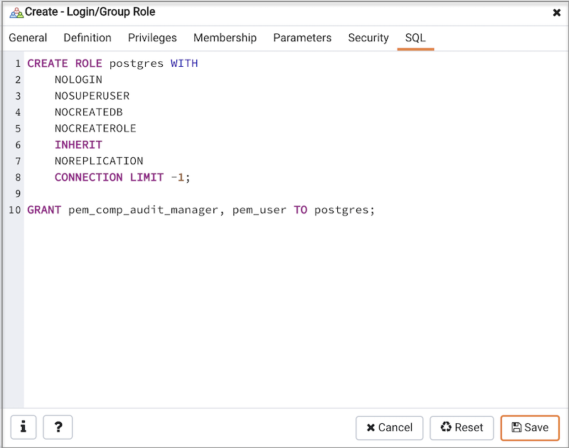

You can use the `Login/Group Role` dialog to allow a role with limited privileges to access PEM features such as the Audit Manager, Capacity Manager, or SQL Profiler. PEM pre-defined roles allow access to PEM functionality; roles that are assigned membership in these roles can access the associated feature.

When defining a user, use the `Membership` tab to specify the roles in which the new user is a member. The new user will share the privileges associated with each role in which it is a member. For a user to have access to PEM extended functionality, the role must be a member of the pem\_user role and the pre-defined role that grants access to the feature. Use the `Roles` field to select pre-defined role names from a drop down list.

Check the checkbox to the right of the role name to allow administrative access to the functionality.

The `SQL` tab displays the SQL command that the server will execute when you click `Save`.

The examples shown above creates a login role named `acctg_clerk` that will have access to the Audit Manager; the role can make unlimited connections to the server at any given time.

You can use PEM pre-defined roles to allow access to the functionality listed in the table below:

| Value                               | Parent Role                     | Description                                                                                                                                                                                                                                                                                                 |
|-------------------------------------|---------------------------------|-------------------------------------------------------------------------------------------------------------------------------------------------------------------------------------------------------------------------------------------------------------------------------------------------------------|
| pem\_super\_admin                   |                                 | Role for administration/management/configuration of all the objects within Postgres Enterprise Manager console.                                                                                                                                                                                             |
| pem\_admin                          | pem\_super\_admin               | Role for administration/management/configuration of all the agents, servers, or monitored objects that are visible to a user having pem\_admin role. A user with pem\_admin role can view and manage only those objects where this role has been mentioned in the Team field under the server's properties. |
| pem\_user                           |                                 | Role for having read-only access to all the agents, servers, or monitored objects that are visible to a user having pem\_user role. A user with pem\_user role can view only those objects where this role has been mentioned in the Team field under the server's properties.                              |
| pem\_config                         | pem\_admin                      | Role for configuration management of Postgres Enterprise Manager.                                                                                                                                                                                                                                           |
| pem\_component                      | pem\_admin                      | Role to run/execute all wizard/dialog based components.                                                                                                                                                                                                                                                     |
| pem\_rest\_api                      | pem\_admin                      | Role to access the REST API.                                                                                                                                                                                                                                                                                |
| pem\_server\_service\_manager       | pem\_admin                      | Role for allowing to restart/reload the monitored database server (if server-id provided).                                                                                                                                                                                                                  |
| pem\_manage\_schedule\_task         | pem\_admin                      | Role to configure the schedule tasks.                                                                                                                                                                                                                                                                       |
| pem\_manage\_alert                  | pem\_admin                      | Role for managing/configuring alerts, and its templates.                                                                                                                                                                                                                                                    |
| pem\_config\_alert                  | pem\_config, pem\_manage\_alert | Role for configuring the alerts on any monitored objects.                                                                                                                                                                                                                                                   |
| pem\_manage\_probe                  | pem\_admin                      | Role to create, update, delete the custom probes, and change custom probe configuration.                                                                                                                                                                                                                    |
| pem\_config\_probe                  | pem\_config, pem\_manage\_probe | Role for probe configuration (history retention, execution frequency, enable/disble the probe) on all visible monitored objects.                                                                                                                                                                            |
| pem\_database\_server\_registration | pem\_admin                      | Role to register a database server.                                                                                                                                                                                                                                                                         |
| pem\_comp\_postgres\_expert         | pem\_component                  | Role to run the Postgres Expert.                                                                                                                                                                                                                                                                            |
| pem\_comp\_auto\_discovery          | pem\_component                  | Role to run the Auto discovery of a database server dialog.                                                                                                                                                                                                                                                 |
| pem\_comp\_log\_analysis\_expert    | pem\_component                  | Role to run the Log Analysis Expert.                                                                                                                                                                                                                                                                        |
| pem\_comp\_sqlprofiler              | pem\_component                  | Role to run the SQL Profiler.                                                                                                                                                                                                                                                                               |
| pem\_manage\_efm                    | pem\_admin                      | Role to manage Failover Manager functionalities.                                                                                                                                                                                                                                                            |
| pem\_comp\_capacity\_manager        | pem\_component                  | Role to run the Capacity Manager.                                                                                                                                                                                                                                                                           |
| pem\_comp\_log\_manager             | pem\_component                  | Role to run the Log Manager.                                                                                                                                                                                                                                                                                |
| pem\_comp\_audit\_manager           | pem\_component                  | Role to run the Audit Manager.                                                                                                                                                                                                                                                                              |
| pem\_comp\_tuning\_wizard           | pem\_component                  | Role to run the Tuning Wizard.                                                                                                                                                                                                                                                                              |
| pem\_comp\_bart                     | pem\_component                  | Role to configure and manage BART server.                                                                                                                                                                                                                                                                   |

Note

The difference between pem\_admin role and pem\_super\_admin role is that a user with pem\_admin role can view and manage only those objects where the role has been mentioned in the Team field under the server's properties, while a user with pem\_super\_admin role can view and manage all the objects within Postgres Enterprise Manager console.

