---
0&nbsp;&nbsp;&nbsp;&nbsp;&nbsp;&nbsp;&nbsp;&nbsp;&nbsp;&nbsp;Postgres Enterprise Manager
---

Welcome to Postgres Enterprise Manager (PEM). Postgres Enterprise Manager (PEM) consists of components that provide the management and analytical functionality for your EDB Postgres Advanced Server or PostgreSQL database. PEM is based on the Open Source pgAdmin IV project.

pgAdmin is the leading Open Source management tool for Postgres, the world's most advanced Open Source database. pgAdmin IV is a comprehensive [database](http://www.postgresql.org) design and management system. pgAdmin 4 is designed to meet the needs of both novice and experienced Postgres users alike, providing a powerful graphical interface that simplifies the creation, maintenance and use of database objects.

Contents:


---
1&nbsp;&nbsp;&nbsp;&nbsp;&nbsp;&nbsp;&nbsp;&nbsp;&nbsp;&nbsp;PEM Getting Started
---

<div id="toc_pem_getting_started" class="registered_link"></div>

You can use either a graphical installer or an RPM package to install the PEM server and PEM agent; for detailed installation instructions, please see the Postgres Enterprise Manager Installation Guide, available at [www.enterprisedb.com](http://www.enterprisedb.com).

Contents:


---
1.1&nbsp;&nbsp;&nbsp;&nbsp;&nbsp;&nbsp;&nbsp;&nbsp;&nbsp;&nbsp;PEM Architecture
---

<div id="pem_architecture" class="registered_link"></div>

Postgres Enterprise Manager (PEM) is a tool designed to monitor and manage multiple Postgres servers through a single GUI interface. PEM is capable of monitoring the following areas of the infrastructure:

Note: The term Postgres refers to either PostgreSQL or EDB Postgres Advanced Server.

-   **Hosts** - One or more servers (physical or virtual) and their operating systems.
-   **Servers** - One or more instances of PostgreSQL or EDB Postgres Advanced Server running on a host.
-   **Databases** - One or more databases and the schema objects (tables, indexes, etc.) within them.

PEM consists of a number of individual software components; the individual components are described below.

-   **PEM Server** - The PEM Server is used as the data repository for monitoring data and as a server to which both Agents and Clients connect. The PEM server consists of an instance of PostgreSQL and an associated database for storage of monitoring data, and a server that provides web services.
-   **PEM Agent** - The PEM Agent is responsible for executing tasks and reporting statistics from the Agent host and monitored Postgres instances to the PEM server. A single PEM Agent can monitor multiple installed instances of Postgres that reside on one or many hosts.
-   **PEM Web Client** - The PEM web interface allows you to manage and monitor Postgres servers and utilize PEM extended functionality. The web interface software is installed with the PEM server and is accessed via any supported web browser.
-   **SQL Profiler** - SQL Profiler is a Postgres server plugin to record the monitoring data and query plans to be analysed by the SQL Profiler tool in PEM. This is an optional component of PEM, but the plugin must be installed into each instance of Postgres with which you wish to use the SQL Profiler tool. The SQL Profiler may be used with any supported version of an EnterpriseDB distribution of a PostgreSQL server or Advanced Server (not just those managed through the PEM server). See the [PEM SQL Profiler Configuration Guide](/pem/latest/) for details and supported versions.

**PEM architecture**

The following architectural diagram illustrates the relationships between the PEM server, clients, and managed as well as unmanaged Postgres servers.

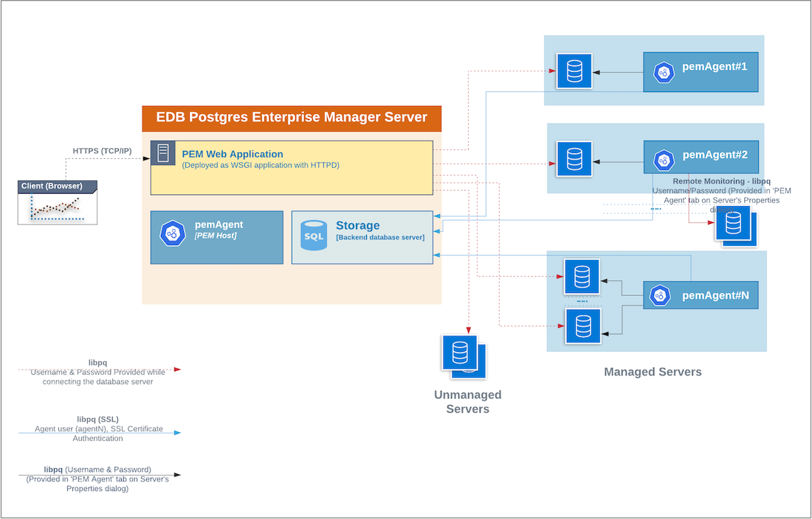

### **The PEM Server**

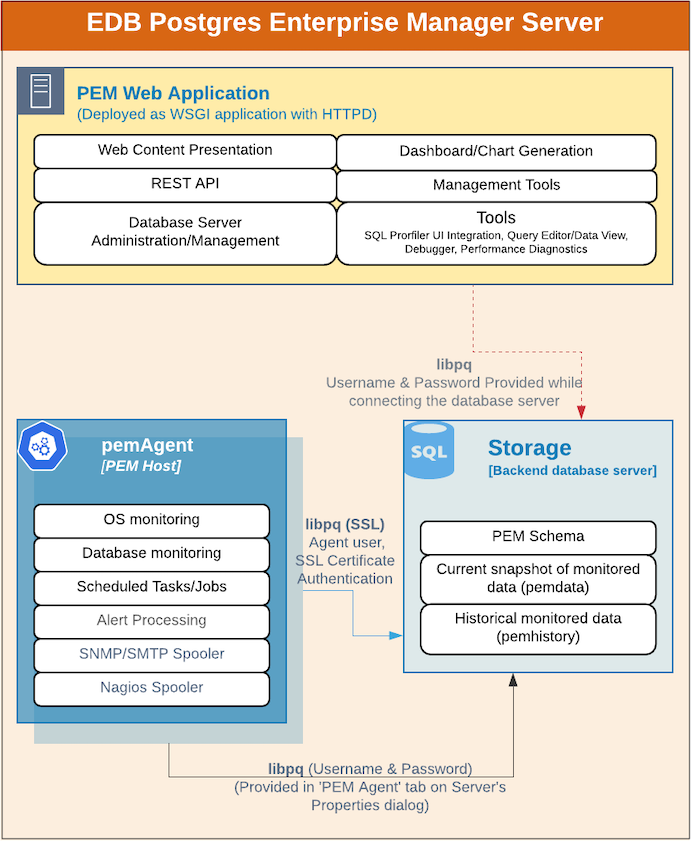

The PEM server consists of an instance of Postgres, an instance of the Apache web-server providing web services to the client, and a PEM Agent. PEM utilizes a server-side cryptographic plugin to generate authentication certificates.

The instance of Postgres (a database server) and an instance of the Apache web-server ( HTTPD) can be on the same host or on separate hosts.

-   **Postgres Instance (Database server)** - This is the backend database server. It hosts a database named **pem** which acts as the repository for PEM Server. The **pem** database contains several schemas that store metric data collected from each monitored host, server, and database.
    -   **pem** - This schema is the core of the PEM application. It contains the definitions of configuration functions, tables, or views required by the application.
    -   **pemdata** - This schema stores the current snapshot of the monitored data.
    -   **pemhistory** - This schema stores the historical monitored data.
-   **Apache Web Server (HTTPD)** - The PEM Web Application is deployed as a WSGI application with HTTPD to provide web services to the client. It is comprised of the following:
    -   **Web content presentation** - The presentation layer is created by the Web Application (for example Browser, login page,..).
    -   **Rest API** - The REST API allows integration with other apps and services.
    -   **Database Server Administration/Management** - Database server administration and management activities like CREATE, ALTER, DROP, etc. can be performed for managed as well as unmanaged servers.
    -   **Dashboard/Chart generation** - Internally, the web application includes functionality that generates Dashboards and Charts.
    -   **Management Tools** - The Audit Manager, Capacity Manager, Log Manager, Postgres Expert, Postgres Log Analysis Expert, and the Tuning Wizard are made available in the Web Application.
    -   Other tools provide functionality on managed or unmanaged servers:
        -   **SQL Profiler UI Integration** - SQL Profiler generates easily analyzed traces of session content.
        -   **Query Editor/Data View** - The Query editor allows you to query, edit, and view data.
        -   **Debugger** - The Debugger helps you debug queries.
        -   **Performance Diagnostics** - Performance Diagnostics help you analyze the performance of Advanced Server.

We recommended that you use a dedicated machine to host production instances of the PEM backend database. The host may be subject to high levels of data throughput, depending on the number of database servers that are being monitored and the workloads the servers are processing.

### **The PEM Agent**

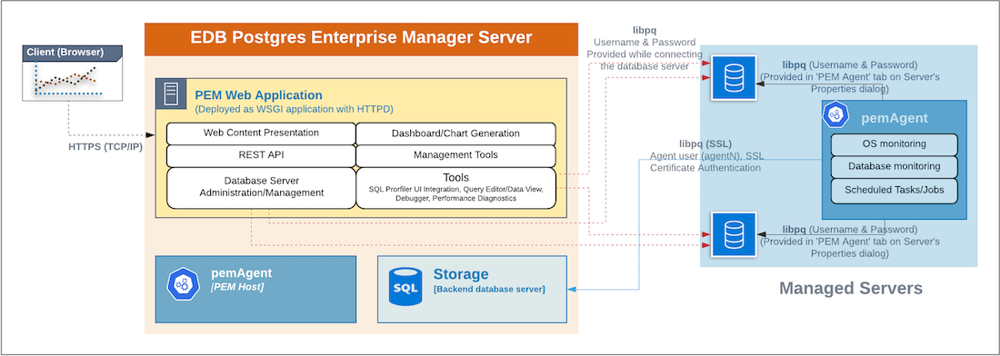

The PEM Agent is responsible for the collection of monitoring data from the machine and operating system, as well as from each of the Postgres instances to which they are bound. Each PEM Agent can monitor one physical or virtual machine and is capable of monitoring multiple database servers locally - installed on the same system, or remotely - installed on other systems. It is also responsible for executing other tasks that may be scheduled by the user (for example, server shutdowns, SQL Profiler traces, user-defined jobs).

A PEM Agent is installed by default on the PEM Server along with the installation of the PEM Server. It is generally referred to as a PEM Agent on the PEM Host. Separately, the PEM Agent can also be installed on the other servers hosting the Postgres instances to be monitored using PEM.

Whether monitoring locally or remotely, the PEM Agent connects to the PEM Server using PostgreSQL’s libpq, using SSL certificate-based authentication. The PEM Agent installer in Windows and pemworker CLI in Linux is responsible for registering each agent with the PEM Server, and generating and installing the required certificates.

Please note that there is only one-way traffic between the PEM Agent and PEM Server; the PEM Agent always connects to the PEM Server.

The PEM Agent must be able to connect to each database server that it monitors. This connection is made over a TCP/IP connection (or optionally a Unix Domain Socket on Unix hosts), and may optionally use SSL. The user must configure the connection and authentication to the monitored server.

Once configured, each agent collects statistics and other information on the host and each database server and database that it monitors. Each piece of information is known as a **metric** and is collected by a **probe**. Most probes will collect multiple metrics at once for efficiency. Examples of the metrics collected include:

-   Disk I/O statistics
-   Network statistics
-   Database server version string
-   Database server configuration option (GUC) values
-   Table access statistics
-   Table and index sizes

A list of PEM probes can be found [here](../04_toc_pem_features/12_pem_manage_probes/03_pem_probe_config/01_pem_probes/#pem_probes).

By default, the PEM Agent bound to the database server collects the OS/Database monitoring statistics and also runs any scheduled tasks/jobs for that particular database server, storing data in the pem database on the PEM server.

The Alert processing, SNMP/SMTP spoolers, and Nagios Spooler data is stored in the pem database on the PEM server and is then processed by the PEM Agent on the PEM Host by default. However, processing by other PEM Agents can be enabled by adjusting the SNMP/SMTP and Nagios parameters of the PEM Agents.

To see more information about these parameters see [Server Configuration](../04_toc_pem_features/02_pem_server_config/#pem_server_config).

### **The PEM Web Client**

The PEM client is a web-based application that runs in supported browsers. The client's web interface connects to the PEM server and allows direct management of managed or unmanaged servers, and the databases and schemas that reside on them.

The client allows you to use PEM functionality that makes use of the data logged on the server through features such as the dashboards, the Postgres Log Analysis Expert, and Capacity Manager.

### **The SQL Profiler Plugin**

You are not required to install the SQL Profiler plugin on every server, but you must install and configure the plugin on each server on which you wish to use the SQL Profiler. You may also want to install and configure SQL Profiler on un-monitored development servers. For ad-hoc use also, you may temporarily install the SQL Profiler plugin.

The plugin is installed with the EDB Postgres Advanced Server distribution but must be installed separately for use with PostgreSQL. The SQL Profiler installer is available from the [EnterpriseDB website](http://www.enterprisedb.com/download-postgres-enterprise-manager).

SQL Profiler may be used on servers that are not managed through PEM, but to perform scheduled traces, a server must have the plugin installed, and must be managed by an installed and configured PEM agent.

For more information about using SQL Profiler, see the [PEM SQL Profiler Configuration Guide](/pem/latest/)

---
1.2&nbsp;&nbsp;&nbsp;&nbsp;&nbsp;&nbsp;&nbsp;&nbsp;&nbsp;&nbsp;PEM Server Logon
---

<div id="pem_server_logon" class="registered_link"></div>

The PEM web interface uses Apache to connect to the PEM server on port 8080 of the IP address on which the PEM server is installed. To connect to PEM, open your browser of choice, and navigate to:

> *&lt;ip_address_of_PEM_host>:8080/pem*

Where `ip_address_of_PEM_host` specifies the IP address of the host of the PEM server.

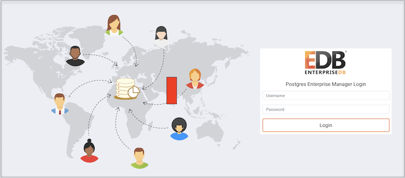

Use the fields on the Login window to authenticate yourself with the PEM server:

-   Provide the name of a `pem` database user in the `Username` field. Users logon to PEM using user credentials setup as `login roles` on the PostgreSQL database used by the PEM server. By default, the `postgres` superuser account will be used for the initial logon.

    We strongly recommend you create an individual role for each user. You can create a login role with the `CREATE ROLE` SQL statement, or by defining a role with the PEM client `Create - Login/Group Role` dialog. To access the dialog, connect to the PEM server database; right-click the `Login/Group Roles` node in the tree control, and select `New Login Role...` from the `Create` pull-aside menu. Roles must be granted permissions and role memberships to properly use PEM:

    -   users that are members of the `pem_user` role are essentially `read-only` users; they may view dashboards, change the database server connection options, but they will not be able to install agents or configure the server directory, alerts, probes, or run any of the wizard/dialog based components of PEM.
    -   users that are members of the `pem_admin` role have the same read permissions as members of the pem_user role, plus sufficient privileges to configure the servers, directory, alerts and probes.
    -   `administrative` users must be added to the pem_admin role and explicitly granted the create role privilege. in addition to the permissions granted through membership in the pem_admin role, the create role privilege allows an administrator to create additional pem users, and to install and register new agents.
    -   users can be member of one of the [PEM roles](04_pem_roles/#pem_roles) to give right to run a particular component, to manage, or to configure PEM.

-   Provide the password associated with the user in the `Password` field.

After providing your credentials, click `Login` to connect to the PEM client. PEM opens, displaying the `Global Overview` Dashboard:

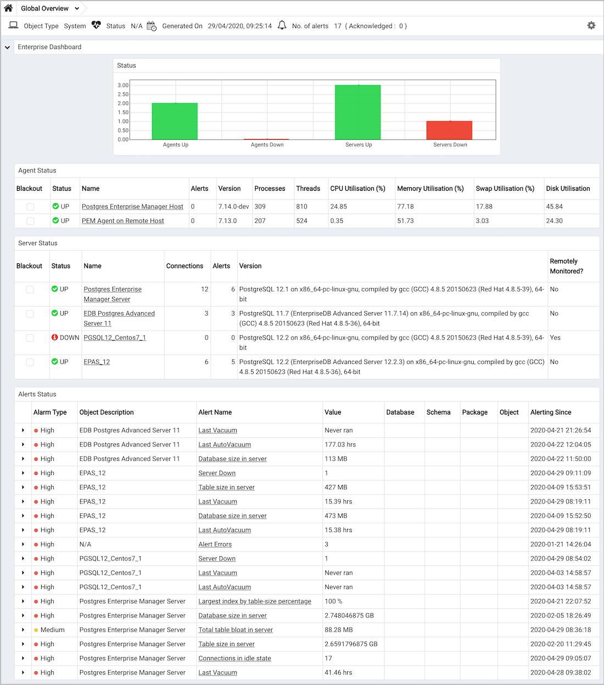

---
1.3&nbsp;&nbsp;&nbsp;&nbsp;&nbsp;&nbsp;&nbsp;&nbsp;&nbsp;&nbsp;Managing Configuration Settings
---

<div id="pem_managing_configuration_settings" class="registered_link"></div>

There are multiple configuration files that are read at startup by Postgres Enterprise Manager. These are as follows:

-   `config.py`: This is the main configuration file, and should not be modified. It can be used as a reference for configuration settings, that may be overridden in one of the following files.
-   `config_distro.py`: This file is read after `config.py` and is intended for packagers to change any settings that are required for their Postgres Enterprise Manager distribution. This may typically include certain paths and file locations. This file is optional, and may be created by packagers in the same directory as `config.py` if needed.
-   `config_local.py`: This file is read after `config_distro.py` and is intended for end users to change any default or packaging specific settings that they may wish to adjust to meet local preferences or standards.This file is optional, and may be created by users in the same directory as `config.py` if needed.

The default `config.py` file is shown below for reference:

<div class="literalinclude" language="python">

../../web/config.py

</div>

---
1.4&nbsp;&nbsp;&nbsp;&nbsp;&nbsp;&nbsp;&nbsp;&nbsp;&nbsp;&nbsp;Roles for managing PEM
---

<div id="pem_roles" class="registered_link"></div>

You can use the `Login/Group Role` dialog to allow a role with limited privileges to access PEM features such as the Audit Manager, Capacity Manager, or SQL Profiler. PEM pre-defined roles allow access to PEM functionality; roles that are assigned membership in these roles can access the associated feature.


When defining a user, use the `Membership` tab to specify the roles in which the new user is a member. The new user will share the privileges associated with each role in which it is a member. For a user to have access to PEM extended functionality, the role must be a member of the pem_user role and the pre-defined role that grants access to the feature. Use the `Roles` field to select pre-defined role names from a drop down list.

Check the checkbox to the right of the role name to allow administrative access to the functionality.

The `SQL` tab displays the SQL command that the server will execute when you click `Save`.


The examples shown above creates a login role named `acctg_clerk` that will have access to the Audit Manager; the role can make unlimited connections to the server at any given time.

You can use PEM pre-defined roles to allow access to the functionality listed in the table below:

| Value                            | Parent Role                  | Description                                                                                                                                                                                                                                                                                               |
| -------------------------------- | ---------------------------- | --------------------------------------------------------------------------------------------------------------------------------------------------------------------------------------------------------------------------------------------------------------------------------------------------------- |
| pem_super_admin                  |                              | Role for administration/management/configuration of all the objects within Postgres Enterprise Manager console.                                                                                                                                                                                           |
| pem_admin                        | pem_super_admin              | Role for administration/management/configuration of all the agents, servers, or monitored objects that are visible to a user having pem_admin role. A user with pem_admin role can view and manage only those objects where this role has been mentioned in the Team field under the server's properties. |
| pem_user                         |                              | Role for having read-only access to all the agents, servers, or monitored objects that are visible to a user having pem_user role. A user with pem_user role can view only those objects where this role has been mentioned in the Team field under the server's properties.                              |
| pem_config                       | pem_admin                    | Role for configuration management of Postgres Enterprise Manager.                                                                                                                                                                                                                                         |
| pem_component                    | pem_admin                    | Role to run/execute all wizard/dialog based components.                                                                                                                                                                                                                                                   |
| pem_rest_api                     | pem_admin                    | Role to access the REST API.                                                                                                                                                                                                                                                                              |
| pem_server_service_manager       | pem_admin                    | Role for allowing to restart/reload the monitored database server (if server-id provided).                                                                                                                                                                                                                |
| pem_manage_schedule_task         | pem_admin                    | Role to configure the schedule tasks.                                                                                                                                                                                                                                                                     |
| pem_manage_alert                 | pem_admin                    | Role for managing/configuring alerts, and its templates.                                                                                                                                                                                                                                                  |
| pem_config_alert                 | pem_config, pem_manage_alert | Role for configuring the alerts on any monitored objects.                                                                                                                                                                                                                                                 |
| pem_manage_probe                 | pem_admin                    | Role to create, update, delete the custom probes, and change custom probe configuration.                                                                                                                                                                                                                  |
| pem_config_probe                 | pem_config, pem_manage_probe | Role for probe configuration (history retention, execution frequency, enable/disble the probe) on all visible monitored objects.                                                                                                                                                                          |
| pem_database_server_registration | pem_admin                    | Role to register a database server.                                                                                                                                                                                                                                                                       |
| pem_comp_postgres_expert         | pem_component                | Role to run the Postgres Expert.                                                                                                                                                                                                                                                                          |
| pem_comp_auto_discovery          | pem_component                | Role to run the Auto discovery of a database server dialog.                                                                                                                                                                                                                                               |
| pem_comp_log_analysis_expert     | pem_component                | Role to run the Log Analysis Expert.                                                                                                                                                                                                                                                                      |
| pem_comp_sqlprofiler             | pem_component                | Role to run the SQL Profiler.                                                                                                                                                                                                                                                                             |
| pem_manage_efm                   | pem_admin                    | Role to manage Failover Manager functionalities.                                                                                                                                                                                                                                                          |
| pem_comp_capacity_manager        | pem_component                | Role to run the Capacity Manager.                                                                                                                                                                                                                                                                         |
| pem_comp_log_manager             | pem_component                | Role to run the Log Manager.                                                                                                                                                                                                                                                                              |
| pem_comp_audit_manager           | pem_component                | Role to run the Audit Manager.                                                                                                                                                                                                                                                                            |
| pem_comp_tuning_wizard           | pem_component                | Role to run the Tuning Wizard.                                                                                                                                                                                                                                                                            |
| pem_comp_bart                    | pem_component                | Role to configure and manage BART server.                                                                                                                                                                                                                                                                 |

<div class="note">

<div class="title">

Note

</div>

The difference between pem_admin role and pem_super_admin role is that a user with pem_admin role can view and manage only those objects where the role has been mentioned in the Team field under the server's properties, while a user with pem_super_admin role can view and manage all the objects within Postgres Enterprise Manager console.

</div>

---
1.5&nbsp;&nbsp;&nbsp;&nbsp;&nbsp;&nbsp;&nbsp;&nbsp;&nbsp;&nbsp;The Group Dialog
---

<div id="group_dialog" class="registered_link"></div>

Use the `Group` dialog to add a new group to the PEM client tree control. You can use a group to simplify management of related servers or agents.

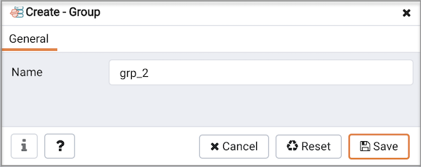

Use the `Name` field to specify a name that will identify the group in the `PEM` browser tree control.

-   Click the `Save` button to save work.
-   Click the `Cancel` button to exit without saving work.
-   Click the `Reset` button to restore configuration parameters.

To add a server or agent to a group, right-click on the name of a server or agent, and select `Properties...` to open the properties dialog. Then, use the drop-down listbox in the `Group` field to select the group in which the object should reside.

---
1.6&nbsp;&nbsp;&nbsp;&nbsp;&nbsp;&nbsp;&nbsp;&nbsp;&nbsp;&nbsp;Automatic Discovery of Servers
---

<div id="auto_discovery_dialog" class="registered_link"></div>

Use the `Auto Discovery` dialog to instruct a PEM agent to locate database servers that reside on a monitored system, and add a binding that allows the agent to monitor the selected server.

To enable auto discovery for a specific agent, you must enable the `Server Auto Discovery` probe. To access the `Manage Probes` tab, highlight the name of a PEM agent in the PEM client tree control, and select `Manage Probes...` from the `Management` menu. When the Manage Probes tab opens, confirm that the slider control in the `Enabled?` column is set to `Yes`.

To open the `Auto Discovery` dialog, highlight the name of a PEM agent in the PEM client tree control, and select `Auto Discovery...` from the `Management` menu.


When the `Auto Discovery` dialog opens, the `Discovered Database Servers` box will display a list of servers that are not currently monitored by a PEM agent. Check the box next to a server name to display information about the server in the `Server Connection Details` box, and provide any missing information to bind the server to the currently selected agent in the `Agent Connection Details` box.

Use the `Select All` button to select the box next to all of the displayed servers, or `Unselect All` to unselect all of the boxes to the left of the server names.

The fields in the `Server Connection Details` box provide information about the server that PEM will monitor:

-   Accept or modify the name of the monitored server in the `Name` field. The specified name will be displayed in the tree control of the PEM client.
-   Use the `Server group` drop-down listbox to select the server group under which the server will be displayed in the PEM client tree control.
-   Use the `Host name/address` field to specify the IP address of the monitored server.
-   The `Port` field displays the port that is monitored by the server; this field may not be modified.
-   Provide the name of the service in the `Service ID` field. Please note that the service name must be provided to enable some PEM functionality.
-   By default, the `Maintenance database` field indicates that the selected server uses a `postgres` maintenance database. Customize the content of the `Maintenance database` field for your installation.

The fields in the `Agent Connection Details` box specify the properties that the PEM agent will use when connecting to the server:

-   The `Host` field displays the IP address that will be used for the PEM agent binding.
-   The `Username` field displays the name that will be used by the PEM agent when connecting to the selected server.
-   The `Password` field displays the password associated with the specified user name.
-   Use the drop-down listbox in the `SSL mode` field to specify your SSL connection preferences.

When you've finished specifying the connection properties for the servers that you are binding for monitoring, click the `OK` button to save the properties. Click `Cancel` to exit without preserving any changes.

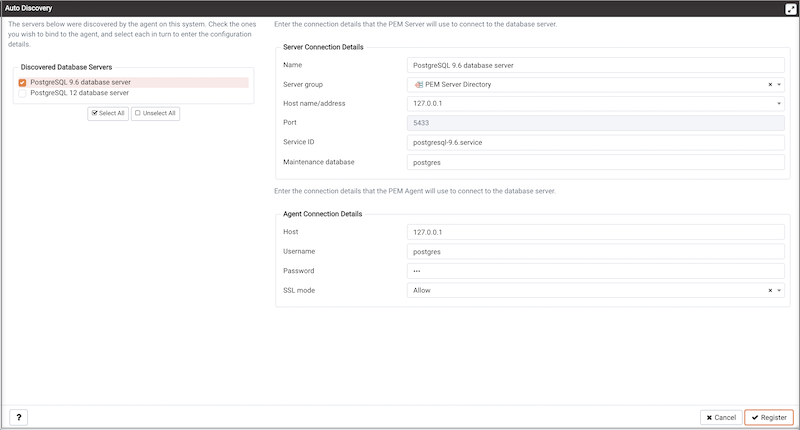

The dialog shown above displays the values required to bind an instance of Advanced Server for monitoring by PEM.

---
1.7&nbsp;&nbsp;&nbsp;&nbsp;&nbsp;&nbsp;&nbsp;&nbsp;&nbsp;&nbsp;Defining a server
---

<div id="pem_define_connection" class="registered_link"></div>

Use the `Create - Server` dialog to describe a new server connection, bind the server to a PEM agent, and display the server to the PEM tree control.

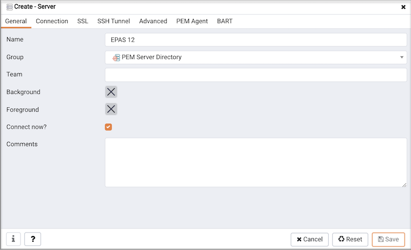

Use the fields on the `General` tab to describe the general properties of the server:

-   Use the `Name` field to specify a user-friendly name for the server. The name specified will identify the server in the PEM client tree control.
-   You can use [groups](05_group_dialog/#group_dialog) to organize your servers and agents in the PEM client tree control. Using groups can help you manage large numbers of servers more easily. For example, you may want to have a production group, a test group, or LAN specific groups. Use the `Group` drop-down listbox to select the group in which the new server will be displayed.
-   Use the `Team` field to specify a PostgreSQL role name. Only PEM users who are members of this role, who created the server initially, or have superuser privileges on the PEM server will see this server when they logon to PEM. If this field is left blank, all PEM users will see the server.
-   Use the `Background` color selector to select the color that will be displayed in the PEM tree control behind database objects that are stored on the server.
-   Use the `Foreground` color selector to select the font color of labels in the PEM tree control for objects stored on the server.
-   Check the box next to `Connect now?` to instruct PEM to attempt a connection to the database server when you click the Save button on the Create - Server dialog. Leave the `Connect now?` checkbox unchecked if you do not want to establish a connection to the server immediately. If you do not select the `Connect now?` option, the connection parameters are not validated until you attempt a connection.
-   Provide notes about the server in the `Comments` field.

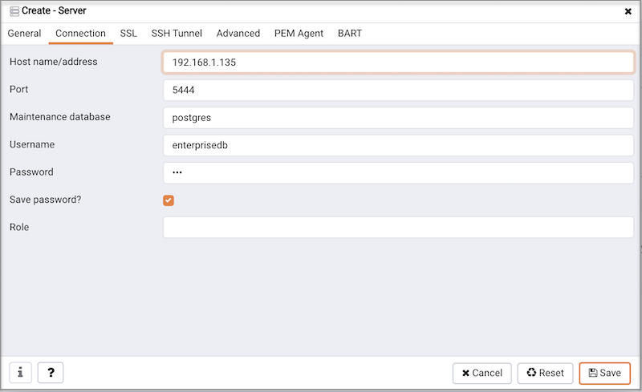

Use fields on the `Connection` tab to specify connection details for the server:

-   Specify the IP address of the server host, or the fully qualified domain name in the `Host name/address` field. On Unix based systems, the address field may be left blank to use the default PostgreSQL Unix Domain Socket on the local machine, or may be set to an alternate path containing a PostgreSQL socket. If you enter a path, the path must begin with a "/".
-   Specify the port number of the host in the `Port` field.
-   Use the `Maintenance database` field to specify the name of the initial database that PEM will connect to, and that will be expected to contain the [pgAgent](../10_pgagent/#pgagent) schema and adminpack objects if installed (both are optional). On an Advanced Server database, the maintenance database is named 'edb'. On PostgreSQL 8.1 and above, the maintenance DB for PostgreSQL is named 'postgres'; on earlier versions 'template1' is often used, though it is preferrable to create a 'postgres' database for this purpose to avoid cluttering the template database.
-   Specify the name that will be used when authenticating with the server in the `Username` field.
-   Provide the password associated with the specified user in the `Password` field.
-   Check the box next to `Save password?` to instruct the PEM server to save the password in encrypted format on the PEM server backend database server for later reuse. Password will be stored per server per user basis, hence - it won't be shared with other team members. To remove a password, disconnect from the server, click on the 'Clear Saved Password' menu item under Object/Context menu of the database server.
-   Use the `Role` field to specify the name of the role that is assigned the privileges that the client should use after connecting to the server. This allows you to connect as one role, and then assume the permissions of another role when the connection is established (the one you specified in this field). The connecting role must be a member of the role specified.

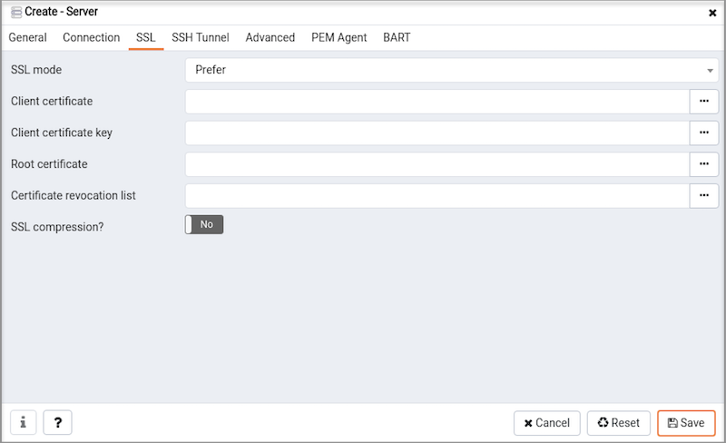

Use the fields on the `SSL` tab to configure SSL.

-   Use the drop-down list box in the `SSL mode` field to select the type of SSL connection the server should use. For more information about using SSL encryption, see [Section 33.18 of the Postgres documentation](https://www.postgresql.org/docs/current/static/libpq-ssl.html).

You can use the platform-specific File manager dialog to upload files that support SSL encryption to the server. To access the File manager dialog, click the icon that is located to the right of each of the following fields.

-   Use the `Client certificate` field to specify the file containing the client SSL certificate. This file will replace the default `~/.postgresql/postgresql.crt` if PEM is installed in Desktop mode, and `<STORAGE_DIR>/<USERNAME>/.postgresql/postgresql.crt` if PEM is installed in Web mode. This parameter is ignored if an SSL connection is not made.
-   Use the `Client certificate key` field to specify the file containing the secret key used for the client certificate. This file will replace the default `~/.postgresql/postgresql.key` if PEM is installed in Desktop mode, and `<STORAGE_DIR>/<USERNAME>/.postgresql/postgresql.key` if PEM is installed in Web mode. This parameter is ignored if an SSL connection is not made.
-   Use the `Root certificate` field to specify the file containing the SSL certificate authority. This file will replace the default `~/.postgresql/root.crt`. This parameter is ignored if an SSL connection is not made.
-   Use the `Certificate revocation list` field to specify the file containing the SSL certificate revocation list. This list will replace the default list, found in `~/.postgresql/root.crl`. This parameter is ignored if an SSL connection is not made.
-   When `SSL compression?` is set to `True`, data sent over SSL connections will be compressed. The default value is `False` (compression is disabled). This parameter is ignored if an SSL connection is not made.

`WARNING:` certificates, private keys, and the revocation list are stored in the per-user file storage area on the server, which is owned by the user account under which the PEM server process is run. This means that administrators of the server may be able to access those files; appropriate caution should be taken before choosing to use this feature.


Use the fields on the `SSH Tunnel` tab to configure SSH Tunneling. You can use a tunnel to connect a database server (through an intermediary proxy host) to a server that resides on a network to which the client may not be able to connect directly.

-   Set `Use SSH tunneling` to `Yes` to specify that PEM should use an SSH tunnel when connecting to the specified server.
-   Specify the name or IP address of the SSH host (through which client connections will be forwarded) in the `Tunnel host` field.
-   Specify the port of the SSH host (through which client connections will be forwarded) in the `Tunnel port` field.
-   Specify the name of a user with login privileges for the SSH host in the `Username` field.
-   Specify the type of authentication that will be used when connecting to the SSH host in the `Authentication` field.
    -   Select `Password` to specify that PEM will use a password for authentication to the SSH host. This is the default.
    -   Select `Identity file` to specify that PEM will use a private key file when connecting.
-   If the SSH host is expecting a private key file for authentication, use the `Identity file` field to specify the location of the key file.
-   If the SSH host is expecting a password, use the `Password` field to specify the password, or if an identity file is being used, the passphrase.


Use fields on the `Advanced` tab to specify details that are used to manage the server:

-   Specify the IP address of the server host in the `Host Address` field.
-   Use the `DB restriction` field to specify a SQL restriction that will be used against the [pg_database](http://www.postgresql.org/docs/current/interactive/catalog-pg-database.html) table to limit the databases displayed in the tree control. For example, you might enter: `'live_db', 'test_db'` to instruct the PEM browser to display only the live_db and test_db databases.
-   Use the `Password file` field to specify the location of a password file (.pgpass). The .pgpass file allows a user to login without providing a password when they connect, and it must be present on the PEM server. For more information, see [Section 33.15 of the Postgres documentation](http://www.postgresql.org/docs/current/static/libpq-pgpass.html). Please note: Use of a password file is only supported when PEM is using libpq v10.0 or later to connect to the server.
-   Use the `Service ID` field to specify parameters to control the database service process. For servers that are stored in the Enterprise Manager directory, enter the service ID. On Windows machines, this is the identifier for the Windows service. On \*nix machines, this is the name of the init script used to start the server in /etc/init.d. An example of an ID on all platforms is `postgresql-9.0`. For local servers, the setting is operating system dependent:
    -   If the PEM client is running on a Windows machine, it can control the postmaster service if you have enough access rights. Enter the name of the service. In case of a remote server, it must be prepended by the machine name (e.g. PSE1\\pgsql-8.0). PEM will automatically discover services running on your local machine.
    -   If the PEM client is running on a Unix machine, it can control processes running on the local machine if you have enough access rights. Enter a full path and needed options to access the pg_ctl program. When executing service control functions, PEM will append status/start/stop keywords to this. For example: `sudo /usr/local/pgsql/bin/pg_ctl -D /data/pgsql`
-   If the server is a member of a [Failover Manager](../04_toc_pem_features/19_monitoring_a_failover_manager_cluster/#monitoring_a_failover_manager_cluster) cluster, you can use PEM to monitor the health of the cluster and to replace the primary node if necessary. To enable PEM to monitor Failover Manager, use the `EFM cluster name` field to specify the cluster name. The cluster name is the prefix of the name of the Failover Manager cluster properties file. For example, if the cluster properties file is named `efm.properties`, the cluster name is `efm`.
-   If you are using PEM to monitor the status of a [Failover Manager](../04_toc_pem_features/19_monitoring_a_failover_manager_cluster/#monitoring_a_failover_manager_cluster) cluster, use the `EFM installation path` field to specify the location of the Failover Manager binary file. By default, the Failover Manager binary file is installed in `/usr/efm-2.x/bin`, where `x` specifies the Failover Manager version.

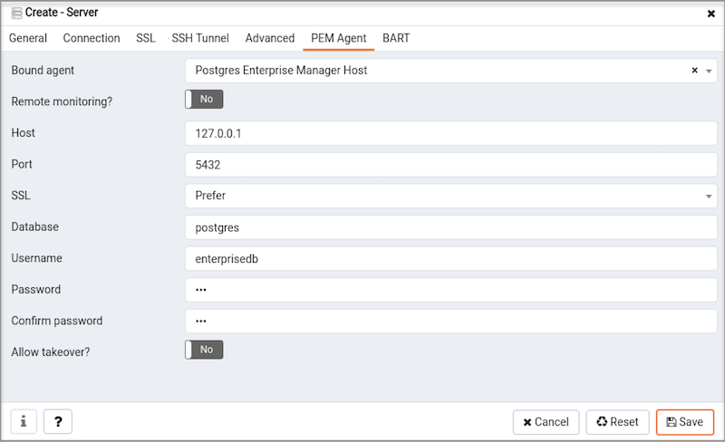

Use fields on the `PEM Agent` tab to specify connection details for the PEM agent:

-   Specify `Yes` in the `Remote monitoring?` field to indicate that the PEM agent does not reside on the same host as the monitored server. When remote monitoring is enabled, agent level statistics for the monitored server will not be available for custom charts and dashboards, and the remote server will not be accessible by some PEM utilities (such as Audit Manager, Capacity Manager, Log Manager, Postgres Expert and Tuning Wizard).
-   Use the drop-down listbox to the right of the `Bound agent` label to select a PEM agent . One agent can monitor multiple Postgres servers.
-   Enter the IP address or socket path that the agent should use when connecting to the database server in the `Host` field. By default, the agent will use the host address shown on the `General` tab. On a Unix server, you may wish to specify a socket path, e.g. `/tmp`.
-   Enter the `Port` number that the agent will use when connecting to the server. By default, the agent will use the port defined on the `Properties` tab.
-   Use the drop-down listbox in the `SSL` field to specify an SSL operational mode; select from require, prefer, allow, disable, verify-ca or verify-full.

| Mode        | Description:                                                                                                                              |
| ----------- | ----------------------------------------------------------------------------------------------------------------------------------------- |
| require     | To require SSL encryption for transactions between the server and the agent.                                                              |
| prefer      | To use SSL encryption between the server and the agent if SSL encryption is available.                                                    |
| allow       | To allow the connection to use SSL if required by the server.                                                                             |
| disable     | To disable SSL encryption between the agent and the server.                                                                               |
| verify-ca   | To require SSL encryption, and to require the server to authenticate using a certificate registered by a certificate authority.           |
| verify-full | To require SSL encryption, and to require the server to authenticate using a certificate registered by a `trusted` certificate authority. |

> For information about using SSL encryption, see [Section 31.17 of the Postgres documentation](http://enterprisedb.com/docs/en/9.6/pg/libpq-ssl.html).

-   Use the `Database` field to specify the name of the Postgres Plus database to which the agent will initially connect.
-   Specify the name of the user that agent should use when connecting to the server in the `User name` field. Note that if the specified user is not a database superuser, then some of the features will not work as expected. If you are using Postgres version 10 or above, you can use the `pg_monitor` role to grant the required privileges to a non-superuser. For information about `pg_monitor` role, see [Default Roles](https://www.postgresql.org/docs/current/default-roles.html).
-   Specify the password that the agent should use when connecting to the server in the `Password` field, and verify it by typing it again in the `Confirm password` field. If you do not specify a password, you will need to configure the authentication for the agent manually; you can use a `.pgpass` file for example.
-   Specify `Yes` in the `Allow takeover?` field to specify that another agent may be signaled (for example, by a fencing script) to monitor the server. This feature allows an agent to take responsibility for the monitoring of the database server if, for example, the server is part of a [high availability](../02_toc_pem_agent/02_pem_agent_binding/02_pem_agent_ha/#pem_agent_ha) failover process.

If you experience connection problems, please visit the [connection problems](11_connect_error/#connect_error) page.

To view the properties of a server, right-click on the server name in the PEM client tree control, and select the `Properties...` option from the context menu. To modify a server's properties, disconnect from the server before opening the `Properties` dialog.

---
1.8&nbsp;&nbsp;&nbsp;&nbsp;&nbsp;&nbsp;&nbsp;&nbsp;&nbsp;&nbsp;Defining and Monitoring Postgres instances on AWS
---

There are two scenarios in which you can monitor a Postgres instance on an AWS host with PEM:

> -   Postgres Instance running on AWS EC2
> -   Postgres Instance running on AWS RDS

### Monitoring a Postgres Instance Running on AWS EC2

After creating a Postgres instance on AWS EC2, you can use the PEM server to register and monitor your instance. The following scenarios are currently supported:

> -   Postgres instance and PEM Agent running on the same AWS EC2 and a PEM Server running on your local machine.
> -   Postgres instance and PEM Agent running on the same local machine and a PEM Server running on AWS EC2.
> -   Postgres instance and PEM Agent running on the same AWS EC2 and a PEM Server running in different AWS EC2.

<div class="note">

<div class="title">

Note

</div>

In the first two scenarios, you must configure the VPN on AWS EC2 , so the AWS EC2 instance can access the `pem` database. Please contact your network administrator to setup the VPN if needed.

</div>

The PEM Agent running on AWS EC2 or on your local machine should be registered to the PEM Server. Please note that when registering the PEM Agent with the PEM Server you should use the hostname of AWS EC2 instance. For more details on registering the PEM Agent see, [PEM Self Registration](../02_toc_pem_agent/07_pem_agent_self_registration/#pem_agent_self_registration).

You can register the Postgres instance running on AWS EC2 on PEM Server using the `Create - Server` dialog. For more details on registering the server using `Create - Server` dialog see, [Define a Server](07_pem_define_connection/#pem_define_connection). Use the `PEM Agent` tab on the `Create - Server` dialog to bind the registered PEM Agent with the Postgres instance.

When the PEM Agent is registered to the PEM Server and your Postgres instance that is running on AWS EC2 is registered to the PEM Server, you can monitor your instance with PEM.

### Monitoring a Postgres Instance Running on AWS RDS

While creating an AWS RDS database, choose `PostgreSQL` when prompted for `Engine options`. After creating a `Postgres(RDS)` instance on AWS, use `Create - Server` dialog to add the `Postgres(RDS)` instance to the PEM Server. Using this dialog you can describe a new server connection, bind the server to a PEM Agent, and display the server to the PEM browser tree control.

For detailed information on the `Create - Server` dialog and configuration details for each tab, see [Define a Server](07_pem_define_connection/#pem_define_connection).

The `PEM Agent` tab in the `Create - Server` dialog must have the `Remote Monitoring` field set to `Yes` to monitor the `Postgres(RDS)` instance on AWS instance using PEM Server.

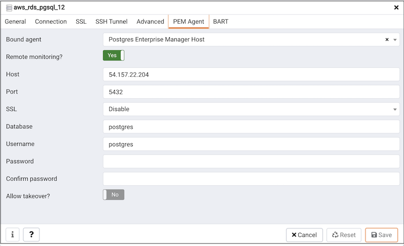

As the PEM Agent will be monitoring the Postgres(RDS) AWS instance remotely, the functionality will be limited as described below:

| **Feature Name**             | **Works with remote PEM Agent** | **Comments**                                                                                                                                                                                   |
| ---------------------------- | ------------------------------- | ---------------------------------------------------------------------------------------------------------------------------------------------------------------------------------------------- |
| Audit Manager                | No                              |                                                                                                                                                                                                |
| Capacity Manager             | Limited                         | There will be no correlation between the database server and operating system metrices.                                                                                                        |
| Log Manager                  | No                              |                                                                                                                                                                                                |
| Manage Alerts                | Limited                         | When you run an alert script on the database server, it will run on the machine where the bound PEM Agent is running, and not on the actual database server machine.                           |
| Manage Charts                | Yes                             |                                                                                                                                                                                                |
| Manage Dashboards            | Limited                         | Some dashboards may not be able to show complete data. For example, the operating system information of the database server will not be displayed as it is not available.                      |
| Manage Probes                | Limited                         | Some of the PEM probes will not return information, and some of the functionalities may be affected. For details about probe functionality, see the [PEM Agent Guide](/pem/latest/pem_agent/). |
| Postgres Expert              | Limited                         | The Postgres Expert will provide partial information as operating system information is not available.                                                                                         |
| Postgres Log Analysis Expert | No                              | The Postgres Log Analysis Expert will not be able to perform an analysis as it is dependent on the logs imported by log manager, which will not work as required.                              |
| Scheduled Tasks              | Limited                         | Scheduled tasks will work only for database server; scripts will run on a remote Agent.                                                                                                        |
| Tuning Wizard                | No                              |                                                                                                                                                                                                |
| System Reports               | Yes                             |                                                                                                                                                                                                |
| Core Usage Reports           | Limited                         | The Core Usage report will not show complete information. For example, the platform, number of cores, and total RAM will not be displayed.                                                     |
| Managing BART                | No                              | BART requires password less authentication between two machines, where database server and BART are installed. An AWS RDS instance doesn't allow to use host access.                           |

---
1.9&nbsp;&nbsp;&nbsp;&nbsp;&nbsp;&nbsp;&nbsp;&nbsp;&nbsp;&nbsp;Connect to server
---

<div id="pem_connect_to_server" class="registered_link"></div>

After defining a server connection, use the `Connect to Server` dialog to authenticate with a server and access the objects stored on the server. To access the dialog, right click on the server name in the PEM client tree control, and select `Connect Server` from the context menu.

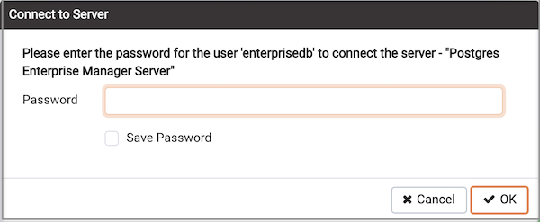

If prompted, provide authentication information for the selected server:

> -   Use the `Password` field to provide the password of the user that is associated with the defined server.
> -   Check the box next to `Save Password` to instruct the server to save the password for future connections; if you save the password, you will not be prompted when reconnecting to the database server with this server definition.

The browser displays a message in a green status bar in the lower right corner when the server connects successfully.

If you receive an error message while attempting a connection, verify that your network is allowing PEM and the host of the database server to communicate. For detailed information about a specific error message, please see the [Connection Error](11_connect_error/#connect_error) help page.

To review or modify connection details, right-click on the name of the server, and select `Properties...` from the context menu.

### Disconnecting from a Server

To disconnect from a server, right-click on the server name in the `Browser` tree control and select Disconnect Server from the context menu. A popup will ask you to confirm that you wish to disconnect the selected server.

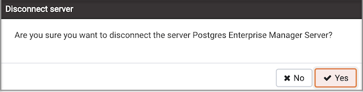

---
1.10&nbsp;&nbsp;&nbsp;&nbsp;&nbsp;&nbsp;&nbsp;&nbsp;&nbsp;&nbsp;Controlling a Server
---

<div id="control_server" class="registered_link"></div>

If you provided a `Service ID` on the `Advanced` tab of the [Server](07_pem_define_connection/#pem_define_connection) property dialogue, the PEM server can control the database service process.

> -   If the PEM client is running on a Windows machine, it can control the postmaster service if you have sufficient access rights. In case of a remote server, the service name must be prepended by the machine name (e.g. PSE1pgsql-8.0).
> -   If the PEM client is running on a Unix machine, it can control processes running on the local machine if you have sufficient access rights. When executing service control functions, PEM will append status/start/stop keywords to the service name provided.

---
1.11&nbsp;&nbsp;&nbsp;&nbsp;&nbsp;&nbsp;&nbsp;&nbsp;&nbsp;&nbsp;Connection error
---

<div id="connect_error" class="registered_link"></div>

When connecting to a PostgreSQL server, you may get an error message. If you encounter an error message, please review the message carefully; each error message attempts to incorporate the information you'll need to resolve the problem. For more details about specific errors, please locate the error message in the list below:

**Connection to the server has been lost**


This error message indicates that the connection attempt has taken longer than the specified threshold; there may be a problem with the connection properties provided on the `Server` dialog, network connectivity issues, or the server may not be running.

**could not connect to Server: Connection refused**

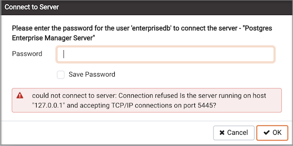

If pgAdmin displays this message, there are two possible reasons for this:  

-   the database server isn't running - simply start it.
-   the server isn't configured to accept TCP/IP requests on the address shown.

For security reasons, a PostgreSQL server "out of the box" doesn't listen on TCP/IP ports. Instead, it must be enabled to listen for TCP/IP requests. This can be done by adding **tcpip = true** to the postgresql.conf file for Versions 7.3.x and 7.4.x, or **listen_addresses='\*'** for Version 8.0.x and above; this will make the server accept connections on any IP interface.

For further information, please refer to the PostgreSQL documentation about [runtime configuration](http://www.postgresql.org/docs/current/interactive/runtime-config.html).

**FATAL: no pg_hba.conf entry**

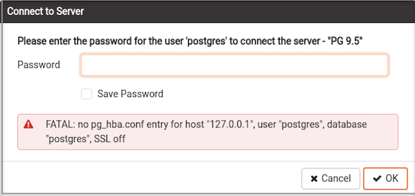

If pgAdmin displays this message when connecting, your server can be contacted correctly over the network, but is not configured to accept your connection. Your client has not been detected as a legal user for the database.

To connect to a server, the pg_hba.conf file on the database server must be configured to accept connections from the host of the pgAdmin client. Modify the pg_hba.conf file on the database server host, and add an entry in the form:

> -   **host template1 postgres 192.168.0.0/24 md5** for an IPV4 network
> -   **host template1 postgres ::ffff:192.168.0.0/120 md5** for an IPV6 network

For more information, please refer to the PostgreSQL documentation about [client authentication](http://www.postgresql.org/docs/current/interactive/client-authentication.html).

**FATAL: password authentication failed**

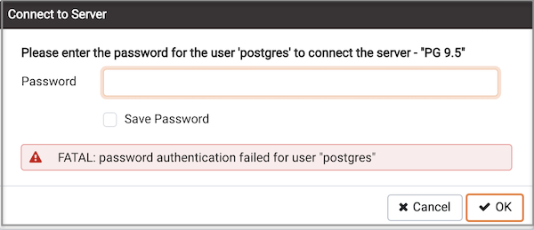

-   The `password authentication failed for user` error message indicates there may be a problem with the password you entered. Retry the password to confirm you entered it correctly. If the error message returns, make sure that you have the correct password, that you are authorized to access the server, and that the access has been correctly configured in the server's postgresql.conf configuration file.

---
2&nbsp;&nbsp;&nbsp;&nbsp;&nbsp;&nbsp;&nbsp;&nbsp;&nbsp;&nbsp;Managing a PEM Agent
---

<div id="toc_pem_agent" class="registered_link"></div>

The PEM agent is responsible for implementing scheduled tasks on the PEM server on behalf of the server. The agent runs as a service (on Windows) or as a daemon (on Linux). The PEM server installer automatically installs and configures an agent that is responsible for monitoring the PEM server; you can use the PEM agent installer to add additional agents.

Contents:


---
2.1&nbsp;&nbsp;&nbsp;&nbsp;&nbsp;&nbsp;&nbsp;&nbsp;&nbsp;&nbsp;PEM Agent Properties
---

<div id="pem_agent_properties" class="registered_link"></div>

The `PEM Agent Properties` dialog provides information about the PEM agent from which the dialog was opened; to open the dialog, right-click on an agent name in the PEM client tree control, and select `Properties` from the context menu.

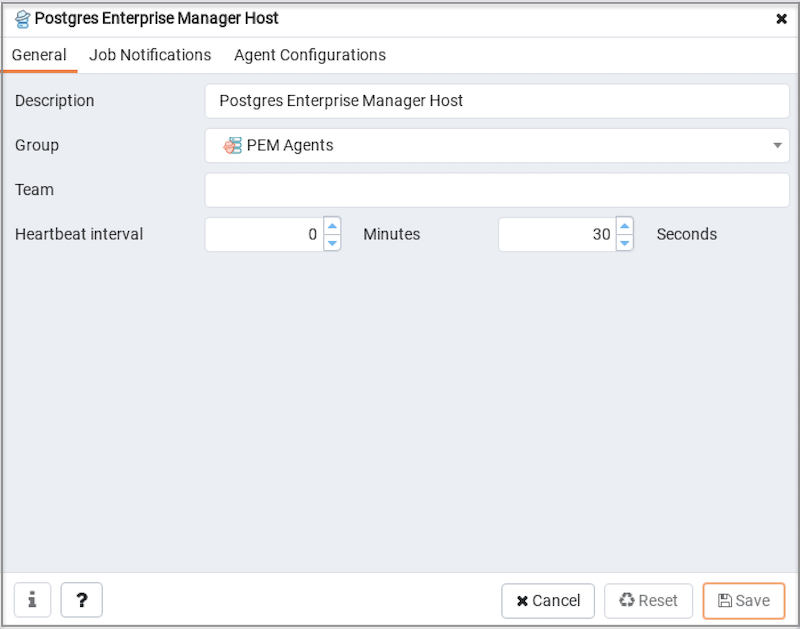

-   The `Description` field displays a modifiable description of the PEM agent. This description is displayed in the tree control of the PEM client.
-   You can use [groups](../01_toc_pem_getting_started/05_group_dialog/#group_dialog) to organize your servers and agents in the PEM client tree control. Use the `Group` drop-down listbox to select the group in which the agent will be displayed.
-   Use the `Team` field to specify the name of the group role that should be able to access servers monitored by the agent; the servers monitored by this agent will be displayed in the PEM client tree control to connected team members. Please note that this is a convenience feature. The `Team` field does not provide true isolation, and should not be used for security purposes.
-   The `Heartbeat interval` fields displays the length of time that will elapse between reports from the PEM agent to the PEM server. Use the selectors next to the `Minutes` or `Seconds` fields to modify the interval.

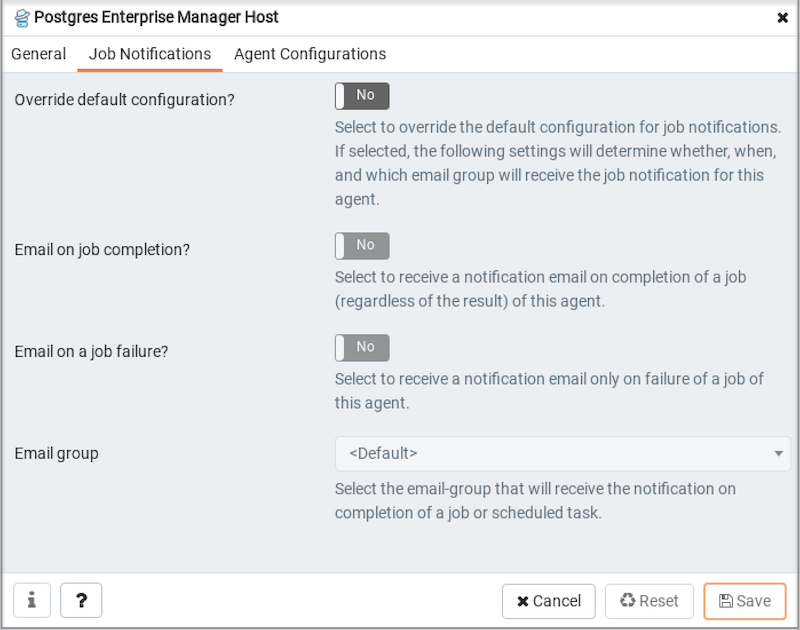

Use the fields on the `Job Notifications` tab to configure the email notification settings on agent level:

-   Use the `Override default configuration?` switch to specify if you want the agent level job notification settings to override the default job notification settings. If you select Yes for this switch, you can use the rest of the settings on this dialog to define when and to whom the job notifications should be sent. Please note that the rest of the settings on this dialog work only if you enable the `Override default configuration?` switch.
-   Use the `Email on job completion?` switch to specify if the job notification should be sent on the successful job completion.
-   Use the `Email on a job failure?` switch to specify if the job notification should be sent on the failure of a job.
-   Use the `Email group` field to specify the email group to whom the job notification should be sent.

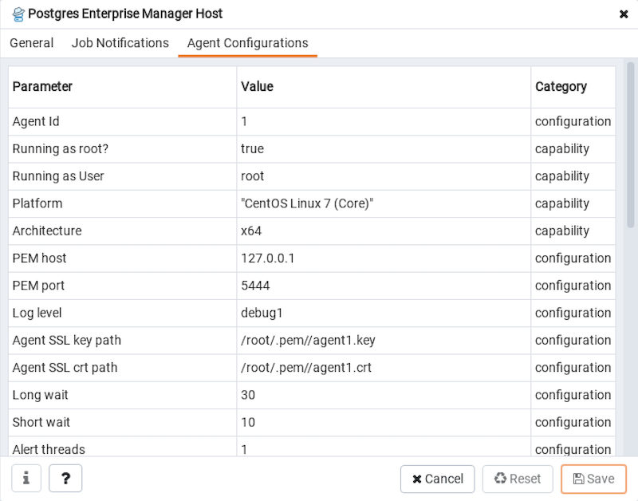

`Agent Configurations` tab lists down all the current configurations and capabilities of a agent.

-   The `Parameter` column displays list of parameters.
-   The `Value` column displays current value of the corresponding parameter.
-   The `Category` column displays category of the corresponding parameter, it can be either "configuration" or "capability".

---
2.2&nbsp;&nbsp;&nbsp;&nbsp;&nbsp;&nbsp;&nbsp;&nbsp;&nbsp;&nbsp;Binding an Agent to a Server
---

<div id="binding_pem_agent" class="registered_link"></div>

The PEM agent runs as a service (on Windows) or as a daemon (on Linux), and is responsible for implementing scheduled tasks on the PEM server on behalf of the server. The PEM server installer automatically installs and configures an agent that is responsible for monitoring the PEM server. The PEM agent installer will setup and configure the agent to start automatically at boot time, however the agent can also be manually [started](../03_pem_agent_start_pem_agent/#pem_agent_start_pem_agent) if required.

To create a binding for a registered server, right click on the name of the server in the tree control, and select `Properties` from the context menu. Open the `PEM Agent` tab:


Use the fields on the `PEM Agent` tab to associate the server (defined on the Connection tab) with a PEM agent:

Use fields on the `PEM Agent` tab to specify connection details for the PEM agent:

-   Specify `Yes` in the `Remote monitoring?` field to indicate that the PEM agent does not reside on the same host as the monitored server. When remote monitoring is enabled, agent level statistics for the monitored server will not be available for custom charts and dashboards, and the remote server will not be accessible by some PEM utilities (such as Audit Manager, Capacity Manager, Log Manager, Postgres Expert and Tuning Wizard).
-   Select an Enterprise Manager agent using the drop-down listbox to the right of the `Bound agent` label. One agent can monitor multiple Postgres servers.
-   Enter the IP address or socket path that the agent should use when connecting to the database server in the `Host` field. By default, the agent will use the host address shown on the `General` tab. On a Unix server, you may wish to specify a socket path, e.g. `/tmp`.
-   Enter the `Port` number that the agent will use when connecting to the server. By default, the agent will use the port defined on the `Properties` tab.
-   Use the drop-down listbox in the `SSL` field to specify an SSL operational mode; specify require, prefer, allow, disable, verify-ca or verify-full.
-   Use the `SSL` field to specify an SSL operational mode.

| Mode        | Specify:                                                                                                                                  |
| ----------- | ----------------------------------------------------------------------------------------------------------------------------------------- |
| require     | To require SSL encryption for transactions between the server and the agent.                                                              |
| prefer      | To use SSL encryption between the server and the agent if SSL encryption is available.                                                    |
| allow       | To allow the connection to use SSL if required by the server.                                                                             |
| disable     | To disable SSL encryption between the agent and the server.                                                                               |
| verify-ca   | To require SSL encryption, and to require the server to authenticate using a certificate registered by a certificate authority.           |
| verify-full | To require SSL encryption, and to require the server to authenticate using a certificate registered by a `trusted` certificate authority. |

> For information about using SSL encryption, see [Section 31.17 of the Postgres documentation](http://enterprisedb.com/docs/en/9.0/pg/libpq-ssl.html).

-   Use the `Database` field to specify the name of the Postgres Plus database to which the agent will initially connect.
-   Specify the name of the user that agent should use when connecting to the server in the `User name` field. Note that if the specified user is not a database superuser, then some of the features will not work as expected. If you are using Postgres version 10 or above, you can use the `pg_monitor` role to grant the required privileges to a non-superuser. For information about `pg_monitor` role, see [Default Roles](https://www.postgresql.org/docs/current/default-roles.html).
-   Specify the password that the agent should use when connecting to the server in the `Password` field, and verify it by typing it again in the `Confirm password` field. If you do not specify a password, you will need to configure the authentication for the agent manually; you can use a `.pgpass` file for example.
-   Specify `Yes` in the `Allow takeover?` field to specify that the server may be "taken over" by another agent. This feature allows an agent to take responsibility for the monitoring of the database server if, for example, the server has been moved to another host as part of a [high availability](02_pem_agent_ha/#pem_agent_ha) failover process.

Contents:


---
2.2.1&nbsp;&nbsp;&nbsp;&nbsp;&nbsp;&nbsp;&nbsp;&nbsp;&nbsp;&nbsp;PEM Agent Configuration Parameters
---

<div id="pem_agent_config_params" class="registered_link"></div>

A number of user-configurable parameters and registry entries control the behavior of the PEM Agent. With the exception of the PEM_MAXCONN (or pem_maxconn) parameter, we strongly recommend against modifying any of the configuration parameters or registry entries listed below without first consulting EnterpriseDB support experts.

> -   On 32 bit Windows systems, PEM registry entries are located in HKEY_LOCAL_MACHINE\\Software\\EnterpriseDB\\PEM\\agent
> -   On 64 bit Windows systems, PEM registry entries are located in HKEY_LOCAL_MACHINE\\Software\\Wow6432Node\\EnterpriseDB\\PEM\\agent
> -   On Linux systems, PEM configuration options are stored in the agent.cfg file, located (by default) in /usr/edb/pem/agent/etc

| **Parameter Name**                                                       | **Description**                                                                                                                                                                                                                                                                                          | **Value (if applicable)**                                                                                                                                                                                                                                                                              |
| ------------------------------------------------------------------------ | -------------------------------------------------------------------------------------------------------------------------------------------------------------------------------------------------------------------------------------------------------------------------------------------------------- | ------------------------------------------------------------------------------------------------------------------------------------------------------------------------------------------------------------------------------------------------------------------------------------------------------ |
| PEM_HOST (on Windows) or pem_host (on Linux)                             | The IP address or hostname of the PEM server.                                                                                                                                                                                                                                                            | By default, set to 127.0.0.1.                                                                                                                                                                                                                                                                          |
| PEM_PORT (on Windows) or pem_port (on Linux)                             | The database server port to which the agent connects to communicate with the PEM server.                                                                                                                                                                                                                 | By default, the PEM server monitors port 5432.                                                                                                                                                                                                                                                         |
| AgentID (on Windows) or agent_id (on Linux)                              | A unique identifier assigned to the PEM agent.                                                                                                                                                                                                                                                           | The first agent is assigned an identifier of '1', the second agent is assigned an identifier of '2', and so on.                                                                                                                                                                                        |
| AgentUser (on Windows) or agent_user (on Linux)                          | User to connect the PEM database server                                                                                                                                                                                                                                                                  | If present, and not set to empty string, it will be used to connect the PEM database server.                                                                                                                                                                                                           |
| AgentCrtPath (on Windows) or agent_ssl_crt (on Linux)                    | The complete path to the PEM agent's certificate file.                                                                                                                                                                                                                                                   | By default, on Windows, C:\\Users\\user_name\\AppData\\Roaming\\pem/agent.crt. By default on Linux, /root/.pem/agent.crt.                                                                                                                                                                              |
| AgentKeyPath (on Windows) or agent_ssl_key (on Linux)                    | The complete path to the PEM agent's key file.                                                                                                                                                                                                                                                           | By default, on Windows, C:\\Users\\user_name\\AppData\\Roaming\\pem/agent.key. By default on Linux, /root/.pem/agent.key.                                                                                                                                                                              |
| AgentFlagDir (on Windows) or agent_flag_dir (on Linux)                   | Used for HA support. Specifies the directory path checked for requests to take over monitoring another server. Requests are made in the form of a file in the specified flag directory.                                                                                                                  | Not set by default. This option allows you to override the hard-coded default.                                                                                                                                                                                                                         |
| LogLevel (on Windows) or log_level (on Linux)                            | Log level specifies the type of event that will be written to the PEM log files.                                                                                                                                                                                                                         | Log level may be set to: error, debug1, debug2, or warning By default, log level is set to `warning`                                                                                                                                                                                                   |
| log_location (on Linux only)                                             | Specifies the location of the PEM worker log file.                                                                                                                                                                                                                                                       | On Linux, /var/log/pem/worker.log. On Windows, Logs & errors will be reported in the Application event log.                                                                                                                                                                                            |
| agent_log_location (on Linux only)                                       | Specifies the location of the PEM agent log file.                                                                                                                                                                                                                                                        | On Linux, /var/log/pem/agent.log. On Windows, Logs & errors will be reported in the Application event log.                                                                                                                                                                                             |
| ShortWait (on Windows) or short_wait (on Linux)                          | The minimum length of time (in seconds) that the PEM agent will wait before checking which probes are next in the queue (waiting to run).                                                                                                                                                                | By default, 10 seconds.                                                                                                                                                                                                                                                                                |
| LongWait (on Windows) or long_wait (on Linux)                            | The maximum length of time (in seconds) that the PEM agent will wait before attempting to connect to the PEM server if an initial connection attempt fails.                                                                                                                                              | By default, 30 seconds.                                                                                                                                                                                                                                                                                |
| AlertThreads (on Windows) or alert_threads (on Linux)                    | The number of alert threads to be spawned by the agent.                                                                                                                                                                                                                                                  | Set to 1 for the agent that resides on the host of the PEM server; should be set to 0 for all other agents.                                                                                                                                                                                            |
| EnableSMTP (on Windows) or enable_smtp (on Linux)                        | When set to true for multiple PEM Agents (7.13 or lesser) and PEM backend database (9.4 or lesser) then it may send more duplicate emails. Whereas for PEM Agents (7.14 or higher) and PEM backend database (9.5 or higher) then it may send lesser duplicate emails.                                    | By default, set to true for the agent that resides on the host of the PEM server; false for all other agents.                                                                                                                                                                                          |
| EnableSNMP (on Windows) or enable_snmp (on Linux)                        | When set to true for multiple PEM Agents (7.13 or lesser) and PEM backend database (9.4 or lesser) then it may send more duplicate traps. Whereas for PEM Agents (7.14 or higher) and PEM backend database (9.5 or higher) then it may send lesser duplicate traps.                                      | By default, set to true for the agent that resides on the host of the PEM server; false for all other agents.                                                                                                                                                                                          |
| enable_nagios (on Linux only)                                            | When set to true, Nagios alerting is enabled.                                                                                                                                                                                                                                                            | By default, set to true for the agent that resides on the host of the PEM server; false for all other agents.                                                                                                                                                                                          |
| EnableWebhook (on Windows) or enable_webhook (on Linux)                  | When set to true, Webhook alerting is enabled.                                                                                                                                                                                                                                                           | By default, set to true for the agent that resides on the host of the PEM server; false for all other agents.                                                                                                                                                                                          |
| MaxWebhookRetries (on Windows) or max_webhook_retries (on Linux)         | Set maximum number of times pemAgent should retry to call webhooks on failure.                                                                                                                                                                                                                           | Default 3.                                                                                                                                                                                                                                                                                             |
| ConnectTimeout (on Windows) or connect_timeout (on Linux)                | The maximum length of time (in seconds, written as a decimal integer string) that the agent will wait for a connection.                                                                                                                                                                                  | Not set by default. If set to 0, the agent will wait indefinitely.                                                                                                                                                                                                                                     |
| AllowServerRestart (on Windows) or allow_server_restart (on Linux)       | If set to TRUE, the agent can restart the database server that it monitors. Some PEM features may be enabled/disabled, depending on the value of this parameter.                                                                                                                                         | By default, set to TRUE.                                                                                                                                                                                                                                                                               |
| MaxConnections (on Windows) or max_connections (on Linux)                | The maximum number of probe connections used by the connection throttler.                                                                                                                                                                                                                                | By default, set to 0 (an unlimited number of connections).                                                                                                                                                                                                                                             |
| ConnectionLifetime (on Windows) or connection_lifetime (on Linux)        | Use ConnectionLifetime (or connection_lifetime) to specify the minimum number of seconds an open but idle connection is retained. This parameter is ignored if the value specified in MaxConnections is reached and a new connection (to a different database) is required to satisfy a waiting request. | By default, set to 0 (a connection is dropped when the connection is idle after the agent's processing loop completes a cycle in which the connection has not been used).                                                                                                                              |
| HeartbeatConnection (on Windows) or heartbeat_connection (on Linux)      | When set to TRUE, a dedicated connection used for sending the heartbeats.                                                                                                                                                                                                                                | By default, set to FALSE.                                                                                                                                                                                                                                                                              |
| AllowBatchProbes (on Windows) or allow_batch_probes (on Linux)           | If set to TRUE, the user will be able to create batch probes using custom probes feature.                                                                                                                                                                                                                | By default, set to FALSE.                                                                                                                                                                                                                                                                              |
| BatchScriptDir (on Windows) or batch_script_dir (on Linux)               | Provide the path where script file (for alerting) will be stored.                                                                                                                                                                                                                                        | On Windows, C:Usersuser_nameAppDataLocalTemp. On Linux, set to /tmp.                                                                                                                                                                                                                                   |
| AllowBatchJobSteps (on Windows) or batch_script_user                     | Provide the username who will run the script.                                                                                                                                                                                                                                                            | On Windows, set to TRUE and restart PEM Agent. Entries located in HKEY_LOCAL_MACHINE\\Software\\Wow6432Node\\EnterpriseDB\\PEM\\agent. On Linux, Restart the agent after modifying the file. If you do not specify a user, or the specified user does not exist, then the script will not be executed. |
| ConnectionCustomSetup (on Windows) or connection_custom_setup (on Linux) | Use this parameter to provide SQL code that will be invoked each time a new connection with the monitored server is established.                                                                                                                                                                         | By default, no value is provided.                                                                                                                                                                                                                                                                      |
| ca_file (Linux only)                                                     | Provide the path where the CA certificate resides.                                                                                                                                                                                                                                                       | By default, /opt/PEM/agent/share/certs/ca-bundle.crt                                                                                                                                                                                                                                                   |
| WebhookSSLKey (on Windows) or webhook_ssl_key (on Linux)                 | The complete path to the webhook's SSL client key file.                                                                                                                                                                                                                                                  |                                                                                                                                                                                                                                                                                                        |
| WebhookSSLCrt (on Windows) or webhook_ssl_crt (on Linux)                 | The complete path to the webhook's SSL client certificate file.                                                                                                                                                                                                                                          |                                                                                                                                                                                                                                                                                                        |
| WebhookSSLCaCrt (on Windows) or webhook_ssl_ca_crt (on Linux)            | The complete path to the webhook's SSL ca certificate file.                                                                                                                                                                                                                                              |                                                                                                                                                                                                                                                                                                        |
| WebhookSSLCrl (on Windows) or webhook_ssl_crl (on Linux)                 | The complete path of the CRL file to validate webhook server certificate.                                                                                                                                                                                                                                |                                                                                                                                                                                                                                                                                                        |
| AllowInsecureWebhooks (on Windows) or allow_insecure_webhooks (on Linux) | When set to true, allow webhooks to call with insecure flag.                                                                                                                                                                                                                                             | false                                                                                                                                                                                                                                                                                                  |

<div class="note">

<div class="title">

Note

</div>

If you add or remove any of the parameter in the `agent.cfg` file then agent must be restarted to apply the changes.

</div>

---
2.2.2&nbsp;&nbsp;&nbsp;&nbsp;&nbsp;&nbsp;&nbsp;&nbsp;&nbsp;&nbsp;High Availability Integration
---

<div id="pem_agent_ha" class="registered_link"></div>

In high availability (HA) configurations, the database servers that are being monitored may be moved ("failed over") to a different host in the event of any problems, such as a hardware failure. There are numerous ways to maintain a backup server using features of Postgres and external tools. Please consult the Postgres documentation for further details.

In order to run in an HA environment, it is recommended that a PEM agent be installed on both the primary host machine, and any secondary machines that may be used as backups. The server is bound to the agent running on the primary host in the [normal fashion](./#binding_pem_agent).

When the clustering solution initiates a failover of Postgres from one server to another, the PEM agent on the server that is taking over the running of the database may be instructed to take over the monitoring of the database server as well. The server must first be configured to allow "takeovers" using the `Allow takeover?` [configuration option](../../01_toc_pem_getting_started/07_pem_define_connection/#pem_define_connection) on the `PEM Agent` tab of the server configuration dialogue.

To instruct the agent to takeover the monitoring of a server, the failover process must simply create a file in a special "flag" directory which will instruct the agent to take responsibility for the specified server. A command such as the following could be added to a failover script on a Linux server for example:

`touch /tmp/pem/agent-AGENTID/takeover-server-SERVERID` where `AGENTID` is the numeric ID of the agent that should takeover the monitoring of the server, and `SERVERID` is the numeric ID of the server that should be taken over. The IDs may be found by logging into the PEM client, and selecting the Agent or Server and viewing the ID values on the `Properties` pane of the main window.

The agent will take over monitoring of the failed-over server within approximately 30 seconds in a standard configuration of PEM.

The flag directory used by the agent is `$TMPDIR/pem/agent-AGENTID` by default (where $TMPDIR is as set for the user account under which the agent runs, usually `root` on Linux/Unix, or `Administrator` on Windows). The directory path can be overridden using the `AgentFlagDir` configuration option in the registry on Windows, or the `agent_flag_dir` option in the agent configuration file on other platforms.

---
2.3&nbsp;&nbsp;&nbsp;&nbsp;&nbsp;&nbsp;&nbsp;&nbsp;&nbsp;&nbsp;Controlling the PEM Agent
---

<div id="pem_agent_start_pem_agent" class="registered_link"></div>

On Linux platforms, the name of the service script that controls a PEM agent is `pemagent`. You can use the pemagent service script to control the PEM agent. Enter:

> `/etc/init.d/pem_agent action`

Where `action` specifies the action taken by the service. Specify:

-   start to start the service.
-   stop to stop the service.
-   restart to stop and then start the service.
-   status to check the status of the service.

To determine if a service is running on RHEL or CentOS version 7.x, open a command line, and issue the command:

> `systemctl pemagent action`

Where `action` is the action taken by the service. You can specify:

-   start to start the service.
-   stop to stop the service.
-   restart to stop and then start the service.
-   status to inquire about the current status of the service.

### Controlling the PEM Agent on Windows

The Windows operating system includes a graphical service controller (the Windows `Services` applet) that displays the server status, and offers point-and-click service control. The Services applet can be accessed through the Windows Control Panel. When the utility opens, use the scroll bar to navigate through the listed services to highlight the `Postgres Enterprise Manager - pemAgent` service name.

-   Use the Stop the service option to stop a service.
-   Use the Pause the service option to instruct Postgres to reload a service's configuration parameters.
-   Use the Start the service option to start a service.

---
2.4&nbsp;&nbsp;&nbsp;&nbsp;&nbsp;&nbsp;&nbsp;&nbsp;&nbsp;&nbsp;High Availability Integration
---

<div id="pem_agent_ha" class="registered_link"></div>

In high availability (HA) configurations, the database servers that are being monitored may be moved ("failed over") to a different host in the event of any problems, such as a hardware failure. There are numerous ways to maintain a backup server using features of Postgres and external tools. Please consult the Postgres documentation for further details.

In order to run in an HA environment, it is recommended that a PEM agent be installed on both the primary host machine, and any secondary machines that may be used as backups. The server is bound to the agent running on the primary host in the [normal fashion](02_pem_agent_binding/#binding_pem_agent).

When the clustering solution initiates a failover of Postgres from one server to another, the PEM agent on the server that is taking over the running of the database may be instructed to take over the monitoring of the database server as well. The server must first be configured to allow "takeovers" using the `Allow takeover?` [configuration option](../01_toc_pem_getting_started/07_pem_define_connection/#pem_define_connection) on the `PEM Agent` tab of the server configuration dialogue.

To instruct the agent to takeover the monitoring of a server, the failover process must simply create a file in a special "flag" directory which will instruct the agent to take responsibility for the specified server. A command such as the following could be added to a failover script on a Linux server for example:

`touch /tmp/pem/agent-AGENTID/takeover-server-SERVERID` where `AGENTID` is the numeric ID of the agent that should takeover the monitoring of the server, and `SERVERID` is the numeric ID of the server that should be taken over. The IDs may be found by logging into the PEM client, and selecting the Agent or Server and viewing the ID values on the `Properties` pane of the main window.

The agent will take over monitoring of the failed-over server within approximately 30 seconds in a standard configuration of PEM.

The flag directory used by the agent is `$TMPDIR/pem/agent-AGENTID` by default (where $TMPDIR is as set for the user account under which the agent runs, usually `root` on Linux/Unix, or `Administrator` on Windows). The directory path can be overridden using the `AgentFlagDir` configuration option in the registry on Windows, or the `agent_flag_dir` option in the agent configuration file on other platforms.

---
2.5&nbsp;&nbsp;&nbsp;&nbsp;&nbsp;&nbsp;&nbsp;&nbsp;&nbsp;&nbsp;PEM Agent Privileges
---

<div id="pem_agent_privileges" class="registered_link"></div>

By default, the PEM agent is installed with `root` privileges for the operating system host and superuser privileges for the database server. These privileges allow the PEM agent to invoke unrestricted probes on the monitored host and database server about system usage, retrieving and returning the information to the PEM server.

Please note that PEM functionality diminishes as the privileges of the PEM agent decrease. For complete functionality, the PEM agent should run as `root` and on the same host as the database server.

> -   If the PEM agent is run under the database server's service account, PEM probes will not have complete access to the statistical information used to generate reports, and functionality will be limited to the capabilities of that account.
> -   If the PEM agent is run under another lesser-privileged account, functionality will be limited even further.
> -   If the PEM agent is installed on a different host and is monitoring the database server remotely, then the functionality will be limited.

| **Feature Name**             | **Works with root User** | **Works with non-root User**                                                                                                                                                                                                                                                                                                                                          | **Works with remote PEM Agent**                                                                                                                                                                   |
| ---------------------------- | ------------------------ | --------------------------------------------------------------------------------------------------------------------------------------------------------------------------------------------------------------------------------------------------------------------------------------------------------------------------------------------------------------------- | ------------------------------------------------------------------------------------------------------------------------------------------------------------------------------------------------- |
| Audit Manager                | yes                      | The Audit Log Manager may be unable to apply requested modifications if the service cannot be restarted. The user running PEM Agent may be different from the user who owns the data directory of the database server, so user running PEM Agent may not be able to change the configuration and also may not be able to restart the services of the database server. | no                                                                                                                                                                                                |
| Capacity Manager             | yes                      | yes                                                                                                                                                                                                                                                                                                                                                                   | yes<br /><br />NOTE: There will be no co-relation between the database server and operating system metrices<br />                                                                                 |
| Log Manager                  | yes                      | The Log Manager may be unable to apply requested modifications if the service cannot be restarted. The user running PEM Agent may be different from the user who owns the data directory of the database server, so user running the PEM Agent may not be able to change the configuration and also may not be able to restart the services of the database server.   | no                                                                                                                                                                                                |
| Manage Alerts                | yes                      | yes                                                                                                                                                                                                                                                                                                                                                                   | yes<br /><br />NOTE: When run alert script on the database server is selected, it will run on the machine, where bound PEM Agent is running, and not on the actual database server machine.<br /> |
| Manage Charts                | yes                      | yes                                                                                                                                                                                                                                                                                                                                                                   | yes                                                                                                                                                                                               |
| Manage Dashboards            | yes                      | Some dashboards may not be able to show complete data. For example, columns such as swap usage, CPU usage, IO read, and IO write will be displayed as 0 in the session activity dashboard.                                                                                                                                                                            | Some dashboards may not be able to show complete data. For example, the operating system information of the database server will not be displayed as not available.                               |
| Manage Probes                | yes                      | Some of the PEM probes will not return information, and some of functionalities may be affected. For details about probe functionality, see the [PEM Agent Guide](/pem/latest/pem_agent/).                                                                                                                                                                            | Some of the PEM probes will not return information, and some of the functionalities may be affected.                                                                                              |
| Postgres Expert              | yes                      | The Postgres Expert will be able to access the configuration expert and schema expert, but not the security expert.                                                                                                                                                                                                                                                   | The Expert will provide partial information as operating system information is not available.                                                                                                     |
| Postgres Log Analysis Expert | yes                      | The Postgres Log Analysis Expert may not be able to do the analysis as it is dependent on the logs imported by log manager, which will not work as required.                                                                                                                                                                                                          | The Postgres Log Analysis Expert will not be able to do the analysis as it is dependent on the logs imported by log manager, which will not work as required.                                     |
| Scheduled Tasks              | yes                      | For Linux if user is the same as batch_script_user in agent.cfg then shell script will run.                                                                                                                                                                                                                                                                           | Scheduled tasks will work only for database server; scripts will run on a remote Agent.                                                                                                           |
| Tuning Wizard                | yes                      | The Tuning Wizard will be unable to run if the service cannot be restarted. The user running PEM Agent may be different from the user who owns the data directory of the database server, so user running PEM Agent may not be able to change the configuration and also may not be able to restart the services of the database server.                              | no                                                                                                                                                                                                |
| System Reports               | yes                      | yes                                                                                                                                                                                                                                                                                                                                                                   | yes                                                                                                                                                                                               |
| Core Usage Reports           | yes                      | yes                                                                                                                                                                                                                                                                                                                                                                   | The Core Usage report will not show complete information. For example, the platform, number of cores, and total RAM will not be displayed.                                                        |
| Managing BART                | yes                      | BART and the BART scanner may not be able to start/reload.                                                                                                                                                                                                                                                                                                            | no<br /><br />NOTE: BART requires password less authentication between two machines, where database server and BART are installed.<br />                                                          |

---
2.6&nbsp;&nbsp;&nbsp;&nbsp;&nbsp;&nbsp;&nbsp;&nbsp;&nbsp;&nbsp;PEM Agent Configuration Parameters
---

<div id="pem_agent_config_params" class="registered_link"></div>

A number of user-configurable parameters and registry entries control the behavior of the PEM Agent. With the exception of the PEM_MAXCONN (or pem_maxconn) parameter, we strongly recommend against modifying any of the configuration parameters or registry entries listed below without first consulting EnterpriseDB support experts.

> -   On 32 bit Windows systems, PEM registry entries are located in HKEY_LOCAL_MACHINE\\Software\\EnterpriseDB\\PEM\\agent
> -   On 64 bit Windows systems, PEM registry entries are located in HKEY_LOCAL_MACHINE\\Software\\Wow6432Node\\EnterpriseDB\\PEM\\agent
> -   On Linux systems, PEM configuration options are stored in the agent.cfg file, located (by default) in /usr/edb/pem/agent/etc

| **Parameter Name**                                                       | **Description**                                                                                                                                                                                                                                                                                          | **Value (if applicable)**                                                                                                                                                                                                                                                                              |
| ------------------------------------------------------------------------ | -------------------------------------------------------------------------------------------------------------------------------------------------------------------------------------------------------------------------------------------------------------------------------------------------------- | ------------------------------------------------------------------------------------------------------------------------------------------------------------------------------------------------------------------------------------------------------------------------------------------------------ |
| PEM_HOST (on Windows) or pem_host (on Linux)                             | The IP address or hostname of the PEM server.                                                                                                                                                                                                                                                            | By default, set to 127.0.0.1.                                                                                                                                                                                                                                                                          |
| PEM_PORT (on Windows) or pem_port (on Linux)                             | The database server port to which the agent connects to communicate with the PEM server.                                                                                                                                                                                                                 | By default, the PEM server monitors port 5432.                                                                                                                                                                                                                                                         |
| AgentID (on Windows) or agent_id (on Linux)                              | A unique identifier assigned to the PEM agent.                                                                                                                                                                                                                                                           | The first agent is assigned an identifier of '1', the second agent is assigned an identifier of '2', and so on.                                                                                                                                                                                        |
| AgentUser (on Windows) or agent_user (on Linux)                          | User to connect the PEM database server                                                                                                                                                                                                                                                                  | If present, and not set to empty string, it will be used to connect the PEM database server.                                                                                                                                                                                                           |
| AgentCrtPath (on Windows) or agent_ssl_crt (on Linux)                    | The complete path to the PEM agent's certificate file.                                                                                                                                                                                                                                                   | By default, on Windows, C:\\Users\\user_name\\AppData\\Roaming\\pem/agent.crt. By default on Linux, /root/.pem/agent.crt.                                                                                                                                                                              |
| AgentKeyPath (on Windows) or agent_ssl_key (on Linux)                    | The complete path to the PEM agent's key file.                                                                                                                                                                                                                                                           | By default, on Windows, C:\\Users\\user_name\\AppData\\Roaming\\pem/agent.key. By default on Linux, /root/.pem/agent.key.                                                                                                                                                                              |
| AgentFlagDir (on Windows) or agent_flag_dir (on Linux)                   | Used for HA support. Specifies the directory path checked for requests to take over monitoring another server. Requests are made in the form of a file in the specified flag directory.                                                                                                                  | Not set by default. This option allows you to override the hard-coded default.                                                                                                                                                                                                                         |
| LogLevel (on Windows) or log_level (on Linux)                            | Log level specifies the type of event that will be written to the PEM log files.                                                                                                                                                                                                                         | Log level may be set to: error, debug1, debug2, or warning By default, log level is set to `warning`                                                                                                                                                                                                   |
| log_location (on Linux only)                                             | Specifies the location of the PEM worker log file.                                                                                                                                                                                                                                                       | On Linux, /var/log/pem/worker.log. On Windows, Logs & errors will be reported in the Application event log.                                                                                                                                                                                            |
| agent_log_location (on Linux only)                                       | Specifies the location of the PEM agent log file.                                                                                                                                                                                                                                                        | On Linux, /var/log/pem/agent.log. On Windows, Logs & errors will be reported in the Application event log.                                                                                                                                                                                             |
| ShortWait (on Windows) or short_wait (on Linux)                          | The minimum length of time (in seconds) that the PEM agent will wait before checking which probes are next in the queue (waiting to run).                                                                                                                                                                | By default, 10 seconds.                                                                                                                                                                                                                                                                                |
| LongWait (on Windows) or long_wait (on Linux)                            | The maximum length of time (in seconds) that the PEM agent will wait before attempting to connect to the PEM server if an initial connection attempt fails.                                                                                                                                              | By default, 30 seconds.                                                                                                                                                                                                                                                                                |
| AlertThreads (on Windows) or alert_threads (on Linux)                    | The number of alert threads to be spawned by the agent.                                                                                                                                                                                                                                                  | Set to 1 for the agent that resides on the host of the PEM server; should be set to 0 for all other agents.                                                                                                                                                                                            |
| EnableSMTP (on Windows) or enable_smtp (on Linux)                        | When set to true for multiple PEM Agents (7.13 or lesser) and PEM backend database (9.4 or lesser) then it may send more duplicate emails. Whereas for PEM Agents (7.14 or higher) and PEM backend database (9.5 or higher) then it may send lesser duplicate emails.                                    | By default, set to true for the agent that resides on the host of the PEM server; false for all other agents.                                                                                                                                                                                          |
| EnableSNMP (on Windows) or enable_snmp (on Linux)                        | When set to true for multiple PEM Agents (7.13 or lesser) and PEM backend database (9.4 or lesser) then it may send more duplicate traps. Whereas for PEM Agents (7.14 or higher) and PEM backend database (9.5 or higher) then it may send lesser duplicate traps.                                      | By default, set to true for the agent that resides on the host of the PEM server; false for all other agents.                                                                                                                                                                                          |
| enable_nagios (on Linux only)                                            | When set to true, Nagios alerting is enabled.                                                                                                                                                                                                                                                            | By default, set to true for the agent that resides on the host of the PEM server; false for all other agents.                                                                                                                                                                                          |
| EnableWebhook (on Windows) or enable_webhook (on Linux)                  | When set to true, Webhook alerting is enabled.                                                                                                                                                                                                                                                           | By default, set to true for the agent that resides on the host of the PEM server; false for all other agents.                                                                                                                                                                                          |
| MaxWebhookRetries (on Windows) or max_webhook_retries (on Linux)         | Set maximum number of times pemAgent should retry to call webhooks on failure.                                                                                                                                                                                                                           | Default 3.                                                                                                                                                                                                                                                                                             |
| ConnectTimeout (on Windows) or connect_timeout (on Linux)                | The maximum length of time (in seconds, written as a decimal integer string) that the agent will wait for a connection.                                                                                                                                                                                  | Not set by default. If set to 0, the agent will wait indefinitely.                                                                                                                                                                                                                                     |
| AllowServerRestart (on Windows) or allow_server_restart (on Linux)       | If set to TRUE, the agent can restart the database server that it monitors. Some PEM features may be enabled/disabled, depending on the value of this parameter.                                                                                                                                         | By default, set to TRUE.                                                                                                                                                                                                                                                                               |
| MaxConnections (on Windows) or max_connections (on Linux)                | The maximum number of probe connections used by the connection throttler.                                                                                                                                                                                                                                | By default, set to 0 (an unlimited number of connections).                                                                                                                                                                                                                                             |
| ConnectionLifetime (on Windows) or connection_lifetime (on Linux)        | Use ConnectionLifetime (or connection_lifetime) to specify the minimum number of seconds an open but idle connection is retained. This parameter is ignored if the value specified in MaxConnections is reached and a new connection (to a different database) is required to satisfy a waiting request. | By default, set to 0 (a connection is dropped when the connection is idle after the agent's processing loop completes a cycle in which the connection has not been used).                                                                                                                              |
| HeartbeatConnection (on Windows) or heartbeat_connection (on Linux)      | When set to TRUE, a dedicated connection used for sending the heartbeats.                                                                                                                                                                                                                                | By default, set to FALSE.                                                                                                                                                                                                                                                                              |
| AllowBatchProbes (on Windows) or allow_batch_probes (on Linux)           | If set to TRUE, the user will be able to create batch probes using custom probes feature.                                                                                                                                                                                                                | By default, set to FALSE.                                                                                                                                                                                                                                                                              |
| BatchScriptDir (on Windows) or batch_script_dir (on Linux)               | Provide the path where script file (for alerting) will be stored.                                                                                                                                                                                                                                        | On Windows, C:Usersuser_nameAppDataLocalTemp. On Linux, set to /tmp.                                                                                                                                                                                                                                   |
| AllowBatchJobSteps (on Windows) or batch_script_user                     | Provide the username who will run the script.                                                                                                                                                                                                                                                            | On Windows, set to TRUE and restart PEM Agent. Entries located in HKEY_LOCAL_MACHINE\\Software\\Wow6432Node\\EnterpriseDB\\PEM\\agent. On Linux, Restart the agent after modifying the file. If you do not specify a user, or the specified user does not exist, then the script will not be executed. |
| ConnectionCustomSetup (on Windows) or connection_custom_setup (on Linux) | Use this parameter to provide SQL code that will be invoked each time a new connection with the monitored server is established.                                                                                                                                                                         | By default, no value is provided.                                                                                                                                                                                                                                                                      |
| ca_file (Linux only)                                                     | Provide the path where the CA certificate resides.                                                                                                                                                                                                                                                       | By default, /opt/PEM/agent/share/certs/ca-bundle.crt                                                                                                                                                                                                                                                   |
| WebhookSSLKey (on Windows) or webhook_ssl_key (on Linux)                 | The complete path to the webhook's SSL client key file.                                                                                                                                                                                                                                                  |                                                                                                                                                                                                                                                                                                        |
| WebhookSSLCrt (on Windows) or webhook_ssl_crt (on Linux)                 | The complete path to the webhook's SSL client certificate file.                                                                                                                                                                                                                                          |                                                                                                                                                                                                                                                                                                        |
| WebhookSSLCaCrt (on Windows) or webhook_ssl_ca_crt (on Linux)            | The complete path to the webhook's SSL ca certificate file.                                                                                                                                                                                                                                              |                                                                                                                                                                                                                                                                                                        |
| WebhookSSLCrl (on Windows) or webhook_ssl_crl (on Linux)                 | The complete path of the CRL file to validate webhook server certificate.                                                                                                                                                                                                                                |                                                                                                                                                                                                                                                                                                        |
| AllowInsecureWebhooks (on Windows) or allow_insecure_webhooks (on Linux) | When set to true, allow webhooks to call with insecure flag.                                                                                                                                                                                                                                             | false                                                                                                                                                                                                                                                                                                  |

<div class="note">

<div class="title">

Note

</div>

If you add or remove any of the parameter in the `agent.cfg` file then agent must be restarted to apply the changes.

</div>

---
2.7&nbsp;&nbsp;&nbsp;&nbsp;&nbsp;&nbsp;&nbsp;&nbsp;&nbsp;&nbsp;PEM Agent Self Registration
---

<div id="pem_agent_self_registration" class="registered_link"></div>

Each PEM agent must be `registered` with the PEM server. The registration process provides the PEM server with the information it needs to communicate with the agent. The PEM agent graphical installer supports agent self-registration, but you can use the `pemworker` utility to register the agent if you skip PEM agent registration during a graphical installation or use an RPM package to install a PEM agent.

The RPM installer places the PEM worker utility in the `/usr/edb/pem/agent/bin` directory. Use the following commands to register an agent:

-   **On Linux**: pemworker −−register-agent \[register-options]
-   **On Windows**: pemworker.exe REGISTER \[register-options]

The following information is required when registering an agent with the PEM Server; you will be prompted for information if it is not provided on the command line:

| Parameters                   | Command-line options               | Optional | Description                                                                                                                                                                                                                                                                                                                                                                                                    | Default Value                                  |
| ---------------------------- | ---------------------------------- | -------- | -------------------------------------------------------------------------------------------------------------------------------------------------------------------------------------------------------------------------------------------------------------------------------------------------------------------------------------------------------------------------------------------------------------- | ---------------------------------------------- |
| **PEM Database Server Host** | −−pem-server &lt;hostname/address> | No       | Address/Host name of the PEM database server                                                                                                                                                                                                                                                                                                                                                                   |                                                |
| **PEM Admin User**           | −−pem-user &lt;username>           | No       | `PEM Admin User` to connect to the PEM database server.                                                                                                                                                                                                                                                                                                                                                        |                                                |
| **PEM Database Server Port** | −−pem-port &lt;port number>        | Yes      | Port on which PEM database server is running.                                                                                                                                                                                                                                                                                                                                                                  | 5432                                           |
| **Agent Certificate Path**   | −−cert-path &lt;certificate path>  | Yes      | Path, where certificates need to be created.                                                                                                                                                                                                                                                                                                                                                                   | On Linux, "~/.pem" On Windows, “%APPDATA%/pem” |
| **Agent Display Name**       | −−display-name &lt;agent_name>     | Yes      | Display name of the PEM Agent.                                                                                                                                                                                                                                                                                                                                                                                 | System hostname                                |
| **Agent Group**              | −−group &lt;group_name>            | Yes      | The name of the group in which the agent will be displayed.                                                                                                                                                                                                                                                                                                                                                    |                                                |
| **Agent Team**               | −−team &lt;team_name>              | Yes      | The name of the group role that may access the PEM Agent.                                                                                                                                                                                                                                                                                                                                                      |                                                |
| **Agent Owner**              | −−owner &lt;owner_name>            | Yes      | The name of the owner of the PEM Agent.                                                                                                                                                                                                                                                                                                                                                                        |                                                |
| **Force registration**       | −−force-registration               | Yes      | Forcefully registers the agent to the PEM server with the arguments provided. It can be used to override the existing agent configuration.                                                                                                                                                                                                                                                                     |                                                |
| **Enable Heartbeat**         | −−enable-heartbeat-connection      | Yes      | Agent to use dedicated connection to update the heartbeat.                                                                                                                                                                                                                                                                                                                                                     | false                                          |
| **Agent User**               | −−pem-agent-user                   | Yes      | Use this user to connect the PEM database server. Specify, it when you would like to use a connection pooler between PEM Agent and PEM database server. It will generate the SSL Ceriticates, which will used by the pemworker to connect to the PEM database server instead, for this user instead of the default agent user.<br /><br />**NOTE:** Specified user must be a member of 'pem_agent' role.<br /> |                                                |

!!! Note
    You can use the `PEM_SERVER_PASSWORD` environment variable to set the password of the `PEM Admin User`. If the `PEM_SERVER_PASSWORD` is not set, the server will use the `PGPASSWORD` or `pgpass file` when connecting to the **PEM Database Server**.

Example:

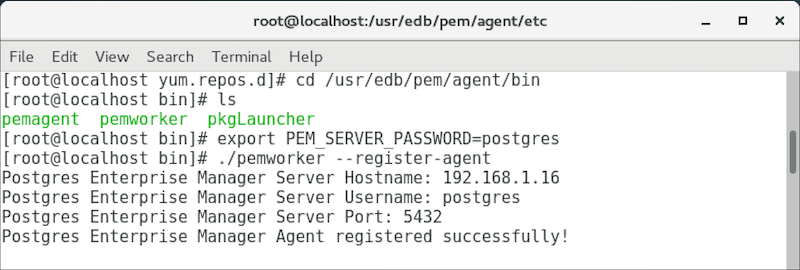

Refer the [PEM Worker Usage Guide](#pem_worker_usage_output).

---
2.8&nbsp;&nbsp;&nbsp;&nbsp;&nbsp;&nbsp;&nbsp;&nbsp;&nbsp;&nbsp;Register/Unregister database server using PEM Agent
---

<div id="pem_agent_server_registration" class="registered_link"></div>

You can use the `pemworker` utility to register a database server for monitoring. The RPM installer places the utility in the `/usr/edb/pem/agent/bin` directory. Use the following commands to register a server:

-   **On Linux**: pemworker −−register-server \[register-server-options]
-   **On Windows**: pemworker.exe REGISTER-SERVER \[register-server-options]

Use the parameters in the table that follow to provide connection information for a Postgres database server that you wish to register for monitoring by the PEM Server. Please note that the pg_hba.conf file on the database server must be configured to allow connections from the PEM server.

Properties that begin with −−asb (agent server binding) define the binding for an agent that does not reside on the same host as the database server. These properties are optional if you have a PEM agent installed on the host of the database server. You will be prompted for required information if you do not include it on the command line.

| Parameters                                                                         | Command-line options                 | Optional | Description                                                                                                                                        | Default Value                                          |
| ---------------------------------------------------------------------------------- | ------------------------------------ | -------- | -------------------------------------------------------------------------------------------------------------------------------------------------- | ------------------------------------------------------ |
| **PEM Admin User**                                                                 | −−pem-user &lt;username>             | No       | The name of the `PEM Admin User` that will connect to the monitored server.                                                                        |                                                        |
| **Server Host**                                                                    | −−server-addr &lt;host name/address> | No       | Host name/address of the monitored server.                                                                                                         |                                                        |
| **Server Port**                                                                    | −−server-port &lt;port>              | No       | Port on which database server is running.                                                                                                          |                                                        |
| **Server Database**                                                                | −−server-database &lt;name>          | No       | The database to which PEM will connect.                                                                                                            |                                                        |
| **Server User**                                                                    | −−server-user &lt;name>              | No       | The database user role that will be used by the agent for monitoring purposes.                                                                     |                                                        |
| **Server Service Name**                                                            | −−server-service-name &lt;name>      | Yes      | Name of the system level service, which controls the operations like start, stop, restart, reload, etc. of the server.                             |                                                        |
| **Remote Monitoring?**                                                             | −−remote-monitoring &lt;yes/no>      | No       | `no` if the monitored server resides on the same machine as the bound PEM agent, `yes` if the agent is on another host.                            | no                                                     |
| -   **EDB Failover Manager**      <br />      <br />      Cluster Name      <br /> | −−efm-cluster-name &lt;name>         | Yes      | Name of EDB Failover Manager Cluster associated with this server.                                                                                  |                                                        |
| **EDB Failover manager** **Installation Path**                                     | −−efm-install-path &lt;path>         | Yes      | Installation path of EDB Failover Manager associated with this server.                                                                             |                                                        |
| **Server Display Name**                                                            | −−display-name &lt;server_name>      | Yes      | Display name of the registred server.                                                                                                              | System hostname                                        |
| **Host Name**                                                                      | −−asb-host-name &lt;name_of_host>    | Yes      | The name of the host to which the agent is connecting.                                                                                             | The value specified by the −−server-addr property.     |
| **Host Port**                                                                      | −−asb-host-port &lt;port_number>     | Yes      | The port number that the agent will use when connecting to the database.                                                                           | The value specified by the −−server-port property.     |
| **Host DB**                                                                        | −−asb-host-db &lt;database_name>     | Yes      | The name of the database to which the agent will connect.                                                                                          | The value specified by the −−server-database property. |
| **Host User Name**                                                                 | −−asb-host-user &lt;database_user>   | Yes      | The database user name that the agent will supply when authenticating with the database.                                                           | The value specified by the −−server-user property.     |
| **SSL Mode**                                                                       | −−asb-ssl-mode &lt;certificate path> | Yes      | Type of SSL authentication that will be used for connections. Supported values include `prefer`, `require`, `disable`, `verify-CA`, `verify-full`. | prefer                                                 |
| **Server Group**                                                                   | −−group &lt;group_name>              | Yes      | Specify the name of the server group in which the server will be displayed.                                                                        |                                                        |
| **Server Team**                                                                    | −−team &lt;team_name>                | Yes      | Specify the name of the group role that will be allowed to access the server.                                                                      |                                                        |
| **Owner**                                                                          | −−owner &lt;owner_name>              | Yes      | Specify the name of the role that will own the monitored server.                                                                                   |                                                        |

Use the **PEM_MONITORED_SERVER_PASSWORD** environment variable to set the password of the user of the database server which is to be registered. When registering the database server, the pemworker utility will bind the server to the `PEM Agent` associated with the pemworker utility. The PEM server will use the specified user name (`Server User`) and password specified in the **PEM_MONITORED_SERVER_PASSWORD** environment variable when monitoring the database server.

Use the **PEM_SERVER_PASSWORD** environment variable to provide the password of the user of the PEM database server. If the `PEM_SERVER_PASSWORD` is not set, the server will use the `PGPASSWORD` or `pgpass file` when connecting to the **PEM Database Server**.

### To unregister a database server

You can use the pemworker utility to unregister a server:

-   **On Linux**: pemworker −−unregister-server \[unregister-server-options]
-   **On Windows**: pemworker.exe UNREGISTER-SERVER \[unregister-server-options]

Include the following information when unregistering a database server from the `PEM Server`; you will be prompted for required information if you do not include it on the command line:

| Parameters         | Command-line options                 | Optional | Description                                          | Default Value |
| ------------------ | ------------------------------------ | -------- | ---------------------------------------------------- | ------------- |
| **PEM Admin User** | −−pem-user &lt;username>             | No       | `PEM Admin User` to connect the PEM database server. |               |
| **Server Host**    | −−server-addr &lt;host name/address> | No       | Host name/address of the database server.            |               |
| **Server Port**    | −−server-port &lt;port>              | No       | Port on which database server is running.            |               |

The command will unregister the server from the `PEM Server` for the specified combination of `Server Host` and `Server Port`, which is being monitored by the `PEM Agent`.

For more information, refer the [PEM Worker Usage Guide](#pem_worker_usage_output).

---
3&nbsp;&nbsp;&nbsp;&nbsp;&nbsp;&nbsp;&nbsp;&nbsp;&nbsp;&nbsp;The PEM Client
---

<div id="toc_pem_client" class="registered_link"></div>

The Postgres Enterprise Manager client provides a powerful and intuitive user interface that you can use to manage Advanced Server and PostgreSQL databases. The client interface is easily customized, and will preserve your preferences between sessions. Client features include:

> -   auto-detection and support for objects discovered at run-time
> -   a live SQL query tool with direct data editing
> -   support for administrative queries
> -   a syntax-highlighting SQL editor
> -   powerful graphical management dialogs and tools for common tasks
> -   a responsive, context-sensitive behavior
> -   supportive error messages
> -   helpful hints
> -   online help and information for dialogs and tools.

The PEM client features a highly-customizable display that features drag-and-drop panels that you can arrange to make the best use of your desktop environment. The application is installed during the PEM server installation; use your browser of choice to connect to the client.

The client tree control (the *Browser*) provides an elegant overview of the managed servers, and the objects that reside on each server. Right-click on a node within the tree control to access context-sensitive menus that provide quick access to management tasks for the selected object. The tabbed browser window provide quick access to statistical information about each object in the tree control, tools and utilities, and extended PEM features. The client opens an additional feature tab each time you access the extended functionality offered by PEM; you can open, close, and re-arrange tabs as needed.

You can search for objects in the database using the [Search objects](06_search_objects/#search_objects)

Contents:


---
3.1&nbsp;&nbsp;&nbsp;&nbsp;&nbsp;&nbsp;&nbsp;&nbsp;&nbsp;&nbsp;PEM Main Browser Window
---

<div id="pem_browser_window" class="registered_link"></div>

The PEM client features a menu bar and a window divided into two panes: the `Browser` tree control in the left pane, and a tabbed browser in the right pane.

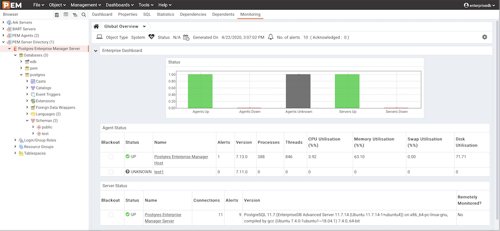

[Menus](03_pem_menu_bar/#pem_menu_bar) displayed across the top of the browser window provide quick, context-sensitive access to PEM features and functionality.

### The PEM Client Object Browser

The `Browser` tree control provides access to information and management options for the database objects that reside on each server. The tree control expands to display a hierarchical view of the servers and objects that are monitored by the PEM server. You can use context menu options (accessed by right-clicking on nodes of the tree control) to create new objects, and modify and delete existing objects if your role holds the required privileges.

Expand nodes in the tree control to display a hierarchical view of the database objects that reside on a selected server:

-   Use the plus sign (+) to the left of a node to expand a segment of the tree control.
-   Click the minus sign (-) to the left of a node to close that node.

Right-click on a node of the tree control to access a context-sensitive menu and perform common tasks. Context menu options may include one or more of the following selections:

| Option                    | Action                                                                                                                                                                             |
| ------------------------- | ---------------------------------------------------------------------------------------------------------------------------------------------------------------------------------- |
| `Add named restore point` | Click to create and enter the name of a restore point.<br />                                                                                                                       |
| `Backup...`               | Click to open the [Backup...](../05_toc_pem_management_basics/06_backup_dialog/#backup_dialog) dialog to backup database objects.<br />                                            |
| `Backup Globals...`       | Click to open the [Backup Globals...](../05_toc_pem_management_basics/07_backup_globals_dialog/#backup_globals_dialog) dialog to backup cluster objects.<br />                     |
| `Backup Server...`        | Click to open the [Backup Server...](../05_toc_pem_management_basics/08_backup_server_dialog/#backup_server_dialog) dialog to backup a server.<br />                               |
| `Connect Server`          | Click to establish a connection with the selected server.<br />                                                                                                                    |
| `Create`                  | Click to access a context menu that provides context-sensitive selections.Your selection opens a `Create` dialog for creating a new object.                                        |
| `CREATE Script`           | Click to open the [Query tool](05_keyboard_shortcuts/#query-tool) to edit or view the CREATE script.<br />                                                                         |
| `CREATE Script`           | Click to open the [Query tool](05_keyboard_shortcuts/#query-tool) to edit or view the CREATE script.<br />                                                                         |
| `Dashboards`              | Click through for quick access to PEM dashboards.<br />                                                                                                                            |
| `Delete/Drop`             | Click to delete the currently selected object from the server.<br />                                                                                                               |
| `Disconnect Database...`  | Click to terminate a database connection.<br />                                                                                                                                    |
| `Disconnect Server...`    | Click to refresh the currently selected object.<br />                                                                                                                              |
| `Drop Cascade`            | Click to delete the currently selected object and all dependent objects from the server.<br />                                                                                     |
| `Debugging`               | Click to access the [Debugger](05_keyboard_shortcuts/#debugger) tool.<br />                                                                                                        |
| `Grant Wizard`            | Click to access the [Grant Wizard](../05_toc_pem_management_basics/01_grant_wizard/#grant_wizard) tool.<br />                                                                      |
| `Maintenance...`          | Click to open the [Maintenance...](../05_toc_pem_management_basics/04_maintenance/01_maintenance_dialog/#maintenance_dialog) dialog to VACUUM, ANALYZE, REINDEX, or CLUSTER.<br /> |
| `Management`              | Click to access management tasks that are relevant to the node.<br />                                                                                                              |
| `Properties...`           | Click to review or modify the currently selected object's properties.<br />                                                                                                        |
| `Refresh...`              | Click to refresh the currently selected object.<br />                                                                                                                              |
| `Reload Configuration...` | Click to update configuration files without restarting the server.<br />                                                                                                           |
| `Restore...`              | Click to access the [Restore](../05_toc_pem_management_basics/09_restore_dialog/#restore_dialog) dialog to restore database files from a backup.<br />                             |
| `View Data`               | Use the `View Data` option to access the data stored in a selected table with the `Data Output` tab of the `Query Tool`.<br />                                                     |

The context-sensitive menus associated with `Tables` and nested `Table` nodes provides additional display options:

| Option                  | Action                                                                                                                                             |
| ----------------------- | -------------------------------------------------------------------------------------------------------------------------------------------------- |
| `Import/Export...`      | Click open the Import/Export... &lt;import_export_data> dialog to import data to or export data from the selected table.<br />                     |
| `Reset Statistics`      | Click to reset statistics for the selected table.<br />                                                                                            |
| `Scripts`               | Click to open the [Query tool](05_keyboard_shortcuts/#query-tool) to edit or view the selected script from the flyout menu.<br />                  |
| `Truncate`              | Click to remove all rows from a table.<br />                                                                                                       |
| `Truncate Cascade`      | Click to remove all rows from a table and its child tables.<br />                                                                                  |
| `View First 100 Rows`   | Click to access [the data grid](../08_toc_pem_developer_tools/04_editgrid/#editgrid) that displays the first 100 rows of the selected table.<br /> |
| `View Last 100 Rows`    | Click to access [the data grid](../08_toc_pem_developer_tools/04_editgrid/#editgrid) that displays the last 100 rows of the selected table.<br />  |
| `View All Rows`         | Click to access [the data grid](../08_toc_pem_developer_tools/04_editgrid/#editgrid) that displays all rows of the selected table.<br />           |
| `View Filtered Rows...` | Click to access the `Data Filter` popup to apply a filter to a set of data.<br />                                                                  |

### The PEM Tabbed Browser Window

The main panel of the PEM client contains a collection of tabs that display information about the object currently selected in the tree control.

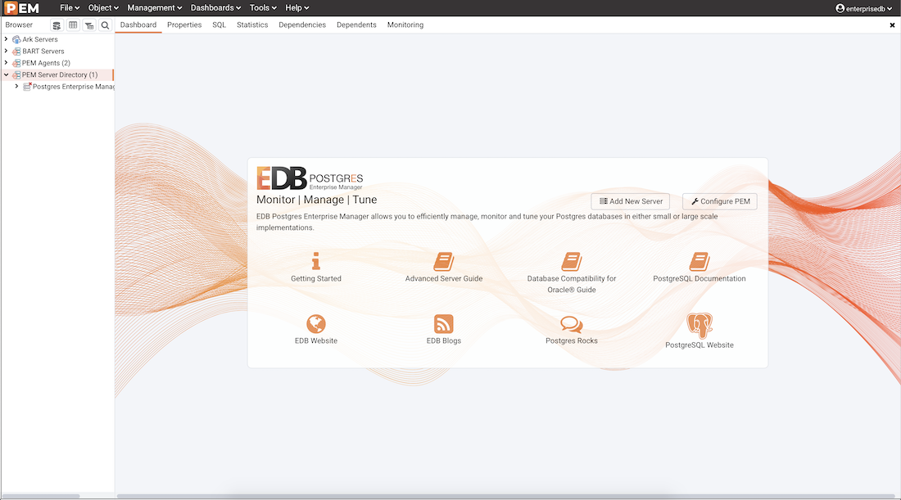

The `Dashboard` tab is context-sensitive; when you navigate to the `Dashboard` tab from a server group or the `PEM Agents` node, the EDB Postgres `Welcome` window opens, allowing you to:

-   Click the `Add New Server` icon to open the [Create - Server dialog](../01_toc_pem_getting_started/07_pem_define_connection/#pem_define_connection) to define a connection to a server.
-   Click the `Configure PEM` icon to open the [Server Configuration dialog](../04_toc_pem_features/02_pem_server_config/#pem_server_config) and modify server parameters.
-   Click the `Getting Started` icon to open a new tab, displaying the PEM Getting Started Guide at the EnterpriseDB website.
-   Click the `EDB Website` icon to navigate to the home page of the EnterpriseDB website. The EnterpriseDB website features news about upcoming events and other projects.
-   Click the `PostgreSQL Website` icon to navigate to the PostgreSQL project website. The PostgreSQL site features news about recent releases and other project information.
-   Click the `EDB Blogs` icon to navigate to the EDB Blog page, where you can review the most-recent employee posts to Postgres related blogs.

Highlight the name of an agent or server and navigate to the `Dashboard` tab to review session or server activity for the currently selected object.


When opened from the name of an agent or server, the `Dashboard` tab provides a graphical analysis of usage statistics:

-   The `Server sessions` or `Database sessions` graph displays the interactions with the server or database.
-   The `Transactions per second` graph displays the commits, rollbacks, and total transactions per second that are taking place on the server or database.
-   The `Tuples In` graph displays the number of tuples inserted, updated, and deleted on the server or database.
-   The `Tuples out` graph displays the number of tuples fetched and returned from the server or database.
-   The `Block I/O` graph displays the number of blocks read from the filesystem or fetched from the buffer cache (but not the operating system's file system cache) for the server or database.
-   The `Server activity` tabbed panel displays tables that contain session information, session locks, prepared transactions and configuration.


Navigate to the `Properties` tab to review the properties of the item currently highlighted in the tree control.

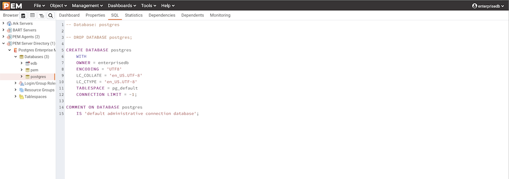

The `SQL` tab displays the SQL code used to generate the object currently selected in the Browser tree control.


The `Statistics` tab displays the statistics gathered for each object on the tree control; the statistics displayed in the table vary by the type of object that is highlighted. Click a column heading to sort the table by the data displayed in the column; click again to reverse the sort order. The following table lists some of the statistics that may be displayed:

| Panel                     | Description                                                                                                |
| ------------------------- | ---------------------------------------------------------------------------------------------------------- |
| `PID`                     | The process ID associated with the row.                                                                    |
| `User`                    | The name of the user that owns the object.                                                                 |
| `Database`                | displays the database name.                                                                                |
| `Backends`                | displays the number of current connections to the database.                                                |
| `Backend start`           | The start time of the backend process.                                                                     |
| `Xact Committed`          | displays the number of transactions committed to the database within the last week.                        |
| `Xact Rolled Back`        | displays the number of transactions rolled back within the last week.                                      |
| `Blocks Read`             | displays the number of blocks read from memory (in megabytes) within the last week.                        |
| `Blocks Hit`              | displays the number of blocks hit in the cache (in megabytes) within the last week.                        |
| `Tuples Returned`         | displays the number of tuples returned within the last week.                                               |
| `Tuples Fetched`          | displays the number of tuples fetched within the last week.                                                |
| `Tuples Inserted`         | displays the number of tuples inserted into the database within the last week.                             |
| `Tuples Updated`          | displays the number of tuples updated in the database within the last week.                                |
| `Tuples Deleted`          | displays the number of tuples deleted from the database within the last week.                              |
| `Last statistics reset`   | displays the time of the last statistics reset for the database.                                           |
| `Tablespace conflicts`    | displays the number of queries canceled because of recovery conflict with dropped tablespaces in database. |
| `Lock conflicts`          | displays the number of queries canceled because of recovery conflict with locks in database.               |
| `Snapshot conflicts`      | displays the number of queries canceled because of recovery conflict with old snapshots in database.       |
| `Bufferpin conflicts`     | displays the number of queries canceled because of recovery conflict with pinned buffers in database.      |
| `Temporary files`         | displays the total number of temporary files, including those used by the statistics collector.            |
| `Size of temporary files` | displays the size of the temporary files.                                                                  |
| `Deadlocks`               | displays the number of queries canceled because of a recovery conflict with deadlocks in database.         |
| `Block read time`         | displays the number of milliseconds required to read the blocks read.                                      |
| `Block write time`        | displays the number of milliseconds required to write the blocks read.                                     |
| `Size`                    | displays the size (in megabytes) of the selected database.                                                 |

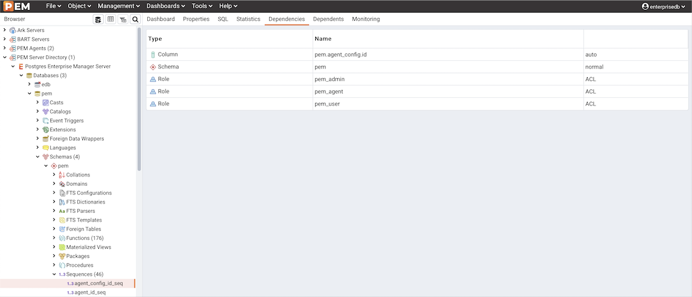

The `Dependencies` tab displays the objects on which the currently selected object depends. To ensure the integrity of the database structure, the server makes sure that you do not accidentally drop objects that other objects depend on; you must use DROP CASCADE to remove an object on which another object depends.

The `Dependencies` table displays:

-   The `Type` field specifies the parent object type.
-   The `Name` field specifies the identifying name of the parent object.
-   The `Restriction` field describes the dependency relationship between the currently selected object and the parent.


The `Dependents` tab displays a table of objects that depend on the object currently selected in the `pgAdmin` browser. A dependent object can be dropped without affecting the object currently selected in the `pgAdmin` tree control.

-   The `Type` field specifies the dependent object type.
-   The `Name` field specifies the identifying name for the dependent object.
-   The `Restriction` field describes the dependency relationship between the currently selected object and the parent.
-   Navigate to the `Monitoring` tab to access information presented on [PEM dashboards](../04_toc_pem_features/01_dashboards/#dashboards). Dashboards display statistical information about the objects monitored by the PEM server.


PEM will open additional tabs when you access PEM functionality through the `Management` or `Tools` dialogs. Right-click the current tab and select from a context menu that allows you to customize the display for your working style:

-   Click `Remove Panel` to remove the currently selected panel.
-   Click `Float Panel` to detach the currently selected panel, repositioning it for convenience.
-   Click `Add Panel` and select from the context menu to display the pgAdmin or PostgreSQL project website.

The PEM client will preserve any adjustments when you exit the program; to reset the PEM client to its original format, select `Reset Layout` from the `File` menu.

### Using Chart, Graph and Table Controls

Use the icons in the upper-right corner of each graphic on a PEM Client dashboard to control, download, and customize the charts, graphs and tables displayed in the PEM client.

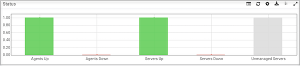

Use the `Refresh` icon  to display the most-recent content available from the PEM probes.

Select the `Download` icon  to download a .jpeg or .png image of the chart or graph. By default, the file will be in .jpeg format; to save the file as a .png, use the `Personalize` icon to modify the download format.

Select the `Fullscreen` icon  to expand the chart or graph to fill the main pane of the PEM client.

Select the `Personalize`  icon to modify the display properties of the chart or graph for your session only.

Use the `Information`  icon to access information about the chart or graph.

**Personalizing a Graphic**

When you select the `Personalize` icon, the `Personalize chart configuration` dialog opens:


Use controls on the `Personalize chart configuration` dialog to modify the properties of the graphic:

-   Use the `Auto Refresh` control to increase or decrease the number of seconds between refreshes.
-   Use the `Auto Refresh` field to specify the number of seconds between updates of the data displayed in the table or chart.
-   If applicable, use the `Download as` field to indicate if you would like a chart to be downloaded as a JPEG image or a PNG image.
-   If applicable, use the `Colours` selectors to specify the display colors that will be used on a chart.
-   If applicable, set the `Show Acknowledged Alerts` switch to `Yes` indicate that you would like the table to display alerts that you have acknowledged with a checkbox in the `Ack'ed` column. Set the field to `No` to indicate that the table should hide any acknowledged alerts. The switch acts as a toggle; acknowledged alerts are not purged from the table content until the time specified in the alert definition passes.

After personalizing the display properties, use the controls in the upper-right hand corner to apply your changes:

-   Use the `Delete` icon to reset the properties of the graphic to their default settings; use the drop-down listbox to access a menu that allows you to apply the change to only this instance of the graphic, or to the same graphic when displayed on other dashboards.
-   Use the `Save` icon to save your changes to the properties for the graphic; use the drop-down listbox to access a menu that allows you to apply the change to only this instance of the graphic, or to the same graphic when displayed on other dashboards.
-   Click the X to close the dialog without changing the properties of the graphic.

---
3.2&nbsp;&nbsp;&nbsp;&nbsp;&nbsp;&nbsp;&nbsp;&nbsp;&nbsp;&nbsp;Browser Toolbar
---

<div id="pem_toolbar" class="registered_link"></div>

The browser toolbar provides shortcut buttons for frequently used features like View Data and the Query Tool which are most frequently used in PEM. This toolbar is visible on the Browser panel. Buttons get enabled/disabled based on the selected browser node.

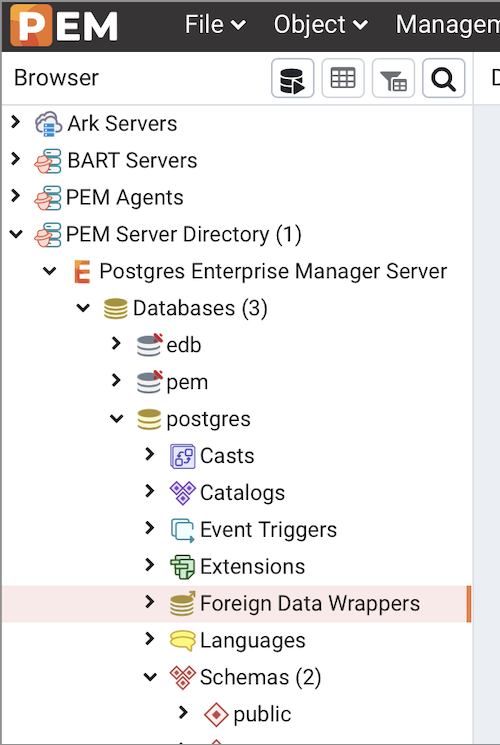

-   Use the [Query Tool](05_keyboard_shortcuts/#query-tool) button to open the Query Tool in the current database context.
-   Use the [View Data](../08_toc_pem_developer_tools/04_editgrid/#editgrid) button to view/edit the data stored in a selected table.
-   Use the [Filtered Rows](../08_toc_pem_developer_tools/04_editgrid/01_viewdata_filter/#viewdata_filter) button to access the Data Filter popup to apply a filter to a set of data for viewing/editing.

---
3.3&nbsp;&nbsp;&nbsp;&nbsp;&nbsp;&nbsp;&nbsp;&nbsp;&nbsp;&nbsp;The PEM Menu Bar
---

<div id="pem_menu_bar" class="registered_link"></div>

The PEM menu bar provides access to commands and features that you can use to manage your database servers and the objects that reside on those servers. If an option is disabled:

-   The database server to which you are currently connected may not support the selected feature.
-   The selected menu option may not be valid for the current object (by design).
-   The role that you have used to connect to the server may have insufficient privileges to change the selected object.

Context-sensitive menus across the top of the PEM web interface allow you to customize your environment and provide access to the enterprise management features of PEM.

**The File Menu**

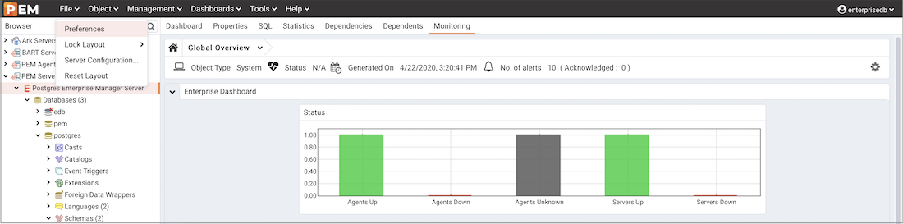

Use the `File` menu to access the following options:

| Menu Option          | Action                                                                                                                                                                                |
| -------------------- | ------------------------------------------------------------------------------------------------------------------------------------------------------------------------------------- |
| Preferences          | Click to open the [Preferences](04_preferences/#preferences) dialog to customize your PEM client settings.                                                                            |
| Lock Layout          | Click to open a sub-menu to select the level for locking the UI layout. This can also be changed from the Browser -> Display settings tab [preferences](04_preferences/#preferences). |
| Server Configuration | Click to open the Server Configuration dialog and update your PEM server configuration settings.                                                                                      |
| Reset Layout         | If a workspace panel is popped out by mistake or intentionally it can be reset back to default using Reset Layout.                                                                    |

**The Object Menu**

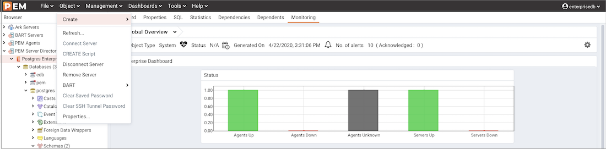

The `Object` menu is context-sensitive. Use the `Object` menu to access the following options:

| Menu Option                | Action                                                                                                                                                               |
| -------------------------- | -------------------------------------------------------------------------------------------------------------------------------------------------------------------- |
| Create                     | Click `Create` to access a context menu that provides context-sensitive selections. Your selection opens a `Create` dialog for creating a new object.                |
| Refresh...                 | Click to refresh the currently selected object.                                                                                                                      |
| Connect Server             | Click to open the [Connect to Server](../01_toc_pem_getting_started/09_pem_connect_to_server/#pem_connect_to_server) dialog to establish a connection with a server. |
| CREATE Script              | Click to open the [Query tool](05_keyboard_shortcuts/#query-tool) to edit or view the selected script.                                                               |
| Disconnect Server/Database | Click to disconnect the selected server.                                                                                                                             |
| Remove Server              | Click to remove the selected server from the browser tree.                                                                                                           |
| BART                       | Click to access a context menu that provides options for removing BART configuration, taking a BART backup, or revalidate the BART configuration.                    |
| Clear Saved Password       | If you have saved the database server password, click to clear the saved password. Enabled only after password is saved.                                             |
| Clear SSH Tunnel Password  | If you have saved the ssh tunnel password, click to clear the saved password. Enabled only after password is saved.                                                  |
| Drop Cascade               | Click to delete the currently selected object and all dependent objects from the server.                                                                             |
| Properties...              | Click to review or modify the currently selected object's properties                                                                                                 |
| Delete/Drop                | Click to delete the currently selected object from the server.                                                                                                       |
| Connect Database           | Click to connect to selected database.                                                                                                                               |
| Trigger(s)                 | Click to `Disable` or `Enable` trigger(s) for the currently selected table.                                                                                          |
| Truncate                   | Click to remove all rows from a table (Truncate) or to remove all rows from a table and its child tables (Truncate Cascade).                                         |
| View/Edit Data             | Click to access a context menu that provides several options (All Rows, First 100 Rows, Last 100 Rows, Filtered Rows) for viewing data.                              |
| Count Rows                 | Click to count the number of rows of the selected table.                                                                                                             |
| Reset Statistics           | Click to reset the statistics of the selected table.                                                                                                                 |
| Scripts                    | Click to CREATE, DELETE, INSERT, SELECT and UPDATE script for the selected table.                                                                                    |

**The Management Menu**

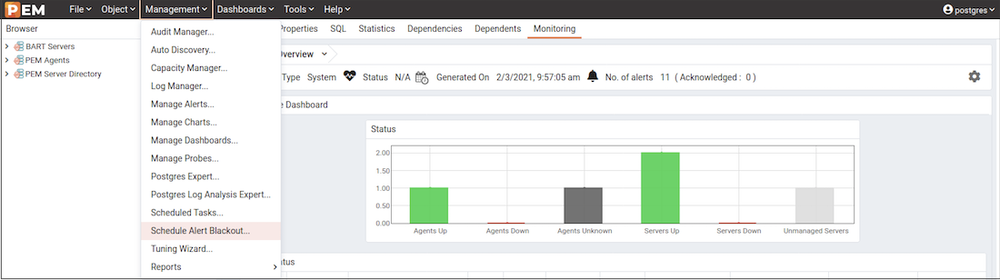

Use the `Management` menu to access the following PEM features:

| Menu Option                     | Action                                                                                                                                                                                          |
| ------------------------------- | ----------------------------------------------------------------------------------------------------------------------------------------------------------------------------------------------- |
| Audit Manager...                | Click to open the [Audit Manager](../04_toc_pem_features/04_audit_manager/#audit_manager) and configure auditing on your monitored servers.                                                     |
| Auto Discovery...               | Click to open the [Auto Discovery](../01_toc_pem_getting_started/06_auto_discovery_dialog/#auto_discovery_dialog) dialog to instruct a PEM agent to locate and bind monitored database servers. |
| Capacity Manager...             | Click to open the [Capacity Manager](../04_toc_pem_features/08_capacity_manager/#capacity_manager) dialog and analyze historical or project future resource usage.                              |
| Log Manager...                  | Click to open the [Log Manager](../04_toc_pem_features/03_log_manager/#log_manager) dialog and configure log collection for a server.                                                           |
| Manage Alerts...                | Click to access the [Manage Alerts](../04_toc_pem_features/09_pem_alerting/01_pem_alerting_dialog/#pem_alerting_dialog) tab and create or modify alerting behavior.                             |
| Manage Charts...                | Click to open the [Manage Charts](../04_toc_pem_features/10_pem_manage_charts/#pem_manage_charts) tab to create or modify PEM charts.                                                           |
| Manage Dashboards...            | Click to open the [Manage Dashboards](../04_toc_pem_features/11_pem_manage_dashboards/01_pem_custom_dashboard/#pem_custom_dashboard) dialog to VACUUM, ANALYZE, REINDEX, or CLUSTER.            |
| Manage Probes...                | Click to open the [Manage Probes](../05_toc_pem_management_basics/04_maintenance/01_maintenance_dialog/#maintenance_dialog) dialog to VACUUM, ANALYZE, REINDEX, or CLUSTER.                     |
| Postgres Expert...              | Click to open the [Postgres Expert](../04_toc_pem_features/07_pem_postgres_expert/#pem_postgres_expert) wizard and perform a static analysis of your servers and databases.                     |
| Postgres Log Analysis Expert... | Click to access the [Postgres Log Analysis Expert](../04_toc_pem_features/05_pem_log_analysis_expert/#pem_log_analysis_expert) dialog analyze log file contents for usage trends.               |
| Scheduled Tasks...              | Click to open the [Scheduled Tasks](../04_toc_pem_features/18_pem_task_view/#pem_task_view) tab and review tasks that are pending or recently completed.                                        |
| Schedule Alert Blackout...      | Click to open the [Schedule Alert Blackout](../04_toc_pem_features/13_pem_alert_blackout/#pem_alert_blackout) dialog and schedule the alerts blackout for your servers and agents.              |
| Tuning Wizard...                | Click to open the [Tuning Wizard](../04_toc_pem_features/06_tuning_wizard/#tuning_wizard) dialog to generate a set of tuning recommendations for your server.                                   |
| Reports                         | Click to open the [Reports](../04_toc_pem_features/21_reports/#reports) dialog to generate the system configuration report and core usage report for your server.                               |

**The Dashboards Menu**

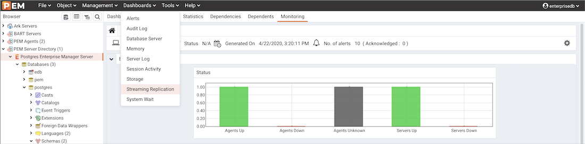

The `Dashboards` menu is context-sensitive; use the `Dashboards` menu to access the following options:

| Menu Option           | Action                                                                                      |
| --------------------- | ------------------------------------------------------------------------------------------- |
| Alerts                | Click to open the Alerts Dashboard for the selected node.                                   |
| Audit Log             | Click to open the Audit Log Analysis Dashboard for the selected node.                       |
| Database Server       | Click to open the Database Analysis Dashboard for the selected node.                        |
| Memory                | Click to open the Memory Analysis Dashboard for the selected node                           |
| Server Log            | Click to open the Server Log Analysis Dashboard for the selected node.                      |
| Session Activity      | Click to open the Session Activity Analysis Dashboard for the selected node.                |
| Storage               | Click to open the Storage Analysis Dashboard for the selected node.                         |
| Streaming Replication | Click to open the Streaming Replication Analysis Dashboard for the selected node.           |
| System Wait           | Click to open the System Wait Analysis Dashboard for the selected node.                     |
| I/O Analysis          | Click to open the I/O Analysis Dashboard for the selected node.                             |
| Object Activity       | Click to open the Object Activity Analysis Dashboard for the selected node.                 |
| Session Waits         | Click to open the Session Waits Analysis Dasbhoard for the selected node.                   |
| Operating System      | Click to open the Operating System Analysis Dashboard for the selected node.                |
| Probe Log             | Click to open the Probe Log Analysis Dashboard for the selected node.                       |
| Custom Dashboards     | Click to open the Custom Dashboards. It will list custom dashboards configured by the user. |

**The Tools Menu**

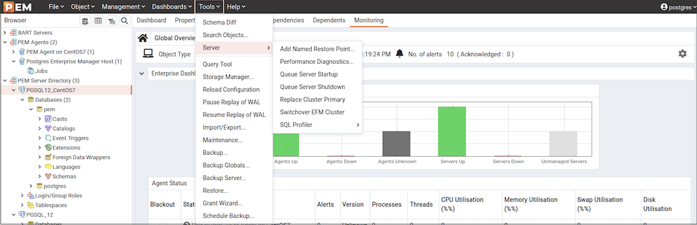

Use the `Tools` menu to access the following options:

| Menu Option          | Action                                                                                                                                                                                                                    |
| -------------------- | ------------------------------------------------------------------------------------------------------------------------------------------------------------------------------------------------------------------------- |
| Schema Diff          | Click to open the [Schema Diff](../08_toc_pem_developer_tools/05_schema_diff/#schema_diff_feature) dialog to compare the schema objects between two database schemas.                                                     |
| Search objects       | Click to open the Search Objects dialog to search the database objects within a database.                                                                                                                                 |
| Server               | Click to access the various server related tools such as Add Named Restore Point, Performance Diagnostics, Queue Server Startup, Queue Server Shutdown, Replace Cluster Primary, Switchover EFM Cluster and SQL Profiler. |
| Query Tool           | Click to open the [Query tool](05_keyboard_shortcuts/#query-tool) for the currently selected object.                                                                                                                      |
| Storage Manager      | Click to open the [Storage manager](../05_toc_pem_management_basics/05_storage_manager/#storage_manager) to upload, delete or download the backup files.                                                                  |
| Reload Configuration | Click to update configuration files without restarting the server.                                                                                                                                                        |
| Pause replay of WAL  | Click to pause the replay of the WAL log.                                                                                                                                                                                 |
| Resume replay of WAL | Click to resume the replay of the WAL log.                                                                                                                                                                                |
| Import/Export...     | Click to open the Import/Export data... dialog to import or export data from a table.                                                                                                                                     |
| Maintenance...       | Click to open the Maintenance... dialog to VACUUM, ANALYZE, REINDEX, or CLUSTER.                                                                                                                                          |
| Backup...            | Click to open the [Backup...](../05_toc_pem_management_basics/06_backup_dialog/#backup_dialog) dialog to backup database objects.                                                                                         |
| Backup Globals...    | Click to open the [Backup Globals...](../05_toc_pem_management_basics/07_backup_globals_dialog/#backup_globals_dialog) dialog to backup cluster objects.                                                                  |
| Backup Server...     | Click to open the [Backup Server...](../05_toc_pem_management_basics/08_backup_server_dialog/#backup_server_dialog) dialog to backup a server.                                                                            |
| Restore...           | Click to access the [Restore](../05_toc_pem_management_basics/09_restore_dialog/#restore_dialog) dialog to restore database files from a backup.                                                                          |
| Grant Wizard...      | Click to access the [Grant Wizard](../05_toc_pem_management_basics/01_grant_wizard/#grant_wizard) tool.                                                                                                                   |
| Schedule Backup      | Click to access the Schedule Backup dialog for BART backups.                                                                                                                                                              |

**The Help Menu**

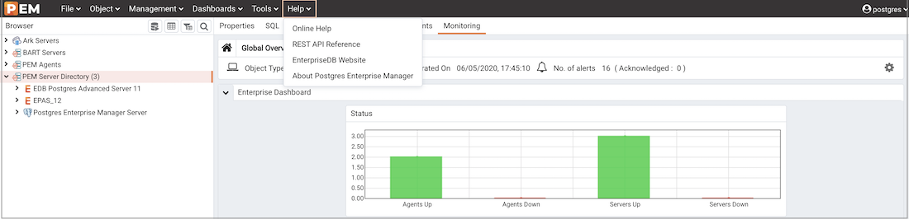

Use the options on the `Help` menu to access online help documents or to review information about the PEM installation:

| Menu Option                       | Action                                                                           |
| --------------------------------- | -------------------------------------------------------------------------------- |
| Online Help                       | Click to open documentation for Postgres Enterprise Manager.                     |
| REST API Reference                | Click to open the REST API Reference.                                            |
| EnterpriseDB Website              | Click to open the EnterpriseDB website in a browser window.                      |
| About Postgres Enterprise Manager | Click to locate versioning and user information for Postgres Enterprise Manager. |

---
3.4&nbsp;&nbsp;&nbsp;&nbsp;&nbsp;&nbsp;&nbsp;&nbsp;&nbsp;&nbsp;PEM Client Preferences
---

<div id="preferences" class="registered_link"></div>

Use options on the `Preferences` dialog to customize the behavior of the PEM web interface. To open the dialog, select `Preferences` from the `File` menu. The left pane of the `Preferences` dialog displays a tree control; each node of the tree control provides access to options that are related to the node under which they are displayed.

-   Use the plus sign (+) to the left of a node name to expand a segment of the tree control.
-   Use the minus sign (-) to the left of a node name to close that node.

**The BART Servers Node**

Use the `Nodes` panel to select the BART Servers that will be displayed in the Browser tree control of BART Servers:

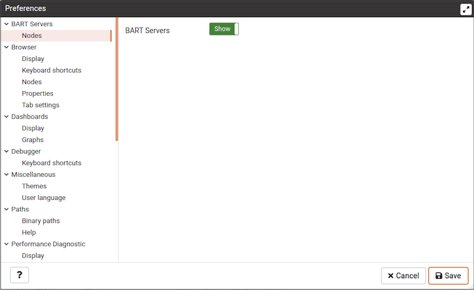

-   Slide the switch located next to BART Servers to show or hide the BART Servers in the browser tree.

**The Browser Node**

Use the fields on the `Browser` node of the tree control to personalize your workspace.

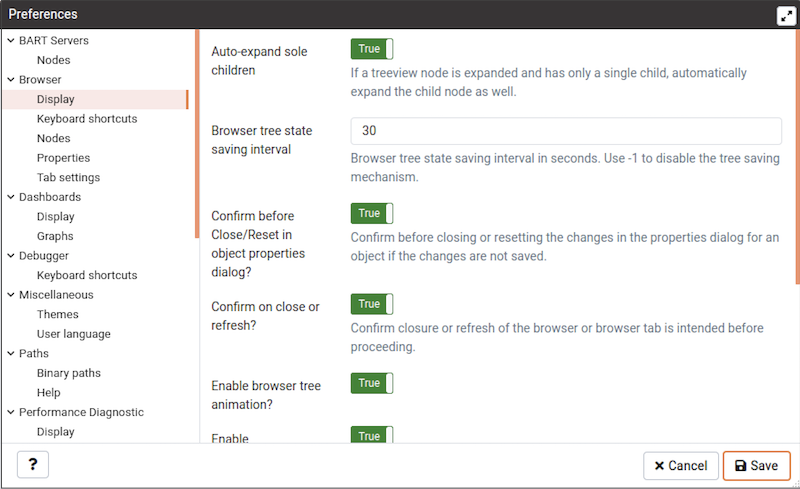

Use the fields on the `Display` panel to specify general display preferences:

-   When the `Enable browser tree animation?` switch is set to `True`, the client will display the animated tree control; if the switch is `False`, the tree control will be unanimated.
-   When the `Auto-expand sole children` switch is set to `True`, child nodes will be automatically expanded if a treeview node is expanded and has only a single child.
-   Use the `Browser tree state saving interval` field to set the treeview state saving interval. A value of `-1` will disable the treeview state saving functionality.
-   When the `Confirm before closing properties with unsaved changes` switch is set to `True`, pgAdmin will warn you before closing the properties dialog of an object if there are any unsaved changes. On user confirmation, the properties dialog will close.
-   When the `Confirm on close or refresh` switch is set to `True`, pgAdmin will attempt to catch browser close or refresh events and prompt before allowing them to continue.
-   When the `Show system objects?` switch is set to `True`, the client will display system objects such as system schemas (for example, `pg_temp`) or system columns (for example, `xmin` or `ctid`) in the tree control.
-   When the `Enable dialogue/notification animation?` switch is set to `True`, the client will display the animated dialogues/notifications; if the switch is `False`, the tree control will be unanimated.
-   Set `Show hidden groups?` to `True` to display hidden groups in the Browser tree control.
-   Set `Show system objects?` to `True` to display system objects such as system schemas (for example, `pg_temp`) or system columns (for example, `xmin` or `ctid`) in the Browser tree control.
-   Use the `Lock layout` field to lock the UI layout at different levels.

| Option            | Action                                                            |
| ----------------- | ----------------------------------------------------------------- |
| `None`            | No locking. Every panel is resizable and dockable.<br />          |
| `Prevent docking` | This will disable the docking/undocking of the panels<br />       |
| `Full`            | This will disable resizing, docking/undocking of the panels<br /> |

-   When the `Show system objects?` switch is set to `True`, the client will display system objects such as system schemas (for example, `pg_temp`) or system columns (for example, `xmin` or `ctid`) in the tree control.

Use the fields on the `Keyboard shortcuts` panel to configure shortcuts for the main window navigation:


-   Use controls on the `Keyboard shortcuts` panel to specify the combination of modifier keys that define shortcuts for the PEM main window.

Use the fields on the `Nodes` panel to select the object types that will be displayed in the `Browser` tree control:

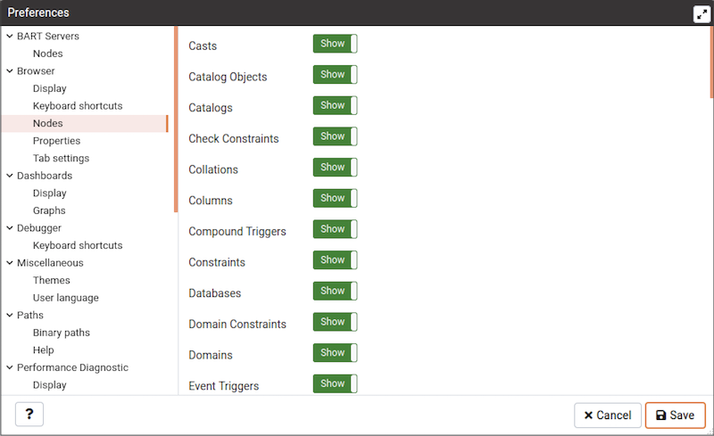

-   The panel displays a list of database objects; slide the switch located next to each object type to `Show` or `Hide` the database object. When querying system catalogs, you can reduce the number of object types displayed to increase speed.

Use fields on the `Properties` panel to specify browser properties:

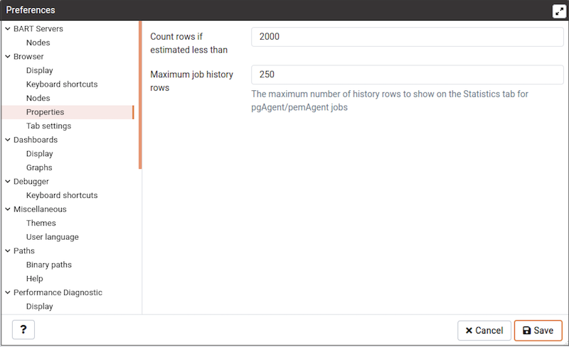

-   Include a value in the `Count rows if estimated less than` field to perform a SELECT count(`) if the estimated number of rows in a table (as read from the table statistics) is below the specified limit.  After performing the SELECT count(`), pgAdmin will display the row count. The default is 2000.
-   Provide a value in the `Maximum job history rows` field to limit the number of rows to show on the statistics tab for pgAgent jobs. The default is 250.

Use field on *Tab settings* panel to specify the tab related properties.


-   Use *Debugger tab title placeholder* field to customize the Debugger tab title.
-   When the *Dynamic tab size* If set to True, the tabs will take full size as per the title, it will also applicable for already opened tabs
-   When the *Open in new browser tab* filed is selected for Query tool, Schema Diff or Debugger, it will open in a new browser tab when invoked.
-   Use the *Query tool tab title placeholder* field to customize the query tool tab title.
-   Use *View/Edit tab title placeholder* field to customize the View/Edit Data tab title.

**The Dashboards Node**

Expand the `Dashboards` node to specify your dashboard display preferences.

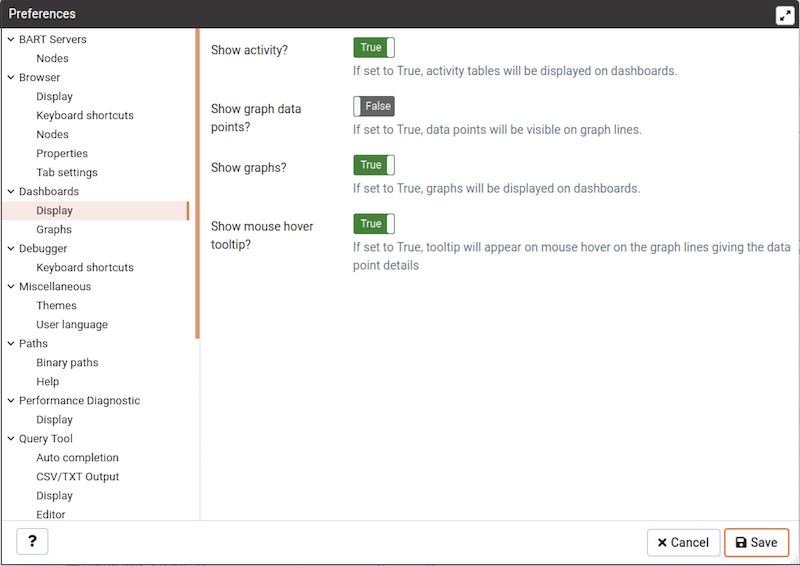

-   When the `Show activity?` switch is set to `True`, activity tables will be displayed on dashboards.
-   When the `Show graph data points?` switch is set to `True`, data points will be visible on graph lines.
-   When the `Show graphs?` switch is set to `True`, graphs will be displayed on dashboards.
-   When the `Show mouse hover tooltip?` switch is set to `True`, a tooltip will appear on mouse hover on the graph lines giving the data point details.

Use the fields on the `Graphs` panel to specify your display preferences for the graphs on the `Dashboard` tab:


Use the fields on the `Graphs` panel to specify your display preferences for the graphs on the `Dashboard` tab:

-   Use the `Block I/O statistics refresh rate` field to specify the number of seconds between block I/O statistic samples displayed in graphs.
-   Use the `Session statistics refresh rate` field to specify the number of seconds between session statistic samples displayed in graphs.
-   Use the `Transaction throughput refresh rate` field to specify the number of seconds between transaction throughput samples displayed in graphs.
-   Use the `Tuples in refresh rate` field to specify the number of seconds between tuples-in samples displayed in graphs.
-   Use the `Tuples out refresh rate` field to specify the number of seconds between tuples-out samples displayed in graphs.

**The Debugger Node**

Expand the `Debugger` node to specify your debugger display preferences.

Use the fields on the `Keyboard shortcuts` panel to configure shortcuts for the debugger window navigation:

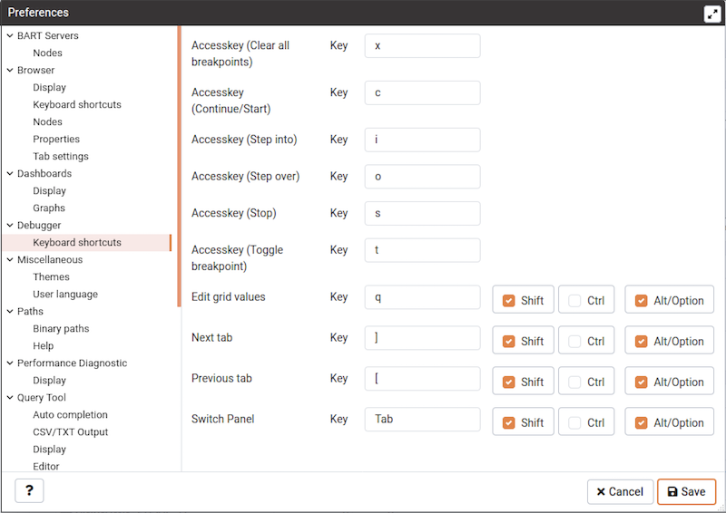

**The Miscellaneous Node**

Expand the `Miscellaneous` node to specify miscellaneous display preferences.

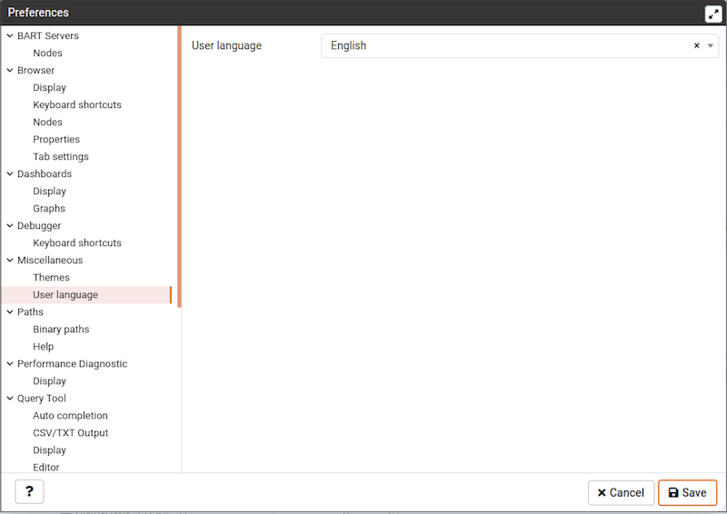

-   Use the `User language` drop-down listbox to select the display language for the PEM web interface.

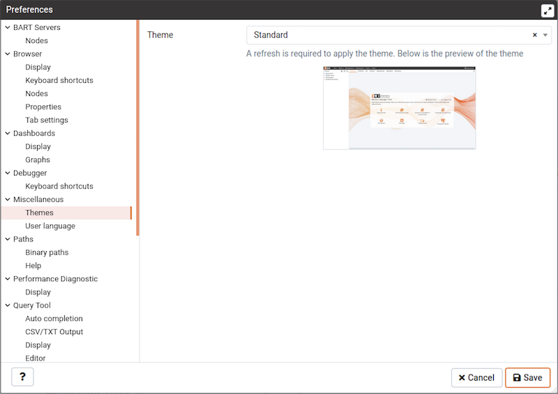

-   Use the `Themes` drop-down listbox to select the theme for PEM. You'll also get a preview just below the drop down. Note that, to apply the theme you need to refresh the PEM page.

**The Paths Node**

Expand the `Paths` node to specify the locations of supporting utility and help files.


Use the fields on the `Binary paths` panel to specify the path to the directory that contains the utility programs (pg_dump, pg_restore, and pg_dumpall) for monitored databases:

-   Use the `EDB Advanced Server Binary Path` field to specify the location of the EDB Postgres Advanced Server utility programs. If this path is not set, pgAdmin will attempt to find the utilities in standard locations used by EnterpriseDB.
-   Use the `Greenplum Database Binary Path` field to specify the location of the Greenplum database utility programs. If this path is not set, pgAdmin will attempt to find the utilities in standard locations used by Greenplum.
-   Use the `PostgreSQL Binary Path` field to specify the location of the PostgreSQL utility programs. If this path is not set, pgAdmin will attempt to find the utilities in standard locations used by PostgreSQL.


Use the fields on the `Help` panel to specify the location of help files.

-   Use the `EDB Advanced Server Help Path` field to specify the path to EDB Postgres Advanced Server documentation.
-   Use the `PostgreSQL Help Path` field to specify the path to PostgreSQL documentation.

Please note: the default help paths include the `VERSION` placeholder; the $VERSION$ placeholder will be replaced by the current database version.

**The Performance Diagnostic Node**

Expand the `Performance Diagnostic` node to specify your preferences for the Performance Diagnostic tool.

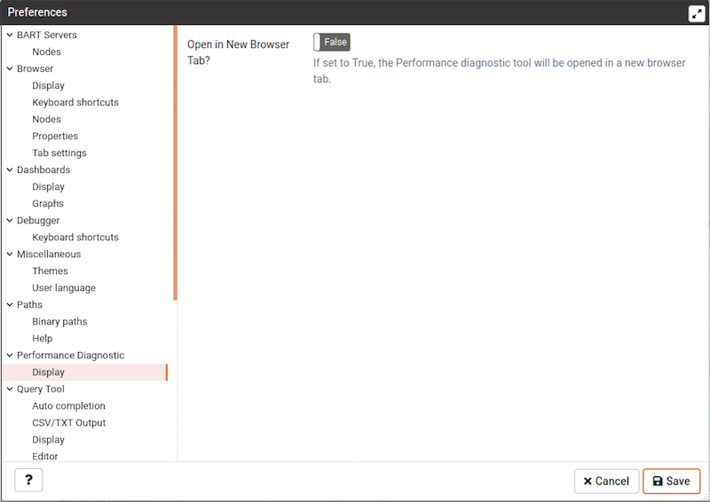

Use the fields on the `Performance Diagnostic` panel to control the Performance Diagnostic output.

-   Use the `Default graph selection` field to specify the default selection range in hours for performance diagnostic graphs.
-   When the `Open in new browser tab?` switch is set to True, the Performance Diagnostic tool will be opened in a new browser tab.

**The Query Tool Node**

Expand the `Query Tool` node to access panels that allow you to specify your preferences for the Query Editor tool.

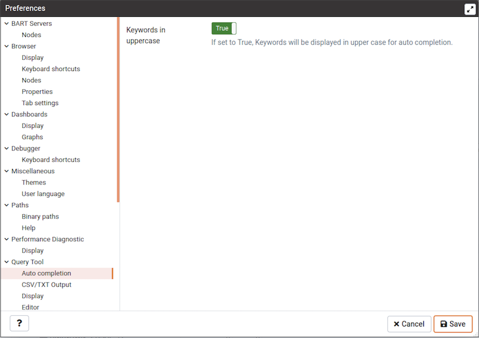

Use the fields on the `Auto Completion` panel to set the auto completion options.

-   When the `Keywords in uppercase` switch is set to `True`, keywords are displayed in upper case.


Use the fields on the `CSV Output` panel to control the CSV output.

-   Use the `CSV field separator` drop-down listbox to specify the separator character that will be used in CSV/TXT output.
-   Use the `CSV quote character` drop-down listbox to specify the quote character that will be used in CSV/TXT output.
-   Use the `CSV quoting` drop-down listbox to select the fields that will be quoted in the CSV/TXT output; select `Strings`, *All*, or `None`.
-   Use the `Replace null values with` option to replace null values with specified string in the output file. Default is set to 'NULL'.

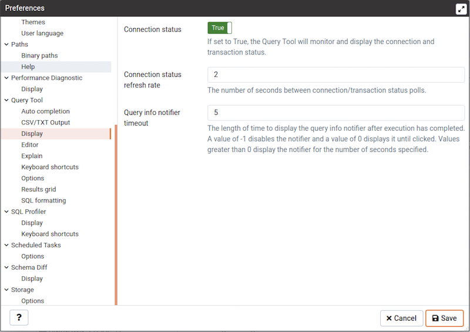

Use the fields on the `Display` panel to specify your preferences for the Query Tool display.

-   When the `Connection status` switch is set to `True`, each new instance of the Query Tool will display connection and transaction status.
-   Use the `Connection status refresh rate` field to specify the number of seconds between connection/transaction status updates.
-   Use the `Query info notifier timeout` field to control the behaviour of the notifier that is displayed when query execution completes. A value of `-1` will disable the notifier, and a value of 0 will display it until clicked. If a positive value above zero is specified, the notifier will be displayed for the specified number of seconds. The default is `5`.

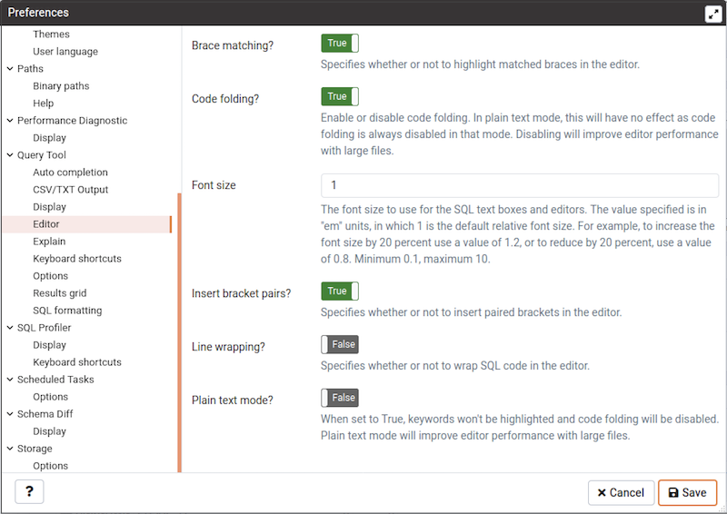

Use the fields on the `Editor` panel to change settings of the query editor.

-   When the `Brace matching?` switch is set to `True`, the editor will highlight pairs of matched braces.
-   When the `Code folding?` switch is set to `False`, the editor will disable code folding. Disabling will improve editor performance with large files.
-   Use the `Font size` field to specify the font size that will be used in text boxes and editors.
-   When the `Insert bracket pairs?` switch is set to `True`, the editor will automatically insert paired brackets.
-   When the `Line wrapping` switch is set to `True`, the editor will implement line-wrapping behavior.
-   When the `Plain text mode?` switch is set to `True`, the editor mode will be changed to text/plain. Keyword highlighting and code folding will be disabled. This will improve editor performance with large files.

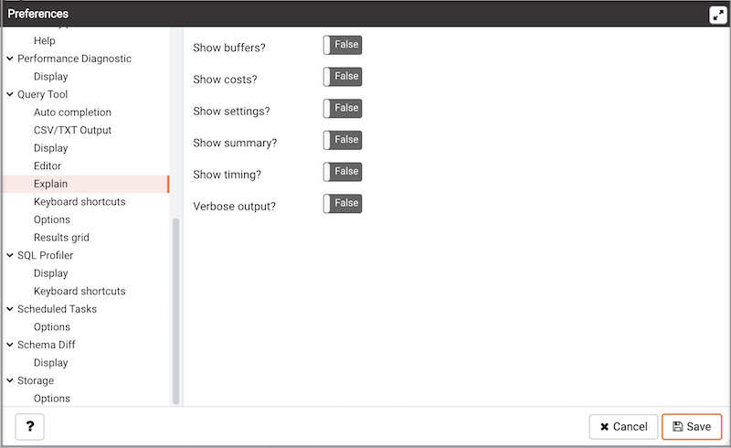

Use the fields on the `Explain` panel to specify the level of detail included in a graphical EXPLAIN.

-   When the `Show Buffers?` switch is set to `True`, graphical explain details will include information about buffer usage.
-   When the `Show Costs?` switch is set to `True`, graphical explain details will include information about the estimated startup and total cost of each plan, as well as the estimated number of rows and the estimated width of each row.
-   When the `Show Timing?` switch is set to `True`, graphical explain details will include the startup time and time spent in each node in the output.
-   When the `Verbose output?` switch is set to `True`, graphical explain details will include extended information about the query execution plan.

Use the fields on the `Keyboard shortcuts` panel to configure shortcuts for the Query Tool.


Use the fields on the `Options` panel to manage Query Tool preferences.


-   When the `Auto-Commit?` switch is set to `True`, each successful query is committed after execution.
-   When the `Auto-Rollback?` switch is set to `True`, failed queries are rolled back.
-   When the `Prompt to save unsaved data changes?` switch is set to `True`, the editor will prompt the user to saved unsaved data when exiting the data editor.
-   When the `Prompt to save unsaved query changes?` switch is set to `True`, the editor will prompt the user to saved unsaved query modifications when exiting the query tool.
-   When the `Prompt to commit/rollback active transactions?` switch is set to `True`, the editor will prompt the user to commit or rollback changes when exiting the Query Tool while the current transaction is not committed.
-   When the `Sort View Data results by primary key columns?` If set to `True`, data returned when using the View/Edit Data - All Rows option will be sorted by the Primary Key columns by default. When using the First/Last 100 Rows options, data is always sorted.

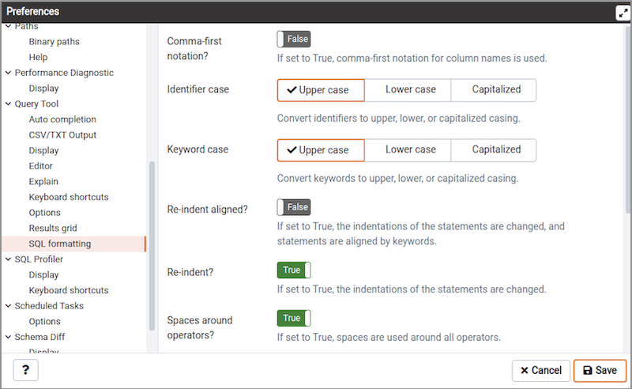

Use the fields on the *SQL formatting* panel to specify your preferences for reformatting of SQL.

-   Use the *Command-first notation* option to specify whether to place commas before or after column names.
-   Use the *Identifier case* option to specify whether to change identifiers (object names) into upper, lower, or capitalized case.
-   Use the *Keyword case* option to specify whether to change keywords into upper, lower, or capitalized case.
-   Use the *Re-indent aligned?* option to specify that indentations of statements should be changed, aligned by keywords.
-   Use the *Re-indent?* option to specify that indentations of statements should be changed.
-   Use the *Spaces around operators?* option to specify whether or not to include spaces on either side of operators.
-   Use the *Strip comments?* option to specify whether or not comments should be removed.
-   Use the *Tab size* option to specify the number of spaces per tab or indent.
-   Use the *Use spaces?* option to select whether to use spaces or tabs when indenting.
-   Use the *Wrap after N characters* option to specify the column limit for wrapping column separated lists (e.g. of column names in a table). If set to 0 (zero), each item will be on it's own line.


Use the fields on the `Results grid` panel to specify your formatting preferences for copied data.

-   Use the `Result copy field separator` drop-down listbox to select the field separator for copied data.
-   Use the `Result copy quote character` drop-down listbox to select the quote character for copied data.
-   Use the `Result copy quoting` drop-down listbox to select which type of fields require quoting; select `All`, *None*, or `Strings`.

**The SQL Profiler Node**

Use fields on the `Display` panel to specify SQL Profiler preferences.

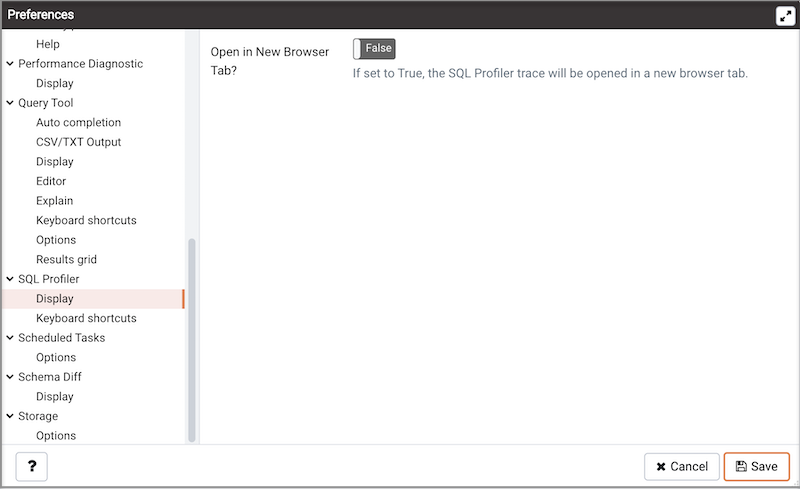

Set `Open in New Browser Tab?` to `True` to open SQL Profiler in a new browser tab when SQL Profiler is invoked.

Use the fields on the Keyboard shortcuts panel to configure shortcuts for toolbar buttons on SQL profiler trace window.

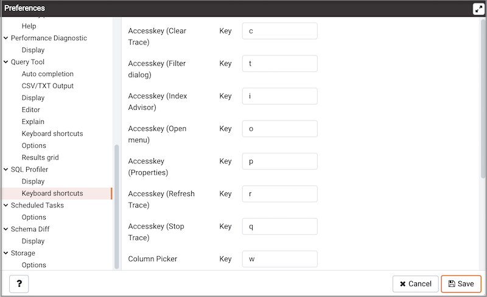

**The Scheduled Tasks Node**

Use fields on the `Options` panel to specify Scheduled Tasks preferences.

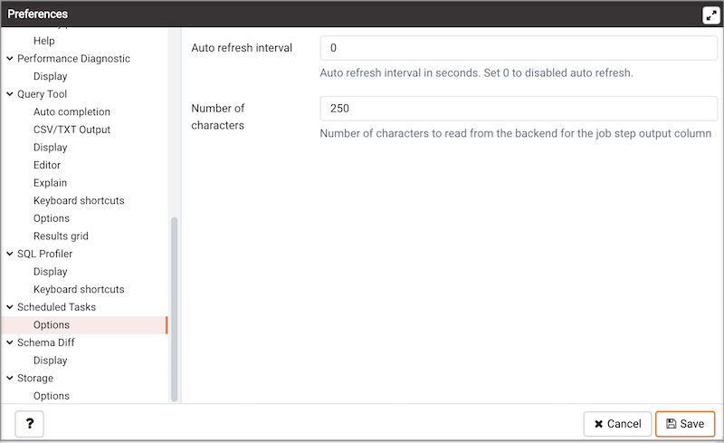

Use the `Auto refresh interval` field to specify the number of seconds between automatic refreshes; a value of 0 disables auto refresh.

**The Schema Diff Node**

Expand the `Schema Diff` node to specify your display preferences.


Use the *Ignore owner* switch to ignores the owner while comparing the objects.

Use the `Ignore whitespaces` switch to ignores the whitespaces while comparing the string objects. Whitespace includes space, tabs, and CRLF.

**The Storage Node**

Expand the `Storage` node to specify your storage preferences.


Use the fields on the `Options` panel to specify storage preferences.

-   Use the `File dialog view` drop-down listbox to select the style of icons and display format that will be displayed when you open the file manager; select `List` to display a list view, or `Grid` to display folder icons.
-   Use the `Last directory visited` field to specify the name of the folder in which the file manager will open.
-   Use the `Maximum file upload size(MB)` field on the `Options` panel of the **Storage** node to specify the maximum file size for an upload.
-   When the `Show hidden files and folders?` switch is set to `True`, the file manager will display hidden files and folders.

---
3.5&nbsp;&nbsp;&nbsp;&nbsp;&nbsp;&nbsp;&nbsp;&nbsp;&nbsp;&nbsp;Keyboard Shortcuts
---

Keyboard shortcuts are provided in pgAdmin to allow easy access to specific functions. Alternate shortcuts can be configured through File > Preferences if desired.˝

### Main Browser Window

When using main browser window, the following keyboard shortcuts are available:

| Shortcut for all platforms | Function                                    |
| -------------------------- | ------------------------------------------- |
| Alt+Shift+F                | Open the File menu                          |
| Alt+Shift+O                | Open the Object menu                        |
| Alt+Shift+L                | Open the Tools menu                         |
| Alt+Shift+H                | Open the Help menu                          |
| Alt+Shift+B                | Focus the browser tree                      |
| Alt+Shift+\[               | Move tabbed panel backward                  |
| Alt+Shift+]                | Move tabbed panel forward                   |
| Alt+Shift+Q                | Open the Query Tool in the current database |
| Alt+Shift+V                | View Data in the selected table/view        |
| Alt+Shift+C                | Open the context menu                       |
| Alt+Shift+N                | Create an object                            |
| Alt+Shift+E                | Edit object properties                      |
| Alt+Shift+D                | Delete the object                           |
| Alt+Shift+G                | Direct debugging                            |

### Dialog Tabs

Use the shortcuts below to navigate the tabsets on dialogs:

| Shortcut for all platforms | Function            |
| -------------------------- | ------------------- |
| Control+Shift+\[           | Dialog tab backward |
| Control+Shift+]            | Dialog tab forward  |

### Property Grid Controls

Use the shortcuts below when working with property grid controls:

| Shortcut for all platforms | Function                                 |
| -------------------------- | ---------------------------------------- |
| Control+Shift+A            | Add row in Grid                          |
| Tab                        | Move focus to the next control           |
| Shift+Tab                  | Move focus to the previous control       |
| Return                     | Pick the selected an item in a combo box |
| Control+Shift+A            | Add row in Grid                          |

### SQL Editors

When using the syntax-highlighting SQL editors, the following shortcuts are available:

| Shortcut (Windows/Linux) | Shortcut (Mac)       | Function                            |
| ------------------------ | -------------------- | ----------------------------------- |
| Alt + Left               | Option + Left        | Move to the beginning of the line   |
| Alt + Right              | Option + Right       | Move to the end of the line         |
| Ctrl + Alt + Left        | Cmd + Option + Left  | Move left one word                  |
| Ctrl + Alt + Right       | Cmd + Option + Right | Move right one word                 |
| Ctrl + /                 | Cmd + /              | Comment selected code (Inline)      |
| Ctrl + .                 | Cmd + .              | Uncomment selected code (Inline)    |
| Ctrl + Shift + /         | Cmd + Shift + /      | Comment/Uncomment code (Block)      |
| Ctrl + a                 | Cmd + a              | Select all                          |
| Ctrl + c                 | Cmd + c              | Copy selected text to the clipboard |
| Ctrl + r                 | Cmd + r              | Redo last edit un-done              |
| Ctrl + v                 | Cmd + v              | Paste text from the clipboard       |
| Ctrl + z                 | Cmd + z              | Undo last edit                      |
| Tab                      | Tab                  | Indent selected text                |
| Shift + Tab              | Shift + Tab          | Un-indent selected text             |
| Alt + g                  | Option + g           | Jump (to line:column)               |
| Ctrl + Space             | Ctrl + Space         | Auto-complete                       |
| Ctrl + f                 | Cmd + f              | Find                                |
| Ctrl + g                 | Cmd + g              | Find next                           |
| Ctrl + Shift + g         | Cmd + Shift + g      | Find previous                       |
| Ctrl + Shift + f         | Cmd + Shift + f      | Replace                             |

### Query Tool

When using the Query Tool, the following shortcuts are available:

| Shortcut (Windows/Linux) | Shortcut (Mac)     | Function                  |
| ------------------------ | ------------------ | ------------------------- |
| F5                       | F5                 | Execute query             |
| F6                       | F6                 | Save data changes         |
| F7                       | F7                 | EXPLAIN query             |
| Shift + F7               | Shift + F7         | EXPLAIN ANALYZE query     |
| F8                       | F8                 | Execute query to CSV file |
| &lt;accesskey> + o       | &lt;accesskey> + o | Open file                 |
| &lt;accesskey> + s       | &lt;accesskey> + s | Save file                 |
| &lt;accesskey> + n       | &lt;accesskey> + n | Find option drop down     |
| &lt;accesskey> + c       | &lt;accesskey> + c | Copy row(s)               |
| &lt;accesskey> + p       | &lt;accesskey> + p | Paste row(s)              |
| &lt;accesskey> + d       | &lt;accesskey> + d | Delete row(s)             |
| &lt;accesskey> + f       | &lt;accesskey> + f | Filter dialog             |
| &lt;accesskey> + i       | &lt;accesskey> + i | Filter options drop down  |
| &lt;accesskey> + r       | &lt;accesskey> + r | Row limit                 |
| &lt;accesskey> + q       | &lt;accesskey> + q | Cancel query              |
| &lt;accesskey> + l       | &lt;accesskey> + l | Clear option drop down    |
| &lt;accesskey> + x       | &lt;accesskey> + x | Execute option drop down  |
| &lt;accesskey> + t       | &lt;accesskey> + t | Display connection status |
| &lt;accesskey> + y       | &lt;accesskey> + y | Copy SQL on history panel |

### Debugger

When using the Debugger, the following shortcuts are available:

| Shortcut (Windows/Linux) | Shortcut (Mac)     | Function                     |
| ------------------------ | ------------------ | ---------------------------- |
| &lt;accesskey> + i       | &lt;accesskey> + i | Step in                      |
| &lt;accesskey> + o       | &lt;accesskey> + o | Step over                    |
| &lt;accesskey> + c       | &lt;accesskey> + c | Continue/Restart             |
| &lt;accesskey> + t       | &lt;accesskey> + t | Toggle breakpoint            |
| &lt;accesskey> + x       | &lt;accesskey> + x | Clear all breakpoints        |
| &lt;accesskey> + s       | &lt;accesskey> + s | Stop                         |
| Alt + Shift + q          | Option + Shift + q | Enter or Edit values in Grid |

### Inner Tab and Panel Navigation

When using the Query Tool and Debugger, the following shortcuts are available for inner panel navigation:

| Shortcut (Windows/Linux) | Shortcut (Mac)    | Function                            |
| ------------------------ | ----------------- | ----------------------------------- |
| Alt + Shift + ]          | Alt + Shift + ]   | Move to next tab within a panel     |
| Alt + Shift + \[         | Alt + Shift + \[  | Move to previous tab within a panel |
| Alt + Shift + Tab        | Alt + Shift + Tab | Move between inner panels           |

### Access Key

&lt;accesskey> is browser and platform dependant. The following table lists the default access keys for supported browsers.

| Browser           | Windows     | Linux       | Mac           |
| ----------------- | ----------- | ----------- | ------------- |
| Internet Explorer | Alt         | Alt         |               |
| Chrome            | Alt         | Alt         | Ctrl + Option |
| Firefox           | Alt + Shift | Alt + Shift | Ctrl + Option |
| Safari            | Alt         |             | Ctrl + Option |

---
3.6&nbsp;&nbsp;&nbsp;&nbsp;&nbsp;&nbsp;&nbsp;&nbsp;&nbsp;&nbsp;Search objects
---

<div id="search_objects" class="registered_link"></div>


With this dialog, you can search for almost any kind of objects in a database.

You can access it by right clicking a database or any of its child nodes and select "Search objects". You can also access it by hitting the shortcut (default ALT+SHIFT+S).

The minimum pattern length are 3 characters. The search performed is non-casesensitive and will find all objets whose name contains the pattern. You can only search for object names currently. Examples are: abc, %ab%, ab%c, %%%, etc.

The result is presented in the grid with object name, object type and the object tree path in the browser tree. You can double click on a result row to select the object in the browser tree. If the object is greyed out, this means that you have not enabled those object types in the [preferences](04_preferences/#preferences), so you can't double click on it. You can click on the ellipsis appended to the function and procedure names to see there arguments.

You can filter based on a particular object type by selecting one from the object type dropdown. If the search button is hit when one of the object type is selected then only those types will be fetch from the database. An object type will not be visible in the dropdown if the database server does not support it or if it is not enabled from the [preferences](04_preferences/#preferences).

---
4&nbsp;&nbsp;&nbsp;&nbsp;&nbsp;&nbsp;&nbsp;&nbsp;&nbsp;&nbsp;Enterprise Management Features
---

<div id="toc_pem_features" class="registered_link"></div>

Postgres Enterprise Manager offers a number of additional enterprise management features that will assist you in managing, analyzing, streamlining, and deploying Postgres functionality. PEM probes monitor managed servers, retrieving information that PEM then analyzes to create dashboards that display useful information and statistics about your hosts, servers and databases. PEM dialogs provide easy access to probe, server, and agent configurations so you can enable and customise the behaviour of PEM features.

Contents:


---
4.1&nbsp;&nbsp;&nbsp;&nbsp;&nbsp;&nbsp;&nbsp;&nbsp;&nbsp;&nbsp;Dashboards
---

<div id="dashboards" class="registered_link"></div>

Postgres Enterprise Manager uses metrics (retrieved by probes) to generate the statistical information displayed on the dashboards. Dashboards are presented in a hierarchy comparable to the PEM client tree control; the dashboard for each object within the tree control displays the information for that object, as well as for any monitored object that resides below that level in the tree control, if appropriate.

Each dashboard header displays the date and time that the server was started (if relevant), the date and time that the dashboard was last updated, and the current number of triggered alerts. Navigation menus displayed in the dashboard header provide easy access to other dashboards. Menus are organised hierarchically; only those menus appropriate for the object currently highlighted in the tree control are available:

-   Select `Global Overview` from any dashboard to return to the Global Overview dashboard.
-   Select the name of an agent from the `Agents` menu to navigate to the Operating System Analysis dashboard for that agent.
-   Select a server name from the `Servers` menu to navigate to the Server Analysis dashboard for that server.
-   Select a database name from the `Databases` menu to navigate to the Database Analysis dashboard for that database.
-   Use the `Dashboards` menu to navigate to informational dashboards at the global level, or for the selected agent, server or database.

Dashboards display statistical information in the form of:

-   Tables - Tables provide statistical information collected by a PEM probe.
-   Pie charts - Pie charts display information collected by the most recent execution of a probe.
-   Bar graphs - Bar graphs display comparative statistics collected by the most recent execution of a probe.
-   Line graphs - Line graphs display statistical data collected by PEM probes.

Options on the `Dashboard Configuration` dialog allow you to link the time lines of all of the line graphs on the dashboard. To open the `Dashboard Configuration` dialog, click the wrench icon displayed in the dashboard header.


-   Set the `Link timelines of all the line charts` slider to `Enable` to indicate that the specified timeline should be applied to line graphs displayed on the dashboard; if set to `Disable`, your preferences will be preserved for later use, but will not modify the amount of data displayed.
-   Use the `Days` selector to specify the number of days of gathered data that should be displayed on line graphs.
-   Use the `Hour(s)` selector to specify the number of hours of gathered data that should be displayed on line graphs.
-   Check the box next to `Remember configuration for this dashboard` to indicate that the customized time span should be applied to the current dashboard only; if left unchecked, the time span will be applied globally to line graphs on all dashboards.

Please note that settings specified on the `Dashboard Configuration` dialog are applied only to the current user's session.

When you've specified your preferences, click `Save` to preserve your changes and exit the dialog; click `Cancel` to exit the dialog without preserving your changes.

To sort statistics that are provided in table form, click on a column heading; click again to reverse the sort order. Each table offers a stable sort feature - For example, to sort a table by ascending `Session ID` within each user name group, sort first by the `Session ID` column, then sort by the `User Name` column.

Hover your mouse over the upper-right corner of each graph, chart or table to reveal the PEM client toolbar icons. Hover over an icon to display a tooltip that briefly explains the icon's functionality:

-   Use the `Refresh` icon to update the information displayed on a dashboard.
-   Use the `Save Chart as Image` icon to save the selected chart as a .jpeg image.
-   Use the `Full Screen` icon to enlarge the chart to reveal granular details about the charted data.
-   Click the `Personalize the chart configuration` icon to access a control panel that allows you to select chart-specific display details.
-   Hover over the `Explain` icon to review a description of the information shared in the graph or chart.

In the lower-right corner of each graph or chart is a legend that identifies each item plotted in the graph or chart.

If displayed, click the information icon in the upper-left hand corner of a chart to display a note about the chart content, and if applicable, a link that will allow you to enable one or more probes that retrieve content for the chart.

### Accessing Dashboards

Navigation menus in the dashboard header provide easy access to other dashboards. The menus are organized hierarchically, allowing you to jump from object to object at any level:

-   The [Global Overview](04_global_overview_dashboard/#global_overview_dashboard) option opens the `Global Overview` dashboard.
-   The `Agents` menu expands to display a list of agents. Select an agent from the list to access the `Operating System Analysis` dashboard for that agent.
-   The `Servers` menu expands to display a list of monitored servers. Select a server from the list to access the `Server Analysis` dashboard for that server.
-   The `Remote Servers` menu expands to display a list of servers that are monitored by a remote agent. Select a server from the list to access the `Server Analysis` dashboard for the server.
-   The `Databases` menu expands to display a list of databases. Select a database from the list to access the `Database Analysis` dashboard for the database.
-   The `Dashboards` menu expands to display a list of the dashboards that are available at the global level, or for the current agent, server or database. Select a dashboard from the list to navigate to that dashboard.

### Creating custom charts and dashboards

PEM (version 4.0 and above) allows you to create your own [Charts](../10_pem_manage_charts/01_pem_create_new_chart/#pem_create_new_chart) and [Dashboards](../11_pem_manage_dashboards/01_pem_custom_dashboard/#pem_custom_dashboard), allowing you to tailor the interface to the requirements of your organization or individual responsibility.

### Available Dashboards

PEM offers the following dashboards:

-   [Alerts Dashboard](01_alerts_dashboard/#alerts_dashboard)
-   [Audit Log Dashboard](02_audit_log_dashboard/#audit_log_dashboard)
-   [Database Analysis Dashboard](03_database_analysis_dashboard/#database_analysis_dashboard)
-   [Global Overview Dashboard](04_global_overview_dashboard/#global_overview_dashboard)
-   <span class="title-ref">I/O Analysis Dashboard &lt;io\_analysis\_dashboard&gt;</span>
-   [Memory Analysis Dashboard](06_memory_analysis_dashboard/#memory_analysis_dashboard)
-   [Object Activity Analysis Dashboard](07_object_activity_analysis_dashboard/#object_activity_analysis_dashboard)
-   [Operating System Analysis Dashboard](08_os_analysis_dashboard/#os_analysis_dashboard)
-   [Probe Log Analysis Dashboard](09_probe_log_analysis_dashboard/#probe_log_analysis_dashboard)
-   [Server Analysis Dashboard](10_server_analysis_dashboard/#server_analysis_dashboard)
-   [Server Log Analysis Dashboard](11_server_log_analysis_dashboard/#server_log_analysis_dashboard)
-   [Session Activity Analysis Dashboard](12_session_activity_analysis_dashboard/#session_activity_analysis_dashboard)
-   [Session Wait Analysis Dashboard](13_session_waits_dashboard/#session_waits_dashboard)
-   [Storage Analysis Dashboard](14_storage_analysis_dashboard/#storage_analysis_dashboard)
-   [System Wait Analysis Dashboard](15_system_wait_dashboard/#system_wait_dashboard)
-   [Streaming Replication Analysis Dashboard](16_str_replication_dashboard/#str_replication_dashboard)

Contents:


---
4.1.1&nbsp;&nbsp;&nbsp;&nbsp;&nbsp;&nbsp;&nbsp;&nbsp;&nbsp;&nbsp;The Alerts Dashboard
---

<div id="alerts_dashboard" class="registered_link"></div>

The Alerts Dashboard displays the currently triggered alerts; if opened from the Global Overview, the dashboard displays the current alerts for all monitored nodes on the system. If the Alerts Dashboard is opened from a node within a monitored hierarchy, the report will reflect alerts related to that node, and all monitored objects that reside below that object in the tree control.


Use parameters on the [PEM Server Configurations](../02_pem_server_config/#pem_server_config) dialog to specify the auto-refresh rate for the `Alerts` dashboard. To access the `Server Configuration` dialog, select `Server Configuration...` from the PEM web interface `Management` menu.

The `Alerts Dashboard` header includes the date and time that the page was last updated and a current count of triggered alerts.

The `Alerts Overview` provides an overview of triggered alerts. The right-most bar indicates the total number of configured alerts that are **not** currently in an alert state; the three left-most bars indicate the number of Low, Medium and High alerts for the selected object. The vertical key on the left side of the graph provides an alert count.

The `Alert Details` table lists the currently triggered alerts for the selected object; if opened from the global overview, the Alert Details table lists all of the currently triggered alerts for all monitored objects. Click a column heading to sort the table by the contents of a selected column; click a second time to reverse the sort order. The table contains detailed information about each alert:

-   An alert level icon displays in red for a `High` severity alert, in orange for a `Medium` severity alert, and in yellow for a `Low` severity alert.
-   Use the arrow to the right of the alert level icon to access a dialog with detailed information about the alert. Within the dialog, the `Details` tab displays detailed information about the condition that triggered the alert; the `Parameters` tab displays the values of parameters used in the alert definition. Not all alerts return data that can be viewed on the `Details` dialog; for information about which templates display detailed metrics, please see the [alert templates list](../09_pem_alerting/03_pem_alert_templates/#pem_alert_templates)


-   The `Ack'ed` column provides a checkbox to allow you to acknowledge an alert to prevent additional notifications being sent. This flag is cleared automatically if the alert condition clears and is then detected again.
-   The `Alert Type` column indicates the severity of the alert.
-   The `Name` column displays the names of the currently triggered alerts. Click the name of an alert to open the `Alerting` configuration dialogue that defines the alert.
-   The `Value` column displays the value of the metric that triggered the alert.
-   If applicable, the `Agent` column indicates the name of the agent on which the alert is defined.
-   If applicable, the `Server` column indicates the name of the server triggering the error message.
-   If applicable, the `Database` column indicates the name of the database on which the alert is defined.
-   If applicable, the `Schema` column indicates the name of the schema on which the alert is defined.
-   If applicable, the `Package` column indicates the name of the package on which the alert is defined.
-   If applicable, the `Object` column indicates the name of the monitored object on which the alert is defined.
-   If the alert definition includes specified parameters, the parameter values are displayed in the `Additional Params` column.
-   If the alert definition includes additional specified parameters, the additional parameter values are displayed in the `Additional Params Value` column.
-   The `Alerting Since` column displays the date and time that the alert triggered.

The `Alert Errors` table displays configuration-related errors (eg.accidentally disabling a required probe, or improperly configuring an alert parameter):


-   An alert indicator in the left-most column indicates that the alert was triggered by an Error.
-   The `Alert Type` column indicates the severity of the alert.
-   The `Name` column displays the name of the alert. Click an alert name to open the configuration dialogue for the alert.
-   The `Value` column displays the value of the metric that triggered the alert, if applicable.
-   If applicable, the `Agent` column displays the name of the agent triggering the alert.
-   If applicable, the `Server` column displays the name of the server triggering the alert.
-   If applicable, the `Database` column indicates the name of the database on which the alert is defined.
-   If applicable, the `Schema` column indicates the name of the schema on which the alert is defined.
-   If applicable, the `Package` column indicates the name of the package on which the alert is defined.
-   If applicable, the `Object` column indicates the name of the monitored object on which the alert is defined.
-   The `Error Message` column describes the condition that triggered the alert.
-   The `Error Timestamp` column displays the date and time that the alert was triggered.

### Customizing the Alerts Dashboard

You can customize tables and charts that appear on the Alerts dashboard. To open the `Personalize chart configuration` dialog, click the wrench icon in the upper-right corner.


The fields displayed on the dialog will vary based on the table or chart from which the dialog is opened.


Use fields on the `Personalize chart configuration` dialog to provide your display preferences:

-   Use the `Auto Refresh` field to specify the number of seconds between updates of the data displayed in the table or chart.
-   If applicable, use the `Download as` field to indicate if you would like a chart to be downloaded as a JPEG image or a PNG image.
-   If applicable, use the `Colours` selectors to specify the display colors that will be used on a chart.
-   If applicable, set the `Show Acknowledged Alerts` switch to `Yes` indicate that you would like the table to display alerts that you have acknowledged with a checkbox in the `Ack'ed` column. Set the field to `No` to indicate that the table should hide any acknowledged alerts. The switch acts as a toggle; acknowledged alerts are not purged from the table content until the time specified in the alert definition passes.

To save your customizations, click the save icon (a check mark) in the upper-right corner; to delete any previous changes and revert to the default values, click the delete icon. Save and Delete drop-down menus allow you to specify if your preferences should be applied to `All Dashboards`, or to a selected server or database. Use the close icon to close the `Personalize chart configuration` dialog without preserving your changes.

---
4.1.2&nbsp;&nbsp;&nbsp;&nbsp;&nbsp;&nbsp;&nbsp;&nbsp;&nbsp;&nbsp;The Audit Log Analysis Dashboard
---

<div id="audit_log_dashboard" class="registered_link"></div>

The Audit Log Dashboard allows you to browse the audit logs that have been collected from Advanced Server instances which have enabled audit logging and collection with the [Audit Manager](../04_audit_manager/#audit_manager). If the Audit Log Dashboard is opened from the Global level, it will display logs from all servers. If opened from the Agent level, it will show logs from all servers monitored by that Agent. If opened from the Server level, it will show logs from that server only.


The `Audit Log Dashboard` header includes the date and time that the page was last updated, and a current count of triggered alerts.

Audit Log table entries are loaded on demand in batches; to load additional entries, scroll to the end of the log and the additional rows will be automatically loaded from the database and added to the table. Log entries are show in chronological order, most recent first.

-   The `Id` column identifies the PEM agent that monitors the server that initiated the recorded transaction.
-   The `Server` column identifies the server that initiated the recorded transaction.
-   The `Timestamp` column shows the date and time that the log entry was made.
-   The `User Name` column shows the user which executed the statment in the audit log entry.
-   the `Database Name` column shows the database on which the statment in the audit log entry was executed.
-   The `Process ID` column shows the ID of the process which executed the statement in the audit log entry.
-   The `Session ID` column shows the ID of the session in which the statement in the audit log entry was executed.
-   The `Transaction ID` column shows the ID of the transaction in which the statement in the audit log entry was executed.
-   The `Connection From` column shows the client's address from where the session was connected.
-   The `Command` column shows the type of command executed.
-   The `Message` column shows the message associated with the audit log entry.

Click `Show Filters` to display a panel that you can use to filter the audit log entries that are shown in the table below; click on `Hide Filters` to close the panel.


Use the fields within the filter definition box to describe a selection criteria that PEM will use to select a subset of a report for display:

-   Use the date and time selectors in the `From` field to specify a starting date and time for the displayed log entries.
-   Use the date and time selectors in the `To` field to specify an ending date and time for the displayed log entries.
-   Enter a username in the `Username` field to show log entries for the specified user only.
-   Enter a database name in the `Database` field to show log entries for the specified database only.
-   Enter a command type (for example; 'SELECT', 'authentication' or 'idle') in the `Command Type` field to show log entries of that type only.

---
4.1.3&nbsp;&nbsp;&nbsp;&nbsp;&nbsp;&nbsp;&nbsp;&nbsp;&nbsp;&nbsp;The Database Analysis Dashboard
---

<div id="database_analysis_dashboard" class="registered_link"></div>

The Database Analysis dashboard provides a high-level overview of database activity for the selected database, including a comparative storage analysis of the 5 largest tables/indexes, user activity analysis, weekly I/O analysis, and an activity analysis of the tables that reside in the selected database.


Use parameters on the [PEM Server Configurations](../02_pem_server_config/#pem_server_config) dialog to specify the auto-refresh rate for the dashboard. To access the `Server Configuration` dialog, select `Server Configuration...` from the PEM web interface `Management` menu.

The Database Analysis dashboard header displays the date and time that the server started, the date and time that the Database Analysis dashboard was last updated, and the number of alerts currently triggered for the specified database (and monitored objects that reside within that database).

The `Storage` bar graph plots the relative size of the 5 largest tables and indexes that reside within the selected database. The vertical key on the left side of the graph indicates each table or index in megabytes; the key on the right side of the chart identifies the tables and indexes by name.

The `Users` section of the Database Analysis dashboard displays information about user connections:

-   The `User Activity` graph plots the active and idle connections over the previous week. The vertical key on the left side of the chart indicates the connection count.
-   The `Connection Overview` chart provides a comparative display of the active and idle connections currently established with the server (when the most recent probe executed).

The graphs in the `I/O` section present an analysis of I/O activity over the previous week.


-   The `Database I/O` graph plots the number of blocks found in cached memory and the number of blocks read from disk over the previous week. The vertical key on the left side of the graph indicates number of blocks hit.
-   The `Row Activity` graph displays the row activity for tables residing within the database over the previous week.

> The vertical key on the left side of the graph indicates the number of rows.

-   The `Commits/Rollbacks` graph displays the number of transactions committed and rolled back within the selected database over the previous week.

> The vertical key on the left side of the graph indicates the transaction count.


The `Hot Tables` table provides a detailed analysis of the activity for each table that resides within the selected database. Click a column heading to sort the table by the values within the column; click again to reverse the sort order.

-   The `Schema` column identifies the schema in which the table resides.
-   The `Table Name` column identifies the name of the table.
-   The `Scans` column displays the number of scans performed on the table.
-   The `Rows Read` column displays the number of rows read from the specified table.
-   The `Index Scans` column displays the number of index scans performed on the specified table.
-   The `Index Rows Read` column displays the number of rows read during index scans on the specified table.
-   The `Rows Inserted` column displays the number of rows inserted into the specified table.
-   The `Rows Updated` column displays the number of rows updated in the specified table.
-   The `Rows Deleted` column displays the number of rows deleted from the specified table.
-   The `Hot Rows Updated` column displays the number of hot row updates into the table; when a hot row update occurs, the new row occupies the same page as the previous row.
-   The `Total Rows` column displays the number of total rows in the table.
-   The `Dead Rows` column displays the number of rows that have been deleted, but have not been reclaimed via a VACUUM command or the AUTOVACUUM process.

---
4.1.4&nbsp;&nbsp;&nbsp;&nbsp;&nbsp;&nbsp;&nbsp;&nbsp;&nbsp;&nbsp;The Global Overview Dashboard
---

<div id="global_overview_dashboard" class="registered_link"></div>

Upon connecting to Postgres Enterprise Manager, the web interface displays the `Global Overview` dashboard. The Global Overview dashboard displays the status of each PEM server and agent, and calls your attention to any triggered alerts on monitored objects.


Use parameters on the [PEM Server Configurations](../02_pem_server_config/#pem_server_config) dialog to specify the auto-refresh rate for the dashboard. To access the `Server Configuration` dialog, select `Server Configuration...` from the PEM web interface `Management` menu.

The `Global Overview` header displays the date and time that the overview was last updated and the current number of triggered alerts.

The `Enterprise Dashboard` bar graph provides an at-a-glance overview of the status of your PEM agents and servers.

The `Agent Status` table provides detailed information about the status of each individual PEM agent:

-   Check the box in the `Blackout` column to disable alert processing for the agent and all servers monitored by the agent. This is useful when undertaking maintenance on the agent or the host on which the agent runs.
-   The `Status` column reports the current state of the agent; `UP`, `DOWN` or `UNKNOWN`. A healthy agent displays a green 'check' circle icon; an agent that is down displays a red 'info' circle icon; an agent registered with PEM, but - never sent an heartbeat, displays a gray 'question' circle icon. If user changes the colour for UP, DOWN or UNKNOWN status of agents in \**Enterprise Dashboard*\* bar chart, then that color will be reflected for the respective status icon.
-   The `Name` column displays the name of the agent. Click the name to navigate to the `Operating System Analysis` dashboard for the selected host.
-   The `Alerts` column displays the number of current alerts triggered on the server.
-   The `Version` column displays the agent's version.
-   The `Processes` column lists the number of processes running on the agent's host.
-   The `Threads` column lists the number of threads running on the agent's host.
-   The `CPU Utilisation (%)` column shows the average utilisation of all CPU cores on the host.
-   The `Memory Utilisation (%)` column shows the percentage of available RAM memory used on the host.
-   The `Swap Utilisation (%)` column shows the percentage of available swap memory used on the host.
-   The `Disk Utilisation` column shows the total percentage of disk space used, for all disks on the host.

The `Postgres Server Status` table provides detailed information about the status of each individual server:

-   Check the box in the `Blackout` column provides a checkbox to disable alert processing for the server. This is useful when performing maintenance on the server.
-   The `Status` column reports the current state of the server; UP, DOWN, UNKNOWN or UNMANAGED.
-   A healthy server displays a green 'check' circle icon; a disabled server displays a red 'info' circle icon; an unknown server displays a grey 'question' circle icon; an unmanged server displays a light gray 'user' circle icon. If user changes the colour for UP, DOWN, UNKNOWN or UNMANAGED servers in **Enterprise Dashboard** bar chart, then that color will be reflected for the respective status icon.
-   The `Name` column displays the name of the agent. Click the name to navigate to the `Operating System Analysis` dashboard for the host.
-   The `Connections` column reports the current number of connections to the server.
-   The `Alerts` column displays the number of current alerts triggered on the server.
-   The `Version` column lists the PostgreSQL version and build signature.
-   The `Remotely Monitored` column displays a `Yes` if the PEM agent that is bound to the monitored server does not reside on the same host as the server, and a `No` if the agent resides on the same host as the server.

Triggered alerts displayed in the `Alert Status` table include both PEM-defined alerts and user-defined alerts for all PEM-monitored hosts, servers, agents and database objects. The `Alert Status` table will also display an alert if an [agent or server is down](../../02_toc_pem_agent/03_pem_agent_start_pem_agent/#pem_agent_start_pem_agent).

-   The `Alarm Type` column reports the alert severity. An icon displays in red for a `High` severity alert, in yellow for a `Medium` severity alert, and in grey for a `Low` severity alert.
-   The `Object Description` column displays a description of the object that triggered the alert.
-   The `Alert Name` column displays the name of the triggered alert. When viewing the dashboard in the PEM client, you can click the Alert Name to open the configuration dialogue for the alert.
-   The `Value` column displays the current value of the object that triggered the alert.
-   The `Database` column displays the name of the database with which the alert is associated (if applicable).
-   The `Schema` column displays the name of the schema with which the alert is associated (if applicable).
-   The `Package` column displays the name of the package with which the alert is associated (if applicable).
-   The `Object` column displays the name of the object with which the alert is associated (if applicable).
-   The `Additional Params` column displays any additional parameters specified for the alert.
-   The `Additional Param Values` column displays any additional parameter values specified for the alert.
-   The `Alerting Since` column displays the date and time at which the alert triggered.

---
4.1.5&nbsp;&nbsp;&nbsp;&nbsp;&nbsp;&nbsp;&nbsp;&nbsp;&nbsp;&nbsp;The I/O Analysis Dashboard
---

<div id="io_analysis_dashboard" class="registered_link"></div>

The I/O Analysis dashboard displays usage statistics for a specific database.


Use parameters on the [PEM Server Configurations](../02_pem_server_config/#pem_server_config) dialog to specify the auto-refresh rate for the dashboard. To access the `Server Configuration` dialog, select `Server Configuration...` from the PEM web interface `Management` menu.

The I/O Analysis dashboard header displays the date and time that the server started, the date and time that the I/O Analysis dashboard was last updated, and the number of alerts currently triggered for the specified database (and any monitored object that resides within that database).

The graphs in the `I/O Overview` provide information about the week's activity for the specified database:

-   The `Database I/O` graph displays the number of blocks read to and written from disk and memory buffers for the specified database over the course of the previous week.

> The vertical key on the left side of the graph charts the block count.

-   The `Row Activity` graph displays tuple activity for tables residing within the database over the last week.

> The vertical key on the left side of the graph charts the row count.

-   The `Checkpoints` graph displays the number of timed and untimed (requested) checkpoints written for the database over the last week.

> The vertical key on the left side of the graph displays the checkpoint count.
>
> > A checkpoint is a point in the transaction logging sequence at which all data files have been updated to reflect the information in the log, and data files are flushed to disk. Checkpoints can be automatically generated, or forced by use of the CHECKPOINT command. A timed checkpoint occurs when the checkpoints_timeout parameter time limit is met. An untimed (requested) checkpoint occurs when the checkpoint_segments parameter is met, or when a superuser issues the CHECKPOINT command. Frequent checkpointing can impose extra load on the server, but can reduce recovery time in the event of a crash or hardware failure.

The `Hot Tables/Indexes` section of the I/O Analysis dashboard provides an overview of the 5 most scanned tables and indexes that reside within the database.

-   The `Hot Tables` bar graph represents the comparative usage of the 5 most scanned tables that reside in the database; a vertical key displays the number of table scans.
-   The `Hot Indexes` bar graph represents the comparative usage of the 5 most scanned indexes that reside in the database; a vertical key displays the number of index scans.

The `Object I/O Details` section of the I/O Analysis dashboard provides tables that display the table and index activity for the selected database.

The `Tables Activity` table provides a detailed analysis of the activity for the 20 most active tables that reside within the database. Click a column heading to sort the table by the values within the column; click again to reverse the sort order.


-   The `Schema` column identifies the schema in which the table resides.
-   The `Table Name` column identifies the name of the table.
-   The `Scans` column displays the number of scans performed on the table.
-   The `Rows Read` column displays the number of rows read from the specified table.
-   The `Index Scans` column displays the number of index scans performed on the specified table.
-   The `Index Rows Read` column displays the number of rows read during index scans on the specified table.
-   The `Rows Inserted` column displays the number of rows inserted into the specified table.
-   The `Rows Updated` column displays the number of rows updated in the specified table.
-   The `Rows Deleted` column displays the number of rows deleted from the specified table.
-   The `Hot Rows Updated` column displays the number of hot row updates for the table; when a hot row update occurs, the new row occupies the same page as the previous row.
-   The `Total Rows` column displays the number of total rows in the table.
-   The `Dead Rows` column displays the number of rows that have been deleted, but have not been reclaimed via a VACUUM command or the AUTOVACUUM process.

The `Indexes Activity` table provides a detailed analysis of the activity for the 20 most active indexes. Click a column heading to sort the table by the values within the column; click again to reverse the sort order.

-   The `Schema` column identifies the schema in which the index resides.
-   The `Table Name` column identifies the name of the table on which the index is defined.
-   The `Index Name` column displays the name of the index.
-   The `Scans` column displays the number of index scans performed on the specified table.
-   The `Rows Read` column displays the number of tuples read during index scans on the specified table.
-   The `Rows Fetched` column displays the number of tuples fetched by index scans.
-   The `Blocks Read` column displays the number of index blocks read.
-   The `Blocks Hit` column displays the number of index blocks hit.

---
4.1.6&nbsp;&nbsp;&nbsp;&nbsp;&nbsp;&nbsp;&nbsp;&nbsp;&nbsp;&nbsp;The Memory Analysis Dashboard
---

<div id="memory_analysis_dashboard" class="registered_link"></div>

The `Memory Analysis` dashboard provides an overview of the memory usage for the selected server and server host for the previous week:


Use parameters on the [PEM Server Configurations](../02_pem_server_config/#pem_server_config) dialog to specify the auto-refresh rate for the dashboard. To access the `Server Configuration` dialog, select `Server Configuration...` from the PEM web interface `Management` menu.

The Memory Analysis dashboard header displays the date and time that the server was started, the date and time that the dashboard was last updated and the number of current alerts for objects monitored by the PEM server.

The `Database Server` section displays memory usage trends for the selected server.

-   The `Server Memory Activity` graph displays the previous week's activity on the server; the `Legend` at the bottom of the graph provide a key to the colors used to chart information for each database. A vertical key on the left side of the graph indicates the actual block count for each value.
-   The `Server Memory Configuration` pie chart displays the current memory usage (in megabytes).

The `Host` section displays the free and used memory on the host system:

-   The `Host Memory Activity` chart plots the free and used memory on the host system over the last week.
-   Sections of the `Host Memory Configuration` pie chart represent the free and available memory on the host system when the last probe executed.

---
4.1.7&nbsp;&nbsp;&nbsp;&nbsp;&nbsp;&nbsp;&nbsp;&nbsp;&nbsp;&nbsp;The Objects Activity Analysis Dashboard
---

<div id="object_activity_analysis_dashboard" class="registered_link"></div>

The Objects Activity Analysis dashboard provides an overview of the size and activity of the objects that reside within the selected database.


Use parameters on the [PEM Server Configurations](../02_pem_server_config/#pem_server_config) dialog to specify the auto-refresh rate for the dashboard. To access the `Server Configuration` dialog, select `Server Configuration...` from the PEM web interface `Management` menu.

The Objects Activity Analysis dashboard header displays the date and time that the server started, the date and time that the Object Activity Analysis dashboard was last updated, and the number of alerts currently triggered for the specified database (and monitored objects that reside within that database).

The bar graphs in the `Size Overview` section plot the comparative sizes of the 5 largest tables and indexes that reside within the selected database:

-   The `Top 5 Largest Tables` bar graph represents the comparative sizes of the 5 largest tables that reside in the database; a vertical key displays the table size in megabytes.
-   The `Top 5 Largest Indexes` bar graph represents the comparative sizes of the 5 largest indexes that reside in the database; a vertical key displays the index size in megabytes.

The `Objects Activity` table provides a detailed analysis of the activity for each table that resides within the database. Click a column heading to sort the table by the values within the column; click again to reverse the sort order.

-   The `Schema` column identifies the schema in which the specified table resides.
-   The `Table Name` column identifies the name of the table.
-   The `Scans` column displays the number of scans performed on the table.
-   The `Rows Read` column displays the number of rows read from the specified table.
-   The `Index Scans` column displays the number of index scans performed on the specified table.
-   The `Index Rows Read` column displays the number of rows read during index scans on the specified table.
-   The `Rows Inserted` column displays the number of rows inserted into the specified table.
-   The `Rows Updated` column displays the number of rows updated in the specified table.
-   The `Rows Deleted` column displays the number of rows deleted from the specified table.
-   The `Hot Rows Updated` column displays the number of hot row updates into the table; when a hot row update occurs, the new row occupies the same page as the previous row.
-   The `Total Rows` column displays the number of total rows in the table.
-   The `Dead Rows` column displays the number of rows that have been deleted, but have not been reclaimed via a VACUUM command or the AUTOVACUUM process.

The `Objects Storage` table displays the schema objects that reside in the selected database. Click a column heading to sort the table data by the values within that column; click again to reverse the sort order.


-   The `Schema` column identifies the schema in which the object resides.
-   The `Object` column identifies the name of the schema object.
-   The `Object Type` column identifies the type of schema object (Table or Index).
-   The `Table Size` column lists the size of the table in megabytes (if applicable).
-   The `Index Size` column lists the size of the index (or associated index) in megabytes (if applicable).
-   The `Total (MB)` column lists the cumulative size (in megabytes) of the specified table and/or indexes and associated TOAST tables.

---
4.1.8&nbsp;&nbsp;&nbsp;&nbsp;&nbsp;&nbsp;&nbsp;&nbsp;&nbsp;&nbsp;The Operating System Analysis Dashboard
---

<div id="os_analysis_dashboard" class="registered_link"></div>

The `Operating System Analysis` dashboard provides a graphical analysis of the resource usage on the system hosting the selected agent.


Use parameters on the [PEM Server Configurations](../02_pem_server_config/#pem_server_config) dialog to specify the auto-refresh rate for the dashboard. To access the `Server Configuration` dialog, select `Server Configuration...` from the PEM web interface `Management` menu.

The `Operating System Analysis` dashboard header displays the date and time that the server was last booted, the date and time that the display was last updated, and the number of triggered alerts on the system.

The Operating System Analysis dashboard provides an overview of system resources. Within the `OS Overview` section:

-   The `CPU` graph represents the percentage of the CPU used at a given point in time. The vertical key on the left side of the graph indicates the percentage.
-   Segments of the `Storage` pie chart represent the free and used storage on the host.
-   The `Memory` graph displays the memory usage on the PEM server.
-   The `Process` graph plots the number of processes on the system. A vertical key on the left side of the graph displays the process count.

The `Disk` section of the `Operating System Analysis` dashboard displays charts and information about operating system disk usage.


-   The `Disk` graph displays the amount of disk space used. The vertical key on the left side of the chart displays the amount of disk space used (in Megabytes). Each horizontal line on the graph represents a different mounted file system; a file system key is provided in the `Legend`.

-   The `I/O` graph displays the blocks read from and written to disk. A vertical key on the left side of the graph provides a block count.

-   The `Host File System Details` table provides information about the host file system:

    > -   The `File System` column displays the name of the file system.
    > -   The `Size (GB)` column displays the size of the file system in Gigabytes.
    > -   The `Used (GB)` column displays the amount of the file system that is currently storing information.
    > -   The `Available (GB)` column displays the amount of space still available on the file system.
    > -   The `% Used` column displays the percentage of the total storage space in use.
    > -   The `Mounted On` column displays the directory or drove on which the file system is mounted.

Graphs in the `Network` section of the `Operating System Analysis` dashboard plot the network and packet traffic:


-   The `Packets` graph displays the number of packets sent and received across the network. The `Legend` provides a key to the color charted for each network interface. The vertical key on the left side of the graph indicates the packet count.
-   The `Traffic` graph displays the amount of data transferred across the network. The `Legend` provides a key to the color charted for each network interface. The vertical key on the left side of the graph displays the traffic, in KB.

Please note: The network bandwidth may not display if the monitored server is a Linux platform that resides in a virtual machine. This is expected behavior.

---
4.1.9&nbsp;&nbsp;&nbsp;&nbsp;&nbsp;&nbsp;&nbsp;&nbsp;&nbsp;&nbsp;The Probe Log Analysis Dashboard
---

<div id="probe_log_analysis_dashboard" class="registered_link"></div>

The Probe Log Analysis dashboard displays error messages from the PEM agent.


The header information includes the date and time that the server was first started, the date and time that the page was last updated, and the current number of triggered alerts.

Use parameters on the [PEM Server Configurations](../02_pem_server_config/#pem_server_config) dialog to specify the auto-refresh rate for the dashboard. To access the `Server Configuration` dialog, select `Server Configuration...` from the PEM web interface `Management` menu.

The `Probe Log` table displays error messages returned by the PEM Agent. Entries in the Probe Log table may reflect incorrect agent binding information or authentication errors between the PEM agent and the server.

-   The `Id` column displays a unique identifier for each entry in the table.
-   The `Timestamp` column displays the date and time that the log entry was made.
-   The `Probe Name` column displays the name of the probe that recorded the log entry.
-   The `Server Name` column displays the name of the server on which the error occurred.
-   The `Error Message` column displays the error message returned by the probe.

---
4.1.10&nbsp;&nbsp;&nbsp;&nbsp;&nbsp;&nbsp;&nbsp;&nbsp;&nbsp;&nbsp;The Server Analysis Dashboard
---

<div id="server_analysis_dashboard" class="registered_link"></div>

The Server Analysis dashboard provides a graphical analysis of a monitored server's usage statistics.


The Server Analysis dashboard header displays the date and time that the server was started, the date and time that the display was last updated, and the number of current alerts for items monitored by the PEM server.

Use parameters on the [PEM Server Configurations](../02_pem_server_config/#pem_server_config) dialog to specify the auto-refresh rate for the dashboard. To access the `Server Configuration` dialog, select `Server Configuration...` from the PEM web interface `Management` menu.

Graphs within the `Storage` section of the dashboard provide an analysis of the space consumed by databases and tablespaces on the server:

-   The `Database Size` graph displays the size (in Megabytes) of the 5 largest databases that reside on the PEM server. The `Legend` at the bottom of the graph associates each database name with a color in the graph.
-   The `Tablespace Size` graph displays the size (in Megabytes) of the 5 largest tablespaces that reside on the PEM server. The `Legend` at the bottom of the graph associates each tablespace name with a color in the graph.

The `Memory` section of the dashboard provides an overview of the efficiency of the buffer cache over the previous week, and an analysis of the current swap memory usage:

-   The `Shared Buffers` chart compares the number of data blocks found in the shared memory cache with the number of blocks read from disk. A high hit-to-miss ratio indicates an efficiently configured memory cache.
-   The `Host Memory` pie chart displays the current swap memory usage.

The `Users` section of the `Server Analysis` dashboard provides an overview of the user activity on the server:

-   The `User Activity` chart displays connection statistics gathered over the last week. The `Legend` at the bottom of the chart provides a key to the data displayed.
-   The `Connection Overview` pie chart compares the currently active connections to the currently idle connections.

The `I/O` section of the `Server Analysis` dashboard provides an overview of the transactions processed by the server over the last week:


-   The `Disk` chart displays the number of 8KB blocks read from disk, and the number of 8KB blocks written to disk over the last week.
-   The `Row Activity` chart plots row activity on tables stored on the server over the past week. The `Legend` at the bottom of the chart provides a key to the data displayed.
-   The `Commits/Rollbacks` chart displays the number of transactions committed and rolled back on the selected server within the last week. A vertical count on the left side of the graph indicates the aborted transaction count, while the `Legend` at the bottom of the chart provides a key to the commits and rollbacks charted.

The `Database Analysis` table displays a list of the monitored databases that reside on the server, and the statistics gathered for each database over the last week. Click a column heading to sort the table by the data displayed in the column; click again to reverse the sort order.


-   The `Database` column displays the database name.
-   The `Connections` column displays the number of current connections to the database.
-   The `TX Committed` column displays the number of transactions committed to the database within the last week.
-   The `TX Rolled Back` column displays the number of transactions rolled back within the last week.
-   The `Blocks Hit` column displays the number of blocks hit in the cache (in megabytes) within the last week.
-   The `Blocks Read` column displays the number of blocks read from memory (in megabytes) within the last week.
-   The `Tuples Fetched` column displays the number of tuples fetched within the last week.
-   The `Tuples Returned` column displays the number of tuples returned within the last week.
-   The `Tuples Inserted` column displays the number of tuples inserted into the database within the last week.
-   The `Tuples Updated` column displays the number of tuples updated in the database within the last week.
-   The `Tuples Deleted` column displays the number of tuples deleted from the database within the last week.

---
4.1.11&nbsp;&nbsp;&nbsp;&nbsp;&nbsp;&nbsp;&nbsp;&nbsp;&nbsp;&nbsp;The Server Log Analysis Dashboard
---

<div id="server_log_analysis_dashboard" class="registered_link"></div>

The `Server Log Analysis` dashboard displays the log files for the selected server. To view the `Server Log Analysis` dashboard, right-click on the name of a monitored server in the PEM client tree control, and navigate through the `Dashboards` menu, selecting `Server Log Analysis`.


The header information on the `Server Log Analysis` dashboard displays the date and time that the server was started, the date and time that the page was last updated, and the current number of triggered alerts.

The `Server Log` table displays the contents of the log files that are stored on the PEM server. For content to displayed, you must check the box next to `Import logs to PEM` when using Log Manager to configure logging for the server.

Entries are displayed in chronological order, most-recent log entries first. Use the scroll bars to navigate through the log entries, or to view columns that are off of the display.

Headings at the top of the server log table identify the information stored in each column:

-   The `Id` column identifies the PEM agent that monitors the server that initiated the recorded transaction.
-   The `Server` column identifies the server that initiated the recorded transaction.
-   The `Timestamp` column displays the date and time that the log entry was made.
-   The `User Name` column displays the name of the user that executed the recorded transaction.
-   The `Database Name` column displays the name of the database on which the recorded transaction was executed.
-   The `Process ID` column displays the identifier of the process that executed the recorded transaction.
-   The `Session ID` column displays the identifier of the session in which the transaction was executed.
-   The `Transaction ID` column displays the transaction identifier.
-   The `Connection From` column displays the host name or IP address from which the client session connected.
-   The `Command` column displays the type of command executed.
-   The `Message` column displays the transaction message.

Click `Show Filters` to display a panel that you can use to filter the audit log entries that are shown in the table below; click on `Hide Filters` to close the panel.


Use the fields within the filter definition box to describe a selection criteria that PEM will use to select a subset of a report for display:

-   Use the date and time selectors in the `From` field to specify a starting date and time for the displayed log entries.
-   Use the date and time selectors in the `To` field to specify an ending date and time for the displayed log entries.
-   Enter a username in the `Username` field to show log entries for the specified user only.
-   Enter a database name in the `Database` field to show log entries for the specified database only.
-   Enter a command type (for example; 'SELECT', 'authentication' or 'idle') in the `Command type` field to show log entries of that type only.mmands that will be displayed in the filtered report.

When you've described the criteria by which you wish to filter the audit logs, click `Filter` to display the filtered server log in the lower portion of the `Server Log Analysis` dashboard. Click the `Hide Filters` label to close the filter definition box.

---
4.1.12&nbsp;&nbsp;&nbsp;&nbsp;&nbsp;&nbsp;&nbsp;&nbsp;&nbsp;&nbsp;The Session Activity Analysis Dashboard
---

<div id="session_activity_analysis_dashboard" class="registered_link"></div>

The Session Activity Analysis dashboard provides information about the session workload and lock activity for the selected server:


The Session Activity Analysis dashboard header displays the date and time that the server was started, the date and time that the dashboard was last updated and the number of current alerts for the server.

Use parameters on the [PEM Server Configurations](../02_pem_server_config/#pem_server_config) dialog to specify the auto-refresh rate for the `Session Activity Analysis` dashboard. To access the `Server Configuration` dialog, select `Server Configuration...` from the PEM client `Management` menu.

The `Session Workload` table provides information about the current session workload for the server. Click a column heading to sort the table data by the selected column; click the heading a second time to reverse the sort order. The Session Workload table displays the following information:

-   The `Session ID` column displays the process identifier for the session.
-   The `User Name` column displays the (role) name of the user that established the client connection to the server.
-   The `Source` column displays the IP address and port number of the client.
-   The `Database Name` column displays the name of the database to which the client is connected.
-   The `Waiting` column displays `Yes` if the session is waiting for a lock; `No` if the session is not waiting for a lock.
-   The `Backend Start` column displays the date and time that the client established a connection to the server.
-   The `Transaction Start` column displays the date and time that the current transaction started, if applicable.
-   The `Query Start` column displays the date and time that the current query started, if applicable.
-   The `Memory Usage` column displays the amount of memory used by the session; this column is not displayed if the server is remotely monitored.
-   The `Swap Usage` column displays the amount of swap space used by the session; this column is not displayed if the server is remotely monitored.
-   The `CPU Usage` column displays the amount of CPU resources used by the session; this column is not displayed if the server is remotely monitored.
-   The `IO Reads (#bytes)` column displays the number of bytes used during read transactions the session; this column is not displayed if the server is remotely monitored.
-   The `IO Writes (#bytes)` column displays the number of bytes used during write transactions the session; this column is not displayed if the server is remotely monitored.

The `Session Lock Activity` table displays a list of locks held by processes on the server. Click a column heading to sort the table data by the selected column; click the heading a second time to reverse the sort order. The Session Lock Activity table displays the following information:

-   The `Session ID` column displays the process ID for the session.
-   The `User Name` column displays the name of the user holding (or waiting for) the lock.
-   The `Source` column displays the IP address and port number of the client.
-   The `Database Name` column displays the name of the database to which the client is connected.
-   The `Blocked` column indicates if the lock request is blocked by another lock.
-   The `Blocked By` column specifies the session ID of the session that is holding the lock.
-   The `Lock Type` column displays the type of lock that is held by the client. Lock Type may be:

> -   `advisory` - a user-defined lock created by pg_advisory_lock() or pg_advisory_lock_shared()
> -   `extend` - a lock held while extending a table or index
> -   `object` - a lock held on a database object
> -   `page` - a lock held on a page (within the shared buffer cache)
> -   `relation` - a lock held on the metadata describing a table, view, or sequence (to prevent another session from altering the table, view, or sequence)
> -   `transactionid` - a lock held on a transaction ID (one session typically waits for another transaction to complete by waiting on the other session's transaction ID)
> -   `tuple` - lock held on a tuple (typically, a tuple which has been inserted, updated, or deleted, but not yet committed)
> -   `userlock` - a user-defined lock created with the LOCK statement
> -   `virtualxid` - a lock identified by a virtual transaction ID.

-   The `Object ID` column displays the OID of the relation, or NULL if the object is not a relation (of part of a relation).
-   The `Mode` column displays the name of the lock mode help (or sought) by the process.
-   The `Transaction Start` column displays the date and time that the transaction started.

---
4.1.13&nbsp;&nbsp;&nbsp;&nbsp;&nbsp;&nbsp;&nbsp;&nbsp;&nbsp;&nbsp;The Session Waits Analysis Dashboard
---

<div id="session_waits_dashboard" class="registered_link"></div>

The `Session Wait Analysis` dashboard provides an overview of the current DRITA wait events for an Advanced Server session. For more information about DRITA wait events, please see the EDB Postgres Advanced Server Guide.


Use parameters on the [PEM Server Configurations](../02_pem_server_config/#pem_server_config) dialog to specify the auto-refresh rate for the `Alerts` dashboard. To access the `Server Configuration` dialog, select `Server Configuration...` from the PEM web interface `Management` menu.

The Session Wait Analysis dashboard header displays the date and time that the server started, the date and time that the dashboard was last updated, and the number of alerts currently triggered for the specified database (and monitored objects that reside within that database).

The `Session Waits Overview` displays statistics gathered by the most recent execution of the PEM probe:

-   The `Session Waits By Number Of Waits` pie chart displays the 5 most frequently encountered wait events, per Advanced Server session. For more information about the events that can cause a wait event, see the EDB Postgres Advanced Server Guide.
-   The `Session Waits By Time Waited` pie chart displays the 5 wait events that consume the most time, per Advanced Server session. To gather and display data in the `Session Time Waits by Time Waited` pie chart, you must modify the `postgresql.conf` file for the monitored server, setting *timed_statistics = on*, and restart the server. Please note that this will cause server performance to degrade. For more information about using Advanced Server DRITA timers and the events that can cause a wait event, please see the EDB Postgres Advanced Server Guide.

The `Session Waits Details` table lists the current system wait events for the selected database. Click a column heading to sort the table by the column data; click again to reverse the sort order.The table displays:

-   The `User` column displays the name of the user that encountered the wait.
-   The `Wait Name` column displays the name of the of wait event.
-   The `Wait Count` column displays the total number of waits encountered by the user.
-   The `Time (ms)` displays the number of milliseconds that the user waited for the specified event.
-   The `Wait Time (%)` column displays the percentage of the total wait time consumed by the specified wait event.

To gather and display data in the Time (ms) and Wait Time (%) columns, you must modify the `postgresql.conf` file for the monitored server, setting *timed_statistics = on*, and restart the server. Please note that this will cause server performance to degrade. For more information about using Advanced Server DRITA timers, please see the EDB Postgres Advanced Server Guide.

---
4.1.14&nbsp;&nbsp;&nbsp;&nbsp;&nbsp;&nbsp;&nbsp;&nbsp;&nbsp;&nbsp;The Storage Analysis Dashboard
---

<div id="storage_analysis_dashboard" class="registered_link"></div>

The `Storage Analysis` dashboard provides information about the size of objects stored on the server and about available storage space on the server.


Use parameters on the [PEM Server Configurations](../02_pem_server_config/#pem_server_config) dialog to specify the auto-refresh rate for the dashboard. To access the `Server Configuration` dialog, select `Server Configuration...` from the PEM web interface `Management` menu.

The Storage Analysis dashboard header displays the date and time that the PEM server started, the date and time that the dashboard was most recently updated, and the number of triggered alerts on objects monitored by the PEM server.

The Storage Overview section displays information about the size of databases, tablespaces and the host:

-   The `Database Overview` pie chart shows the relative size of monitored databases stored on the server. The key (located below the chart) matches the database name to the respective color on the chart.
-   The `Tablespace Overview` pie chart shows the relative size of tablespaces on the server. The key (located below the chart) matches the tablespace name to the respective color on the chart.
-   The `Host Overview` pie chart represents the amount of used and free storage space on the server as of the last probe execution.

The `Database Details` table displays the size of each database stored on the server. Click a column heading to sort the table by the specified column; click again to reverse the sort order.

-   The `Database Name` column displays the name of the database.
-   The `Database Size (MB)` column displays the size of the database in megabytes.
-   The `Tablespace Name` column displays the name of the default tablespace assigned to the database.

The `Tablespace Details` table lists the name and size (in megabytes) of each tablespace defined for the server. Click a column heading to sort the table by the specified column; click again to reverse the sort order.

The `Host File System Details` table displays information about the file systems that reside on the system that hosts the PEM server:

-   The `File System` column displays the name of the file system.
-   The `Size (GB)` column displays the size of the file system in megabytes.
-   The `Used (GB)` column displays the amount of the file system that is currently storing information.
-   The `Available (GB)` column displays the amount of space available on the file system.
-   The `% Used` column displays the percentage of the total storage space in use.
-   The `Mounted On` column displays the directory on which the file system is mounted.

---
4.1.15&nbsp;&nbsp;&nbsp;&nbsp;&nbsp;&nbsp;&nbsp;&nbsp;&nbsp;&nbsp;The System Wait Analysis Dashboard
---

<div id="system_wait_dashboard" class="registered_link"></div>

The System Wait Analysis dashboard provides an overview of the current DRITA wait events for an Advanced Server database. For more information about DRITA wait events, please see the EDB Postgres Advanced Server Guide.


Use parameters on the [PEM Server Configurations](../02_pem_server_config/#pem_server_config) dialog to specify the auto-refresh rate for the `Alerts` dashboard. To access the `Server Configuration` dialog, select `Server Configuration...` from the PEM web interface `Management` menu.

The System Waits Analysis dashboard header displays the date and time that the server started, the date and time that the System Waits Analysis dashboard was last updated, and the number of alerts currently triggered for the specified database (and monitored objects that reside within that database).

The `System Waits Overview` displays statistics gathered by the most recent execution of the PEM probe:

-   The `System Waits by Number of Waits` pie chart displays the 5 most frequently encountered wait events for the selected Advanced Server server. For more information about the events that can cause a wait event, see the EDB Postgres Advanced Server Guide.
-   The `System Waits by Time Waited` pie chart displays the 5 wait events that consume the most time for the selected Advanced Server server. To gather and display data in the `System Waits by Time Waited` pie chart, you must modify the `postgresql.conf` file for the monitored server, setting *timed_statistics = on*, and restart the server. Please note that this will cause server performance to degrade. For more information about using Advanced Server DRITA timers, please see the EDB Postgres Advanced Server Guide.

The `System Waits Details` table lists the current system wait events for the selected server. Click a column heading to sort the table by the column data; click again to reverse the sort order.The table displays:

-   The `Event` column displays the name of the wait event.
-   The `Wait Count` column contains the number of times that the wait event occurred.
-   The `Percent of Total` column displays the percentage of the total wait count consumed by this event.
-   The `Time Waited (ms)` displays the number of milliseconds that the server waited for the event.
-   The `Percent of Time Waited` displays the percentage of the total wait time consumed by this event.
-   The `Average Wait Time (ms)` column displays the average wait time for this event.

To gather and display data in the `Time Waited (ms)` and `Percent of Time Waited` columns, you must modify the `postgresql.conf` file for the monitored server, setting *timed_statistics = on*, and restart the server. Please note that this will cause server performance to degrade. For more information about using Advanced Server DRITA timers, please see the EDB Postgres Advanced Server Guide.

---
4.1.16&nbsp;&nbsp;&nbsp;&nbsp;&nbsp;&nbsp;&nbsp;&nbsp;&nbsp;&nbsp;The Streaming Replication Analysis Dashboard
---

<div id="str_replication_dashboard" class="registered_link"></div>

The `Streaming Replication Analysis` Dashboard displays statistical information about WAL activity for a monitored server. By default, replication probes are disabled; to view the `Streaming Replication Analysis` dashboard, you must enable probes on the primary and replica nodes. To enable the probes on the primary node, highlight the name of the primary server in the PEM client `Browser` tree control, and select `Manage Probes...` from the `Management` menu. Use the `Manage Probes` tab to enable the following probes:

-   Streaming Replication
-   WAL Archive Status

To enable the probes on the replica node, highlight the name of the replica server in the PEM client `Browser` tree control, and select `Manage Probes...` from the `Management` menu. Use the `Manage Probes` tab to enable the following probe:

-   Streaming Replication Lag Time

Then, to open the `Streaming Replication Analysis` dashboard, navigate to the `Monitoring` tab, and:

1.  Select the name of the agent that monitors the node from the `Agents` drop-down menu.
2.  Select the name of the monitored server from the `Servers` drop-down menu.
3.  Select `Streaming Replication Analysis` from the `Dashboards` drop-down menu.

The `Streaming Replication Analysis` dashboard header includes the date and time that the server was last started, the date and time that the page was last updated, and a current count of triggered alerts.

When accessing the `Streaming Replication Analysis` dashboard for the primary node of a replication scenario, the dashboard displays information about the write-ahead log activity for the server.


The `WAL Archive Status` graph displays WAL activity; the vertical key on the left side of the graph indicates the archive count; times are displayed across the bottom of the graph.

The `WAL Segment Lag` graph displays the segment lag for the replica nodes that are associated with the selected server. The vertical key on the left side of the graph indicates the archive count. Each node is displayed in a different color on the graph. The `Legend` provides a key to the identity (hostname and port) of each graphed replica node.

The `WAL Page Lag` graph displays the page lag activity for each replica node associated with the selected server. The vertical key on the left side of the graph indicates the page count. Each node is displayed in a different color on the graph. The `Legend` provides a key to the identity (hostname and port) of each graphed replica node.

### Monitoring a Replica Node

When accessing the `Streaming Replication Analysis` dashboard for the replica node of a replication scenario, the dashboard displays information about the write-ahead log activity for the server.


The `WAL Archive Status` graph displays WAL activity; the vertical key on the left side of the graph indicates the archive count; times are displayed across the bottom of the graph.

The `WAL Segment Lag` graph displays the segment lag for the replica nodes that are associated with the selected server. The vertical key on the left side of the graph indicates the archive count. Each replica node is displayed in a different color on the graph. The `Legend` provides a key to the identity (hostname and port) of each graphed slave node.

The `WAL Page Lag` graph displays the page lag activity for each replica node associated with the selected server. The vertical key on the left side of the graph indicates the page count. Each node is displayed in a different color on the graph. The `Legend` provides a key to the identity (hostname and port) of each graphed slave node.

The `Replication Time Lag` graph displays the delay between the time that an operation is performed on the primary node of the replication scenario and the time that the operation is written to the replica node. The vertical key on the left side of the graph indicates the replication delay in minutes. Hover your mouse over a point on the graph to display the date and time that corresponds to that coordinate.

A label at the bottom of the dashboard confirms the status of the replication replica.

### Monitoring a Failover Manager Cluster

If you have configured PEM to monitor a [Failover Manager](#monitoring-a-failover-manager-cluster) cluster, the Streaming Replication Analysis dashboard will display tables that provide an overview of the clusters status and configuration, and information about each cluster member. To display cluster information on the Streaming Replication dashboard, you must provide the following information on the `Advanced` tab of the server `Properties` dialog for each node of the cluster:

-   Use the `EFM Cluster Name` field to specify the name of the Failover Manager cluster. The cluster name is the prefix of the name of the cluster properties file. For example, if your cluster properties file is named `efm.properties`, your cluster name is `efm`.
-   Use the `EFM Installation Path` field to specify the location of the Failover Manager binary file. By default, the Failover Manager binary file is installed in `/usr/edb/efm-3.1/bin`.

The `Failover Manager Cluster Status` section of the Streaming Replication Analysis dashboard displays information about the monitored cluster:


The `Failover Manager Cluster Information` table provides information about the Failover Manager cluster:

-   The `Properties` column displays the name of the cluster property.
-   The `Values` column displays the current value of the property.

The `Failover Manager Node Status` table displays information about each node of the Failover Manager cluster:

-   The `Agent Type` column displays the type of agent that resides on the node; the possible values are Primary, Replica, Witness, Idle, and Promoting.
-   The `Address` column displays the IP address of the node.
-   The `Agent` column displays the status of the agent that resides on the node.
-   The `DB` column displays the status of the database that resides on the node.
-   The `XLog Location` column displays the transaction log location of the database.
-   The `Status Information` column displays any error-related information about the node.
-   The `XLog Information` column displays any error-related information about the transaction log.
-   The `VIP` column displays the VIP address that is associated with the node.
-   The `VIP Status` column displays `True` if the VIP is active for the node, `False` if the VIP is not.

---
4.2&nbsp;&nbsp;&nbsp;&nbsp;&nbsp;&nbsp;&nbsp;&nbsp;&nbsp;&nbsp;Server Configuration
---

<div id="pem_server_config" class="registered_link"></div>

You can use the `Server Configuration` dialogue to modify values of user-configurable parameters that control the behavior of Postgres Enterprise Manager. To access the `Server Configuration` dialog, connect to the PEM server, and select `Server Configuration...` from the `File` menu.


Enter a parameter name in the search box in the upper-right corner of the dialog to locate a specific parameter in the list.

To modify a parameter value, edit the content displayed in the `Value` field to the right of a parameter name. Click the `Save` icon in the upper-right corner of the dialog to save your changes, or click the `Close` button to exit the dialog without applying the changes.

A list of configuration options may be found [here](01_pem_config_options/#pem_config_options).

Contents:


---
4.2.1&nbsp;&nbsp;&nbsp;&nbsp;&nbsp;&nbsp;&nbsp;&nbsp;&nbsp;&nbsp;Configuration Options
---

<div id="pem_config_options" class="registered_link"></div>

A number of aspects of PEM's behaviour can be controlled using global configuration options. Use the [Server Configuration dialogue](./#pem_server_config) to manage Server Options. The configuration parameters used are listed below.

Please note that this list is subject to change.

| Parameter name                       | Value/Unit                           | Description                                                                                                                                                                                                                                                                                                                                                                                                                                                                                                                                                                   |
| ------------------------------------ | ------------------------------------ | ----------------------------------------------------------------------------------------------------------------------------------------------------------------------------------------------------------------------------------------------------------------------------------------------------------------------------------------------------------------------------------------------------------------------------------------------------------------------------------------------------------------------------------------------------------------------------- |
| audit_log_retention_time             | 30 days                              | Specifies the number of days that an audit log will be retained on the PEM server.                                                                                                                                                                                                                                                                                                                                                                                                                                                                                            |
| auto_create_agent_alerts             | true                                 | Specifies whether to create default agent level alerts automatically when an agent is registered.                                                                                                                                                                                                                                                                                                                                                                                                                                                                             |
| auto_create_server_alerts            | true                                 | Specifies whether to create default server level alerts automatically when a server is bound to an agent.                                                                                                                                                                                                                                                                                                                                                                                                                                                                     |
| chart_disable_bullets                | false                                | Enable/disable bullets on line charts on dashboards and Capacity Manager reports.                                                                                                                                                                                                                                                                                                                                                                                                                                                                                             |
| cm_data_points_per_report            | 50                                   | Specifies the number of data points to plot on charts on Capacity Manager reports.                                                                                                                                                                                                                                                                                                                                                                                                                                                                                            |
| cm_max_end_date_in_years             | 5 years                              | Specifies the maximum amount of time that the Capacity Manager will extrapolate data for. Ensures that threshold-based end dates of on reports do not get extrapolated indefinitely.                                                                                                                                                                                                                                                                                                                                                                                          |
| dash_alerts_timeout                  | 60 seconds                           | Specifies the number of seconds after which the components of the Alerts dashboard are auto-refreshed.                                                                                                                                                                                                                                                                                                                                                                                                                                                                        |
| dash_db_comrol_span                  | 7 days                               | Specifies the number of days worth of data to plot on the Commit/Rollback Analysis chart on the Database Analysis dashboard and Server Analysis dashboard.                                                                                                                                                                                                                                                                                                                                                                                                                    |
| dash_db_comrol_timeout               | 1800 seconds                         | Specifies the number of seconds after which the Commits/Rollbacks line chart is auto-refreshed on the Database Analysis dashboard and Server Analysis dashboard.                                                                                                                                                                                                                                                                                                                                                                                                              |
| dash_db_connovervw_timeout           | 300 seconds                          | Specifies the number of seconds after which the Connection Overview pie chart is auto-refreshed in the Database Analysis dashboard.                                                                                                                                                                                                                                                                                                                                                                                                                                           |
| dash_db_eventlag_span                | <br /><br /><br />7 days<br /><br /> | Specifies the number of days worth of data to plot on the Number of Events Lag chart for slony replication on the Database Analysis dashboard.                                                                                                                                                                                                                                                                                                                                                                                                                                |
| dash_db_eventlag_timeout             | 1800 seconds                         | Specifies the number of seconds after which the Number of Events Lag line chart for slony replication is auto-refreshed on the Database Analysis dashboard.                                                                                                                                                                                                                                                                                                                                                                                                                   |
| dash_db_hottable_rows                | 25 rows                              | Specifies the number of rows to show on the HOT Table Analysis table on the Database Analysis dashboard.                                                                                                                                                                                                                                                                                                                                                                                                                                                                      |
| dash_db_hottable_timeout             | 300 seconds                          | Specifies the number of seconds after which the Hot Tables table is auto-refreshed in the Database Analysis dashboard.                                                                                                                                                                                                                                                                                                                                                                                                                                                        |
| dash_db_io_span                      | 7 days                               | Specifies the number of days worth of data to plot on the Database I/O Analysis chart on the Database Analysis dashboard and I/O Analysis dashboard.                                                                                                                                                                                                                                                                                                                                                                                                                          |
| dash_db_io_timeout                   | 1800 seconds                         | Specifies the number of seconds after which the Database I/O line chart is auto-refreshed on the Database Analysis dashboard and I/O Analysis dashboard.                                                                                                                                                                                                                                                                                                                                                                                                                      |
| dash_db_rowact_span                  | 7 days                               | Specifies the number of days worth of data to plot on the Row Activity Analysis chart on the Database Analysis dashboard, the I/O Analysis dashboard, and the Server Analysis dashboard.                                                                                                                                                                                                                                                                                                                                                                                      |
| dash_db_rowact_timeout               | 1800 seconds                         | Specifies the number of seconds after which the Row Activity line chart is auto-refreshed on the Database Analysis dashboard, the I/O Analysis dashboard, and the Server Analysis dashboard.                                                                                                                                                                                                                                                                                                                                                                                  |
| dash_db_storage_timeout              | 300 seconds                          | Specifies the number of seconds after which the Storage bar chart is auto-refreshed in the Database Analysis dashboard.                                                                                                                                                                                                                                                                                                                                                                                                                                                       |
| dash_db_timelag_span                 | 7 days                               | Specifies the number of days worth of data to plot on the Time Lag chart for Slony replication on the Database Analysis dashboard.                                                                                                                                                                                                                                                                                                                                                                                                                                            |
| dash_db_timelag_timeout              | 1800 seconds                         | Specifies the number of seconds after which the Time Lag line chart for slony replication is auto-refreshed on the Database Analysis dashboard.                                                                                                                                                                                                                                                                                                                                                                                                                               |
| dash_db_useract_span                 | 7 days                               | Specifies the number of days worth of data to plot on the User Activity Analysis chart on the Database Analysis dashboard.                                                                                                                                                                                                                                                                                                                                                                                                                                                    |
| dash_db_useract_timeout              | 1800 seconds                         | Specifies the number of seconds after which the User Activity line chart is auto-refreshed in the Database Analysis dashboard.                                                                                                                                                                                                                                                                                                                                                                                                                                                |
| dash_efm_timeout                     | 300 seconds                          | Specifies the number of seconds after which the Failover Manager Node Status and Failover Manager Cluster Info line chart is auto-refreshed on the Streaming Replication dashboard.                                                                                                                                                                                                                                                                                                                                                                                           |
| dash_global_overview_timeout         | 30 seconds                           | Specifies the number of seconds after which the components of the Global Overview dashboard are auto-refreshed.                                                                                                                                                                                                                                                                                                                                                                                                                                                               |
| dash_header_timeout                  | 60 seconds                           | Specifies the number of seconds after which the information on the header of all the dashboards are auto-refreshed.                                                                                                                                                                                                                                                                                                                                                                                                                                                           |
| dash_io_chkpt_span                   | 7 days                               | Specifies the number of days worth of data to plot on the Checkpoints chart on the I/O Analysis dashboard.                                                                                                                                                                                                                                                                                                                                                                                                                                                                    |
| dash_io_chkpt_timeout                | 1800 seconds                         | Specifies the number of seconds after which the Checkpoints line chart is auto-refreshed on the I/O Analysis dashboard.                                                                                                                                                                                                                                                                                                                                                                                                                                                       |
| dash_io_hotindx_timeout              | 300 seconds                          | Specifies the number of seconds after which the Hot Indexes bar chart is auto-refreshed on the I/O Analysis dashboard.                                                                                                                                                                                                                                                                                                                                                                                                                                                        |
| dash_io_hottbl_timeout               | 300 seconds                          | Specifies the number of seconds after which the Hot Tables bar chart is auto-refreshed on the I/O Analysis dashboard.                                                                                                                                                                                                                                                                                                                                                                                                                                                         |
| dash_io_index_objectio_rows          | 25 rows                              | Specifies the number of rows displayed on the Index Activity table on the I/O Analysis dashboard and the Object Activity Analysis dashboard.                                                                                                                                                                                                                                                                                                                                                                                                                                  |
| dash_io_index_objectio_timeout       | 60 seconds                           | Specifies the number of seconds after which the Index Activity table is auto-refreshed on the I/O Analysis dashboard and the Object Activity Analysis dashboard.                                                                                                                                                                                                                                                                                                                                                                                                              |
| dash_io_objectio_rows                | 25 rows                              | Specifies the number of rows displayed in the Object I/O Details table on the I/O Analysis dashboard and Object Activity Analysis dashboard.                                                                                                                                                                                                                                                                                                                                                                                                                                  |
| dash_io_objectio_timeout             | 300 seconds                          | Specifies the number of seconds after which the Object I/O Details table is auto-refreshed on the I/O Analysis dashboard and Object Activity Analysis dashboard.                                                                                                                                                                                                                                                                                                                                                                                                              |
| dash_memory_hostmemact_span          | 7 days                               | Specifies the number of days worth of data to plot on the Host Memory Activity Analysis chart on the Memory Analysis dashboard.                                                                                                                                                                                                                                                                                                                                                                                                                                               |
| dash_memory_hostmemact_timeout       | 1800 seconds                         | Specifies the number of seconds after which the Host Memory Activity line chart is auto-refreshed on the Memory Analysis dashboard.                                                                                                                                                                                                                                                                                                                                                                                                                                           |
| dash_memory_hostmemconf_timeout      | 300 seconds                          | Specifies the number of seconds after which the Host Memory Configuration pie chart is auto-refreshed on the Memory Analysis dashboard and Server Analysis dashboard.                                                                                                                                                                                                                                                                                                                                                                                                         |
| dash_memory_servmemact_span          | 7 days                               | Specifies the number of days worth of data to plot on the server Memory Activity Analysis chart on the Memory Analysis dashboard.                                                                                                                                                                                                                                                                                                                                                                                                                                             |
| dash_memory_servmemact_timeout       | 1800 seconds                         | Specifies the number of seconds after which the Server Memory Activity line chart is auto-refreshed on the Memory Analysis dashboard.                                                                                                                                                                                                                                                                                                                                                                                                                                         |
| dash_memory_servmemconf_timeout      | 300 seconds                          | Specifies the number of seconds after which the Server Memory Configuration pie chart is auto-refreshed on the Memory Analysis dashboard.                                                                                                                                                                                                                                                                                                                                                                                                                                     |
| dash_objectact_objstorage_rows       | 15 rows                              | Specifies the number of rows to show on the Object Storage table on the Object Activity Analysis dashboard.                                                                                                                                                                                                                                                                                                                                                                                                                                                                   |
| dash_objectact_objstorage_timeout    | 300 seconds                          | Specifies the number of seconds after which the Object Storage table is auto-refreshed in the Object Activity Analysis dashboard.                                                                                                                                                                                                                                                                                                                                                                                                                                             |
| dash_objectact_objtopindexes_timeout | 300 seconds                          | Specifies the number of seconds after which the Top 5 Largest Indexes bar chart is auto-refreshed in the Object Activity Analysis dashboard.                                                                                                                                                                                                                                                                                                                                                                                                                                  |
| dash_objectact_objtoptables_timeout  | 300 seconds                          | Specifies the number of seconds after which the Top 5 Largest Tables bar chart is auto-refreshed in the Object Activity Analysis dashboard.                                                                                                                                                                                                                                                                                                                                                                                                                                   |
| dash_os_cpu_span                     | 7 days                               | Specifies the number of days worth of data to plot on the CPU chart on the Operating System Analysis dashboard.                                                                                                                                                                                                                                                                                                                                                                                                                                                               |
| dash_os_cpu_timeout                  | 1800 seconds                         | Specifies the number of seconds after which the CPU line chart is auto-refreshed on the Operating System Analysis dashboard.                                                                                                                                                                                                                                                                                                                                                                                                                                                  |
| dash_os_data_span                    | 7 days                               | Specifies the number of days worth of data to plot on the I/O line chart on the Operating System Analysis dashboard.                                                                                                                                                                                                                                                                                                                                                                                                                                                          |
| dash_os_disk_span                    | 7 days                               | Specifies the number of days worth of data to plot on the Utilisation chart on the Operating System Analysis dashboard.                                                                                                                                                                                                                                                                                                                                                                                                                                                       |
| dash_os_hostfs_timeout               | 1800 seconds                         | Specifies the number of seconds after which the Host File System Details table is auto-refreshed on the Operating System Analysis dashboard.                                                                                                                                                                                                                                                                                                                                                                                                                                  |
| dash_os_io_timeout                   | 1800 seconds                         | Specifies the number of seconds after which the I/O line chart is auto-refreshed on the Operating System Analysis dashboard.                                                                                                                                                                                                                                                                                                                                                                                                                                                  |
| dash_os_memory_span                  | 7 days                               | Specifies the number of days worth of data to plot on the Memory chart on the Operating System Analysis dashboard.                                                                                                                                                                                                                                                                                                                                                                                                                                                            |
| dash_os_memory_timeout               | 1800 seconds                         | Specifies the number of seconds after which the Memory line chart is auto-refreshed on the Operating System Analysis dashboard.                                                                                                                                                                                                                                                                                                                                                                                                                                               |
| dash_os_packet_span                  | 7 days                               | Specifies the number of days worth of data to plot on the Packet chart on the Operating System Analysis dashboard.                                                                                                                                                                                                                                                                                                                                                                                                                                                            |
| dash_os_packet_timeout               | 1800 seconds                         | Specifies the number of seconds after which the Network Packets line chart is auto-refreshed on the Operating System Analysis dashboard.                                                                                                                                                                                                                                                                                                                                                                                                                                      |
| dash_os_process_span                 | 7 days                               | Specifies the number of days worth of data to plot on the Process chart on the Operating System Analysis dashboard.                                                                                                                                                                                                                                                                                                                                                                                                                                                           |
| dash_os_process_timeout              | 1800 seconds                         | Specifies the number of seconds after which the Process line chart is auto-refreshed on the Operating System Analysis dashboard.                                                                                                                                                                                                                                                                                                                                                                                                                                              |
| dash_os_storage_timeout              | 1800 seconds                         | Specifies the number of seconds after which the Storage pie chart is auto-refreshed on the Operating System Analysis dashboard.                                                                                                                                                                                                                                                                                                                                                                                                                                               |
| dash_os_traffic_span                 | 7 days                               | Specifies the number of days worth of data to plot on the Traffic chart on the Operating System Analysis dashboard.                                                                                                                                                                                                                                                                                                                                                                                                                                                           |
| dash_os_traffic_timeout              | 1800 seconds                         | Specifies the number of seconds after which the Traffic line chart is auto-refreshed on the Operating System Analysis dashboard.                                                                                                                                                                                                                                                                                                                                                                                                                                              |
| dash_os_util_timeout                 | 1800 seconds                         | Specifies the number of seconds after which the Utilisation line chart is auto-refreshed on the Operating System Analysis dashboard.                                                                                                                                                                                                                                                                                                                                                                                                                                          |
| dash_probe_log_timeout               | 300 seconds                          | Specifies the number of seconds after which the Probe Log table is auto-refreshed on the Probe Log Analysis dashboard.                                                                                                                                                                                                                                                                                                                                                                                                                                                        |
| dash_replication_archivestat_span    | 7 days                               | Specifies the number of days worth of data to plot on the WAL Archive Status chart on the Streaming Replication Analysis dashboard.                                                                                                                                                                                                                                                                                                                                                                                                                                           |
| dash_replication_archivestat_timeout | 1800 seconds                         | Specifies the number of seconds after which the WAL Archive Status line chart is auto-refreshed on the Streaming Replication dashboard.                                                                                                                                                                                                                                                                                                                                                                                                                                       |
| dash_replication_pagelag_span        | 7 days                               | Specifies the number of days worth of data to plot on the WAL Lag Pages chart on the Streaming Replication dashboard.                                                                                                                                                                                                                                                                                                                                                                                                                                                         |
| dash_replication_pagelag_timeout     | 1800 seconds                         | Specifies the number of seconds after which the WAL Lag Pages line chart is auto-refreshed on the Streaming Replication dashboard.                                                                                                                                                                                                                                                                                                                                                                                                                                            |
| dash_replication_segmentlag_span     | 7 days                               | Specifies the number of days worth of data to plot on the WAL Lag Segments chart on the Streaming Replication dashboard.                                                                                                                                                                                                                                                                                                                                                                                                                                                      |
| dash_replication_segmentlag_timeout  | 1800 seconds                         | Specifies the number of seconds after which the WAL Lag Segments line chart is auto-refreshed on the Streaming Replication dashboard.                                                                                                                                                                                                                                                                                                                                                                                                                                         |
| dash_replication_timelag_span        | 7 days                               | Specifies the number of days worth of data to plot on the Replication Lag Time chart on the Streaming Replication dashboard.                                                                                                                                                                                                                                                                                                                                                                                                                                                  |
| dash_replication_timelag_timeout     | 1800 seconds                         | Specifies the number of seconds after which the Replication Lag Time line chart is auto-refreshed on the Streaming Replication dashboard.                                                                                                                                                                                                                                                                                                                                                                                                                                     |
| dash_server_buffers_written          | 168 hours                            | Specifies the number of days worth of data to plot on the Background Writer Statistics chart on the Server Analysis dashboard.                                                                                                                                                                                                                                                                                                                                                                                                                                                |
| dash_server_buffers_written_timeout  | 300 seconds                          | Specifies the number of seconds after which the Background Writer Statistics line chart is auto-refreshed on the Server Analysis dashboard.                                                                                                                                                                                                                                                                                                                                                                                                                                   |
| dash_server_connovervw_timeout       | 300 seconds                          | Specifies the number of seconds after which the Connection Overview pie chart is auto-refreshed in the Server Analysis dashboard.                                                                                                                                                                                                                                                                                                                                                                                                                                             |
| dash_server_database_timeout         | 300 seconds                          | Specifies the number of seconds after which the Databases table is auto-refreshed in the Server Analysis dashboard.                                                                                                                                                                                                                                                                                                                                                                                                                                                           |
| dash_server_dbsize_span              | 7 days                               | Specifies the number of days worth of data to plot on the Database Size Analysis chart on the Server Analysis dashboard.                                                                                                                                                                                                                                                                                                                                                                                                                                                      |
| dash_server_dbsize_timeout           | 1800 seconds                         | Specifies the number of seconds after which the Database Size line chart is auto-refreshed in the Server Analysis dashboard.                                                                                                                                                                                                                                                                                                                                                                                                                                                  |
| dash_server_disk_timeout             | 1800 seconds                         | Specifies the number of seconds after which the Disk line chart is auto-refreshed in the Server Analysis dashboard.                                                                                                                                                                                                                                                                                                                                                                                                                                                           |
| dash_server_global_span              | 7 days                               | Specifies the number of days worth of data to plot on the Disk line chart on the Server Analysis dashboard.                                                                                                                                                                                                                                                                                                                                                                                                                                                                   |
| dash_server_sharedbuff_span          | 7 days                               | Specifies the number of days worth of data to plot on the Shared Buffer chart on the Server Analysis dashboard.                                                                                                                                                                                                                                                                                                                                                                                                                                                               |
| dash_server_sharedbuff_timeout       | 1800 seconds                         | Specifies the number of seconds after which the Shared Buffers line chart is auto-refreshed in the Server Analysis dashboard.                                                                                                                                                                                                                                                                                                                                                                                                                                                 |
| dash_server_tabspacesize_span        | 7 days                               | Specifies the number of days worth of data to plot on the Tablespace Size chart on the Server Analysis dashboard.                                                                                                                                                                                                                                                                                                                                                                                                                                                             |
| dash_server_tabspacesize_timeout     | 1800 seconds                         | Specifies the number of seconds after which the Tablespace Size line chart is auto-refreshed in the Server Analysis dashboard.                                                                                                                                                                                                                                                                                                                                                                                                                                                |
| dash_server_useract_span             | 7 days                               | Specifies the number of days worth of data to plot on the User Activity chart on the Server Analysis dashboard.                                                                                                                                                                                                                                                                                                                                                                                                                                                               |
| dash_server_useract_timeout          | 1800 seconds                         | Specifies the number of seconds after which the User Activity line chart is auto-refreshed in the Server Analysis dashboard.                                                                                                                                                                                                                                                                                                                                                                                                                                                  |
| dash_sessact_lockact_timeout         | 300 seconds                          | Specifies the number of seconds after which the Session Lock Activity table is auto-refreshed in the Session Activity Analysis dashboard.                                                                                                                                                                                                                                                                                                                                                                                                                                     |
| dash_sessact_workload_timeout        | 300 seconds                          | Specifies the number of seconds after which the Session Workload table is auto-refreshed in the Session Activity Analysis dashboard.                                                                                                                                                                                                                                                                                                                                                                                                                                          |
| dash_sess_waits_nowaits_timeout      | 300 seconds                          | Specifies the number of seconds after which the Session Waits By Number Of Waits pie chart is auto-refreshed in the Session Waits Analysis dashboard.                                                                                                                                                                                                                                                                                                                                                                                                                         |
| dash_sess_waits_timewait_timeout     | 300 seconds                          | Specifies the number of seconds after which the Session Waits By Time Waited pie chart is auto-refreshed in the Session Waits Analysis dashboard.                                                                                                                                                                                                                                                                                                                                                                                                                             |
| dash_sess_waits_waitdtl_timeout      | 300 seconds                          | Specifies the number of seconds after which the Session Waits Details table is auto-refreshed in the Session Waits Analysis dashboard.                                                                                                                                                                                                                                                                                                                                                                                                                                        |
| dash_storage_dbdtls_timeout          | 300 seconds                          | Specifies the number of seconds after which the Database Details table is auto-refreshed in the Storage Analysis dashboard.                                                                                                                                                                                                                                                                                                                                                                                                                                                   |
| dash_storage_dbovervw_timeout        | 300 seconds                          | Specifies the number of seconds after which the Database Overview pie chart is auto-refreshed in the Storage Analysis dashboard.                                                                                                                                                                                                                                                                                                                                                                                                                                              |
| dash_storage_hostdtls_timeout        | 300 seconds                          | Specifies the number of seconds after which the Host Details table is auto-refreshed in the Storage Analysis dashboard.                                                                                                                                                                                                                                                                                                                                                                                                                                                       |
| dash_storage_hostovervw_timeout      | 300 seconds                          | Specifies the number of seconds after which the Host Overview pie chart is auto-refreshed in the Storage Analysis dashboard.                                                                                                                                                                                                                                                                                                                                                                                                                                                  |
| dash_storage_tblspcdtls_timeout      | 300 seconds                          | Specifies the number of seconds after which the Tablespace Details table is auto-refreshed in the Storage Analysis dashboard.                                                                                                                                                                                                                                                                                                                                                                                                                                                 |
| dash_storage_tblspcovervw_timeout    | 300 seconds                          | Specifies the number of seconds after which the Tablespace Overview pie chart is auto-refreshed in the Storage Analysis dashboard.                                                                                                                                                                                                                                                                                                                                                                                                                                            |
| dash_sys_waits_nowaits_timeout       | 300 seconds                          | Specifies the number of seconds after which the System Waits By Number Of Waits pie chart is auto-refreshed in the System Waits Analysis dashboard.                                                                                                                                                                                                                                                                                                                                                                                                                           |
| dash_sys_waits_timewait_timeout      | 300 seconds                          | Specifies the number of seconds after which the System Waits By Time Waited pie chart is auto-refreshed in the System Waits Analysis dashboard.                                                                                                                                                                                                                                                                                                                                                                                                                               |
| dash_sys_waits_waitdtl_timeout       | 300 seconds                          | Specifies the number of seconds after which the System Waits Details table is auto-refreshed in the System Waits Analysis dashboard.                                                                                                                                                                                                                                                                                                                                                                                                                                          |
| deleted_charts_retention_time        | 7 days                               | Specifies the number of days that a custom chart (displayed on a user-defined dashboard) is stored.                                                                                                                                                                                                                                                                                                                                                                                                                                                                           |
| deleted_probes_retention_time        | 7 days                               | Specifies the number of days that a custom probe (displayed on a user-defined dashboard) is stored.                                                                                                                                                                                                                                                                                                                                                                                                                                                                           |
| download_chart_format                | jpeg                                 | Specifies the format in which a downloaded chart will be stored. May be jpeg or png.                                                                                                                                                                                                                                                                                                                                                                                                                                                                                          |
| flapping_detection_state_change      | 3                                    | Specifies the number of state changes detected within a specified interval to define a given alert as flapping.-   Flapping starts when more than      `N`      state changes have occurred over \[      `N`      + 1 \* (min(probe_interval) \* 2)] minutes and the fine state is not None. Where the default value of      `N`      is 2 or 3, and min(probe_interval) is the smallest interval for all the probes used by the alert.     <br /> -   Flapping ends when ZERO state changes have occurred over \[2      `N`      \* min(probe_interval)] minutes.     <br /> |
| job_retention_time                   | 30 days                              | Specifies the number of days that non-recurring scheduled tasks and their associated logs are retained, after their execution time.                                                                                                                                                                                                                                                                                                                                                                                                                                           |
| long_running_transaction_minutes     | 5 minutes                            | Specifies the number of minutes a query executes for before being considered long running.                                                                                                                                                                                                                                                                                                                                                                                                                                                                                    |
| nagios_cmd_file_name                 | &lt;file_name>                       | Specifies nagios command file to which passive service check result will be sent.                                                                                                                                                                                                                                                                                                                                                                                                                                                                                             |
| nagios_enabled                       | t                                    | Specifies whether alert notification will be submitted to nagios or not.                                                                                                                                                                                                                                                                                                                                                                                                                                                                                                      |
| nagios_medium_alert_as_critical      | f                                    | Specifies whether medium level PEM alert will be considered as critical in nagios.                                                                                                                                                                                                                                                                                                                                                                                                                                                                                            |
| nagios_spool_retention_time          | 7 days                               | Specifies the number of days to retain nagios messages in the spool table before they are discarded.                                                                                                                                                                                                                                                                                                                                                                                                                                                                          |
| reminder_notification_interval       | 24 hours                             | Specifies the number of hours after which a reminder email is sent in case an alert has not been cleared.                                                                                                                                                                                                                                                                                                                                                                                                                                                                     |
| server_log_retention_time            | 30 days                              | Specifies the number of days that the server log is retained on the PEM server.                                                                                                                                                                                                                                                                                                                                                                                                                                                                                               |
| show_data_tab_on_graph               | false                                | If 'true', a Data tab is added to each graph. Select the Data tab to review the data that is plotted on the graph.                                                                                                                                                                                                                                                                                                                                                                                                                                                            |
| smtp_authentication                  | false                                | Specifies whether to enable/disable authentication over SMTP.                                                                                                                                                                                                                                                                                                                                                                                                                                                                                                                 |
| smtp_enabled                         | true                                 | Specifies whether to enable/disable sending of emails.                                                                                                                                                                                                                                                                                                                                                                                                                                                                                                                        |
| smtp_encryption                      | false                                | Specifies whether to send SMTP email using an encrypted connection.                                                                                                                                                                                                                                                                                                                                                                                                                                                                                                           |
| smtp_password                        |                                      | Specifies the password to be used to connect to the SMTP server.                                                                                                                                                                                                                                                                                                                                                                                                                                                                                                              |
| smtp_port                            | 25                                   | Specifies the SMTP server port to be used for sending email.                                                                                                                                                                                                                                                                                                                                                                                                                                                                                                                  |
| smtp_server                          | 127.0.0.1                            | Specifies the SMTP server host address to be used for sending email.                                                                                                                                                                                                                                                                                                                                                                                                                                                                                                          |
| smtp_spool_retention_time            | 7 days                               | Specifies the number of days to retain sent email messages in the spool table before they are discarded.                                                                                                                                                                                                                                                                                                                                                                                                                                                                      |
| smtp_username                        |                                      | Specifies the username to be used to connect to SMTP server.                                                                                                                                                                                                                                                                                                                                                                                                                                                                                                                  |
| snmp_community                       | public                               | Specifies the SNMP community used when sending traps. Used only with SNMPv1 and SNMPv2.                                                                                                                                                                                                                                                                                                                                                                                                                                                                                       |
| snmp_enabled                         | true                                 | Specifies whether to enable/disable sending SNMP traps.                                                                                                                                                                                                                                                                                                                                                                                                                                                                                                                       |
| snmp_port                            | 162                                  | Specifies the SNMP server port to be used for sending SNMP traps.                                                                                                                                                                                                                                                                                                                                                                                                                                                                                                             |
| snmp_server                          | 127.0.0.1                            | Specifies the SNMP server host address to be used for sending SNMP traps.                                                                                                                                                                                                                                                                                                                                                                                                                                                                                                     |
| snmp_spool_retention_time            | 7 days                               | Specifies the number of days to retain sent traps in the spool table before they are discarded.                                                                                                                                                                                                                                                                                                                                                                                                                                                                               |
| snmp_security_name                   |                                      | Specifies the user name or security name for sending SNMP traps. Used only with SNMPv3.                                                                                                                                                                                                                                                                                                                                                                                                                                                                                       |
| snmp_security_engine_id              |                                      | Specifies the Engine id of the SNMP Agent on the SNMP Server. Used only with SNMPv3.                                                                                                                                                                                                                                                                                                                                                                                                                                                                                          |
| snmp_security_level                  | NOAUTH_NOPRIV                        | Specifies Security level and its possible values can be: AUTH_NOPRIV - Authentication, No Privacy AUTH_PRIV - Authentication, Privacy NOAUTH_NOPRIV - no Authentication, no Privacy. Used only with SNMPv3.                                                                                                                                                                                                                                                                                                                                                                   |
| snmp_context_name                    |                                      | Specifies the Context name, the identifier for MIB objects when sending SNMP traps. Used only with SNMPv3.                                                                                                                                                                                                                                                                                                                                                                                                                                                                    |
| snmp_context_engine_id               |                                      | Specifies the Context engine id, the identifier for MIB objects when sending SNMP traps. If not specified, snmp_security_engine_id will be used. Used only with SNMPv3.                                                                                                                                                                                                                                                                                                                                                                                                       |
| snmp_authentication_protocol         | NONE                                 | Specifies the authentication type for SNMP traps. Its possible values can be NONE, HMACMD5 or HMACSHA. Used only with SNMPv3.                                                                                                                                                                                                                                                                                                                                                                                                                                                 |
| snmp_privacy_protocol                | NONE                                 | Specifies the privacy protocol for SNMP traps. Its possible values can be NONE, DES, AES128, IDEA, AES192, or AES256. Used only with SNMPv3.                                                                                                                                                                                                                                                                                                                                                                                                                                  |
| snmp_authentication_password         |                                      | Specifies the authentication password associated with security name mentioned in snmp_security_name. Used only for SNMPv3.                                                                                                                                                                                                                                                                                                                                                                                                                                                    |
| snmp_privacy_password                |                                      | Specifies the privacy password associated with security name mentioned in snmp_security_name. Used only for SNMPv3.                                                                                                                                                                                                                                                                                                                                                                                                                                                           |
| webclient_help_pg                    | EnterpriseDB hosted documentation    | Specifies the location of the online PostgreSQL core documentation.                                                                                                                                                                                                                                                                                                                                                                                                                                                                                                           |

---
4.3&nbsp;&nbsp;&nbsp;&nbsp;&nbsp;&nbsp;&nbsp;&nbsp;&nbsp;&nbsp;Log Manager
---

<div id="log_manager" class="registered_link"></div>

Use the Log Manager wizard to specify logging preferences for a Postgres database server. Log Manager supports Advanced Server and PostgreSQL versions 9.0 (and later). The Log Manager wizard assists in modifying configuration parameters that control:

-   Where log files are written.
-   How often log files are written.
-   The type of information written to log files.
-   The format of log file entries.

Before using Log Manager to define logging properties for a server, you must specify the name of the associated Advanced Server or PostgreSQL database server in the `Service ID` field on the `Advanced` tab of the `New Server Registration` (or `Properties`) dialog. If you do not specify the name of the service in the `Service ID` field, the server will not be made available for configuration on the `Server Selection` dialog.

For example, if you are setting logging preferences for an Advanced Server 9.4 instance that resides on a Linux host, set the `Service ID` field on the `Advanced` tab of the `Properties` dialog for the monitored server to `ppas-9.4`.

To run the Log Manager, select the `Log Manager` menu option from the `Management` menu of the PEM client. The wizard opens, welcoming you to the Log Manager:

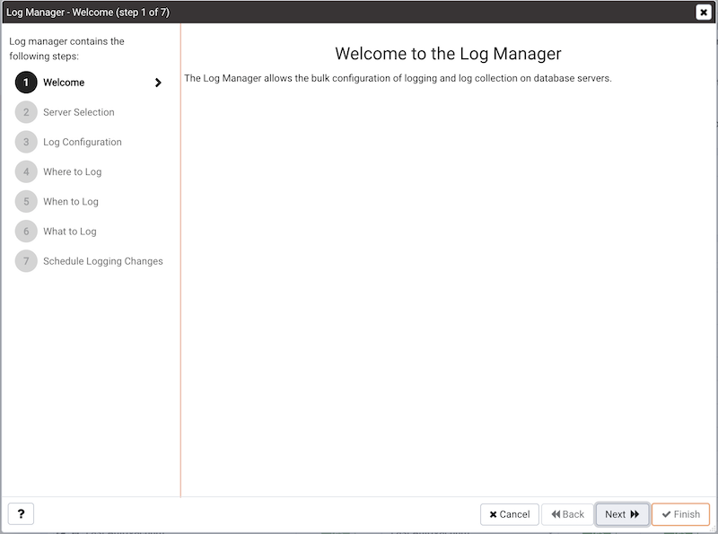

Click `Next` to continue to the `Server selection` dialog:

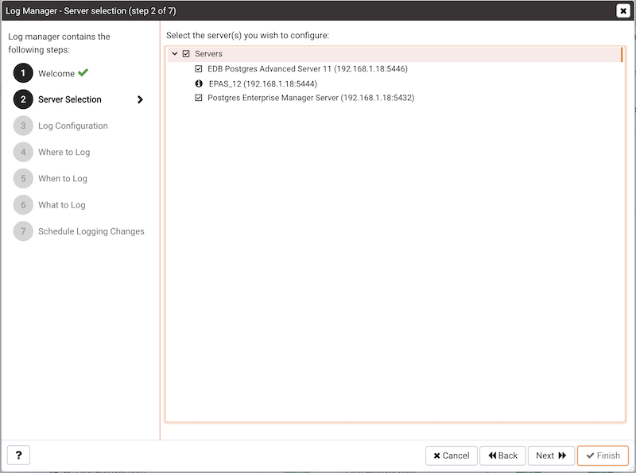

The `Server selection` dialog displays a list of the server connections monitored by PEM. Check the box next to the name of a server (or servers) to which the Log Manager wizard will apply the specified configuration. Log Manager is disabled for any server displaying a red exclamation mark to the left of its name in the Server selection tree control; there are several reasons that a server may not be enabled:

> -   Only a server that specifies a `Service ID` on the `Advanced` tab of the `Properties` dialog can be configured by Log Manager.
>
> > To provide a service ID, right click on the server name in the tree control, and select `Disconnect Server` from the context menu; if prompted, provide a password. Then, open the context menu for the server, and select `Properties`. Navigate to the `Advanced` tab, and provide the name of the service in the `Service ID` field; click `Save` to save your change and exit the dialog.
>
> -   If the PEM agent bound to the server does not have sufficient privileges to restart the server, the server will be disabled.
> -   If the PEM agent bound to the server is an older version than the associated PEM server, the server will be disabled.

Click `Next` to continue:


Use options within the `Import logs` box to specify how often log files will be imported to PEM.

-   Set the `Import logs to PEM` switch to `Yes` to specify that log files will be imported to PEM, and displayed on the Server Log Analysis dashboard.
-   Use the `Import Frequency` drop-down list box to specify how often log files are imported to PEM. This option is only enabled when the `Import logs to PEM` option is enabled. The default value is 5 minutes.

Use the options in the `Log rotation configuration` box to specify the maximum length (lifespan or size) of a log file.

-   Use the `Rotation size` field to specify the maximum size in megabytes of an individual log file. The default value is 10 MB; when set to 0, no limit is placed on the maximum size of a log file.
-   Use the `Rotation time` field to specify the number of whole days that should be stored in each log file. The default value is 1 day.

Use the `Truncate on Rotation` switch to specify server behavior for time-based log file rotation:

-   Select `ON` to specify that the server should overwrite any existing log file that has the same name that a new file would take.
-   Select `OFF` to specify that the server should append any new log file entries to an existing log file with the same name that a new log file would take. This is the default behavior.

Click `Next` to continue to the `Where to Log` dialog:


Use the fields on the `Where to Log` dialog to specify where log files should be written. Select an option from the `Log destination` box to specify a destination for the server log output:

-   Set the `stderr` switch to `Yes` to specify that log files should be written to `stderr`. By default, server log entries are written to `stderr`.
-   Set the `csvlog` switch to `Yes` to specify that log files should be written to file in a comma-separated value format. This option is automatically enabled (and no longer editable) if you have selected `Import logs to PEM` on the `Schedule` dialog; if you are not importing server log files to PEM, this option is editable.
-   Set the `syslog` switch to `Yes` to specify that log files should be written to the system log files.
-   On Windows, set the `eventlog` switch to `Yes` to specify that log files should be written to the event log.

Use options in the `Log collection` box to specify collection preferences. Use the `Log Collector` switch to instruct the server to re-direct captured log messages (directed to STDERR) into log files:

-   Specify `Enable` to instruct the server to re-direct captured error messages to a log file. By default, Log Collector is enabled.
-   Specify `Disable` to instruct the server that it should not re-direct error messages to a log file.

Use the `Log Silent Mode` switch to instruct the server to run silently in the background, disassociated from the controlling terminal:

-   Select `Enable` to instruct the server to run silently in the background.
-   Select `Disable` to instruct the server to display log file entries on the controlling terminal as each log entry is written.

Use options in the Log Directory box to specify log file location preferences:

-   Set the `Change log directory for selected servers?` switch to `Yes` to specify that each set of log files should be maintained in a separate directory.
-   When `Log Collector` is enabled, you can use the `Directory name` field to specify the directory to which the log file will be written. By default, logs are written to the `pg_log` directory under the installation directory of the monitored server.

When `Import logs to PEM` is disabled, you can use the `Log file name` field to specify the filename to which the logs will be written. The 'DEFAULT' value in the `Log File Name` field represents 'postgresql-%Y-%m-%d\_%H%M%S.log' for all the PostgreSQL servers and 'enterprisedb-%Y-%m-%d\_%H%M%S.log' for all the Postgres Plus Advanced Servers.

When logging to `syslog` is enabled, you can use the `Syslog facility` drop-down list box to specify which syslog facility should be used.

When logging to `syslog` is enabled, you can use the `Syslog ident` field to specify the program name that will identify Advanced Server entries in system logs.

Click `Next` to continue:

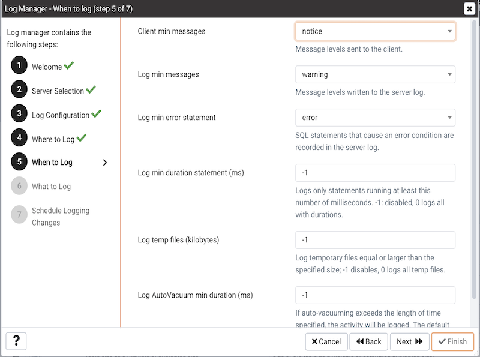

Use the fields on the `When to Log` dialog to specify which events will initiate a log file entry. The severity levels (in order of severity, from most severe to least severe) are:

|                       |                                                                                    |
| --------------------- | ---------------------------------------------------------------------------------- |
| Severity              | Description                                                                        |
| panic                 | Errors that cause all database sessions to abort.                                  |
| fatal                 | Errors that cause a session to abort.                                              |
| log                   | Information messages of interest to administrators.                                |
| error                 | Errors that cause a command to abort.                                              |
| warning               | Error conditions in which a command will complete but may not perform as expected. |
| notice                | Items of interest to users. This is the default.                                   |
| info                  | Information implicitly requested by the user.                                      |
| debug5 through debug1 | Detailed debugging information useful to developers                                |

-   Use the `Client min messages` drop-down list box to specify the minimum severity level that will be sent to the client application. The default value is `notice`.
-   Use the `Log min messages` drop-down list box to specify the minimum severity level that will be written to the server log. The default value is `warning`.
-   By default, when an error message is written to the server log, the text of the SQL statement that initiated the log entry is not included. Use the `Log min error statement` drop-down list box to specify a severity level that will trigger SQL statement logging. If a message is of the specified severity or higher, the SQL statement that produced the message will be written to the server log. The default value is `error`.
-   Use the `Log min duration statement` field to specify a statement duration (in milliseconds); any statements that exceed the specified number of milliseconds will be written to the server log. The length of time that it took for the statement to execute will be included in the log entry. A value of -1 disables all duration-based logging; a value of 0 logs all statements and their duration. The default value is `-1`.
-   Use the `Log temp files` field to specify a file size in kilobytes; when a temporary file reaches the specified size, it will be logged. The default value is `-1`.
-   Use the `Log autoVacuum min duration` field to specify a time length in milliseconds; if auto-vacuuming exceeds the length of time specified, the activity will be logged. The default value is `-1`.

Click `Next` to continue to the `What to log` dialog:


Use the fields on the `What to log` dialog to specify log entry options that are useful for debugging and auditing.

The switches in the `Debug options` box instruct the server to include information in the log files related to query execution that may be of interest to a developer:

-   Set the `Parse tree` switch to `Yes` to instruct the server to include the parse tree in the log file. The default value is `No`.
-   Set the `Rewriter output` switch to `Yes` to instruct the server to include query rewriter output in the log file. The default value is `No`.
-   Set the `Execution plan` switch to `Yes` to instruct the server to include the execution plan for each executed query in the log file. The default value is `No`.

By default, `Indent Debug Options Output in Log` option is set to `No`. When this option is enabled, the server indents each line that contains a parse tree entry, a query rewriter entry or query execution plan entry. While indentation makes the resulting log file more readable, it results in a longer log file. To enable indentation of log file entries related to debugging, move the switch to `Yes`.

Use the switches in the `General options` box to instruct the server to include auditing information in the log file:

-   Set the `Checkpoints` switch to `Yes` to include checkpoints and restartpoints in the server log. By default, this is set to `No`.

-   Set the `Connections` switch to `Yes` to include each attempted connection to the server (as well as successfully authenticated connections) in the server log. By default, this is set to `No`.

-   Set the `Disconnections` switch to `Yes` to include a server log entry for each terminated session that provides the session information and session duration. By default, this is set to `No`.

-   Set the `Duration` switch to `Yes` to include the amount of time required to execute each logged statement in the server log. By default, this is set to `No`.

-   Set the `Hostname` switch to `Yes` to include both the IP address and host name in each server log entry (by default, only the IP address is logged). Please note that this may cause a performance penalty. By default, this is set to `No`.

-   Set the `Lock Waits` switch to `Yes` to instruct the server to write a log entry for any session that waits longer than the time specified in the `deadlock_timeout` parameter to acquire a lock. This is useful when trying to determine if lock waits are the cause of poor performance. By default, this is set to `No`.

-   Use the `Error verbosity` drop-down list box to specify the detail written to each entry in the server log.

    > -   Select `default` to include the error message, DETAIL, HINT, QUERY and CONTEXT in each server log entry.
    > -   Select `terse` to log only the error message, excluding the DETAIL, HINT, QUERY and CONTEXT information from each server log entry.
    > -   Select `verbose` to include the error message, the DETAIL, HINT, QUERY and CONTEXT error information, SQLSTATE error code and source code file name, the function name, and the line number that generated the error.

-   Use the `Prefix string` field to specify a printf-style string that is written at the beginning of each log file entry. The `Escape` characters in the following table represent the information described in the `Information` column. Some information is available to `Session` processes only; `Helper` processes can provide all of the information specified in the `Prefix String`. The default value is %t (timestamp without milliseconds).

You can include:

|                                  |                                                                                                                                   |                |
| -------------------------------- | --------------------------------------------------------------------------------------------------------------------------------- | -------------- |
| Escape                           | Information                                                                                                                       | Session/Helper |
| <br /><br /><br />%a<br /><br /> | Application Name                                                                                                                  | Session        |
| <br /><br /><br />%u<br /><br /> | User Name                                                                                                                         | Session        |
| <br /><br /><br />%d<br /><br /> | Database Name                                                                                                                     | Session        |
| <br /><br /><br />%r<br /><br /> | Remote host name or IP address, and remote port                                                                                   | Session        |
| <br /><br /><br />%h<br /><br /> | Remote host name or IP address                                                                                                    | Session        |
| <br /><br /><br />%p<br /><br /> | Process ID                                                                                                                        | Helper         |
| <br /><br /><br />%t<br /><br /> | Time stamp without milliseconds                                                                                                   | Helper         |
| <br /><br /><br />%m<br /><br /> | Time stamp with milliseconds                                                                                                      | Helper         |
| %i                               | Command tag: type of statement that generated the log entry                                                                       | Session        |
| <br /><br /><br />%e<br /><br /> | SQLSTATE error code                                                                                                               | Helper         |
| <br /><br /><br />%c<br /><br /> | Session identifier                                                                                                                | Helper         |
| <br /><br /><br />%l<br /><br /> | Line number of the log entry                                                                                                      | Helper         |
| <br /><br /><br />%s<br /><br /> | Process start time stamp                                                                                                          | Helper         |
| <br /><br /><br />%v<br /><br /> | Virtual transaction ID (backendID/localXID)                                                                                       | Helper         |
| <br /><br /><br />%x<br /><br /> | Transaction ID (`0` if not assigned)                                                                                              | Helper         |
| %q                               | Produces no output, but instructs non-session processes to stop at this point in the string; will be ignored by session processes | Helper         |
| <br /><br /><br />%%<br /><br /> | Literal %                                                                                                                         | Helper         |

-   Use the `Statements` drop-down list box to specify which SQL statements will be included in the server log. The default is `none`; valid options are:

    > -   `none` - Specify `none` to disable logging of SQL statements.
    > -   `ddl` - Specify `ddl` to instruct the server to log ddl (data definition language) statements, such as CREATE, ALTER, and DROP.
    > -   `mod` - Specify `mod` to instruct the server to log all `ddl` statements, as well as all `dml` (data modification language) statements, such as INSERT, UPDATE, DELETE, TRUNCATE and COPY FROM.
    > -   `all` - Specify `all` to instruct the server to log all SQL statements.

Click `Next` to continue:


Use the options on the `Schedule Logging Changes` dialog to select a time that logging configuration changes will be applied. Note that when you apply the configuration changes specified with the Log Manager wizard, the server will be restarted, temporarily interrupting use of the database server for users.

-   Set the `Configure Logging Now` switch to `Yes` to specify that PEM will configure logging and restart the server when you have completed the Log Manager wizard.
-   Set the `Configure Logging Now` switch to `No` and use the `Schedule it for some other time` date selector to specify a a convenient time for the server to restart.

Click `Finish` to complete the wizard, and either restart the server, or schedule the server restart for the time specified on the scheduling dialog.

When you have completed the Log Manager wizard, you can use the `Scheduled Tasks` dialog to confirm that the configuration file update and server restart have been scheduled.

---
4.4&nbsp;&nbsp;&nbsp;&nbsp;&nbsp;&nbsp;&nbsp;&nbsp;&nbsp;&nbsp;Audit Manager
---

<div id="audit_manager" class="registered_link"></div>

You can use the PEM Audit manager to configure, enable, and disable audit logging of EDB Postgres Advanced Server instances. The Audit manager also enables audit log collection, allowing you to view log data on the [Audit Log Dashboard](01_dashboards/02_audit_log_dashboard/#audit_log_dashboard).

To run the Audit manager wizard, select `Audit manager...` from the PEM client `Management` menu. Audit manager opens, displaying the `Welcome` dialog:


Click `Next` to continue:


Use the `Select servers` tree control to specify the servers to which the auditing configuration will be applied. To make a server available in the tree control, you must provide the `Service ID` on the PEM [Server](../01_toc_pem_getting_started/07_pem_define_connection/#pem_define_connection) dialog. Note that only EDB Postgres Advanced Server supports auditing; PostgreSQL servers will not be included in the tree control.

Click `Next` to continue:


Use the controls on the `Audit parameters configuration` dialog to specify configuration details that will be applied to each server:

-   Use the `Auditing` switch to `Enable` or `Disable` auditing on the specified servers.
-   Use the `Audit destination` drop-down to select a destination for the audit logs; select `File` or `Syslog`. Please note this feature is supported on Advanced Server 10 and newer releases only.
-   Use the `Import logs to PEM` switch to instruct PEM to periodically import log records from each server to the PEM Server. Set the switch to `Yes` to import log files; the default is `No`.
-   Use the `Import frequency` drop-down listbox to specify how often PEM will collect log records from monitored servers when log collection is enabled.
-   Use the `Log format` drop-down listbox to select the raw log format that will be written on each server. If log collection is enabled, the PEM server will use CSV format.
-   Use the `File name` field to specify the format used when generating log file names. By default, the format is set to `audit-%Y-%m-%d_%H%M%S` if log collection is enabled.

Use fields in the `Log directory` box to specify information about the directory in which the log files will be saved:

-   Move the `Change log directory for selected servers?` switch to `Yes` to enable the `Directory name` field.
-   Use the `Directory name` field to specify the name of the directory on each server into which audit logs will be written. The directory specified will be created as a sub-directory of the `data` directory on the server.

Click `Next` to continue:


The `Audit log configuration` dialog is only available if you have specified a value of `Enable` in the `Auditing` field. Use the controls on the `Audit log configuration` dialog to specify log configuration details that will be applied to each server:

-   Use the `Connection attempts` switch to specify if connection attempts should be logged. Specify: `None` to disable connection logging, `All` to indicate that all connection attempts will be logged, or `Failed` to log any connection attempts that fail.

-   Use the `Disconnection attempts` switch to specify if disconnections should be logged. Specify `None` to specify that disconnections should not be logged, or `All` to enable disconnection logging.

-   Use the `Log statements` field to specify the statement types that will be logged. Click within the field, and select from:  
    -   Select - All statements that include the SELECT keyword will be logged
    -   Error - All statements that result in an error will be logged.
    -   DML - All DML (Data Modification Language) SQL statements will be logged.
    -   DDL - All DDL (Data Definition Language) SQL statements (those that add, delete or alter data) will be logged.
    -   Check the box next to `Select All` to select all statement types.
    -   Check the box next to `Unselect All` to deselect all statement types.

-   Use the `Audit tag` field to specify a tracking tag for the collected logs. Please note that audit tagging functionality is available only for Advanced Server versions 9.5 and later. If you are defining auditing functionality for multiple servers, and one or more of the servers are version 9.5 or later, this field will be enabled, but if selected, tagging functionality will only apply to those servers that are version 9.5 or later.

Use the fields in the `Log rotation` box to specify how the log files are managed on each server:

-   Use the `Enable?` switch to specify that logfiles should be rotated. Please note that a new log file should be used periodically to prevent a single file becoming unmanageably large.
-   Use the `Day` drop-down listbox to select a day or days on which the log file will be rotated.
-   Use the `Size (MB)` field to specify a size in megabytes at which the log file will be rotated.
-   Use the `Time (seconds)` field to specify the number of seconds between log file rotations.

Click `Next` to continue:


Use the `Schedule auditing changes` dialog to specify when the new configuration will be applied to the servers:

-   Set the `Configure logging now?` switch to `Yes` to apply the configuration immediately.
-   Use the `Time?` selector to schedule the audit configuration for a later time; use the date and time selectors to specify the date and time at which the PEM server will apply the configuration.

Click the `Finish` button to schedule a job to apply the configuration to each server. The job will consist of two tasks. One task will update the audit logging configuration on the server, and one task will restart the server with the new configuration.

The scheduled jobs can be viewed in the [Task Viewer](18_pem_task_view/#pem_task_view), and the results in the [Log Viewer](18_pem_task_view/01_pem_log_view/#pem_log_view) when opened from the appropriate server or agent.

---
4.5&nbsp;&nbsp;&nbsp;&nbsp;&nbsp;&nbsp;&nbsp;&nbsp;&nbsp;&nbsp;Postgres Log Analysis Expert
---

<div id="pem_log_analysis_expert" class="registered_link"></div>

The Postgres Log Analysis Expert analyzes the log files of servers that are registered with PEM, and produces a report that provides an overview of your Postgres cluster's usage based on log file entries. You can use information on the Log Analysis Expert reports to make decisions about optimizing your cluster usage and configuration to improve performance.

Before invoking the Postgres Log Analysis Expert, you must specify the `Service ID` on the `Advanced` tab of the server's properties dialog, and use the Log Manager wizard to enable log collection by the PEM server. To invoke the Log Manager wizard, select the `Log Manager...` option from the `Management` menu; check the box next to `Import logs to PEM` in the `Import Logs` panel of the wizard to enable log collection.

To open the `Postgres Log Analysis Expert` wizard, select the `Postgres Log Analysis Expert...` option from the `Management` menu of the PEM client. When the wizard's `Welcome` dialog opens, click `Next` to continue.


The wizard's `Analyzer selection` dialog displays a list of `Analyzers` from which you can select. Each Analyzer generates a corresponding table, chart, or graph that contains information gleaned from the log files.


Check the box to the left of an Analyzer to indicate that the Log Analysis Expert should prepare the corresponding table, chart or graph. After making your selections, click `Next` to continue to the `Server selection` tree control.


Use the tree control to specify which servers you would like the Postgres Log Analysis Expert to analyze. If you select multiple servers, the resulting report will contain the corresponding result set for each server in a separate (but continuous) list. Click `Next` to continue.


Use the fields in the `Options` section to specify the analysis method and the maximum length of any resulting tables:

-   Use the `Aggregate method` drop-down to select the method used by the Log Analysis Expert to consolidate data for the selected time span - select from:
    -   `SUM` - `SUM` instructs the analyzer to calculate a value that is the sum of the collected values for the specified time span.
    -   `AVG` - `AVG` instructs the analyzer to calculate a value that is the average of the collected values for the specified time span.
    -   `MAX` - `MAX` instructs the analyzer to use the maximum value that occurs within a specified time span.
    -   `MIN` - `MIN` instructs the analyzer to use the minimum value that occurs within a specified time span.
-   Use the `Time span` field to specify the number of minutes that the analyzer will incorporate into each calculation for a point on a graph. For example, if the `Time span` is '5 minutes', and the `Aggregate method` is 'AVG', each point on the given graph will contain the average value of the activity that occurred within a five minute time span.
-   Use the `Rows limit` field to specify the maximum number of rows to include in a table.

Use the fields in the `Time Intervals` section to specify the time range that the Log Analysis Expert will analyze:

-   Set `Relative days` to `Yes` to enable the `(+/-)From date` field and specify the number of days before or after the date and time selected in the `From` field.
-   Use the `From` field to specify the starting date and time for the analysis.
-   Use the `To` field to specify the ending date and time for the analysis.
-   Use the `(+/-) From date` selector to specify the number of days before or after the `From` date that should be included in the analysis.

When you've specified the report options, click `Next` to continue.


You can select the default option (`Finish`) to view the Log Analysis Expert report in the PEM client's tabbed browser, or click the radio button next to `Download the report` to save a copy of the report to an HTML file for later use.

### Reviewing the Postgres Log Analysis Expert Report

If you've elected to review the report immediately, the Postgres Log Analysis Expert report will be displayed in the PEM Client window. If the report contains an analysis of more than one monitored server, the graphs will be displayed in sets; first the graphs, tables and charts that display statistics for one server, then the graphs for the next server in the report.

The Postgres Log Analysis Expert Report header displays the date and time that the report was generated, the time period that the report spans, and the Aggregation method specified when defining the report. The name of the server for which information is displayed is noted at the start of each section of the report.

The report displays the tables, graphs and charts that were selected in the Log Analysis Expert wizard. Use the `Jump To` button (located in the lower-right hand corner of the screen) to navigate to a specific graphic.


The report may include one or more of the following:

-   The `Summary Statistics` table displays a summary of server activity for the selected server.
    -   The `Number of unique queries` row displays the count of unique queries made against the selected server in the specified time period.
    -   The `Total queries` row displays the count of queries made against the selected server in the specified time period.
    -   The `Total queries duration` row displays the amount of time used to execute queries against the server.
    -   The `First query` row displays the time (within the specified time period) that the first query executed against the server.
    -   The `Last query` row displays the time (within the specified time period) that the last query executed against the server.
    -   The `Queries peak time` row displays the point in time (within the specified time period) that query activity reached it's highest level.
    -   The `Number of events` row displays the count of log events within the specified time period.
    -   The `Number of unique events` row displays the count of unique server events.
    -   The `Total number of sessions` row displays a count of the number of sessions recorded within the time period.
    -   The `Total duration of sessions` row displays the amount of time that sessions were connected (during the specified time period).
    -   The `Average sessions duration` row displays the average length of each session.
    -   The `Total number of connections` row displays the number of user connections made to the server.
    -   The `Total number of databases` row displays the number of databases on the selected server.
-   The `Hourly DML Statistics` table displays the statistics related to the use of various DML commands (SELECT, INSERT, UPDATE, DELETE, COPY and FETCH) within a one-hour period. To generate values in the `Min Duration(sec)`, `Max Duration(sec)`, and `Avg Duration(sec)` columns of this table, you must specify a value greater than or equal to `0` in the log_min_duration_statement configuration parameter. You can set the parameter by either modifying the `postgresql.conf` file with your editor of choice, or by specifying a value of `0` or greater in the `Log Min Duration Statement` field of the `Log Manager` wizard.
    -   The `Time` column displays the start of the one-hour period for which data was analyzed.
    -   The `Database` column displays the name of the database in which the specified DML command executed.
    -   The `Command Type` column displays the DML command type.
    -   The `Total Count` column displays the number of times that a command of the specified command type executed during the one-hour period analyzed by the report.
    -   The `Min Duration(sec)` column displays the shortest amount of time (in seconds) used by the server to respond to the specified command type.
    -   The `Max Duration(sec)` column displays the longest amount of time (in seconds) used by the server to respond to the specified command type.
    -   The `Avg Duration(sec)` column displays the average length of time (in seconds) used by the server when responding to the specified command type.
-   The `DML Statistics Timeline` section of the Log Analysis Expert report displays information about DML statement usage:
    -   The line graph displays an analysis of statement usage during the selected time period. Hover over a specific point to view detailed information about that point on the graph.
    -   The pie chart displays the percent of statement usage of each respective DML statement type during the selected time period.
-   The `DDL Statistics Timeline` section of the Log Analysis Expert report displays information about DDL statement usage:
    -   The line graph displays an analysis of statement usage during the selected time period. Hover over a specific point to view detailed information about that point on the graph.
    -   The pie chart displays the percent of statement usage of each respective DDL statement type during the selected time period.
-   The `Commit and Rollback Statistics Timeline` section of the Log Analysis Expert report displays information about the COMMIT, ROLLBACK, and SAVEPOINT statements logged during the specified time period:
    -   The line graph displays an analysis of the commit and rollback activity during the specified time period. Hover over a specific point to view detailed information about that point on the graph.
    -   The pie chart displays the comparative percent of COMMIT, SAVEPOINT, or ROLLBACK statements executed during the specified time period.
-   The `Checkpoint Statistics Timeline` section of the Log Analysis Expert report displays information about the checkpoint operations logged during the specified time period:
    -   The line graph displays an analysis of the checkpoint operation activity during the specified time period. Hover over a specific point to view detailed information about that point on the graph.
    -   The pie chart displays the comparative percent of different types of checkpoint activity logged during the specified time period.
-   The `Log Event Statistics` table lists log entries with a severity level of WARNING, ERROR, FATAL, PANIC, HINT or CONTEXT. The level of logging detail for error messages is controlled by the `log_min_error_statement` parameter. You can set the parameter by either modifying the `postgresql.conf` file with your editor of choice, or by specifying a value in the `Log Min Error Statement` field of the `Log Manager` wizard.
    -   The `Error Severity` column lists the severity level of the log entry.
    -   The `Message` column lists the log message.
    -   The `Total Count` column lists the number of times that the log entry has occurred.
-   The `Log Statistics` table lists log entries that indicate an operational severity level of LOG, DETAIL, DEBUG, NOTICE, INFO or STATEMENT. The level of logging detail for informational messages is controlled by the `log_min_messages` parameter. You can set the parameter by either modifying the `postgresql.conf` file with your editor of choice, or by specifying a value in the `Log Min Messages` field of the `Log Manager` wizard.
    -   The `Error Severity` column lists the severity level of the log entry.
    -   The `Total Count` column lists the number of times that the log entry has occurred.
-   The `Temp Generated Queries` table displays a list of queries that have created temporary files.
    -   The `Log Time` column displays the time that the log entry was generated.
    -   The `TempFile Size(Bytes)` column displays the size of the temporary file in bytes.
    -   The `Query` column displays the text of the query that created the temporary file.
-   The `Temp File Statistics Timeline` graph displays the size of temporary files over the specified time period. Hover over a specific point to view detailed information about that point on the graph.
-   The `Lock Statistics Timeline` section of the Log Analysis Expert report displays information about the locks held during the specified time period:
    -   The graph displays the number of locks held at any given point during the time period. Hover over a specific point to view detailed information about that point on the graph.
    -   The pie chart displays the relative percentage of each type of lock used during the selected time period.
-   The `Waiting Statistics Timeline` section of the Log Analysis Expert report displays information about DML statements that are waiting for a lock during the specified time period:
    -   The graph displays the number of DML statements that are waiting at any given point during the time period; each colored line represents a statement type. Hover over a specific point to view detailed information about that point on the graph.
    -   The pie chart displays the relative percentage of each type of DML statement that waited for a lock during the selected time period.
-   The `Idle Statistics Timeline` section of the Log Analysis Expert report displays information about the amount of time that a connection to the server is idle. An `IDLE` server is waiting for a connection from a client. A connection that is `IDLE in transaction` has started a transaction, but has not yet committed or rolled back the transaction and is waiting for a command from the client. A session that is IDLE in transaction (aborted)\* has started a transaction, but has not yet committed or rolled back the transaction and is waiting for a command from the client; an error has occurred within the transaction and the transaction can only be rolled-back.
    -   The graph displays the times at which the server is `IDLE`, `IDLE in transaction`, and `IDLE in transaction (aborted)`. Hover over a specific point to view detailed information about that point on the graph.
    -   The pie chart displays the relative percentage of each type of lock used during the selected time period.
-   The `Autovacuum Statistics` table displays statistics about autovacuum activity on monitored servers.
    -   The `Log Time` column displays the time that the autovacuum activity was written to the log.
    -   The `Relation` column displays the name of the table on which the autovacuum was performed.
    -   The `Index Details` column displays the number of index scans that were performed.
    -   The `Page Details` column displays the number of pages that were removed, and the number of pages that remain.
    -   The `Tuple Details` column displays the number of tuples that were removed, and the number of tuples that remain.
    -   The `Buffer Usage` column displays the number of buffers hit, missed, or dirty.
    -   The `Read Rate` column displays the average read rate in MB's per second.
    -   The `System Usage` column displays the percent of CPU time used performing autovacuum activities.
-   The `Autoanalyze Statistics` table displays logged autoanalyze activity.
    -   The `Log Time` column displays the time that the autoanalyze activity was written to the log.
    -   The `Relation` column displays the name of the table on which the autoanalyze was performed.
    -   The `System Usage` column displays the percent of CPU time used performing autoanalyze activities.
-   The `Slow Query Statistics` table displays the slowest queries executed on monitored servers. The table will include the number of entries specified in the `Rows Limit` field of the Log Analysis Expert.
    -   The `Log Time` column displays the time that the query activity was written to the log.
    -   The `Tag` column displays the command type.
    -   The `Query` column displays the text of the performed query.
    -   The `Parameters` column displays the parameters (if the query is a parameterized query).
    -   The `Duration` column displays the length of time that it took the server to execute the query.
    -   The `Host` column displays name of the host on which the query executed.
    -   The `Database` column displays the name of the database on which the query executed.
-   The `Frequently Executed Query Statistics` table displays the most frequently executed query statements. The table will include the number of entries specified in the `Rows Limit` field of the Log Analysis Expert.
    -   The `Query` column displays the text of the performed query.
    -   The `Parameters` column displays the parameters (if the query is a parameterized query).
    -   The `No. of Times Executed` column displays the number of times that the query executed.
    -   The `Total Duration` column displays the length of time that it took the server to execute the query.
-   The `Most Time Executed Query Statistics` table displays the queries that took the most execution time on the server. The table will include the number of entries specified in the `Rows Limit` field of the Log Analysis Expert.
    -   The `Query` column displays the text of the performed query.
    -   The `Parameters` column displays the parameters (if the query is a parameterized query).
    -   The `No. of Times Executed` column displays the number of times that the query executed.
    -   The `Total Duration` column displays the length of time that it took the server to execute the query.
-   The `Connections Overview Timeline` section of the Log Analysis Expert report displays information about successful and unsuccessful connection attempts during the specified time period:
    -   The `Timestamp` graph displays the number of server connections attempted and connections authenticated at any given point during the specified time period. Hover over a specific point to view detailed information about that point on the graph.
    -   The `Summary` pie chart displays the relative percentage of connections attempted and connections authenticated during the specified time period.

---
4.6&nbsp;&nbsp;&nbsp;&nbsp;&nbsp;&nbsp;&nbsp;&nbsp;&nbsp;&nbsp;Tuning Wizard
---

<div id="tuning_wizard" class="registered_link"></div>

The Tuning Wizard reviews your PostgreSQL or Advanced Server installation, and recommends a set of configuration options that will help tune the installation to best suit its anticipated workload. Please note that benchmarking systems or systems with a high work load may require additional manual tuning to reach optimum performance.

Before using the Tuning Wizard, you must specify the name of the service in the `Service ID` field on the `Advanced` tab of the server's `` `Properties `` &lt;pem_define_connection>\` dialog. PEM will use the service name when restarting the service after tuning.

The Tuning Wizard can only make recommendations for those servers that reside on the same server as their bound PEM agent. If you have specified a value of `Yes` in the `Remote monitoring` field when defining your server, the server will not be displayed in the Tuning Wizard tree control.

To open the Tuning Wizard, select `Tuning Wizard...` from the `Management` menu of the PEM client. The Tuning Wizard opens, welcoming you:

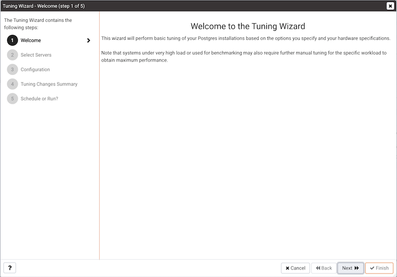

Click `Next` to continue to the server selection dialog:


Expand the `Servers` node of the tree control to view a list of the servers that are currently monitored by PEM that are available for tuning.

Check a box to the left of a server name to select the server for tuning. Please note: the Tuning Wizard displays a red warning symbol to the left of a server name in the tree control if the service name for that server is not provided on the server's Properties dialog.

Click `Next` to continue to the `Configuration` dialog:


Select an option in the `Machine utilization` field to specify the type of work performed by the selected servers. The type of work performed by the server determines how the tuning wizard will allocate system resources:

-   Select `Dedicated` to dedicate the majority of the system resources to the database server.
-   Select `Mixed use` to dedicate a moderate amount of system resources to the database server.
-   Select `Developer workstation` to dedicate a relatively small amount of system resources to the database server.

Select an option in the `Workload Selection` field to specify the type of workload typically performed on the selected server:

-   Select `OLTP` if the selected server is used primarily to process online transaction workloads.
-   Select `Mixed` if the selected server provides a mix of transaction processing and data reporting.
-   Select `Data warehouse` if the server is used for heavy data reporting.

Click `Next` to continue to the `Tuning Changes Summary` dialog:

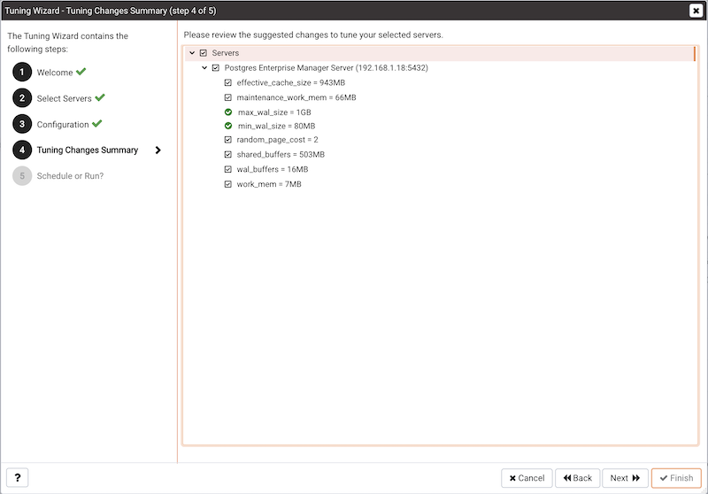

The tree control on the `Tuning Changes Summary` dialog displays the parameter setting modifications recommended for each server analyzed by the Tuning Wizard. Use the checkboxes next to a server or parameter name to select the recommendations that tuning wizard will either include in a preview report or apply:

-   A checked box to the left of a parameter name specifies that the Tuning Wizard will include the parameter setting.
-   A checked box to the left of a server name specifies that the Tuning Wizard will include all parameter setting recommendations for the specified server.

Specify which Tuning Wizard recommendations you wish to include in a report or apply, and click `Next` to continue.

Use the `Schedule or Run?` dialog to either:

-   Specify a time that PEM will apply the changes.
-   Generate a report that details the recommended changes.

The selected actions will apply to all of the changes noted on the `Tuning Changes Summary`. If you opt to generate a report, PEM will create a report that contains a list of the current values and recommended modifications to the configuration parameters selected on the `Tuning Changes Summary` dialog. Note that to implement changes, you will need to invoke the Tuning Wizard a second time, specifying the parameters you wish to modify on the `Tuning Changes Summary` dialog.

Select `Schedule changes` to view your scheduling options.


You can:

-   Set the `Configuration now?` slider to `Yes` to apply the tuning wizard's recommendations and restart the server now.
-   Set the `Configuration now?` slider to `No` to enable the `Time?` field and use the calendar selector to specify a time for PEM to apply the tuning wizard's recommendations and restart the server. Note that if you schedule a time for the changes to be applied, you will not be provided with a preview of the change recommendations.

Select `Generate report` to view your report options.


You can:

-   Set the `View report now?` slider to `Yes` to display the Tuning Wizard report onscreen.
-   Set the `View report now?` slider to `No` to enable the `Save the report to file` field and use the calendar selector to specify a file name and location to which PEM will write the Tuning Wizard report.

Click the `Finish` button to either apply the Tuning Wizard's modifications or generate a report and exit the Tuning Wizard.


You can confirm that Tuning Wizard has implemented the recommended changes by reviewing the postgresql.conf file for the modified server. The Tuning Wizard adds a comment above each modified parameter in the postgresql.conf file when the change is applied:

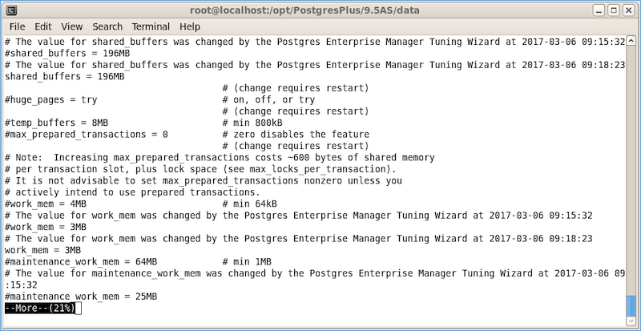

You can also confirm a parameter value by querying the server. For example, to confirm the value of the shared_buffers parameter, open a SQL command line using either the `Query Tool` (accessed through the `Tools` menu) or the psql client, and issue the command:

*SHOW shared_buffers;*

The value returned by the server will confirm that the parameter has been modified.

---
4.7&nbsp;&nbsp;&nbsp;&nbsp;&nbsp;&nbsp;&nbsp;&nbsp;&nbsp;&nbsp;Postgres Expert
---

<div id="pem_postgres_expert" class="registered_link"></div>

Postgres Expert analyzes the configuration of servers that are registered with the Enterprise Manager, and provides advice about:

-   [Server Performance](01_pe_schema_config_expert_recommendations/#pe_schema_config_expert_recommendations)
-   [Server Security](02_pe_security_expert_recommendations/#pe_security_expert_recommendations)
-   [Server Configuration](03_pe_configuration_expert_recommendations/#pe_configuration_expert_recommendations)

Postgres Expert is an advisory utility; after analyzing the selected servers, Postgres Expert produces a report containing analysis of potential performance and security issues, along with suggestions for addressing each such issue.

To use the Postgres Expert wizard select the `Postgres Expert` option from the `Management` menu in the PEM client. When the wizard's `Welcome` window opens; click `Next` to continue:


The wizard displays a tree control that allows you to choose the `Experts` and `Rules` with which Postgres Expert will evaluate the specified server or database.


The tree control categorizes the Rules under three Expert headings:

> -   Select from the `Configuration Expert` rules to analyze the parameter settings of the server or operating system to find any adjustments that might improve system performance.
> -   Select from the `Schema Expert` rules to analyze schema objects (locating missing primary keys, foreign keys without indexes, etc).
> -   Select from the `Security Expert` rules to review the system to find security vulnerabilities.

Use the checkbox to the left of an expert or rule to indicate that the Postgres Expert should analyze the configuration of the selected servers for any best practice deviations related to the selected item.

> -   Use the checkbox next to `Experts/Rules` to select or deselect all of the items listed in the tree control.
> -   Use the checkbox next to the name of an expert to select or deselect all of the configuration items listed under that node of the tree control.
> -   Use the checkbox next to a rule to select or deselect the rule for inclusion in the Postgres Expert report.

After making your selections, click `Next` to continue to the `Server/Databases` tree control.


If you select multiple servers or databases, the resulting report will contain a separate analysis of each target. Select or de-select the servers and databases that you would like Postgres Expert to analyze, and select `Next` to continue.


You can select the default option and click `Finish` to immediately view an onscreen report from Postgres Expert, or check the box next to `Download the report` to save a copy of the report to an HTML file for later use. If you choose to download the report, the report will be saved in your default downloads directory.

**Reviewing the Postgres Expert Report**

If you've elected to review the report immediately, the PEM client will display the report on the `Postgres Expert` tab.


A report summary in the upper-left corner of the Postgres Expert Report lists statistics about the analysis, including the number of servers analyzed, the number of rules tested, and the number of alerts raised in each severity category.

If your report contains recommendations for more than one server, you can use the `Jump to` selector in the upper-right corner of the report as a navigation tool; select a server from the list to move to the portion of the report containing information for the selected server.

For each server analyzed, the Postgres Expert returns recommendations from the `Configuration Expert`, the `Schema Expert`, and the `Security Expert`. Each expert returns a list of rules that raised an alert, the database that the rule pertains to, and the severity level of the alert. Click on a rule name to view detailed information about the selected rule:

|                   |                                                                                                             |
| ----------------- | ----------------------------------------------------------------------------------------------------------- |
| Section Heading   | <br /><br /><br />Contains<br /><br />                                                                      |
| Trigger           | <br /><br /><br />A description of the rule that raised the alert.<br /><br />                              |
| Recommended Value | <br /><br /><br />The value to which Postgres Expert recommends setting the selected parameter.<br /><br /> |
| Description       | <br /><br /><br />Information and advice about the parameter that caused the alert.<br /><br />             |
| Current Values    | <br /><br /><br />The current value(s) of the parameter(s).<br /><br />                                     |


For more information about each rule checked by the Postgres Expert, see:


---
4.7.1&nbsp;&nbsp;&nbsp;&nbsp;&nbsp;&nbsp;&nbsp;&nbsp;&nbsp;&nbsp;Schema Expert Recommendations
---

<div id="pe_schema_config_expert_recommendations" class="registered_link"></div>

|                |                                                               |
| -------------- | ------------------------------------------------------------- |
| Rule           | Check for missing primary keys                                |
| Recommendation | Ensure tables have a primary key                              |
| Trigger        | Postgres Expert detected a table with no defined primary key. |
| Severity       | Low                                                           |

**Description:** Primary keys are used to define the set of columns that make up the unique key to each row in the table. Whilst they are similar to unique indexes, primary keys cannot contain NULL values, thus are always able to identify a single row. Tools such as Postgres Enterprise Manager and other pieces of software such as ORM will automatically detect primary keys on tables and use their definition to identify individual rows.

|                |                                                                                |
| -------------- | ------------------------------------------------------------------------------ |
| Rule           | Check for missing foreign key indexes                                          |
| Recommendation | Ensure columns of child tables in foreign key relationships are indexed.       |
| Trigger        | Postgres Expert detected a child table with no index on referencing column(s). |
| Severity       | Medium                                                                         |

**Description:** Foreign keys are used to define and enforce relationships between child and parent tables. The foreign key specifies that values in one or more columns of the child table must exist (in the same combination, if more than one column) in the referenced column(s) of the parent table. A unique index is required to be present on the referenced columns in the parent table, however an index is not required, but is generally advisable, on the referencing columns of the child table to allow cascading updates to the parent to be executed efficiently.

|                |                                           |
| -------------- | ----------------------------------------- |
| Rule           | Check Database Encoding                   |
| Recommendation | Avoid encoding as SQL_ASCII for databases |
| Trigger        | encoding = SQL_ASCII                      |
| Severity       | Medium                                    |

**Description:** The database is created to store data using the SQL_ASCII encoding. This encoding is defined for 7 bit characters only; the meaning of characters with the 8th bit set (non-ASCII characters 127-255) is not defined. Consequently, it is not possible for the server to convert the data to other encodings. If you're storing non-ASCII data in the database, you're strongly encouraged to use a proper database encoding representing your locale character set to take benefit from the automatic conversion to different client encodings when needed. If you store non-ASCII data in an SQL_ASCII database, strange characters may be written to or read from the database, caused by code conversion problems. This may cause problems when accessing the database using different client programs and drivers. For most installations, Unicode (UTF8) encoding will provide the most versatility.

|                |                                                                     |
| -------------- | ------------------------------------------------------------------- |
| Rule           | Check for too many indexes                                          |
| Recommendation | Don't overload a table with too many indexes.                       |
| Trigger        | Postgres Expert has detected that a table has more than 10 indexes. |
| Severity       | Low, Medium or High (based on number of indexes)                    |

**Description:** Whilst indexes can speed up SELECT queries by allowing Postgres to quickly locate records, it is important to choose which indexes are required carefully to ensure they are used. Maintaining an index has a cost, and the more indexes there are to update, the slower INSERT, UPDATE or DELETE queries can become. There are no hard and fast rules to tell you how many indexes are required on a particular table -the DBA must balance the need for indexes for different types of SELECT queries and constraints against the cost of maintaining them.

|                    |                                                                                                  |
| ------------------ | ------------------------------------------------------------------------------------------------ |
| Configuration Item | Check data and transaction log on same drive                                                     |
| Recommendation     | Avoid using the same storage device for the data directory and transaction logs.                 |
| Trigger            | Postgres Expert has detected that a data directory and transaction log directory share a device. |
| Severity           | High                                                                                             |

**Description:** Postgres' performance can be adversely affected on medium to heavily loaded systems if both the data and the transaction logs (WAL) are stored on the same device. It is considered good practice to store them on separate physical devices if performance is an issue. On busy servers, significant performance gains may be seen when separating the data directory and transaction log directory onto different physical storage devices.

|                |                                                                                                                    |
| -------------- | ------------------------------------------------------------------------------------------------------------------ |
| Rule           | Check tablespace and transaction log on same drive                                                                 |
| Recommendation | Avoid using the same storage device for the transaction logs and a tablespace.                                     |
| Trigger        | Postgres Expert has detected that transaction log directory and a tablespace other than pg_default share a device. |
| Severity       | Medium                                                                                                             |

**Description:** Before updating database files to reflect data modifications, the server writes the change to the transaction log. The database files may be separated onto different devices using tablespaces (defined storage areas used by the database server). On busy servers, significant performance gains may be seen when separating tablespace directories and the transaction log directory onto different physical storage devices.

|                |                                                                        |
| -------------- | ---------------------------------------------------------------------- |
| Rule           | Check multiple tablespace on same drive                                |
| Recommendation | Avoid using the same storage device for multiple tablespaces.          |
| Trigger        | Postgres Expert has detected that multiple tablespaces share a device. |
| Severity       | Low                                                                    |

**Description:** Multiple tablespaces may be defined in the database to allow tables and indexes to be distributed into different storage areas, usually for performance reasons for example, tables with high performance requirements may be stored on expensive , high speed disks, while archive data may be stored on much larger, but slower devices. There is usually little to be gained from having more than one tablespace on a single device (because the cost and access characteristics will be identical), except in very unusual situations where it may be desirable to configure them with different planner cost parameters.

---
4.7.2&nbsp;&nbsp;&nbsp;&nbsp;&nbsp;&nbsp;&nbsp;&nbsp;&nbsp;&nbsp;Security Expert Recommendations
---

<div id="pe_security_expert_recommendations" class="registered_link"></div>

|                |                                                                    |
| -------------- | ------------------------------------------------------------------ |
| Rule           | Check SSL for improved performance                                 |
| Recommendation | Consider disabling SSL for improved performance.                   |
| Trigger        | ssl = on and listen_addresses in ('localhost', '127.0.0.1', '::1') |
| Severity       | Low                                                                |

**Description:** SSL authentication is invaluable for protecting against connection-spoofing and eavesdropping attacks, but it is not always necessary for adequate security. When PostgreSQL accepts only local connections, or when it accepts only connections from a trusted network where malicious network traffic is not a concern, SSL encryption may not be necessary. Consider changing this setting if the current value is not appropriate for your environment.

Note: Even when SSL encryption is enabled, PostgreSQL servers should be further protected using an appropriate firewall configuration.

|                |                                                                        |
| -------------- | ---------------------------------------------------------------------- |
| Rule           | Check SSL for improved connection security                             |
| Recommendation | Consider using SSL for improved connection security.                   |
| Trigger        | ssl = off and listen_addresses not in ('localhost', '127.0.0.1','::1') |
| Severity       | Medium                                                                 |

**Description:** The configuration variable listen_addresses indicates that your system may accept non-local connection requests, but SSL is not enabled. If PostgreSQL is exposed only to a secure, trusted internal network, this configuration is appropriate for maximum performance. Otherwise, you should consider enabling SSL. SSL offers two main advantages. First, it provides a more secure mechanism for authorizing connections to the database, helping to prevent unauthorized access. Second, SSL prevents eavesdropping attacks, where data sent from the database to clients, or from clients to the database, is viewed by an attacker while in transit. Consider changing this setting if the current value is not appropriate for your environment.

Note: Even when SSL encryption is enabled, PostgreSQL servers should be further protected using an appropriate firewall configuration.

|                |                                                                               |
| -------------- | ----------------------------------------------------------------------------- |
| Rule           | Check TRUST authentication is disabled                                        |
| Recommendation | Avoid trust and ident authentication on unsecured networks.                   |
| Trigger        | trust or ident authentication allowed to any host other than 127.0.0.1 or ::1 |
| Severity       | High                                                                          |

**Description:** An attacker with access to your network can easily use the trust and ident authentication methods to subvert your network. If PostgreSQL is not running on a secure network, with firewalls in place to prevent malicious traffic, the use of these authentication methods should be avoided.

|                |                                                                                     |
| -------------- | ----------------------------------------------------------------------------------- |
| Rule           | Check Password authentication on unsecured networks                                 |
| Recommendation | Avoid password authentication on unsecured networks.                                |
| Trigger        | (connection_type = 'host' or connection_type = 'hostnossl') and method = 'password' |
| Severity       | High                                                                                |

**Description:** Passwords should not be transmitted in plaintext over unsecured networks. The use of md5 authentication provides slightly better security, but can still allow accounts to be compromised by a determined attacker. SSL encryption is a superior alternative. To require the use of SSL, set the connection type to hostssl in the pg_hba.conf file.

|                |                                                                  |
| -------------- | ---------------------------------------------------------------- |
| Rule           | Check SSL for increased security                                 |
| Recommendation | Consider requiring SSL.                                          |
| Trigger        | ssl = on in postgresql.conf, but no hostssl lines in pg_hba.conf |
| Severity       | Medium                                                           |

**Description:** SSL encrypts passwords and all data transmitted over the connection, providing increased security. To require the use of SSL, set the connection type to hostssl in the pg_hba.conf file.

---
4.7.3&nbsp;&nbsp;&nbsp;&nbsp;&nbsp;&nbsp;&nbsp;&nbsp;&nbsp;&nbsp;Configuration Expert Recommendations
---

<div id="pe_configuration_expert_recommendations" class="registered_link"></div>

|                   |                                                                                                                                                                      |
| ----------------- | -------------------------------------------------------------------------------------------------------------------------------------------------------------------- |
| Rule              | Check shared_buffers                                                                                                                                                 |
| Recommendation    | Consider adjusting shared_buffers                                                                                                                                    |
| Trigger           | shared_buffers &lt; (OS == Windows ? 64MB : MIN(0.20 \* (system_memory - 256MB), 6GB)) or shared_buffers > (OS == Windows ? 512MB : MAX(0.35 \* system_memory, 8GB)) |
| Recommended Value | system_memory &lt; 1GB ? MAX((system_memory - 256MB) / (OS == Windows ? 6 : 3), 64MB), OS == Windows ? MAX(system_memory / 8, 256MB) : MAX(system_memory / 4, 8GB)   |
| Severity          | Medium                                                                                                                                                               |

**Description:** The configuration variable shared_buffers controls the amount of memory reserved by PostgreSQL for its internal buffer cache. Setting this value too low may result in "thrashing" the buffer cache, resulting in excessive disk activity and degraded performance. However, setting it too high may also cause performance problems. PostgreSQL relies on operating system caching to a significant degree , and setting this value too high may result in excessive "double buffering" that can degrade performance. It also increases the internal costs of managing the buffer pool. On UNIX-like systems, a good starting value is approximately 25% of system memory, but not more than 8GB. On Windows systems, values between 64MB and 512MB typically perform best. The optimal value is workload-dependent, so it may be worthwhile to try several different values and benchmark your system to determine which one delivers best performance.

Note: PostgreSQL will fail to start if the necessary amount of shared_memory cannot be located. This is usually due to an operating system limitation which can be raised by changing a system configuration setting, often called shmall.See the documentation for more details. You must set this limit to a value somewhat higher than the amount of memory required for shared_buffers,because PostgreSQL's shared memory allocation also includes amounts required for other purposes.

|                   |                                                                                                                                                                          |
| ----------------- | ------------------------------------------------------------------------------------------------------------------------------------------------------------------------ |
| Rule              | Check work_mem                                                                                                                                                           |
| Recommendation    | Consider adjusting work_mem                                                                                                                                              |
| Trigger           | given spare_mem = system_memory - (OS == Windows ? 256MB : MAX(0.25 \* system_memory, 8GB)) then work_mem &lt; MAX(1MB, spare_mem / 512) or work_mem > (spare_mem / 128) |
| Recommended Value | given spare_mem defined as on the previous line then MAX (1MB, spare_mem / 256)                                                                                          |
| Severity          | Medium                                                                                                                                                                   |

**Description:** The configuration variable work_mem controls the amount of memory PostgreSQL will use for each individual hash or sort operation. When a sort would use more than this amount of memory, the planner will arrange to perform an external sort using disk files. While this algorithm is memory efficient, it is much slower than an in-memory quick sort. Similarly, when a hash join would use more than this amount of memory, the planner will arrange to perform it in multiple batches, which saves memory but is likewise much slower. In either case, the planner may in the alternative choose some other plan that does not require the sort or hash operation, but this too is often less efficient. Therefore, for good performance it is important to set this parameter high enough to allow the planner to choose good plans. However, each concurrently executing query can potentially involve several sorts or hashes, and the number of queries on the system can vary greatly Therefore, a value for this setting that works well when the system is lightly loaded may result in swapping when the system becomes more heavily loaded. Swapping has very negative effects on database performance and should be avoided, so it is usually wise to set this value somewhat conservatively.

Note: work_mem can be adjusted for particular databases, users, or user-and -database combinations by using the commands ALTER ROLE and ALTER DATABASE It can also be changed for a single session using the SET command. This can be helpful when particular queries can be shown to run much faster with a value of work_mem that is too high to be applied to the system as a whole.

|                |                                    |
| -------------- | ---------------------------------- |
| Rule           | Check max_connections              |
| Recommendation | Consider using a connection pooler |
| Trigger        | max_connections > 100              |
| Severity       | Medium                             |

**Description:** The configuration variable max_connection is set to a value greater than 100. PostgreSQL performs best when the number of simultaneous connections is low. Peak throughput is typically achieved when the connection count is limited to is limited to approximately twice the number of system CPU cores plus the number of spindles available for disk I/O (in the case of an SSD or other non-rotating media, some experimentation may be needed to determine the "effective spindle count"). Installing a connection pooler, such as pgpool-II or pgbouncer, can allow many clients to be multiplexed onto a smaller number of server connections ,sometimes resulting in dramatic performance gains.

|                   |                                                                                                                                                                                                    |
| ----------------- | -------------------------------------------------------------------------------------------------------------------------------------------------------------------------------------------------- |
| Rule              | Check maintenance_work_mem                                                                                                                                                                         |
| Recommendation    | Consider adjusting maintenance_work_mem                                                                                                                                                            |
| Trigger           | spare_mem = system_memory - (OS == Windows ? 256MB : MAX(0.25 \* system_memory, 8GB)) then maintenance_work_mem &lt; MAX(16MB, spare_mem / 32) or maintenance_work_mem > MIN(spare_mem / 8, 256MB) |
| Recommended Value | spare_mem as defined on the previous line then MIN(spare_mem/16, 256MB)                                                                                                                            |
| Severity          | Low                                                                                                                                                                                                |

**Description:** The configuration variable maintenance_work_mem controls the amount of memory PostgreSQL will use for maintenance operations such as CREATE INDEX and VACUUM. Increasing this setting from the default of 16MB to 256MB can make these operations run much faster. Higher settings typically do not produce a significant further improvement. On PostgreSQL 8.3 and higher, multiple autovacuum processes may be running at one time (up to autovacuum_max_workers, which defaults to 3), and each such process will use the amount of dedicated memory dictated by this parameter. This should be kept in mind when setting this parameter, especially on systems with relatively modest amounts of physical memory, so as to avoid swapping. Swapping has very negative effects on database performance and should be avoided. If the value recommended above is less than 256MB, it is chosen with this consideration in mind. However, the optimal value is workload-dependent, so it may be worthwhile to experiment with higher or lower settings.

|                |                                             |
| -------------- | ------------------------------------------- |
| Rule           | Check effective_io_concurrency              |
| Recommendation | Consider adjusting effective_io_concurrency |
| Trigger        | effective_io_concurrency &lt; 2             |
| Severity       | Low                                         |

**Description:** If the PostgreSQL data files are located on a RAID array or SSD, effective_io_concurrency should be set to the approximate number of I/O requests that the system can service simultaneously. For RAID arrays, this is typically equal to the number of drives in the array. For SSDs, some experimentation may be needed to determine the most effective value. Setting this parameter to an appropriate value impoves the performance of bitmap index scans. The default value of 1 is appropriate for cases where all PostgreSQL data files are located on a single spinning medium.

|                |                                  |
| -------------- | -------------------------------- |
| Rule           | Check fsync is enabled           |
| Recommendation | Consider configuring fsync = on. |
| Trigger        | fsync = off                      |
| Severity       | High                             |

**Description:** When fsync is set to off, a system crash can result in unrecoverable data loss or non-obvious corruption. fsync = off is an appropriate setting only if you are prepared to erase and recreate all of your databases in the event of a system crash or unexpected power outage.

Note: Much of the performance benefit obtained by configuring fsync = off can also be obtained by configuring synchronous_commit = off. However, the latter settings is far safer: in the event of a crash, the last few transactions committed might be lost if they have not yet made it to disk, but the database will not be corrupted.

|                |                                                                                                   |
| -------------- | ------------------------------------------------------------------------------------------------- |
| Rule           | Check wal_sync_method                                                                             |
| Recommendation | On Windows, consider configuring wal_sync_method = fsync or wal_sync_method = fsync_writethrough. |
| Trigger        | OS = Windows and wal_sync_method not in ('fsync', 'fsync_writethrough')                           |
| Severity       | High                                                                                              |

**Description:** In order to guarantee reliable crash recovery, PostgreSQL must ensure that the operating system flushes the write-ahead log to disk when asked to do so. On Windows, this can be achieved by setting wal_sync_method to fsync or fsync_writethrough, or by disabling the disk cache on the drive where the write-ahead log is written. (It is safe to leave the disk cache enable if a battery-back disk cache is in use.)

Note: In cases where the loss of a very recently committed transaction is acceptable, the performance impact of flushing the write ahead log to disk can be mitigated by setting synchronous_commit = off. In other situations, the use of a battery-backed RAID controller is recommended.

|                |                                                                         |
| -------------- | ----------------------------------------------------------------------- |
| Rule           | Check wal_sync_method                                                   |
| Recommendation | On Mac OS X, consider configuring wal_sync_method = fsync_writethrough. |
| Trigger        | OS == MacOS X and wal_sync_method != fsync_writethrough                 |
| Severity       | High                                                                    |

**Description:** In order to guarantee reliable crash recovery, PostgreSQL must ensure that the operating system flushes the write-ahead log to disk when asked to do so. On MacOS X, this can be achieved by setting wal_sync_method to fsync_writethrough or by disabling the disk cache on the drive where the write-ahead log is written. It is safe to leave the disk cache enable if a battery-back disk cache is in use.

Note: In cases where the loss of a very recently committed transaction is acceptable, the performance impact of flushing the write ahead log to disk can be mitigated by setting synchronous_commit = off. In other situations, the use of a battery-backed RAID controller is recommended.

|                |                                            |
| -------------- | ------------------------------------------ |
| Rule           | Check wal_buffers                          |
| Recommendation | Consider adjusting wal_buffers             |
| Trigger        | wal_buffers &lt; 1MB or wal_buffers > 16MB |
| Severity       | Medium                                     |

**Description:** Increasing the configuration parameter wal_buffers from the default value of 64kB to 1MB or more can reduced the number of times the database must flush the write-ahead log, leading to improved performance under some workloads. There is no benefit to setting this parameter to a value greater than the size of a WAL segment (16MB).

|                |                                    |
| -------------- | ---------------------------------- |
| Rule           | Check commit_delay                 |
| Recommendation | Consider setting commit_delay = 0. |
| Trigger        | commit_delay != 0                  |
| Severity       | Low                                |

**Description:** Setting the commit_delay configuration parameter to a non-zero value causes the system to wait for the specified number of microseconds before flushing the write-ahead log to disk at commit time, potentially allowing several concurrent transactions to commit with a single log flush. In most cases, this does not produce a performance benefit, and in some cases, it can produce a performance regression. Unless you have confirmed through benchmarking that a non-default value for this parameter produces a performance benefit, the default value of 0 is recommended.

|                |                                                          |
| -------------- | -------------------------------------------------------- |
| Rule           | Check checkpoint_segments                                |
| Recommendation | Consider adjusting checkpoint_segments.                  |
| Trigger        | checkpoint_segments &lt; 10 or checkpoint_segments > 300 |
| Severity       | Medium                                                   |

**Description:** In order to ensure reliable and efficient crash recovery, PostgreSQL periodically writes all dirty buffers to disk. This process is called a checkpoint.Checkpoints occur when (1) the number of write-ahead log segments written since the last checkpoint exceeds checkpoint_segments, (2) the amount of time since the last checkpoint exceeds checkpoint_timeout, (3) the SQL command CHECKPOINT is issued, or (4) the system completes either shutdown or crash recovery. Increasing the value of checkpoint_segments will reduce the frequency of checkpoints and will therefore improve performance, especially during bulk loading. The main downside of increasing checkpoint_segments is that, in the event of a crash, recovery will require a longer period of time to return the database to a consistent state. In addition, increasing checkpoint_segments will increase disk space consumption during periods of heavy system activity. However, because the theoretical limit on the amount of additional disk space that will be consumed for this reason is less than 32MB per additional checkpoint segment, this is often a small price to pay for improved performance.

Values between 30 and 100 are often suitable for modern systems. However, on smaller systems, a value as low as 10 may be appropriate, and on larger systems, a value as 300 may be useful. Values outside this range are generally not worthwhile.

|                |                                                  |
| -------------- | ------------------------------------------------ |
| Rule           | Check checkpoint_completion_target               |
| Recommendation | Consider adjusting checkpoint_completion_target. |
| Trigger        | checkpoint_completion_target != 0.9              |
| Severity       | Medium                                           |

**Description:** In order to ensure reliable and efficient crash recovery, PostgreSQL periodically writes all dirty buffers to disk. This process is called a checkpoint. Beginning in PostgreSQL 8.3, checkpoints take place over an extended period of time in order to avoid swamping the I/O system. checkpoint_completion_target controls the rate at which the checkpoint is performed, as a function of the time remaining before the next checkpoint is due to start. A value of 0 indicates that the checkpoint should be performed as quickly as possible, whereas a value of 1 indicates that the checkpoint should complete just as the next checkpoint is scheduled to start. It is usually beneficial to spread the checkpoint out as much as possible; however, if checkpoint_completion_target is set to a value greater than 0.9, unexpected delays near the end of the checkpoint process can cause the checkpoint to fail to complete before the next one needs to start. Because of this, the recommended setting is 0.9.

|                   |                                                                                                                         |
| ----------------- | ----------------------------------------------------------------------------------------------------------------------- |
| Rule              | Check effective_cache_size                                                                                              |
| Recommendation    | Consider adjusting effective_cache_size.                                                                                |
| Trigger           | effective_cache_size &lt; 0.5 \* system_memory or effective_cache_size > MAX(0.9 \* system_memory, system_memory - 1GB) |
| Recommended value | 0.75 \* system_memory                                                                                                   |
| Severity          | Medium                                                                                                                  |

**Description:** When estimating the cost of a nested loop with an inner index-scan, PostgreSQL uses this parameter to estimate the chances that rows from the inner relation which are fetched multiple times will still be in cache when the second fetch occurs. Changing this parameter does not allocate any memory, but an excessively small value may discourage the planner from using indexes that would in fact speed up the query. The recommended value is 75% of system memory.

|                   |                                                                      |
| ----------------- | -------------------------------------------------------------------- |
| Rule              | Check default_statistics_target                                      |
| Recommendation    | Consider adjusting default_statistics_target.                        |
| Trigger           | default_statistics_target &lt; 25 or default_statistics_target > 400 |
| Recommended value | 100                                                                  |
| Severity          | Medium                                                               |

**Description:** PostgreSQL uses statistics to generate good query plans. These statistics are gathered either by a manual ANALYZE command or by an automatic analyze launched by the autovacuum daemon, and they include the most common values in each column of each database table, the approximate distribution of the remaining values, the fraction of rows which are NULL, and several other pieces of statistical information.

default_statistics_target indicates the level of detail that should be used in gathering and recording these statistics. A value of 100, which is the default beginning in PostgreSQL 8.4, is reasonable for most workloads. For very simple queries, a smaller value may be useful, while for complex queries especially against large tables, a higher value may work better. In some case, it can be helpful to override the default statistics target for specific table columns using ALTER TABLE .. ALTER COLUMN .. SET STATISTICS.

|                |                                  |
| -------------- | -------------------------------- |
| Rule           | Check planner methods is enabled |
| Recommendation | Avoid disabling planner methods. |
| Trigger        | any [enable](<>)\* GUC is off    |
| Severity       | High                             |

**Description:** The enable_bitmapscan, enable_hashagg, enable_hashjoin, enable_indexscan, enable_material, enable_mergejoin, enable_nestloop, enable_seqscan, enable_sort, and enable_tidscan parameters are intended primarily for debugging and should not be turned off. It can sometimes be helpful to disable one or more of these parameters for a particular query, when there is no other way to obtain the desired plan. However, none of these parameters should ever be turned off on a system-wide basis.

|                |                                         |
| -------------- | --------------------------------------- |
| Rule           | Check track_counts is enabled           |
| Recommendation | Consider configuring track_counts = on. |
| Trigger        | track_counts = off                      |
| Severity       | High                                    |

**Description:** Autovacuum will not function properly if track_counts is disabled. Regular vacuuming is crucial to system stability and performance.

|                |                                       |
| -------------- | ------------------------------------- |
| Rule           | Check autovacuum is enabled           |
| Recommendation | Consider configuring autovacuum = on. |
| Trigger        | autovacuum = off                      |
| Severity       | High                                  |

**Description:** Enabling autovacuum is an important part of maintaining system stability and performance. Although disabling autovacuum may be useful during bulk loading, it should always be promptly reenabled when bulk loading is completed. Leaving autovacuum disabled for extended periods of time will result in table and index "bloat",where available free space is not reused, resulting in uncontrolled table and index growth. Reversing such bloat requires invasive maintenance using CLUSTER, REINDEX, and/or VACUUM FULL. Allowing autovacuum to work normally is usually sufficient to avoid the need for such maintenance.

|                |                                                            |
| -------------- | ---------------------------------------------------------- |
| Rule           | Check configuring seq_page_cost                            |
| Recommendation | Consider configuring seq_page_cost &lt;= random_page_cost. |
| Trigger        | seq_page_cost > random_page_cost                           |
| Severity       | Medium                                                     |

**Description:** seq_page_cost and random_page_cost are parameters used by the query parameter to determine the optimal plan for each query. seq_page_cost represents the cost of a sequential page read, while random_page_cost represents the cost of a random page read. While these costs might be equal, if, for example, the database is fully cached in RAM, the sequential cost can never be higher. The PostgreSQL query planner will produce poor plans if seq_page_cost is set higher than random_page_cost.

|                |                                                                         |
| -------------- | ----------------------------------------------------------------------- |
| Rule           | Check reducing random_page_cost                                         |
| Recommendation | Consider reducing random_page_cost to no more than twice seq_page_cost. |
| Trigger        | random_page_cost > 2 \* seq_page_cost                                   |
| Severity       | Low                                                                     |

**Description:** seq_page_cost and random_page_cost are parameters used by the query parameter to determine the optimal plan for each query. seq_page_cost represents the cost of a sequential page read, while random_page_cost represents the cost of a random page read. random_page_cost should always be greater than or equal to seq_page_cost, but it is rarely beneficial to set random_page_cost to a value more than twice seq_page_cost. However, the correct values for these variables are workload-dependent. If the database's working set is much larger than physical memory and the blocks needed to execute a query will rarely be in cache, setting random_page_cost to a value greater than twice seq_page_cost may maximize performance.

|                |                                                                                                                     |
| -------------- | ------------------------------------------------------------------------------------------------------------------- |
| Rule           | Check increasing seq_page_cost                                                                                      |
| Recommendation | Consider increasing seq_page_cost.                                                                                  |
| Trigger        | seq_page_cost &lt; cpu_tuple_cost, seq_page_cost &lt; cpu_index_tuple_cost, or seq_page_cost &lt; cpu_operator_cost |
| Severity       | Medium                                                                                                              |

**Description:** The cost of reading a page into the buffer cache, even if it is already resident in the operating system buffer cache, is rarely less than the cost of a CPU operation. Thus, the value of the configuration parameter seq_page_cost should usually be greater than the values of the configuration parameters cpu_tuple_cost ,cpu_index_tuple_cost, and cpu_operator_cost.

---
4.8&nbsp;&nbsp;&nbsp;&nbsp;&nbsp;&nbsp;&nbsp;&nbsp;&nbsp;&nbsp;Capacity Manager
---

<div id="capacity_manager" class="registered_link"></div>

PEM's Capacity Manager analyzes collected statistics (metrics) to generate a graph or table that displays the historical usage statistics of an object, and can project the anticipated usage statistics for an object. You can configure Capacity Manager to collect and analyze metrics for a specific:

-   Host/operating system
-   EDB Postgres Advanced Server or PostgreSQL server
-   Database
-   Database object (table, index, function etc).

You can tailor the content of the Capacity Manager report by choosing a specific metric (or metrics) to include in the report, the time range over which the metrics were gathered, and a high or low threshold for the metrics analyzed. You can also specify a start and end date for the Capacity Manager report. If the end date of the report specifies a time in the future, Capacity Manager will analyze the `historical` usage of the selected object to extrapolate the `projected` object usage in the future.

To open Capacity Manager, select the `Capacity Manager...` option from the `Management` menu in the PEM client window; the `Capacity Manager` wizard opens, displaying a tree control on the `Metrics` tab.


Expand the tree control on the [Metrics](01_capacity_manager_metrics/#capacity_manager_metrics) tab to select the metrics that will be included in the Capacity Manager report.

When defining report options, you can specify an `aggregation` method for each selected metric. The aggregation method determines how Capacity Manager will analyze the data points within the sampling period to reduce the data to a more visually meaningful quantity within a report (if required). The aggregation method can instruct Capacity Manager to compute an average of the data within a time period, the high or low value, or the first sampled value.

Use the [Options](02_capacity_manager_options/#capacity_manager_options) tab to specify additional report details.

When defining the boundaries of a Capacity Manager report, specify the starting date and time, and an end boundary. The end boundary can be a point in time or a threshold boundary (when the data meets a specified criteria). If the sample contains more data points than the number of points specified by the <span class="title-ref">cm_data_points_per_report &lt;pem_config_options></span> configuration parameter, Capacity Manager applies the aggregation method to calculate a reduced number of graph points for the report.

### Report Templates

You can save a report definition as a template for future reports. Capacity Manager report templates may be accessed by all PEM users. To save a report definition as a template:

1.  Use the `Metrics` and `Options` tabs to define your report.
2.  Click the `Save` button to open the `Save Template` dialog.
3.  Provide a report name in the Title field, select a location to store the template in the tree control.
4.  Click `OK`.

When creating a report, you can use the `Load Template` button to browse and open an existing template. Once opened, the report definition may be modified if required, and optionally saved again, either as a new template, or overwriting the original template. Use the `Manage Templates` button open a dialog that allows you to rename or remove unwanted templates.

### Available Metrics

Please Note that the available metrics will vary by platform, and are subject to change. The available metrics may include the metrics described in the table below:

| Metric Name                           | Description                                                                                                                                                      |
| ------------------------------------- | ---------------------------------------------------------------------------------------------------------------------------------------------------------------- |
| # Dead Tuples                         | The number of dead tuples in the selected table.                                                                                                                 |
| # Dead Tuples+                        | The cumulative number of dead tuples in the selected table.                                                                                                      |
| # Heap Tuples Fetched by Index Scans  | The number of heap tuples fetched by index scans.                                                                                                                |
| # Heap Tuples Fetched by Index Scans+ | The cumulative number of heap tuples fetched by index scans.                                                                                                     |
| # Idle Backends+                      | The cumulative number of currently idle backend clients.                                                                                                         |
| # Index Scans                         | The number of index scans performed on the specified object.                                                                                                     |
| # Index Scans+                        | The cumulative number of index scans performed on the specified object.                                                                                          |
| # Index Tuples Read                   | The number of index tuples read.                                                                                                                                 |
| # Index Tuples Read+                  | The cumulative number of index tuples read.                                                                                                                      |
| # Live Tuples                         | The number of tuples visible to transactions.                                                                                                                    |
| # Live Tuples+                        | The cumulative number of tuples visible to transactions.                                                                                                         |
| # Pages Estimated by ANALYZE          | The number of pages estimated by ANALYZE.                                                                                                                        |
| # Pages Estimated by ANALYZE+         | The cumulative number of pages estimated by ANALYZE.                                                                                                             |
| # Sequential Scans                    | The number of sequential scans performed on the specific table.                                                                                                  |
| # Sequential Scans+                   | The cumulative number of sequential scans performed on the specific table.                                                                                       |
| # Sequential Scan Tuples              | The number of tuples sequentially scanned in the specific table.                                                                                                 |
| # Sequential Scan Tuples+             | The cumulative number of tuples sequentially scanned in the specific table.                                                                                      |
| # Tuples Deleted                      | The number of tuples deleted.                                                                                                                                    |
| # Tuples Deleted+                     | The cumulative number of tuples deleted.                                                                                                                         |
| # Tuples Estimated by ANALYZE         | The number of live (visible) tuples estimated by ANALYZE.                                                                                                        |
| # Tuples Estimated by ANALYZE+        | The cumulative number of live tuples estimated by ANALYZE.                                                                                                       |
| # Tuples HOT Updated                  | The number of tuples HOT updated. In a HOT update, the new tuple resides in the same block as the original tuple and the tuples share an index entry.            |
| # Tuples HOT Updated+                 | The cumulative number of tuples HOT updated.                                                                                                                     |
| # Tuples Inserted                     | The number of tuples inserted into the specified table.                                                                                                          |
| # Tuples Inserted+                    | The cumulative number of tuples inserted into the specified table.                                                                                               |
| # Tuples Updated                      | The number of tuples updated in the selected table.                                                                                                              |
| # Tuples Updated+                     | The cumulative number of tuples updated in the selected table.                                                                                                   |
| Blocks Hit                            | The number of blocks found in the cache.                                                                                                                         |
| Blocks Hit+                           | The cumulative number of blocks found in the cache.                                                                                                              |
| Blocks Read                           | The number of blocks read.                                                                                                                                       |
| Blocks Read+                          | The cumulative number of blocks read.                                                                                                                            |
| Blocks Read from InfiniteCache        | The number of blocks read from InfiniteCache.                                                                                                                    |
| Blocks Read from InfiniteCache+       | The cumulative number of blocks read from InfiniteCache.                                                                                                         |
| Blocks Written                        | The number of blocks written.                                                                                                                                    |
| Blocks Written+                       | The cumulative number of blocks written.                                                                                                                         |
| Buffers Allocated                     | The number of buffers allocated.                                                                                                                                 |
| Buffers Allocated+                    | The cumulative number of buffers allocated.                                                                                                                      |
| Buffers Written - Backends            | The number of buffer blocks written to disk by server processes (processes connected to a client application).                                                   |
| Buffers Written - Backends+           | The cumulative number of buffer blocks written to disk by server processes.                                                                                      |
| Buffers Written - Checkpoint          | The number of blocks written to disk by the checkpoint process.                                                                                                  |
| Buffers Written - Checkpoint+         | The cumulative number of blocks written to disk by the checkpoint process.                                                                                       |
| Buffers Written - Cleaning Scan       | The number of blocks written to disk by the autovacuum process.                                                                                                  |
| Buffers Written - Cleaning Scan+      | The cumulative number of blocks written to disk by the autovacuum process.                                                                                       |
| Bytes Received (KB)                   | The number of bytes received from the client (in kilobytes).                                                                                                     |
| Bytes Received (KB)+                  | The cumulative number of bytes received (in kilobytes).                                                                                                          |
| Bytes Sent (KB)                       | The number of bytes sent to the client (in kilobytes).                                                                                                           |
| Bytes Sent (KB)+                      | The cumulative number of bytes sent (in kilobytes).                                                                                                              |
| Checkpoints - Timed                   | The number of checkpoint operations triggered by the checkpoint interval.                                                                                        |
| Checkpoints - Timed+                  | The cumulative number of checkpoint operations triggered by the checkpoint interval.                                                                             |
| Checkpoints - Untimed                 | The number of checkpoint operations triggered by checkpoint size.                                                                                                |
| Checkpoints - Untimed+                | The cumulative number of checkpoint operations triggered by checkpoint size.                                                                                     |
| Database Size (MB)                    | The size of the specified database (in megabytes).                                                                                                               |
| Free RAM Memory                       | The amount of free RAM memory (in megabytes).                                                                                                                    |
| Free Swap Memory                      | The amount of free swap space on disk (in megabytes).                                                                                                            |
| Heap Blocks Hit                       | The number of heap blocks found in the cache.                                                                                                                    |
| Heap Blocks Hit+                      | The cumulative number of heap blocks found in the cache.                                                                                                         |
| Heap Blocks Read                      | The number of heap blocks read.                                                                                                                                  |
| Heap Blocks Read+                     | The cumulative number of heap blocks read.                                                                                                                       |
| Index Blocks Hit                      | The number of index blocks found in the cache.                                                                                                                   |
| Index Blocks Hit+                     | The cumulative number of index blocks found in the cache.                                                                                                        |
| Index Blocks Read                     | The number of index blocks read.                                                                                                                                 |
| Index Blocks Read+                    | The cumulative number of index blocks read.                                                                                                                      |
| Index Size (MB)                       | The size of the specified index (in megabytes).                                                                                                                  |
| In Packets Discards                   | The number of inbound packets discarded.                                                                                                                         |
| In Packets Discards+                  | The cumulative number of inbound packets discarded.                                                                                                              |
| In Packets Errors                     | The number of inbound packets that contain errors.                                                                                                               |
| In Packets Errors+                    | The cumulative number of inbound packets that contain errors.                                                                                                    |
| Link Bandwidth (Mbit/s)               | The speed of the network adapter (in megabits per second).                                                                                                       |
| Load Average - 15 Minute              | CPU saturation (in percent) - 15 minute sampling average.                                                                                                        |
| Load Average - 1 Minute               | CPU saturation (in percent) - 1 minute sampling average.                                                                                                         |
| Load Average - 5 Minute               | CPU saturation (in percent) - 5 minute sampling average.                                                                                                         |
| Load Percentage                       | CPU saturation in percent.                                                                                                                                       |
| Number of Prepared Transactions+      | The cumulative number of prepared transactions.                                                                                                                  |
| Number of WAL Files+                  | The cumulative number of write-ahead log files.                                                                                                                  |
| Out Packets Discards                  | The number of outbound packets discarded.                                                                                                                        |
| Out Packets Discards+                 | The cumulative number of outbound packets discarded.                                                                                                             |
| Out Packets Errors                    | The number of outbound packets that contain errors.                                                                                                              |
| Out Packets Errors+                   | The cumulative number of outbound packets that contain errors.                                                                                                   |
| Packets Received                      | The number of packets received.                                                                                                                                  |
| Packets Received+                     | The cumulative number of packets received.                                                                                                                       |
| Packets Sent                          | The number of packets sent.                                                                                                                                      |
| Packets Sent+                         | The cumulative number of packets sent.                                                                                                                           |
| Size (MB)                             | The total size of the disk (in megabytes).                                                                                                                       |
| Size of Indexes (MB)                  | The size of indexes on the specified table (in megabytes).                                                                                                       |
| Space Available (MB)                  | The current disk space available (in megabytes).                                                                                                                 |
| Space Used (MB)                       | The current disk space used (in megabytes).                                                                                                                      |
| Table Size (MB)                       | The size of the specified table (in megabytes).                                                                                                                  |
| Tablespace Size (MB)                  | The size of the specified tablespace (in megabytes).                                                                                                             |
| Temp Buffers (MB)                     | The size of temporary buffers (in megabytes).                                                                                                                    |
| Toast Blocks Hit                      | The number of TOAST blocks found in the cache.                                                                                                                   |
| Toast Blocks Hit+                     | The cumulative number of TOAST blocks found in the cache.                                                                                                        |
| Toast Blocks Read                     | The number of TOAST blocks read.                                                                                                                                 |
| Toast Blocks Read+                    | The cumulative number of TOAST blocks read.                                                                                                                      |
| Total RAM Memory                      | The total amount of RAM memory on the system (in megabytes).                                                                                                     |
| Total Swap Memory                     | The total amount of swap space on the system (in megabytes).                                                                                                     |
| Total Table Size w/Indexes and Toast  | The total size of the specified table (including indexes and associated oversized attributes).                                                                   |
| Transactions Aborted                  | The number of aborted transactions.                                                                                                                              |
| Transactions Aborted+                 | The cumulative number of aborted transactions.                                                                                                                   |
| Transactions Committed                | The number of committed transactions.                                                                                                                            |
| Transactions Committed+               | The cumulative number of committed transactions.                                                                                                                 |
| Tuples Deleted                        | The number of tuples deleted from the specified table.                                                                                                           |
| Tuples Deleted+                       | The cumulative number of tuples deleted from the specified table.                                                                                                |
| Tuples Estimated by ANALYZE           | The number of visible tuples in the specified table.                                                                                                             |
| Tuples Estimated by ANALYZE+          | The cumulative number of visible tuples in the specified table.                                                                                                  |
| Tuples Fetched                        | The number of tuples fetched from the specified table.                                                                                                           |
| Tuples Fetched+                       | The cumulative number of tuples fetched from the specified table.                                                                                                |
| Tuples HOT Updated                    | The number of tuples HOT updated. In a HOT update, the new tuple resides in the same block as the original tuple and the tuples share an index entry.            |
| Tuples HOT Updated+                   | The cumulative number of tuples HOT updated. In a HOT update, the new tuple resides in the same block as the original tuple and the tuples share an index entry. |
| Tuples Inserted                       | The number of tuples inserted into the specified table.                                                                                                          |
| Tuples Inserted+                      | The cumulative number of tuples inserted into the specified table.                                                                                               |
| Tuples Returned                       | The number of tuples returned in result sets.                                                                                                                    |
| Tuples Returned+                      | The cumulative number of tuples returned in result sets.                                                                                                         |
| Tuples Updated                        | The number of tuples updated in the specified table.                                                                                                             |
| Tuples Updated+                       | The cumulative number of tuples updated in the specified table.                                                                                                  |
| WAL Segment Size (MB)                 | The segment size of the write-ahead log (in megabytes).                                                                                                          |

!!! Note
    The '+' following the name of a metric signifies that the data for the metric is gathered cumulatively; those metrics that are not followed by the '+' sign are collected as a 'point-in-time' value.

Contents:


---
4.8.1&nbsp;&nbsp;&nbsp;&nbsp;&nbsp;&nbsp;&nbsp;&nbsp;&nbsp;&nbsp;Tab 1 (Metrics)
---

<div id="capacity_manager_metrics" class="registered_link"></div>

To create a Capacity Manager report, expand the tree control on the `Metrics` tab to locate the metrics that are available for the node that you wish to analyze.


To include a metric in the Capacity Manager report, check the box to the left of the name of the metric on the `Metrics` tab.


Capacity Manager will use the aggregation method specified by the `Aggregation` drop-down listbox (located at the bottom of the `Metrics` tab). The aggregation method instructs Capacity Manager how to evaluate and plot the metric values. Select from:

-   **Average:** Use the average of the values recorded during the time period.
-   **Maximum:** Use the maximum value recorded during the time period.
-   **Minimum:** Use the minimum value recorded during the time period.
-   **First:** Use the first value recorded during the time period.

To remove a metric from the Capacity Manager report, uncheck the box to the left of the name of a metric.

Move the slider next to `Graph/chart metrics individually?` to `Yes` to instruct Capacity Manager to produce a separate report for each metric selected on the `Metrics` tab. If the option is set to `No`, all selected metrics will be merged into a single graph or table.

Click the `Generate` button to display the report onscreen (accepting the default configuration options), or continue to the [Options](02_capacity_manager_options/#capacity_manager_options) tab to specify sampling boundaries, report type and report destination.

---
4.8.2&nbsp;&nbsp;&nbsp;&nbsp;&nbsp;&nbsp;&nbsp;&nbsp;&nbsp;&nbsp;Tab 2 (Options)
---

<div id="capacity_manager_options" class="registered_link"></div>

Use the fields on the `Options` tab to specify the starting and ending boundaries of the Capacity Manager report, the type of report generated, and the location to which the report will be displayed or written.


Use the fields within the `Time Period` box to define the boundaries of the Capacity Manager report:

-   Use the `Period` drop-down listbox to select the type of time period you wish to use for the report. You can select:

| Value                                 | Description                                                                                                                                                                                                   |
| ------------------------------------- | ------------------------------------------------------------------------------------------------------------------------------------------------------------------------------------------------------------- |
| Start time and end time               | Specify a start and end date and time for the report.                                                                                                                                                         |
| Start time and threshold              | Specify a start date and time, and a threshold to determine the end time and date for the report.                                                                                                             |
| Historical days and extrapolated days | Specify a start date for the report that is a number of days in the past, and an end date that is a number of days in the future. This option is useful for report templates that do not specify fixed dates. |
| Historical days and threshold         | Specify a start date that is a number of days in the past, and end it when a threshold value is reached.                                                                                                      |

After specifying the type of time period for the report, select from other options in the `Time Period` box to refine the time period:

-   Use the date and time selectors next to the `Start time` field to specify the starting date and time of the sampling period, or select the number of `Historical day(s)` of data to include in the report. By default, Capacity Manager will select a start time that is one week prior to the current date and time. The date and time specified in the `Start time` field must not be later than the current date/time.
-   Use the date and time selectors next to the `End time` field to specify an end boundary for the report, or select the number of `Extrapolated day(s)` of data to include in the report. The end boundary can be either a time, a number of days in the future, or the point at which a selected metric reaches a user-specified threshold value. The time specified in the `End time` field must be later than the time specified in the `Start time` field.

> Note that if you select an end date and time in the future, Capacity Manager will use historical usage information to extrapolate anticipated future usage. Since the projected usage is based on the sampling of historical data, the accuracy of the future usage trend will improve with a longer sampling period.
>
> To specify a threshold value, use the drop-down listbox in the `Threshold` field to select a metric (from the metrics specified on the `Metrics` tab), an operator (`Exceeds` or `Falls below`), and to enter a target value for the metric. If you choose to define the end of the report using a threshold, the Capacity Manager report will terminate when the value for the selected metric exceeds or falls below the specified value.
>
> **Please Note:** If you specify a starting boundary that is later than the ending boundary for the report, the status bar will display an error informing you that you must enter a valid time.

The <span class="title-ref">cm_max_end_date_in_years &lt;pem_config_options></span> configuration parameter defines a default time value for the end boundary of Capacity Manager reports. If you specify a threshold value as the end boundary of a report, and the anticipated usage of the boundary is not met before the maximum time has passed (as specified in the `cm_max_date_in_years` parameter), the report will terminate at the time specified by the `cm_max_date_in_years` parameter. By default, `cm_max_end_date_in_years` is 5; use the `` `Server Configuration `` dialog &lt;pem_server_config><span class="title-ref"> to modify the value of </span><span class="title-ref">cm_max_end_date_in_years</span>\`.

**Please Note:** The PEM client will display time in the PEM client's timezone, rather than the timezone in which the PEM server resides.

Use the fields in the `Report` box to specify the report type and destination.

The radio buttons next to `Include on report` specify the type of report produced by Capacity Manager. Choose from:

> -   Select `Graph` to instruct Capacity Manager to display the report in the form of a line graph in the PEM client window.
> -   Select `Table of data` to instruct Capacity Manager to display a table containing the report data in the PEM client window.
> -   Select `Graph and table of data` to instruct Capacity Manager to display both a line graph and a data table in the PEM client window.

Use the `Report destination` radio buttons to instruct Capacity Manager where to display or save the report:

> -   Select `New tab` to instruct Capacity Manager to display the report on a new tab in the PEM client. You must select `New tab` to display the first generation of a Capacity Manager report; for subsequent reports, you may select `Previous` tab.
> -   Select `Previous` tab to instruct Capacity Manager to re-use a previously opened tab when displaying the report.
> -   Select `Download the report as a file` and specify a file name to instruct Capacity Manager to write the report to the specified file.

Reports saved to file are stored in HTML format. You can review Capacity Manager reports with any web browser that supports Scalable Vector Graphics (SVG). Browsers that do not support SVG will be unable to display Capacity Manager graphs and may include unwanted characters.

When you have specified the report boundaries and selected the type and destination of the Capacity Manager report, click the `Generate` button to create the report.

---
4.9&nbsp;&nbsp;&nbsp;&nbsp;&nbsp;&nbsp;&nbsp;&nbsp;&nbsp;&nbsp;Alerting
---

<div id="pem_alerting" class="registered_link"></div>

Postgres Enterprise Manager monitors a system for conditions that require user attention. An alert definition contains a system-defined or user-defined set of conditions that PEM compares to the system statistics; if the statistics deviate from the boundaries specified for that statistic, the alert triggers, displaying a `High` (red), `Low` (yellow) or `Medium` (orange) severity warning in the left-most column of the `Alerts Status` table on the `Global Overview` dashboard, and optionally sends a notification via email to [Email Groups](05_pem_email_groups/#pem_email_groups) or <span class="title-ref">SNMP trap/notification receivers &lt;snmp_mib_generation></span>.


The PEM server includes a number of pre-defined alerts that are actively monitoring your servers. If the alert definition makes details available about the cause of the alert, you can click the down arrow to the right of the severity warning to access a dialog with detailed information about the condition that triggered the alert. Please note that Alert Details section lists top 10 entries only in the general tab.


PEM also provides an interface that allows you to create customized alerts. Each alert uses metrics defined on an alert template. An alert template defines how the server will evaluate the statistics for a resource or metric. The PEM server includes a number of pre-defined alert templates, or you can create custom alert templates.

### Using the Alerts Dashboard

Use the `Dashboards` menu (at the top of the `Global Overview` dashboard) to access the [Alerts Dashboard](../01_dashboards/01_alerts_dashboard/#alerts_dashboard). The Alerts Dashboard displays a summary of the active alerts and the status of each alert:


The `Alerts Overview` section displays a graphic representation of the active alerts, as well as a count of the current High, Low and Medium alerts. The vertical bar on the left of the graph provides the count of the alerts displayed in each column. Hover over a bar to display the alert count for the selected alert severity in the upper-right hand corner of the `Alerts Status` graph.

The `Alert Details` table provides a list of the alerts that are currently triggered. The entries are prioritized from high-severity to lower-severity; each entry includes information that will allow you to identify the alert and recognize the condition that triggered the alert. Click the name of an alert to review the alert definition, or the down arrow next to the alert icon to review the metrics that triggered the alert.

The `Alert Errors` table displays configuration-related errors (eg. accidentally disabling a required probe, or improperly configuring an alert parameter). You can use the information provided in the `Error Message` column to identify and resolve the conflict that is causing the error; for additional assistance, contact [EnterpriseDB Support](mailto:support@enterprisedb.com).

### Managing Alerts

PEM's `Manage Alerts` tab allows you to define custom alerts or modify existing alerts. To open the [Manage Alerts tab](01_pem_alerting_dialog/#pem_alerting_dialog), select `Manage Alerts...` from the `Management` menu. The Manage Alerts tab provides an easy way to review the alerts that are currently defined for the object that is highlighted in the PEM client tree control; simply select an object to see the alerts that are defined for that object.


The `Manage Alerts` tab also provides `Quick Links` that provide quick access to dialogs that allow you to:

> -   [Copy an alert](02_pem_alert_copy/#pem_alert_copy) from one object to one or more objects.
> -   [Create or modify an alert template](04_pem_custom_alert_templates/#pem_custom_alert_templates).
> -   [Create or Modify an email group](05_pem_email_groups/#pem_email_groups).
> -   Manage [PEM Server configuration](05_pem_email_groups/#pem_email_groups) details.
> -   Access the PEM online help.

You can configure an alert to notify Nagios network-alerting software when that alert is triggered. For more information, see [Using PEM with Nagios](09_using_pem_with_nagios/#using_pem_with_nagios).

To [create a new alert](01_pem_alerting_dialog/#pem_alerting_dialog), click the add icon in the upper-right corner of the `Alerts` table.

Contents:


---
4.9.1&nbsp;&nbsp;&nbsp;&nbsp;&nbsp;&nbsp;&nbsp;&nbsp;&nbsp;&nbsp;Creating and Managing Alerts
---

<div id="pem_alerting_dialog" class="registered_link"></div>

Use options accessed through the `Manage Alerts` tab to create, copy, or modify an alert. To open the `Manage Alerts` tab, select `Manage Alerts...` from the PEM client's `Management` menu.


Use the `Quick Links` toolbar to open dialogs and tabs that you can use to manage alerts and alerting behavior:

> -   Select `Copy Alerts` to open the [Copy Alert Configuration](02_pem_alert_copy/#pem_alert_copy) dialog and copy an alert definition.
> -   Select `Alert Templates` to open the [Alert Template](04_pem_custom_alert_templates/#pem_custom_alert_templates) tab, and create or modify an alert template.
> -   Select `Email Groups` to open the [Email Groups](05_pem_email_groups/#pem_email_groups) tab, and manage or create an email group.
> -   Select `Webhooks` to open the [Webhooks](06_pem_webhooks/#pem_webhooks) tab, and manage or create a webhook endpoint.
> -   Select `Server Configuration` to open the [server configuration](../02_pem_server_config/#pem_server_config) dialog and review or modify server configuration settings.
> -   Select `Help` to open the PEM online help.

The `Alerts` table displays the alerts that are defined for the item currently highlighted in the PEM client tree control. You can use the `Alerts` table to modify an existing alert, or to create a new alert.

### Creating a New Alert

To open the alert definition dialog and create a new alert, click the `Add` icon (+) in the upper-right corner of the table.


Use the fields on the `General` tab to provide information about the alert:

-   Enter the name of the alert in the `Name` field.
-   Use the drop-down listbox in the `Template` field to select a template for the alert. An alert template is a function that uses one (or more) metrics or parameters to generate a value to which PEM compares user-specified alert boundaries. If the value returned by the template function evaluates to a value that is within the boundary of a user-defined alert (as specified by the `Operator` and `Threshold values` fields), PEM raises an alert, adds a notice to the `Alerts overview` display, and performs any actions specified on the template.
-   Use the `Enable?` switch to specify if the alert is enabled (`Yes`) or disabled (`No`).
-   Use the controls in the `Interval` box to specify how often the alert should confirm if the alert conditions are satisfied. Use the `Minutes` selector to specify an interval value. Use the `Default` switch to set or reset the `Minutes` value to the default (recommended) value for the selected template.
-   Use controls in the `History retention` box to specify the number of days that PEM will store data collected by the alert. Use the `Days` selector to specify the number of days that the data will be stored. Use the `Default` switch to set or reset the `Days` value to the default value (30 days).
-   Use controls in the `Threshold values` box to define the triggering criteria for the alert. When the value specified in the `Threshold Values` fields evaluates to greater-than or less-than the system value (as specified with the `Operator`), PEM will raise a `Low`, `Medium` or `High` level alert:

> -   Use the `Operator` drop-down listbox to select the operator that PEM will use when evaluating the current system values.
>     -   Select a greater-than sign (>) to indicate that the alert should be triggered when the system values are greater than the values entered in the `Threshold values` fields.
>     -   Select a less-than sign (&lt;) to indicate that the alert should be triggered when the system values are less than the values entered in the `Threshold values` fields.
> -   Use the threshold fields to specify the values that PEM will compare to the system values to determine if an alert should be raised. Please note that you must specify values for all three thresholds (`Low`, `Medium`, and `High`):
>     -   Enter a value that will trigger a low-severity alert in the `Low` field.
>     -   Enter a value that will trigger a medium-severity alert in the `Medium` field.
>     -   Enter a value that will trigger a high-severity alert in the `High` field.

The `Parameter Options` table contains a list of parameters that are required by the selected template; the table displays both pre-defined parameters, and parameters for which you must specify a value. Please note that you must specify a value for any parameter that displays a prompt in the `Value` column.

Use the `Notification` tab to specify how PEM will behave if an alert is raised.


PEM can send a notification or execute a script if an alert is triggered, or if an alert is cleared.

Use the fields in the `Email` tab to specify the email group that will receive an email notification if the alert is triggered at the specified level. Use the [Email Groups](05_pem_email_groups/#pem_email_groups) tab to create an email group that contains the address of the user or users that will be notified when an alert is triggered. To access the `Email Groups` tab, click the `Email Groups` icon located in the `Quick Links` menu of the `Manage Alerts` tab.

To instruct PEM to send an email when a specific alert level is reached, set the slider next to an alert level to `Yes`, and use the drop-down listbox to select the pre-defined user or group that will be notified.

Please note that you must [configure the PEM Server](../02_pem_server_config/#pem_server_config) to use an SMTP server to deliver email before PEM can send email notifications.


Use the fields in the `Webhook` tab to specify the webhook endpoints that will receive a notification if the alert is triggered at the specified level. Use the [Webhooks](06_pem_webhooks/#pem_webhooks) tab to create an endpoint that contains the details of URL that will be notified when an alert is triggered along with other details like payload. To access the `Webhooks` tab, click the `Webhooks` icon located in `Quick Links` menu of the `Manage Alerts` tab.

By default `Webhook` notifications will be sent to created endpoints according to their default settings. To disable the `Webhook` set the slider next to `Enable` field to `No`.

Also to override default settings set the slider next to `Override default configuration?` to `Yes`, and use the drop-down listbox to select the pre-defined endpoints.


Use the `Trap notification` options to configure trap notifications for this alert:

-   Set the `Send trap` slider to `Yes` to send SNMP trap notifications when the state of this alert changes.
-   Set the `SNMP Ver` to `v1`, `v2`, or `v3` to identify the SNMP version.
-   Use the `Low alert`, `Med alert` and `High alert` sliders to select the level(s) of alert that will trigger the trap. For example, if you set the slider next to `High alert` to `Yes`, PEM will send a notification when an alert with a high severity level is triggered.

Please note that you must [configure the PEM Server](../02_pem_server_config/#pem_server_config) to send notifications to an SNMP trap/notification receiver before notifications can be sent. For sending SNMP v3 traps, pemAgent will use 'User Security Model(USM)' which is in charge of authenticating, encrypting, and decrypting SNMP packets.

Also note while sending SNMP v3 traps, agent will create snmp_boot_counter file. This file will get created in location mentioned by batch_script_dir parameter in agent.cfg, if this parameter is not configured or if directory is not accessible due to authentication restrictions then in operating systems temporary directory, if that is also not possible then in user’s home directory.

Please see <span class="title-ref">How SNMP traps are formed? &lt;snmp_trap_details></span>


Use the field in the `Nagios notification` box to instruct the PEM server to notify Nagios network-alerting software when the alert is triggered or cleared. For detailed information about configuring and using Nagios with PEM, please see [Using PEM with Nagios](09_using_pem_with_nagios/#using_pem_with_nagios).

-   Set the `Submit passive service check result to Nagios` switch to `Yes` to instruct the PEM server to notify Nagios when the alert is triggered or cleared.


Use the fields in the `Script execution` tab to (optionally) define a script that will be executed if an alert is triggered, and to specify details about the script execution.

-   Set the `Execute script` slider to `Yes` to instruct PEM to execute the provided script if an alert is triggered.
-   Set the `Execute on alert cleared` slider to `Yes` to instruct PEM to execute the provided script when the situation that triggered the alert has been resolved.
-   Use the radio buttons next to `Execute script on` to indicate that the script should execute on the `PEM Server` or the `Monitored Server`.
-   Provide the script that PEM should execute in the `Code` field. You can provide a batch/shell script, or SQL code. Within the script, you can use placeholders for the following:
    -   `%AlertID%` - this placeholder will be replaced with the id of the triggered alert.
    -   `%AlertName%` - this placeholder will be replaced with the name of the triggered alert.
    -   `%ObjectName%` - this placeholder will be replaced with the name of the server or agent on which the alert was triggered.
    -   `%ObjectType%` - this placeholder will be replaced with the type of the object on which the alert was triggered.
    -   `%ThresholdValue%` - this placeholder will be replaced with the threshold value reached by the metric when the alert triggered.
    -   `%CurrentValue%` - this placeholder will be replaced with the current value of the metric that triggered the alert.
    -   `%CurrentState%` - this placeholder will be replaced with the current state of the alert.
    -   `%OldState%` - this placeholder will be replaced with the previous state of the alert.
    -   `%AlertRaisedTime%` - this placeholder will be replaced with the time that the alert was raised, or the most recent time that the alert state was changed.
    -   `%AgentID%` - this placeholder will be replaced with the id of the agent by which alert was generated.
    -   `%AgentName%` - this placeholder will be replaced with the name of the agent by which alert was generated.
    -   `%ServerID%` - this placeholder will be replaced with the id of the server on which alert was generated.
    -   `%ServerName%` - this placeholder will be replaced with the name of the server on which alert was generated.
    -   `%ServerIP%` - this placeholder will be replaced with the IP or address of the server on which alert was generated.
    -   `%ServerPort%` - this placeholder will be replaced with the port of the server on which alert was generated.
    -   `%DatabaseName%` - this placeholder will be replaced with the name of the database on which alert was generated.
    -   `%SchemaName%` - this placeholder will be replaced with the name of the schema on which alert was generated.
    -   `%PackageName%` - this placeholder will be replaced with the name of the package on which alert was generated.
    -   `%DatabaseObjectName%` - this placeholder will be replaced with the name of the database object on which alert was generated.
    -   `%Parameters%` - this placeholder will be replaced with the list of custom parameters used to generate the alert.
    -   `%AlertInfo%` - this placeholder will be replaced with the detailed database object level information of the alert.

When you have defined the alert attributes, click the edit icon to close the alert definition editor, and then the save icon (in the upper-right corner of the `Alerts` table). To discard your changes, click the refresh icon; a popup will ask you to confirm that you wish to discard the changes.

<div class="note">

<div class="title">

Note

</div>

Suppose you need to use the alert configuration placeholder values in an external script. You can do it either by passing them as the command-line arguments or exporting them as environment variables. Please note that the external script must have proper execution permissions.

-   You can run the script with any of the placeholders as command-line argument.

    For eg:

    > ```bash
    > #!/bin/bash
    >
    > bash <path_to_script>/script.sh "%AlertName%  %AlertLevel% %AlertDetails%"
    > ```

-   You can define the environment variables for any of the placeholders and then use those environment variables in the script.

    For eg:

    > ```bash
    > #!/bin/bash
    >
    > export AlertName=%AlertName%
    > export AlertState=%AlertState%
    >
    > bash <path_to_script>/script.sh
    > ```

</div>

### Modifying an Existing Alert

Use the `Alerts` table to manage an existing alert or create a new alert. Highlight an object in the PEM client tree control to view the alerts that monitor that object.


You can modify some properties of an existing alert in the `Alerts` table:

> -   The `Name` column displays the name of the alert; to change the alert name, simply replace the name in the table, and click the save icon.
> -   The `Auto created?` column indicates if the alert definition was automatically created; `Yes` indicates that the alert was created by PEM, and `No` indicates that the alert was manually created.
> -   The `Template` column displays the name of the alert template that specifies properties used by the alert. You can use the drop-down listbox to change the alert template associated with an alert.
> -   Use the `Enable?` switch to specify if an alert is enabled (Yes) or disabled (No).
> -   Use the `Interval` column to specify how often PEM should check to see if the alert conditions are satisfied. Set the `Default` switch to `No` and specify an alternate value (in `Minutes`), or return the `Default` switch to `Yes` to reset the value to its default setting. By default, PEM will check the status of each alert once every minute.
> -   Use the `History retention` field to specify the number of days that PEM will store data collected by the alert. Set the `Default` switch to `No` and specify an alternate value (in `Days`), or return the `Default` switch to `Yes` to reset the value to its default setting. By default, PEM will recommend storing historical data for 30 days.

Click the `Edit` icon to the left of an alert name to open the `Alert details` editor and access the complete alert definition. After modifying an alert in the editor, click the `Save` button to make your changes persistent.

### Deleting an Alert

To mark an alert for deletion, highlight the alert name in the `Alerts` table and click the delete icon to the left of the name; the alert will remain in the list, but in red strike-through font.


The delete icon acts as a toggle; you can undo the deletion by clicking the delete icon a second time; when you click the Save icon, the alert definition will be permanently deleted.

### Example

The screen shown below defines an alert (named System Usage High) that monitors the committed transactions on the system:


To re-create this example, highlight the name of a PEM Agent in the tree-control, and select `Manage Alerts...` from the PEM client `Management` menu. When the `Manage Alerts` tab opens, click the add icon (+) in the upper-right hand corner of the `Alerts` table to open the alert editor.

Fields on the `General` tab instruct PEM to use the Disk busy percentage template to create the alert. The PEM server will check the free memory available once every minute, and:

-   Trigger a low-severity alert if the free memory available drops below 20%
-   Trigger a medium-severity alert if the free memory available drops below 10%
-   Trigger a high-severity alert if the free memory available drops below 5%


Fields on the `Notifications` tab instruct PEM to:

-   Send an email notification to the `administrator` email group.
-   Submit a passive service check result to Nagios.
-   Execute the script shown in the `Code` field when the alert is triggered.

> -   To invoke a script on a Linux system, you must modify the entry for `batch_script_user` parameter of agent.cfg file and specify the user that should be used to run the script. You can either specify a non-root user or root for this parameter. If you do not specify a user, or the specified user does not exist, then the script will not be executed. Restart the agent after modifying the file. If pemagent is being run by a non-root user then the value of `batch_script_user` will be ignored and the script will be executed by the same non-root user that is being used for running the pemagent.
> -   To invoke a script on a Windows system, set the registry entry for `AllowBatchJobSteps` to true and restart the PEM agent. PEM registry entries are located in HKEY_LOCAL_MACHINE\\Software\\Wow6432Node\\EnterpriseDB\\PEM\\agent.

Click the edit icon to close the editor and add the example to the `Alert List`; click the save icon before closing the `Manage Alerts` tab to save your work.

---
4.9.2&nbsp;&nbsp;&nbsp;&nbsp;&nbsp;&nbsp;&nbsp;&nbsp;&nbsp;&nbsp;Copy Alerts
---

<div id="pem_alert_copy" class="registered_link"></div>

To speed up the deployment of alerts in the PEM system, you can copy alert definitions from one object to one or more target objects.

To copy alerts from an object, highlight the object name (from which you will copy alerts) in the PEM client tree control, and select the `Manage Alerts...` option from the `Management` menu. When the `Manage Alerts` tab opens, click the `Copy Alerts` icon (located on the `Quick Links` toolbar) to open the `Copy Alert Configuration` dialog.


The `Copy Alert Configuration` dialog copies all alerts from the object highlighted in the PEM client tree control to the object or objects selected on the dialog. Expand the tree control to select a node or nodes to specify the target object(s). Please note that the tree control displays a red warning indicator next to the source object.

To copy alerts to multiple objects at once, select a parent node of the targets. For example, to copy the alerts from one table to all tables in a schema, you can simply select the checkbox next to the schema name. PEM will only copy alerts to targets that are of the same type as the source object.

Check the `Ignore duplicates` radio button to prevent PEM from updating any existing alerts on the target objects with the same name as those being copied. Check the `Replace duplicates` radio button to replace existing alerts with alerts of the same name from the source object.

Click the `Configure Alerts` button to proceed to copy the alerts from the source object to all objects of the same type in, or below those objects selected on the `Copy Alert Configuration` dialog. When the copy is complete, a popup will notify you that the alerts have been copied to the selected target(s).

---
4.9.3&nbsp;&nbsp;&nbsp;&nbsp;&nbsp;&nbsp;&nbsp;&nbsp;&nbsp;&nbsp;Alert Templates
---

<div id="pem_alert_templates" class="registered_link"></div>

An alert definition contains a system-defined or user-defined set of conditions that PEM compares to the system statistics; if the statistics deviate from the boundaries specified for that statistic, the alert triggers, and the PEM client displays a warning on the `Alerts Overview` page, and optionally sends a notification to a monitoring user.

The table below lists the system-defined alert templates that you can use to create an alert; please note that this list is subject to change, and may vary by system.

Within the table, the alerts are sorted by the target of the alert. The `Template Name` and `Description` columns identify and describe the behavior of the template. If the template `Details` column specifies `Yes`, metrics returned by the alert and alert parameters (if applicable) are accessible in the `Alerts table` on the `Global Overview` or `Alerts` dashboards:

### Templates applicable on Agent

| Template Name                                                          | Description                                                                 | Details |
| ---------------------------------------------------------------------- | --------------------------------------------------------------------------- | ------- |
| Load Average (1 minute)                                                | 1-minute system load average.                                               |         |
| Load Average (5 minutes)                                               | 5-minute system load average.                                               |         |
| Load Average (15 minutes)                                              | 15-minute system load average.                                              |         |
| Load Average per CPU Core (1 minutes)                                  | 1-minute system load average per CPU core.                                  |         |
| Load Average per CPU Core (5 minutes)                                  | 5-minute system load average per CPU core.                                  |         |
| Load Average per CPU Core (15 minutes)                                 | 15-minute system load average per CPU core.                                 |         |
| CPU utilization                                                        | Average CPU consumption.                                                    |         |
| Number of CPUs running higher than a threshold                         | Number of CPUs running at greater than K% utilization.                      | Yes     |
| Free memory percentage                                                 | Free memory as a percent of total system memory.                            |         |
| Memory used percentage                                                 | Percentage of memory used.                                                  |         |
| Swap consumption                                                       | Swap space consumed (in megabytes).                                         |         |
| Swap consumption percentage                                            | Percentage of swap area consumed.                                           |         |
| Disk Consumption                                                       | Disk space consumed (in megabytes).                                         |         |
| Disk consumption percentage                                            | Percentage of disk consumed.                                                |         |
| Disk Available                                                         | Disk space available (in megabytes).                                        |         |
| Disk busy percentage                                                   | Percentage of disk busy.                                                    |         |
| Most used disk percentage                                              | Percentage used of the most utilized disk on the system.                    | Yes     |
| Total table bloat on host                                              | The total space wasted by tables on a host, in MB.                          |         |
| Highest table bloat on host                                            | The most space wasted by a table on a host, in MB.                          |         |
| Average table bloat on host                                            | The average space wasted by tables on host, in MB.                          |         |
| Table size on host                                                     | The size of tables on host, in MB.                                          |         |
| Database size on host                                                  | The size of databases on host, in MB.                                       |         |
| Number of ERRORS in the logfile on agent N in last X hours             | The number of ERRORS in the logfile on agent N in last X hours.             |         |
| Number of WARNINGS in the logfile on agent N in last X hours           | The number of WARNINGS in the logfile on agent N in last X hours.           |         |
| Number of WARNINGS or ERRORS in the logfile on agent N in last X hours | The number of WARNINGS or ERRORS in the logfile on agent N in last X hours. |         |
| Package version mismatch                                               | Check for package version mismatch as per catalog.                          | Yes     |
| Total materialized view bloat on host                                  | The total space wasted by materialized views on a host, in MB.              |         |
| Highest materialized view bloat on host                                | The most space wasted by a materialized view on a host, in MB.              |         |
| Average materialized view bloat on host                                | The average space wasted by materialized views on host, in MB.              |         |
| Materialized view size on host                                         | The size of materialized views on host, in MB.                              |         |
| Agent Down                                                             | Specified agent is currently down.                                          |         |

### Templates applicable on Server

| Template Name                                                               | Description                                                                                                                                      | Details |
| --------------------------------------------------------------------------- | ------------------------------------------------------------------------------------------------------------------------------------------------ | ------- |
| Total table bloat in server                                                 | The total space wasted by tables in server, in MB.                                                                                               |         |
| Largest table (by multiple of unbloated size)                               | Largest table in server, calculated as a multiple of its own estimated unbloated size; exclude tables smaller than N MB.                         |         |
| Highest table bloat in server                                               | The most space wasted by a table in server, in MB.                                                                                               | Yes     |
| Average table bloat in server                                               | The average space wasted by tables in server, in MB.                                                                                             |         |
| Table size in server                                                        | The size of tables in server, in MB.                                                                                                             | Yes     |
| Database size in server                                                     | The size of databases in server, in MB.                                                                                                          | Yes     |
| Number of WAL files                                                         | Total number of Write Ahead Log files.                                                                                                           |         |
| Number of prepared transactions                                             | Number of transactions in prepared state.                                                                                                        |         |
| Total connections                                                           | Total number of connections in the server.                                                                                                       | Yes     |
| Total connections as percentage of max_connections                          | Total number of connections in the server as a percentage of maximum connections allowed on server, settings.                                    |         |
| Unused, non-superuser connections                                           | Number of unused, non-superuser connections on the server, user_info, settings.                                                                  |         |
| Unused, non-superuser connections as percentage of max_connections          | Number of unused, non-superuser connections on the server as a percentage of max_connections, user_info, settings.                               |         |
| Ungranted locks                                                             | Number of ungranted locks in server.                                                                                                             |         |
| Percentage of buffers written by backends                                   | The percentage of buffers written by backends vs. the total buffers written.                                                                     |         |
| Percentage of buffers written by checkpoint                                 | The percentage of buffers written by the checkpoints vs. the total buffers written.                                                              |         |
| Buffers written per second                                                  | Number of buffers written per second, over the last two probe cycles.                                                                            |         |
| Buffers allocated per second                                                | Number of buffers allocated per second, over the last two probe cycles.                                                                          |         |
| Connections in idle state                                                   | Number of connections in server that are in idle state.                                                                                          | Yes     |
| Connections in idle-in-transaction state                                    | Number of connections in server that are in idle-in-transaction state.                                                                           | Yes     |
| Connections in idle-in-transaction state,as percentage of max_connections   | Number of connections in server that are in idle-in-transaction state, as a percentage of maximum connections allowed on server, settings        |         |
| Long-running idle connections                                               | Number of connections in the server that have been idle for more than N seconds.                                                                 | Yes     |
| Long-running idle connections and idle transactions                         | Number of connections in the server that have been idle or idle-in-transaction for more than N seconds.                                          | Yes     |
| Long-running idle transactions                                              | Number of connections in the server that have been idle in transaction for more than N seconds.                                                  | Yes     |
| Long-running transactions                                                   | Number of transactions in server that have been running for more than N seconds.                                                                 | Yes     |
| Long-running queries                                                        | Number of queries in server that have been running for more than N seconds. It does not include the long running vacuum or auto vacuum queries.  | Yes     |
| Long-running vacuums                                                        | Number of vacuum operations in server that have been running for more than N seconds.                                                            | Yes     |
| Long-running autovacuums                                                    | Number of autovacuum operations in server that have been running for more than N seconds.                                                        | Yes     |
| Committed transactions percentage                                           | Percentage of transactions in the server that committed vs. that rolled-back over last N minutes.                                                |         |
| Shared buffers hit percentage                                               | Percentage of block read requests in the server that were satisfied by shared buffers, over last N minutes.                                      |         |
| Tuples inserted                                                             | Tuples inserted into server over last N minutes.                                                                                                 |         |
| InfiniteCache buffers hit percentage                                        | Percentage of block read requests in the server that were satisfied by InfiniteCache, over last N minutes.                                       |         |
| Tuples fetched                                                              | Tuples fetched from server over last N minutes.                                                                                                  |         |
| Tuples returned                                                             | Tuples returned from server over last N minutes.                                                                                                 |         |
| Dead Tuples                                                                 | Number of estimated dead tuples in server.                                                                                                       |         |
| Tuples updated                                                              | Tuples updated in server over last N minutes.                                                                                                    |         |
| Tuples deleted                                                              | Tuples deleted from server over last N minutes.                                                                                                  |         |
| Tuples hot updated                                                          | Tuples hot updated in server, over last N minutes.                                                                                               |         |
| Sequential Scans                                                            | Number of full table scans in server, over last N minutes.                                                                                       |         |
| Index Scans                                                                 | Number of index scans in server, over last N minutes.                                                                                            |         |
| Hot update percentage                                                       | Percentage of hot updates in the server over last N minutes.                                                                                     |         |
| Live Tuples                                                                 | Number of estimated live tuples in server.                                                                                                       |         |
| Dead tuples percentage                                                      | Percentage of estimated dead tuples in server.                                                                                                   |         |
| Last Vacuum                                                                 | Hours since last vacuum on the server.                                                                                                           |         |
| Last AutoVacuum                                                             | Hours since last autovacuum on the server.                                                                                                       |         |
| Last Analyze                                                                | Hours since last analyze on the server.                                                                                                          |         |
| Last AutoAnalyze                                                            | Hours since last autoanalyze on the server.                                                                                                      |         |
| Percentage of buffers written by backends over last N minutes               | The percentage of buffers written by backends vs. the total buffers written over last N minutes.                                                 |         |
| Table Count                                                                 | Total number of tables in server.                                                                                                                |         |
| Function Count                                                              | Total number of functions in server.                                                                                                             |         |
| Sequence Count                                                              | Total number of sequences in server.                                                                                                             |         |
| A user expires in N days                                                    | Number of days before a user's validity expires.                                                                                                 |         |
| Index size as a percentage of table size                                    | Size of the indexes in server, as a percentage of their tables' size.                                                                            |         |
| Largest index by table-size percentage                                      | Largest index in server, calculated as percentage of its table's size, oc_index, table_size.                                                     |         |
| Number of ERRORS in the logfile on server M in the last X hours             | The number of ERRORS in the logfile on server M in last X hours.                                                                                 |         |
| Number of WARNINGS in the logfile on server M in the last X hours           | The number of WARNINGS in logfile on server M in the last X hours.                                                                               |         |
| Number of WARNINGS or ERRORS in the logfile on server M in the last X hours | The number of WARNINGS or ERRORS in the logfile on server M in the last X hours.                                                                 |         |
| Number of attacks detected in the last N minutes                            | The number of SQL injection attacks occurred in the last N minutes.                                                                              |         |
| Number of attacks detected in the last N minutes by username                | The number of SQL injection attacks occurred in the last N minutes by username.                                                                  |         |
| Number of replica servers lag behind the primary by write location          | Streaming Replication: number of replica servers lag behind the primary by write location.                                                       | Yes     |
| Number of replica servers lag behind the primary by flush location          | Streaming Replication: number of replica servers lag behind the primary by flush location.                                                       | Yes     |
| Number of replica servers lag behind the primary by replay location         | Streaming Replication: number of replica servers lag behind the primary by replay location.                                                      | Yes     |
| Replica server lag behind the primary by write location                     | Streaming Replication: replica server lag behind the primary by write location in MB.                                                            | Yes     |
| Replica server lag behind the primary by flush location                     | Streaming Replication: replica server lag behind the primary by flush location in MB.                                                            | Yes     |
| Replica server lag behind the primary by WAL pages                          | Streaming Replication: replica server lag behind the primary by WAL pages.                                                                       |         |
| Replica server lag behind the primary by WAL segments                       | Streaming Replication: replica server lag behind the primary by WAL segments.                                                                    |         |
| Replica server lag behind the primary by replay location                    | Streaming Replication: replica server lag behind the primary by replay location in MB.                                                           | Yes     |
| Replica server lag behind the primary by size (MB)                          | Streaming Replication: replica server lag behind the primary by size in MB.                                                                      | Yes     |
| Total materialized view bloat in server                                     | The total space wasted by materialized views in server, in MB.                                                                                   |         |
| Largest materialized view (by multiple of unbloated size)                   | Largest materialized view in server, calculated as a multiple of its own estimated unbloated size; exclude materialized views smaller than N MB. |         |
| Highest materialized view bloat in server                                   | The most space wasted by a materialized view in server, in MB.                                                                                   |         |
| Average materialized view bloat in server                                   | The average space wasted by materialized views in server, in MB.                                                                                 |         |
| Materialized view size in server                                            | The size of materialized view in server, in MB.                                                                                                  |         |
| View Count                                                                  | Total number of views in server.                                                                                                                 |         |
| Materialized View Count                                                     | Total number of materialized views in server.                                                                                                    |         |
| Audit config mismatch                                                       | Check for audit config parameter mismatch                                                                                                        | Yes     |
| Server Down                                                                 | Specified server is currently inaccessible.                                                                                                      |         |
| Number of WAL archives pending                                              | Streaming Replication: number of WAL files pending to be replayed at replica.                                                                    |         |
| Number of minutes lag of replica server from primary server                 | Streaming Replication: number of minutes replica node is lagging behind the primary node.                                                        |         |
| Log config mismatch                                                         | Check for log config parameter mismatch.                                                                                                         | Yes     |

### Templates applicable on Database

| Template Name                                                             | Description                                                                                                                                        | Details |
| ------------------------------------------------------------------------- | -------------------------------------------------------------------------------------------------------------------------------------------------- | ------- |
| Total table bloat in database                                             | The total space wasted by tables in database, in MB.                                                                                               |         |
| Largest table (by multiple of unbloated size)                             | Largest table in database, calculated as a multiple of its own estimated unbloated size; exclude tables smaller than N MB.                         |         |
| Highest table bloat in database                                           | The most space wasted by a table in database, in MB.                                                                                               |         |
| Average table bloat in database                                           | The average space wasted by tables in database, in MB.                                                                                             |         |
| Table size in database                                                    | The size of tables in database, in MB.                                                                                                             | Yes     |
| Database size                                                             | The size of the database, in MB.                                                                                                                   |         |
| Total connections                                                         | Total number of connections in the database.                                                                                                       | Yes     |
| Total connections as percentage of max_connections                        | Total number of connections in the database as a percentage of maximum connections allowed on server, settings.                                    |         |
| Ungranted locks                                                           | Number of ungranted locks in database.                                                                                                             |         |
| Connections in idle state                                                 | Number of connections in database that are in idle state.                                                                                          | Yes     |
| Connections in idle-in-transaction state                                  | Number of connections in database that are in idle-in-transaction state.                                                                           | Yes     |
| Connections in idle-in-transaction state,as percentage of max_connections | Number of connections in database that are in idle-in-transaction state, as a percentage of maximum connections allowed on server, settings.       |         |
| Long-running idle connections                                             | Number of connections in the database that have been idle for more than N seconds.                                                                 | Yes     |
| Long-running idle connections and idle transactions                       | Number of connections in the database that have been idle or idle-in-transaction for more than N seconds.                                          | Yes     |
| Long-running idle transactions                                            | Number of connections in the database that have been idle in transaction for more than N seconds.                                                  | Yes     |
| Long-running transactions                                                 | Number of transactions in database that have been running for more than N seconds.                                                                 | Yes     |
| Long-running queries                                                      | Number of queries in database that have been running for more than N seconds. It does not include the long running vacuum or auto vacuum queries.  | Yes     |
| Long-running vacuums                                                      | Number of vacuum operations in database that have been running for more than N seconds.                                                            | Yes     |
| Long-running autovacuums                                                  | Number of autovacuum operations in database that have been running for more than N seconds.                                                        | Yes     |
| Committed transactions percentage                                         | Percentage of transactions in the database that committed vs. that rolled-back over last N minutes.                                                |         |
| Shared buffers hit percentage                                             | Percentage of block read requests in the database that were satisfied by shared buffers, over last N minutes.                                      |         |
| InfiniteCache buffers hit percentage                                      | Percentage of block read requests in the database that were satisfied by InfiniteCache, over last N minutes.                                       |         |
| Tuples fetched                                                            | Tuples fetched from database over last N minutes.                                                                                                  |         |
| Tuples returned                                                           | Tuples returned from database over last N minutes.                                                                                                 |         |
| Tuples inserted                                                           | Tuples inserted into database over last N minutes.                                                                                                 |         |
| Tuples updated                                                            | Tuples updated in database over last N minutes.                                                                                                    |         |
| Tuples deleted                                                            | Tuples deleted from database over last N minutes.                                                                                                  |         |
| Tuples hot updated                                                        | Tuples hot updated in database, over last N minutes.                                                                                               |         |
| Sequential Scans                                                          | Number of full table scans in database, over last N minutes.                                                                                       |         |
| Index Scans                                                               | Number of index scans in database, over last N minutes.                                                                                            |         |
| Hot update percentage                                                     | Percentage of hot updates in the database over last N minutes.                                                                                     |         |
| Live Tuples                                                               | Number of estimated live tuples in database.                                                                                                       |         |
| Dead Tuples                                                               | Number of estimated dead tuples in database.                                                                                                       |         |
| Dead tuples percentage                                                    | Percentage of estimated dead tuples in database.                                                                                                   |         |
| Last Vacuum                                                               | Hours since last vacuum on the database.                                                                                                           |         |
| Last AutoVacuum                                                           | Hours since last autovacuum on the database.                                                                                                       |         |
| Last Analyze                                                              | Hours since last analyze on the database.                                                                                                          |         |
| Last AutoAnalyze                                                          | Hours since last autoanalyze on the database.                                                                                                      |         |
| Table Count                                                               | Total number of tables in database.                                                                                                                |         |
| Function Count                                                            | Total number of functions in database.                                                                                                             |         |
| Sequence Count                                                            | Total number of sequences in database.                                                                                                             |         |
| Index size as a percentage of table size                                  | Size of the indexes in database, as a percentage of their tables' size.                                                                            |         |
| Largest index by table-size percentage                                    | Largest index in database, calculated as percentage of its table's size, oc_index, table_size                                                      |         |
| Database Frozen XID                                                       | The age (in transactions before the current transaction) of the database's frozen transaction ID.                                                  |         |
| Number of attacks detected in the last N minutes                          | The number of SQL injection attacks occurred in the last N minutes.                                                                                |         |
| Number of attacks detected in the last N minutes by username              | The number of SQL injection attacks occurred in the last N minutes by username.                                                                    |         |
| Queries that have been cancelled due to dropped tablespaces               | Streaming Replication: number of queries that have been cancelled due to dropped tablespaces.                                                      |         |
| Queries that have been cancelled due to lock timeouts                     | Streaming Replication: number of queries that have been cancelled due to lock timeouts.                                                            |         |
| Queries that have been cancelled due to old snapshots                     | Streaming Replication: number of queries that have been cancelled due to old snapshots.                                                            |         |
| Queries that have been cancelled due to pinned buffers                    | Streaming Replication: number of queries that have been cancelled due to pinned buffers.                                                           |         |
| Queries that have been cancelled due to deadlocks                         | Streaming Replication: number of queries that have been cancelled due to deadlocks.                                                                |         |
| Total events lagging in all slony clusters                                | Slony Replication: total events lagging in all slony clusters.                                                                                     | Yes     |
| Events lagging in one slony cluster                                       | Slony Replication: events lagging in one slony cluster.                                                                                            |         |
| Lag time (minutes) in one slony cluster                                   | Slony Replication: lag time (minutes) in one slony cluster.                                                                                        |         |
| Total rows lagging in xdb single primary replication                      | xDB Replication: Total rows lagging in xdb single primary replication                                                                              | Yes     |
| Total rows lagging in xdb multi primary replication                       | xDB Replication: Total rows lagging in xdb multi primary replication                                                                               | Yes     |
| Total materialized view bloat in database                                 | The total space wasted by materialized views in database, in MB.                                                                                   |         |
| Largest materialized view (by multiple of unbloated size)                 | Largest materialized view in database, calculated as a multiple of its own estimated unbloated size; exclude materialized views smaller than N MB. |         |
| Highest materialized view bloat in database                               | The most space wasted by a materialized view in database, in MB.                                                                                   |         |
| Average materialized view bloat in database                               | The average space wasted by materialized views in database, in MB.                                                                                 |         |
| Materialized view size in database                                        | The size of materialized view in database, in MB.                                                                                                  |         |
| View Count                                                                | Total number of views in database.                                                                                                                 |         |
| Materialized View Count                                                   | Total number of materialized views in database.                                                                                                    |         |

### Templates applicable on Schema

| Template Name                                             | Description                                                                                                                                     | Details |
| --------------------------------------------------------- | ----------------------------------------------------------------------------------------------------------------------------------------------- | ------- |
| Total table bloat in schema                               | The total space wasted by tables in schema, in MB.                                                                                              | Yes     |
| Largest table (by multiple of unbloated size)             | Largest table in schema, calculated as a multiple of its own estimated unbloated size; exclude tables smaller than N MB.                        |         |
| Highest table bloat in schema                             | The most space wasted by a table in schema, in MB.                                                                                              |         |
| Average table bloat in schema                             | The average space wasted by tables in schema, in MB.                                                                                            |         |
| Table size in schema                                      | The size of tables in schema, in MB.                                                                                                            | Yes     |
| Tuples inserted                                           | Tuples inserted in schema over last N minutes.                                                                                                  |         |
| Tuples updated                                            | Tuples updated in schema over last N minutes.                                                                                                   |         |
| Tuples deleted                                            | Tuples deleted from schema over last N minutes.                                                                                                 |         |
| Tuples hot updated                                        | Tuples hot updated in schema, over last N minutes.                                                                                              |         |
| Sequential Scans                                          | Number of full table scans in schema, over last N minutes.                                                                                      |         |
| Index Scans                                               | Number of index scans in schema, over last N minutes.                                                                                           |         |
| Hot update percentage                                     | Percentage of hot updates in the schema over last N minutes.                                                                                    |         |
| Live Tuples                                               | Number of estimated live tuples in schema.                                                                                                      |         |
| Dead Tuples                                               | Number of estimated dead tuples in schema.                                                                                                      |         |
| Dead tuples percentage                                    | Percentage of estimated dead tuples in schema.                                                                                                  |         |
| Last Vacuum                                               | Hours since last vacuum on the schema.                                                                                                          |         |
| Last AutoVacuum                                           | Hours since last autovacuum on the schema.                                                                                                      |         |
| Last Analyze                                              | Hours since last analyze on the schema.                                                                                                         |         |
| Last AutoAnalyze                                          | Hours since last autoanalyze on the schema.                                                                                                     |         |
| Table Count                                               | Total number of tables in schema.                                                                                                               |         |
| Function Count                                            | Total number of functions in schema.                                                                                                            |         |
| Sequence Count                                            | Total number of sequences in schema.                                                                                                            |         |
| Index size as a percentage of table size                  | Size of the indexes in schema, as a percentage of their table's size.                                                                           |         |
| Largest index by table-size percentage                    | Largest index in schema, calculated as percentage of its table's size, oc_index, table_size                                                     |         |
| Materialized View bloat                                   | Space wasted by the materialized view, in MB.                                                                                                   |         |
| Total materialized view bloat in schema                   | The total space wasted by materialized views in schema, in MB.                                                                                  |         |
| Materialized view size as a multiple of ubloated size     | Size of the materialized view as a multiple of estimated unbloated size.                                                                        |         |
| Largest materialized view (by multiple of unbloated size) | Largest materialized view in schema, calculated as a multiple of its own estimated unbloated size; exclude materialized view smaller than N MB. |         |
| Highest materialized view bloat in schema                 | The most space wasted by a materialized view in schema, in MB.                                                                                  |         |
| Average materialized view bloat in schema                 | The average space wasted by materialized views in schema, in MB.                                                                                |         |
| Materialized view size                                    | The size of materialized view, in MB.                                                                                                           |         |
| Materialized view size in schema                          | The size of materialized views in schema, in MB.                                                                                                |         |
| View Count                                                | Total number of views in schema.                                                                                                                |         |
| Materialized View Count                                   | Total number of materialized views in schema.                                                                                                   |         |
| Materialized View Frozen XID                              | The age (in transactions before the current transaction) of the materialized view's frozen transaction ID.                                      |         |

### Templates applicable on Table

| Template Name                             | Description                                                                                    | Details |
| ----------------------------------------- | ---------------------------------------------------------------------------------------------- | ------- |
| Table bloat                               | Space wasted by the table, in MB.                                                              |         |
| Table size                                | The size of table, in MB.                                                                      |         |
| Table size as a multiple of ubloated size | Size of the table as a multiple of estimated unbloated size.                                   |         |
| Tuples inserted                           | Tuples inserted in table over last N minutes.                                                  |         |
| Tuples updated                            | Tuples updated in table over last N minutes.                                                   |         |
| Tuples deleted                            | Tuples deleted from table over last N minutes.                                                 |         |
| Tuples hot updated                        | Tuples hot updated in table, over last N minutes.                                              |         |
| Sequential Scans                          | Number of full table scans on table, over last N minutes.                                      |         |
| Index Scans                               | Number of index scans on table, over last N minutes.                                           |         |
| Hot update percentage                     | Percentage of hot updates in the table over last N minutes.                                    |         |
| Live Tuples                               | Number of estimated live tuples in table.                                                      |         |
| Dead Tuples                               | Number of estimated dead tuples in table.                                                      |         |
| Dead tuples percentage                    | Percentage of estimated dead tuples in table.                                                  |         |
| Last Vacuum                               | Hours since last vacuum on the table.                                                          |         |
| Last AutoVacuum                           | Hours since last autovacuum on the table.                                                      |         |
| Last Analyze                              | Hours since last analyze on the table.                                                         |         |
| Last AutoAnalyze                          | Hours since last autoanalyze on the table.                                                     |         |
| Row Count                                 | Estimated number of rows in a table.                                                           |         |
| Index size as a percentage of table size  | Size of the indexes on table, as a percentage of table's size.                                 |         |
| Table Frozen XID                          | The age (in transactions before the current transaction) of the table's frozen transaction ID. |         |

### Global Templates

| Template Name | Description                                         | Details |
| ------------- | --------------------------------------------------- | ------- |
| Agents Down   | Number of agents that haven't reported in recently. |         |
| Servers Down  | Number of servers that are currently inaccessible.  |         |
| Alert Errors  | Number of alerts in an error state.                 |         |

---
4.9.4&nbsp;&nbsp;&nbsp;&nbsp;&nbsp;&nbsp;&nbsp;&nbsp;&nbsp;&nbsp;Custom Alert Templates
---

<div id="pem_custom_alert_templates" class="registered_link"></div>

An alert template is a prototype that defines the properties of an [alert](01_pem_alerting_dialog/#pem_alerting_dialog). An alert instructs the server to compare the current state of the monitored object to a threshold (specified in the alert template) to determine if a situation exists that requires administrative attention.

You can use the `Alert Templates` tab to define a custom alert template or view the definitions of existing alert templates. To open the `Alert Template` tab, select the `Manage Alerts...` menu option from the `Management` menu; when the `Manage Alerts` tab opens, select `Alert Templates` from the `Quick Links` menu.


Use the `Show System Template` drop-down listbox to filter the alert templates; select a type from the listbox to view all of the templates for that level of the PEM hierarchy.

### Reviewing an Existing Alert Template

To view the definition of an existing template (including PEM pre-defined alert templates), use the `Show System Template` drop-down listbox to select the type of object monitored. When you select the object type, the `Alert Templates` table will display the currently defined alert templates that correspond with that object type. Highlight a template name and click the edit icon (at the left end of the row) to review the template definition.


Use the edit button to the left of a template name to view detailed information about the template:

-   General information is displayed on the `General` tab.
-   The names of probes that provide data for the template are listed on the `Probe Dependency` tab.
-   The names of any parameters referred to in the SQL code are listed on the `Parameters` tab.
-   The SQL code that defines the behavior of the alert is displayed on the `SQL` tab.

### Defining a New Alert Template

To define a new alert template, use the `Show System Template` drop-down listbox to select `None`, and click the `Add` icon (+) located in the upper-right corner of the alert template table.


Use fields on the `General` tab to specify general information about the template:

-   Use the `Template name` field to specify a name for the new alert template; this field is required.
-   Use the `Description` field to provide a description of the alert template; this field is required.
-   Use the `Target type` drop-down listbox to select the type of object that will be the focus of the alert.
-   Use the `Applies to server` drop-down listbox to specify the server type (EDB Postgres Advanced Server or PostgreSQL) to which the alert will be applied; you can specify a single server type, or `ALL`.
-   Use the `History retention` field to specify the number of days that the result of the alert execution will be stored on the PEM server.
-   Use the `Threshold unit` field to specify the unit type of the threshold value.
-   Use fields in the `Auto create` box to indicate if PEM should use the template to generate an automatic alert. If enabled, PEM will automatically create an alert when a new server or agent (as specified by the `Target type` drop-down listbox) is added, and delete that alert when the target object is dropped.

    -   Move the `Auto create?` slider to `Yes` to indicate that PEM should automatically create alerts based on the template. If you modify an existing alert template, changing the `Auto create?` slider from `No` to `Yes`, PEM will create alerts on the existing agents and servers. Please note that if you change the slider from `Yes` to `No`, the default threshold values in existing alerts will be erased, and cannot be recovered.

    -   Use the `Operator` drop-down listbox to select the operator that PEM will use when evaluating the current system values.

        > Select a greater-than sign (>) to indicate that the alert should be triggered when the system values are greater than the values entered in the `Threshold values` fields.
        >
        > Select a less-than sign (&lt;) to indicate that the alert should be triggered when the system values are less than the values entered in the `Threshold values` fields.

    -   Use the threshold fields to specify the values that PEM will compare to the system values to determine if an alert should be raised. Please note that you must specify values for all three thresholds (`Low`, *Medium*, and `High`):

        -   Enter a value that will trigger a low-severity alert in the `Low` field.
        -   Enter a value that will trigger a medium-severity alert in the `Medium` field.
        -   Enter a value that will trigger a high-severity alert in the `High` field.
-   Use the `Check frequency` field to specify the default number of minutes between alert executions. This value specifies how often the server will invoke the SQL code specified in the definition and compare the result to the threshold value specified in the template.


Use the fields on the `Probe Dependency` tab to specify the names of probes referred to in the SQL query specified on the `SQL` tab:

-   Use the `Probes` drop-down listbox to select from a list of the available probes; highlight a probe name, and click the `Add` button to add the probe to the list of probes used by the alert template. To remove a probe from the selected probes list, highlight the probe name, and click the `Delete` icon.


Use fields on the `Parameters` tab to define the parameters that will be used in the SQL code specified on the `SQL` tab. Click the `Add` icon, and:

-   Use the `Name` field to specify the parameter name.
-   Use the `Data type` drop-down listbox to select the type of parameter.
-   Use the `Unit` field to specify the type of unit specified by the parameter.

When you've defined a new parameter, click the `Add/Change` button to save the definition and add the parameter to the parameter list.

To modify an existing parameter definition, highlight a parameter name in the list, modify the parameter values in the fields at the bottom of the tab, and click `Add/Change` to preserve the changes. To remove one or more parameter definitions, highlight the parameter name(s) and click the `Remove` button.


Use the `Code` field on the `SQL` tab to provide the text of the SQL query that the server will invoke when executing the alert. The SQL query will provide the result against which the threshold value is compared; if the alert result deviates from the specified threshold value, an alert will be raised.

Within the query, parameters defined on the `Parameters` tab should be referenced (sequentially) by the variable `param_x`, where `x` indicates the position of the parameter definition within the parameter list. For example, `param_1` refers to the first parameter in the parameter list, param_2 refers to the second parameter in the parameter list, and so on.

The query can also include the following pre-defined variables:

| Variable Description                    | Variable Name      |
| --------------------------------------- | ------------------ |
| agent identifier                        | '${agent_id}'      |
| server identifier                       | '${server_id}'     |
| database name                           | '${database_name}' |
| schema name                             | '${schema_name}'   |
| table, index, sequence or function name | '${object_name}'   |

Please Note: If the specified query is dependent on one or more probes from different levels within the PEM hierarchy (server, database, schema, etc.), and a probe becomes disabled, any resulting alerts will be displayed as follows:

-   If the alert definition and the probe referenced by the query are from the same level within the PEM hierarchy, the server will display any alerts that reference the alert template on the Alert Error table of the Global Alert Dashboard.
-   If the alert definition and the probe referenced by the query are from different levels of the PEM hierarchy, the server will display any triggered alerts that reference the alert template on the Alert Details table of the hierarchy on which the Alert was defined.

Use the `Detailed Information SQL` field to provide a SQL query that will be invoked if the alert is triggered. The result set of the query may be displayed as part of the detailed alert information on the `Alerts` dashboard or `Global Overview` dashboard.

After defining a new alert template, click the `Add/Change` button to save the definition and add the template to the `Alert Templates list`. Click `Cancel` to exit the `Alert Templates` dialog without saving changes.

After defining a template, you can use the [Manage Alerts](01_pem_alerting_dialog/#pem_alerting_dialog) tab to create and enable an alert based on the template.

### Deleting an Alert Template

To delete an alert template, highlight the template name in the alert templates table, and click the `Delete` icon (located to the left of the alert template name). The alert history will persist for the length of time specified on the `History Retention` field in the template definition.

---
4.9.5&nbsp;&nbsp;&nbsp;&nbsp;&nbsp;&nbsp;&nbsp;&nbsp;&nbsp;&nbsp;Email Groups
---

<div id="pem_email_groups" class="registered_link"></div>

Postgres Enterprise Manager monitors your system for conditions that require user attention. You can use an email group to specify the email addresses of users that the server will notify if current values deviate from threshold values specified in an alert definition. An email group has the flexibility to notify multiple users, or target specific users during user-defined time periods.

Please note that you must configure the PEM Server to use an SMTP server to deliver email before PEM can send email notifications.

Use the `Email Groups` tab to configure groups of SMTP email recipients. To access the `Email Groups` tab, select `Manage Alerts...` from the PEM client's `Management` menu; when the `Manage Alerts` tab opens, select `Email Groups` from the `Quick Links` toolbar.


The `Email Groups` tab displays a list of the currently defined email groups. Highlight a group name and click the edit icon (at the far left end of the row) to modify an existing group.

To define a new email group, click the Add icon (+) in the upper-right corner of the table.


Use the `Email Group` tab to define an email group and its members:

-   Provide a name for the email group in the `Group name` field.

Each row within the email group definition will associate a unique set of email addresses with a specific time period. When an alert is triggered, the server will evaluate the times specified in each row and send the message to those group members whose definitions are associated with the time that the alert triggered.

Click the Add icon (+) in the group members table to open the `Options` tab, and add the member addresses that will receive notifications for the time period specified:

-   Enter a comma-delimited list of recipient addresses in the `Reply to addresses` field.
-   Enter a comma-delimited list of return addresses in the `Reply to addresses` field.
-   Enter a comma-delimited list of addresses that will receive a copy of the email in the `Cc addresses` field.
-   Enter a comma-delimited list of addresses that will receive a copy of the email (without the knowledge of other recipients) in the `Bcc addresses` field.
-   Enter the email address that messages to this group should be sent from in the `From address` field.
-   Provide a comment that will be used as a subject line prefix for any emails sent as part of a notification in the `Subject prefix` field.
-   Use the `From time` and `To time` time selectors to specify the time range for notifications to the group member(s) that are identified on this row of the email group dialog. When an alert is triggered, the server will evaluate the times specified in each row and send the message to those group members whose definitions include the current time. Provide the `From time` and `To time` values in the locale of the PEM client host, and the PEM server will translate the time into other time zones as required.

When you've identified the member or members that will receive an email during a specific time period, click the add icon to specify another time period and the email addresses that will be notified during those hours. When you've finished defining the email group, click the save icon.

### Deleting an Email Group

To mark an email group for deletion, highlight the group name in the `Email Groups` table and click the delete icon to the left of the name; the alert will remain in the list, but in red strike-through font.


The delete icon acts as a toggle; you can undo the deletion by clicking the delete icon a second time; when you click the save icon, the email group definition will be permanently deleted.

---
4.9.6&nbsp;&nbsp;&nbsp;&nbsp;&nbsp;&nbsp;&nbsp;&nbsp;&nbsp;&nbsp;Webhooks
---

<div id="pem_webhooks" class="registered_link"></div>

Postgres Enterprise Manager monitors your system for conditions that require user attention. You can use a webhook to create the endpoints that will receive a notification if current values deviate from threshold values specified in an alert definition. PEM sends a notification to multiple webhook endpoints, or to specific target webhook endpoints based on the events triggered.

Please note that you must configure the PEM Server to use webhooks to receive notification of alert events on threshold value violations in your configured applications.

Use the `Webhooks` tab to configure endpoint recipients. To access the `Webhooks` tab, select `Manage Alerts...` from the PEM client's `Management` menu; when the `Manage Alerts` tab opens, select `Webhooks` from the `Quick Links` toolbar.


The `Webhooks` tab displays a list of the currently defined recipient applications as endpoints. Highlight an endpoint and click the edit icon (at the far left end of the row) to modify an existing endpoint.

### Creating a Webhook

To define a new webhook, click the `Add` icon (+) in the upper-right corner of the table.


Use the `General` tab to define the basic details of the webhook:

-   Provide a name for the webhook in the `Name` field.
-   Specify a webhook URL where all the notifications will be delivered in the `URL` field.
-   Set the request method type used to make the call in the `Request Method` field i.e. `POST` or `PUT`.
-   By default `webhooks` will be enabled; to disable a webhook set `Enable?` to `No`.

<div class="note">

<div class="title">

Note

</div>

The above `Enable?` setting will work only if `enable_webhook` parameter is set to true in `agent.cfg` file. By default, `enable_webhook` parameter is set to true only for the Agent running on the PEM Server Host. For all other Agents running on other hosts, it needs to be set to true manually.

</div>

### Defining a Webhook SSL configurations

You can define the Webhook SSL parameters in the respective agent configuration file or registry in windows. You can find the list of Webhook SSL parameters in <span class="title-ref">PEM Agent Configuration Parameters &lt;pem_agent_config_params></span> section. If you add or remove any of the agent configuration parameters, you must restart the agent to apply them.

> -   On 32 bit Windows systems, PEM registry entries for Webhooks are located in HKEY_LOCAL_MACHINE\\Software\\EnterpriseDB\\PEM\\agent\\WEBHOOK
> -   On 64 bit Windows systems, PEM registry entries for Webhooks are located in HKEY_LOCAL_MACHINE\\Software\\Wow6432Node\\EnterpriseDB\\PEM\\agent\\WEBHOOK
> -   On Linux systems, PEM configuration options for Webhooks are stored in the agent.cfg file, located (by default) in /usr/edb/pem/agent/etc


Use the `HTTP Headers` tab to define the header parameters to pass while calling the webhook endpoints:

-   All the values will be specified as a key and value pair.
-   Specify a key parameter in the `Key` field and a value in the `Value` field.
-   To add multiple `HTTP Headers`, click the `Add` icon (+) in the upper-right corner of the `HTTP Headers` table.
-   To delete the `HTTP Headers`, click on `Delete` icon to the left of the `Key`; the alert will remain in the list, but in strike-through font. Click the `Save` button to reflect the changes.
-   To edit the `HTTP Headers`, click on the `Edit` icon to the left of `Key`.


Use the `Payload` tab to define the JSON data to be sent to the endpoint when an alert is triggered:

-   `Type` specifies data to be sent in format type (i.e. JSON).

-   Use `Template` to configure JSON data sent to endpoints. Within the `Template`, you can use placeholders for the following:

    > -   `%AlertID%` - the id of the triggered alert.
    > -   `%AlertName%` - the name of the triggered alert.
    > -   `%ObjectName%` - the name of the server or agent on which the alert was triggered.
    > -   `%ObjectType%` - the type on which alert was generated.
    > -   `%ThresholdValue%` - the threshold value reached by the metric when the alert triggered.
    > -   `%CurrentValue%` - the current value of the metric that triggered the alert.
    > -   `%CurrentState%` - the current state of the alert.
    > -   `%OldState%` - the previous state of the alert.
    > -   `%AlertRaisedTime%` - the time that the alert was raised, or the most recent time that the alert state was changed.
    > -   `%AgentID%` - the id of the agent by which alert was generated.
    > -   `%AgentName%` - the name of the agent by which alert was generated.
    > -   `%ServerID%` - the id of the server on which alert was generated.
    > -   `%ServerName%` - the name of the server on which alert was generated.
    > -   `%ServerIP%` - the ip or address of the server on which alert was generated.
    > -   `%ServerPort%` - the the port of the server on which alert was generated.
    > -   `%DatabaseName%` - the name of the database on which alert was generated.
    > -   `%SchemaName%` - the name of the schema on which alert was generated.
    > -   `%PackageName%` - the name of the package on which alert was generated.
    > -   `%DatabaseObjectName%` - the name of the database object name like table name, function name etc on which alert was generated.
    > -   `%Parameters%` - the list of custom parameters used to generate the alert.
    > -   `%AlertInfo%` - the detailed database object level information of the alert.

-   Click on the `Test Connection` button, to test notification delivery to the mentioned endpoint.


Use the `Notifications` tab to specify an alert level for webhook endpoints:

-   Set `All alerts` to `Yes` to enable all alert levels to send notifications.
-   To instruct PEM to send an notification when a specific alert level is reached, set the slider next to an alert level to `Yes`. Please note that you must set `All alerts` to `No` to configure an individual alert level.

### Deleting a Webhook

To mark a webhook for deletion, highlight the webhook name in the `Webhooks` table and click the delete icon to the left of the name; the alert will remain in the list, but in strike-through font.


The delete icon acts as a toggle; you can undo the deletion by clicking the delete icon a second time; when you save your work (by clicking the save icon), the webhook definition will be permanently deleted.

---
4.9.7&nbsp;&nbsp;&nbsp;&nbsp;&nbsp;&nbsp;&nbsp;&nbsp;&nbsp;&nbsp;SNMP MIB Generation
---

<div id="snmp_mib_generation" class="registered_link"></div>

PEM allows alerts to be sent as SNMP traps or notifications to receivers such as network monitoring tools. To enable such tools to understand these notifications, a MIB file may be generated that describes the different alerts and accompanying information that PEM may send. The `pem.generate_alert_mib()` SQL function in the PEM database may be used to generate the MIB file from the alert templates defined in the database. For example:

```
psql.exe -U postgres -d pem -A -t -c "SELECT pem.generate_alert_mib();" > PEM-ALERTING-MIB
```

---
4.9.8&nbsp;&nbsp;&nbsp;&nbsp;&nbsp;&nbsp;&nbsp;&nbsp;&nbsp;&nbsp;SNMP Trap Details
---

<div id="snmp_trap_details" class="registered_link"></div>

Every SNMP trap send by PEM starts with oid .1.3.6.1.4.1.27645.5444, Significance of each identifier in oid is as follow’s.

| Identifier | Meaning                                                                         |
| ---------- | ------------------------------------------------------------------------------- |
| 1          | ISO, ISO is the group that established the OID standard                         |
| 3          | org, Organization identification schemes registered according to ISO/IEC 6523-2 |
| 6          | dod, United States Department of Defense (DoD)                                  |
| 1          | internet, Communication will be via Internet/network                            |
| 4          | private, This is a device manufactured by a private entity (not goverment)      |
| 1          | enterprise, The device manufacturer is classified as an enterprise              |
| 27645      | PostgreSQL global development group                                             |
| 5444       | pem                                                                             |

### How OID's are formed?

PEM’s SNMP trap has following oid format 1.3.6.1.4.1.27645.5444.&lt;alert_target_level_identifier>.&lt;alert_identifier>

Following table lists down possible values for <span class="title-ref">&lt;alert_target_level_identifier></span>.

| Identifier | Alert Target Level |
| ---------- | ------------------ |
| 1          | Agent              |
| 2          | Server             |
| 3          | Database           |
| 4          | Schema             |
| 5          | Table              |
| 6          | Index              |
| 7          | Sequence           |
| 8          | Function           |
| 9          | Global             |

<span class="title-ref">&lt;alert\_identifier&gt;</span> is unique identifier for each alert, which you can find in <span class="title-ref">snmp\_oid</span> column of <span class="title-ref">pem.alert\_template</span> table.

For example, snmp_oid for <span class="title-ref">Agent Down</span> alert template is 34, hence trapOID for agent down alert will be 1.3.6.1.4.1.27645.5444.1.34

### How OID's for binding variables are formed?

Every binding variable oid has following format 1.3.6.1.4.1.27645.5444.10.&lt;binding_variable_identifier>, where 10 is identifier for binding variable Following table lists down possible values for <span class="title-ref">&lt;binding_variable_identifier></span>

| Identifier | Variable Name       |
| ---------- | ------------------- |
| 1          | alertName           |
| 2          | agentID             |
| 3          | serverID            |
| 4          | agentName           |
| 5          | serverName          |
| 6          | databaseName        |
| 7          | schemaName          |
| 8          | objectName          |
| 9          | thresholdvalue      |
| 10         | previousValue       |
| 11         | value               |
| 12         | previousStatus      |
| 13         | status              |
| 14         | recordedTime        |
| 15         | downObjects         |
| 16         | detailedInformation |

For example, 1.3.6.1.4.1.27645.5444.10.1 is oid for binding variable <span class="title-ref">alertName</span>.

Details of each snmp traps in <span class="title-ref">pem.snmp_spool</span> table. For example,

```
pem=# select * from  pem.snmp_spool;
-[ RECORD 1 ]----+-------------------------------------------------------------------------------------------------------------------------------------------------------------------------------------------------------
id               | 1
trap_oid         | .1.3.6.1.4.1.27645.5444.1.34
enterprise_oid   | .1.3.6.1.4.1.27645.5444
trap_version     | 2
varbinding_oid   | .1.3.6.1.4.1.27645.5444.10.1|.1.3.6.1.4.1.27645.5444.10.2|.1.3.6.1.4.1.27645.5444.10.4|.1.3.6.1.4.1.27645.5444.10.9|.1.3.6.1.4.1.27645.5444.10.10|.1.3.6.1.4.1.27645.5444.10.11|.1.3.6.1.4.1.27645.5444.10.12|.1.3.6.1.4.1.27645.5444.10.13|.1.3.6.1.4.1.27645.5444.10.14
varbinding_value | Agent Down||Postgres Enterprise Manager Host|{0.1,0.2,0.3}|0|1|CLEAR|HIGH|2020-06-22 15:51:03.266437+10
sent_status      | s
recorded_time    | 22-JUN-20 15:51:03.266437 +10:00
```

---
4.9.9&nbsp;&nbsp;&nbsp;&nbsp;&nbsp;&nbsp;&nbsp;&nbsp;&nbsp;&nbsp;Using PEM with Nagios
---

<div id="using_pem_with_nagios" class="registered_link"></div>

The PEM server can send a passive alert result to Nagios network-alerting software when an alert is triggered. To instruct the PEM server to notify Nagios of a triggered alert, you must:

-   Enable Nagios notification for each alert that will trigger a notification from the PEM server to Nagios. Please note that PEM alerting must be configured before you create the host.cfg file and services.cfg file.
-   Configure Nagios-related behaviors of the PEM server.
-   Create the host.cfg and services.cfg configuration files.
-   If necessary, modify the Nagios configuration file and restart the Nagios server.
-   Install the PEM Agent on the system where Nagios server is installed and register it with the PEM Server. Set `enable_nagios` configuration to `true` in the agent.cfg for that agent, and restart the agent service.

Detailed information about each configuration step is listed below.

After configuring the server to enable Nagios alerting, any triggered alerts will send a passive check result to the Nagios service. The syntax of a passive alert is:

> \[*timestamp*] PROCESS_SERVICE_CHECK_RESULT; `host_name` ; `service_name` ; `service_status` ;

Where:

> -   `timestamp` is the date and time that the alert was triggered.
> -   `host_name` is the name of the server or agent.
> -   `service_name` is the name of the alert.
> -   `service_status` is the numeric service status value:
>     -   0 if the service status is *OK*
>     -   1 if the service status is *WARNING*
>     -   2 if the service status is *CRITICAL*
>     -   3 if the service status is *UNKNOWN*
>
> The PEM server uses the following rules to evaluate the service status:
>
> -   If the PEM alert level is `CLEARED`, the warning message will read *OK*
> -   If the PEM alert level is `LOW`, the warning message will read *WARNING*
> -   If the `is_nagios_medium_alert_as_critical` flag (specified in the PEM server configuration dialog) is set to `FALSE` and the alert level is `MEDIUM`, the warning message will read *WARNING*
> -   If the `is_nagios_medium_alert_as_critical` flag (specified in the PEM server configuration dialog) is set to `TRUE` and the alert level is `MEDIUM`, the warning message will read *CRITICAL*
> -   If the PEM alert level is `HIGH`, the warning message will read *CRITICAL*

### Enabling Nagios Notification for an Alert

The PEM server maintains a unique set of notification properties for each enabled alert. Use the `Notification` tab of the `` `Manage Alerts `` &lt;pem_alerting_dialog><span class="title-ref"> tab to specify that (when triggered), a given alert will send an alert notice to Nagios. To modify the notification properties of an alert, right-click on the name of the object monitored by the alert, and select </span><span class="title-ref">Manage Alerts...</span><span class="title-ref"> from the </span><span class="title-ref">Management</span><span class="title-ref"> menu. When the </span><span class="title-ref">Manage Alerts</span><span class="title-ref"> tab opens, locate the alert, and then click the edit button to the left of the alert name in the </span><span class="title-ref">Alerts</span><span class="title-ref"> list. When the </span><span class="title-ref">Manage Alerts</span><span class="title-ref"> tab opens, select the </span><span class="title-ref">Notification</span>\` tab.


To enable Nagios notification, move the slider next to `Submit passive service check result to Nagios` to `Yes`; before exiting the `Manage Alerts` tab, click the save icon to preserve your changes.

### Configuring Nagios-related behavior of the PEM Server

You can use the `Server Configuration` dialog to provide information about your Nagios configuration to the PEM server. To open the [Server Configuration](../02_pem_server_config/#pem_server_config) dialog, select `Server Configuration...` from the PEM client's `Management` menu.


Four server configuration parameters specify information about your Nagios installation and PEM server behavior related to Nagios:

> -   Use the `nagios_cmd_file_name` parameter to specify the location of the Nagios pipeline file that will receive passive check alerts from PEM. The default value of this parameter is `/usr/local/nagios/var/rw/nagios.cmd`. The parameter specifies the default file location; if your nagios.cmd file resides in an alternate location, specify the file location in the `Value` field.
> -   Move the slider in the `nagios_enabled` parameter to `Yes` to instruct the PEM server to send passive check alerts to Nagios.
> -   Use the `nagios_medium_alert_as_critical` slider to specify the warning severity that the PEM server will pass to Nagios if a medium alert is triggered:
>     -   If the `is_nagios_medium_alert_as_critical` flag is set to `FALSE` and the alert level `MEDIUM`, the warning message will read *WARNING*
>     -   If the `is_nagios_medium_alert_as_critical` flag is set to `TRUE` and the alert level `MEDIUM`, the warning message will read *CRITICAL*
> -   Use the `nagios_spool_retention_time` parameter to specify the number of days of notification history that will be stored on the PEM server. The default value is 7 days.

After modifying parameter values, click the save icon to preserve your changes.

### Creating the hosts.cfg and services.cfg File

The templates.cfg file (by default, located in /usr/local/nagios/etc/objects) specifies the properties of a generic-host and generic-service. The properties specify the parameters used in the hosts.cfg and services.cfg files.

In most cases (when PEM is installed in a default configuration), you will not be required to modify the templates.cfg file before creating the hosts.cfg and services.cfg files. If necessary, you can modify the templates.cfg file to specify alternate values for parameters or to create new templates.

Before modifying the Nagios configuration file, use the following command to create a hosts.cfg file that contains information about the PEM hosts that reside on the local system:

> ./psql -U postgres -p 5433 -d pem -A -t -c "select pem.create_nagios_host_config('generic-host')" > /usr/local/nagios/etc/objects/hosts.cfg

Then, use the following command to create a `services.cfg` file that contains information about the PEM services that reside on the local system:

> ./psql -U postgres -p 5433 -d pem -A -t -c "select pem.create_nagios_service_config('generic-service')" > /usr/local/nagios/etc/objects/services.cfg

If you wish to use a custom template.cfg file entry, specify the entry name in place of generic-host or generic-service in the above commands.

### Modifying the Nagios Configuration File

After creating the host.cfg and services.cfg files, you must specify their location in the Nagios configuration file (by default, /usr/local/nagios/etc/nagios.cfg). Modify the configuration file, adding entries that specify the location of the files:

> cfg_file=/usr/local/etc/objects/hosts.cfg cfg_file=/usr/local/etc/objects/services.cfg

You can use the following command to confirm that Nagios is properly configured:

> /usr/local/nagios/bin/nagios -v /usr/local/nagios/etc/nagios.cfg

After confirming that Nagios is configured correctly, restart the Nagios service:

> /usr/local/nagios/bin/nagios -d /usr/local/nagios/etc/nagios.cfg

---
4.10&nbsp;&nbsp;&nbsp;&nbsp;&nbsp;&nbsp;&nbsp;&nbsp;&nbsp;&nbsp;Using the Manage Charts Tab
---

<div id="pem_manage_charts" class="registered_link"></div>

You can use the `Manage Charts` tab to access dialogs that allow you to create or modify a custom line chart or table, or import a Capacity Manager template for use in a custom chart. After defining a chart, you can display the chart on a custom dashboard. To open the `Manage Charts` tab, select `Manage Charts...` from the PEM client `Management` menu.


The `Manage Charts` tab provides a `Quick Links` menu that allows you to access dialogs to:

> -   [Create a New Chart](01_pem_create_new_chart/#pem_create_new_chart) for use on a custom dashboard.
> -   [Import a Capacity Manager template](02_pem_manage_charts_template/#pem_manage_charts_template) to use as a template for creating a custom chart.

The `Custom Charts` table displays a list of user-defined charts; when a chart is newly added, the font displays in green. When you add an additional chart or refresh the screen, the name of the chart is displayed in black.


Use the search box in the upper-right hand corner of the `Custom Charts` section to search through your custom charts. Specify a:

> -   Chart name
> -   Type
> -   Level
> -   Metrics Category

Use icons to the left of a charts name in the `Custom Charts` table to manage a chart:

> -   Click the edit icon to open the `Chart Configuration` wizard and modify aspects of the chart or table.
> -   Click the delete icon to delete the selected chart.

Contents:


---
4.10.1&nbsp;&nbsp;&nbsp;&nbsp;&nbsp;&nbsp;&nbsp;&nbsp;&nbsp;&nbsp;Creating a New Chart
---

<div id="pem_create_new_chart" class="registered_link"></div>

Click the `Create New Chart` icon in the `Quick Links` section of the `Manage Charts` tab to open the `Create Chart` wizard. The `Create Chart` wizard will walk you through the steps required to define a new chart.


Use the fields on the `Configure Chart` dialog to specify general information about the chart:

> -   Specify the name of the chart in the `Name` field.
> -   Use the drop-down listbox in the `Category` field to specify the category in which this chart will be displayed; when adding a custom chart to a custom dashboard, the chart will be displayed for selection in the `Category` specified.
> -   Use the radio buttons in the `Type` field to specify if the chart will be a `Line chart` or a `Table`.
> -   Provide a description of the chart in the `Description` field. The description will be displayed to the user viewing the chart (on a custom dashboard) when they click the information icon.

When you've completed the fields on the `Configure Chart` dialog, click `Next` to continue.


Use the fields on the `Select Metrics` dialog to select the metrics that will be displayed on the chart:

> -   Use the `Metric level` drop-down listbox to specify the level of the PEM hierarchy from which you wish to select metrics. You can specify `Agent`, `Database`, or `Server`. Each level offers access to a unique set of probes and metrics.
>
> -   Use the tree control in the `Available metrics` box to select the metrics that will be displayed on the chart.
>
>     -   If you are creating a table, you may only select metrics from one probe; each node of the tree control lists the metrics returned by a single probe. Expand a node of the tree control, and check the boxes to the left of a metric name to include that metric data in the table.
>     -   If you are creating a line chart, expand the nodes of the tree control and double-click each metric that you would like to include in the chart.
>
> -   Use the fields in the `Selected metrics` panel to specify how the metric data will be displayed in your chart. The selection panel displays the name of the metric in the (non-modifiable) `Metric [Probe]` column. You can:
>
>     -   Click the garbage can icon to delete a metric from the list of selected metrics.
>     -   Use the drop-down listboxes in the `Selection Criteria` column to specify the order of the data displayed.
>     -   Use the `Limit` field to specify the number of rows in a table or lines in a chart:
>
>     > -   The maximum number of lines allowed in a chart is 32.
>     > -   The maximum number of rows allowed in a table is 100.
>
> -   If you are creating a line chart, PEM supports comparisons of cross-hierarchy metrics.
>
>     -   Click the compare icon to open a selection box that allows you to select one or more probe-specific attributes (i.e. CPUs, interfaces, databases, etc.) to compare in the chart.
>     -   Click the copy icon to apply your selections to all of the metrics for the same probe. When the popup opens, click `Yes` to confirm that other selections for the same probe will be overwritten, or `No` to exit the popup without copying the attributes.

When you've completed the fields on the `Select Metrics` dialog, click `Next` to continue.


Use the fields on the `Set Options` dialog to specify display options for your chart:

> -   Use the `Auto Refresh` field to specify the number of minutes between chart updates - choose a value from 1 to 120. The default auto refresh rate is 2 minutes.

Use fields under the `Line chart options` heading to specify display preferences for a line chart:

> -   Use the `Points to plot` field to specify the maximum number of points that will be plotted on the chart.
> -   Use the fields to the right of the `Historical span` label to specify how much historical data should be displayed on the chart:
>     -   Use the `Day(s)` field to specify the number of days of historical data that should be included on the chart.
>     -   Use the `Hour(s)` field to specify the number of hours of historical data that should be included on the chart.
>     -   Use the `Minute(s)` field to specify the number of minutes of historical data that should be included on the chart.
> -   Use the fields in the `Data extrapolation` box to specify if PEM should generate extrapolated data based on historical data.
>     -   Click the `No Extrapolation` label to omit extrapolated data from the chart.
>     -   Click the `Span` label to use the `Days` and `Hours` selectors to specify the period of time spanned by the metrics on the chart.
>     -   Click the `Threshold` label to use threshold selectors to specify a maximum or minimum value for the chart.

When you've completed the fields on the `Set Options` dialog, click `Next` to continue.


Use the fields on the `Set Permissions` dialog to specify display options for your chart:

> -   Set the `Share with all` slider to `Yes` to indicate that the chart will be available to all authorized users, or `No` to restrict access to the users or groups specified in the `Access permissions` field.
> -   Use the `Access permissions` field to select the group or groups that will have access to the chart.

When you've finished defining the chart, click `Finish` to save your edits and add your chart to the list on the `Manage Charts` tab:


---
4.10.2&nbsp;&nbsp;&nbsp;&nbsp;&nbsp;&nbsp;&nbsp;&nbsp;&nbsp;&nbsp;Importing a Capacity Manager Template
---

<div id="pem_manage_charts_template" class="registered_link"></div>

Selecting the `Import Capacity Manager Template` from the `Manage Charts` tab's `Quick Links` section opens the `Create Chart` dialog, allowing you to select from your saved Capacity Manager templates. When the dialog opens, use the `Import capacity template` drop-down listbox to select the template you would like to use for your chart.


Use the fields on the `Create Chart` dialog to provide information about the chart:

-   Specify the name of the chart in the `Name` field.
-   Use the drop-down listbox in the `Category` field to specify the category in which this chart will be displayed. When adding a custom chart to a custom dashboard, the chart will be displayed for selection in the `Category` specified.
-   Use the radio buttons in the `Type` field to specify if the chart will be a `Line chart` or a `Table`.
-   Provide a description of the chart in the `Description` field. The description will be displayed to the user viewing the chart (on a custom dashboard) when they click the information icon.

Click `Next` to continue to the `Select Metrics` window.


The `Select Metrics` window displays details about the metrics that are used by the template. When you've reviewed the metrics, click `Next` to continue to the `Set Options` window.


Use the fields on the `Set Options` window to specify display options for your chart:

-   Use the `Auto Refresh` field to specify the number of minutes between chart updates - choose a value from 1 to 999. The default auto refresh rate is 2 minutes.

-   Use the fields in the `Data extrapolation` box to specify the time period covered by the chart. You can either:

    > -   click the `Historical days and extrapolated days` label and:
    >     -   specify the number of days of historical data that should be charted in the `Historical` field.
    >     -   specify the number of projected days that should be charted in the `Extrapolated` field.
    > -   or, click the `Historical days and threshold` label and:
    >     -   provide the number of days of historical data that should be charted in the `Historical` field.
    >     -   use the threshold selection fields to specify the threshold value at which the chart will end.

When you've completed the `Set Options` window, click `Next` to continue.


After making any required modifications to the chart definition, click `Finish` to save your edits. PEM will open a popup, confirming that the edits have been saved:


---
4.11&nbsp;&nbsp;&nbsp;&nbsp;&nbsp;&nbsp;&nbsp;&nbsp;&nbsp;&nbsp;The PEM Manage Dashboards Tab
---

<div id="pem_manage_dashboards" class="registered_link"></div>

PEM displays performance statistics through a number of system-defined dashboards; each dashboard contains a series of summary views that contain charts, graphs and tables that display statistics related to the selected object. You can use the Manage Dashboards tab to create and manage custom dashboards that display the information that is most relevant to your system.


To create a custom dashboard, click the `Create New Dashboard` link (located in the `Quick Links section of the`Manage Dashboards`tab).  To modify an existing dashboard, click the edit icon to the left of a dashboard name.  The dashboard editor will open, displaying the definition of the dashboard.  When you've finished modifying the dashboard's definition, click the`Save`button to preserve your changes; click`Cancel`to exit without saving your changes.  To delete a dashboard, click the delete icon to the left of a dashboard name.  A popup will ask you to confirm that you wish to delete the dashboard; click`OK\`\` to delete the selected dashboard.

Contents:


---
4.11.1&nbsp;&nbsp;&nbsp;&nbsp;&nbsp;&nbsp;&nbsp;&nbsp;&nbsp;&nbsp;Creating a Custom Dashboard
---

<div id="pem_custom_dashboard" class="registered_link"></div>

You can use the PEM dashboard editor to create or modify a user-defined dashboard. The custom dashboard may include pre-defined charts, user-defined charts or a mix of pre-defined and user-defined charts. To create a new dashboard, select `Create New Dashboard...` from the `Quick Links` section of the `Manage Dashboards` tab.


Use the fields in the `Configure` section to specify general information about the dashboard:

-   Specify a name for the dashboard in the `Name` field. The name specified will also be the title of the dashboard if the title is displayed.
-   Use the `Level` drop-down listbox to specify the level of the PEM hierarchy within the PEM client on which the dashboard will be displayed. A dashboard may be accessed via the `Dashboards` menu on a `Global` level, an `Agent` level, the `Server` level or the `Database` level. Each selected level within the list will expose a different set of metrics on which the custom dashboard's charts may be based.
-   Provide a description of the dashboard in the `Description` field.

Provide information in the fields in the `Ops dashboard options` box if the dashboard will be used as an Ops dashboard:

-   Set the `Ops Dashboard?` field to `Yes` to instruct the server to create a dashboard that is formatted for display on an [Ops monitor](02_pem_ops_dashboard/#pem_ops_dashboard).
-   Set the `Show Title?` field to `Yes` to display the dashboard name at the top of the Ops dashboard.
-   Use the `Font` drop-down list box to select a custom font style for the title. The selected font style will be displayed in the `Preview` box.
-   Use the `Font size` drop-down list box to select a custom font size for the title. The selected font style will be displayed in the `Preview` box.

Use the `Permissions` box to specify the users that will be able to view the new dashboard:

-   Set the `Share with all` slider to `Yes` to instruct the server to allow all `Teams` to access the dashboard, or set `Share with all` to `No` to enable the `Access permissions` field.
-   Use the `Access permissions` field to specify which roles can view the new dashboard. Click in the field, and select from the list of users to add a role to the list of users with dashboard access.

When you've completed the `Configure Dashboard` section, click the arrow in the upper-right corner to close the section, and access the `Dashboard Layout Design` section.


Click the edit icon in a section header to specify a section name; then, click the add icon (+) to add a chart to the section.


Use the arrows to the right of each chart category to display the charts available and select a chart.


Use the chart detail selectors to specify placement details for the chart: \* Use the `Chart width` selector to indicate the width of the chart; select 50% to display the chart in half of the dashboard, or 100% to use the whole dashboard width. \* Use the `Chart alignment` selector to indicate the position of the chart within the section:

> -   Select `Left` to indicate that the chart should be left-justified.
> -   Select `Center` to indicate that the chart should be centered.
> -   Select `Right` to indicate that the chart should be right-justified.

Please note that tables are always displayed centered.

When creating or editing a custom dashboard, you can use drag and drop to re-arrange the charts within a section or to move a chart to a different section.

To add another chart to your dashboard, click the add icon (+) in the section header. When you've finished editing the dashboard, click the `Save` button to save your edits and exit.

To exit without saving your changes, click the `Cancel` button.

---
4.11.2&nbsp;&nbsp;&nbsp;&nbsp;&nbsp;&nbsp;&nbsp;&nbsp;&nbsp;&nbsp;Creating an Ops Dashboard
---

<div id="pem_ops_dashboard" class="registered_link"></div>

You can use the PEM [dashboard editor](01_pem_custom_dashboard/#pem_custom_dashboard) to create a custom dashboard formatted for display on an Ops monitor. An Ops dashboard displays the specified charts and graphs, while omitting header information and minimizing extra banners, titles, and borders.

To create an Ops dashboard, provide detailed information about the Ops display in the `Ops dashboard options` section of the `Create Dashboard` dialog:


-   Set the `Ops Dashboard?` field to `Yes` to instruct the server to create a dashboard that is formatted for display on an Ops monitor.
-   Set the `Show Title?` field to `Yes` to display the dashboard name at the top of the Ops dashboard.
-   Use the `Font` drop-down list box to select a custom font style for the title. The selected font style will be displayed in the `Preview` box.
-   Use the `Font size` drop-down list box to select a custom font size for the title. The selected font style will be displayed in the `Preview` box.

After adding charts and tables to the Ops dashboard, click the `Save` button to save your work. You can then access the dashboard by navigating through the `Dashboards` menu of the hierarchy level specified in the `Level` field on the `New Dashboard` dialog.

---
4.12&nbsp;&nbsp;&nbsp;&nbsp;&nbsp;&nbsp;&nbsp;&nbsp;&nbsp;&nbsp;The Manage Probes Tab
---

<div id="pem_manage_probes" class="registered_link"></div>

A [probe](03_pem_probe_config/01_pem_probes/#pem_probes) is a scheduled task that returns a set of performance metrics about a specific monitored server, database, operating system or agent. You can use the Manage Probes tab to override the default configuration and customize the behavior of each probe. To open the Manage Probes tab, select `Manage Probes…` from the `Management` menu.


The `Manage Probes` tab provides a set of `Quick Links` that you can use to create and manage probes:

> -   Click the `` `Manage Custom Probes `` &lt;pem_custom_probes><span class="title-ref"> icon to open the </span><span class="title-ref">Custom Probes</span>\` tab and create or modify a custom probe.
> -   Click the `` `Copy Probes `` &lt;copy_probe_config><span class="title-ref"> icon to open the </span><span class="title-ref">Copy Probe</span>\` dialog, and copy the probe configurations from the currently selected object to one or more monitored objects.

A probe monitors a unique set of metrics for each specific object type (server, database, database object, or agent); select the name of an object in the tree control to review the probes for that object.

To modify the properties associated with a probe, highlight the name of a probe, and customize the settings that are displayed in the `Probes` table:

> -   Move the `Default` switch in the `Execution Frequency` columns to `No` to enable the `Minutes` and `Seconds` selectors, and specify a non-default value for the length of time between executions of the probe.
> -   Move the `Default` switch in the `Enabled?` column to `No` to change the state of the probe, and indicate if the probe is active or not active.
> -   Move the `Default` switch in the `Data Retention` column to `No` to enable the `Day(s)` field and specify the number of days that information gathered by the probe is stored on the PEM server.

The `Manage Probes` tab may also display information about probes that cannot be modified from the current node; if a probe cannot be modified from the current dialog, the switches for that probe are disabled. Generally, a disabled probe can be modified from a node that is higher in the hierarchy of the PEM client tree control. Select another object in the tree control to change which probes are displayed or enabled on the `Manage Probes` tab.

Contents:


---
4.12.1&nbsp;&nbsp;&nbsp;&nbsp;&nbsp;&nbsp;&nbsp;&nbsp;&nbsp;&nbsp;Custom Probes
---

<div id="pem_custom_probes" class="registered_link"></div>

Use the `Custom Probes` tab to create a new probe or modify an existing probe. After creating or modifying a probe, you can incorporate the data gathered by custom probes into existing or new charts or graphs. To open the `Custom Probes` tab, select the `Manage Custom Probes` icon from the `Quick Links` section of the `Manage Probes` tab.


Use the `Show system probes?` switch to display the system probes on the `Custom Probes` tab.

To modify an existing probe, click the `Edit` icon located to the left of a probe name. To create a new probe, click the `Add` icon in the upper-right corner of the tab.


Use the fields on the `General` tab to modify the definition of an existing probe or to specify the properties of a new probe.

-   Use the `Probe name` field to provide a name for a new probe.
-   Use the `Collection method` field to specify the probe type. Use the drop-down listbox to select from:

> -   `SQL` (the probe will gather information via a SQL statement)
>
> -   `WMI` (the probe will gather information via a Windows Management Instrumentation extension)
>
> -   `Batch/Shell Script` (the probe will use a command-script or shell-script to gather information).
>
>     Before creating a batch probe on a Linux system, you must modify the `agent.cfg` file, setting the `allow_batch_probes` parameter equal to `true` and restart the PEM agent. The `agent.cfg` file is located in `/opt/PEM/agent/etc`.
>
>     On 64-bit Windows systems, agent settings are stored in the registry. Before creating a batch probe, modify the registry entry for the `AllowBatchProbes` registry entry and restart the PEM agent. PEM registry entries are located in `HKEY_LOCAL_MACHINE\\Software\\Wow6432Node\\EnterpriseDB\\PEM\\agent`.
>
>     Please note that batch probes are platform-specific. If you specify a collection method of `Batch`, you must specify a platform type in the `Platform` field.
>
>     To invoke a script on a Linux system, you must modify the entry for `batch_script_user` parameter of agent.cfg file and specify the user that should be used to run the script. You can either specify a non-root user or root for this parameter. If you do not specify a user, or the specified user does not exist, then the script will not be executed. Restart the agent after modifying the file. If pemagent is being run by a non-root user then the value of `batch_script_user` will be ignored and the script will be executed by the same non-root user that is being used for running the pemagent.

-   Use the `Target type` drop-down listbox to select the object type that the probe will monitor. `Target type` is disabled if `Collection method` is `WMI`.
-   Use the `Minutes` and `Seconds` selectors to specify how often the probe will collect data.
-   Use the `Probe enable?` switch to specify if the probe is enabled. Specify `Yes` to enable the probe, or `No` to specify that the probe is disabled.
-   Set the `Data retention` switch to `Yes` to specify the number of days that gathered information will be retained in the probe's history table.
-   Use the switch next to `Discard from history` to specify if the server should create a history table for the probe. Select `Yes` to discard probe history, or `No` to retain the probe history in a table.
-   Use the `Platform` drop-down listbox to specify the type of platform that the probe will monitor. This field is enabled only when the `Collection method` is `Batch`.


Use the `Columns` tab to define the columns in which the probe data will be stored. Navigate to the Columns tab, and click the `Add` button (in the upper-right corner) to define a new column.

-   Provide a name for the column in the `Name` field.

-   The `Internal name` field is not enabled for user-defined probes.

-   Use the `Column type` drop-down listbox to specify if the column is a `Key` column (a primary key) or a `Non key` column. Non-key columns are generally metric items (values that can be graphed).

-   Use the `Data type` drop-down listbox to specify the type of data that will be stored in the column.

-   Use the `Unit` field to specify the unit of measure that applies to the metric stored in the column. This unit is displayed on the Y-Axis of a custom chart or a Capacity Manager chart. This is an optional field.

-   Use the `Graphable` switch to specify if the defined metric may be graphed, and that the probe should be accessible from the Capacity Manager or Manage Charts dialogs.

-   Use the `Is PIT` switch to specify if the metric is stored by point-in-time (by default).

    'Point-in-time' metrics are those metrics that change (increase or decrease) at any given point of time. For example, database size is a point-in-time metric; at any given point-in-time, the size of the database is fluctuating. Metrics that are not point-in-time (also referred to as cumulative metrics) are metrics whose size always increases over time. For example, Blocks Read and Tuples Read are cumulative metrics; the value stays the same or increases.

-   Use the `Calculate PIT` switch to specify that the server should calculate a point-in-time value for the metric data. `Calculate PIT` is disabled if `Is PIT` is `Yes`.

PEM allows you to store point-in time-values of cumulative metrics as well. PEM subtracts the last collected value of a cumulative metric from the current value, and stores the difference as a point-in-time value.


Use the `Code` tab to specify the default code that will be executed by the probe.

-   If the probe is a SQL probe, you must specify the SQL SELECT statement invoked by the probe on the `Code` tab. The column names returned by the query must match the `Internal Name` specified on the `Column` tab. The number of columns returned by the query, as well as the column name, datatype, etc. must match the information specified on the `Columns` tab.
-   If the probe is a Batch probe, you must specify the shell or .bat script that will be invoked when the probe runs. The output of the script should be as follows:

> -   The first line must contain the names of the columns provided on the `Columns` tab. Each column name should be separated by a tab (t) character.
> -   From the second line onwards, each line should contain the data for each column, separated by a tab character.
> -   If a specified column is defined as key column, make sure the script does not produce duplicate data for that column across lines of output.
> -   The number of columns specified in the `Columns` tab and their names, data type, etc. should match with the output of the script output.

-   If the probe is a WMI probe, you must specify the WMI query as a SELECT WMI query. The column name referenced in the SELECT statement should be same as the name of the corresponding column specified on the `Column` tab. The column names returned by the query must match the `Internal Name` specified on the `Column` tab. The number of columns returned by the query, as well as the column name, datatype, etc. must match the information specified on the `Columns` tab.


Use the `Alternate Code` tab to provide code that will be invoked if the probe fires on a specific version of the server. To provide version-specific code, move the `Applies to all database server versions?` switch to `No`, and click the `Add` button. Then, use the `Database version(s)` drop-down listbox to select the version to which the code will apply. After selecting the version, click the `Edit` button (to the left of the version name) to provide the code that will execute when the probe fires.

If you select a database version, and leave the `Probe code` column blank, PEM will invoke the code specified on the `Code` tab when the probe executes on a server that matches that version.

When you've finished defining the probe, click the `Save` icon (in the corner of the `Custom Probes` tab) to save the definition, and make the probe data available for use on custom charts and graphs.

**Deleting Probes**

You may delete only user-defined probes. When you delete a probe, the probe is marked for deletion, and displayed in red font in the Custom Probes table. Probes marked for deletion will be deleted when you click the Save icon (preserving changes made on the Custom Probes tab). During the deletion the probe definition is deleted and any corresponding tables are dropped from the `pemdata` and `pemhistory` schemas.

System probes are the built-in probes provided by PEM, and are part of the PEM schema. You may only modify system probes; if you attempt to delete a system probe, you will receive an error from PEM.

---
4.12.2&nbsp;&nbsp;&nbsp;&nbsp;&nbsp;&nbsp;&nbsp;&nbsp;&nbsp;&nbsp;Copy Probe Configuration
---

<div id="copy_probe_config" class="registered_link"></div>

You can use the `Copy Probe Configuration...` dialog to copy probe definitions from one monitored object to one or more monitored objects of the same type. To open the `Copy Probe Configuration...` dialog, highlight the object from which you are copying probes in the PEM client tree control, and select `Manage Probes...` from the `Management` menu. When the `Manage Probes` tab opens, click on `Copy Probe` to open the `Copy Probe Configuration` dialog:


The dialog will copy the probe definitions from the object through which the `Copy Probe Configuration` dialog was opened, to the location(s) selected on the `Copy Probe Configuration` dialog tree control.

Note that if you specify a parent node in the `Copy Probe Configuration` tree control, PEM will copy the probe configurations to each object (of the same type) that resides under that node in the tree control. For example, to copy the probe definitions from one schema to all schemas that reside within a database, you only need to select the parent database of the target schemas. Please note that a red warning symbol is displayed to the left of the name of a listed target object if that object is the source of the probe that is being copied.

When you have selected the target object or objects, click the `Configure Probes` button to copy the probe definitions to the location selected on the dialog.

---
4.12.3&nbsp;&nbsp;&nbsp;&nbsp;&nbsp;&nbsp;&nbsp;&nbsp;&nbsp;&nbsp;Probe Configuration
---

<div id="pem_probe_config" class="registered_link"></div>

A [probe](01_pem_probes/#pem_probes) is a scheduled task that returns a set of performance metrics about a specific monitored server, database, operating system or agent. You can use the Manage Probes tab to override the default configuration and customize the behavior of each probe. To open the Manage Probes tab, select `Manage Probes…` from the `Management` menu.


The `Manage Probes` tab provides a set of `Quick Links` that you can use to create and manage probes:

> -   Click the `` `Manage Custom Probes `` &lt;pem_custom_probes><span class="title-ref"> icon to open the </span><span class="title-ref">Custom Probes</span>\` tab and create or modify a custom probe.
> -   Click the `` `Copy Probes `` &lt;copy_probe_config><span class="title-ref"> icon to open the </span><span class="title-ref">Copy Probe</span>\` dialog, and copy the probe configurations from the currently selected object to one or more monitored objects.

A probe monitors a unique set of metrics for each specific object type (server, database, database object, or agent); select the name of an object in the tree control to review the probes for that object.

To modify the properties associated with a probe, highlight the name of a probe, and customize the settings that are displayed in the `Probes` table:

> -   Move the `Default` switch in the `Execution Frequency` columns to `No` to enable the `Minutes` and `Seconds` selectors, and specify a non-default value for the length of time between executions of the probe.
> -   Move the `Default` switch in the `Enabled?` column to `No` to change the state of the probe, and indicate if the probe is active or not active. If data from a probe that is `Disabled` is used in a chart, the chart will display an information icon in the upper-left corner that allows you to enable the probe by clicking the provided link.
> -   Move the `Default` switch in the `Data Retention` column to `No` to enable the `Day(s)` field and specify the number of days that information gathered by the probe is stored on the PEM server.

The `Manage Probes` tab may also display information about probes that cannot be modified from the current node; if a probe cannot be modified from the current dialog, the switches for that probe are disabled. Generally, a disabled probe can be modified from a node that is higher in the hierarchy of the PEM client tree control. Select another object in the tree control to change which probes are displayed or enabled on the `Manage Probes` tab.

Contents:


---
4.12.3.1&nbsp;&nbsp;&nbsp;&nbsp;&nbsp;&nbsp;&nbsp;&nbsp;&nbsp;&nbsp;Probes
---

<div id="pem_probes" class="registered_link"></div>

A `probe` is a scheduled task that retrieves information about the database objects that are being monitored by the PEM agent. PEM uses the collected information to build the graphs displayed on each homepage. The `Manage Probes` tab (accessed via the `Management` menu) allows you to modify the data collection schedule and the length of time that PEM will retain information returned by a specific probe.

Unless otherwise noted, Postgres Enterprise Manager enables the probes listed in the table below:

| Probe Name                               | Information Monitored by Probe                                                                                                                                                                                                                                                                                                                                                                                                                                                                                                                                                                                                                                                                                                 | Probe Configuration Level           |
| ---------------------------------------- | ------------------------------------------------------------------------------------------------------------------------------------------------------------------------------------------------------------------------------------------------------------------------------------------------------------------------------------------------------------------------------------------------------------------------------------------------------------------------------------------------------------------------------------------------------------------------------------------------------------------------------------------------------------------------------------------------------------------------------ | ----------------------------------- |
| Background Writer Statistics             | This probe monitors information about the background writer. The information includes:<br />-   The number of timed checkpoints     <br /> -   The number of requested checkpoints     <br /> -   The number of buffers written (by checkpoint)     <br /> -   The number of buffers written (by background writer)     <br /> -   The number of background writer cycles     <br /> -   The number of background buffers written     <br /> -   The number of buffers allocated     <br />                                                                                                                                                                                                                                    | Server                              |
| Blocked Session Information              | This probe returns information about blocked sessions.                                                                                                                                                                                                                                                                                                                                                                                                                                                                                                                                                                                                                                                                         | Server                              |
| CPU Usage                                | This probe monitors CPU Usage information.                                                                                                                                                                                                                                                                                                                                                                                                                                                                                                                                                                                                                                                                                     | Agent                               |
| Data and Log File Analysis               | This probe monitors information about log files. The information includes:<br />-   The name of the log file     <br /> -   The directory in which the log file resides     <br />                                                                                                                                                                                                                                                                                                                                                                                                                                                                                                                                             | Server                              |
| Database Frozen XID                      | This probe monitors the frozen XID of each database.                                                                                                                                                                                                                                                                                                                                                                                                                                                                                                                                                                                                                                                                           | Server                              |
| Database Size                            | This probe monitors information about the size of the monitored databases. The information includes:<br />-   The time the information was gathered     <br /> -   The database name     <br /> -   The database size (in MB's)     <br />                                                                                                                                                                                                                                                                                                                                                                                                                                                                                     | Server                              |
| Database Statistics                      | This probe monitors database statistics. The information includes:<br />-   The number of backends     <br /> -   The number of transactions committed     <br /> -   The number of transactions rolled back     <br /> -   The number of blocks read     <br /> -   The number of blocks hit     <br /> -   The number of rows returned     <br /> -   The number of rows fetched     <br /> -   The number of rows inserted     <br /> -   The number of rows updated     <br /> -   The number of rows deleted     <br />                                                                                                                                                                                                   | Server                              |
| Disk Busy Info                           | This probe monitors information about disk activity.<br />-   **Note:**      This probe is not supported on Mac OS X, Solaris or HP-UX     <br />                                                                                                                                                                                                                                                                                                                                                                                                                                                                                                                                                                              | Agent                               |
| Disk Space                               | This probe monitors information about disk space usage. The information includes:<br />-   The amount of disk space used     <br /> -   The amount of disk space available     <br />                                                                                                                                                                                                                                                                                                                                                                                                                                                                                                                                          | Agent                               |
| EDB Audit Configuration                  | This probe monitors the audit logging configuration of Postgres Plus Advanced Servers.                                                                                                                                                                                                                                                                                                                                                                                                                                                                                                                                                                                                                                         | Server                              |
| Failover Manager Cluster Info            | This probe monitors a Failover Manager cluster, returning information about the cluster. This probe is disabled unless a cluster name and path of the Failover Manager binary is provided on the Server Properties dialog.                                                                                                                                                                                                                                                                                                                                                                                                                                                                                                     | Server                              |
| Failover Manager Node Status             | This probe monitors a Failover Manager cluster, returning detailed about each node within the cluster. This probe is disabled unless a cluster name and path of the Failover Manager binary is provided on the Server Properties dialog.                                                                                                                                                                                                                                                                                                                                                                                                                                                                                       | Server                              |
| Function Statistics                      | This probe monitors a database, retrieving information about functions. The information includes:<br />-   Function names     <br /> -   Argument types     <br /> -   Return values     <br />                                                                                                                                                                                                                                                                                                                                                                                                                                                                                                                                | Database                            |
| Index Size                               | This probe monitors a database, retrieving information about indexes. The information includes:<br />-   The name of the index     <br /> -   The time the data was gathered     <br /> -   The size of the index (in MB's)     <br />                                                                                                                                                                                                                                                                                                                                                                                                                                                                                         | Database                            |
| Index Statistics                         | This probe monitors index statistics. The information includes:<br />-   The number of index scans     <br /> -   The number of rows read     <br /> -   The number of rows fetched     <br /> -   The number of blocks read     <br /> -   The number of blocks hit     <br />                                                                                                                                                                                                                                                                                                                                                                                                                                                | Database                            |
| Installed Packages                       | This probe monitors the packages that are currently installed. The information gathered includes:<br />-   The name of the installed package     <br /> -   The version of the installed package     <br /> -   The date and time that the probe executed     <br />                                                                                                                                                                                                                                                                                                                                                                                                                                                           | <br /><br /><br />Agent<br /><br /> |
| IO Analysis                              | This probe monitors disk I/O information in. The information includes:<br />-   The number of blocks read     <br /> -   The number of blocks written     <br /> -   The date and time that the probe executed     <br /> -   **Note:**      This probe is not supported on Mac OS X     <br />                                                                                                                                                                                                                                                                                                                                                                                                                                | <br /><br /><br />Agent<br /><br /> |
| Load Average                             | This probe monitors CPU load averages. The information includes:<br />-   The 1-minute load average     <br /> -   The 5-minute load average     <br /> -   The 15-minute load average     <br /> -   **Note:**      This probe is not supported on Windows     <br />                                                                                                                                                                                                                                                                                                                                                                                                                                                         | Agent                               |
| Lock Information                         | This probe monitors lock information. The information includes:<br />-   The database name     <br /> -   The lock type     <br /> -   The lock mode     <br /> -   The process holding the lock     <br />                                                                                                                                                                                                                                                                                                                                                                                                                                                                                                                    | Server                              |
| Memory Usage                             | This probe monitors information about system memory usage. The information includes:<br />-   Total RAM in MB     <br />  -   Free RAM in MB     <br />  -   Total swap memory in MB     <br />  -   Free swap memory in MB     <br />  -   Shared system memory in MB (It is used by tuning wizard to tune the memory parameters for the database server)      <br />      -   On non-windows system, it is          `shmmax`          value and read from          `/proc/sys/kernel/shmmax`         <br />     -   On windows, it is same as total memory.         <br />                                                                                                                                                   | Agent                               |
| Network Statistics                       | This probe monitors network statistics. The information includes:<br />-   The interface IP address     <br /> -   The number of packets sent     <br /> -   The number of packets received     <br /> -   The number of bytes sent     <br /> -   The number of bytes received     <br /> -   The link speed (in MB/second)     <br />                                                                                                                                                                                                                                                                                                                                                                                        | Agent                               |
| Number of Prepared Transactions          | This probe stores the number of prepared transactions.                                                                                                                                                                                                                                                                                                                                                                                                                                                                                                                                                                                                                                                                         | Server                              |
| Number of WAL Files                      | This probe monitors the number of WAL files.                                                                                                                                                                                                                                                                                                                                                                                                                                                                                                                                                                                                                                                                                   | Server                              |
| Object Catalog: Database                 | This probe monitors a list of databases and their properties The information includes:<br />-   The database name     <br /> -   The database encoding type     <br /> -   If the database allows user connections or system connections     <br />                                                                                                                                                                                                                                                                                                                                                                                                                                                                            | Server                              |
| Object Catalog: Foreign Key              | This probe monitors a list of foreign keys and their properties. The information includes:<br />-   The name of the table that contains the foreign key     <br /> -   The name of the table that the foreign key references     <br /> -   The name of the database in which the table resides     <br /> -   The name of the schema in which the table resides     <br />                                                                                                                                                                                                                                                                                                                                                    | Schema                              |
| Object Catalog: Function                 | This probe monitors a list of functions and their properties. The information includes:<br />-   The name of the function     <br /> -   The name of the schema in which the function resides     <br /> -   The name of the database in which the function resides     <br />                                                                                                                                                                                                                                                                                                                                                                                                                                                 | Schema                              |
| Object Catalog: Index                    | This probe monitors a list of indexes and their properties. The information includes:<br />-   The name of the index     <br /> -   The name of the table that the index is associated with     <br /> -   The name of the database in which the indexed table resides     <br />                                                                                                                                                                                                                                                                                                                                                                                                                                              | Schema                              |
| Object Catalog: Schema                   | This probe monitors a list of schemas and their associated databases and servers.                                                                                                                                                                                                                                                                                                                                                                                                                                                                                                                                                                                                                                              | Database                            |
| Object Catalog: Sequence                 | This probe monitors a list of sequences and their properties.                                                                                                                                                                                                                                                                                                                                                                                                                                                                                                                                                                                                                                                                  | Schema                              |
| Object Catalog: Table                    | This probe monitors a list of table information. The information includes:<br />-   The table name     <br /> -   The name of the schema in which the table resides     <br /> -   The name of the database in which the schema resides     <br /> -   A Boolean indicator that indicates if the table has a primary key     <br />                                                                                                                                                                                                                                                                                                                                                                                            | Schema                              |
| Object Catalog: Tablespace               | This probe monitors a list of tablespaces.                                                                                                                                                                                                                                                                                                                                                                                                                                                                                                                                                                                                                                                                                     | Server                              |
| Operating System Information             | This probe monitors the operating system details and boot time.                                                                                                                                                                                                                                                                                                                                                                                                                                                                                                                                                                                                                                                                | Agent                               |
| Package Catalog                          | This probe monitors the packages that are currently available for installation. The information gathered includes:<br />-   The package name     <br /> -   The package version     <br />                                                                                                                                                                                                                                                                                                                                                                                                                                                                                                                                     | Agent                               |
| PG HBA Conf                              | This probe monitors authentication configuration information from the `pg_hba.conf` file.                                                                                                                                                                                                                                                                                                                                                                                                                                                                                                                                                                                                                                      | Server                              |
| Server Information                       | This probe monitors information about servers.                                                                                                                                                                                                                                                                                                                                                                                                                                                                                                                                                                                                                                                                                 | Server                              |
| Session Information                      | This probe monitors session information. The information includes:<br />-   The name of the session user     <br /> -   The date and time that the session connected to the server     <br /> -   The status of the session at the time that the information was gathered (idle, waiting, etc)     <br /> -   The client address and port number     <br />                                                                                                                                                                                                                                                                                                                                                                    | Server                              |
| Settings                                 | This probe monitors the values currently assigned to GUC variables.                                                                                                                                                                                                                                                                                                                                                                                                                                                                                                                                                                                                                                                            | Server                              |
| SQL Protect                              | This probe monitors a server, retrieving information about SQL injection attacks.                                                                                                                                                                                                                                                                                                                                                                                                                                                                                                                                                                                                                                              | Server                              |
| Slony Replication                        | This probe monitors lag data for clusters replicated using Slony.                                                                                                                                                                                                                                                                                                                                                                                                                                                                                                                                                                                                                                                              | Database                            |
| Streaming Replication                    | This probe monitors a cluster that is using streaming replication, retrieving information about:<br />-   The sent Xlog location (in bytes)     <br /> -   The write Xlog location (in bytes)     <br /> -   The flush Xlog location (in bytes)     <br /> -   The replay Xlog location (in bytes)     <br /> -   The Xlog lag (in segments)     <br /> -   The Xlog lag (in pages)     <br />                                                                                                                                                                                                                                                                                                                                 | Server                              |
| Streaming Replication Lag Time           | This probe monitors a cluster that is using streaming replication, retrieving lag information about:<br />-   Replication lag time (in seconds)     <br /> -   Current status of replication (running/paused)     <br />                                                                                                                                                                                                                                                                                                                                                                                                                                                                                                       | Server                              |
| Streaming Replication Database Conflicts | This probe monitors a database that is using streaming replication, retrieving information about any conflicts that arise. This includes information about queries that have been canceled due to:<br />-   The # of drop tablespace conflicts     <br /> -   The # of lock timeout conflicts     <br /> -   The # of old snapshot conflicts     <br /> -   The # of pinned buffer conflicts     <br /> -   The # of deadlock conflicts     <br />                                                                                                                                                                                                                                                                             | Server                              |
| Table Bloat                              | This probe monitors information about the current table bloat. The information includes:<br />-   The name of the table     <br /> -   The name of the schema in which the table resides     <br /> -   The estimated number of pages     <br /> -   The estimated number of wasted pages     <br /> -   The estimated number of bytes per row     <br />                                                                                                                                                                                                                                                                                                                                                                      | Database                            |
| Table Frozen XID                         | This probe monitors the frozen XID of each table.                                                                                                                                                                                                                                                                                                                                                                                                                                                                                                                                                                                                                                                                              | Schema                              |
| Table Size                               | This probe monitors information about table size. The information includes:<br />-   Table size (in MB's)     <br /> -   Total index size (in MB's)     <br /> -   Total table size, with indexes and TOAST (in MB's)     <br />                                                                                                                                                                                                                                                                                                                                                                                                                                                                                               | Database                            |
| Table Statistics                         | This probe monitors table statistics. The information includes:<br />-   The number of sequential scans     <br /> -   The number of sequential scan rows     <br /> -   The number of index scans     <br /> -   The number of index scan rows     <br /> -   The number of rows inserted     <br /> -   The number of rows updated     <br /> -   The number of rows deleted     <br /> -   The number of live rows     <br /> -   The number of dead rows     <br /> -   The last VACUUM     <br /> -   The last auto-vacuum     <br /> -   The last ANALYZE     <br /> -   The last auto-analyze     <br /> -   The number of pages estimated by ANALYZE     <br /> -   The number of rows estimated by ANALYZE     <br /> | Database                            |
| Tablespace Size                          | This probe monitors a list of tablespaces and their sizes.                                                                                                                                                                                                                                                                                                                                                                                                                                                                                                                                                                                                                                                                     | Server                              |
| User Information                         | This probe monitors a list of the current users. The stored information includes:<br />-   The user name     <br /> -   The user type (superuser vs. non-superuser)     <br /> -   The server to which the user is connected     <br />                                                                                                                                                                                                                                                                                                                                                                                                                                                                                        | Server                              |
| WAL Archive Status                       | This probe monitors the status of the WAL archive. The stored information includes:<br />-   The # of WAL archives done     <br /> -   The # of WAL archives pending     <br /> -   The last archive time     <br /> -   The # of WAL archives failed     <br /> -   The time of the last failure     <br />                                                                                                                                                                                                                                                                                                                                                                                                                   | Server                              |
| xDB Replication                          | This probe monitors lag data for clusters replicated using xDB replication.                                                                                                                                                                                                                                                                                                                                                                                                                                                                                                                                                                                                                                                    | Database                            |

---
4.13&nbsp;&nbsp;&nbsp;&nbsp;&nbsp;&nbsp;&nbsp;&nbsp;&nbsp;&nbsp;Schedule Alert Blackout
---

<div id="pem_alert_blackout" class="registered_link"></div>

You can use the `Schedule Alert Blackout` option on the `Management` menu to schedule an alert blackout for your Postgres servers and PEM Agents during maintenance. Alerts will not be raised during a defined blackout period.

To schedule an alert blackout, click on the `Management` menu and select `Schedule Alert Blackout`.


When the `Schedule Alert Blackout` dialog opens, use the tabs on the dialog to define the blackout period for servers and agents. Open the `Server` tab and click the Add icon (+) at the top right corner to add new row.


Use the fields on the `Server` tab to provide information about a Server to blackout the alerts:

-   Use the `Start time` field to provide the date and time to start the alert blackout.
-   Use the `Duration` field to provide the interval for which you want to blackout the alerts.
-   Use the `Servers` field to provide the server name for which you want to blackout the alerts. You can also select multiple servers to blackout the alerts at same time.

Once all the details are provided, you can save the details by clicking on `Save` button on the right bottom corner of the dialog. Once saved, it cannot be edited. The alerts will not be displayed on the Alerts dashboard for the scheduled interval of that particular server.

You can also schedule a blackout period for PEM Agents via the `Agent` tab on the dialog. Open the `Agent` tab and click the Add icon (+) at the top right corner to add new row.

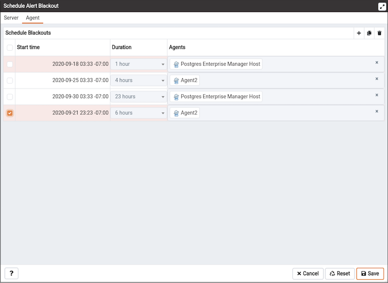

Use the fields on the `Agent` tab to provide the information about an Agent to blackout the alerts:

-   Use the `Start time` field to provide the date and time to start the alert blackout.
-   Use the `Duration` field to provide the interval for which you want to blackout the alerts.
-   Use the `Agents` field to provide the Agent name for which you want to blackout the alerts. All server level alerts, for the servers bind to that particular agent will blackout.

Once all the details are provided, you can save the details by clicking on `Save` button on the right bottom corner of the dialog. Once saved, it cannot be edited. The alerts will not be displayed on the Alert dashboard for the scheduled interval for that `PEM Agent`.

You can use `Clone` button from the top right corner of dialog, to clone the scheduling of alert blackout. Select the servers or agents you want to clone and then click on `Clone` button to create the cloned copy of all the selected servers or agents. You can edit newly created schedules as needed, and then click `Save`.

You can use `Delete` button from the top right corner of dialog to remove a scheduled alert blackout. Select the servers or agents and then click on highlighted `Delete` button in the right top corner to remove the scheduled alerts associated with that server or agent.

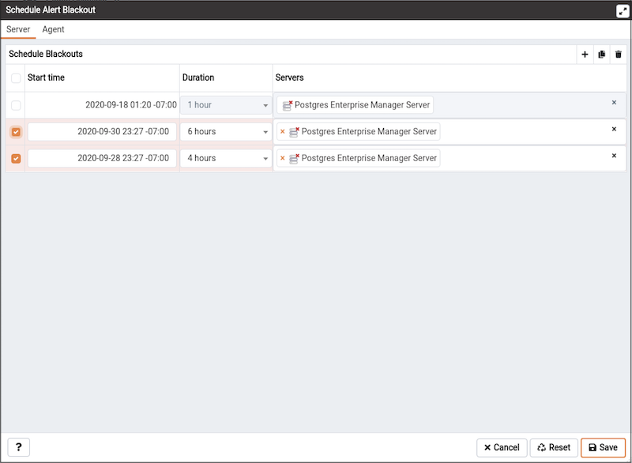

Select a server for which you wish to delete the scheduled alert backout and then click on the `Delete` button. The server will ask for confirmation before deleting that row.


You can use the `Reset` button to reset the details on the Alert Blackout dialog to the default settings. Please note that all saved blackouts will remain unaffected after resetting the current dialog values.

---
4.14&nbsp;&nbsp;&nbsp;&nbsp;&nbsp;&nbsp;&nbsp;&nbsp;&nbsp;&nbsp;Scheduled System Jobs
---

<div id="pem_scheduled_system_jobs" class="registered_link"></div>

PEM defines system jobs to take care of cleanup activities at scheduled intervals. All of the system jobs are enabled by default, and are scheduled to deploy on a regular interval. You can query the `pem.job` table in the `pem` database to review a list of the system jobs. The current schedule for system jobs is stored in the `pem.schedule` table in the `pem` database.

The system job names, their descriptions, and default deployment intervals are listed in the table below:

---
4.15&nbsp;&nbsp;&nbsp;&nbsp;&nbsp;&nbsp;&nbsp;&nbsp;&nbsp;&nbsp;Scheduled Task Tab
---

<div id="pem_scheduled_task_tab" class="registered_link"></div>

You can schedule the execution of user-defined tasks on registered servers for a time that is most convenient, and least intrusive to your users. Tasks may be one-off, or recurring and are comprised of one or more steps, which may be a SQL script, a batch/shell script, or an internal function in the PEM agent. You can view pending tasks on the *Scheduled Tasks tab.*

To open the `Scheduled Tasks` tab, select either a PEM Agent or a managed server in the tree control of the PEM client and select `Scheduled Tasks...` from the `Management` menu.

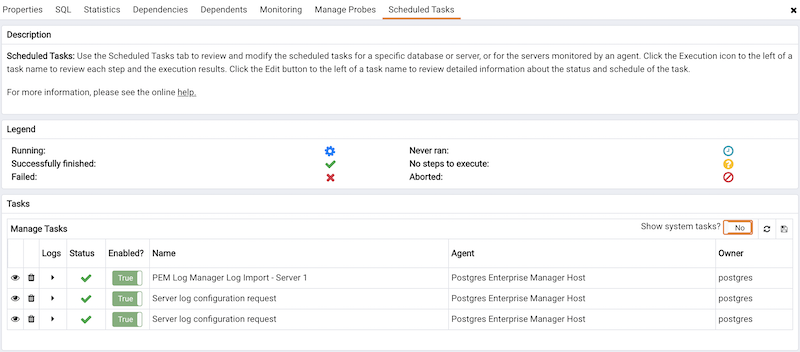

The tab features a legend, displaying the icons that identify the status of each task.

The `Manage Tasks` table displays a list of tasks. Set `Show system tasks?` to `Yes` to display system tasks; if it is set to `No`, only user-defined tasks are displayed. System tasks are displayed with a grey background, and may not be modified.

Use the `Refresh` icon to update the list of tasks displayed in the table. The table displays general information about each task.

-   The `Execution` drop-down provides access to detailed information about each step in the task.
-   The `Status` field lists the status of the current task.
-   The `Enabled?` switch displays `Yes` if the task is enabled; `No` if the task is disabled.
-   The `Name` field displays the name of the task.
-   The `Agent` or `Server` field displays the name of the agent responsible for executing the task or the server on which the task will execute.

Highlight the name of a user-defined task and click the `Edit` icon (to the left of a task name) to access detailed information about the selected task.


The `General` tab displays information about the scheduled task:

-   The `Status` field lists the status of the current task.
-   The `Enabled?` switch displays `Yes` if the task is enabled; `No` if the task is disabled.
-   The `Name` field displays the name of the task.
-   The `Agent` or `Server` field displays the name of the agent responsible for executing the task or the server on which the task will be performed.
-   The `Description` field displays a description of the task.
-   The `Last run` field displays the date and time of the last execution of the task.
-   The `Next run` field displays the date and time of the next scheduled execution of the task.
-   The `Created` field displays the date and time that the task was defined.

Highlight the name of a user-defined task and open the `Steps` arrow to review a list of the steps within the task.


The list of steps displays general information about each step in the task:

-   The `Execution date` field displays the date on which the step will execute. Step history is grouped by execution date; use the arrow to the left of an execution date to expand the node and review the task logs for that date.
-   The `Description` field displays a description of the step.

Use the arrow to the left of an execution date (in the `Steps` column) to view detailed information about the step:

-   The `Step` field displays a description of the step.
-   The `Type` field displays the task type.
-   The `Status` field lists the status of the current task.
-   If applicable, the `Result` field displays code generated during the execution of the step.
-   The `Start/Next run` field displays the date and time at which the task executed or will execute again.
-   The `Duration` field displays the length of time that the task required for execution.
-   The `Output` field displays the result set returned by the execution of the task. By default, it displays the first 250 characters. You can also change the display characters by changing the `Schedule Tasks` options in the `Preference` dialog.
-   The `Log details` field allows you to open the log in the new browser window and also download the complete log.

To delete a user-defined task, highlight the name of the task, and click the `Delete` icon located to the left of a task's name. The task will be marked for deletion, and removed when you click the `Save` icon (located in the upper-right corner of the `Manage Tasks` table.

!!! Note
    Tasks with no `Next run` date will automatically be removed from the PEM server when the last run date is more than <span class="title-ref">probe_log_retention_time &lt;pem_config_options></span> days ago.

Please note that if any of the scheduled tasks for backup, restore, validate host, validate server or delete obsolete backup for any of the BART Server gets deleted, it will not display under the `BART Tool Activities` graph of BART Server's dashboard. However, it gets listed under the `Initiated Server Backups` list.

---
4.16&nbsp;&nbsp;&nbsp;&nbsp;&nbsp;&nbsp;&nbsp;&nbsp;&nbsp;&nbsp;Creating a PEM Scheduled Job
---

<div id="pem_scheduled_jobs" class="registered_link"></div>

You can create a PEM scheduled job to perform a set of custom-defined steps in the specified sequence. These steps may contain SQL code or a batch/shell script that you may run on a server that is bound with the agent. You can schedule these jobs to suit your business requirements. For example, you can create a job for taking a backup of a particular database server and schedule it to run on a specific date and time of every month.

To create or manage a PEM scheduled job, use the PEM tree control to browse to the PEM agent for which you want to create the job. The tree control will display a Jobs node, under which currently defined jobs are displayed. To add a new job, right click on the Jobs node, and select Create Job... from the context menu.

When the Create Agent Job dialog opens, use the tabs on the Create - Agent Job dialog to define the steps and schedule that make up a PEM scheduled job.

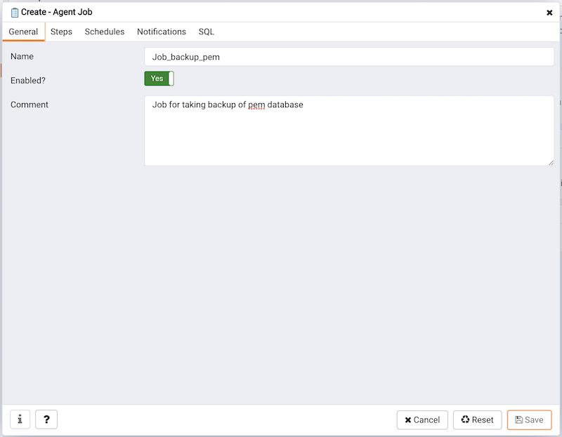

Use the fields on the `General` tab to provide general information about a job:

> -   Provide a name for the job in the `Name` field.
> -   Move the `Enabled` switch to the `Yes` position to enable a job, or `No` to disable a job.
> -   Use the `Comment` field to store notes about the job.

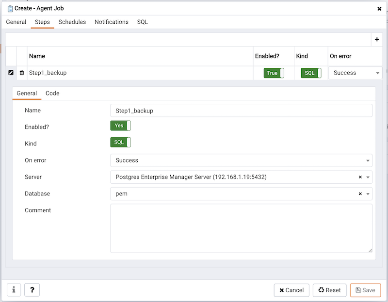

Use the `Steps` tab to define and manage the steps that the job will perform. Click the Add icon (+) to add a new step; then click the compose icon (located at the left side of the header) to open the step definition dialog:

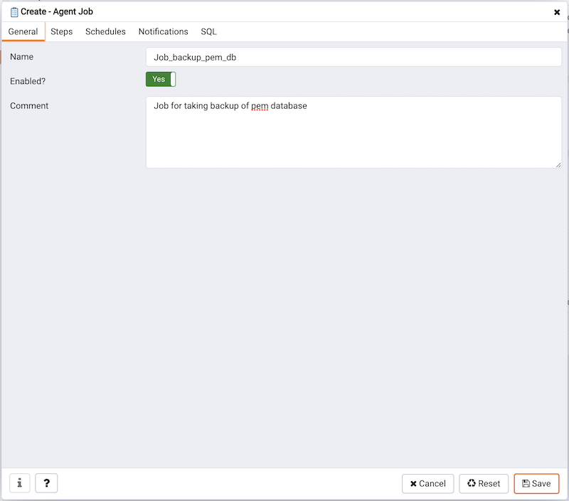

Use fields on the step definition dialog to define the step:

> -   Provide a name for the step in the `Name` field; please note that steps will be performed in alphanumeric order by name.
> -   Use the `Enabled` switch to include the step when executing the job (`True`) or to disable the step (`False`).
> -   Use the `Kind` switch to indicate if the job step invokes SQL code (`SQL`) or a batch script (`Batch`).
>
> > -   If you select `SQL`, use the `Code` tab to provide SQL code for the step.
> > -   If you select `Batch`, use the `Code` tab to provide the batch script that will be executed during the step.
>
> Use the `On error` drop-down to specify the behavior of pgAgent if it encounters an error while executing the step. Select from:
>
> > -   `Fail` - Stop the job if you encounter an error while processing this step.
> > -   `Success` - Mark the step as completing successfully, and continue.
> > -   `Ignore` - Ignore the error, and continue.
>
> -   If you have selected SQL as your input for `Kind` switch, provide the following additional information:
>     -   Use the `Server` field to specify the server that is bound with the agent for which you are creating the PEM scheduled job.
>     -   Use the `Database` field to specify the database that is associated with the server that you have selected.
> -   Use the `Comment` field to provide a comment about the step.

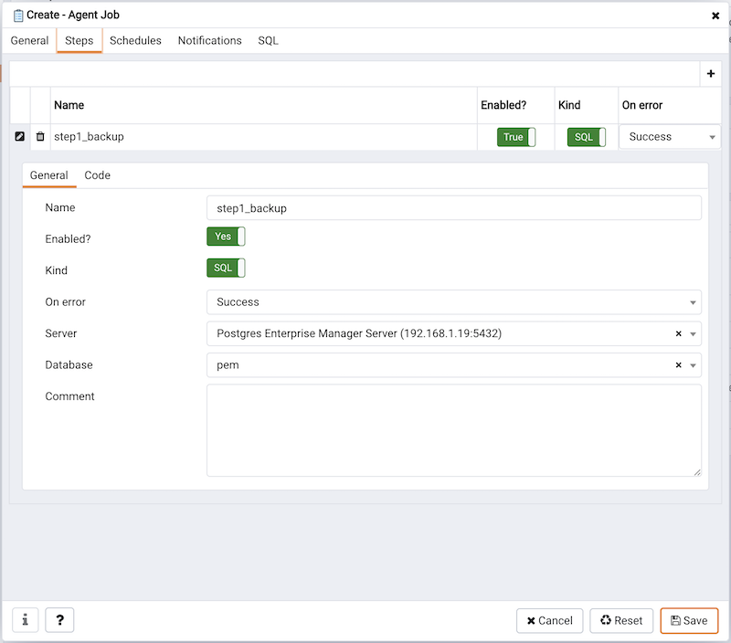

Use the context-sensitive field on the step definition dialog's `Code` tab to provide the SQL code or batch script that will be executed during the step:

> -   If the step invokes SQL code, provide one or more SQL statements in the `SQL query` field.
> -   If the step invokes a batch script, provide the script in the `Code` field. If you are running on a Windows server, standard batch file syntax must be used. When running on a Linux server, any shell script may be used, provided that a suitable interpreter is specified on the first line (e.g. *#!/bin/sh*). Along with the defined inline code, you can also provide the path of any batch script, shell script, or SQL file on the filesystem.

To invoke a script on a Linux system, you must modify the entry for `batch_script_user` parameter of agent.cfg file and specify the user that should be used to run the script. You can either specify a non-root user or root for this parameter. If you do not specify a user, or the specified user does not exist, then the script will not be executed. Restart the agent after modifying the file. If pemagent is being run by a non-root user then the value of `batch_script_user` will be ignored and the script will be executed by the same non-root user that is being used for running the pemagent.

To invoke a script on a Windows system, set the registry entry for `AllowBatchJobSteps` as true and restart the PEM agent. PEM registry entries are located in HKEY_LOCAL_MACHINE\\Software\\Wow6432Node\\EnterpriseDB\\PEM\\agent.

After providing all the information required by the step, click the `Save` button to save and close the step definition dialog.

Click the add icon (+) to add each additional step, or select the `Schedules` tab to define the job schedule.

<div class="note">

<div class="title">

Note

</div>

When you create the Job, the time fields under `Schedules` tab takes the timezone of the client machine. While saving the jobs on the PEM Server, the timezone gets converted according to PEM Server's timezone irrespective of PEM Agent's location.

</div>

Click the Add icon (+) to add a schedule for the job; then click the compose icon (located at the left side of the header) to open the schedule definition dialog:

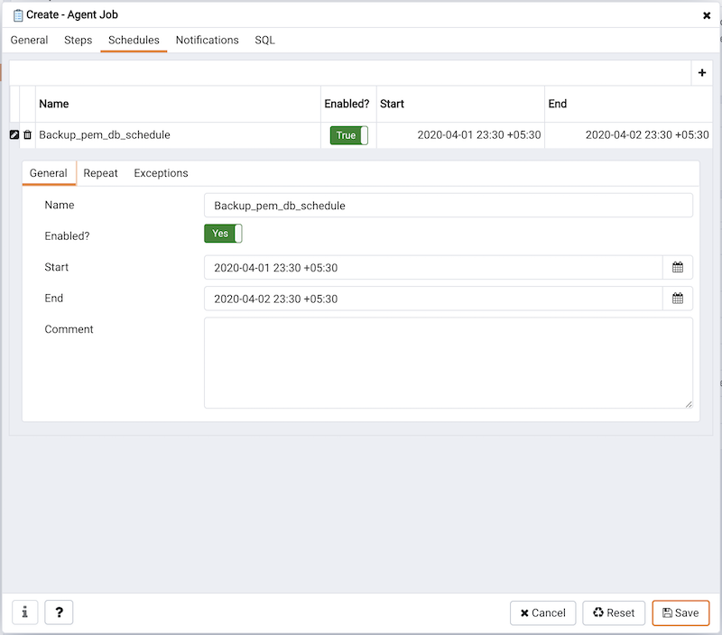

Use the fields on the Schedules definition tab to specify the days and times at which the job will execute.

> -   Provide a name for the schedule in the `Name` field.
> -   Use the `Enabled` switch to indicate that pgAgent should use the schedule (`Yes`) or to disable the schedule (`No`).
> -   Use the calendar selector in the `Start` field to specify the starting date and time for the schedule.
> -   Use the calendar selector in the `End` field to specify the ending date and time for the schedule.
> -   Use the `Comment` field to provide a comment about the schedule.

Select the `Repeat` tab to define the days on which the schedule will execute.

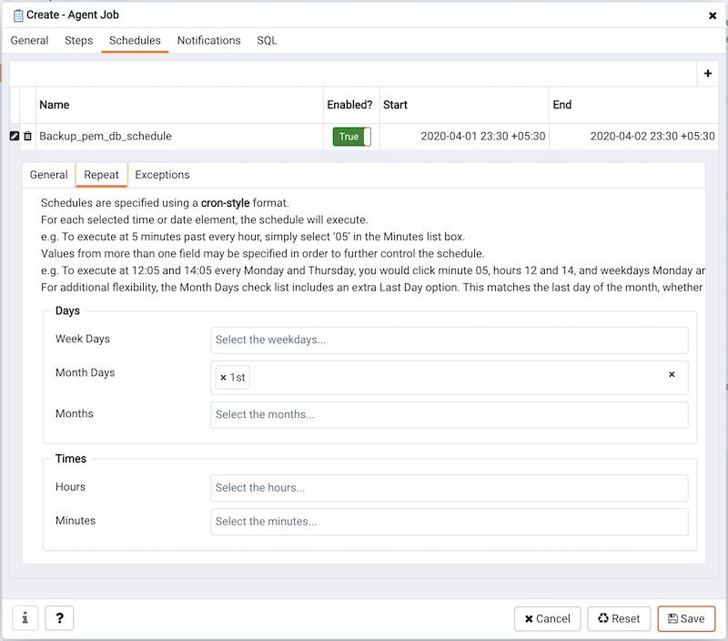

Use the fields on the `Repeat` tab to specify the details about the schedule in a cron-style format. The job will execute on each date or time element selected on the `Repeat` tab.

Click within a field to open a list of valid values for that field; click on a specific value to add that value to the list of selected values for the field. To clear the values from a field, click the X located at the right-side of the field.

Use the fields within the `Days` box to specify the days on which the job will execute:

> -   Use the `Week Days` field to select the days on which the job will execute.
> -   Use the `Month Days` field to select the numeric days on which the job will execute. Specify the `Last Day` to indicate that the job should be performed on the last day of the month, irregardless of the date.
> -   Use the `Months` field to select the months in which the job will execute.

Use the fields within the `Times` box to specify the times at which the job will execute:

> -   Use the `Hours` field to select the hour at which the job will execute.
> -   Use the `Minutes` field to select the minute at which the job will execute.

Select the `Exceptions` tab to specify any days on which the schedule will `not` execute.


Use the fields on the `Exceptions` tab to specify days on which you wish the job to not execute; for example, you may wish for jobs to not execute on national holidays.

Click the Add icon (+) to add a row to the exception table, then:

> -   Click within the `Date` column to open a calendar selector, and select a date on which the job will not execute. Specify `<Any>` in the `Date` column to indicate that the job should not execute on any day at the time selected.
> -   Click within the `Time` column to open a time selector, and specify a time on which the job will not execute. Specify `<Any>` in the `Time` column to indicate that the job should not execute at any time on the day selected.

Select the `Notifications` tab to configure the email notification settings on job level:


Use the fields on the `Notifications` tab to configure the email notification settings for a job:

> -   Use the `Send the notifications` field to specify when you want the email notifications to be sent.
> -   Use the `Email group` field to specify the email group that should receive the email notification.

When you've finished defining the schedule, you can use the `SQL` tab to review the code that will create or modify your job.


Click the `Save` button to save the job definition, or `Cancel` to exit the job without saving. Use the `Reset` button to remove your unsaved entries from the dialog.

After saving a job, the job will be listed under the `Jobs` node of the PEM tree control of the server on which it was defined. The `Properties` tab in the PEM console will display a high-level overview of the selected job, and the Statistics tab will show the details of each run of the job. To modify an existing job or to review detailed information about a job, right-click on a job name, and select `Properties` from the context menu.

---
4.17&nbsp;&nbsp;&nbsp;&nbsp;&nbsp;&nbsp;&nbsp;&nbsp;&nbsp;&nbsp;Sending email notifications for a job
---

<div id="pem_job_notification" class="registered_link"></div>

You can configure the settings in PEM console for sending the SMTP trap on success or failure of a system-generated job (listed under scheduled tasks) or a custom-defined agent job. For information on custom-defined agent job, see ‘Creating PEM Scheduled Jobs’. These email notification settings can be configured at following three levels (in order of precedence) to send email notifications to the specified user group:

> -   Job level
> -   Agent level
> -   PEM server level (default level)

### Configuring job notifications at job level

You can configure email notification settings at job level only for a custom-defined agent job in one of the following ways:

> -   For a new agent job, you can configure the email notification settings in the `Notification` tab of `Create-Agent Job` wizard while creating the job itself.
> -   For an existing custom-defined job, you can edit the properties of the job and configure the notification settings.

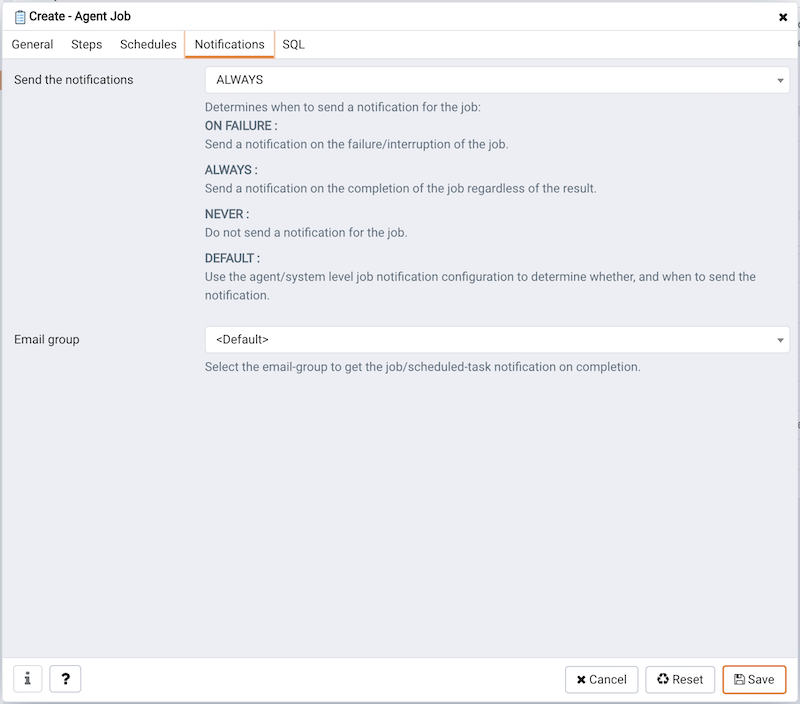

Use the fields on the Notifications tab to configure the email notification settings on job level:

> -   Use the `Send the notifications` field to specify when you want the email notifications to be sent.
> -   Use the `Email group` field to specify the email group that should receive the email notification.

### Configuring job notifications at agent level

Select the agent in the tree view, right click and select `Properties`. In the Properties dialog, select the `Job notifications` tab.

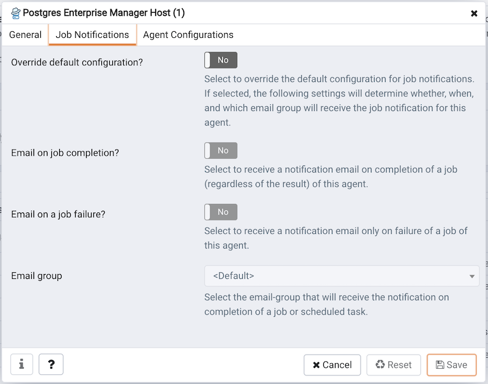

Use the fields on the Job notifications tab to configure the email notification settings on agent level:

-   Use the `Override default configuration?` switch to specify if you want the agent level job notification settings to override the default job notification settings. If you select Yes for this switch, you can use the rest of the settings on this dialog to define when and to whom the job notifications should be sent. Please note that the rest of the settings on this dialog work only if you enable the `Override default configuration?` switch.
-   Use the `Email on job completion?` switch to specify if the job notification should be sent on the successful job completion.
-   Use the `Email on a job failure?` switch to specify if the job notification should be sent on the failure of a job.
-   Use the `Email group` field to specify the email group to whom the job notification should be sent.

### Configuring job notifications at server level

You can use the `Server Configuration` dialog to provide information about your email notification configuration at PEM server level. To open Server Configuration dialog, select `Server Configuration...` from the PEM client's Management menu.

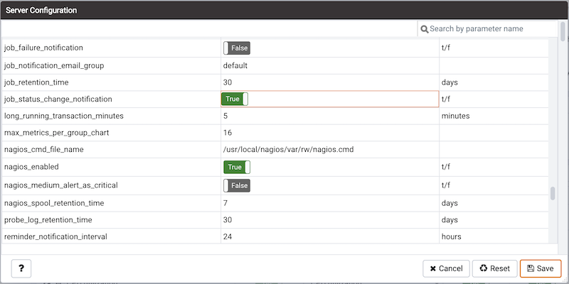

Four server configuration parameters specify information about your job notification preferences at PEM server level:

> -   Use the `job_failure_notification` switch to specify if you want to send email notification after each job failure.
> -   Use the `job_notification_email_group` parameter to specify the email group that should receive the email notification.
> -   Use the `job_retention_time parameter` to specify the number of days that non-recurring scheduled tasks should be retained in the system.
> -   Use the `job_status_change_notification` switch to specify if you want to send email notification after each job status change, irrespective of its status being a failure, success, or interrupted.

---
4.18&nbsp;&nbsp;&nbsp;&nbsp;&nbsp;&nbsp;&nbsp;&nbsp;&nbsp;&nbsp;Task Viewer
---

<div id="pem_task_view" class="registered_link"></div>

Postgres Enterprise Manager runs tasks on managed servers by scheduling them on the PEM server for the agent on the managed server to execute at the appropriate time. Tasks may be one-off, or recurring and are comprised of one or more steps, which may be a SQL script, a batch/shell script, or an internal function in the PEM agent. Tasks may be viewed using the *Scheduled Tasks dialogue.*

To open the `Scheduled Tasks dialogue`, select either a PEM Agent or a managed server in the tree control of the PEM client and select the `Scheduled Tasks` menu option from the `Server` sub-menu of the `Management` menu, or from the context menu.


The dialogue displays the task data relating to the selected object when it was opened. The following details are shown:

-   **Status** - The status of the task following the last execution.
-   **Enabled?** - An indicator showing whether the task is enabled or not.
-   **Name** - The name of the task.
-   **Server** - The server on which the task will be executed, where applicable.
-   **Description** - A description of the task.
-   **Last Run** - The time the task was last executed.
-   **Next Run** - The time the task is next scheduled to execute, if any.
-   **Created** - The time and date that the task was created.

In order to [view the log records](01_pem_log_view/#pem_log_view) for a task, select it in the list and click the `Log Viewer` button.

In order to remove tasks and their associated log records (if present), click the checkbox to select each task to be removed, and then click the `Remove` button.

!!! Note
    Tasks with no next run date will automatically be removed from the PEM server when the last run date is more than <span class="title-ref">probe_log_retention_time &lt;pem_config_options></span> days ago.

Contents:


---
4.18.1&nbsp;&nbsp;&nbsp;&nbsp;&nbsp;&nbsp;&nbsp;&nbsp;&nbsp;&nbsp;Log Viewer
---

<div id="pem_log_view" class="registered_link"></div>

When PEM executes [scheduled tasks](./#pem_task_view), log records are created to record the status of each step of the task for diagnostic purposes. Log records can be viewed on the *Log Viewer* dialogue, opened from the [Scheduled Task dialogue](./#pem_task_view).


The dialogue displays the log data relating to each step of the task:

-   **Step** - The name of the step.
-   **Type** - The type of the step, one of SQL, Batch or Internal.
-   **Status** - The status of the step.
-   **Result** - The numeric result of the step. For a batch step, this will be the return code of the script.
-   **Start / Next Run** - The schedule for the next run.
-   **Duration** - The duration of the step.
-   **Output** - The output text from the step, if any.

---
4.19&nbsp;&nbsp;&nbsp;&nbsp;&nbsp;&nbsp;&nbsp;&nbsp;&nbsp;&nbsp;Monitoring a Failover Manager Cluster
---

<div id="monitoring_a_failover_manager_cluster" class="registered_link"></div>

You can configure PEM to display status information about one or more Failover Manager clusters on the Streaming Replication dashboard. Before configuring PEM to monitor a Failover Manager cluster, you must install and configure Streaming Replication and Failover Manager on the cluster.

Please note that your Streaming Replication `standby.signal` file must include the following parameters:

-   primary_conninfo
-   promote_trigger_file

For information about installing and configuring Failover Manager and Streaming Replication, please see the EnterpriseDB Failover Manager Guide, available at [www.enterprisedb.com](http://www.enterprisedb.com).

To configure PEM to monitor a Failover Manager cluster, use the PEM client to create a server definition for the primary node of the Failover Manager cluster. Use the tabs on the [New Server Registration](../01_toc_pem_getting_started/07_pem_define_connection/#pem_define_connection) dialog to specify general connection properties for the primary node; use fields on the `Advanced` tab to specify information about the Failover Manager cluster:

-   Use the `EFM Cluster Name` field to specify the name of the Failover Manager cluster. The cluster name is the prefix of the name of the cluster properties file. For example, if your cluster properties file is named `efm.properties`, your cluster name is `efm`.
-   Use the `EFM Installation Path` field to specify the location of the Failover Manager binary file. By default, the Failover Manager binary file is installed in `/usr/efm-x.x/bin`.

After saving the server definition, the primary node will be included in the list of servers under the `PEM Server Directory` in the PEM client `Object browser` tree, and will be displayed on the `Global Overview` dashboard.

To include Failover Manager information on the Streaming Analysis dashboard, you must enable the following probes for each node in the Failover Manager cluster:

-   Failover Manager Cluster Info
-   Failover Manager Node Status

To enable a probe, right click on the node name, and select `Manage Probes` from the `Management` menu.

To view the `Streaming Replication Analysis` dashboard and the status of the Failover Manager cluster, right click on the name of the primary node in the `Object browser` tree control and navigate through the `Dashboards` menu to select [Streaming Replication Analysis](01_dashboards/16_str_replication_dashboard/#str_replication_dashboard).

### Promoting a Cluster

Select the `Replace Cluster Primary` from `Server` under the `Tools` menu to start the failover process. When you select `Replace Cluster Primary`, a popup opens, asking you to confirm that you wish to replace the current primary node:

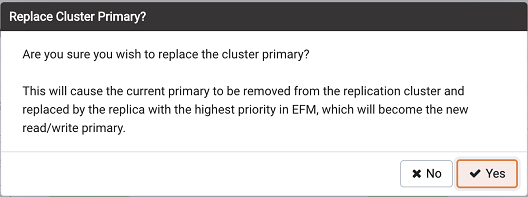

Select `No` to exit the popup without replacing the current primary node.

Select `Yes` to remove the current primary node from the Failover Manager cluster and promote a replica node to the role of read/write primary node within a Failover Manager cluster. The node with the highest promotion priority (defined in Failover Manager) will become the new primary node. PEM will display a dialog, reporting the job status.

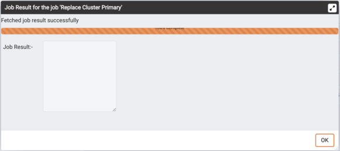

When the job completes and the Streaming Replication Analysis dashboard refreshes, you can review the `Failover Manager Node Status` table to confirm that a replica node has been promoted to the role of primary within the Failover Manager cluster.

### Switchover EFM Cluster

You can use the PEM client to switchover the primary node of a Failover Manager cluster with a replica node. To initiate the switchover process, select Switchover EFM Cluster from the Tools menu. A dialog opens, asking you to confirm that you wish to switchover EFM cluster.

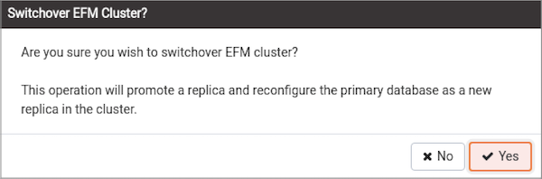

Select `Yes` to switchover EFM cluster from the Failover Manager cluster and promote a replica node to the role of read/write primary node and reconfigure the primary database as a new replica within a Failover Manager cluster. The node with the highest promotion priority (defined in Failover Manager) will become the new primary node. PEM will display a dialog, reporting the job status.

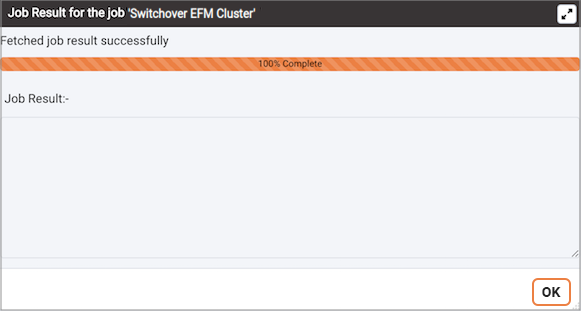

When the job completes and the Streaming Replication Analysis dashboard refreshes, you can review the `Failover Manager Node Status` table to confirm that a switchover within the Failover Manager cluster.

---
4.20&nbsp;&nbsp;&nbsp;&nbsp;&nbsp;&nbsp;&nbsp;&nbsp;&nbsp;&nbsp;Performance Diagnostic
---

<div id="performance_diagnostic" class="registered_link"></div>

You can use the Performance Diagnostic dashboard to analyze the database performance for Postgres instances by monitoring the wait events. To display the diagnostic graphs, PEM uses the data collected by EDB Wait States module.

Peformance Diagnostic feature is supported for Advanced Server databases from PEM 7.6 version onwards and for PostgreSQL databases it is supported from PEM 8.0 onwards.

<div class="note">

<div class="title">

Note

</div>

For PostgreSQL databases, Performance Diagnostics is supported only for versions 10, 11, and 12 installed on the supported CentOS or RHEL platforms.

</div>

For more information on EDB Wait States, see [EDB Postgres Advanced Server Guide](/epas/latest/epas_guide/13_performance_analysis_and_tuning/).

You can analyze the Wait States data on multiple levels by narrowing down your selection of data. Each level of the graph is populated on the basis of your selection of data at the higher level.

Prerequisite:

-   For PostgreSQL, you need to install `edb_wait_states_<X>` package from `edb.repo` where `<X>` is the version of PostgreSQL Server. You can refer to [EDB Build Repository](https://repos.enterprisedb.com/) for the steps to install this package. For Advanced Server, you need to install `edb-as<X>-server-edb-modules`, Where `<X>` is the version of Advanced Server.

-   Once you ensure that EDB Wait States module of EDB Postgres Advanced Server is installed, then configure the list of libraries in the `postgresql.conf` file as below:

    `shared_preload_libraries = '$libdir/edb_wait_states'`

Restart the database server, and then create the following extension in the maintenance database:

> `CREATE EXTENSION edb_wait_states;`

-   You must have super user privileges to access the Performance Diagnostic dashboard.

You get the following error while accessing the Performance Diagnostic dashboard if the above prerequisites are not met:

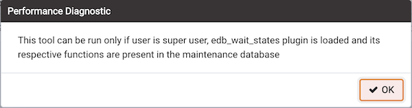

To open the Performance Diagnostic dashboard, select `Server` and then `Performance Diagnostic...` from the `Tools` menu of the PEM client.

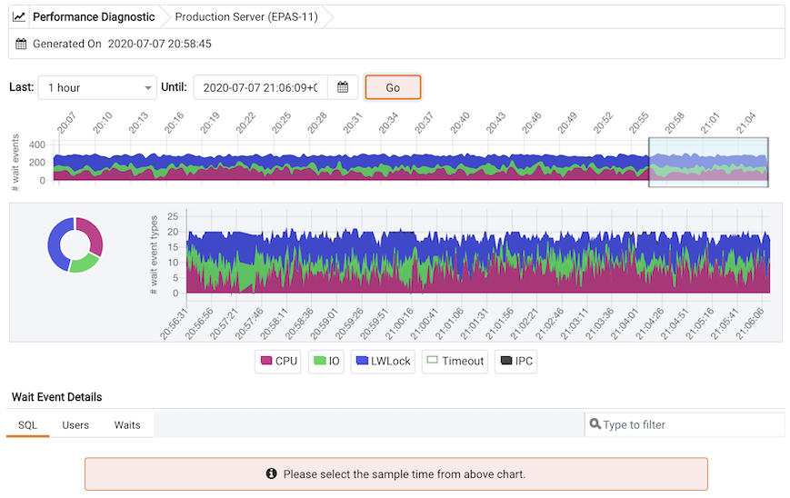

By default, the top most Performance Diagnostic graph pulls the data of last one hour, starting from current date and time. This graph shows the time series containing the number of active sessions. Each point of this time series represents the active sessions and wait events at a particular time and last 15 seconds. These sessions may or may not be waiting for an wait event, or using the CPU at a particular point in time. This time series is generated based on the wait event samples collected by the `edb_wait_states` extension.

You can also use the `Preferences` dialog to display Performance Diagnostic in a new browser tab. Use `Open in New Browser Tab?` to display the Performance Diagnostics dashboard in a new browser tab.

The range selection in the first graph is 10 minutes. You can use the `Last` drop-down list box to select the duration for which you want to see the graph: select the last 1 hour, last 4 hours, last 12 hours, or last 24 hours. You can also select the date and time through which you want the data to be displayed.


The first graph displays the number of active sessions (and - wait event types) for the selected time interval. You can narrow down the timeline in the first graph to analyze the data for a specific time period.

Next section plots the following graphs based on the selected time interval in the first graph:

1.  Donut graph - It shows total wait event types according to the time range selection in the first graph. It helps you understand how much time was spent by those session on waiting for an event.
2.  Line graph - It plots a time series with each point representing the active sessions for each sample time.

To differentiate each wait event types and the CPU usage clearly, the graph for each wait event type is displayed in a different color.

Select a particular time on the `Line graph` for which you wish to analyze the wait events; the third section displays the wait event details in the Performance Diagnostics dashboard on the basis of your selected particular time in the second graph. The third section displays wait event details on three tabs:

-   The `SQL` tab displays the list of SQL queries having wait events for the selected sample time.
-   The `Users` tab displays the details of the wait events grouped by users for selected sample time.
-   The `Waits` tab displays the number of wait events belonging to each wait event type for the selected sample time.

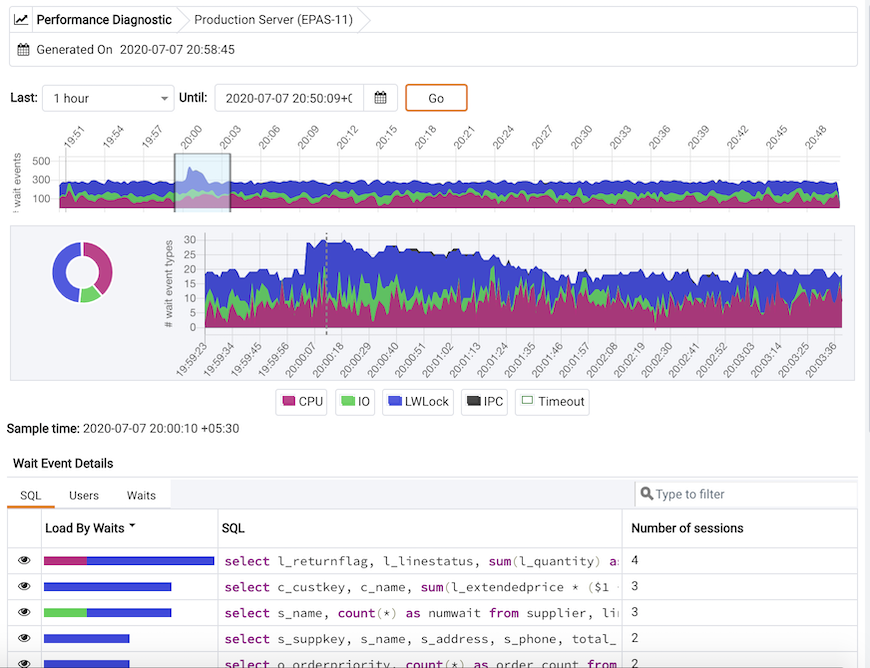

You can click on the graph legends to show or hide a particular wait event type in all the graphs. This will make the analysis of a specific wait event type easier.


You can filter the data displayed in the rows under all the three tabs. You can also sort the data alphabetically by clicking on the column headers.

SQL tab


Users tab

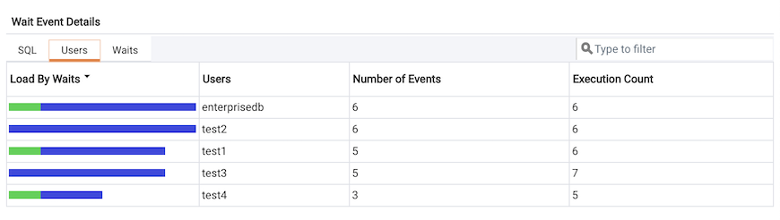

Waits tab


Click on the Eye icon in any row of the SQL tab to display a new tab with details of the query of that particular row. This page displays Query ID and its corresponding session IDs in a dropdown list at that particular selected sample time in the Query information section. You can select the session ID for the selected query for which you want to analyze the data. You will see the details corresponding to the selected session ID and query ID. The Query information table also displays the SQL query. If the SQL query is being displayed partially, click the down arrow at the bottom of the section to view the complete SQL query.

The `Wait event types` section displays the total number of wait event types for the selected session ID and query ID. It shows two type of graphs:

1.  Donut graph - It shows the proportions of categorical data, with the size of each piece representing the proportion of each wait event type.
2.  Timeline bar graph - It can be used to visualize trends in counts of wait event types over time.

To differentiate clearly, each wait event type is represented by a different color in the bar graph.


The `Wait events` section has a table displaying all the wait events occured during the query execution. It displays data in decreasing order by number of the wait events. Second table displays the wait event with sample time occured over the period of whole query execution. It allows to analyze the wait events during the query execution over the period of time. It shows the actual samples collected by the EDB Wait States extension for that particular query ID and session ID.

---
4.21&nbsp;&nbsp;&nbsp;&nbsp;&nbsp;&nbsp;&nbsp;&nbsp;&nbsp;&nbsp;Reports
---

<div id="reports" class="registered_link"></div>

You can generate the System Configuration report and Core Usage report for all locally and remotely managed servers. To generate this report, select `Reports` from the `Management` Menu.

Reports has following options:

> -   System Configuration Report (JSON)
> -   System Configuration Report (HTML)
> -   Core Usage Report (JSON)
> -   Core Usage Report (HTML)

Please note that only superusers or the users with the pem_admin role permission can download the System Configuration or Core Usage reports.

Also note that information in these reports will reflect the latest probe run time.

### System Configuration Report

The System Configuration Report provides detailed information about the PEM Agents group, PEM Server directory group and custom groups listed under browser tree. These groups can contain Postgres Enterprise Manager, PEM Agents and Database servers. You can download this report in HTML as well as in JSON format.

The `Postgres Enterprise Manager Summary` provides details about:

> -   The Postgres Enterprise Manager backend database server version
> -   Application Version
> -   User name accessing the application
> -   Python version
> -   Flask version
> -   Platform specific information

The `Summary`, details about the number of agents and servers are provided.

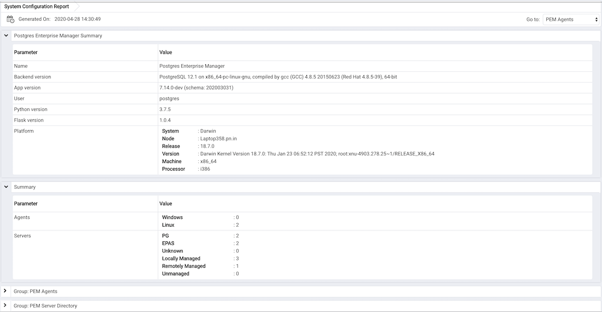

The `Group: PEM Agents`, details about PEM Agent, CPU, Disk Utilization as well as Memory details are provided.

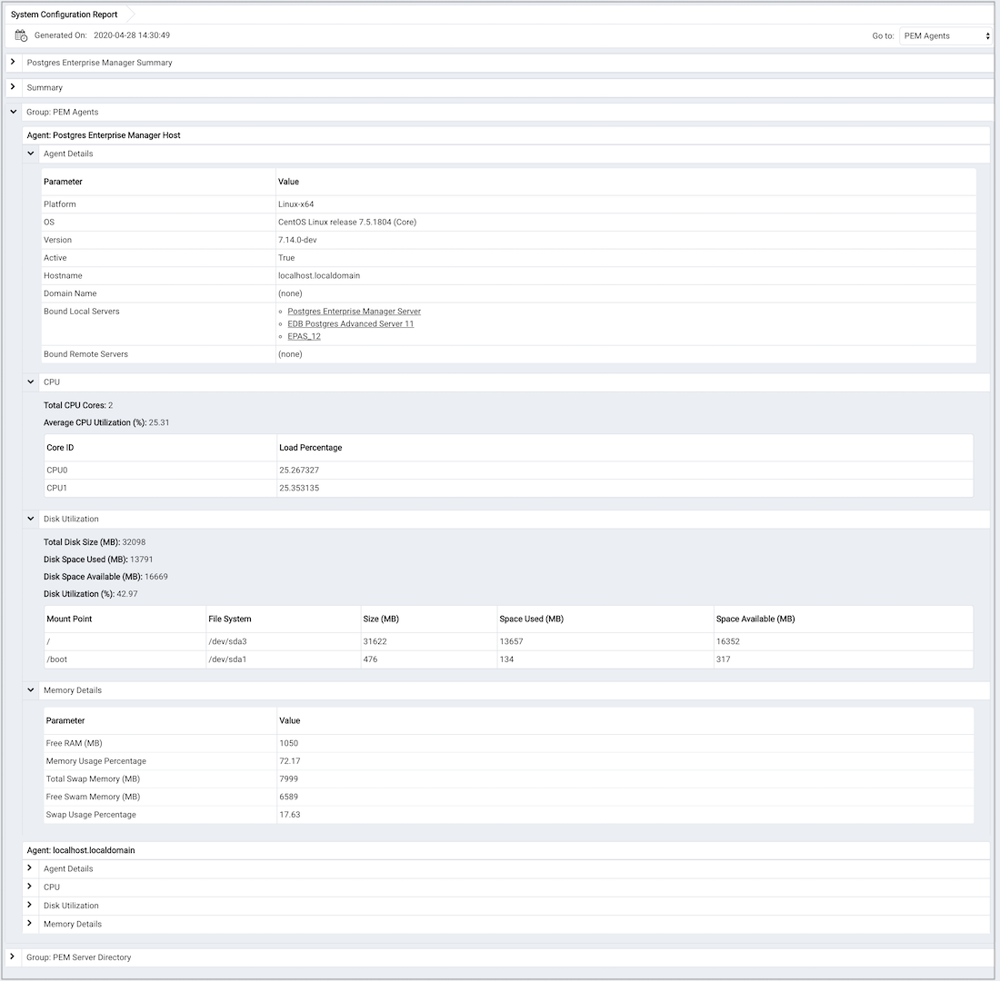

The `Group: PEM Server Directory`, provides details about:

> -   The database server version
> -   Host
> -   Port
> -   Database name
> -   Database size
> -   Tablespace size


Please note that here Group Server Name depends on the group name to which the server is added.

### Core Usage Report

The Core Usage report provides detailed information about number of cores specific to:

> -   The server type
> -   Database version
> -   Platform and group name

Also, gives detailed information about locally managed servers with:

> -   Type
> -   Host
> -   Port
> -   Platform
> -   Cores
> -   RAM


---
5&nbsp;&nbsp;&nbsp;&nbsp;&nbsp;&nbsp;&nbsp;&nbsp;&nbsp;&nbsp;Management Basics
---

<div id="toc_pem_management_basics" class="registered_link"></div>

PEM provides a graphical interface that you can use to simplify management of your Postgres servers and the objects that reside on them.

The Grant Wizard simplifies the task of privilege management; to open the Grant Wizard, highlight the name of a server, database, or schema in the PEM client tree control, and select `Grant Wizard...` from the `Tools` menu.

Contents:


---
5.1&nbsp;&nbsp;&nbsp;&nbsp;&nbsp;&nbsp;&nbsp;&nbsp;&nbsp;&nbsp;Grant Wizard
---

<div id="grant_wizard" class="registered_link"></div>

The `Grant Wizard` tool is a graphical interface that allows you to manage the privileges of one or more database objects in a point-and-click environment. A search box, dropdown lists, and checkboxes facilitate quick selections of database objects, roles and privileges.

The wizard organizes privilege management through a sequence of windows: `Object Selection (step 1 of 3)`, `Privileges Selection (step 2 of 3)` and `Final (Review Selection) (step 3 of 3)`. The `Final (Review Selection)` window displays the SQL code generated by wizard selections.

To launch the `Grant Wizard` tool, select a database object in the `Browser` tree control, then navigate through `Tools` on the menu bar to click on the `Grant Wizard` option.

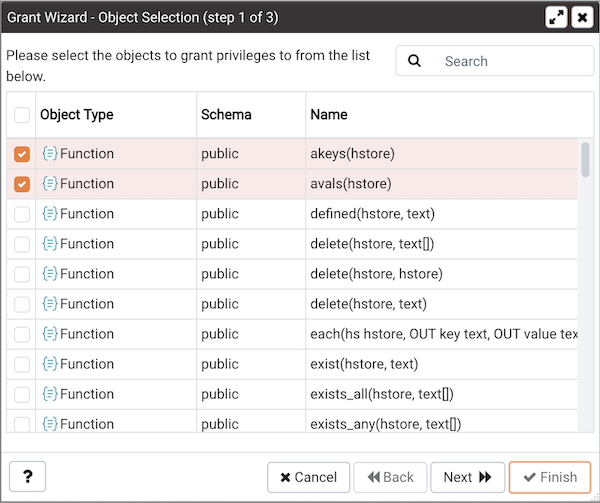

Use the fields in the `Object Selection (step 1 of 3)` window to select the object or objects on which you are modifying privileges. Use the `Search by object type or name` field to locate a database object, or use the scrollbar to scroll through the list of all accessible objects.

-   Each row in the table lists object identifiers; check the checkbox in the left column to include an object as a target of the Grant Wizard. The table displays:

    > -   The object type in the `Object Type` field
    > -   The schema in which the object resides in the `Schema` field
    > -   The object name in the `Name` field.

Click the `Next` button to continue, or the `Cancel` button to close the wizard without modifying privileges.

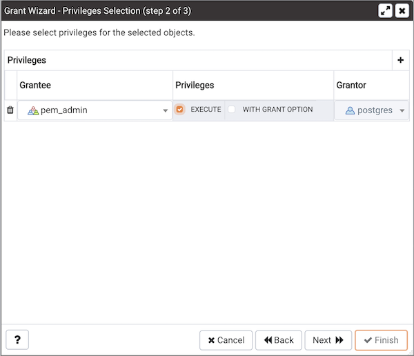

Use the fields in the `Privileges Selection (step 2 of 3)` window to grant privileges. If you grant a privilege WITH GRANT OPTION, the Grantee will have the right to grant privileges on the object to others. If WITH GRANT OPTION is subsequently revoked, any role who received access to that object from that Grantee (directly or through a chain of grants) will lose thier privileges on the object.

-   Click the `Add` icon (+) to assign a set of privileges.
-   Select the name of the role from the drop-down listbox in the `Grantee` field.
-   Click inside the `Privileges` field. Check the boxes to the left of one or more privileges to grant the selected privileges to the specified user. If privileges have previously been granted on a database object, unchecking a privilege for a group or user will result in revoking that privilege.
-   The current user, who is the default grantor for granting the privilege, is displayed in the `Grantor` field.
-   Click the `Add` icon (+) to assign a set of privileges to another role; to discard a privilege, click the trash icon to the left of the row and confirm deletion in the `Delete Row` dialog.

For more information about granting privileges on database objects, see the [PostgreSQL core documentation](http://www.postgresql.org/docs/9.5/static/sql-grant.html).

Click the `Next` button to continue, the `Back` button to select or deselect additional database objects, or the `Cancel` button to close the wizard without modifying privileges.

Your entries in the `Grant Wizard` tool generate a SQL command; you can review the command in the `Final (Review Selection) (step 3 of 3)` window (see an example below).

**Example**

The following is an example of the sql command generated by user selections in the `Grant Wizard` tool:

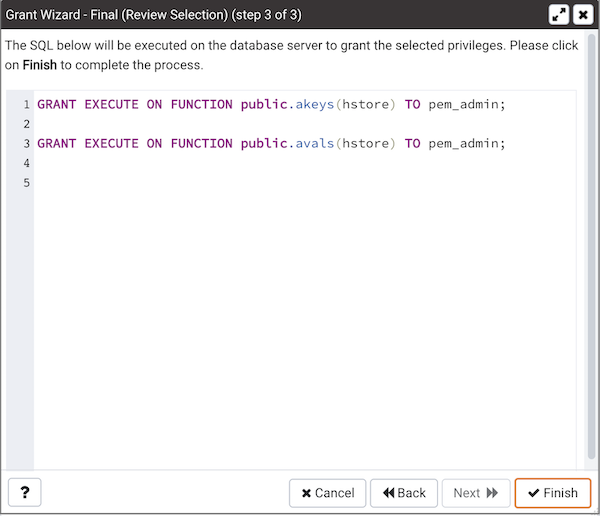

The commands displayed assign a role named `Bob` `INSERT` and `UPDATE` privileges `WITH GRANT OPTION` on the `sales_meetings` and the `sales_territories` tables.

-   Click the `Back` button to select or deselect additional database objects, roles and privileges.
-   Click the `Cancel` button to exit without saving work.
-   Click the `Finish` button to save selections and exit the wizard.

---
5.2&nbsp;&nbsp;&nbsp;&nbsp;&nbsp;&nbsp;&nbsp;&nbsp;&nbsp;&nbsp;Add named restore point Dialog
---

<div id="add_restore_point_dialog" class="registered_link"></div>

Use the `Add named restore point` dialog to take a named snapshot of the state of the server for use in a recovery file. To create a named restore point, the server's postgresql.conf file must specify a `wal_level` value of `replica`, or `logical`. You must be a database superuser to create a restore point.

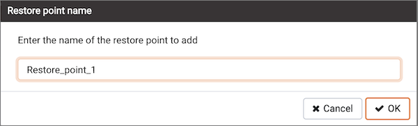

When the `Restore point name` window launches, use the field `Enter the name of the restore point to add` to provide a descriptive name for the restore point.

For more information about using a restore point as a recovery target, please see the [PostgreSQL documentation](https://www.postgresql.org/docs/current/runtime-config-wal.html#RUNTIME-CONFIG-WAL-RECOVERY-TARGET).

-   Click the `OK` button to save the restore point.
-   Click the `Cancel` button to exit without saving work.

---
5.3&nbsp;&nbsp;&nbsp;&nbsp;&nbsp;&nbsp;&nbsp;&nbsp;&nbsp;&nbsp;Import/Export data Dialog
---

<div id="import_export_data" class="registered_link"></div>

Use the `Import/Export data` dialog to copy data from a table to a file, or copy data from a file into a table.

The `Import/Export data` dialog organizes the import/export of data through the `Options` and `Columns` tabs.

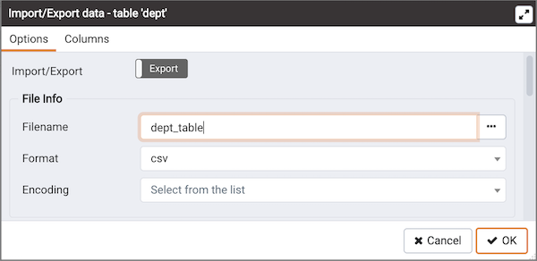

Use the fields in the `Options` tab to specify import and export preferences:

-   Move the `Import/Export` switch to the `Import` position to specify that the server should import data to a table from a file. The default is `Export`.

-   Use the fields in the `File Info` field box to specify information about the source or target file:

    > -   Enter the name of the source or target file in the `Filename` field. Optionally, select the `Browser` icon (ellipsis) to the right to navigate into a directory and select a file.
    > -   Use the drop-down listbox in the `Format` field to specify the file type. Select:
    >     -   `binary` for a .bin file.
    >     -   `csv` for a .csv file.
    >     -   `text` for a .txt file.
    > -   Use the drop-down listbox in the `Encoding` field to specify the type of character encoding.

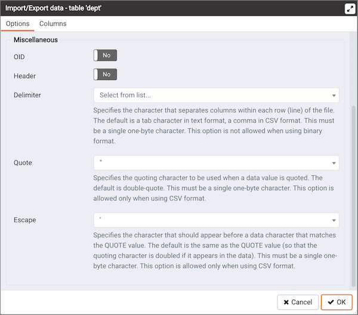

-   Use the fields in the `Miscellaneous` field box to specify additional information:

    > -   Move the `OID` switch to the `Yes` position to include the `OID` column. The `OID` is a system-assigned value that may not be modified. The default is `No`.
    > -   Move the `Header` switch to the `Yes` position to include the table header with the data rows. If you include the table header, the first row of the file will contain the column names.
    > -   If you are exporting data, specify the delimiter that will separate the columns within the target file in the `Delimiter` field. The separating character can be a colon, semicolon, a vertical bar, or a tab.
    > -   Specify a quoting character used in the `Quote` field. Quoting can be applied to string columns only (i.e. numeric columns will not be quoted) or all columns regardless of data type. The character used for quoting can be a single quote or a double quote.
    > -   Specify a character that should appear before a data character that matches the `QUOTE` value in the `Escape` field.

Click the `Columns` tab to continue.

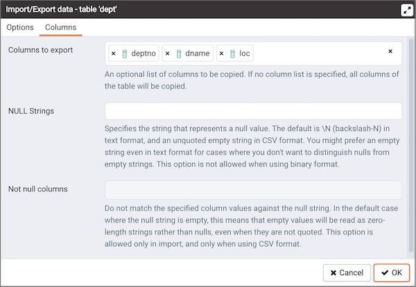

Use the fields in the `Columns` tab to select the columns that will be imported or exported:

-   Click inside the `Columns to export/import` field to deselect one or more columns from the drop-down listbox. To delete a selection, click the `x` to the left of the column name. Click an empty spot inside the field to access the drop-down list.
-   Use the `NULL Strings` field to specify a string that will represent a null value within the source or target file.
-   If enabled, click inside the `Not null columns` field to select one or more columns that will not be checked for a NULL value. To delete a column, click the `x` to the left of the column name.

After completing the `Import/Export data` dialog, click the `OK` button to perform the import or export. PEM will inform you when the background process completes:

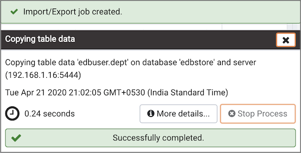

Use the **Stop Process** button to stop the Import/Export process.

Use the `Click here for details` link on the notification to open the `Process Watcher` and review detailed information about the execution of the command that performed the import or export:

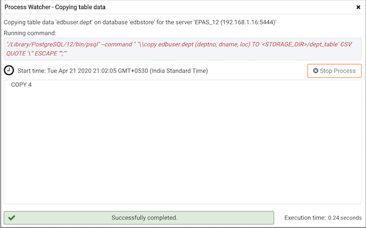

<div class="note">

<div class="title">

Note

</div>

You can click on the  icon in the process watcher window to open the file location in the Storage Manager. You can use the [Storage Manager](05_storage_manager/#storage_manager) to download the backup file on the client machine .

</div>

---
5.4&nbsp;&nbsp;&nbsp;&nbsp;&nbsp;&nbsp;&nbsp;&nbsp;&nbsp;&nbsp;Maintain a database object
---

<div id="maintenance" class="registered_link"></div>


This tool allows to maintain the database in total, or only a selected table, or a selected index.

Maintenance comes in three flavors.

### VACUUM

VACUUM will scan the database or table for rows, that are not in use any more. If a row is updated or deleted, the previous content isn't replaced, but rather marked invalid. The new data is inserted freshly into the database. You need to perform a garbage collection regularly, to insure that your database doesn't contain too much unused data, wasting disk space and ultimately degrading performance.

Please press the Help button to see the PostgreSQL help about the VACUUM command to learn more about the options.

The output of the database server is displayed in the messages page as they arrive. If Verbose is selected, the server will send very detailed info about what it did.

While this tool is very handy for ad-hoc maintenance purposes, you are encouraged to install an automatic job, that performs a VACUUM job regularly to keep your database in a neat state.

### ANALYZE

ANALYZE investigates statistical values about the selected database or table. This enables the query optimizer to select the fastest query plan, to give optimal performance. Every time your data is changing radically, you should perform this task. It can be included in a VACUUM run, using the appropriate option.

### REINDEX

REINDEX rebuilds the indexes in case these have degenerated caused by unusual data patterns inserted. This can happen for example if you insert many rows with increasing index values, and delete low index values.

The RECREATE option doesn't call the REINDEX SQL command internally, instead it drops the existing table and recreates it according to the current index definition.This doesn't lock the table exclusively, as REINDEX does, but will lock write access only.


---
5.4.1&nbsp;&nbsp;&nbsp;&nbsp;&nbsp;&nbsp;&nbsp;&nbsp;&nbsp;&nbsp;Maintenance Dialog
---

<div id="maintenance_dialog" class="registered_link"></div>

Use the `Maintenance` dialog to VACUUM, ANALYZE, REINDEX or CLUSTER a database or selected database objects.


While this utility is useful for ad-hoc maintenance purposes, you are encouraged to perform automatic VACUUM jobs on a regular schedule.

Select a button next to `Maintenance operation` to specify the type of maintenance:

-   Click `VACUUM` to scan the selected database or table to reclaim storage used by dead tuples.

    > -   Move the `FULL` switch to the `Yes` position to compact tables by writing a completely new version of the table file without dead space. The default is `No`.
    > -   Move the `FREEZE` switch to the `Yes` position to freeze data in a table when it will have no further updates. The default is `No`.
    > -   Move the `ANALYZE` switch to the `Yes` position to issue ANALYZE commands whenever the content of a table has changed sufficiently. The default is `No`.

-   Click `ANALYZE` to update the stored statistics used by the query planner. This enables the query optimizer to select the fastest query plan for optimal performance.

-   Click `REINDEX` to rebuild any index in case it has degenerated due to the insertion of unusual data patterns. This happens, for example, if you insert rows with increasing index values, and delete low index values.

-   Click `CLUSTER` to instruct PostgreSQL to cluster the selected table.

To exclude status messages from the process output, move the `Verbose Messages` switch to the `No` position; by default, status messages are included.

When you've completed the dialog, click `OK` to start the background process; to exit the dialog without performing maintenance operations, click `Cancel`.

pgAdmin will inform you when the background process completes:


Use the **Stop Process** button to stop the Maintenance process.

Use the `Click here for details` link on the notification to open the `Process Watcher` and review detailed information about the execution of the command that performed the import or export:


---
5.5&nbsp;&nbsp;&nbsp;&nbsp;&nbsp;&nbsp;&nbsp;&nbsp;&nbsp;&nbsp;Storage Manager
---

<div id="storage_manager" class="registered_link"></div>

*Storage Manager* is a feature that helps you manage your systems storage device. You can use *Storage Manager* to:

-   Download, upload, or manage operating system files.
-   Download *backup* or *export* files (custom, tar and plain text format) on a client machine.
-   Download *export* dump files of tables.

You can access *Storage Manager* from the *Tools* Menu.

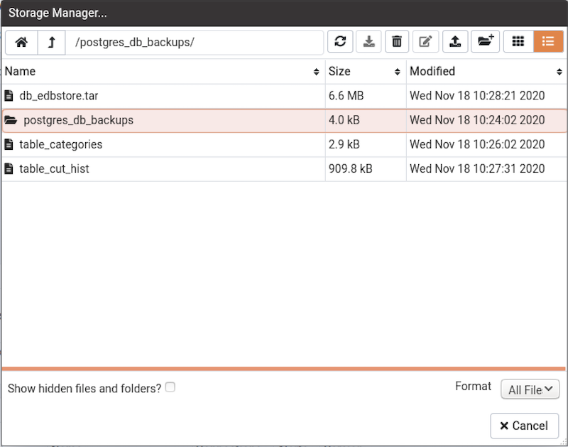

Use icons on the top of the *Storage Manager* window to manage storage:

Use the `Home` icon  to return to the home directory.

Use the `Up Arrow` icon  to return to the previous directory.

Use the `Refresh` icon  to display the most-recent files available.

Select the `Download` icon  to download the selected file.

Select the `Delete` icon  to delete the selected file or folder.

Select the `Edit` icon  to rename a file or folder.

Use the `Upload` icon  to upload a file.

Use the `New Folder` icon  to add a new folder.

Use the `Grid View` icon  to display all the files and folders in a grid view.

Use the `Table View` icon  to display all the files and folders in a list view.

Click on the check box next to *Show hidden files and folders* at the bottom of the window to view hidden files and folders.

Use the *Format* drop down list to select the format of the files to be displayed; choose from *sql*, *csv*, or *All Files*.

You can also download backup files through *Storage Manager* at the successful completion of the backups taken through [Backup Dialog](06_backup_dialog/#backup_dialog), [Backup Global Dialog](07_backup_globals_dialog/#backup_globals_dialog), or [Backup Server Dialog](08_backup_server_dialog/#backup_server_dialog).

At the successful completion of a backup, click on the icon to open the current backup file in *Storage Manager* on the *process watcher* window.

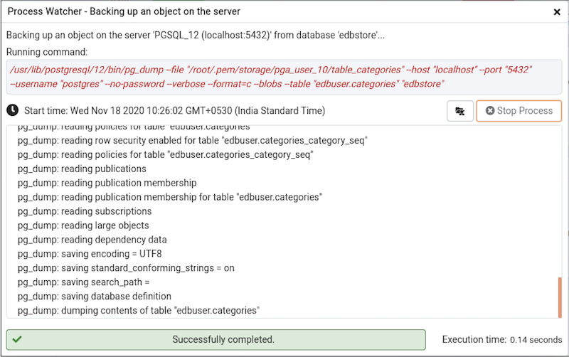

---
5.6&nbsp;&nbsp;&nbsp;&nbsp;&nbsp;&nbsp;&nbsp;&nbsp;&nbsp;&nbsp;Backup Dialog
---

<div id="backup_dialog" class="registered_link"></div>

`PEM` uses the *pg_dump* utility to provide an easy way to create a backup in a plain-text or archived format. You can then use a client application (like `psql` or the `Query Tool`) to restore a plain-text backup file, or use the Postgres `pg_restore` utility to restore an archived backup. The `pg_dump` utility must have read access to all database objects that you want to back up.

You can backup a single table, a schema, or a complete database. Select the name of the backup source in the `Browser` tree control, right click to open the context menu, and select `Backup...` to open the `Backup` dialog. The name of the object selected will appear in the dialog title bar.

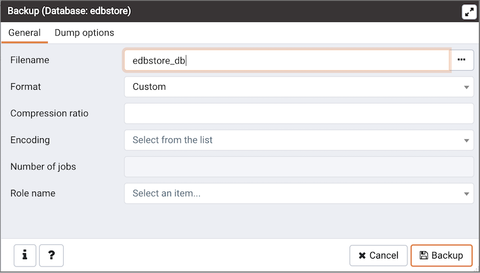

Use the fields in the `General` tab to specify parameters for the backup:

-   Enter the name of the backup file in the `Filename` field. Optionally, select the `Browser` icon (...) to the right to navigate into a directory and select a file that will contain the archive.

-   Use the drop-down listbox in the `Format` field to select the format that is best suited for your application. Each format has advantages and disadvantages:

    > -   Select `Custom` to create a custom archive file that you can use with `pg_restore` to create a copy of a database. Custom archive file formats must be restored with `pg_restore`. This format offers the opportunity to select which database objects to restore from the backup file. `Custom` archive format is recommended for medium to large databases as it is compressed by default.
    > -   Select `Tar` to generate a tar archive file that you can restore with `pg_restore`. The tar format does not support compression.
    > -   Select `Plain` to create a plain-text script file. A plain-text script file contains SQL statements and commands that you can execute at the `psql` command line to recreate the database objects and load the table data. A plain-text backup file can be edited in a text editor, if desired, before using the `psql` program to restore database objects. `Plain` format is normally recommended for smaller databases; script dumps are not recommended for blobs. The SQL commands within the script will reconstruct the database to the last saved state of the database. A plain-text script can be used to reconstruct the database on another machine, or (with modifications) on other architectures.
    > -   Select `Directory` to generate a directory-format archive suitable for use with `pg_restore`. This file format creates a directory with one file for each table and blob being dumped, plus a `Table of Contents` file describing the dumped objects in a machine-readable format that `pg_restore` can read. This format is compressed by default.

-   Use the `Compression Ratio` field to select a compression level for the backup. Specify a value of zero to mean use no compression; specify a maximum compression value of 9. Please note that tar archives do not support compression.

-   Use the `Encoding` drop-down listbox to select the character encoding method that should be used for the archive.

-   Use the `Number of Jobs` field (when applicable) to specify the number of tables that will be dumped simultaneously in a parallel backup.

-   Use the dropdown listbox next to `Rolename` to specify the role that owns the backup.

Click the `Dump options` tab to continue. Use the box fields in the `Dump options` tab to provide options for `pg_dump`.


-   Move switches in the **Sections** field box to select a portion of the object that will be backed up.

    > -   Move the switch next to `Pre-data` to the `Yes` position to include all data definition items not included in the data or post-data item lists.
    > -   Move the switch next to `Data` to the `Yes` position to backup actual table data, large-object contents, and sequence values.
    > -   Move the switch next to `Post-data` to the `Yes` position to include definitions of indexes, triggers, rules, and constraints other than validated check constraints.

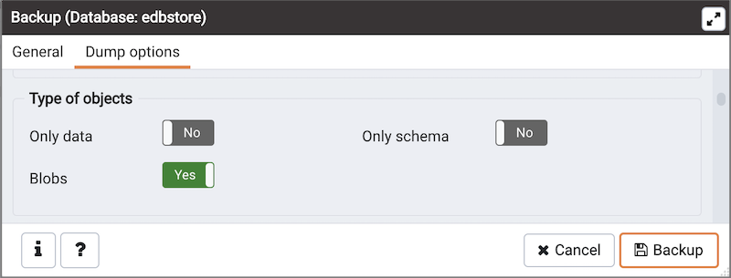

-   Move switches in the **Type of objects** field box to specify details about the type of objects that will be backed up.

    > -   Move the switch next to `Only data` to the `Yes` position to limit the back up to data.
    > -   Move the switch next to `Only schema` to limit the back up to schema-level database objects.
    > -   Move the switch next to `Blobs` to the `No` position to exclude large objects in the backup.

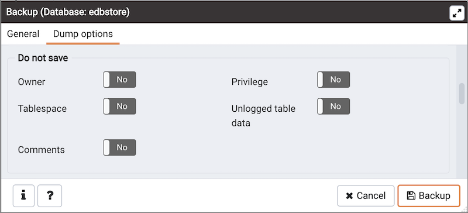

-   Move switches in the **Do not save** field box to select the objects that will not be included in the backup.

    > -   Move the switch next to `Owner` to the `Yes` position to exclude commands that set object ownership.
    > -   Move the switch next to `Privilege` to the `Yes` position to exclude commands that create access privileges.
    > -   Move the switch next to `Tablespace` to the `Yes` position to exclude tablespaces.
    > -   Move the switch next to `Unlogged table data` to the `Yes` position to exclude the contents of unlogged tables.
    > -   Move the switch next to `Comments` to the `Yes` position to exclude commands that set the comments. **Note:** This option is visible only for database server greater than or equal to 11.

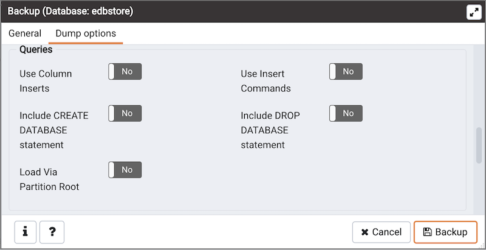

-   Move switches in the **Queries** field box to specify the type of statements that should be included in the backup.

    > -   Move the switch next to `Use Column Inserts` to the `Yes` position to dump the data in the form of INSERT statements and include explicit column names. Please note: this may make restoration from backup slow.
    > -   Move the switch next to `Use Insert commands` to the `Yes` position to dump the data in the form of INSERT statements rather than using a COPY command. Please note: this may make restoration from backup slow.
    > -   Move the switch next to `Include CREATE DATABASE statement` to the `Yes` position to include a command in the backup that creates a new database when restoring the backup.
    > -   Move the switch next to `Include DROP DATABASE statement` to the `Yes` position to include a command in the backup that will drop any existing database object with the same name before recreating the object during a backup.
    > -   Move the switch next to `Load Via Partition Root` to the `Yes` position, so when dumping a COPY or INSERT statement for a partitioned table, target the root of the partitioning hierarchy which contains it rather than the partition itself. **Note:** This option is visible only for database server greater than or equal to 11.

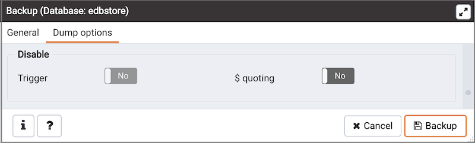

-   Move switches in the **Disable** field box to specify the type of statements that should be excluded from the backup.

    > -   Move the switch next to `Trigger` (active when creating a data-only backup) to the `Yes` position to include commands that will disable triggers on the target table while the data is being loaded.
    > -   Move the switch next to `$ quoting` to the `Yes` position to enable dollar quoting within function bodies; if disabled, the function body will be quoted using SQL standard string syntax.

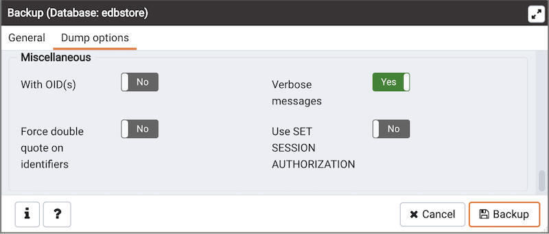

-   Move switches in the **Miscellaneous** field box to specify miscellaneous backup options.

    > -   Move the switch next to `With OIDs` to the `Yes` position to include object identifiers as part of the table data for each table.
    > -   Move the switch next to `Verbose messages` to the `No` position to instruct `pg_dump` to exclude verbose messages.
    > -   Move the switch next to `Force double quotes on identifiers` to the `Yes` position to force the quoting of all identifiers.
    > -   Move the switch next to `Use SET SESSION AUTHORIZATION` to the `Yes` position to include a statement that will use a SET SESSION AUTHORIZATION command to determine object ownership (instead of an ALTER OWNER command).

When you’ve specified the details that will be incorporated into the pg_dump command:

-   Click the `Backup` button to build and execute a command that builds a backup based on your selections on the `Backup` dialog.
-   Click the `Cancel` button to exit without saving work.

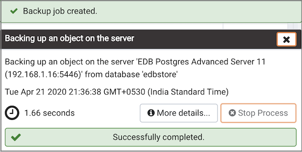

Use the **Stop Process** button to stop the Backup process.

If the backup is successful, a popup window will confirm success. Click *More details* on the popup window to launch the *Process Watcher*. The *Process Watcher* logs all the activity associated with the backup and provides additional information for troubleshooting.

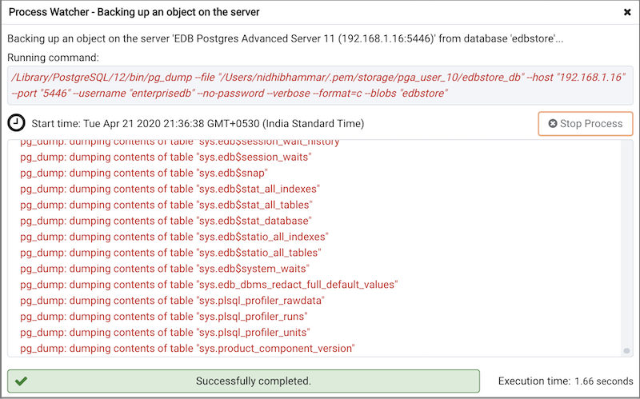

If the backup is unsuccessful, you can review the error messages returned by the backup command on the `Process Watcher`.

<div class="note">

<div class="title">

Note

</div>

You can click on the  icon in the process watcher window to open the file location in the Storage Manager. You can use the [Storage Manager](05_storage_manager/#storage_manager) to download the backup file on the client machine .

</div>

---
5.7&nbsp;&nbsp;&nbsp;&nbsp;&nbsp;&nbsp;&nbsp;&nbsp;&nbsp;&nbsp;Backup Globals Dialog
---

<div id="backup_globals_dialog" class="registered_link"></div>

Use the `Backup Globals` dialog to create a plain-text script that recreates all of the database objects within a cluster, and the global objects that are shared by those databases. Global objects include tablespaces, roles, and object properties. You can use the PEM `Query Tool` to play back a plain-text script, and recreate the objects in the backup.

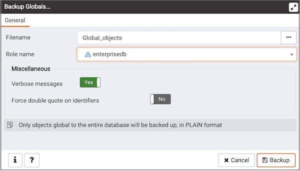

Use the fields in the `General` tab to specify the following:

-   Enter the name of the backup file in the `Filename` field. Optionally, select the `Browser` icon (ellipsis) to the right to navigate into a directory and select a file that will contain the archive.
-   Use the drop-down listbox next to `Role name` to specify a role with connection privileges on the selected server. The role will be used for authentication during the backup.

Move switches in the **Miscellaneous** field box to specify the type of statements that should be included in the backup.

-   Move the `Verbose messages` switch to the `No` position to exclude status messages from the backup. The default is `Yes`.
-   Move the `Force double quote on identifiers` switch to the `Yes` position to name identifiers without changing case. The default is `No`.

Click the `Backup` button to build and execute a command based on your selections; click the `Cancel` button to exit without saving work.


Use the **Stop Process** button to stop the Backup process.

If the backup is successful, a popup window will confirm success. Click `Click here for details` on the popup window to launch the `Process Watcher`. The `Process Watcher` logs all the activity associated with the backup and provides additional information for troubleshooting.

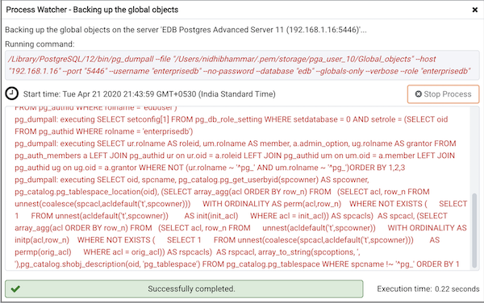

If the backup is unsuccessful, review the error message returned by the `Process Watcher` to resolve any issue.

<div class="note">

<div class="title">

Note

</div>

You can click on the  icon in the process watcher window to open the file location in the Storage Manager. You can use the [Storage Manager](05_storage_manager/#storage_manager) to download the backup file on the client machine .

</div>

---
5.8&nbsp;&nbsp;&nbsp;&nbsp;&nbsp;&nbsp;&nbsp;&nbsp;&nbsp;&nbsp;Backup Server Dialog
---

<div id="backup_server_dialog" class="registered_link"></div>

Use the `Backup Server` dialog to create a plain-text script that will recreate the selected server. You can use the PEM `Query Tool` to play back a plain-text script, and recreate the server.

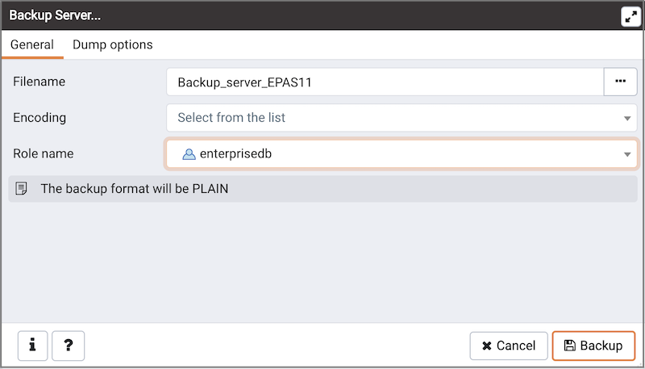

Use the fields in the `General` tab to specify the following:

-   Enter the name of the backup file in the `Filename` field. Optionally, select the `Browser` icon (ellipsis) to the right to navigate into a directory and select a file that will contain the archive.
-   Use the `Encoding` drop-down listbox to select the character encoding method that should be used for the archive. **Note:** This option is visible only for database server greater than or equal to 11.
-   Use the drop-down listbox next to `Role name` to specify a role with connection privileges on the selected server. The role will be used for authentication during the backup.

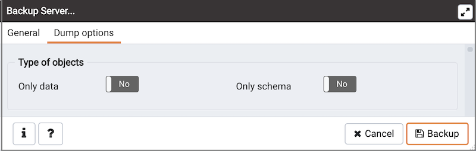

-   Move switches in the **Type of objects** field box to specify details about the type of objects that will be backed up.

    > -   Move the switch next to `Only data` to the `Yes` position to limit the back up to data.
    > -   Move the switch next to `Only schema` to limit the back up to schema-level database objects.

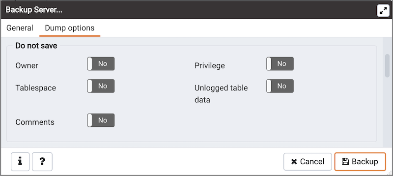

-   Move switches in the **Do not save** field box to select the objects that will not be included in the backup.

    > -   Move the switch next to `Owner` to the `Yes` position to exclude commands that set object ownership.
    > -   Move the switch next to `Privilege` to the `Yes` position to exclude commands that create access privileges.
    > -   Move the switch next to `Tablespace` to the `Yes` position to exclude tablespaces.
    > -   Move the switch next to `Unlogged table data` to the `Yes` position to exclude the contents of unlogged tables.
    > -   Move the switch next to `Comments` to the `Yes` position to exclude commands that set the comments. **Note:** This option is visible only for database server greater than or equal to 11.

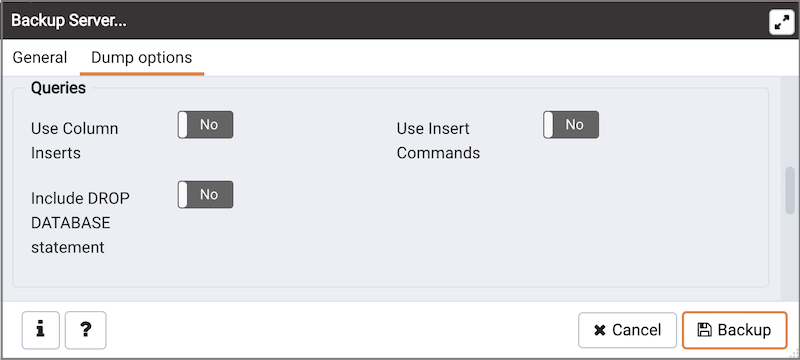

-   Move switches in the **Queries** field box to specify the type of statements that should be included in the backup.

    > -   Move the switch next to `Use Column Inserts` to the `Yes` position to dump the data in the form of INSERT statements and include explicit column names. Please note: this may make restoration from backup slow.
    > -   Move the switch next to `Use Insert commands` to the `Yes` position to dump the data in the form of INSERT statements rather than using a COPY command. Please note: this may make restoration from backup slow.
    > -   Move the switch next to `Include DROP DATABASE statement` to the `Yes` position to include a command in the backup that will drop any existing database object with the same name before recreating the object during a backup.

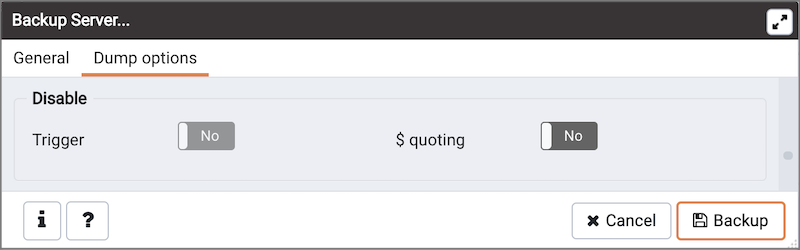

-   Move switches in the **Disable** field box to specify the type of statements that should be excluded from the backup.

    > -   Move the switch next to `Trigger` (active when creating a data-only backup) to the `Yes` position to include commands that will disable triggers on the target table while the data is being loaded.
    > -   Move the switch next to `$ quoting` to the `Yes` position to enable dollar quoting within function bodies; if disabled, the function body will be quoted using SQL standard string syntax.

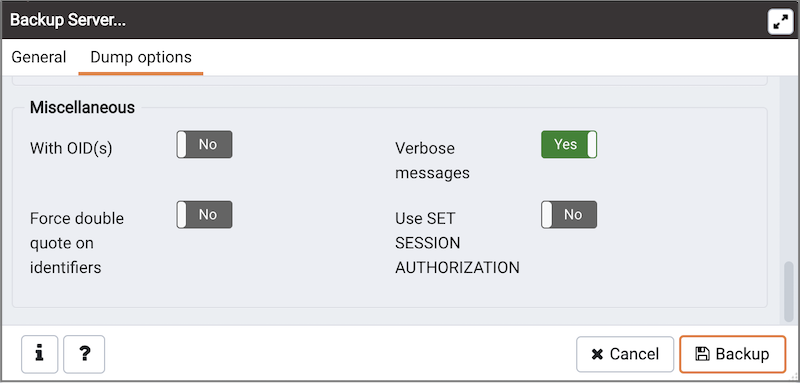

-   Move switches in the **Miscellaneous** field box to specify miscellaneous backup options.

    > -   Move the switch next to `With OIDs` to the `Yes` position to include object identifiers as part of the table data for each table.
    > -   Move the switch next to `Verbose messages` to the `No` position to instruct `pg_dump` to exclude verbose messages.
    > -   Move the switch next to `Force double quotes on identifiers` to the `Yes` position to force the quoting of all identifiers.
    > -   Move the switch next to `Use SET SESSION AUTHORIZATION` to the `Yes` position to include a statement that will use a SET SESSION AUTHORIZATION command to determine object ownership (instead of an ALTER OWNER command).

Click the `Backup` button to build and execute a command based on your selections; click the `Cancel` button to exit without saving work.

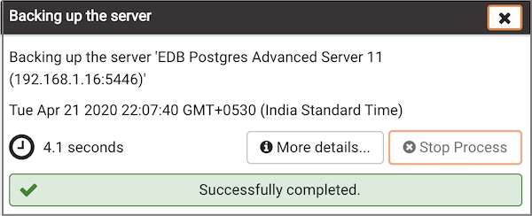

Use the **Stop Process** button to stop the Backup process.

If the backup is successful, a popup window will confirm success. Click `Click here for details` on the popup window to launch the `Process Watcher`. The `Process Watcher` logs all the activity associated with the backup and provides additional information for troubleshooting.

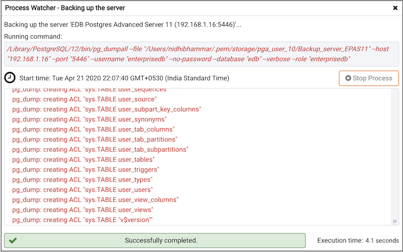

If the backup is unsuccessful, review the error message returned by the `Process Watcher` to resolve any issue.

<div class="note">

<div class="title">

Note

</div>

You can click on the  icon in the process watcher window to open the file location in the Storage Manager. You can use the [Storage Manager](05_storage_manager/#storage_manager) to download the backup file on the client machine .

</div>

---
5.9&nbsp;&nbsp;&nbsp;&nbsp;&nbsp;&nbsp;&nbsp;&nbsp;&nbsp;&nbsp;Restore Dialog
---

<div id="restore_dialog" class="registered_link"></div>

The `Restore` dialog provides an easy way to use a Custom, tar, or Directory format backup taken with the PEM `Backup` dialog to recreate a database or database object. The `Backup` dialog invokes options of the pg_dump client utility; the `Restore` dialog invokes options of the pg_restore client utility.

You can use the `Query Tool` to play back the script created during a plain-text backup made with the `Backup` dialog. For more information about backing up or restoring, please refer to the documentation for [pg_dump](https://www.postgresql.org/docs/current/static/app-pgdump.html) or [pg_restore](https://www.postgresql.org/docs/current/static/app-pgrestore.html).

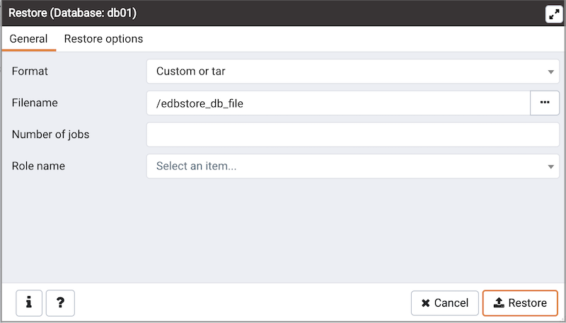

Use the fields on the `General` tab to specify general information about the restore process:

-   Use the drop-down listbox in the `Format` field to select the format of your backup file.

    > -   Select `Custom or tar` to restore from a custom archive file to create a copy of the backed-up object.
    > -   Select `Directory` to restore from a compressed directory-format archive.

-   Enter the complete path to the backup file in the `Filename` field. Optionally, select the `Browser` icon (ellipsis) to the right to navigate into a directory and select the file that contains the archive.

-   Use the `Number of Jobs` field to specify if pg_restore should use multiple (concurrent) jobs to process the restore. Each job uses a separate connection to the server.

-   Use the drop-down listbox next to `Rolename` to specify the role that will be used to authenticate with the server during the restore process.

Click the `Restore options` tab to continue. Use the fields on the `Restore options` tab to specify options that correspond to `pg_restore` options.

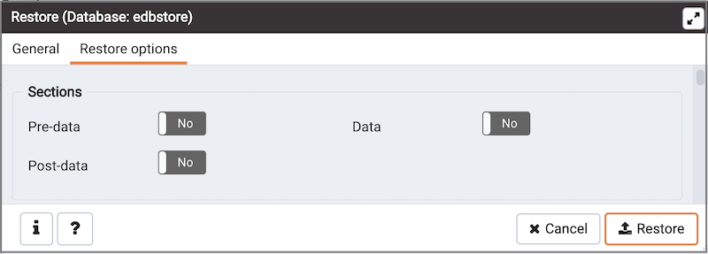

-   Use the switches in the **Sections** box to specify the content that will be restored:

    > -   Move the switch next to `Pre-data` to the `Yes` position to restore all data definition items not included in the data or post-data item lists.
    > -   Move the switch next to `Data` to the `Yes` position to restore actual table data, large-object contents, and sequence values.
    > -   Move the switch next to `Post-data` to the `Yes` position to restore definitions of indexes, triggers, rules, and constraints (other than validated check constraints).

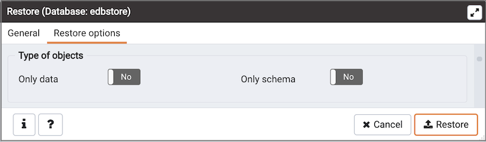

-   Use the switches in the **Type of objects** box to specify the objects that will be restored:

    > -   Move the switch next to `Only data` to the `Yes` position to limit the restoration to data.
    > -   Move the switch next to `Only schema` to limit the restoration to schema-level database objects.

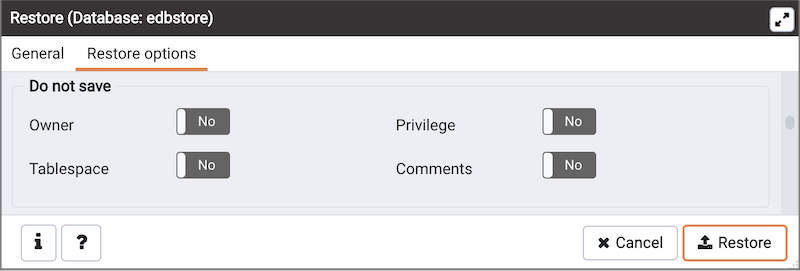

-   Use the switches in the **Do not save** box to specify which objects will not be restored:

    > -   Move the switch next to `Owner` to the `Yes` position to exclude commands that set object ownership.
    > -   Move the switch next to `Privilege` to the `Yes` position to exclude commands that create access privileges.
    > -   Move the switch next to `Tablespace` to the `Yes` position to exclude tablespaces.
    > -   Move the switch next to `Comments` to the `Yes` position to exclude commands that set the comments. **Note:** This option is visible only for database server greater than or equal to 11.

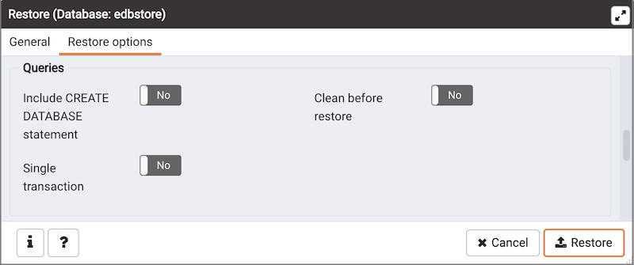

-   Use the switches in the **Queries** box to specify the type of statements that should be included in the restore:

    > -   Move the switch next to `Include CREATE DATABASE statement` to the `Yes` position to include a command that creates a new database before performing the restore.
    > -   Move the switch next to `Clean before restore` to the `Yes` position to drop each existing database object (and data) before restoring.
    > -   Move the switch next to `Single transaction` to the `Yes` position to execute the restore as a single transaction (that is, wrap the emitted commands in `BEGIN/COMMIT`). This ensures that either all the commands complete successfully, or no changes are applied. This option implies `--exit-on-error`.

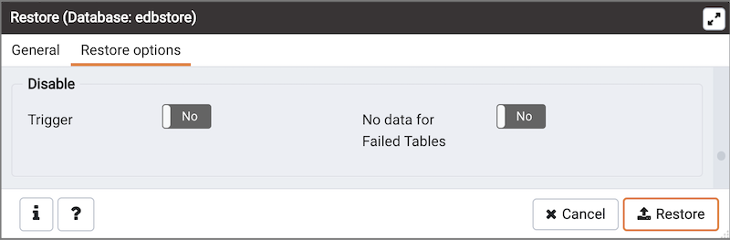

-   Use the switches in the **Disable** box to specify the type of statements that should be excluded from the restore:

    > -   Move the switch next to `Trigger` (active when creating a data-only restore) to the `Yes` position to include commands that will disable triggers on the target table while the data is being loaded.
    > -   Move the switch next to `No data for Failed Tables` to the `Yes` position to ignore data that fails a trigger.

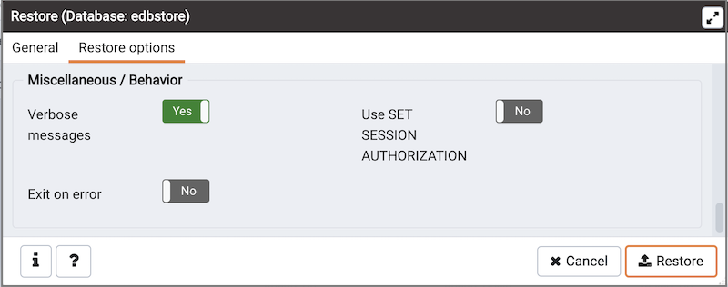

-   Use the switches in the **Miscellaneous/Behavior** box to specify miscellaneous restore options:

    > -   Move the switch next to `Verbose messages` to the `No` position to instruct `pg_restore` to exclude verbose messages.
    > -   Move the switch next to `Use SET SESSION AUTHORIZATION` to the `Yes` position to include a statement that will use a SET SESSION AUTHORIZATION command to determine object ownership (instead of an ALTER OWNER command).
    > -   Move the switch next to `Exit on error` to the `Yes` position to instruct `pg_restore` to exit restore if there is an error in sending SQL commands. The default is to continue and to display a count of errors at the end of the restore.

When you’ve specified the details that will be incorporated into the pg_restore command, click the `Restore` button to start the process, or click the `Cancel` button to exit without saving your work. A popup will confirm if the restore is successful.

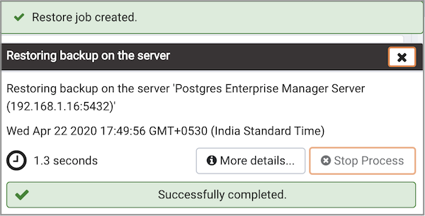

Use the **Stop Process** button to stop the Restore process.

Click `Click here for details` on the popup to launch the `Process Watcher`. The `Process Watcher` logs all the activity associated with the restore, and provides additional information for troubleshooting should the restore command encounter problems.

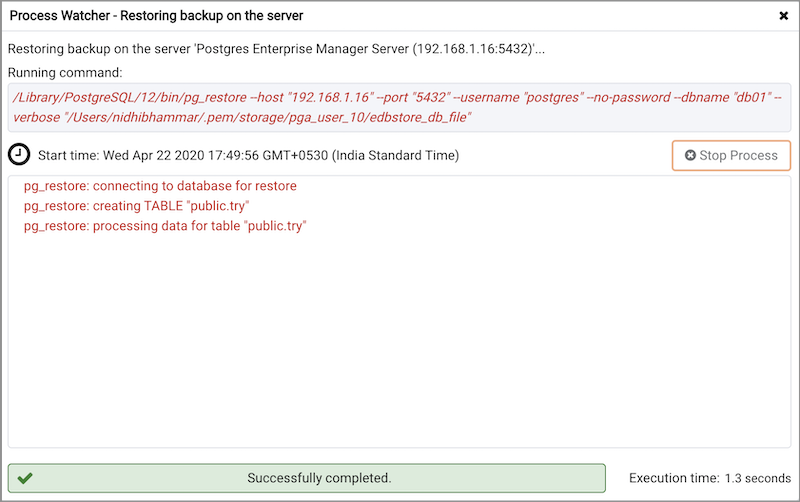

---
5.10&nbsp;&nbsp;&nbsp;&nbsp;&nbsp;&nbsp;&nbsp;&nbsp;&nbsp;&nbsp;Managing Cluster Level Objects
---

<div id="managing_cluster_objects" class="registered_link"></div>

Some object definitions reside at the cluster level; PEM provides dialogs that allow you to create these objects, manage them, and control their relationships to each other. To access a dialog that allows you to create a database object, right-click on the object type in the Browser tree control, and select the `Create` option for that object. For example, to create a new database, right-click on the `Databases` node, and select `Create Database...`

Contents:


---
5.10.1&nbsp;&nbsp;&nbsp;&nbsp;&nbsp;&nbsp;&nbsp;&nbsp;&nbsp;&nbsp;Database Dialog
---

<div id="database_dialog" class="registered_link"></div>

Use the `Database` dialog to define or modify a database. To create a database, you must be a database superuser or have the CREATE privilege.

The `Database` dialog organizes the development of a database through the following dialog tabs: `General`, `Definition`, `Security`, and `Parameters`. The `SQL` tab displays the SQL code generated by dialog selections.


Use the fields in the `General` tab to identify the database:

-   Use the `Database` field to add a descriptive name for the database. The name will be displayed in the `Browser` tree control.
-   Select the owner of the database from the drop-down listbox in the `Owner` field.
-   Store notes about the database in the `Comment` field.

Click the `Definition` tab to continue.


Use the `Definition` tab to set properties for the database:

-   Select a character set from the drop-down listbox in the `Encoding` field. The default is `UTF8`.
-   Select a template from the drop-down listbox in the `Template` field. If you do not specify a template, the database will use template1.
-   Select a tablespace from the drop-down listbox in the `Tablespace` field. The selected tablespace will be the default tablespace used to contain database objects.
-   Select the collation order from the drop-down listbox in the `Collation` field.
-   Select the character classification from the drop-down listbox in the `Character Type` field. This affects the categorization of characters, e.g. lower, upper and digit. The default, or a blank field, uses the character classification of the template database.
-   Specify a connection limit in the `Connection Limit` field to configure the maximum number of connection requests. The default value (`-1`) allows unlimited connections to the database.

Click the `Security` tab to continue.


Use the `Security` tab to assign privileges and define security labels.

Use the `Privileges` panel to assign privileges to a role. Click the `Add` icon (+) to set privileges for database objects:

-   Select the name of the role from the drop-down listbox in the `Grantee` field.
-   Click inside the `Privileges` field. Check the boxes to the left of one or more privileges to grant the selected privilege to the specified user.
-   The current user, who is the default grantor for granting the privilege, is displayed in the `Grantor` field.

Click add to set additional privileges; to discard a privilege, click the trash icon to the left of the row and confirm deletion in the `Delete Row` popup.

Use the `Security Labels` panel to define security labels applied to the database. Click the `Add` icon (+) to add each security label selection:

-   Specify a security label provider in the `Provider` field. The named provider must be loaded and must consent to the proposed labeling operation.
-   Specify a a security label in the `Security Label` field. The meaning of a given label is at the discretion of the label provider. PostgreSQL places no restrictions on whether or how a label provider must interpret security labels; it merely provides a mechanism for storing them.

To discard a security label, click the trash icon to the left of the row and confirm deletion in the `Delete Row` popup.

Click the `Parameters` tab to continue.


Use the `Parameters` tab to set parameters for the database. Click the `Add` icon (+) to add each parameter:

-   Use the drop-down listbox in the `Name` field to select a parameter.
-   Use the `Value` field to set a value for the parameter.
-   Use the drop-down listbox next to `Role` to select a role to which the parameter setting specified will apply.

Follow these steps to add additional parameter value definitions; to discard a parameter, click the trash icon to the left of the row and confirm deletion in the `Delete Row` popup.

Click the `Advanced` tab to continue.


Use the `Advanced` tab to set advanced parameters for the database.

-   Use `Schema restriction` field to provide a SQL restriction that will be used against the pg_namespace table to limit the schemas that you see. For example, you might enter: `public` so that only `public` are shown in the pgAdmin browser.Separate entries with a comma or tab as you type.

Click the `SQL` tab to continue.

Your entries in the `Database` dialog generate a SQL command (see an example below). Use the `SQL` tab for review; revisit or switch tabs to make any changes to the SQL command.

**Example**

The following is an example of the sql command generated by user selections in the `Database` dialog:


The example creates a database named `hr` that is owned by `postgres`. It allows unlimited connections, and is available to all authenticated users.

-   Click the `Info` button (i) to access online help. View context-sensitive help in the `Tabbed browser`, where a new tab displays the PostgreSQL core documentation.
-   Click the `Save` button to save work.
-   Click the `Cancel` button to exit without saving work.
-   Click the `Reset` button to restore configuration parameters.

---
5.10.2&nbsp;&nbsp;&nbsp;&nbsp;&nbsp;&nbsp;&nbsp;&nbsp;&nbsp;&nbsp;Move Objects Dialog
---

<div id="move_objects" class="registered_link"></div>

Use the `Move Objects` dialog to to move database objects from one tablespace to another tablespace.

The `Move Objects` dialog organizes the movement of database objects with the `General` tab; the `SQL` tab displays the SQL code generated by dialog selections.


Use the fields in the `General` tab to identify the items that will be moved and the tablespace to which they will be moved:

-   Use the `New tablespace` drop-down listbox to select a pre-existing tablespace to which the object will be moved. (To create a tablespace, use the `Tablespace` dialog; access the dialog by right clicking `Tablespaces` in the `Browser` tree control and selecting `Create Tablespace...` from the context-menu.)

-   Use the `Object type` drop-down listbox to select from the following:

    > -   Select `All` to move all tables, indexes, and materialized views from the current tablespace (currently selected in the `Browser` tree control) to the new tablespace.
    > -   Select `Tables` to move tables from the current tablespace to the new tablespace.
    > -   Select `Indexes` to move indexes from the current tablespace to the new tablespace.
    > -   Select `Materialized views` to move materialized views from the current tablespace to the new tablespace.

-   Use the `Object owner` drop-down listbox to select the role that owns the objects selected in the `Object type` field. This field is optional.

Click the `SQL` tab to continue.

Your entries in the `Move Objects` dialog generate a SQL command (see an example below). Use the `SQL` tab for review; revisit the `General` tab to modify the SQL command.

**Example**

The following is an example of the sql command generated by user selections in the `Move Objects` dialog:


The example shown demonstrates moving materialized views owned by Alice from tablespace `tbspace_01` to `tbspace_02`.

-   Click the `Help` button (?) to access online help.
-   Click the `OK` button to save work.
-   Click the `Cancel` button to exit without saving work.

---
5.10.3&nbsp;&nbsp;&nbsp;&nbsp;&nbsp;&nbsp;&nbsp;&nbsp;&nbsp;&nbsp;Resource Group Dialog
---

<div id="resource_group_dialog" class="registered_link"></div>

Use the `Resource Group` dialog to create a resource group and set values for its resources. A resource group is a named, global group on which various resource usage limits can be defined. The resource group is accessible from all databases in the cluster. To use the `Resource Group` dialog, you must have superuser privileges. Please note that resource groups are supported when connected to EDB Postgres Advanced Server; for more information about using resource groups, please see the EDB Postgres Advanced Server Guide, available at:

> <http://www.enterprisedb.com/>

Fields used to create a resource group are located on the `General` tab. The `SQL` tab displays the SQL code generated by your selections on the `Resource Group` dialog.


Use the fields on the `General` tab to specify resource group attributes:

-   Use the `Name` field to add a descriptive name for the resource group. This name will be displayed in the tree control.
-   Use the `CPU rate limit (%)` field to set the value of the CPU rate limit resource type assigned to the resource group. The valid range for a CPU rate limit is from 0 to 1.67772e+07. The default value is 0.
-   Use the `Dirty rate limit (KB)` field to set the value of the dirty rate limit resource type assigned to the resource group. The valid range for a dirty rate limit is from 0 to 1.67772e+07. The default value is 0.

Click the `SQL` tab to continue.

Your entries in the `Resource Group` dialog generate a SQL command. Use the `SQL` tab for review; revisit the `General` tab to make any changes to the SQL command.

**Example**

The following is an example of the sql command generated by selections made in the `Resource Group` dialog:


The example creates a resource group named `acctg` that sets `cpu_rate_limit` to `2`, and `dirty_rate_limit` to `6144`.

-   Click the Info button (`i`) to access online SQL syntax reference material.
-   Click the Help button (`?`) to access online documentation about Resource Groups.
-   Click the `Save` button to save work.
-   Click the `Cancel` button to exit without saving work.
-   Click the `Reset` button to restore configuration parameters.

---
5.10.4&nbsp;&nbsp;&nbsp;&nbsp;&nbsp;&nbsp;&nbsp;&nbsp;&nbsp;&nbsp;Login/Group Role Dialog
---

<div id="role_dialog" class="registered_link"></div>

Use the `Login/Group Role` dialog to define a role. A role may be an individual user (with or without login privileges) or a group of users. Note that roles defined at the cluster level are shared by all databases in the cluster.

The `Login/Group Role` dialog organizes the creation and management of roles through the following dialog tabs: `General`, *Definition*, `Privileges`, *Parameters*, and `Security`. The `SQL` tab displays the SQL code generated by dialog selections.


Use the fields on the `General` tab to identify the role.

-   Use the `Name` field to provide the name of the role. The name will be displayed in the tree control.
-   Provide a note about the role in the `Comments` field.

Click the `Definition` tab to continue.


Use the `Definition` tab to set a password and configure connection rules:

-   Provide a password that will be associated with the role in the `Password` field.
-   Provide an expiration date for the password in the `Account Expires` field (the role does not expire). The expiration date is not enforced when a user logs in with a non-password-based authentication method.
-   If the role is a login role, specify how many concurrent connections the role can make in the `Connection Limit` field. The default value (`-1`) allows unlimited connections.

Click the `Privileges` tab to continue.


Use the `Privileges` tab to grant privileges to the role.

-   Move the `Can login?` switch to the `Yes` position if the role has login privileges. The default value is `No`.
-   Move the `Superuser` switch to the `Yes` position if the role is a superuser within the database. The default value is `No`.
-   Move the `Create roles?` switch to the `Yes` position to specify whether a role is permitted to create roles. A role with this privilege can alter and drop roles. The default value is `No`.
-   Move the `Create databases` switch to the `Yes` position to control whether a role can create databases. The default value is `No`.
-   The `Update catalog?` switch is disabled until the role is given superuser privileges. Move the `Update catalogs?` switch to the `No` position to control whether a role can update catalogs. The default value is `Yes` when the `Superuser` switch is in the `Yes` position.
-   Move the `Inherit rights from the parent roles?` switch to the `No` position if a role does not inherit privileges. The default value is `Yes`.
-   Move the `Can initiate streaming replication and backups?` switch to the `Yes` position to control whether a role can initiate streaming replication or put the system in and out of backup mode. The default value is `No`.


-   Specify members of the role in the `Role Membership` field. Click inside the `Roles` field to select role names from a drop down list. Confirm each selection by checking the checkbox to the right of the role name; delete a selection by clicking the `x` to the left of the role name. Membership conveys the privileges granted to the specified role to each of its members.

Click the `Parameters` tab to continue.


Use the fields on the `Parameters` tab to set session defaults for a selected configuration parameter when the role is connected to a specified database. This tab invokes the ALTER ROLE... SET configuration_parameter syntax. Click the `Add` icon (+) to assign a value for a parameter.

-   Use the drop-down listbox in the `Name` field to select a parameter.
-   Use the `Value` field to specify a value for the parameter.
-   Use the drop-down listbox in the `Database` field to select a database.

Click the `Add` icon (+) to specify each additional parameter; to discard a parameter, click the trash icon to the left of the row and confirm the deletion in the `Delete Row` popup.

Click the `Security` tab to continue.


Use the `Security` tab to define security labels applied to the role. Click the `Add` icon (+) to add each security label selection.

-   Specify a security label provider in the `Provider` field. The named provider must be loaded and must consent to the proposed labeling operation.
-   Specify a a security label in the `Security Label` field. The meaning of a given label is at the discretion of the label provider. PostgreSQL places no restrictions on whether or how a label provider must interpret security labels; it merely provides a mechanism for storing them.

To discard a security label, click the trash icon to the left of the row and confirm the deletion in the `Delete Row` popup.

Click the `SQL` tab to continue.

Your entries in the `Login/Group Role` dialog generate a SQL command (see an example below). Use the `SQL` tab for review; revisit or switch tabs to make any changes to the SQL command.

**Example**

The following is an example of the sql command generated by user selections in the `Login/Group Role` dialog:


The example creates a login role named `alice` with `pem_user` privileges; the role can make unlimited connections to the server at any given time.

-   Click the Info button (`i`) to access online SQL help.
-   Click the Help button (`?`) to access the documentation for the dialog.
-   Click the `Save` button to save work.
-   Click the `Cancel` button to exit without saving work.
-   Click the `Reset` button to restore configuration parameters.

---
5.10.5&nbsp;&nbsp;&nbsp;&nbsp;&nbsp;&nbsp;&nbsp;&nbsp;&nbsp;&nbsp;Tablespace Dialog
---

<div id="tablespace_dialog" class="registered_link"></div>

Use The `Tablespace` dialog to define a tablespace. A tablespace allows superusers to define an alternative location on the file system where the data files containing database objects (such as tables and indexes) reside. Tablespaces are only supported on systems that support symbolic links. Note that a tablespace cannot be used independently of the cluster in which it is defined.

The `Tablespace` dialog organizes the definition of a tablespace through the following tabs: `General`, *Definition*, `Parameters`, and `Security`. The *SQL* tab displays the SQL code generated by dialog selections.


-   Use the `Name` field to identify the tablespace with a descriptive name. The name cannot begin with pg\_; these names are reserved for system tablespaces.
-   Select the owner of the tablespace from the drop-down listbox in the *Owner* field.
-   Store notes about the tablespace in the `Comment` field.

Click the `Definition` tab to continue.


-   Use the `Location` field to specify an absolute path to a directory that will contain the tablespace.

Click the `Parameters` tab to continue.


Use the `Parameters` tab to set parameters for the tablespace. Click the *Add* icon (+) to add a row to the table below.

-   Use the drop-down listbox next to `Name` to select a parameter.
-   Use the `Value` field to set a value for the parameter.

Click the `Add` icon (+) to specify each additional parameter; to discard a parameter, click the trash icon to the left of the row and confirm deletion in the `Delete Row` dialog.

Click the `Security` tab to continue.


Use the `Security` tab to assign privileges and define security labels for the tablespace.

Use the `Privileges` panel to assign security privileges. Click the `Add` icon (+) to assign a set of privileges:

-   Select the name of the role from the drop-down listbox in the `Grantee` field.
-   The current user, who is the default grantor for granting the privilege, is displayed in the `Grantor` field.
-   Click inside the `Privileges` field. Check the boxes to the left of one or more privileges to grant the selected privileges to the specified user.

Click the `Add` icon to assign additional sets of privileges; to discard a privilege, click the trash icon to the left of the row and confirm deletion in the `Delete Row` popup.

Use the `Security Labels` panel to define security labels applied to the tablespace. Click the `Add` icon (+) to add each security label selection:

-   Specify a security label provider in the `Provider` field. The named provider must be loaded and must consent to the proposed labeling operation.
-   Specify a a security label in the `Security Label` field. The meaning of a given label is at the discretion of the label provider. PostgreSQL places no restrictions on whether or how a label provider must interpret security labels; it merely provides a mechanism for storing them.

To discard a security label, click the trash icon to the left of the row and confirm deletion in the `Delete Row` popup.

Click the `SQL` tab to continue.

Your entries in the `Tablespace` dialog generate a SQL command (see an example below). Use the `SQL` tab for review; revisit or switch tabs to make any changes to the SQL command.

### Example

The following is an example of the sql command generated by user selections in the `Tablespace` dialog:


The example shown demonstrates creating a tablespace named `space_01`. It has a *random_page_cost* value equal to `1`.

-   Click the `Info` button (i) to access online help.
-   Click the `Save` button to save work.
-   Click the `Cancel` button to exit without saving work.
-   Click the `Reset` button to restore configuration parameters.

---
5.11&nbsp;&nbsp;&nbsp;&nbsp;&nbsp;&nbsp;&nbsp;&nbsp;&nbsp;&nbsp;Managing Database Objects
---

<div id="managing_database_objects" class="registered_link"></div>

PEM provides simple but powerful dialogs that you can use to design and create database objects. Each dialog contains a series of tabs that you use to describe the object that will be created by the dialog; the SQL tab displays the SQL command that the server will execute when creating the object.

To access a dialog that allows you to create a database object, right-click on the object type in the Browser tree control, and select the `Create` option for that object. For example, to create a new cast, right-click on the `Casts` node, and select <span class="title-ref">Create Cast...</span>

Contents:


---
5.11.1&nbsp;&nbsp;&nbsp;&nbsp;&nbsp;&nbsp;&nbsp;&nbsp;&nbsp;&nbsp;Cast Dialog
---

<div id="cast_dialog" class="registered_link"></div>

Use the `Cast` dialog to define a cast. A cast specifies how to convert a value from one data type to another.

The `Cast` dialog organizes the development of a cast through the following dialog tabs: `General` and `Definition`. The `SQL` tab displays the SQL code generated by dialog selections.


Use the fields in the `General` tab to identify the cast:

-   The `Name` field is disabled. The name that will be displayed in the `Browser` tree control is the `Source` type concatenated with the `Target` type, and is generated automatically when you make selections on the `Cast` dialog `Definition` tab.
-   Store notes about the cast in the `Comment` field.

Click the `Definition` tab to continue.


Use the fields in the `Definition` tab to define parameters:

-   Use the drop-down listbox next to `Source type` to select the name of the source data type of the cast.
-   Use the drop-down listbox next to `Target type` to select the name of the target data type of the cast.
-   Use the drop-down listbox next to `Function` to select the function used to perform the cast. The function's result data type must match the target type of the cast.
-   Move the `Context` switch to the `Implicit` position if the cast is implicit. By default, a cast can be invoked only by an explicit cast request. If the cast is marked `Implicit` then it can be invoked implicitly in any context, whether by assignment or internally in an expression.

Click the `SQL` tab to continue.

Your entries in the `Cast` dialog generate a SQL command (see an example below). Use the `SQL` tab for review; revisit or switch tabs to make any changes to the SQL command.

**Example**

The following is an example of the sql command generated by user selections in the `Cast` dialog:


The cast uses a function named `int4(bigint)` to convert a biginteger data type to an integer.

-   Click the `Info` button (i) to access online help. View context-sensitive help in the `Tabbed browser`, where a new tab displays the PostgreSQL core documentation.
-   Click the `Save` button to save work.
-   Click the `Cancel` button to exit without saving work.
-   Click the `Reset` button to restore configuration parameters.

---
5.11.2&nbsp;&nbsp;&nbsp;&nbsp;&nbsp;&nbsp;&nbsp;&nbsp;&nbsp;&nbsp;Collation Dialog
---

<div id="collation_dialog" class="registered_link"></div>

Use the `Collation` dialog to define a collation. A collation is an SQL schema object that maps a SQL name to operating system locales. To create a collation, you must have a CREATE privilege on the destination schema.

The `Collation` dialog organizes the development of a collation through the following dialog tabs: `General` and `Definition`. The `SQL` tab displays the SQL code generated by dialog selections.


Use the fields in the `General` tab to identify the collation:

-   Use the `Name` field to provide a name for the collation. The collation name must be unique within a schema. The name will be displayed in the <span class="title-ref">Browser</span> tree control.
-   Select the name of the owner from the drop-down listbox in the `Owner` field.
-   Select the name of the schema in which the collation will reside from the drop-down listbox in the `Schema` field.
-   Store notes about the collation in the `Comment` field.

Click the `Definition` tab to continue.


Use the fields in the `Definition` tab to specify the operating system locale settings:

-   Use the drop-down listbox next to `Copy collation` to select the name of an existing collation to copy. The new collation will have the same properties as the existing one, but will be an independent object. If you choose to copy an existing collation, you cannot modify the collation properties displayed on this tab.
-   Use the `Locale` field to specify a locale; a locale specifies language and language formatting characteristics. If you specify this, you cannot specify either of the following parameters. To view a list of locales supported by your Linux system use the command `locale -a`.
-   Use the `LC_COLLATE` field to specify a locale with specified string sort order. The locale must be applicable to the current database encoding. (See CREATE DATABASE for details.)
-   Use the `LC_CTYPE` field to specify a locale with specified character classification. The locale must be applicable to the current database encoding. (See CREATE DATABASE for details.)

Click the `SQL` tab to continue.

Your entries in the `Collation` dialog generate a SQL command (see an example b elow). Use the `SQL` tab for review; revisit or switch tabs to make any changes to the SQL command.

### Example

The following is an example of the sql command generated by user selections in the `Collation` dialog:


The example shown demonstrates creating a collation named `french` that uses the rules specified for the locale, `fr-BI-x-icu`. The collation is owned by `postgres`.

-   Click the `Info` button (i) to access online help. For more information about setting a locale, see Chapter 22.1 Locale Support of the PostgreSQL core documentation:

    > <http://www.postgresql.org/docs/current/static/locale.html>

-   Click the `Save` button to save work.

-   Click the `Cancel` button to exit without saving work.

-   Click the `Reset` button to restore configuration parameters.

---
5.11.3&nbsp;&nbsp;&nbsp;&nbsp;&nbsp;&nbsp;&nbsp;&nbsp;&nbsp;&nbsp;Domain Dialog
---

<div id="domain_dialog" class="registered_link"></div>

Use the `Domain` dialog to define a domain. A domain is a data type definition that may constrain permissible values. Domains are useful when you are creating multiple tables that contain comparable columns; you can create a domain that defines constraints that are common to the columns and re-use the domain definition when creating the columns, rather than individually defining each set of constraints.

The `Domain` dialog organizes the development of a domain through the following tabs: `General`, `Definition`, `Constraints`, and `Security`. The `SQL` tab displays the SQL code generated by dialog selections.


Use the fields on the `General` tab to identify a domain:

-   Use the `Name` field to add a descriptive name for the domain. The name will be displayed in the `Browser` tree control.
-   Use the drop-down listbox next to `Owner` to select a role that will own the domain.
-   Select the name of the schema in which the domain will reside from the drop-down listbox in the `Schema` field.
-   Store notes about the domain in the `Comment` field.

Click the `Definition` tab to continue.


Use the fields in the `Definition` tab to describe the domain:

-   Use the drop-down listbox next to `Base type` to specify a data type.
-   Use the context-sensitive `Length` field to specify a numeric length for a numeric type.
-   Use the context-sensitive `Precision` field to specify the total count of significant digits for a numeric type.
-   Specify a default value for the domain data type in the `Default` field. The data type of the default expression must match the data type of the domain. If no default value is specified, then the default value is the null value.
-   Move the `Not Null` switch to specify the values of this domain are prevented from being null.
-   Use the drop-down listbox next to `Collation` to apply a collation cast. If no collation is specified, the underlying data type's default collation is used. The underlying type must be collatable if COLLATE is specified.

Click the `Constraints` tab to continue.


Use the fields in the `Constraints` tab to specify rules for the domain. Click the `Add` icon (+) to set constraints:

-   Use the `Name` field to specify a name for the constraint.
-   Use the `Check` field to provide an expression for the constraint.
-   Use the `Validate` checkbox to determine whether the constraint will be validated. The default checkbox is checked and sets a validation requirement.

A CHECK clause specifies an integrity test which values of the domain must satisfy. Each constraint must be an expression that produces a Boolean result. Use the key word VALUE to refer to the value being tested. Expressions evaluating to TRUE or UNKNOWN succeed. If the expression produces a FALSE result, an error is reported and the value is not allowed to be converted to the domain type. A CHECK expression cannot contain subqueries nor refer to variables other than VALUE. If a domain has multiple CHECK constraints, they will be tested in alphabetical order by name.

Click the `Add` icon (+) to set additional constraints; to discard a constraint, click the trash icon to the left of the row and confirm deletion in the `Delete Row` popup.

Click the `Security` tab to continue.


Use the `Security Labels` panel to assign security labels. Click the `Add` icon (+) to add a label:

-   Specify a security label provider in the `Provider` field. The named provider must be loaded and must consent to the proposed labeling operation.
-   Specify a a security label in the `Security Label` field. The meaning of a given label is at the discretion of the label provider. PostgreSQL places no restrictions on whether or how a label provider must interpret security labels; it merely provides a mechanism for storing them.

Click the `Add` icon (+) to specify each additional label; to discard a label, click the trash icon to the left of the row and confirm deletion in the `Delete Row` popup.

Click the `SQL` tab to continue.

Your entries in the `Domain` dialog generate a SQL command (see an example below). Use the `SQL` tab for review; revisit or switch tabs to make any changes to the SQL command.

**Example**

The following is an example of the sql command generated by selections made in the `Domain` dialog:


The example shown demonstrates creating a domain named `minimum-wage` that confirms that the value entered is greater than or equal to `7.25`.

-   Click the `Info` button (i) to access online help. View context-sensitive help in the `Tabbed browser`, where a new tab displays the PostgreSQL core documentation.
-   Click the `Save` button to save work.
-   Click the `Cancel` button to exit without saving work.
-   Click the `Reset` button to restore configuration parameters.

---
5.11.4&nbsp;&nbsp;&nbsp;&nbsp;&nbsp;&nbsp;&nbsp;&nbsp;&nbsp;&nbsp;Domain Constraints Dialog
---

<div id="domain_constraint_dialog" class="registered_link"></div>

Use the `Domain Constraints` dialog to create or modify a domain constraint. A domain constraint confirms that the values provided for a domain meet a defined criteria. The `Domain Constraints` dialog implements options of the ALTER DOMAIN command.

The `Domain Constraints` dialog organizes the development of a domain constraint through the following dialog tabs: `General` and `Definition`. The `SQL` tab displays the SQL code generated by dialog selections.


Use the fields in the `General` tab to identify the domain constraint:

-   Use the `Name` field to add a descriptive name for the constraint. The name will be displayed in the `Browser` tree control.
-   Store notes about the constraint in the `Comment` field.

Click the `Definition` tab to continue.


Use the fields in the `Definition` tab to define the domain constraint:

-   Use the `Check` field to provide a CHECK expression. A CHECK expression specifies a constraint that the domain must satisfy. A constraint must produce a Boolean result; include the key word VALUE to refer to the value being tested. Only those expressions that evaluate to TRUE or UNKNOWN will succeed. A CHECK expression cannot contain subqueries or refer to variables other than VALUE. If a domain has multiple CHECK constraints, they will be tested in alphabetical order.
-   Move the `Validate?` switch to the `No` position to mark the constraint NOT VALID. If the constraint is marked NOT VALID, the constraint will not be applied to existing column data. The default value is `Yes`.

Click the `SQL` tab to continue.

Your entries in the `Domain Constraints` dialog generate a SQL command (see an example below). Use the `SQL` tab for review; revisit or switch tabs to make any changes to the SQL command.

**Example**

The following is an example of the sql command generated by user selections in the `Domain Constraints` dialog:


The example shown demonstrates creating a domain constraint on the domain `timesheets` named `weekday`. It constrains a value to equal `Friday`.

-   Click the `Info` button (i) to access online help. View context-sensitive help in the `Tabbed browser`, where a new tab displays the PostgreSQL core documentation.
-   Click the `Save` button to save work.
-   Click the `Cancel` button to exit without saving work.
-   Click the `Reset` button to restore configuration parameters.

---
5.11.5&nbsp;&nbsp;&nbsp;&nbsp;&nbsp;&nbsp;&nbsp;&nbsp;&nbsp;&nbsp;Event Trigger Dialog
---

<div id="event_trigger_dialog" class="registered_link"></div>

Use the `Domain Trigger` dialog to define an event trigger. Unlike regular triggers, which are attached to a single table and capture only DML events, event triggers are global to a particular database and are capable of capturing DDL events. Like regular triggers, event triggers can be written in any procedural language that includes event trigger support, or in C, but not in SQL.

The `Domain Trigger` dialog organizes the development of a event trigger through the following dialog tabs: `General`, `Definition`, and `Security Labels`. The `SQL` tab displays the SQL code generated by dialog selections.


Use the fields in the `General` tab to identify the event trigger:

-   Use the `Name` field to add a descriptive name for the event trigger. The name will be displayed in the `Browser` tree control.
-   Use the drop-down listbox next to `Owner` to specify the owner of the event trigger.
-   Store notes about the event trigger in the `Comment` field.

Click the `Definition` tab to continue.


Use the fields in the `Definition` tab to define the event trigger:

-   Select a value from the drop down of `Trigger Enabled` field to specify a status Select a value from the drop down of `Trigger Enabled` field to specify a status
-   Use the drop-down listbox next to `Trigger function` to specify an existing function. A trigger function takes an empty argument list, and returns a value of type event_trigger.
-   Select a value from the drop down of `Events` field to specify when the event trigger will fire: `DDL COMMAND START`, `DDL COMMAND END`, or `SQL DROP`.
-   Use the `When TAG in` field to enter filter values for TAG for which the trigger will be executed. The values must be in single quotes separated by comma.

Click the `Security Labels` tab to continue.


Use the `Security` tab to define security labels applied to the trigger. Click the `Add` icon (+) to add each security label.

-   Specify a security label provider in the `Provider` field. The named provider must be loaded and must consent to the proposed labeling operation.
-   Specify a security label in the `Security Label` field. The meaning of a given label is at the discretion of the label provider. PostgreSQL places no restrictions on whether or how a label provider must interpret security labels; it merely provides a mechanism for storing them.

Click the `Add` icon (+) to assign additional security labels; to discard a security label, click the trash icon to the left of the row and confirm deletion in the `Delete Row` popup.

Click the `SQL` tab to continue.

Your entries in the `Domain Trigger` dialog generate a generate a SQL command. Use the `SQL` tab for review; revisit or switch tabs to make any changes to the SQL command.

**Example**

The following is an example of the sql command generated by user selections in the `Domain Trigger` dialog:


The command creates an event trigger named `accounts` that invokes the procedure named `acct_due`.

-   Click the `Info` button (i) to access online help. View context-sensitive help in the `Tabbed browser`, where a new tab displays the PostgreSQL core documentation.
-   Click the `Save` button to save work.
-   Click the `Cancel` button to exit without saving work.
-   Click the `Reset` button to restore configuration parameters.

---
5.11.6&nbsp;&nbsp;&nbsp;&nbsp;&nbsp;&nbsp;&nbsp;&nbsp;&nbsp;&nbsp;Extension Dialog
---

<div id="extension_dialog" class="registered_link"></div>

Use the `Extension` dialog to install a new extension into the current database. An extension is a collection of SQL objects that add targeted functionality to your Postgres installation. The `Extension` dialog adds the functionality of an extension to the current database only; you must register the extension in each database that use the extension. Before you load an extension into a database, you should confirm that any pre-requisite files are installed.

The `Extension` dialog allows you to implement options of the CREATE EXTENSION command through the following dialog tabs: `General` and `Definition`. The `SQL` tab displays the SQL code generated by dialog selections.


Use the fields in the `General` tab to identify an extension:

-   Use the drop-down listbox in the `Name` field to select the extension. Each extension must have a unique name.
-   Store notes about the extension in the `Comment` field.

Click the `Definition` tab to continue.


Use the `Definition` tab to select the `Schema` and `Version`:

-   Use the drop-down listbox next to `Schema` to select the name of the schema in which to install the extension's objects.
-   Use the drop-down listbox next to `Version` to select the version of the extension to install.

Click the `SQL` tab to continue.

Your entries in the `Extension` dialog generate a SQL command (see an example below). Use the `SQL` tab for review; revisit or switch tabs to make any changes to the SQL command.

**Example**

The following is an example of the sql command generated by user selections in the `Extension` dialog:


The command creates the `chkpass` extension in the `public` schema. It is version `1.0` of `chkpass`.

-   Click the `Info` button (i) to access online help. View context-sensitive help in the `Tabbed browser`, where a new tab displays the PostgreSQL core documentation.
-   Click the `Save` button to save work.
-   Click the `Cancel` button to exit without saving work.
-   Click the `Reset` button to restore configuration parameters.

---
5.11.7&nbsp;&nbsp;&nbsp;&nbsp;&nbsp;&nbsp;&nbsp;&nbsp;&nbsp;&nbsp;Foreign Data Wrapper Dialog
---

<div id="foreign_data_wrapper_dialog" class="registered_link"></div>

Use the `Foreign Data Wrapper` dialog to create or modify a foreign data wrapper. A foreign data wrapper is an adapter between a Postgres database and data stored on another data source.

You must be a superuser to create a foreign data wrapper.

The `Foreign Data Wrapper` dialog organizes the development of a foreign data wrapper through the following dialog tabs: `General`, `Definition`, `Options`, and `Security`. The `SQL` tab displays the SQL code generated by dialog selections.


Use the fields in the `General` tab to identify the foreign data wrapper:

-   Use the `Name` field to add a descriptive name for the foreign data wrapper. A foreign data wrapper name must be unique within the database. The name will be displayed in the `Browser` tree control.
-   Use the drop-down listbox next to `Owner` to select the name of the role that will own the foreign data wrapper.
-   Store notes about the foreign data wrapper in the `Comment` field.

Click the `Definition` tab to continue.


Use the fields in the `Definition` tab to set parameters:

-   Select the name of the handler function from the drop-down listbox in the `Handler` field. This is the name of an existing function that will be called to retrieve the execution functions for foreign tables.
-   Select the name of the validator function from the drop-down listbox in the `Validator` field. This is the name of an existing function that will be called to check the generic options given to the foreign data wrapper, as well as options for foreign servers, user mappings and foreign tables using the foreign data wrapper.

Click the `Options` tab to continue.


Use the fields in the `Options` tab to specify options:

-   Click the the `Add` icon (+) button to add an option/value pair for the foreign data wrapper. Supported option/value pairs will be specific to the selected foreign data wrapper.
-   Specify the option name in the `Option` field and provide a corresponding value in the `Value` field.

Click the `Add` icon (+) to specify each additional pair; to discard an option, click the trash icon to the left of the row and confirm deletion in the `Delete Row` popup.

Click the `Security` tab to continue.


Use the `Security` tab to assign security privileges. Click the `Add` icon (+) to assign a set of privileges.

-   Select the name of the role from the drop-down listbox in the `Grantee` field.
-   Click inside the `Privileges` field. Check the boxes to the left of one or more privileges to grant the selected privileges to the specified user.
-   The current user, who is the default grantor for granting the privilege, is displayed in the `Grantor` field.

Click add to assign additional privileges; to discard a privilege, click the trash icon to the left of the row and confirm deletion in the `Delete Row` popup.

Click the `SQL` tab to continue.

Your entries in the `Foreign Data Wrapper` dialog generate a SQL command (see an example below). Use the `SQL` tab for review; revisit or switch tabs to make any changes to the SQL command.

**Example**

The following is an example of the sql command generated by user selections in the `Foreign Data Wrapper` dialog:


The example creates a foreign data wrapper named `libpq_debug` that uses pre-existing validator and handler functions, `dblink_fdw_validator` and `libpg_fdw_handler`. Selections on the `Options` tab set `debug` equal to `true`. The foreign data wrapper is owned by `postgres`.

-   Click the `Help` button (?) to access online help. View context-sensitive help in the `Tabbed browser`, where a new tab displays the PostgreSQL core documentation.
-   Click the `Save` button to save work.
-   Click the `Cancel` button to exit without saving work.
-   Click the `Reset` button to restore configuration parameters.

---
5.11.8&nbsp;&nbsp;&nbsp;&nbsp;&nbsp;&nbsp;&nbsp;&nbsp;&nbsp;&nbsp;Foreign Server Dialog
---

<div id="foreign_server_dialog" class="registered_link"></div>

Use the `Foreign Server` dialog to create a foreign server. A foreign server typically encapsulates connection information that a foreign-data wrapper uses to access an external data resource. Each foreign data wrapper may connect to a different foreign server; in the `Browser` tree control, expand the node of the applicable foreign data wrapper to launch the `Foreign Server` dialog.

The `Foreign Server` dialog organizes the development of a foreign server through the following dialog tabs: `General`, `Definition`, `Options`, and `Security`. The `SQL` tab displays the SQL code generated by dialog selections.


Use the fields in the `General` tab to identify the foreign server:

-   Use the `Name` field to add a descriptive name for the foreign server. The name will be displayed in the `Browser` tree control. It must be unique within the database.
-   Use the drop-down listbox next to `Owner` to select a role.
-   Store notes about the foreign server in the `Comment` field.

Click the `Definition` tab to continue.


Use the fields in the `Definition` tab to set parameters:

-   Use the `Type` field to specify a server type.
-   Use the `Version` field to specify a server version.

Click the `Options` tab to continue.


Use the fields in the `Options` tab to specify options. Click the `Add` button to create an option clause for the foreign server.

-   Specify the option name in the `Option` field.
-   Provide a corresponding value in the `Value` field.

Click `Add` to create each additional clause; to discard an option, click the trash icon to the left of the row and confirm deletion in the `Delete Row` popup.

Click the `Security` tab to continue.


Use the `Security` tab to assign security privileges to the foreign server. Click `Add` before you assign a set of privileges.

-   Select the name of the role from the drop-down listbox in the `Grantee` field.
-   Click inside the `Privileges` field. Check the boxes to the left of one or more privileges to grant the selected privileges to the specified user.
-   The current user, who is the default grantor for granting the privilege, is displayed in the `Grantor` field.

Click `Add` to assign a new set of privileges; to discard a privilege, click the trash icon to the left of the row and confirm deletion in the `Delete Row` dialog.

Click the `SQL` tab to continue.

Your entries in the `Foreign Server` dialog generate a SQL command (see an example below). Use the `SQL` tab for review; revisit or switch tabs to make any changes to the SQL command.

**Example**

The following is an example of the sql command generated by user selections in the `Foreign Server` dialog:


The example shown demonstrates creating a foreign server for the foreign data wrapper `hdfs_fdw`. It has the name `hdfs_server`; its type is `hiveserver2`. Options for the foreign server include a host and a port.

-   Click the `Info` button (i) to access online help. View context-sensitive help in the `Tabbed browser`, where a new tab displays the PostgreSQL core documentation.
-   Click the `Save` button to save work.
-   Click the `Cancel` button to exit without saving work.
-   Click the `Reset` button to restore configuration parameters.

---
5.11.9&nbsp;&nbsp;&nbsp;&nbsp;&nbsp;&nbsp;&nbsp;&nbsp;&nbsp;&nbsp;Foreign Table Dialog
---

<div id="foreign_table_dialog" class="registered_link"></div>

Use the `Foreign Table` dialog to define a foreign table in the current database. Foreign tables define the structure of an external data source that resides on a foreign server.

The `Foreign Table` dialog organizes the development of a foreign table through the following dialog tabs: `General`, `Definition`, `Columns`, `Constraints`, `Options`, and `Security`. The `SQL` tab displays the SQL code generated by dialog selections.


Use the fields in the `General` tab to identify the foreign table:

-   Use the `Name` field to add a descriptive name for the foreign table. The name of the foreign table must be distinct from the name of any other foreign table, table, sequence, index, view, existing data type, or materialized view in the same schema. The name will be displayed in the `Browser` tree control.
-   Use the drop-down listbox next to `Owner` to select the name of the role that will own the foreign table.
-   Select the name of the schema in which the foreign table will reside from the drop-down listbox in the `Schema` field.
-   Store notes about the foreign table in the `Comment` field.

Click the `Definition` tab to continue.


Use the fields in the `Definition` tab to define the external data source:

-   Use the drop-down listbox next to `Foreign server` to select a foreign server. This list is populated with servers defined through the `Foreign Server` dialog.
-   Use the drop-down listbox next to `Inherits` to specify a parent table. The foreign table will inherit all of its columns. This field is optional.

Click the `Columns` tab to continue.


Use the fields in the `Columns` tab to add columns and their attributes to the table. Click the `Add` icon (+) to define a column:

-   Use the `Name` field to add a descriptive name for the column.
-   Use the drop-down listbox in the `Data Type` field to select a data type for the column. This can include array specifiers. For more information on which data types are supported by PostgreSQL, refer to Chapter 8 of the core documentation.

Click the `Add` icon (+) to specify each additional column; to discard a column, click the trash icon to the left of the row and confirm deletion in the `Delete Row` popup.

Click the `Constraints` tab to continue.


Use the fields in the `Constraints` tab to apply a table constraint to the foreign table. Click the `Add` icon (+) to define a constraint:

-   Use the `Name` field to add a descriptive name for the constraint. If the constraint is violated, the constraint name is present in error messages, so constraint names like `col must be positive` can be used to communicate helpful information.
-   Use the `Check` field to write a check expression producing a Boolean result. Each row in the foreign table is expected to satisfy the check expression.
-   Check the `No Inherit` checkbox to specify that the constraint will not propagate to child tables.
-   Uncheck the `Validate` checkbox to disable validation. The database will not assume that the constraint holds for all rows in the table.

Click the `Add` icon (+) to specify each additional constraint; to discard a constraint, click the trash icon to the left of the row and confirm deletion in the `Delete Row` popup.

Click the `Options` tab to continue.


Use the fields in the `Options` tab to specify options to be associated with the new foreign table or one of its columns; the accepted option names and values are specific to the foreign data wrapper associated with the foreign server. Click the `Add` icon (+) to add an option/value pair.

-   Specify the option name in the `Option` field. Duplicate option names are not allowed.
-   Provide a corresponding value in the `Value` field.

Click the `Add` icon (+) to specify each additional option/value pair; to discard an option, click the trash icon to the left of the row and confirm deletion in the `Delete Row` popup.

Click the `Security` tab to continue.


Use the `Security` tab to assign privileges and define security labels.

Use the `Privileges` panel to assign privileges to a role. Click the `Add` icon (+) to set privileges for database objects:

-   Select the name of the role to which privileges will be assigned from the drop-down listbox in the `Grantee` field.
-   Click inside the `Privileges` field. Check the boxes to the left of one or more privileges to grant the selected privilege to the specified user.
-   The current user, who is the default grantor for granting the privilege, is displayed in the `Grantor` field.

Click the `Add` icon (+) to assign additional privileges; to discard a privilege, click the trash icon to the left of the row and confirm deletion in the `Delete Row` popup.

Use the `Security Labels` panel to define security labels applied to the function. Click the `Add` icon (+) to add each security label selection:

-   Specify a security label provider in the `Provider` field. The named provider must be loaded and must consent to the proposed labeling operation.
-   Specify a a security label in the `Security Label` field. The meaning of a given label is at the discretion of the label provider. PostgreSQL places no restrictions on whether or how a label provider must interpret security labels; it merely provides a mechanism for storing them.

Click the `Add` icon (+) to assign additional security labels; to discard a security label, click the trash icon to the left of the row and confirm deletion in the `Delete Row` popup.

Click the `SQL` tab to continue.

Your entries in the `Foreign Table` dialog generate a SQL command (see an example below). Use the `SQL` tab for review; revisit or switch tabs to make any changes to the SQL command.

**Example**

The following is an example of the sql command generated by user selections in the `Foreign Table` dialog:


The example shown demonstrates creating a foreign table `weblogs` with multiple columns and two options.

-   Click the `Info` button (i) to access online help. View context-sensitive help in the `Tabbed browser`, where a new tab displays the PostgreSQL core documentation.
-   Click the `Save` button to save work.
-   Click the `Cancel` button to exit without saving work.
-   Click the `Reset` button to restore configuration parameters.

---
5.11.10&nbsp;&nbsp;&nbsp;&nbsp;&nbsp;&nbsp;&nbsp;&nbsp;&nbsp;&nbsp;FTS Configuration dialog
---

<div id="fts_configuration_dialog" class="registered_link"></div>

Use the `FTS Configuration` dialog to configure a full text search. A text search configuration specifies a text search parser that can divide a string into tokens, along with dictionaries that can identify searchable tokens.

The `FTS Configuration` dialog organizes the development of a FTS configuration through the following dialog tabs: "`General`, `Definition`, and `Tokens`. The `SQL` tab displays the SQL code generated by dialog selections.

Click the `General` tab to begin.


Use the fields in the `General` tab to identify a FTS configuration:

-   Use the `Name` field to add a descriptive name for the FTS configuration. The name will be displayed in the `Browser` tree control.
-   Use the drop-down listbox next to `Owner` to specify the role that will own the configuration.
-   Select the name of the schema in which the FTS configuration will reside from the drop-down listbox in the `Schema` field.
-   Store notes about the FTS configuration in the `Comment` field.

Click the `Definition` tab to continue.


Use the fields in the `Definition` tab to define parameters:

-   Select the name of the text search parser from the drop-down listbox in the `Parser` field.
-   Select a language from the drop-down listbox in the `Copy Config` field.

Click the `Tokens` tab to continue.


Use the fields in the `Tokens` tab to add a token:

-   Use the `Tokens` field to specify the name of a token.
-   Click the `Add` icon (+) to create a token.
-   Use the `Dictionaries` field to specify a dictionary.

Repeat these steps to add additional tokens; to discard a token, click the trash icon to the left of the row and confirm deletion in the `Delete Row` popup.

Click the `SQL` tab to continue.

Your entries in the `FTS Configuration` dialog generate a SQL command (see an example below). Use the `SQL` tab for review; revisit or switch tabs to make any changes to the SQL command.

**Example**

The following is an example of the sql command generated by user selections in the `FTS Configuration` dialog:


The example shown demonstrates creating a FTS configuration named `meme_phrases`. It uses the `default` parser.

-   Click the `Info` button (i) to access online help. View context-sensitive help in the `Tabbed browser`, where a new tab displays the PostgreSQL core documentation.
-   Click the `Save` button to save work.
-   Click the `Cancel` button to exit without saving work.
-   Click the `Reset` button to restore configuration parameters.

---
5.11.11&nbsp;&nbsp;&nbsp;&nbsp;&nbsp;&nbsp;&nbsp;&nbsp;&nbsp;&nbsp;FTS Dictionary Dialog
---

<div id="fts_dictionary_dialog" class="registered_link"></div>

Use the `FTS Dictionary` dialog to create a full text search dictionary. You can use a predefined templates or create a new dictionary with custom parameters.

The `FTS Dictionary` dialog organizes the development of a FTS dictionary through the following dialog tabs: `General`, `Definition`, and `Options`. The `SQL` tab displays the SQL code generated by dialog selections.


Use the fields in the `General` tab to identify the dictionary:

-   Use the `Name` field to add a descriptive name for the dictionary. The name will be displayed in the `Browser` tree control.
-   Use the drop-down listbox next to `Owner` to select the role that will own the FTS Dictionary.
-   Select the name of the schema in which the dictionary will reside from the drop-down listbox in the `Schema` field.
-   Store notes about the dictionary in the `Comment` field.

Click the `Definition` tab to continue.


Use the field in the `Definition` tab to choose a template from the drop-down listbox:

-   Select `ispell` to select the Ispell template. The Ispell dictionary template supports morphological dictionaries, which can normalize many different linguistic forms of a word into the same lexeme. For example, an English Ispell dictionary can match all declensions and conjugations of the search term bank, e.g., banking, banked, banks, banks', and bank's. Ispell dictionaries usually recognize a limited set of words, so they should be followed by another broader dictionary; for example, a Snowball dictionary, which recognizes everything.
-   Select `simple` to select the simple template. The simple dictionary template operates by converting the input token to lower case and checking it against a file of stop words. If it is found in the file then an empty array is returned, causing the token to be discarded. If not, the lower-cased form of the word is returned as the normalized lexeme. Alternatively, the dictionary can be configured to report non-stop-words as unrecognized, allowing them to be passed on to the next dictionary in the list.
-   Select `snowball` to select the Snowball template. The Snowball dictionary template is based on a project by Martin Porter, inventor of the popular Porter's stemming algorithm for the English language. Snowball now provides stemming algorithms for many languages (see the Snowball site for more information). Each algorithm understands how to reduce common variant forms of words to a base, or stem, spelling within its language. A Snowball dictionary recognizes everything, whether or not it is able to simplify the word, so it should be placed at the end of the dictionary list. It is useless to have it before any other dictionary because a token will never pass through it to the next dictionary.
-   Select `synonym` to select the synonym template. This dictionary template is used to create dictionaries that replace a word with a synonym. Phrases are not supported (use the thesaurus template (Section 12.6.4) for that). A synonym dictionary can be used to overcome linguistic problems, for example, to prevent an English stemmer dictionary from reducing the word Paris to pari.
-   Select `thesaurus` to select the thesaurus template. A thesaurus dictionary replaces all non-preferred terms by one preferred term and, optionally, preserves the original terms for indexing as well. PostgreSQL's current implementation of the thesaurus dictionary is an extension of the synonym dictionary with added phrase support.

Click the `Options` tab to continue.


Use the fields in the `Options` tab to provide template-specific options. Click the `Add` icon (+) to add an option clause:

-   Specify the name of an option in the `Option` field
-   Provide a value for the option in the `Value` field.

Click the `Add` icon (+) to specify each additional option/value pair; to discard an option, click the trash icon to the left of the row and confirm deletion in the `Delete Row` popup.

Click the `SQL` tab to continue.

Your entries in the `FTS Dictionary` dialog generate a generate a SQL command. Use the `SQL` tab for review; revisit or switch tabs to make any changes to the SQL command.

**Example**

The following is an example of the sql command generated by user selections in the `FTS Dictionary` dialog:


The example shown demonstrates creating a custom dictionary named `more_stopwords` which is based on the simple template and is configured to use standard English.

-   Click the `Info` button (i) to access online help. View context-sensitive help in the `Tabbed browser`, where a new tab displays the PostgreSQL core documentation.
-   Click the `Save` button to save work.
-   Click the `Cancel` button to exit without saving work.
-   Click the `Reset` button to restore configuration parameters.

---
5.11.12&nbsp;&nbsp;&nbsp;&nbsp;&nbsp;&nbsp;&nbsp;&nbsp;&nbsp;&nbsp;FTS Parser Dialog
---

<div id="fts_parser_dialog" class="registered_link"></div>

Use the `FTS Parser` dialog to create a new text search parser. A text search parser defines a method for splitting a text string into tokens and assigning types (categories) to the tokens.

The `FTS Parser` dialog organizes the development of a text search parser through the following dialog tabs: `General`, and `Definition`. The `SQL` tab displays the SQL code generated by dialog selections.


Use the fields in the `General` tab to identify a text search parser:

-   Use the `Name` field to add a descriptive name for the parser. The name will be displayed in the `Browser` tree control.
-   Select the name of the schema in which the parser will reside from the drop-down listbox in the `Schema` field.
-   Store notes about the domain in the `Comment` field.

Click the `Definition` tab to continue.


Use the fields in the `Definition` tab to define parameters:

-   Use the drop-down listbox next to `Start function` to select the name of the function that will initialize the parser.
-   Use the drop-down listbox next to `Get next token function` to select the name of the function that will return the next token.
-   Use the drop-down listbox next to `End function` to select the name of the function that is called when the parser is finished.
-   Use the drop-down listbox next to `Lextypes function` to select the name of the lextypes function for the parser. The lextypes function returns an array that contains the id, alias, and a description of the tokens used by the parser.
-   Use the drop-down listbox next to `Headline function` to select the name of the headline function for the parser. The headline function returns an excerpt from the document in which the terms of the query are highlighted.

Click the `SQL` tab to continue.


Your entries in the `FTS Parser` dialog generate a generate a SQL command. Use the `SQL` tab for review; revisit or switch tabs to make any changes to the SQL command.

-   Click the `Info` button (i) to access online help. View context-sensitive help in the `Tabbed browser`, where a new tab displays the PostgreSQL core documentation.
-   Click the `Save` button to save work.
-   Click the `Cancel` button to exit without saving work.
-   Click the `Reset` button to restore configuration parameters.

---
5.11.13&nbsp;&nbsp;&nbsp;&nbsp;&nbsp;&nbsp;&nbsp;&nbsp;&nbsp;&nbsp;FTS Template Dialog
---

<div id="fts_template_dialog" class="registered_link"></div>

Use the `FTS Template` dialog to create a new text search template. A text search template defines the functions that implement text search dictionaries.

The `FTS Template` dialog organizes the development of a text search Template through the following dialog tabs: `General`, and `Definition`. The `SQL` tab displays the SQL code generated by dialog selections.


Use the fields in the `General` tab to identify a template:

-   Use the `Name` field to add a descriptive name for the template. The name will be displayed in the `Browser` tree control.
-   Select the name of the schema in which the template will reside from the drop-down listbox in the `Schema` field.
-   Store notes about the template in the `Comment` field.

Click the `Definition` tab to continue.


Use the fields in the `Definition` tab to define function parameters:

-   Use the drop-down listbox next to `Init function` to select the name of the init function for the template. The init function is optional.
-   Use the drop-down listbox next to `Lexize function` to select the name of the lexize function for the template. The lexize function is required.

Click the `SQL` tab to continue.

Your entries in the `FTS Template` dialog generate a SQL command (see an example below). Use the `SQL` tab for review; revisit or switch tabs to make any changes to the SQL command.

**Example**

The following is an example of the sql command generated by user selections in the `FTS Template` dialog:


The example shown demonstrates creating a fts template named `ru_template` that uses the ispell dictionary.

-   Click the `Info` button (i) to access online help. View context-sensitive help in the `Tabbed browser`, where a new tab displays the PostgreSQL core documentation.
-   Click the `Save` button to save work.
-   Click the `Cancel` button to exit without saving work.
-   Click the `Reset` button to restore configuration parameters.

---
5.11.14&nbsp;&nbsp;&nbsp;&nbsp;&nbsp;&nbsp;&nbsp;&nbsp;&nbsp;&nbsp;Function Dialog
---

<div id="function_dialog" class="registered_link"></div>

Use the `Function` dialog to define a function. If you drop and then recreate a function, the new function is not the same entity as the old; you must drop existing rules, views, triggers, etc. that refer to the old function.

The `Function` dialog organizes the development of a function through the following dialog tabs: `General`, `Definition`, `Code`, `Options`, `Parameters`, and `Security`. The `SQL` tab displays the SQL code generated by dialog selections.


Use the fields in the `General` tab to identify a function:

-   Use the `Name` field to add a descriptive name for the function. The name will be displayed in the `Browser` tree control.
-   Use the drop-down listbox next to `Owner` to select the name of the role that will own the function.
-   Use the drop-down listbox next to `Schema` to select the schema in which the function will be created.
-   Store notes about the function in the `Comment` field.

Click the `Definition` tab to continue.


Use the fields in the `Definition` tab to define the function:

-   Use the drop-down listbox next to `Return type` to select the data type returned by the function, if any.
-   Use the drop-down listbox next to `Language` to select the implementation language. The default is `sql`.
-   Use the fields in the `Arguments` to define an argument. Click the <span class="title-ref">Add</span> icon (+) to set parameters and values for the argument:
    -   Use the drop-down listbox in the `Data type` field to select a data type.
    -   Use the drop-down listbox in the `Mode` field to select a mode. Select <span class="title-ref">IN</span> for an input parameter; select `OUT` for an output parameter; select <span class="title-ref">INOUT</span> for both an input and an output parameter; or, select `VARIADIC` to specify a VARIADIC parameter.
    -   Provide a name for the argument in the `Argument Name` field.
    -   Specify a default value for the argument in the `Default Value` field.

Click the `Add` icon (+) to define another argument; to discard an argument, click the trash icon to the left of the row and confirm deletion in the *Delete Row* popup.

Click the `Code` tab to continue.


-   Use the `Code` field to write the code that will execute when the function is called.

Click the `Options` tab to continue.


Use the fields in the `Options` tab to describe or modify the action of the function:

-   Use the drop-down listbox next to `Volatility` to select one of the following. `VOLATILE` is the default value.

    > -   `VOLATILE` indicates that the function value can change even within a single table scan, so no optimizations can be made.
    > -   `STABLE` indicates that the function cannot modify the database, and that within a single table scan it will consistently return the same result for the same argument values.
    > -   `IMMUTABLE` indicates that the function cannot modify the database and always returns the same result when given the same argument values.

-   Move the `Returns a Set?` switch to indicate if the function returns a set that includes multiple rows. The default is `No`.

-   Move the `Strict?` switch to indicate if the function always returns NULL whenever any of its arguments are NULL. If `Yes`, the function is not executed when there are NULL arguments; instead a NULL result is assumed automatically. The default is `No`.

-   Move the `Security of definer?` switch to specify that the function is to be executed with the privileges of the user that created it. The default is `No`.

-   Move the `Window?` switch to indicate that the function is a window function rather than a plain function. The default is `No`. This is currently only useful for functions written in C. The WINDOW attribute cannot be changed when replacing an existing function definition. For more information about the CREATE FUNCTION command, see the PostgreSQL core documentation available at:

    > <http://www.postgresql.org/docs/current/static/functions-window.html>

-   Use the `Estimated cost` field to specify a positive number representing the estimated execution cost for the function, in units of cpu_operator_cost. If the function returns a set, this is the cost per returned row.

-   Use the `Estimated rows` field to specify a positive number giving the estimated number of rows that the query planner should expect the function to return. This is only allowed when the function is declared to return a set. The default assumption is 1000 rows.

-   Move the `Leak proof?` switch to indicate whether the function has side effects. The default is `No`. This option can only be set by the superuser.

-   Use the `Support function` field to specify a planner support function to use for the function.

Click the `Parameters` tab to continue.


Use the fields in the `Parameters` tab to specify settings that will be applied when the function is invoked. Click the `Add` icon (+) to add a `Name`/`Value` field in the table.

-   Use the drop-down listbox in the `Name` column in the `Parameters` panel to select a parameter.
-   Use the `Value` field to specify the value that will be associated with the selected variable. This field is context-sensitive.

Click the `Security` tab to continue.


Use the `Security` tab to assign privileges and define security labels.

Use the `Privileges` panel to assign usage privileges for the function to a role.

-   Select the name of the role from the drop-down listbox in the `Grantee` field.
-   Click inside the `Privileges` field. Check the boxes to the left of one or more privileges to grant the selected privilege to the specified user.
-   The current user, who is the default grantor for granting the privilege, is displayed in the `Grantor` field.

Click the `Add` icon (+) to assign additional privileges; to discard a privilege, click the trash icon to the left of the row and confirm deletion in the `Delete Row` popup.

Use the `Security Labels` panel to define security labels applied to the function. Click the `Add` icon (+) to add each security label selection:

-   Specify a security label provider in the `Provider` field. The named provider must be loaded and must consent to the proposed labeling operation.
-   Specify a a security label in the `Security Label` field. The meaning of a given label is at the discretion of the label provider. PostgreSQL places no restrictions on whether or how a label provider must interpret security labels; it merely provides a mechanism for storing them.

Click the `Add` icon (+) to assign additional security labels; to discard a security label, click the trash icon to the left of the row and confirm deletion in the `Delete Row` popup.

Click the `SQL` tab to continue.

Your entries in the `Function` dialog generate a generate a SQL command (see an example below). Use the `SQL` tab for review; revisit or switch tabs to make any changes to the SQL command.

**Example**

The following is an example of the sql command generated by selections made in the `Function` dialog:


The example demonstrates creating an `edbspl` function named `emp_comp`. The function adds two columns (p_sal and p_comm), and then uses the result to compute a yearly salary, returning a NUMERIC value.

-   Click the `Info` button (i) to access online help.View context-sensitive help in the `Tabbed browser`, where a new tab displays the PostgreSQL core documentation.
-   Click the `Save` button to save work.
-   Click the `Cancel` button to exit without saving work.
-   Click the `Reset` button to restore configuration parameters.

---
5.11.15&nbsp;&nbsp;&nbsp;&nbsp;&nbsp;&nbsp;&nbsp;&nbsp;&nbsp;&nbsp;Language Dialog
---

<div id="language" class="registered_link"></div>

Use the CREATE LANGUAGE dialog to register a new procedural language.

The `Language` dialog organizes the registration of a procedural language through the following dialog tabs: `General`, `Definition`, and `Security`. The `SQL` tab displays the SQL code generated by dialog selections.


Use the fields in the `General` tab to identify a language:

-   Use the drop-down listbox next to `Name` to select a language script.
-   Use the drop-down listbox next to `Owner` to select a role.
-   Store notes about the language in the `Comment` field.

Click the `Definition` tab to continue.


Use the fields in the `Definition` tab to define parameters:

-   Move the `Trusted?` switch to the `No` position to specify only users with PostgreSQL superuser privilege can use this language. The default is `Yes`.
-   When enabled, use the drop-down listbox next to `Handler Function` to select the function that will be called to execute the language's functions.
-   When enabled, use the drop-down listbox next to `Inline Function` to select the function that will be called to execute an anonymous code block (DO command) in this language.
-   When enabled, use the drop-down listbox next to `Validator Function` to select the function that will be called when a new function in the language is created, to validate the new function.

Click the `Security` tab to continue.


Use the `Security` tab to assign privileges and define security labels.

Use the `Privileges` panel to assign privileges to a role. Click the `Add` icon (+) to set privileges for database objects:

-   Select the name of the role from the drop-down listbox in the `Grantee` field.
-   Click inside the `Privileges` field. Check the boxes to the left of one or more privileges to grant the selected privilege to the specified user.
-   The current user, who is the default grantor for granting the privilege, is displayed in the `Grantor` field.

Click the `Add` icon (+) to assign additional privileges; to discard a privilege, click the trash icon to the left of the row and confirm deletion in the `Delete Row` popup.

Use the `Security Labels` panel to define security labels applied to the function. Click the `Add` icon (+) to add each security label selection:

-   Specify a security label provider in the `Provider` field. The named provider must be loaded and must consent to the proposed labeling operation.
-   Specify a a security label in the `Security Label` field. The meaning of a given label is at the discretion of the label provider. PostgreSQL places no restrictions on whether or how a label provider must interpret security labels; it merely provides a mechanism for storing them.

Click the `Add` icon (+) to assign additional security labels; to discard a security label, click the trash icon to the left of the row and confirm deletion in the `Delete Row` popup.

Click the `SQL` tab to continue.

Your entries in the `Language` dialog generate a SQL command (see an example below). Use the `SQL` tab for review; revisit or switch tabs to make any changes to the SQL command.

**Example**

The following is an example of the sql command generated by user selections in the `Language` dialog:


"The example shown demonstrates creating the procedural language named `plperl`."

-   Click the `Info` button (i) to access online help. View context-sensitive help in the `Tabbed browser`, where a new tab displays the PostgreSQL core documentation.
-   Click the `Save` button to save work.
-   Click the `Cancel` button to exit without saving work.
-   Click the `Reset` button to restore configuration parameters.

---
5.11.16&nbsp;&nbsp;&nbsp;&nbsp;&nbsp;&nbsp;&nbsp;&nbsp;&nbsp;&nbsp;Materialized View Dialog
---

<div id="materialized_view_dialog" class="registered_link"></div>

Use the `Materialized View` dialog to define a materialized view. A materialized view is a stored or cached view that contains the result set of a query. Use the REFRESH MATERIALIZED VIEW command to update the content of a materialized view.

The `Materialized View` dialog organizes the development of a materialized_view through the following dialog tabs: `General`, `Definition`, `Storage`, `Parameter`, and `Security`. The `SQL` tab displays the SQL code generated by dialog selections.


Use the fields in the `General` tab to identify the materialized view:

-   Use the `Name` field to add a descriptive name for the materialized view. The name will be displayed in the `Browser` tree control.
-   Use the drop-down listbox next to `Owner` to select the role that will own the materialized view.
-   Select the name of the schema in which the materialized view will reside from the drop-down listbox in the `Schema` field.
-   Store notes about the materialized view in the `Comment` field.

Click the `Definition` tab to continue.


Use the text editor field in the `Definition` tab to provide the query that will populate the materialized view. Please note that updating the definition of existing materialized view would result in loss of Parameter(Table, Toast), Security(Privileges & Security labels), Indexes and other dependent objects.

Click the `Storage` tab to continue.


Use the fields in the `Storage` tab to maintain the materialized view:

-   Move the `With Data` switch to the `Yes` position to specify the materialized view should be populated at creation time. If not, the materialized view cannot be queried until you invoke REFRESH MATERIALIZED VIEW.
-   Use the drop-down listbox next to `Tablespace` to select a location for the materialized view.
-   Use the `Fill Factor` field to specify a fill factor for the materialized view. The fill factor for a table is a percentage between 10 and 100. 100 (complete packing) is the default.

Click the `Parameter` tab to continue.


Use the tabs nested inside the `Parameter` tab to specify VACUUM and ANALYZE thresholds; use the `Table` tab and the `Toast Table` tab to customize values for the table and the associated toast table. To change the default values:

-   Move the `Custom auto-vacuum?` switch to the `Yes` position to perform custom maintenance on the materialized view and to select values in the `Vacuum table`. The `Vacuum Table` provides default values for maintenance operations.
-   Changing `Autovacuum enabled?` to `Not set` will reset autovacuum_enabled.

Click the `Security` tab to continue.


Use the `Security` tab to assign privileges and define security labels.

Use the `Privileges` panel to assign privileges to a role. Click the `Add` icon (+) to set privileges for the materialized view:

-   Select the name of the role from the drop-down listbox in the `Grantee` field.
-   Click inside the `Privileges` field. Check the boxes to the left of one or more privileges to grant the selected privilege to the specified user.
-   The current user, who is the default grantor for granting the privilege, is displayed in the `Grantor` field.

Click the `Add` icon (+) to assign additional privileges; to discard a privilege, click the trash icon to the left of the row and confirm deletion in the `Delete Row` popup.

Use the `Security Labels` panel to define security labels applied to the materialized view. Click the `Add` icon (+) to add each security label selection:

-   Specify a security label provider in the `Provider` field. The named provider must be loaded and must consent to the proposed labeling operation.
-   Specify a a security label in the `Security Label` field. The meaning of a given label is at the discretion of the label provider. PostgreSQL places no restrictions on whether or how a label provider must interpret security labels; it merely provides a mechanism for storing them.

Click the `Add` icon (+) to assign additional security labels; to discard a security label, click the trash icon to the left of the row and confirm deletion in the `Delete Row` popup.

Click the `SQL` tab to continue.

Your entries in the `Materialized View` dialog generate a SQL command (see an example below). Use the `SQL` tab for review; revisit or switch tabs to make any changes to the SQL command.

**Example**

The following is an example of the sql command generated by user selections in the `Materialized View` dialog:


The example shown creates a query named `new_hires` that stores the result of the displayed query in the `pg_default` tablespace.

-   Click the `Info` button (i) to access online help. View context-sensitive help in the `Tabbed browser`, where a new tab displays the PostgreSQL core documentation.
-   Click the `Save` button to save work.
-   Click the `Cancel` button to exit without saving work.
-   Click the `Reset` button to restore configuration parameters.

---
5.11.17&nbsp;&nbsp;&nbsp;&nbsp;&nbsp;&nbsp;&nbsp;&nbsp;&nbsp;&nbsp;Package Dialog
---

<div id="package_dialog" class="registered_link"></div>

Use the `Package` dialog to create a (user-defined) package specification.

The `Package` dialog organizes the management of a package through the following dialog tabs: `General`, `Header`, `Body`, and `Security`. The `SQL` tab displays the SQL code generated by dialog selections.


Use the fields in the `General` tab to identify the package:

-   Use the `Name` field to add a descriptive name for the package. The name of a new package must not match any existing package in the same schema.
-   Select the schema in which the package will reside from the drop-down listbox in the `Schema` field.
-   Store notes about the package in the `Comment` field.

Click the `Header` tab to continue.


Use the `Header` field to define the public interface for the package.

Click the `Body` tab to continue.


Use the `Body` field to provide the code that implements each package object.

Click the `Security` tab to continue.


Use the fields in the `Security` tab to to assign EXECUTE privileges for the package to a role. Click the `Add` icon (+) to set privileges for the package:

-   Select the name of the role from the drop-down listbox in the `Grantee` field.
-   Click inside the `Privileges` field. Check the boxes to the left of a privilege to grant the selected privilege to the specified user.
-   The current user, who is the default grantor for granting the privilege, is displayed in the `Grantor` field.

Click the `Add` icon (+) to assign additional privileges; to discard a privilege, click the trash icon to the left of the row, and confirm the deletion in the `Delete Row` popup.

Click the `SQL` tab to continue.

Your entries in the `Package` dialog generate a SQL command that creates or modifies a package definition:


The example shown demonstrates creating a package named `empinfo` that includes two function and two procedure.

-   Click the `Save` button to save work.
-   Click the `Cancel` button to exit without saving work.
-   Click the `Reset` button to delete any changes to the dialog.

---
5.11.18&nbsp;&nbsp;&nbsp;&nbsp;&nbsp;&nbsp;&nbsp;&nbsp;&nbsp;&nbsp;Procedure Dialog
---

<div id="procedure_dialog" class="registered_link"></div>

Use the `Procedure` dialog to create a procedure; procedures are supported by PostgreSQL v11+ and EDB Postgres Advanced Server. The `Procedure` dialog allows you to implement options of the CREATE PROCEDURE command.

The `Procedure` dialog organizes the development of a procedure through the following dialog tabs: `General`, *Definition*, `Options`, *Arguments*, *Parameters*, and `Security`. The `SQL` tab displays the SQL code generated by dialog selections.


Use the fields in the `General` tab to identify a procedure:

-   Use the `Name` field to add a descriptive name for the procedure. The name will be displayed in the \*\* tree control.
-   Use the drop-down listbox next to `Owner` to select a role.
-   Select the name of the schema in which the procedure will reside from the drop-down listbox in the `Schema` field.
-   Store notes about the procedure in the `Comment` field.

Click the `Definition` tab to continue.


Use the fields in the `Definition` tab to define the procedure:

-   Use the drop-down listbox next to `Language` to select a language. The default is `edbspl`.
-   Use the fields in the `Arguments` section to define an argument. Click `Add` to set parameters and values for the argument:
-   Use the drop-down listbox next to `Data type` to select a data type.
-   Use the drop-down listbox next to `Mode` to select a mode. Select `IN` for an input parameter; select `OUT` for an output parameter; select `INOUT` for both an input and an output parameter; or, select `VARIADIC` to specify a VARIADIC parameter.
-   Write a name for the argument in the `Argument Name` field.
-   Specify a default value for the argument in the `Default Value` field.

Click `Add` to define another argument; to discard an argument, click the trash icon to the left of the row and confirm deletion in the `Delete Row` popup.

Click the `Code` tab to continue.


-   Use the `Code` field to specify the code that will execute when the procedure is called.

Click the `Options` tab to continue.


Use the fields in the `Options` tab to describe or modify the behavior of the procedure:

-   Use the drop-down listbox under `Volatility` to select one of the following. `VOLATILE` is the default value.

    > -   `VOLATILE` indicates that the value can change even within a single table scan, so no optimizations can be made.
    > -   `STABLE` indicates that the procedure cannot modify the database, and that within a single table scan it will consistently return the same result for the same argument values, but that its result could change across SQL statements.
    > -   `IMMUTABLE` indicates that the procedure cannot modify the database and always returns the same result when given the same argument values.

-   Move the `Strict?` switch to indicate if the procedure always returns NULL whenever any of its arguments are NULL. If `Yes`, the procedure is not executed when there are NULL arguments; instead a NULL result is assumed automatically. The default is `No`.

-   Move the `Security of definer?` switch to specify that the procedure is to be executed with the privileges of the user that created it. The default is `No`.

-   Use the `Estimated cost` field to specify a positive number representing the estimated execution cost for the procedure, in units of cpu_operator_cost. If the procedure returns a set, this is the cost per returned row.

-   Move the `Leak proof?` switch to indicate whether the procedure has side effects — it reveals no information about its arguments other than by its return value. The default is `No`.

Click the `Parameters` tab to continue.


Use the fields in the `Parameters` tab to specify settings that will be applied when the procedure is invoked:

-   Use the drop-down listbox next to `Parameter Name` in the `Parameters` panel to select a parameter.
-   Click the `Add` button to add the variable to `Name` field in the table.
-   Use the `Value` field to specify the value that will be associated with the selected variable. This field is context-sensitive.

Click the `Security` tab to continue.


Use the `Security` tab to assign privileges and define security labels.

Use the `Privileges` panel to assign execute privileges for the procedure to a role:

-   Select the name of the role from the drop-down listbox in the `Grantee` field.
-   Click inside the `Privileges` field. Check the boxes to the left of one or more privileges to grant the selected privilege to the specified user.
-   The current user, who is the default grantor for granting the privilege, is displayed in the `Grantor` field.

Click `Add` to assign additional privileges; to discard a privilege, click the trash icon to the left of the row and confirm deletion in the `Delete Row` popup.

Use the `Security Labels` panel to define security labels applied to the procedure. Click `Add` to add each security label selection:

-   Specify a security label provider in the `Provider` field. The named provider must be loaded and must consent to the proposed labeling operation.
-   Specify a a security label in the `Security Label` field. The meaning of a given label is at the discretion of the label provider. PostgreSQL places no restrictions on whether or how a label provider must interpret security labels; it merely provides a mechanism for storing them.

Click `Add` to assign additional security labels; to discard a security label, click the trash icon to the left of the row and confirm deletion in the `Delete Row` popup.

Click the `SQL` tab to continue.

Your entries in the `Procedure` dialog generate a SQL command (see an example below). Use the `SQL` tab for review; revisit or switch tabs to make any changes to the SQL command.

**Example**

The following is an example of the sql command generated by selections made in the `Procedure` dialog:


The example demonstrates creating a procedure that returns a list of employees from a table named `emp`. The procedure is a SECURITY DEFINER, and will execute with the privileges of the role that defined the procedure.

-   Click the `Info` button (i) to access online help. View context-sensitive help in the `Tabbed browser`, where a new tab displays the PostgreSQL core documentation.
-   Click the `Save` button to save work.
-   Click the `Cancel` button to exit without saving work.
-   Click the `Reset` button to restore configuration parameters.

---
5.11.19&nbsp;&nbsp;&nbsp;&nbsp;&nbsp;&nbsp;&nbsp;&nbsp;&nbsp;&nbsp;Schema Dialog
---

<div id="schema_dialog" class="registered_link"></div>

Use the `Schema` dialog to define a schema. A schema is the organizational workhorse of a database, similar to directories or namespaces. To create a schema, you must be a database superuser or have the CREATE privilege.

The `Schema` dialog organizes the development of schema through the following dialog tabs: `General` and `Security`. The `SQL` tab displays the SQL code generated by dialog selections.


Use the fields on the `General` tab to identify the schema.

-   Use the `Name` field to add a descriptive name for the schema. The name will be displayed in the `Browser` tree control.
-   Select the owner of the schema from the drop-down listbox in the `Owner` field.
-   Store notes about the schema in the `Comment` field.

Click the `Security` tab to continue.


Use the `Security` tab to assign privileges and security labels for the schema.

Click the `Add` icon (+) to assign a set of privileges in the `Privileges` panel:

-   Select the name of the role from the drop-down listbox in the `Grantee` field.
-   Click inside the `Privileges` field. Check the boxes to the left of one or more privileges to grant the selected privileges to the specified user.
-   Select the name of the role that is granting the privilege from the drop-down listbox in the `Grantor` field. The default grantor is the owner of the schema.

Click the `Add` icon (+) to assign additional sets of privileges; to discard a privilege, click the trash icon to the left of the row and confirm deletion in the `Delete Row` popup.

Click the `Add` icon (+) to assign a security label in the `Security Labels` panel:

-   Specify a security label provider in the `Provider` field. The named provider must be loaded and must consent to the proposed labeling operation.
-   Specify a a security label in the `Security Label` field. The meaning of a given label is at the discretion of the label provider. PostgreSQL places no restrictions on whether or how a label provider must interpret security labels; it merely provides a mechanism for storing them.

Click the `Add` icon (+) to assign additional security labels; to discard a security label, click the trash icon to the left of the row and confirm deletion in the `Delete Row` popup.

Click the `Default Privileges` tab to continue.


Use the `Default Privileges` tab to grant privileges for tables, sequences, functions and types. Use the tabs nested inside the `Default Privileges` tab to specify the database object and click the `Add` icon (+) to assign a set of privileges:

-   Select the name of a role that will be granted privileges in the schema from the drop-down listbox in the `Grantee` field.
-   Click inside the `Privileges` field. Check the boxes to the left of one or more privileges to grant the selected privileges to the specified user.
-   The current user, who is the default grantor for granting the privilege, is displayed in the `Grantor` field.

Click the `SQL` tab to continue.

Your entries in the `Schema` dialog generate a SQL command (see an example below). Use the `SQL` tab for review; revisit or switch tabs to make any changes to the SQL command.

**Example**

The following is an example of the sql command generated by selections made in the `Schema` dialog:


The example creates a schema named hr; the command grants `USAGE` privileges to `public` and assigns the ability to grant privileges to `alice`.

-   Click the `Info` button (i) to access online help. View context-sensitive help in the `Tabbed browser`, where a new tab displays the PostgreSQL core documentation.
-   Click the `Save` button to save work.
-   Click the `Cancel` button to exit without saving work.
-   Click the `Reset` button to restore configuration parameters.

---
5.11.20&nbsp;&nbsp;&nbsp;&nbsp;&nbsp;&nbsp;&nbsp;&nbsp;&nbsp;&nbsp;Sequence Dialog
---

<div id="sequence_dialog" class="registered_link"></div>

Use the `Sequence` dialog to create a sequence. A sequence generates unique values in a sequential order (not necessarily contiguous).

The `Sequence` dialog organizes the development of a sequence through the following dialog tabs: `General`, *Definition*, and `Security`. The `SQL` tab displays the SQL code generated by dialog selections.


Use the fields in the `General` tab to identify a sequence:

-   Use the `Name` field to add a descriptive name for the sequence. The name will be displayed in the `Browser` tree control. The sequence name must be distinct from the name of any other sequence, table, index, view, or foreign table in the same schema.
-   Use the drop-down listbox next to `Owner` to select the name of the role that will own the sequence.
-   Use the drop-down listbox next to `Schema` to select the schema in which the sequence will reside.
-   Store notes about the sequence in the `Comment` field.

Click the `Definition` tab to continue.


Use the fields in the `Definition` tab to define the sequence:

-   Use the `Increment` field to specify which value is added to the current sequence value to create a new value.
-   Provide a value in the `Start` field to specify the beginning value of the sequence. The default starting value is MINVALUE for ascending sequences and MAXVALUE for descending ones.
-   Provide a value in the `Minimum` field to specify the minimum value a sequence can generate. If this clause is not supplied or NO MINVALUE is specified, then defaults will be used. The defaults are 1 and -263-1 for ascending and descending sequences, respectively.
-   Provide a value in the `Maximum` field to specify the maximum value for the sequence. If this clause is not supplied or NO MAXVALUE is specified, then default values will be used. The defaults are 263-1 and -1 for ascending and descending sequences, respectively.
-   Provide a value in the `Cache` field to specify how many sequence numbers are to be preallocated and stored in memory for faster access. The minimum value is 1 (only one value can be generated at a time, i.e., no cache), and this is also the default.
-   Move the `Cycled` switch to the `Yes` position to allow the sequence to wrap around when the MAXVALUE or the MINVALUE has been reached by an ascending or descending sequence respectively. If the limit is reached, the next number generated will be the MINVALUE or MAXVALUE, respectively. The default is `No`.

Click the `Security` tab to continue.


Use the `Security` tab to assign privileges and define security labels for the sequence.

Use the `Privileges` panel to assign privileges. Click the `Add` icon (+) to set privileges:

-   Select the name of a role that will be granted privileges from the drop-down listbox in the `Grantee` field.
-   Click inside the `Privileges` field. Check the boxes to the left of one or more privileges to grant the selected privilege to the specified user.
-   The current user, who is the default grantor for granting the privilege, is displayed in the `Grantor` field.

Click the `Add` icon (+) to assign additional privileges; to discard a privilege, click the trash icon to the left of the row and confirm deletion in the `Delete Row` popup.

Use the `Security Labels` panel to define security labels applied to the sequence. Click the `Add` icon (+) to add each security label selection:

-   Specify a security label provider in the `Provider` field. The named provider must be loaded and must consent to the proposed labeling operation.
-   Specify a a security label in the `Security Label` field. The meaning of a given label is at the discretion of the label provider. PostgreSQL places no restrictions on whether or how a label provider must interpret security labels; it merely provides a mechanism for storing them.

Click the `Add` icon (+) to assign additional security labels; to discard a security label, click the trash icon to the left of the row and confirm deletion in the `Delete Row` popup.

Click the `SQL` tab to continue.

Your entries in the `Sequence` dialog generate a generate a SQL command (see an example below). Use the `SQL` tab for review; revisit or switch tabs to make any changes to the SQL command.

**Example**

The following is an example of the sql command generated by user selections in the `Sequence` dialog:


The example shown demonstrates a sequence named `seconds`. The sequence will increase in `5` second increments, and stop when it reaches a maximum value equal of `60`.

-   Click the `Info` button (i) to access online help. View context-sensitive help in the `Tabbed browser`, where a new tab displays the PostgreSQL core documentation.
-   Click the `Save` button to save work.
-   Click the `Cancel` button to exit without saving work.
-   Click the `Reset` button to restore configuration parameters.

---
5.11.21&nbsp;&nbsp;&nbsp;&nbsp;&nbsp;&nbsp;&nbsp;&nbsp;&nbsp;&nbsp;Synonym Dialog
---

<div id="synonym_dialog" class="registered_link"></div>

Use the `Synonym` dialog to substitute the name of a target object with a user-defined synonym.

The `Synonym` dialog organizes the development of a synonym through the `General` tab. The `SQL` tab displays the SQL code generated by dialog selections.


Use the fields in the `General` tab to identify the synonym:

-   Use the `Name` field to specify the name of synonym. The name will be displayed in the `Browser` tree control.
-   Select the name of the schema in which the synonym will reside from the drop-down listbox in the `Schema` field.

In the definition panel, identify the target:

-   Use the drop-down listbox next to `Target Type` to select the the type of object referenced by the synonym.
-   Use the drop-down listbox next to `Target Schema` to select the name of the schema in which the object resides.
-   Use the drop-down listbox next to `Target Object` to select the name of the object referenced by the synonym.

Click the `SQL` tab to continue.

Your selections and entries in the `Synonym` dialog generate a SQL command.


The example creates a synonym for the `emp` table named `emp_hist`.

-   Click the `Save` button to save work.
-   Click the `Cancel` button to exit without saving work.
-   Click the `Reset` button to restore configuration parameters.

---
5.11.22&nbsp;&nbsp;&nbsp;&nbsp;&nbsp;&nbsp;&nbsp;&nbsp;&nbsp;&nbsp;Trigger function Dialog
---

<div id="trigger_function_dialog" class="registered_link"></div>

Use the `Trigger function` dialog to create or manage a trigger_function. A trigger function defines the action that will be invoked when a trigger fires.

The `Trigger function` dialog organizes the development of a trigger function through the following dialog tabs: `General`, *Definition*, `Code`, *Options*, *Parameters* and `Security`. The `SQL` tab displays the SQL code generated by dialog selections.


Use the fields in the `General` tab to identify the trigger function:

-   Use the `Name` field to add a descriptive name for the trigger function. The name will be displayed in the `Browser` tree control. Please note that trigger functions will be invoked in alphabetical order.
-   Use the drop-down listbox next to `Owner` to select the role that will own the trigger function.
-   Select the name of the schema in which the trigger function will reside from the drop-down listbox in the `Schema` field.
-   Store notes about the trigger function in the `Comment` field.

Click the `Definition` tab to continue.


Use the fields in the `Definition` tab to define the trigger function:

-   Use the drop-down listbox next to `Return type` to specify the pseudotype that is associated with the trigger function:

    > -   Select `trigger` if you are creating a DML trigger.
    > -   Select `event_trigger` if you are creating a DDL trigger.

-   Use the drop-down listbox next to `Language` to select the implementation language. The default is `plpgsql`.

Click the `Code` tab to continue.


-   Use the `Code` field to write the code that will execute when the trigger function is called.

Click the `Options` tab to continue.


Use the fields in the `Options` tab to describe or modify the action of the trigger function:

-   Use the drop-down listbox next to `Volatility` to select one of the following:

    > -   `VOLATILE` indicates that the trigger function value can change even within a single table scan.
    > -   `STABLE` indicates that the trigger function cannot modify the database, and that within a single table scan it will consistently return the same result for the same argument values.
    > -   `IMMUTABLE` indicates that the trigger function cannot modify the database and always returns the same result when given the same argument values.

-   Move the `Returns a Set?` switch to indicate if the trigger function returns a set that includes multiple rows. The default is `No`.

-   Move the `Strict?` switch to indicate if the trigger function always returns NULL whenever any of its arguments are NULL. If `Yes`, the function is not executed when there are NULL arguments; instead a NULL result is assumed automatically. The default is `No`.

-   Move the `Security of definer?` switch to specify that the trigger function is to be executed with the privileges of the user that created it. The default is `No`.

-   Move the `Window?` switch to indicate that the trigger function is a window function rather than a plain function. The default is `No`. This is currently only useful for trigger functions written in C.

-   Use the `Estimated cost` field to specify a positive number representing the estimated execution cost for the trigger function, in units of cpu_operator_cost. If the function returns a set, this is the cost per returned row.

-   Use the `Estimated rows` field to specify a positive number giving the estimated number of rows that the query planner should expect the trigger function to return. This is only allowed when the function is declared to return a set. The default assumption is 1000 rows.

-   Move the `Leak proof?` switch to indicate whether the trigger function has side effects. The default is `No`. This option can only be set by the superuser.

Click the `Parameters` tab to continue.


Use the fields in the `Parameters` tab to specify settings that will be applied when the trigger function is invoked. Click the `Add` icon (+) to add a `Name`/*Value* pair to the table below.

-   Use the drop-down listbox in the `Name` field to select a parameter.
-   Use the `Value` field to specify the value that will be associated with the selected parameter. This field is context-sensitive.

Click the `Add` icon (+) to set additional parameters; to discard a parameter, click the trash icon to the left of the row and confirm deletion in the `Delete Row` popup.

Click the `Security` tab to continue.


Use the `Security` tab to assign privileges and define security labels.

Use the `Privileges` panel to assign usage privileges for the trigger function to a role. Click the `Add` icon (+) to to add a role to the table.

-   Select the name of the role from the drop-down listbox in the `Grantee` field.
-   Click inside the `Privileges` field. Check the boxes to the left of one or more privileges to grant the selected privilege to the specified user.
-   The current user, who is the default grantor for granting the privilege, is displayed in the `Grantor` field.

Click the `Add` icon (+) to assign additional privileges; to discard a privilege, click the trash icon to the left of the row and confirm deletion in the `Delete Row` popup.

Use the `Security Labels` panel to define security labels applied to the trigger function. Click the `Add` icon (+) to add each security label selection:

-   Specify a security label provider in the `Provider` field. The named provider must be loaded and must consent to the proposed labeling operation.
-   Specify a a security label in the `Security Label` field. The meaning of a given label is at the discretion of the label provider. PostgreSQL places no restrictions on whether or how a label provider must interpret security labels; it merely provides a mechanism for storing them.

Click the `Add` icon (+) to assign additional security labels; to discard a security label, click the trash icon to the left of the row and confirm deletion in the `Delete Row` popup.

Click the `SQL` tab to continue.

Your entries in the `Trigger function` dialog generate a SQL command (see an example below). Use the `SQL` tab for review; revisit other tabs to modify the SQL command.

**Example**

The following is an example of the sql command generated by user selections in the `Trigger function` dialog:


The example shown demonstrates creating a trigger function named `emp_stamp` that checks for a new employee's name, and checks that the employee's salary is a positive value.

-   Click the `Info` button (i) to access online help. View context-sensitive help in the `Tabbed browser`, where a new tab displays the PostgreSQL core documentation.
-   Click the `Save` button to save work.
-   Click the `Cancel` button to exit without saving work.
-   Click the `Reset` button to restore configuration parameters.

---
5.11.23&nbsp;&nbsp;&nbsp;&nbsp;&nbsp;&nbsp;&nbsp;&nbsp;&nbsp;&nbsp;Type Dialog
---

<div id="type_dialog" class="registered_link"></div>

Use the `Type` dialog to register a custom data type.

The `Type` dialog organizes the development of a data type through the following dialog tabs: `General`, *Definition*, and `Security`. The `SQL` tab displays the SQL code generated by dialog selections.


Use the fields in the `General` tab to identify the custom data type:

-   Use the `Name` field to add a descriptive name for the type. The name will be displayed in the `Browser` tree control. The type name must be distinct from the name of any existing type, domain, or table in the same schema.
-   Use the drop-down listbox next to `Owner` to select the role that will own the type.
-   Select the name of the schema in which the type will reside from the drop-down listbox in the `Schema` field.
-   Store notes about the type in the `Comments` field.

Click the `Definition` tab to continue.

Select a data type from the drop-down listbox next to `Type` on the `Definition` tab; the panel below changes to display the options appropriate for the selected data type. Use the fields in the panel to define the data type.

There are five data types:

> -   *Composite Type*
> -   *Enumeration Type*
> -   *Range Type*
> -   `External Type` (or `Base Type`)
> -   *Shell Type*

If you select `Composite` in the `Type` field, the `Definition` tab displays the `Composite Type` panel:


Click the `Add` icon (+) to provide attributes of the type. Fields on the `General` panel are context sensitive and may be disabled.

-   Use the `Member Name` field to add an attribute name.
-   Use the drop-down listbox in the `Type` field to select a datatype.
-   Use the `Length/Precision` field to specify the maximum length of a non-numeric type, or the total count of significant digits in a numeric type.
-   Use the `Scale` field to specify the number of digits to the right of the decimal point.
-   Use the drop-down listbox in the `Collation` field to select a collation (if applicable).

Click the `Add` icon (+) to define an additional member; click the trash icon to the left of the row to discard a row.

If you select the `Enumeration` in the `Type` field, the `Definition` tab displays the `Enumeration Type` panel:


Click the `Add` icon (+) to provide a label for the type.

-   Use the `Label` field to add a label, which must be less than 64 bytes long.

Click the `Add` icon (+) after each selection to create additional labels; to discard a label, click the trash icon to the left of the row.

If you select `External`, the `Definition` tab displays the `External Type` panel:


On the `Required` tab:

-   Use the drop-down listbox next to the `Input function` field to add an input_function. The input_function converts the type's external textual representation to the internal representation used by the operators and functions defined for the type.
-   Use the drop-down listbox next to the `Output function` field to add an output_function. The output_function converts the type's internal representation used by the operators and functions defined for the type to the type's external textual representation.

On the `Optional-1` tab:

-   Use the drop-down listbox next to the optional `Receive Function` field to select a receive_function. The optional receive_function converts the type's external binary representation to the internal representation. If this function is not supplied, the type cannot participate in binary input.
-   Use the drop-down listbox next to the optional `Send function` field to select a send_function. The optional send_function converts from the internal representation to the external binary representation. If this function is not supplied, the type cannot participate in binary output.
-   Use the drop-down listbox next to the optional `Typmod in function` field tab to select a type_modifier_input_function.
-   Use the drop-down listbox next to the optional `Typmod out function` field tab to select a type_modifier_output_function. It is allowed to omit the type_modifier_output_function, in which case the default display format is the stored typmod integer value enclosed in parentheses.
-   Use the optional `Internal length` to specify a value for internal representation.
-   Move the `Variable?` switch to specify the internal representation is of variable length (VARIABLE). The default is a fixed length positive integer.
-   Specify a default value in the optional `Default` field in cases where a column of the data type defaults to something other than the null value. Specify the default with the DEFAULT key word. (A default can be overridden by an explicit DEFAULT clause attached to a particular column.)
-   Use the drop-down listbox next to the optional `Analyze function` field to select a function for performing type-specific statistics collection for columns of the data type.
-   Use the drop-down listbox next to the optional `Category type` field to help control which implicit cast will be applied in ambiguous situations.
-   Move the `Preferred?` switch to `Yes` to specify the selected category type is preferred. The default is `No`.

On the `Optional-2` tab:

-   Use the drop-down listbox next to the optional `Element type` field to specify a data type.
-   Use the optional `Delimiter` field to indicate the delimiter to be used between values in the external representation of arrays for this data type. The default delimiter is the comma (,). Note that the delimiter is associated with the array element type, not the array type itself.
-   Use the drop-down listbox next to `Alignment type` to specify the storage alignment required for the data type. The allowed values (char, int2, int4, and double) correspond with alignment on 1, 2, 4, or 8 byte boundaries.
-   Use the drop-down listbox next to optional `Storage type` to select a strategy for storing data.
-   Move the `Passed by value?` switch to `Yes` to override the existing data type value. The default is `No`.
-   Move the `Collatable?` switch to `Yes` to specify column definitions and expressions of the type may carry collation information through use of the COLLATE clause. The default is `No`.

If you select `Range` in the `Type` field, the `Definition` tab displays the `Range` panel. Fields on the `Range` panel are context-sensitive and may be disabled.


-   Use the drop-down listbox next to `Sub-type` to select an associated b-tree operator class (to determine the ordering of values for the range type).
-   Use the drop-down listbox next to `Sub-type operator class` to use a non-default operator class.
-   Use the drop-down listbox next to `Collation` to use a non-default collation in the range's ordering if the sub-type is collatable.
-   Use the drop-down listbox next to `Canonical function` to convert range values to a canonical form.
-   Use the drop-down listbox next to `Sub-type diff function` to select a user-defined subtype_diff function.

If you select `Shell` in the `Type` field, the `Definition` tab displays the `Shell` panel:


A shell type is a placeholder for a type and has no parameters.

Click the `Security` tab to continue.


Use the `Security` tab to assign privileges and define security labels.

Use the `Privileges` panel to assign privileges for the type; click the `Add` icon (+) to grant privileges:

-   Select the name of the role that will be granted privileges on the type from the drop-down listbox in the `Grantee` field.
-   Click inside the `Privileges` field. Check the boxes to the left of one or more privileges to grant the selected privilege to the specified user.
-   The current user, who is the default grantor for granting the privilege, is displayed in the `Grantor` field.

Click the `Add` icon (+) to assign additional privileges; to discard a privilege, click the trash icon to the left of the row and confirm deletion in the `Delete Row` popup.

Use the `Security Labels` panel to define security labels applied to the type. Click the `Add` icon (+) to add each security label selection:

-   Specify a security label provider in the `Provider` field. The named provider must be loaded and must consent to the proposed labeling operation.
-   Specify a security label in the `Security Label` field. The meaning of a given label is at the discretion of the label provider. PostgreSQL places no restrictions on whether or how a label provider must interpret security labels; it merely provides a mechanism for storing them.

Click the `Add` icon (+) to assign additional security labels; to discard a security label, click the trash icon to the left of the row and confirm deletion in the `Delete Row` popup.

Click the `SQL` tab to continue.

Your entries in the `Type` dialog generate a SQL command (see an example below). Use the `SQL` tab for review; revisit or switch tabs to make any changes to the SQL command.

**Example**

The following is an example of a sql command generated by user selections made in the `Type` dialog:


The example shown demonstrates creating a data type named `work_order`. The data type is an enumerated type with three labels: new, open and closed.

-   Click the `Info` button (i) to access online help. View context-sensitive help in the `Tabbed browser`, where a new tab displays the PostgreSQL core documentation.
-   Click the `Save` button to save work.
-   Click the `Cancel` button to exit without saving work.
-   Click the `Reset` button to restore configuration parameters.

---
5.11.24&nbsp;&nbsp;&nbsp;&nbsp;&nbsp;&nbsp;&nbsp;&nbsp;&nbsp;&nbsp;User Mapping Dialog
---

<div id="user_mapping_dialog" class="registered_link"></div>

Use the `User Mapping` dialog to define a new mapping of a user to a foreign server.

The `User Mapping` dialog organizes the development of a user mapping through the following dialog tabs: `General` and `Options`. The `SQL` tab displays the SQL code generated by dialog selections.


Use the drop-down listbox in the `User` field in the `General` tab to identify the connecting role:

-   Select `CURRENT_USER` to use the name of the current role.
-   Select `PUBLIC` if no other user-specific mapping is applicable.
-   Select a pre-defined role name to specify the name of an existing user.

Click the `Options` tab to continue.


Use the fields in the `Options` tab to specify connection options; the accepted option names and values are specific to the foreign data wrapper associated with the server specified in the user mapping. Click the `Add` button to add an option/value pair.

-   Specify the option name in the `Option` field.
-   Provide a corresponding value in the `Value` field.

Click `Add` to specify each additional option/value pair; to discard an option, click the trash icon to the left of the row and confirm deletion in the `Delete Row` popup.

Click the `SQL` tab to continue.

Your entries in the `User Mapping` dialog generate a SQL command (see an example below). Use the `SQL` tab for review; revisit or switch tabs to make any changes to the SQL command.

**Example**

The following is an example of the sql command generated by user selections in the `User Mapping` dialog:


The example shown demonstrates a user mapping for the `hdfs_server`. The user is `CURRENT_USER` with a password `secret`.

-   Click the `Info` button (i) to access online help. View context-sensitive help in the `Tabbed browser`, where a new tab displays the PostgreSQL core documentation.
-   Click the `Save` button to save work.
-   Click the `Cancel` button to exit without saving work.
-   Click the `Reset` button to restore configuration parameters.

---
5.11.25&nbsp;&nbsp;&nbsp;&nbsp;&nbsp;&nbsp;&nbsp;&nbsp;&nbsp;&nbsp;View Dialog
---

<div id="view_dialog" class="registered_link"></div>

Use the `View` dialog to define a view. The view is not physically materialized; the query is executed each time the view is referenced in a query.

The `View` dialog organizes the development of a View through the following dialog tabs: `General`, *Definition*, `Code` and *Security*". The `SQL` tab displays the SQL code generated by dialog selections.

Click the `General` tab to begin.


Use the fields in the `General` tab to identify a view:

-   Use the `Name` field to add a descriptive name for the view. The name of the view must be distinct from the name of any other view, table, sequence, index or foreign table in the same schema. The name will be displayed in the `Browser` tree control.
-   Use the drop-down listbox next to `Owner` to select the role that will own the view.
-   If applicable, select the name of the schema in which the view will reside from the drop-down listbox in the `Schema` field.
-   Store notes about the view in the `Comments` field.

Click the `Definition` tab to continue.


Use the fields in the `Definition` tab to define properties of the view:

-   Set the `Security Barrier` switch to `Yes` to indicate that the view is to act as a security barrier. For more information about defining and using a security barrier rule, see Section 38.5 of the PostgreSQL documentation.
-   Use the drop-down listbox next to `Check options` to select from `No`, *Local* or `Cascaded`:
    -   The `Local` option specifies that new rows are only checked against the conditions defined in the view. Any conditions defined on underlying base views are not checked (unless you specify the CHECK OPTION).
    -   The `Cascaded` option specifies new rows are checked against the conditions of the view and all underlying base views.

Click the `Code` tab to continue.


Use the workspace in the `Code` tab to write a query to create a view.

Click the `Security` tab to continue.


Use the `Security` tab to assign privileges and define security labels.

Use the `Privileges` panel to assign privileges to a role. Click the `Add` icon (+) to set privileges for the view:

-   Select the name of the role that will be granted privileges from the drop-down listbox in the `Grantee` field.
-   Click inside the `Privileges` field. Check the boxes to the left of one or more privileges to grant the selected privilege to the specified user.
-   The current user, who is the default grantor for granting the privilege, is displayed in the `Grantor` field.

Click the `Add` icon (+) to assign additional privileges; to discard a privilege, click the trash icon to the left of the row and confirm deletion in the `Delete Row` popup.

Use the `Security Labels` panel to define security labels applied to the view. Click the `Add` icon (+) to add each security label selection:

-   Specify a security label provider in the `Provider` field. The named provider must be loaded and must consent to the proposed labeling operation.
-   Specify a a security label in the `Security Label` field. The meaning of a given label is at the discretion of the label provider. PostgreSQL places no restrictions on whether or how a label provider must interpret security labels; it merely provides a mechanism for storing them.

Click the `Add` icon (+) to assign additional security labels; to discard a security label, click the trash icon to the left of the row and confirm deletion in the `Delete Row` popup.

Click the `SQL` tab to continue.

Your entries in the `View` dialog generate a SQL command (see an example below). Use the `SQL` tab for review; revisit or switch tabs to make any changes to the SQL command.

**Example**

The following is an example of the sql command generated by user selections in the `View` dialog:


The example shown demonstrates creating a view named `distributor_codes` that includes the content of the `code` column from the `distributors` table.

-   Click the `Info` button (i) to access online help. View context-sensitive help in the `Tabbed browser`, where a new tab displays the PostgreSQL core documentation.
-   Click the `Save` button to save work.
-   Click the `Cancel` button to exit without saving work.
-   Click the `Reset` button to restore configuration parameters.

---
5.12&nbsp;&nbsp;&nbsp;&nbsp;&nbsp;&nbsp;&nbsp;&nbsp;&nbsp;&nbsp;Creating or Modifying a Table
---

<div id="modifying_tables" class="registered_link"></div>

PEM provides dialogs that allow you to modify all table properties and attributes.

To access a dialog that allows you to create a database object, right-click on the object type in the `Browser` tree control, and select the `Create` option for that object. For example, to create a new table, Select a database from the tree control, select the schema under the database, right-click on the *Tables* node, and select *Create Table...*

Contents:


---
5.12.1&nbsp;&nbsp;&nbsp;&nbsp;&nbsp;&nbsp;&nbsp;&nbsp;&nbsp;&nbsp;Check Dialog
---

<div id="check_dialog" class="registered_link"></div>

Use the `Check` dialog to define or modify a check constraint. A check constraint specifies an expression that produces a Boolean result that new or updated rows must satisfy for an insert or update operation to succeed.

The `Check` dialog organizes the development of a check constraint through the `General` and `Definition` tabs. The `SQL` tab displays the SQL code generated by dialog selections.


Use the fields in the `General` tab to identify the check constraint:

-   Use the `Name` field to provide a descriptive name for the check constraint that will be displayed in the `Browser` tree control. With PostgreSQL 9.5 forward, when a table has multiple check constraints, they will be tested for each row in alphabetical order by name and after NOT NULL constraints.
-   Store notes about the check constraint in the `Comment` field.

Click the `Definition` tab to continue.


Use the fields in the `Definition` tab to define the check constraint:

-   Provide the expression that a row must satisfy in the `Check` field.
-   Move the `No Inherit?` switch to the `Yes` position to specify this constraint is automatically inherited by a table's children. The default is `No`.
-   Move the `Don't validate?` switch to the `No` position to skip validation of existing data; the constraint may not hold for all rows in the table. The default is `Yes`.

Click the `SQL` tab to continue.

Your entries in the `Check` dialog generate a SQL command (see an example below). Use the `SQL` tab for review; revisit or switch tabs to make any changes to the SQL command.

**Example**

The following is an example of the sql command generated by user selections in the `Check` dialog:


The example shown demonstrates creating a check constraint named `check_price` on the `price` column of the `products` table. The constraint confirms that any values added to the column are greater than 0.

-   Click the `Info` button (i) to access online help. View context-sensitive help in the `Tabbed browser`, where a new tab displays the PostgreSQL core documentation.
-   Click the `Save` button to save work.
-   Click the `Cancel` button to exit without saving work.
-   Click the `Reset` button to restore configuration parameters.

---
5.12.2&nbsp;&nbsp;&nbsp;&nbsp;&nbsp;&nbsp;&nbsp;&nbsp;&nbsp;&nbsp;Column Dialog
---

<div id="column_dialog" class="registered_link"></div>

Use the `Column` dialog to add a column to an existing table or modify a column definition.

The `Column` dialog organizes the development of a column through the following dialog tabs: `General`, `Definition`, and `Security`. The `SQL` tab displays the SQL code generated by dialog selections.


Use the fields in the `General` tab to identify the column:

-   Use the `Name` field to add a descriptive name for the column. The name will be displayed in the `Browser` tree control. This field is required.
-   Store notes about the column in the `Comment` field.

Click the `Definition` tab to continue.


Use the fields in the `Definition` tab to add parameters for the column. (Fields are disabled if inapplicable.)

-   Use the drop-down listbox next to `Data Type` to select a data type for the column. For more information on the data types that are supported by PostgreSQL, refer to Chapter 8 of the Postgres core documentation. This field is required.
-   Use the `Length/Precision` and `Scale` fields to specify the maximum number of significant digits in a numeric value, or the maximum number of characters in a text value.
-   Use the drop-down listbox next to `Collation` to apply a collation setting to the column.

Click the `Constraints` tab to continue.


Use the fields in the `Constraints` tab to specify constraints for the column. (Fields are disabled if inapplicable.)

-   Use the `Default Value` field to specify a default data value.
-   Move the `Not Null` switch to the `Yes` position to specify the column may not contain null values. The default is `No`.
-   Use the `Type` field to specify the column type (NONE/IDENTITY/GENERATED). The default is `NONE`.

Click the `IDENTITY` type to create Identity column.


Use the following fields to create `IDENTITY` column. Identity columns are applicable for PG/EPAS version 10 and above.

-   Use the `Identity` field to specify ALWAYS or BY DEFAULT. This clause is used to determine how the sequence value is given precedence over a user-specified value in an INSERT statement.
-   Use the `Increment` field to specify which value is added to the current sequence value to create a new value.
-   Provide a value in the `Start` field to specify the beginning value of the sequence. The default starting value is MINVALUE for ascending sequences and MAXVALUE for descending ones.
-   Provide a value in the `Minimum` field to specify the minimum value a sequence can generate. If this clause is not supplied or NO MINVALUE is specified, then defaults will be used. The defaults are 1 and -263-1 for ascending and descending sequences, respectively.
-   Provide a value in the `Maximum` field to specify the maximum value for the sequence. If this clause is not supplied or NO MAXVALUE is specified, then default values will be used. The defaults are 263-1 and -1 for ascending and descending sequences, respectively.
-   Provide a value in the `Cache` field to specify how many sequence numbers are to be preallocated and stored in memory for faster access. The minimum value is 1 (only one value can be generated at a time, i.e., no cache), and this is also the default.
-   Move the `Cycled` switch to the `Yes` position to allow the sequence to wrap around when the MAXVALUE or the MINVALUE has been reached by an ascending or descending sequence respectively. If the limit is reached, the next number generated will be the MINVALUE or MAXVALUE, respectively. The default is `No`.

Click the `GENERATED` type to create Generated column.


Use the following fields to create `GENERATED` column. Generated columns are applicable for PG/EPAS version 12 and above.

-   Use the `Expression` field to specify the generation expression. It can refer to other columns in the table, but not other generated columns. Any functions and operators used must be immutable. References to other tables are not allowed.

Click the `Variables` tab to continue.


Use the `Variables` tab to to specify the number of distinct values that may be present in the column; this value overrides estimates made by the ANALYZE command. Click the `Add` icon (+) to add a `Name`/`Value` pair:

-   Select the name of the variable from the drop-down listbox in the `Name` field.

    > -   Select `n_distinct` to specify the number of distinct values for the column.
    > -   Select `n_distinct_inherited` to specify the number of distinct values for the table and its children.

-   Specify the number of distinct values in the `Value` field. For more information, see the documentation for [ALTER TABLE](http://www.postgresql.org/docs/9.6/static/sql_altertable.html).

Click the `Add` icon (+) to specify each additional `Name`/`Value` pair; to discard a variable, click the trash icon to the left of the row and confirm deletion in the `Delete Row` popup.

Click the `Security` tab to continue.


Use the `Security` tab to assign attributes and define security labels. Click the `Add` icon (+) to add each security label selection:

-   Specify a security label provider in the `Provider` field. The named provider must be loaded and must consent to the proposed labeling operation.
-   Specify a a security label in the `Security Label` field. The meaning of a given label is at the discretion of the label provider. PostgreSQL places no restrictions on whether or how a label provider must interpret security labels; it merely provides a mechanism for storing them.

Click the `Add` icon (+) to assign additional security labels; to discard a security label, click the trash icon to the left of the row and confirm deletion in the `Delete Row` popup.

Click the `SQL` tab to continue.

Your entries in the `Column` dialog generate a SQL command (see an example below). Use the `SQL` tab for review; revisit or switch tabs to make any changes to the SQL command.

**Example**

The following is an example of the sql command generated by user selections in the `Column` dialog:


The example shown demonstrates creating a column named `territory` in the table named `distributors`.

-   Click the `Info` button (i) to access online help. View context-sensitive help in the `Tabbed browser`, where a new tab displays the PostgreSQL core documentation.
-   Click the `Save` button to save work.
-   Click the `Cancel` button to exit without saving work.
-   Click the `Reset` button to restore configuration parameters.

---
5.12.3&nbsp;&nbsp;&nbsp;&nbsp;&nbsp;&nbsp;&nbsp;&nbsp;&nbsp;&nbsp;Compound Trigger Dialog
---

<div id="compound_trigger_dialog" class="registered_link"></div>

Use the `Compound Trigger` dialog to create a compound trigger or modify an existing compound trigger. `Compound Trigger` is supported only for EPAS server 12 and above. A compound trigger executes a specified code when certain events occur.

The `Compound Trigger` dialog organizes the development of a compound trigger through the following dialog tabs: `General`, `Events`, and `Code`. The <span class="title-ref">SQL</span> tab displays the SQL code generated by dialog selections.


Use the fields in the `General` tab to identify the compound trigger:

-   Use the `Name` field to add a descriptive name for the compound trigger. This must be distinct from the name of any other compound trigger for the same table. The name will be displayed in the `Browser` tree control.
-   Store notes about the compound trigger in the `Comment` field.


-   `Trigger enabled` field is available in compound trigger dialog once the trigger is created by selecting the `properties` of the trigger. You can select one of the four options available.

Click the `Events` tab to continue.


Use the fields in the `Events` tab to specify how and when the compound trigger fires:

-   Select the type of event(s) that will invoke the compound trigger; to select an event type, move the switch next to the event to the `YES` position. The supported event types are `INSERT`, `UPDATE`, `DELETE` and `TRUNCATE`. Views cannot have TRUNCATE triggers.
-   Use the `When` field to provide a boolean condition that will invoke the compound trigger.
-   If defining a column-specific compound trigger, use the `Columns` field to specify the columns or columns that are the target of the compound trigger.

Click the `Code` tab to continue.


Use the `Code` field to specify the code for the five timing events `BEFORE STATEMENT`, `AFTER STATEMENT`, `BEFORE EACH ROW`, `AFTER EACH ROW`, `INSTEAD OF EACH ROW` that will be invoked when the compound trigger fires. Basic template is provided with place holders.

Click the `SQL` tab to continue.

Your entries in the `Compound Trigger` dialog generate a SQL command (see an example below). Use the `SQL` tab for review; revisit or switch tabs to make any changes to the SQL command.

### Example

The following is an example of the sql command generated by user selections in the `Compound Trigger` dialog:


The example demonstrates creating a compound trigger named `test_ct`.

-   Click the `Info` button (i) to access online help.
-   Click the `Save` button to save work.
-   Click the `Cancel` button to exit without saving work.
-   Click the `Reset` button to restore configuration parameters.

---
5.12.4&nbsp;&nbsp;&nbsp;&nbsp;&nbsp;&nbsp;&nbsp;&nbsp;&nbsp;&nbsp;Exclusion constraint Dialog
---

<div id="exclusion_constraint_dialog" class="registered_link"></div>

Use the `Exclusion constraint` dialog to define or modify the behavior of an exclusion constraint. An exclusion constraint guarantees that if any two rows are compared on the specified column or expression (using the specified operator), at least one of the operator comparisons will return false or null.

The `Exclusion constraint` dialog organizes the development of an exclusion constraint through the following dialog tabs: `General`, `Definition`, and `Columns`. The `SQL` tab displays the SQL code generated by dialog selections.


Use the fields in the `General` tab to identify the exclusion constraint:

-   Use the `Name` field to provide a descriptive name for the exclusion constraint. The name will be displayed in the `Browser` tree control.

Click the `Definition` tab to continue.


Use the fields in the `Definition` tab to define the exclusion constraint:

-   Use the drop-down listbox next to `Tablespace` to select the tablespace in which the index associated with the exclude constraint will reside.

-   Use the drop-down listbox next to `Access method` to specify the type of index that will be used when implementing the exclusion constraint:

    > -   Select `gist` to specify a GiST index.
    > -   Select `spgist` to specify a space-partitioned GiST index.
    > -   Select `btree` to specify a B-tree index.
    > -   Select `hash` to specify a hash index.

-   Use the `Fill Factor` field to specify a fill factor for the table and associated index. The fill factor is a percentage between 10 and 100. 100 (complete packing) is the default.

-   Move the `Deferrable?` switch to the `Yes` position to specify that the timing of the constraint is deferrable, and can be postponed until the end of the statement. The default is `No`.

-   If enabled, move the `Deferred?` switch to the `Yes` position to specify the timing of the constraint is deferred to the end of the statement. The default is `No`.

-   Use the `Constraint` field to provide a condition that a row must satisfy to be included in the table.

Click the `Columns` tab to continue.


Use the fields in the *Columns* tab to specify the column(s) or expression(s) to which the constraint applies. Use the *Is expression ?* switch to enable expression text input. Use the drop-down listbox next to *Column* to select a column. Once the *Column* is selected or the *Expression* is entered then click the *Add* icon (+) to provide details of the action on the column/expression:

-   The *Col/Exp* field is populated with the selection made in the *Column* drop-down listbox or the *Expression* entered.
-   If applicable, use the drop-down listbox in the `Operator class` to specify the operator class that will be used by the index for the column.
-   Move the `DESC` switch to `DESC` to specify a descending sort order. The default is `ASC` which specifies an ascending sort order.
-   Use the `NULLs order` column to specify the placement of NULL values (when sorted). Specify `FIRST` or `LAST`.
-   Use the drop-down list next to `Operator` to specify a comparison or conditional operator.

Use `Include columns` field to specify columns for `INCLUDE` clause of the constraint. This option is available in Postgres 11 and later.

Click the `SQL` tab to continue.

Your entries in the `Exclusion Constraint` dialog generate a SQL command (see an example below). Use the `SQL` tab for review; revisit or switch tabs to make any changes to the SQL command.

**Example**

The following is an example of the sql command generated by user selections in the `Exclusion Constraint` dialog:


The example shown demonstrates creating an exclusion constraint named `exclude_department` that restricts additions to the dept table to those additions that are not equal to the value of the `deptno` column. The constraint uses a btree index.

-   Click the `Info` button (i) to access online help. View context-sensitive help in the `Tabbed browser`, where a new tab displays the PostgreSQL core documentation.
-   Click the `Save` button to save work.
-   Click the `Cancel` button to exit without saving work.
-   Click the `Reset` button to restore configuration parameters.

---
5.12.5&nbsp;&nbsp;&nbsp;&nbsp;&nbsp;&nbsp;&nbsp;&nbsp;&nbsp;&nbsp;Foreign key Dialog
---

<div id="foreign_key_dialog" class="registered_link"></div>

Use the `Foreign key` dialog to specify the behavior of a foreign key constraint. A foreign key constraint maintains referential integrity between two tables. A foreign key constraint cannot be defined between a temporary table and a permanent table.

The `Foreign key` dialog organizes the development of a foreign key constraint through the following dialog tabs: `General`, `Definition`, `Columns`, and `Action`. The `SQL` tab displays the SQL code generated by dialog selections.


Use the fields in the `General` tab to identify the foreign key constraint:

-   Use the `Name` field to add a descriptive name for the foreign key. The name will be displayed in the `Browser` tree control.
-   Store notes about the foreign key constraint in the `Comment` field.

Click the `Definition` tab to continue.


Use the fields in the `Definition` tab to define the foreign key constraint:

-   Move the `Deferrable?` switch to the `Yes` position to specify the timing of the constraint is deferrable and can be postponed until the end of the statement. The default is `No`.

-   If enabled, move the `Deferred?` switch to the `Yes` position to specify the timing of the constraint is deferred to the end of the statement. The default is `No`.

-   Move the `Match type` switch specify the type of matching that is enforced by the constraint:

    > -   Select `Full` to indicate that all columns of a multicolumn foreign key must be null if any column is null; if all columns are null, the row is not required to have a match in the referenced table.
    > -   Select `Simple` to specify that a single foreign key column may be null; if any column is null, the row is not required to have a match in the referenced table.

-   Move the `Validated` switch to the `Yes` position to instruct the server to validate the existing table content (against a foreign key or check constraint) when you save modifications to this dialog.

-   Move the `Auto FK Index` switch to the `No` position to disable the automatic index feature.

-   The field next to `Covering Index` generates the name of an index if the `Auto FK Index` switch is in the `Yes` position; or, this field is disabled.

Click the `Columns` tab to continue.


Use the fields in the `Columns` tab to specify one or more reference column(s). A Foreign Key constraint requires that one or more columns of a table must only contain values that match values in the referenced column(s) of a row of a referenced table:

-   Use the drop-down listbox next to `Local column` to specify the column in the current table that will be compared to the foreign table.
-   Use the drop-down listbox next to `References` to specify the name of the table in which the comparison column(s) resides.
-   Use the drop-down listbox next to `Referencing` to specify a column in the foreign table.

Click the `Add` icon (+) to add a column to the list; repeat the steps above and click the `Add` icon (+) to add additional columns. To discard an entry, click the trash icon to the left of the entry and confirm deletion in the `Delete Row` popup.

Click the `Action` tab to continue.


Use the drop-down listboxes on the `Action` tab to specify behavior related to the foreign key constraint that will be performed when data within the table is updated or deleted:

-   Use the drop-down listbox next to `On update` to select an action that will be performed when data in the table is updated.
-   Use the drop-down listbox next to `On delete` to select an action that will be performed when data in the table is deleted.

The supported actions are:

|             |                                                                                                                                                                                                                                                       |
| ----------- | ----------------------------------------------------------------------------------------------------------------------------------------------------------------------------------------------------------------------------------------------------- |
| NO ACTION   | Produce an error indicating that the deletion or update will create a foreign key constraint violation. If the constraint is deferred, this error will be produced at constraint check time if any referencing rows still exist. This is the default. |
| RESTRICT    | Throw an error indicating that the deletion or update would create a foreign key constraint violation. This is the same as NO ACTION except that the check is not deferrable.                                                                         |
| CASCADE     | Delete any rows referencing the deleted row, or update the values of the referencing column(s) to the new values of the referenced columns, respectively.                                                                                             |
| SET NULL    | Set the referencing column(s) to null.                                                                                                                                                                                                                |
| SET DEFAULT | Set the referencing column(s) to their default values. There must be a row in the referenced table that matches the default values (if they are not null), or the operation will fail.                                                                |

Click the `SQL` tab to continue.

Your entries in the `Foreign key` dialog generate a SQL command (see an example below). Use the `SQL` tab for review; revisit or switch tabs to make any changes to the SQL command.

**Example**

The following is an example of the sql command generated by user selections in the `Foreign key` dialog:


The example shown demonstrates creating a foreign key constraint named `territory_fkey` that matches values in the `distributors` table `territory` column with those of the `sales_territories` table `region` column.

-   Click the `Info` button (i) to access online help. View context-sensitive help in the `Tabbed browser`, where a new tab displays the PostgreSQL core documentation.
-   Click the `Save` button to save work.
-   Click the `Cancel` button to exit without saving work.
-   Click the `Reset` button to restore configuration parameters.

---
5.12.6&nbsp;&nbsp;&nbsp;&nbsp;&nbsp;&nbsp;&nbsp;&nbsp;&nbsp;&nbsp;Index Dialog
---

<div id="index_dialog" class="registered_link"></div>

Use the `Index` dialog to create an index on a specified table or materialized view.

The `Index` dialog organizes the development of a index through the following dialog tabs: `General` and `Definition`. The `SQL` tab displays the SQL code generated by dialog selections.


Use the fields in the `General` tab to identify the index:

-   Use the `Name` field to add a descriptive name for the index. The name will be displayed in the `Browser` tree control.
-   Use the drop-down listbox next to `Tablespace` to select the tablespace in which the index will reside.
-   Store notes about the index in the `Comment` field.

Click the `Definition` tab to continue.


Use the fields in the `Definition` tab to define the index:

-   Use the drop-down listbox next to `Access Method` to select an index type:

    > -   Select `btree` to create a B-tree index. A B-tree index may improve performance when managing equality and range queries on data that can be sorted into some ordering (the default).
    > -   Select `hash` to create a hash index. A hash index may improve performance when managing simple equality comparisons.
    > -   Select `gist` to create a GiST index. A GiST index may improve performance when managing two-dimensional geometric data types and nearest-neighbor searches
    > -   Select `gin` to create a GIN index. A GIN index may performance when managing values with more than one key.
    > -   Select `spgist` to create a space-partitioned GiST index. A SP-GiST index may improve performance when managing non-balanced data structures.
    > -   Select `brin` to create a BRIN index. A BRIN index may improve performance when managing minimum and maximum values and ranges.

-   Use the `Fill Factor` field to specify a fill factor for the index. The fill factor specifies how full the selected method will try to fill each index page.

-   Move the `Unique?` switch to the `Yes` position to check for duplicate values in the table when the index is created and when data is added. The default is `No`.

-   Move the `Clustered?` switch to the `Yes` position to instruct the server to cluster the table.

-   Move the `Concurrent build?` switch to the `Yes` position to build the index without taking any locks that prevent concurrent inserts, updates, or deletes on the table.

-   Use the `Constraint` field to provide a constraint expression; a constraint expression limits the entries in the index to those rows that satisfy the constraint.

Use the context-sensitive fields in the `Columns` panel to specify which column(s) the index queries. Click the `Add` icon (+) to add a column:

-   Use the drop-down listbox in `Column` field to select the name of the column from the table.

-   If enabled, use the drop-down listbox to select an available `Operator class` to specify the type of action performed on the column.

-   If enabled, move the `Sort order` switch to specify the sort order:

    > -   Select `ASC` to specify an ascending sort order (the default);
    > -   Select `DESC` to specify a descending sort order.

-   If enabled, move the `Nulls` switch to specify the sort order of nulls:

    > -   Select `First` to specify nulls sort before non-nulls;
    > -   Select `Last` to specify nulls sort after non-nulls (the default).

-   Use the drop-down listbox in the `Collation` field to select a collation to use for the index.

Use `Include columns` field to specify columns for `INCLUDE` clause of the index. This option is available in Postgres 11 and later.

Click the `SQL` tab to continue.

Your entries in the `Index` dialog generate a SQL command (see an example below). Use the `SQL` tab for review; revisit or switch tabs to make any changes to the SQL command.

**Example**

The following is an example of the sql command generated by user selections in the `Index` dialog:


The example shown demonstrates creating an index named `dist_codes` that indexes the values in the `code` column of the `distributors` table.

-   Click the `Info` button (i) to access online help. View context-sensitive help in the `Tabbed browser`, where a new tab displays the PostgreSQL core documentation.
-   Click the `Save` button to save work.
-   Click the `Cancel` button to exit without saving work.
-   Click the `Reset` button to restore configuration parameters.

---
5.12.7&nbsp;&nbsp;&nbsp;&nbsp;&nbsp;&nbsp;&nbsp;&nbsp;&nbsp;&nbsp;Primary key Dialog
---

<div id="primary_key_dialog" class="registered_link"></div>

Use the `Primary key` dialog to create or modify a primary key constraint. A primary key constraint indicates that a column, or group of columns, uniquely identifies rows in a table. This requires that the values in the selected column(s) be both unique and not null.

The `Primary key` dialog organizes the development of a primary key constraint through the `General` and `Definition` tabs. The `SQL` tab displays the SQL code generated by dialog selections.


Use the fields in the `General` tab to identify the primary key:

-   Use the `Name` field to add a descriptive name for the primary key constraint. The name will be displayed in the `Browser` tree control.

Click the `Definition` tab to continue.


Use the fields in the `Definition` tab to define the primary key constraint:

-   Click inside the `Columns` field and select one or more column names from the drop-down listbox. To delete a selection, click the `x` to the left of the column name. The primary key constraint should be different from any unique constraint defined for the same table; the selected column(s) for the constraints must be distinct.
-   Use `Include columns` field to specify columns for `INCLUDE` clause of the index. This option is available in Postgres 11 and later.
-   Select the name of the tablespace in which the primary key constraint will reside from the drop-down listbox in the `Tablespace` field.
-   Select the name of an index from the drop-down listbox in the `Index` field. This field is optional. Adding a primary key will automatically create a unique B-tree index on the column or group of columns listed in the primary key, and will force the column(s) to be marked NOT NULL.
-   Use the `Fill Factor` field to specify a fill factor for the table and index. The fill factor for a table is a percentage between 10 and 100. 100 (complete packing) is the default.
-   Move the `Deferrable?` switch to the `Yes` position to specify the timing of the constraint is deferrable and can be postponed until the end of the statement. The default is `No`.
-   If enabled, move the `Deferred?` switch to the `Yes` position to specify the timing of the constraint is deferred to the end of the statement. The default is `No`.

Click the `SQL` tab to continue.

Your entries in the `Primary key` dialog generate a SQL command (see an example below). Use the `SQL` tab for review; revisit or switch tabs to make any changes to the SQL command.

**Example**

The following is an example of the sql command generated by user selections in the `Primary key` dialog:


The example shown demonstrates creating a primary key constraint named `dept_pkey` on the `dept_id` column of the `dept` table.

-   Click the `Info` button (i) to access online help. View context-sensitive help in the `Tabbed browser`, where a new tab displays the PostgreSQL core documentation.
-   Click the `Save` button to save work.
-   Click the `Cancel` button to exit without saving work.
-   Click the `Reset` button to restore configuration parameters.

---
5.12.8&nbsp;&nbsp;&nbsp;&nbsp;&nbsp;&nbsp;&nbsp;&nbsp;&nbsp;&nbsp;RLS Policy Dialog
---

<div id="rls_policy_dialog" class="registered_link"></div>

Use the `RLS Policy` dialog to Create a Row Level Security Policy.

<div class="note">

<div class="title">

Note

</div>

If the Row Level Security is enabled at table level and no policy is created then by default `Deny Policy` is applied. That means, no rows are visible or can be modified for that table.

</div>

The `RLS Policy` dialog creates a Row Level Security Policy through the following dialog tabs: `General`, and `Commands`. The `SQL` tab displays the SQL code generated by dialog selections.


Use the fields in the `General` tab to define the RLS Policy:

-   Use the `Name` field to add a descriptive name for the RLS Policy. The name will be displayed in the `pgAdmin` tree control.
-   Use the drop-down listbox next to `Role` to select the Role to which the RLS Policy is to be applied.
-   Use the drop-down listbox next to `Type` to select the type of the policy.

Click the `Commands` tab to continue.


Use the fields in the `Commands` tab to define the RLS Policy:

-   Use the drop-down listbox next to `Event` to select the command to which policy applies. Valid options are ALL, SELECT, INSERT, UPDATE, and DELETE. Default is ALL.
-   Use the `Using` field to add a SQL conditional expression returning boolean. This expression will be added to queries that refer to the table if row level security is enabled.
-   Use the `With check` field to add a SQL conditional expression returning boolean. This expression will be used in INSERT and UPDATE queries against the table if row level security is enabled.

Click the `SQL` tab to continue.

Your entries in the `RLS Policy` dialog generate a SQL command (see an example below). Use the `SQL` tab for review; revisit or switch tabs to make any changes to the SQL command.

### Example

The following is an example of the sql command generated by user selections in the `RLS Policy` dialog:


The example shown demonstrates creating a RLS Policy named `account_managers` that applies the Row Level Security on the `accounts` table.

-   Click the `Info` button (i) to access online help.
-   Click the `Save` button to save work.
-   Click the `Cancel` button to exit without saving work.
-   Click the `Reset` button to restore configuration parameters.

---
5.12.9&nbsp;&nbsp;&nbsp;&nbsp;&nbsp;&nbsp;&nbsp;&nbsp;&nbsp;&nbsp;Rule Dialog
---

<div id="rule_dialog" class="registered_link"></div>

Use the `Rule` dialog to define or modify a rule for a specified table or view. A PostgreSQL rule allows you to define an additional action that will be performed when a SELECT, INSERT, UPDATE, or DELETE is performed against a table.

The `Rule` dialog organizes the development of a rule through the `General`, `Definition`, `Condition`, `Commands` tabs. The `SQL` tab displays the SQL code generated by dialog selections.


Use the fields in the `General` tab to identify the rule:

-   Use the `Name` field to add a descriptive name for the rule. The name will be displayed in the `Browser` tree control. Multiple rules on the same table are applied in alphabetical name order.
-   Store notes about the rule in the `Comment` field.

Click the `Definition` tab to continue.


Use the fields in the `Definition` tab to write parameters:

-   Click inside the `Event` field to select the type of event that will invoke the rule; event may be `Select`, `Insert`, `Update`, or `Delete`.
-   Move the `Do Instead` switch to `Yes` indicate that the commands should be executed instead of the original command; if Do Instead specifies `No`, the rule will be invoked in addition to the original command.

Click the `Condition` tab to continue.


Specify a SQL conditional expression that returns a boolean value in the editor.

Click the `Commands` tab to continue.


Provide a command in the editor that defines the action performed by the rule.

Click the `SQL` tab to continue.

Your entries in the `Rule` dialog generate a SQL command (see an example below). Use the `SQL` tab for review; revisit or switch tabs to make any changes to the SQL command.

**Example**

The following is an example of the sql command generated by user selections in the `Rule` dialog:


The example sends a notification when an UPDATE executes against a table.

-   Click the `Info` button (i) to access online help. View context-sensitive help in the `Tabbed browser`, where a new tab displays the PostgreSQL core documentation.
-   Click the `Save` button to save work.
-   Click the `Cancel` button to exit without saving work.
-   Click the `Reset` button to restore configuration parameters.

---
5.12.10&nbsp;&nbsp;&nbsp;&nbsp;&nbsp;&nbsp;&nbsp;&nbsp;&nbsp;&nbsp;Table Dialog
---

<div id=" table_dialog" class="registered_link"></div>

Use the `Table` dialog to create or modify a table.

The `Table` dialog organizes the development of a table through the following dialog tabs: `General`, *Columns*, `Constraints`, *Advanced*, `Parameter`, and `Security`. The `SQL` tab displays the SQL code generated by dialog selections.


Use the fields in the `General` tab to identify the table:

-   Use the `Name` field to add a descriptive name for the table. A table cannot have the same name as any existing table, sequence, index, view, foreign table, or data type in the same schema. The name specified will be displayed in the `Browser` tree control. This field is required.
-   Select the owner of the table from the drop-down listbox in the `Owner` field. By default, the owner of the table is the role that creates the table.
-   Select the name of the schema in which the table will reside from the drop-down listbox in the `Schema` field.
-   Use the drop-down listbox in the `Tablespace` field to specify the tablespace in which the table will be stored.
-   Move the `Partitioned Table?` switch to the `Yes` in case you want to create a partitioned table. Option is available for PostgreSQL 10 and above.
-   Store notes about the table in the `Comment` field.

Click the `Columns` tab to continue.


Use the drop-down listbox next to `Inherited from table(s)` to specify any parent table(s); the table will inherit columns from the selected parent table(s). Click inside the `Inherited from table(s)` field to select a table name from a drop-down list. Repeat to add any other parent tables. Delete a selected table by clicking the `x` to the left of the parent name. Note that inherited column names and datatypes are not editable in the current dialog; they must be modified at the parent level.

Click the `Add` icon (+) to specify the names of columns and their datatypes in the `Columns` table:

-   Use the `Name` field to add a descriptive name for the column.
-   Use the drop-down listbox in the `Data type` field to select a data type for the column. This can include array specifiers. For more information on the data types supported by PostgreSQL, refer to Chapter 8 of the core documentation.
-   If enabled, use the `Length` and `Precision` fields to specify the maximum number of significant digits in a numeric value, or the maximum number of characters in a text value.
-   Move the `Not NULL?` switch to the `Yes` position to require a value in the column field.
-   Move the `Primary key?` switch to the `Yes` position to specify the column is the primary key constraint.

> Click the `Add` icon (+) to add additional columns; to discard a column, click the trash icon to the left of the row and confirm deletion in the `Delete Row` popup.

Click the `Constraints` tab to continue.


Use the fields in the `Constraints` tab to provide a table or column constraint. Optional constraint clauses specify constraints (tests) that new or updated rows must satisfy for an `INSERT` or `UPDATE` operation to succeed. Select the appropriate constraint type by selecting one of the following tabs on the `Constraints` panel:

| Tab Name      | Constraint                                                                                                                                                                             |
| ------------- | -------------------------------------------------------------------------------------------------------------------------------------------------------------------------------------- |
| `Primary Key` | Provides a unique identifier for each row in the table.                                                                                                                                |
| `Foreign Key` | Maintains referential integrity between two tables.                                                                                                                                    |
| `Check`       | Requires data satisfies an expression or condition before insertion or modification.                                                                                                   |
| `Unique`      | Ensures that the data contained in a column, or a group of columns, is unique among all the rows in the table.                                                                         |
| `Exclude`     | Guarantees that if any two rows are compared on the specified column or expression (using the specified operator), at least one of the operator comparisons will return false or null. |

To add a primary key for the table, select the `Primary Key` tab, and click the `Add` icon (+). To define the primary key, click the `Edit` icon to the left of the `Trash` icon. A dialog similar to the `Primary key` dialog (accessed by right clicking on `Constraints` in the `Browser` tree control) opens.

Use the fields in the `General` tab to identify the primary key:

-   Use the `Name` field to add a descriptive name for the primary key constraint. The name will be displayed in the `Browser` tree control.
-   Provide notes about the primary key in the `Comment` field.

Click the `Definition` tab to continue.


Use the fields in the `Definition` tab to define the primary key constraint:

-   Click inside the `Columns` field and select one or more column names from the drop-down listbox. To delete a selection, click the `x` to the left of the column name. The primary key constraint should be different from any unique constraint defined for the same table; the selected column(s) for the constraints must be distinct.
-   Select the name of the tablespace in which the primary key constraint will reside from the drop-down listbox in the `Tablespace` field.
-   Use the `Fill Factor` field to specify a fill factor for the table and index. The fill factor for a table is a percentage between 10 and 100. 100 (complete packing) is the default.
-   Move the `Deferrable?` switch to the `Yes` position to specify the timing of the constraint is deferrable and can be postponed until the end of the statement. The default is `No`.
-   If enabled, move the `Deferred?` switch to the `Yes` position to specify the timing of the constraint is deferred to the end of the statement. The default is `No`.


To add a foreign key constraint, select the `Foreign Key` tab, and click the `Add` icon (+). To define the constraint, click the `Edit` icon to the left of the `Trash` icon. A dialog similar to the `Foreign key` dialog (accessed by right clicking on `Constraints` in the `Browser` tree control) opens.

Use the fields in the `General` tab to identify the foreign key constraint:

-   Use the `Name` field to add a descriptive name for the foreign key constraint. The name will be displayed in the `Browser` tree control.
-   Provide notes about the foreign key in the `Comment` field.

Click the `Definition` tab to continue.


Use the fields in the `Definition` tab to define the foreign key constraint:

-   Move the `Deferrable?` switch to the `Yes` position to specify the timing of the constraint is deferrable and can be postponed until the end of the statement. The default is `No`.

-   If enabled, move the `Deferred?` switch to the `Yes` position to specify the timing of the constraint is deferred to the end of the statement. The default is `No`.

-   Move the `Match type` switch specify the type of matching that is enforced by the constraint:

    > -   Select `Full` to indicate that all columns of a multicolumn foreign key must be null if any column is null; if all columns are null, the row is not required to have a match in the referenced table.
    > -   Select `Simple` to specify that a single foreign key column may be null; if any column is null, the row is not required to have a match in the referenced table.

-   Move the `Validated` switch to the `Yes` position to instruct the server to validate the existing table content (against a foreign key or check constraint) when you save modifications to this dialog.

-   Move the `Auto FK Index` switch to the `No` position to disable the automatic index feature.

-   The field next to `Covering Index` generates the name of an index if the `Auto FK Index` switch is in the `Yes` position; or, this field is disabled.

Click the `Columns` tab to continue.


Use the fields in the `Columns` tab to specify one or more reference column(s). A Foreign Key constraint requires that one or more columns of a table must only contain values that match values in the referenced column(s) of a row of a referenced table:

-   Use the drop-down listbox next to `Local column` to specify the column in the current table that will be compared to the foreign table.
-   Use the drop-down listbox next to `References` to specify the name of the table in which the comparison column(s) resides.
-   Use the drop-down listbox next to `Referencing` to specify a column in the foreign table.

Click the `Add` icon (+) to add a column to the list; repeat the steps above and click the `Add` icon (+) to add additional columns. To discard an entry, click the trash icon to the left of the entry and confirm deletion in the `Delete Row` popup.

Click the `Action` tab to continue.


Use the drop-down listboxes on the `Action` tab to specify behavior related to the foreign key constraint that will be performed when data within the table is updated or deleted:

-   Use the drop-down listbox next to `On update` to select an action that will be performed when data in the table is updated.
-   Use the drop-down listbox next to `On delete` to select an action that will be performed when data in the table is deleted.

The supported actions are:

|             |                                                                                                                                                                                                                                                       |
| ----------- | ----------------------------------------------------------------------------------------------------------------------------------------------------------------------------------------------------------------------------------------------------- |
| NO ACTION   | Produce an error indicating that the deletion or update will create a foreign key constraint violation. If the constraint is deferred, this error will be produced at constraint check time if any referencing rows still exist. This is the default. |
| RESTRICT    | Throw an error indicating that the deletion or update would create a foreign key constraint violation. This is the same as NO ACTION except that the check is not deferrable.                                                                         |
| CASCADE     | Delete any rows referencing the deleted row, or update the values of the referencing column(s) to the new values of the referenced columns, respectively.                                                                                             |
| SET NULL    | Set the referencing column(s) to null.                                                                                                                                                                                                                |
| SET DEFAULT | Set the referencing column(s) to their default values. There must be a row in the referenced table that matches the default values (if they are not null), or the operation will fail.                                                                |


To add a check constraint, select the `Check` tab on the panel, and click the `Add` icon (+). To define the check constraint, click the `Edit` icon to the left of the `Trash` icon. A dialog similar to the `Check` dialog (accessed by right clicking on `Constraints` in the `Browser` tree control) opens.

Use the fields in the `General` tab to identify the check constraint:

-   Use the `Name` field to add a descriptive name for the check constraint. The name will be displayed in the `Browser` tree control. With PostgreSQL 9.5 forward, when a table has multiple check constraints, they will be tested for each row in alphabetical order by name and after NOT NULL constraints.
-   Provide notes about the check constraint in the `Comment` field.

Click the `Definition` tab to continue.


Use the fields in the `Definition` tab to define the check constraint:

-   Provide the expression that a row must satisfy in the `Check` field. This field is required.
-   Move the `No Inherit?` switch to the `Yes` position to specify this constraint is automatically inherited by a table's children. The default is `No`.
-   Move the `Don't validate?` switch to the `No` position to skip validation of existing data; the constraint may not hold for all rows in the table. The default is `Yes`.


To add a unique constraint, select the `Unique` tab on the panel, and click the `Add` icon (+). To define the constraint, click the `Edit` icon to the left of the `Trash` icon. A dialog similar to the `Unique constraint` dialog (accessed by right clicking on `Constraints` in the `Browser` tree control) opens.

Use the fields in the `General` tab to identify the unique constraint:

-   Use the `Name` field to add a descriptive name for the unique constraint. The name will be displayed in the `Browser` tree control.
-   Provide notes about the unique constraint in the `Comment` field.

Click the `Definition` tab to continue.


Use the fields in the `Definition` tab to define the unique constraint:

-   Click inside the `Columns` field and select one or more column names from the drop-down listbox. To delete a selection, click the `x` to the left of the column name. The unique constraint should be different from the primary key constraint defined for the same table; the selected column(s) for the constraints must be distinct.
-   Select the name of the tablespace in which the unique constraint will reside from the drop-down listbox in the `Tablespace` field.
-   Use the `Fill Factor` field to specify a fill factor for the table and index. The fill factor for a table is a percentage between 10 and 100. 100 (complete packing) is the default.
-   Move the `Deferrable?` switch to the `Yes` position to specify the timing of the constraint is deferrable and can be postponed until the end of the statement. The default is `No`.
-   If enabled, move the `Deferred?` switch to the `Yes` position to specify the timing of the constraint is deferred to the end of the statement. The default is `No`.


To add an exclusion constraint, select the `Exclude` tab on the panel, and click the `Add` icon (+). To define the constraint, click the `Edit` icon to the left of the `Trash` icon. A dialog similar to the `Exclusion constraint` dialog (accessed by right clicking on `Constraints` in the `Browser` tree control) opens.

Use the fields in the `General` tab to identify the exclusion constraint:

-   Use the `Name` field to provide a descriptive name for the exclusion constraint. The name will be displayed in the `Browser` tree control.
-   Provide notes about the exclusion constraint in the `Comment` field.

Click the `Definition` tab to continue.


Use the fields in the `Definition` tab to define the exclusion constraint:

-   Use the drop-down listbox next to `Tablespace` to select the tablespace in which the index associated with the exclude constraint will reside.

-   Use the drop-down listbox next to `Access method` to specify the type of index that will be used when implementing the exclusion constraint:

    > -   Select `gist` to specify a GiST index (the default).
    > -   Select `spgist` to specify a space-partitioned GiST index.
    > -   Select `btree` to specify a B-tree index.
    > -   Select `hash` to specify a hash index.

-   Use the `Fill Factor` field to specify a fill factor for the table and associated index. The fill factor is a percentage between 10 and 100. 100 (complete packing) is the default.

-   Move the `Deferrable?` switch to the `Yes` position to specify that the timing of the constraint is deferrable, and can be postponed until the end of the statement. The default is `No`.

-   If enabled, move the `Deferred?` switch to the `Yes` position to specify the timing of the constraint is deferred to the end of the statement. The default is `No`.

-   Use the `Constraint` field to provide a condition that a row must satisfy to be included in the table.

Click the `Columns` tab to continue.


Use the fields in the `Columns` tab to to specify the column(s) to which the constraint applies. Use the drop-down listbox next to `Column` to select a column and click the `Add` icon (+) to provide details of the action on the column:

-   The `Column` field is populated with the selection made in the `Column` drop-down listbox.
-   If applicable, use the drop-down listbox in the `Operator class` to specify the operator class that will be used by the index for the column.
-   Move the `DESC` switch to `DESC` to specify a descending sort order. The default is `ASC` which specifies an ascending sort order.
-   Move the `NULLs order` switch to `LAST` to define an ascending sort order for NULLs. The default is `FIRST` which specifies a descending order.
-   Use the drop-down list next to `Operator` to specify a comparison or conditional operator.

Click the `Advanced` tab to continue.


Use the fields in the `Advanced` tab to define advanced features for the table:

-   Move the `RLS Policy?` switch to the `Yes` position to enable the Row Level Security.
-   Move the `Force RLS Policy?` to the `Yes` position to force the policy on the owner of the table.
-   Use the drop-down listbox next to `Of type` to copy the table structure from the specified composite type. Please note that a typed table will be dropped if the type is dropped (with DROP TYPE ... CASCADE).
-   Use the `Fill Factor` field to specify a fill factor for the table. The fill factor for a table is a percentage between 10 and 100. 100 (complete packing) is the default.
-   Use the `Toast tuple target` field to set toast_tuple_target storage parameter of the table. The toast_tuple_target value is in bytes and has minimum value of 128. This field will be enabled only for PostgreSQL version >= 11
-   Use the `Parallel workers` field to set parallel_workers storage parameter of the table. The parallel_workers sets the number of workers that should be used to assist a parallel scan of the table. This field will be enabled only for PostgreSQL version >= 9.6
-   Move the `Has OIDs?` switch to the `Yes` position to specify that each row within a table has a system-assigned object identifier. The default is `No`.
-   Move the `Unlogged?` switch to the `Yes` position to disable logging for the table. Data written to an unlogged table is not written to the write-ahead log. Any indexes created on an unlogged table are automatically unlogged as well. The default is `No`.

Use the fields in the **Like** box to specify which attributes of an existing table from which a table will automatically copy column names, data types, and not-null constraints; after saving the new or modified table, any changes to the original table will not be applied to the new table.

-   Use the drop-down listbox next to `Relation` to select a reference table.
-   Move the `With default values?` switch to the `Yes` position to copy default values.
-   Move the `With constraints?` switch to the `Yes` position to copy table and column constraints.
-   Move the `With indexes?` switch to the `Yes` position to copy indexes.
-   Move the `With storage?` switch to the `Yes` position to copy storage settings.
-   Move the `With comments?` switch to the `Yes` position to copy comments.

With PostgreSQL 10 forward, the `Partition` tab will be visible.

Click the `Partition` tab to continue.


Use the fields in the `partition` tab to create the partitions for the table:

-   Select a partition type from the `Partition Type` selection box. There are 3 options available; Range, List and Hash. Hash option will only enable for PostgreSQL version >= 11.

Use the `Partition Keys` panel to define the partition keys. Click the `Add` icon (+) to add each partition keys selection:

-   Select a partition key type in the `Keytype` field.
-   Select a partition column in the `Column` field if Column option selected for `Keytype` field .
-   Specify the expression in the `Expression` field if Expression option selected for the `Keytype` field.

Use the `Partitions` panel to define the partitions of a table. Click the `Add` icon (+) to add each partition:

-   Move the `Operation` switch to `attach` to attach the partition, by default it is `create`.
-   Use the `Name` field to add the name of the partition.
-   If partition type is Range or List then `Default` field will be enabled.
-   If partition type is Range then `From` and `To` fields will be enabled.
-   If partition type is List then `In` field will be enabled.
-   If partition type is Hash then `Modulus` and `Remainder` fields will be enabled.

Users can create a partition and define them as a partitioned table. Click the `Edit` icon to expand the properties of a partition. Use the `Partition` tab to create that partition as a partitioned table.

-   Move the `Partitioned Table?` switch to the `Yes` in case you want to create a partitioned table.
-   Select a partition type from the `Partition Type` selection box.
-   Use the `Partition Keys` panel to define the partition keys.

View of multi level Partitioned Table in browser tree:


Click the `Parameter` tab to continue.


Use the tabs nested inside the `Parameter` tab to specify VACUUM and ANALYZE thresholds; use the `Table` tab and the `Toast Table` tab to customize values for the table and the associated toast table:

-   Move the `Custom auto-vacuum?` switch to the `Yes` position to perform custom maintenance on the table and to select values in the `Vacuum table`. The `Vacuum Table` provides default values for maintenance operations.
-   Changing `Autovacuum enabled?` to `Not set` will reset autovacuum_enabled.

Provide a custom value in the `Value` column for each metric listed in the `Label` column.

Click the `Security` tab to continue.


Use the `Security` tab to assign privileges and define security labels.

Use the `Privileges` panel to assign privileges to a role. Click the `Add` icon (+) to set privileges for database objects:

-   Select the name of the role from the drop-down listbox in the `Grantee` field.
-   Click inside the `Privileges` field. Check the boxes to the left of one or more privileges to grant the selected privilege to the specified user.
-   The current user, who is the default grantor for granting the privilege, is displayed in the `Grantor` field.

Click the `Add` icon (+) to assign additional privileges; to discard a privilege, click the trash icon to the left of the row and confirm deletion in the `Delete Row` popup.

Use the `Security Labels` panel to define security labels applied to the function. Click the `Add` icon (+) to add each security label selection:

-   Specify a security label provider in the `Provider` field. The named provider must be loaded and must consent to the proposed labeling operation.
-   Specify a a security label in the `Security Label` field. The meaning of a given label is at the discretion of the label provider. PostgreSQL places no restrictions on whether or how a label provider must interpret security labels; it merely provides a mechanism for storing them.

Click the `Add` icon (+) to assign additional security labels; to discard a security label, click the trash icon to the left of the row and confirm deletion in the `Delete Row` popup.

Click the `SQL` tab to continue.

Your entries in the `Table` dialog generate a SQL command (see an example below). Use the `SQL` tab for review; revisit or switch tabs to make any changes to the SQL command.

**Example**

The following is an example of the sql command generated by user selections in the `Table` dialog:


The example shown demonstrates creating a table named `product_category`. It has three columns and a primary key constraint on the `category_id` column.

-   Click the `Info` button (i) to access online help. View context-sensitive help in the `Tabbed browser`, where a new tab displays the PostgreSQL core documentation.
-   Click the `Save` button to save work.
-   Click the `Cancel` button to exit without saving work.
-   Click the `Reset` button to restore configuration parameters.

---
5.12.11&nbsp;&nbsp;&nbsp;&nbsp;&nbsp;&nbsp;&nbsp;&nbsp;&nbsp;&nbsp;Trigger Dialog
---

<div id="trigger_dialog" class="registered_link"></div>

Use the `Trigger` dialog to create a trigger or modify an existing trigger. A trigger executes a specified function when certain events occur.

The `Trigger` dialog organizes the development of a trigger through the following dialog tabs: `General`, *Definition*, `Events`, and `Code`. The `SQL` tab displays the SQL code generated by dialog selections.


Use the fields in the `General` tab to identify the trigger:

-   Use the `Name` field to add a descriptive name for the trigger. This must be distinct from the name of any other trigger for the same table. The name will be displayed in the `Browser` tree control. Note that if multiple triggers of the same kind are defined for the same event, they will be fired in alphabetical order by name.
-   Store notes about the trigger in the `Comment` field.

Click the `Definition` tab to continue.


Use the fields in the `Definition` tab to define the trigger:

-   Move the `Row trigger?` switch to the `No` position to disassociate the trigger from firing on each row in a table. The default is `Yes`.
-   Move the `Constraint trigger?` switch to the `Yes` position to specify the trigger is a constraint trigger.
-   If enabled, move the `Deferrable?` switch to the `Yes` position to specify the timing of the constraint trigger is deferrable and can be postponed until the end of the statement. The default is `No`.
-   If enabled, move the `Deferred?` switch to the `Yes` position to specify the timing of the constraint trigger is deferred to the end of the statement causing the triggering event. The default is `No`.
-   Use the drop-down listbox next to `Trigger Function` to select a trigger function or procedure.
-   Use the `Arguments` field to provide an optional (comma-separated) list of arguments to the function when the trigger is executed. The arguments are literal string constants.


-   `Trigger enabled` field is available in trigger dialog once the trigger is created. You can select one of the four options available.

Click the `Events` tab to continue.


Use the fields in the `Events` tab to specify how and when the trigger fires:

-   Use the drop-down listbox next to the `Fires` fields to determine if the trigger fires `BEFORE` or `AFTER` a specified event. The default is `BEFORE`.
-   Select the type of event(s) that will invoke the trigger; to select an event type, move the switch next to the event to the `YES` position. The supported event types are `INSERT`, *UPDATE*, `DELETE`, and `TRUNCATE`.
-   Use the `When` field to provide a boolean condition that will invoke the trigger.
-   If defining a column-specific trigger, use the `Columns` field to specify the columns or columns that are the target of the trigger.

Click the `Code` tab to continue.


Use the `Code` field to specify any additional code that will be invoked when the trigger fires.

Click the `SQL` tab to continue.

Your entries in the `Trigger` dialog generate a SQL command (see an example below). Use the `SQL` tab for review; revisit or switch tabs to make any changes to the SQL command.

**Example**

The following is an example of the sql command generated by user selections in the `Trigger` dialog:


The example demonstrates creating a trigger named `log_update` that calls a procedure named `log_account_update` that logs any updates to the `distributors` table.

-   Click the `Info` button (i) to access online help. View context-sensitive help in the `Tabbed browser`, where a new tab displays the PostgreSQL core documentation.
-   Click the `Save` button to save work.
-   Click the `Cancel` button to exit without saving work.
-   Click the `Reset` button to restore configuration parameters.

---
5.12.12&nbsp;&nbsp;&nbsp;&nbsp;&nbsp;&nbsp;&nbsp;&nbsp;&nbsp;&nbsp;Unique Constraint Dialog
---

<div id="unique_constraint_dialog" class="registered_link"></div>

Use the `Unique constraint` dialog to define a unique constraint for a specified table. Unique constraints ensure that the data contained in a column, or a group of columns, is unique among all the rows in the table.

The `Unique constraint` dialog organizes the development of a unique constraint through the following dialog tabs: `General` and `Definition`. The `SQL` tab displays the SQL code generated by dialog selections.


Use the fields in the `General` tab to identify the unique constraint:

-   Use the `Name` field to add a descriptive name for the unique constraint. The name will be displayed in the `Browser` tree control.

Click the `Definition` tab to continue.


Use the fields in the `Definition` tab to define the unique constraint:

-   Click inside the `Columns` field and select one or more column names from the drop-down listbox. To delete a selection, click the `x` to the left of the column name. The unique constraint should be different from the primary key constraint defined for the same table; the selected column(s) for the constraints must be distinct.
-   Use `Include columns` field to specify columns for `INCLUDE` clause of the constraint. This option is available in Postgres 11 and later.
-   Select the name of the tablespace in which the unique constraint will reside from the drop-down listbox in the `Tablespace` field.
-   Select the name of an index from the drop-down listbox in the `Index` field. This field is optional. Adding a unique constraint will automatically create a unique B-tree index on the column or group of columns listed in the constraint, and will force the column(s) to be marked NOT NULL.
-   Use the `Fill Factor` field to specify a fill factor for the table and index. The fill factor for a table is a percentage between 10 and 100. 100 (complete packing) is the default.
-   Move the `Deferrable?` switch to the `Yes` position to specify the timing of the constraint is deferrable and can be postponed until the end of the statement. The default is `No`.
-   If enabled, move the `Deferred?` switch to the `Yes` position to specify the timing of the constraint is deferred to the end of the statement. The default is `No`.

Click the `SQL` tab to continue.

Your entries in the `Unique constraint` dialog generate a SQL command (see an example below). Use the `SQL` tab for review; revisit or switch tabs to make any changes to the SQL command.

**Example**

The following is an example of the sql command generated by user selections in the `Unique constraint` dialog:


The example shown demonstrates creating a unique constraint named `name_con` on the `name` column of the `distributors` table.

-   Click the `Info` button (i) to access online help. View context-sensitive help in the `Tabbed browser`, where a new tab displays the PostgreSQL core documentation.
-   Click the `Save` button to save work.
-   Click the `Cancel` button to exit without saving work.
-   Click the `Reset` button to restore configuration parameters.

---
6&nbsp;&nbsp;&nbsp;&nbsp;&nbsp;&nbsp;&nbsp;&nbsp;&nbsp;&nbsp;Managing a BART Server
---

<div id="toc_pem_bart_management" class="registered_link"></div>

Postgres Enterprise Manager (PEM) is designed to assist database administrators, system architects, and performance analysts when administering, monitoring, and tuning PostgreSQL and Advanced Server database servers.

The EDB Backup and Recovery Tool (BART) is an administrative utility providing simplified backup and recovery management for multiple local or remote EDB Postgres Advanced Server and PostgreSQL database servers. For more information about BART, please visit the EnterpriseDB website at:

> <https://www.enterprisedb.com/enterprise-postgres/edb-postgres-backup-and-recovery-tool>

From PEM version 7.10 onwards, you can manage a BART server through PEM console. PEM provides a user-friendly interface that allows you to manage your BART server and perform all the BART operations from PEM console.

Before you manage a BART server through PEM console, you must ensure that your system meets certain requirements. For more information, see:


---
6.1&nbsp;&nbsp;&nbsp;&nbsp;&nbsp;&nbsp;&nbsp;&nbsp;&nbsp;&nbsp;Prerequisites for managing BART
---

<div id="managing_bart_prerequisites" class="registered_link"></div>

-   Before adding a BART server to the PEM console, you must manually install and configure BART on the BART host. For more information about installing and configuring BART, please see the `BART Installation Guide` available at:

    [https://www.enterprisedb.com/docs](/bart/latest/bart_inst/)

-   Before associating a database server with a BART server, you must install SSH on the database server and the BART server.

-   Before restoring a BART backup, you must install BART, PEM agent, and SSH on the target server. SSH must also be installed on the BART server that you plan to use for restore.

-   To take a backup of the replica database servers, you must ensure that the latest `pg_basebackup` utility is installed on the database server that you want to manage through BART.

---
6.2&nbsp;&nbsp;&nbsp;&nbsp;&nbsp;&nbsp;&nbsp;&nbsp;&nbsp;&nbsp;Configuring a BART Server
---

<div id="configuring_bart_server" class="registered_link"></div>

You can use the `Create–BART server` dialog to register an existing BART server with the PEM server. To access the dialog, right-click on the `BART Servers` node and select `Create-BART Server`.

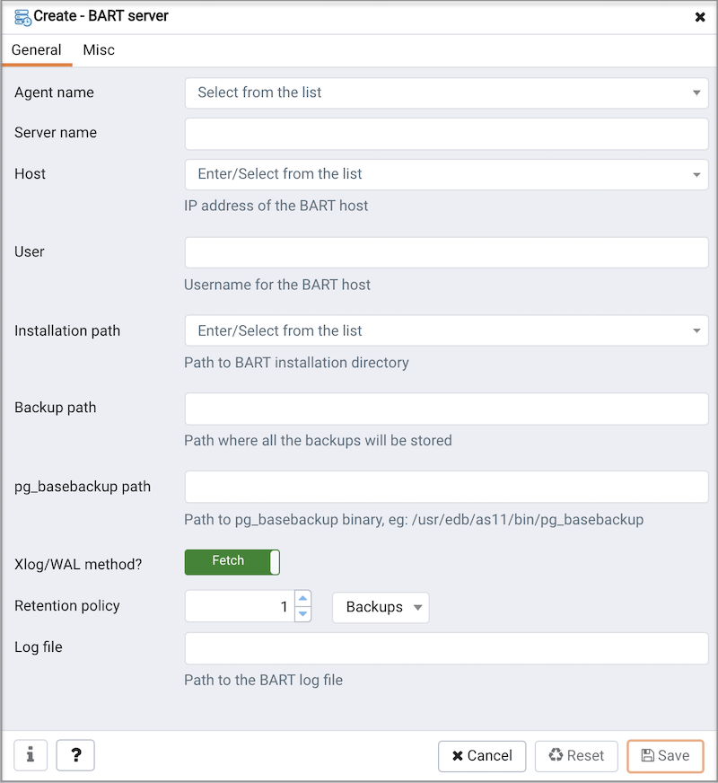

Use the fields on the `General` tab to describe the general properties of the BART Server:

-   Use the `Agent Name` field to select the agent that you want to configure as a BART server. Only those PEM agents that are supported for BART are listed in the drop-down list.

-   Use the `Server Name` field to specify a user-friendly name for the server. The name specified will identify the server in the Browser tree.

-   Use the `Host` field to specify the IP address of the host or agent where BART is installed.

-   Use the `User` field to specify the user name that will be used for performing all the BART operations. You can either use the `enterprisedb` (for Advanced Server) or `postgres` (for PostgreSQL) database user account or you can create a new BART user account. This user must be an operating system user who owns the BART backup catalog directory.

-   Use the `Installation path` field to specify the directory path where BART is installed on the host or BART server.

-   Use the `Backup path` field to specify the file system parent directory where all BART backups and archived WAL files will be stored.

-   Use the `pg_basebackup_path` field to specify the path to the `pg_basebackup` utility.

-   Use the `Xlog/WAL` method field to specify how the transaction log should be collected during the execution of pg_basebackup. The default option is `fetch`; it specifies that the transaction log files will be collected after the backup has completed. Set the `Xlog` method to `stream` to stream the transaction log in parallel with the full base backup creation. If streaming is used, the `max_wal_senders` configuration parameter in the `postgresql.conf` file for affected database servers must account for an additional session for the streaming of the transaction log (the setting must be a minimum of 2).

    For more information about Xlog method, see:

    > <https://www.postgresql.org/docs/current/app-pgbasebackup.html>

-   Use the `Retention policy` field to specify the retention policy for the backup. This determines when an active backup should be marked as obsolete, and hence, be a candidate for deletion. You can specify the retention policy in terms of number of backup or in terms of duration (days, weeks, or months).

-   Use the `Log file` field to specify the path to BART log file. This is an optional field.


Use the fields on the `Misc` tab to describe the backup-related properties of the BART Server:

-   Use the `Scanner log file` field to specify the path to the Xlog/WAL scanner log file. This is an optional field; BART does not create a WAL scanner log file if you do not specify the path.
-   Use the `Socket dir path` field to specify the path to the socket directory where all BART sockets will be stored. The default directory is `/tmp`. This parameter is added from BART version 2.5.2 onwards.
-   Use the `Socket name` field to specify a user-friendly BART socket file name. Using this option overrides the default BART socket name generated using MD5 checksum. This parameter is added from BART version 2.5.6 onwards.
-   Use the `WAL compression?` switch to specify if you want to compress the archived Xlog/WAL files in Gzip format. To enable WAL compression, the gzip compression program must be present in the BART user account’s PATH. The WAL compression setting must not be enabled for those database servers where you need to take incremental backups.
-   Use the `Copy WALs during restore?` field to specify how the archived WAL files are collected when invoking the RESTORE operation. Set to enabled to copy the archived WAL files from the BART backup catalog to the `restore_path/archived_wals` directory prior to the database server archive recovery. Set to `disabled` to retrieve the archived WAL files directly from the BART backup catalog during the database server archive recovery. Enabling this option helps you save time during the restore operation.
-   Use the `Thread count` field to specify the number of worker threads for copying blocks or data files from the database server to the BART backup catalog. Specify a `thread count` of `1` if you want to take the backup using the `pg_basebackup` utility.
-   Use the `Batch size` field to specify the number of blocks of memory used for copying modified blocks. This is applicable only for incremental backups.
-   Use the `scan interval` field to specify the number of seconds after which the WAL scanner should scan the new WAL files.
-   Use the `MBM scan timeout` field to specify the number of seconds to wait for MBM files before timing out. This is applicable only for incremental backups.
-   Use the `Workers` field to specify the number of parallel worker processes required to stream the modified blocks of an incremental backups to the restore host.

---
6.3&nbsp;&nbsp;&nbsp;&nbsp;&nbsp;&nbsp;&nbsp;&nbsp;&nbsp;&nbsp;Associating the BART Server with a Database Server
---

<div id="associating_bart_server_with_database_server" class="registered_link"></div>

After configuring the BART server, you need to associate it with the database server whose backup you want to manage with BART. You can do one of the following:

-   Use the PEM console to modify the properties of an existing monitored database server to map it to the newly configured BART server.
-   Use the PEM console to create a new monitored database server, and map it to the newly configured BART server.

To map the BART server to a new PEM database server, right-click the `PEM Server Directory` node and select `Create` > `Server`. Enter the details on all the generic tabs and then enter the BART-specific details on the `BART` tab.


Use the fields on the `General` tab to describe the general properties of the BART Server that will map to the PEM server:

-   Use the `BART server` field to select the BART server name. All the BART servers configured in the PEM console will be listed in this drop down list.
-   Use the `Server name` field to specify a name for the database server that you want to backup using the BART server. This name gets stored in the BART configuration file.
-   Use the `Description` field to specify the description of the database server.
-   Use the `Backup name` field to specify a template for user-defined names to be assigned to the backups of the database server. If you do not specify a backup name template, then the backup can only be referenced in BART sub-commands by the BART assigned, integer backup identifier.
-   Use the `Host address` field to specify the IP address of the database server that you want to configure for backup.
-   Use the `Port` field to specify the port to be used for the database that you want to backup.
-   Use the `User` field to specify the user of the database that you want to backup using BART through PEM console. If you want to enable incremental backups for this database server, then the user must be a superuser.
-   Use the `Password` field to specify the password for the user of the database that you want to backup.
-   Use the `Cluster owner` field to specify the Linux operating system user account that owns the database cluster. This is typically `enterprisedb` for Advanced Server database clusters installed in the Oracle databases compatible mode, or `postgres` for PostgreSQL database clusters and for Advanced Server database clusters installed in the PostgreSQL databases compatible mode.
-   Use the `Override archive command?` switch to specify if you want to override the archive command in the database server's `postgresql.conf` file. If you override the archive command, the database server will be restarted or database configurations will be reloaded after the server gets added.
-   Use the `Archive command` field to specify the desired format of the archive command string. Ensure to bind a PEM agent and provide `Service ID` to reload the database configuration or restart the server.
-   Use the `Archive path` field to store the archived WAL files. The default location is the BART backup catalog. This parameter is added from BART version 2.5.2 onwards.
-   Use the `Allow incremental backup?` switch to specify if incremental backup should be enabled for this database server.
-   Use the `Setup passwordless SSH?` switch to specify if you want to create SSH certificates to allow passwordless logins between the database server and the BART server. You must ensure that a PEM agent is bound to the server before configuring passwordless SSH authentication. Passwordless SSH will not work for a database server that is being remotely monitored by a PEM agent.

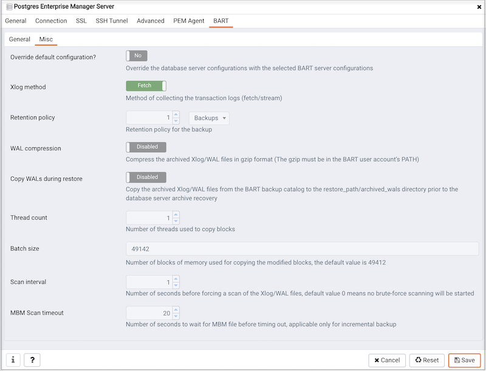

Use the fields on the `Misc` tab to describe the miscellaneous properties of the BART Server:

-   Use the `Override default configuration?` Switch to specify if you want to override the BART server configurations with the specific database server configurations.
-   Use the `Xlog` method to specify how the transaction log should be collected during the execution of `pg_basebackup`.
-   Use the `Retention policy` field to specify the retention policy for the backup. This determines when an active backup should be marked as obsolete, and hence, be a candidate for deletion. You can specify the retention policy in terms of number of backup or in terms of duration (days, weeks, or months).
-   Use the `WAL compression` switch to specify if you want to compress the archived Xlog/WAL files in Gzip format. To enable WAL compression, the gzip compression program must be present in the BART user account’s PATH. The wal_compression setting must not be enabled for those database servers where you need to take incremental backups.
-   Use the `Copy WALs during restore` field to specify how the archived WAL files are collected when invoking the RESTORE operation. Set to enabled to copy the archived WAL files from the BART backup catalog to the &lt;restore_path>/archived_wals directory prior to the database server archive recovery. Set to disabled to retrieve the archived WAL files directly from the BART backup catalog during the database server archive recovery.
-   Use the `Thread count` field to specify the number of threads to copy the blocks. You must set `thread count` to `1` if you want to take a backup with the `pg_basebackup` utility.
-   Use the `Batch size` field to specify the number of blocks of memory used for copying modified blocks, applicable only for incremental backups.
-   Use the `Scan interval` field to specify the number of seconds after which the WAL scanner should scan the new WAL files.
-   Use the `MBM scan timeout` field to specify the number of seconds to wait for MBM files before timing out, applicable only for incremental backups.
-   Use the `Workers` field to specify the number of parallel worker processes required to stream the modified blocks of an incremental backups to the restore host.

---
6.4&nbsp;&nbsp;&nbsp;&nbsp;&nbsp;&nbsp;&nbsp;&nbsp;&nbsp;&nbsp;Viewing the BART Server Details on a PEM Dashboard
---

<div id="viewing_bart_dashboard" class="registered_link"></div>

Once the BART server is associated with the database server, you can see the entire backup and restore related details for that particular BART server on the PEM Dashboard. You can also perform operations such as restoration or deletion of a backup that is listed on the dashboard.


When you select a monitored BART server, details of all the associated database servers along with their activities are displayed as a chart on the Dashboard in the `BART Tool Activities` panel. You can select the activities on any criteria that you specify in the filter boxes (the database server, status, duration or date).

The `Managed Database servers` panel displays a list of all the database servers managed by that particular BART server along with their high-level details.

The `Initiated Server Backups` panel displayes a list of all the backups of the database servers managed by that particular BART server. You can filter the list to display the details of a particular database server. You can also filter the list on any criteria that you specify in the filter box. Typically, this filter works with any kind of string value (excluding date, time, and size) listed under the columns. For example, you can type `tar` to filter the list and display only those backups that are in tar format.

Backup details displayed include the `Backup Name`, *Backup ID*, `Status`, *Server Name*, `Start Time`, *Type*, `Parent ID`, *Format*, `Duration`, and `Size`. The `Status` column shows the status of the backups which can be one of the following: `In Progress`, *Active*, `Keep`, or `Obsolete`.

The backups are marked as `Obsolete` after the backup retention period has passed or number of retained backups that you have specified as retention policy of the BART server is met. If you want to make an exception so that a particular backup does not get marked as `Obsolete` even after the expiry of the duration of retention policy, then you need to mark that particular backup as `Keep`. Similarly, if you mark a particular backup as `NoKeep`, the backup is re-evaluated to determine if its status should be changed back to obsolete based upon the current retention policy.

Please note that if any of the scheduled tasks for backup, restore, validate host, validate server or delete obsolete backup for any of the BART Server gets deleted, it will not display under the `BART Tool Activities` graph of BART Server's dashboard. However, it gets listed under the `Initiated Server Backups` list.

A pin in the first column under `Actions` indicates that a backup can be marked as `Keep` by clicking the pin; while an inverted pin indicates that the backup can be marked as `NoKeep`. The second column under `Actions` displays the `Restore` icon; you can perform the `Restore` operation by clicking on the icon.

You can delete all the `Obsolete` backups by clicking the `Delete Obsolete` button. You can also refresh the list of backups by clicking the `Refresh` button.

---
6.5&nbsp;&nbsp;&nbsp;&nbsp;&nbsp;&nbsp;&nbsp;&nbsp;&nbsp;&nbsp;Scheduling BART Backups
---

<div id="scheduling_bart_backups" class="registered_link"></div>

To schedule a backup using BART, select `Schedule Backup` under `Tools` menu. You can see a list of scheduled backups with details such as `Logs`, *Last result*, `Database server`, *Last backup name*, `Started on`, *Type*, `Parent`, *Format*, `Verify checksum?`, and `Use pg_basebackup?`. Click the Add icon (+) to add a schedule for the backup. Enter the details in the schedule definition dialog:

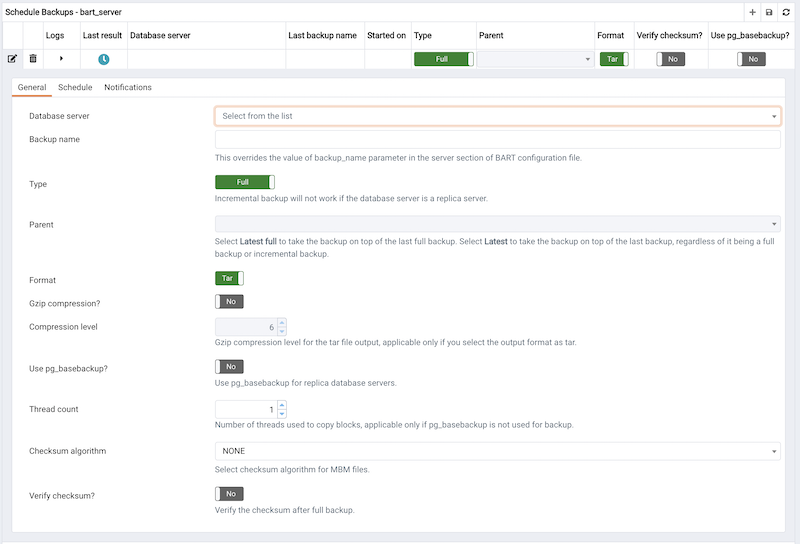

Use the fields on the `General` tab to describe the general properties of the backup:

-   Use the `Database Server` field to specify the target database server that you want to back up.
-   Use the `Backup name` to specify a user-defined name for the backup.
-   Use the `Backup type` switch to specify the backup type I. e. full backup or incremental backup.
-   Use the `Parent backup` field to select the ID of the parent backup for incremental backup. This parent backup can either be a full or an incremental backup.
-   Use the `Format switch` to specify the output format of the backup i.e plain text or tar. For incremental backup, you need to select plain text only.
-   Use the `Gzip compression` switch to specify if gzip compression should be enabled for the backup. This option is applicable only for the tar format.
-   Use the `Compression level` field to specify the gzip compression level on the tar file output.
-   Use the `Thread count` field to specify the number of threads that will copy the blocks.
-   Use the `MBM scan timeout` field to specify the number of seconds to wait for required MBM files before timing out.
-   Use the `Checksum algorithm` field to specify checksum algorithm for MBM files of the backup.
-   Use the `Verify checksum` field to specify if you want the application to verify the checksum of the backup.
-   Use the `pg_basebackup` field to specify if the pg_basebackup utility should be used for the backup. Typically, pg_basebackup utility is used only for backing up the replica servers since it cannot be used for incremental backups.


Provide information on the `Schedule` tab to describe the scheduling details:

-   Use the `Enabled?` switch to indicate if the schedule should be enabled (`Yes`) or disabled (`No`).
-   Use the calendar selector in the `Start` field to specify the starting date and time for the schedule.
-   Use the calendar selector in the `End` field to specify the ending date and time for the schedule.


Use the fields on the `Repeat` tab to specify the details about the schedule in a cron-style format. The schedule will execute on each date or time element selected on the `Repeat` tab. Click within a field to open a list of valid values for that field; click on a specific value to add that value to the list of selected values for the field. To clear the values from a field, click the `X` located at the right-side of the field.

Use the fields within the `Days` box to specify the days on which the schedule will execute:

-   Use the `Week Days` field to select the days on which the schedule will execute.
-   Use the `Month Days` field to select the numeric days on which the schedule will execute. Specify the Last Day to indicate that the schedule should be performed on the last day of the month, regardless of the date.
-   Use the `Months` field to select the months in which the schedule will execute.

Use the fields within the `Times` box to specify the times at which the schedule will execute:

-   Use the `Hours` field to select the hour at which the schedule will execute.
-   Use the `Minutes` field to select the minute at which the schedule will execute.


Use the fields on the `Notifications` tab to specify the email notification settings for a scheduled backup:

-   Use the `Send the notifications` field to specify when you want the email notifications to be sent.
-   Use the `Email group` field to specify the email group that should receive the email notification.

---
6.6&nbsp;&nbsp;&nbsp;&nbsp;&nbsp;&nbsp;&nbsp;&nbsp;&nbsp;&nbsp;Scheduling BART Obsolete Backups Deletion
---

<div id="scheduling_bart_obsolete_backups_deletion" class="registered_link"></div>

Use the `Schedule Obsolete Backup Deletion` dialog to schedule or modify a BART obsolete backup deletion. Use context menu from database server where BART has been configured.

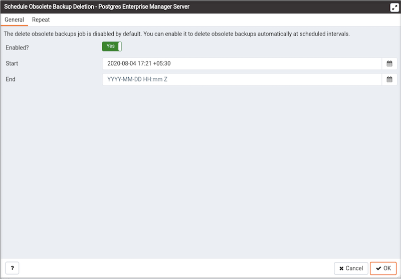

Provide information on the `General` tab to describe the scheduling details:

-   Use the `Enabled?` switch to indicate if the schedule should be enabled (`Yes`) or disabled (`No`).
-   Use the calendar selector in the `Start` field to specify the starting date and time for the schedule.
-   Use the calendar selector in the `End` field to specify the ending date and time for the schedule.


Use the fields on the `Repeat` tab to specify the details about the schedule in a cron-style format. The schedule will execute on each date or time element selected on the `Repeat` tab. Click within a field to open a list of valid values for that field; click on a specific value to add that value to the list of selected values for the field. To clear the values from a field, click the `X` located at the right-side of the field.

Use the fields within the `Days` box to specify the days on which the schedule will execute:

-   Use the `Week Days` field to select the days on which the schedule will execute.
-   Use the `Month Days` field to select the numeric days on which the schedule will execute. Specify the Last Day to indicate that the schedule should be performed on the last day of the month, regardless of the date.
-   Use the `Months` field to select the months in which the schedule will execute.

Use the fields within the `Times` box to specify the times at which the schedule will execute:

-   Use the `Hours` field to select the hour at which the schedule will execute.
-   Use the `Minutes` field to select the minute at which the schedule will execute.

---
6.7&nbsp;&nbsp;&nbsp;&nbsp;&nbsp;&nbsp;&nbsp;&nbsp;&nbsp;&nbsp;BART Backup Dialog
---

<div id="bart_backup_dialog" class="registered_link"></div>

Use the `BART Backup` dialog to take ad-hoc backups using BART. This dialog can be opened using `Backup...` context menu of BART server node and `Backup...` sub menu of `BART` context menu of Database server node.

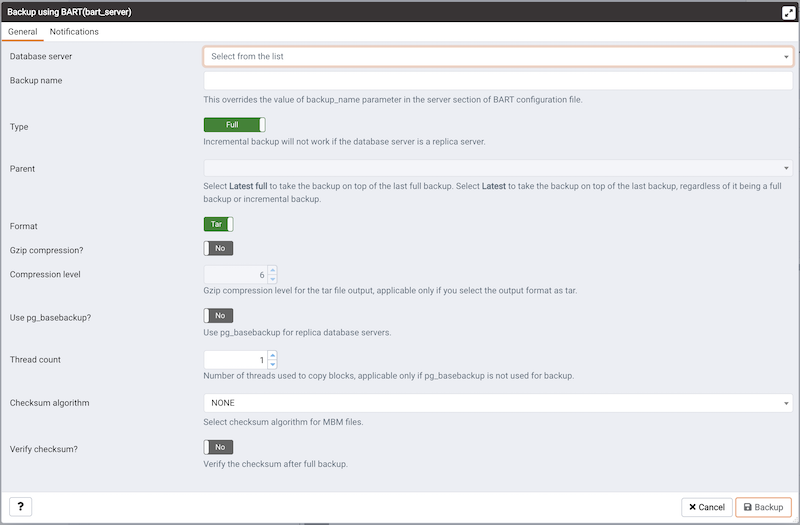

Use the fields on the `General` tab to describe the general properties of the backup:

-   Use the `Database Server` field to specify the target database server that you want to back up.
-   Use the `Backup name` to specify a user-defined name for the backup.
-   Use the `Backup type` switch to specify the backup type I. e. full backup or incremental backup.
-   Use the `Parent backup` field to select the ID of the parent backup for incremental backup. This parent backup can either be a full or an incremental backup.
-   Use the `Format switch` to specify the output format of the backup i.e plain text or tar. For incremental backup, you need to select plain text only.
-   Use the `Gzip compression` switch to specify if gzip compression should be enabled for the backup. This option is applicable only for the tar format.
-   Use the `Compression level` field to specify the gzip compression level on the tar file output.
-   Use the `Thread count` field to specify the number of threads that will copy the blocks.
-   Use the `Checksum algorithm` field to specify checksum algorithm for MBM files of the backup.
-   Use the `Verify checksum` field to specify if you want the application to verify the checksum of the backup.
-   Use the `pg_basebackup` field to specify if the pg_basebackup utility should be used for the backup. Typically, pg_basebackup utility is used only for backing up the replica servers since it cannot be used for incremental backups.

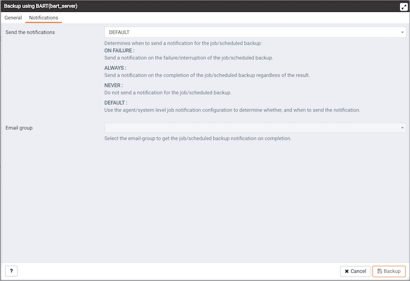

Use the fields on the `Notifications` tab to specify the email notification settings for a backup:

-   Use the `Send the notifications` field to specify when you want the email notifications to be sent.
-   Use the `Email group` field to specify the email group that should receive the email notification.

---
6.8&nbsp;&nbsp;&nbsp;&nbsp;&nbsp;&nbsp;&nbsp;&nbsp;&nbsp;&nbsp;Restoring BART Backups
---

<div id="restoring_bart_backups" class="registered_link"></div>

You can restore the backups that you have earlier created using BART server on a target remote host. When you select a particular BART server, all the associated backups are listed in the Dashboard under `Initiated Server Backups`.

To restore a backup, click the `Restore` icon next to the backup that you want to restore.


In the `Restore Backup` dialog, provide information in the fields on the `General` tab:

-   Use the `Target agent` field name to specify the name of the agent where you want to restore the backup.
-   Use the `Remote user` field to specify the use account on the remote database server host where you want to restore the backup.
-   Use the `Remote host address` field to specify the IP address of the remote host where you want to restore the backup.
-   Use the `SSH port` field to specify the SSH port to be used for restoring the backup.
-   Use the `Restore path` field to specify the path where you want to restore the backup.
-   Use the `Number of workers` field to specify processes to run in parallel to stream the modified blocks of an incremental backup to the restore location.
-   Use the `Setup passwordless SSH?` switch to specify if you want to create SSH certificates to allow passwordless logins between the BART server and the target host for restore.
-   Use the `Verify checksum` switch to specify if you want to verify checksum of a backup.


On the `Advanced` tab, specify your preferences for advanced options for restoring the backup:

-   Use the `Copy WALs to restore path?` switch to specify if you want to copy WALs to the restore path.
-   Use the `Point in time recovery` switch to specify if you want point in time recovery.
-   Use the `Timeline ID` field to specify the timeline ID to be used for replaying the archived WAL files for point-in-time recovery.
-   Use the `Transaction ID (XID)` field to specify the transaction ID for point-in-time recovery.
-   Use the `Timestamp` field to the timestamp to be used for restore.

<div class="note">

<div class="title">

Note

</div>

You can specify either `Transaction ID` or `Timestamp` for the point-in-time recovery.

</div>


Use the fields on the `Notifications` tab to specify the email notification settings for restoring the backup.

-   Use the `Send the notifications` field to specify when you want the email notifications to be sent.
-   Use the `Email group` field to specify the email group that should receive the email notification.

---
7&nbsp;&nbsp;&nbsp;&nbsp;&nbsp;&nbsp;&nbsp;&nbsp;&nbsp;&nbsp;SQL Profiler
---

<div id="toc_pem_sql_profiler" class="registered_link"></div>

SQL Profiler captures statistical information and query execution plans for SQL statements executed during a trace session. You can use the information stored by SQL Profiler to identify performance issues. Before using SQL Profiler, you must [install and configure SQL Profiler](01_sp_installing_sql_profiler/#sp_installing_sql_profiler) on each database you intend to profile.

Contents:


---
7.1&nbsp;&nbsp;&nbsp;&nbsp;&nbsp;&nbsp;&nbsp;&nbsp;&nbsp;&nbsp;Installing SQL Profiler
---

<div id="sp_installing_sql_profiler" class="registered_link"></div>

SQL Profiler allows a database superuser to locate and optimize poorly-running SQL code. Users of Microsoft SQL Server’s Profiler will find PEM’s SQL Profiler very similar in operation and capabilities. SQL Profiler is installed with each Advanced Server instance; if you are using PostgreSQL, you must download the SQL Profiler installer or packages and install the SQL Profiler product into each managed database instance you wish to profile.

SQL Profiler is officially supported only on the EnterpriseDB distributions of PostgreSQL version 9.4 or above and Advanced Server version 9.4 or above. The plugin is distributed via StackBuilder, or is available from the [EnterpriseDB website](https://www.enterprisedb.com/advanced-downloads)

You can use the graphical installer to install any version of SQL Profiler on Windows platform.

On Linux, if you have installed your database server through graphical installer then you must use the graphical installer to install the SQL Profiler. If you have installed your database server using the RPM or DEB package, then you must use the RPM or DEB package to install the SQL Profiler.

### Installing SQL Profiler on Windows

To invoke the SQL Profiler graphical installer, assume superuser privileges (or `Administrator` privileges on Windows), navigate into the directory that contains the installer, and invoke the installer:

> `sqlprofiler-pg-<pg_version>-<sql_profiler_version>-windows-x64.exe`

Where, `pg_version` is the version of your PostgreSQL and `sql_profiler_version` is the version of SQL Profiler.

The SQL Profiler installer welcomes you to the Setup Wizard.

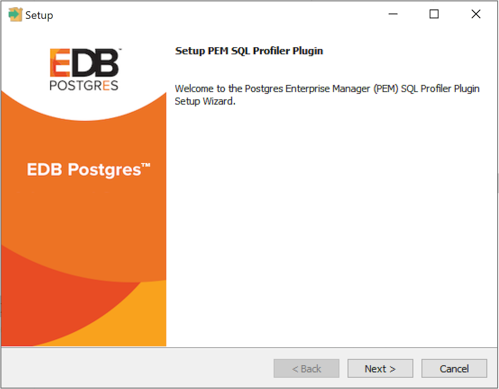

Click `Next` to continue to the `License Agreement`.

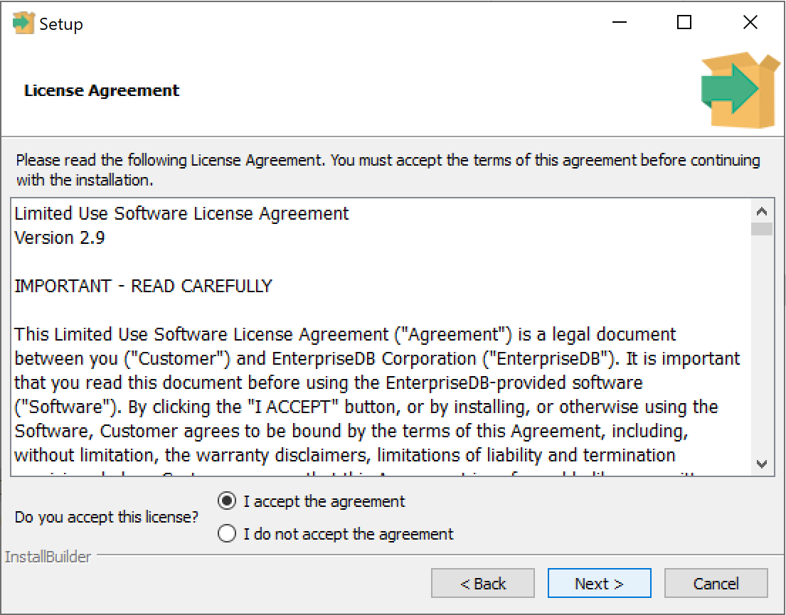

Carefully review the license agreement before highlighting the appropriate radio button and accepting the agreement; click `Next` to continue to the `Installation Directory` dialog.


Specify an alternate location for the installation directory, or accept the default location and click `Next` to continue.

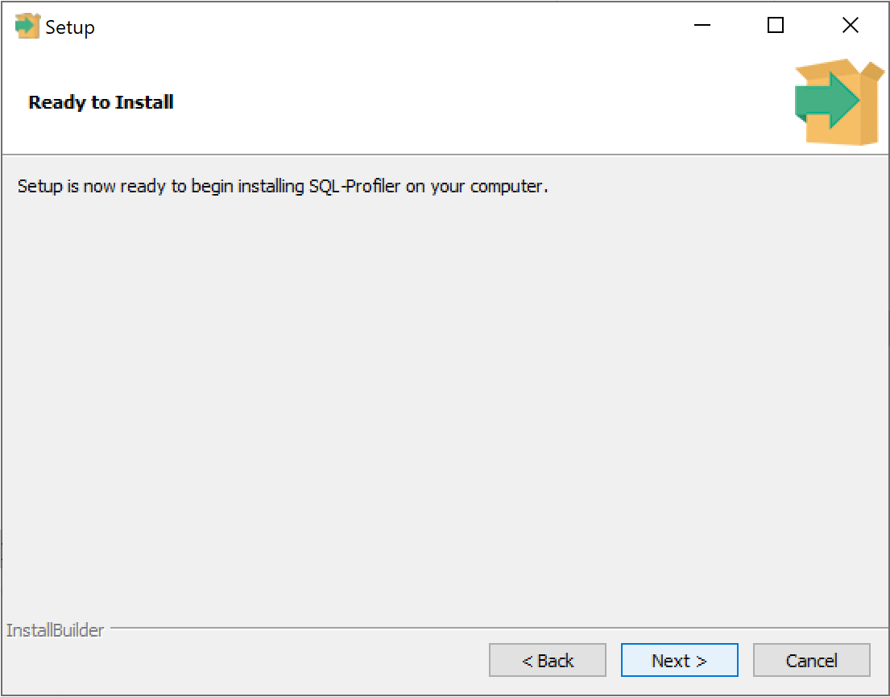

The wizard is now ready to install the SQL Profiler plugin. Click `Next` to continue.

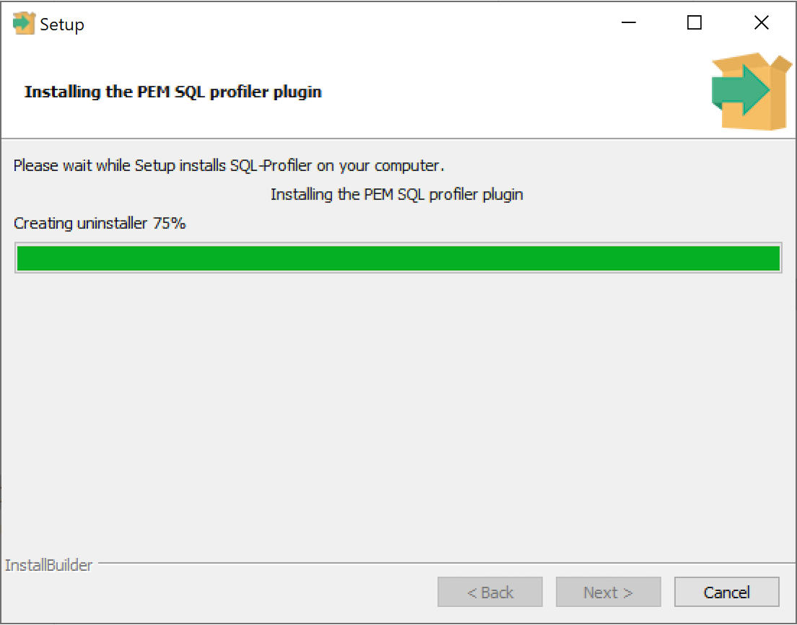

The SQL Profiler plugin installer displays progress bars as it copies files to your system.


When the installation is complete, the SQL Profiler plugin is ready to be configured.

### Installing SQL Profiler on Linux using RPMs

<div class="note">

<div class="title">

Note

</div>

You may be required to add the `sslutils` package to your PostgreSQL database servers before installing SQL Profiler.

</div>

You can install SQL Profiler using rpm on RHEL or Centos 6 or 7, using yum command as root user:

> `yum install postgresql<pg_version>-sqlprofiler`

Where, `pg_version` is the version of your PostgreSQL.

When the installation is complete, the SQL Profiler plugin is ready to be configured.

### Installing SQL Profiler on Debian/Ubuntu using DEB

<div class="note">

<div class="title">

Note

</div>

You may be required to add the `sslutils` package to your PostgreSQL database servers before installing SQL Profiler.

</div>

You can install SQL Profiler using DEB on Debian 9.x or Ubuntu 18, using apt command as root user:

> `apt install postgresql-<pg_version>-sqlprofiler`

Where, `pg_version` is the version of your PostgreSQL.

When the installation is complete, the SQL Profiler plugin is ready to be configured.

---
7.2&nbsp;&nbsp;&nbsp;&nbsp;&nbsp;&nbsp;&nbsp;&nbsp;&nbsp;&nbsp;Configuring SQL Profiler
---

<div id="sp_configuring_sql_profiler" class="registered_link"></div>

The SQL Profiler plugin is not automatically enabled when the installation process completes. This allows you to restart the server at a convenient time, and prevents the plugin from being loaded unnecessarily on systems where it is not required on a continual basis.

Use the following steps to enable the plugin for each database monitored by SQL Profiler:

1.  Edit the `postgresql.conf` file on the server you wish to profile, modifying the `shared_preload_libraries` configuration parameter as shown below:

> For Linux, `shared_preload_libraries = '$libdir/sql-profiler'`
>
> For Windows, `shared_preload_libraries = '$libdir/sql-profiler.dll'`

1.  Create the functions used by SQL Profiler in your database. The SQL Profiler installation program places a SQL script (named `sql-profiler.sql`) in the `share/contrib` subdirectory of the main PostgreSQL installation directory. You must invoke this script on the maintenance database (specified when registering the server with PEM).

You can also use the psql command line to invoke the configuration script. The following command uses psql to invoke the sql-profiler.sql script on PostgreSQL Server database on a Linux system:

> `$ /usr/pgsql-x/bin/psql -U postgres postgres -f /usr/pgsql-x/share/contrib/sql-profiler.sql`

1.  Stop and re-start the server for the changes to take effect.

Please note: if you have connected to the PEM server with the PEM client before configuring SQL Profiler, you must disconnect and reconnect with the server to enable SQL Profiler functionality.

---
7.3&nbsp;&nbsp;&nbsp;&nbsp;&nbsp;&nbsp;&nbsp;&nbsp;&nbsp;&nbsp;Using SQL Profiler
---

<div id="sp_create_new_trace" class="registered_link"></div>

You can use SQL Profiler to create and store up to 15 named traces; use menu options to create and manage traces.

### Creating a Trace

You can use the Create trace... dialog to define a SQL Trace for any database on which SQL Profiler has been installed and configured. [installed and configured](01_sp_installing_sql_profiler/#sp_installing_sql_profiler). To access the dialog, highlight the name of the database in the PEM client tree control; navigate through the `Management` menu to the `SQL Profiler` pull-aside menu, and select `Create trace...`.


Use the fields on the `Trace options` tab to specify details about the new trace:

-   Provide a name for the trace in the `Name` field.
-   Click in the `User filter` field to specify the roles whose queries will be included the trace; optionally, check the box next to `Select All` to include queries from all roles.
-   Click in the `Database filter` field to specify which databases to trace; optionally, check the box next to `Select All` to include queries against all databases.
-   Specify a trace size in the `Maximum Trace File Size` field; SQL Profiler will terminate the trace when it reaches approximately the size specified.
-   Specify `Yes` in the `Run Now` field to start the trace when you select the `Create` button; select `No` to enable fields on the `Schedule` tab.


Use the fields on the `Schedule` tab to specify scheduling details for the new trace:

-   Use the `Start time` field to specify the starting time for the trace.
-   Use the `End time` field to specify the ending time for the trace.
-   Specify `Yes` in the `Repeat?` field to indicate that the trace should be repeated every day at the times specified; select `No` to enable fields on the `Periodic job options` tab.


Fields on the `Periodic job options` tab specify scheduing details for a recurring trace. Use fields in the `Days` section to specify the days on which the job will execute:

-   Click in the `Week days` field to select the days of the week on which the trace will execute.
-   Click in the `Month days` field to select the days of the month on which the trace will execute.
-   Click in the `Months` field to select the months in which the trace will execute.

Use fields in the `Times` section to specify a time schedule for the trace execution:

-   Click in the `Hours` field to select the hours at which the trace will execute.
-   Click in the `Minutes` field to select the hours at which the trace will execute.

When you've completed the `Create trace...` dialog, click `Create` to start the newly defined trace or to schedule the trace for a later time. If you elect to execute the trace immediately, the trace results will display in the PEM client.


### Opening a Trace

To view a previous trace, highlight the name of the profiled database in the PEM client tree control; navigate through the `Management` menu to the `SQL Profiler` pull-aside menu, and select `Open trace...`. You can also use the SQL Profiler toolbar menu to open a trace; select the `Open trace...` option. The `Open trace...` dialog opens.


Highlight an entry in the trace list and click `Open` to open the selected trace. The selected trace opens in the SQL Profiler tab.

### Filtering a Trace

A filter is a named set of (one or more) rules, each of which can hide events from the trace view. When you apply a filter to a trace, the hidden events are not removed from the trace, but are merely excluded from the display. Click the `Filter` icon to open the `Trace Filter` dialog and create a rule (or set of rules) that define a filter. Each rule will screen the events within the current trace based on the identity of the role that invoked the event, or the query type invoked during the event.


To open an existing filter, select the`Open` button; to define a new filter, click the Add (+) button to add a row to the table displayed on the `General` tab and provide rule details:

-   Use the `Type` drop-down listbox to specify the trace field that the filter rule will apply to.
-   Use the `Condition` drop-down listbox to specify the type of operator that SQL Profiler will apply to the Value when it filters the trace:

> -   Select `Matches` to filter events that contain the specified Value.
> -   Select `Does not match` to filter events that do not contain the specified Value.
> -   Select `Is equal to` to filter events that contain an exact match to the string specified in the Value field.
> -   Select `Is not equal to` to filter events that do not contain an exact match to the string specified in the Value field.
> -   Select `Starts with` to filter events that begin with the string specified in the Value field.
> -   Select `Does not start with` to filter events that do not begin with the string specified in the Value field.
> -   Select `Less than` to filter events that have a numeric value less than the number specified in the Value field.
> -   Select `Greater than` to filter events that have a numeric value greater than the number specified in the Value field.
> -   Select `Less than or equal to` to filter events that have a numeric value less than or equal to the number specified in the Value field.
> -   Select `Greater than or equal to` to filter events that have a numeric value greater than or equal to the number specified in the Value field.

-   Use the `Value` field to specify the string, number or regular expression that SQL Profiler will search for.

When you've finished defining a rule, click the Add (+) button to add another rule to the filter. To delete a rule from a filter, highlight the rule and click the `Delete` icon.

Click the `Save` button to save the filter definition to a file without applying the filter; to apply the filter, click `OK`. Select `Cancel` to exit the Trace Filter dialog and discard any changes to the filter.

### Deleting a Trace

To delete a trace, highlight the name of the profiled database in the PEM client tree control; navigate through the `Management` menu to the `SQL Profiler` pull-aside menu, and select `Delete trace(s)...`. You can also use the SQL Profiler toolbar menu to delete a trace; select the `Delete trace(s)...` option. The `Delete traces...` dialog opens.


Click the icon to the left of a trace name to mark one or more traces for deletion and click `Delete`.


The PEM client will acknowledge that the selected traces have been deleted.

### Viewing Scheduled Traces

To view a list of scheduled traces, highlight the name of the profiled database in the PEM client tree control; navigate through the `Management` menu to the `SQL Profiler` pull-aside menu, and select `Scheduled traces...`. You can also use the SQL Profiler toolbar menu to the list; select the `Scheduled traces...` option. The `Scheduled traces...` dialog opens.


The `Scheduled traces...` dialog displays a list of the traces that are awaiting execution. Click the edit button to the left of a trace name to access detailed information about the trace:


The `General` tab displays detailed information about the scheduled trace:

-   The `Status` field lists the status of the current trace.
-   The `Enabled?` switch displays `Yes` if the trace is enabled; `No` if the trace is disabled.
-   The `Name` field displays the name of the trace.
-   The `Agent` field displays the name of the agent responsible for executing the trace.
-   The `Last run` field displays the date and time of the last execution of the trace.
-   The `Next run` field displays the date and time of the next scheduled execution of the trace.
-   The `Created` field displays the date and time that the trace was defined.

---
7.4&nbsp;&nbsp;&nbsp;&nbsp;&nbsp;&nbsp;&nbsp;&nbsp;&nbsp;&nbsp;Using Index Advisor
---

<div id="sp_index_advisor" class="registered_link"></div>

Index Advisor helps you determine the application tables (and columns) on which you should create common B-tree type indexes. This can reduce the execution cost of queries you expect to use on your tables. Index Advisor comes pre-installed with EDB Postgres (R) Advanced Server. Index Advisor works with Advanced Server's query planner by creating "hypothetical indexes" for the query planner to use to calculate execution costs if such indexes were available.

Before using Index Advisor, you must:

1.  Modify the postgresql.conf file on each Advanced Server host, adding the index_advisor library to the shared_preload_libraries parameter.

2.  Install the Index Advisor contrib module. To install the module, use the psql client or PEM Query Tool to connect to the database, and invoke the following command:

    `<complete_path>/share/contrib/index_advisor.sql`

3.  Restart the server for your changes to take effect.

After installing Index Advisor, you can select one or more rows from within a trace, and select the Index Advisor icon to access Index Advisor functionality. For detailed installation and usage information about Index Advisor, please see the EDB Postgres Advanced Server Guide, available from the EnterpriseDB website at:

> <http://www.enterprisedb.com>

<div class="note">

<div class="title">

Note

</div>

It is recommended that you disable the index advisor while using the pg_dump functionality.

</div>

---
7.5&nbsp;&nbsp;&nbsp;&nbsp;&nbsp;&nbsp;&nbsp;&nbsp;&nbsp;&nbsp;The SQL Profiler Tab
---

<div id="sp_sql_profiler_tab" class="registered_link"></div>

### Toolbar Options

Toolbar options on the SQL Profiler tab allow you to define new traces, start or stop existing traces, open and search through previous traces, and filter trace results.


Use the following options to manage your SQL Profiler traces:

| Option           | Action                                                                                                                                                                                               | Shortcut      |
| ---------------- | ---------------------------------------------------------------------------------------------------------------------------------------------------------------------------------------------------- | ------------- |
| `Menu`           | Use options accessed through the drop_down menu icon to manage SQL Profiler traces.                                                                                                                  | Accesskey + O |
| `Start Trace`    | Select the `Start Trace` icon to start a new trace, using the attributes (user names, database names, comments, etc) that were defined for the trace currently displayed in the SQL Profiler dialog. | Accesskey + S |
| `Stop Trace`     | Select the `Stop Trace` icon to stop an executing trace.                                                                                                                                             | Accesskey + Q |
| `Refresh Trace`  | Select the `Refresh Trace` icon to update the display to include any recent changes to an active trace.                                                                                              | Accesskey + R |
| `Clear Trace`    | Select the `Clear Trace` icon to delete the trace and close the SQL Profiler window.                                                                                                                 | Accesskey + C |
| `Filter`         | Select the `Filter` icon to define a new filter, or apply an existing filter to the trace.                                                                                                           | Accesskey + T |
| `Information`    | Select the information icon to view the properties of the trace displayed in the SQL Profiler window.                                                                                                | Accesskey + P |
| `Index Advisor`  | Select the `Index Advisor` icon to open the [PEM Index Advisor](04_sp_index_advisor/#sp_index_advisor). \| Ac                                                                                        | cesskey + I   |
| `Download Trace` | Use options accessed through the `Download Trace` menu to download a CSV file that contains the trace events shown on the current page or the complete set of trace data.                            | Accesskey + X |
| `Column Picker`  | Click the `Column Picker` icon to choose the columns to be displayed in below table.                                                                                                                 | Accesskey + W |

### Viewing Trace Data

The SQL Profiler tab is divided into three panes:

-   The top of the tabbed browser window (the trace data pane) displays a list of the SQL commands executed during the trace.
-   The lower-left panel dislays the SQL query that was executed, or the metrics gathered during the execution.
-   The lower-right panel displays the query execution plan; you can view the execution plan in a Text-based form, or as a Graphical Plan.

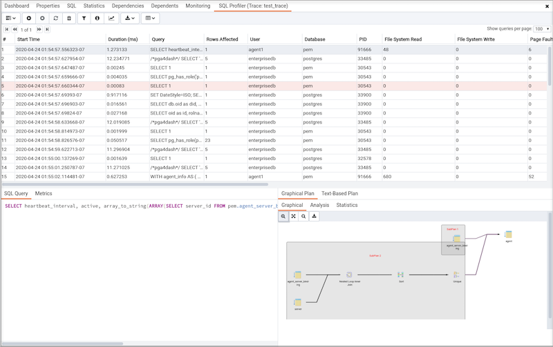

**The Trace Data Pane**

The Trace Data pane displays the SQL commands executed during the trace. By default, the commands are displayed in the order that the command was executed.

Double-click a column heading to sort the trace by the column values; double-click the column heading a second time to toggle the data in the column to be in ascending or descending order.

Use the drop-down listbox next to the `Show queries per page` label to specify the number of events that SQL Profiler should display in the pane. Select from 20, 50, 100, 200, 500, 1000, or 2000. The default is 500.

If the number of events in the trace exceeds the count of events per page, use the page selector controls (located in the top left corner of the table) to navigate through pages of the trace.

To include or exclude events from the currently displayed trace, select the Filter icon from the SQL Profiler toolbar. The Trace Filter dialog will allow you to define and apply a filter that will screen the displayed trace.

**The Query/Metrics Pane**

The Query/Metrics pane is located in the lower-left corner of the SQL Profiler window. The tabs provide detailed information about the currently selected query:

-   The `SQL Query` tab displays the text of the query that is currently highlighted in Trace Data pane.
-   The `Metrics` tab displays detailed statistical information about the execution of the query. The table below describes the metrics that are displayed in the Metrics dialog; the percentages listed describe the percentage of the total quantity of the parameter that is attributed to the selected SQL command:

| **Property**                 | **Description**                                                                                                                                                                    |
| ---------------------------- | ---------------------------------------------------------------------------------------------------------------------------------------------------------------------------------- |
| Executed (#)                 | The number of times that the selected SQL command executed.                                                                                                                        |
| Execution (%)                | The percentage of the execution count that the SQL command represents. For example if the trace profiles 4 SQL commands, each command will represent 25% of the trace execution %. |
| Duration (%)                 | The percentage of the total trace time consumed by the highlighted SQL Command.                                                                                                    |
| Rows updated (%)             | The percentage of the rows updated during the trace that were updated by the selected SQL command.                                                                                 |
| Page faults (%)              | The percentage of the page faults that occur during the trace that can be attributed to the selected SQL command.                                                                  |
| Page reclaims (%)            | The percentage of the pages reclaimed during the trace that can be attributed to the selected SQL command.                                                                         |
| Swaps (%)                    | The percentage of swaps that occur during the trace that can be attributed to the selected SQL command.                                                                            |
| File system in (%)           | The percentage of bytes written to disk during the trace that can be attributed to the selected SQL command.                                                                       |
| File system out (%)          | The percentage of bytes read from disk during the trace that can be attributed to the selected SQL command.                                                                        |
| Signals received (%)         | Currently unused.                                                                                                                                                                  |
| Messages received            | (%)Currently unused.                                                                                                                                                               |
| Messages sent (%)            | Currently unused.                                                                                                                                                                  |
| Voluntary context switches   | (%)Currently unused.                                                                                                                                                               |
| Involuntary context switches | (%)Currently unused.                                                                                                                                                               |
| Shared blocks read (%)       | The percentage of the shared blocks read by the highlighted SQL command.                                                                                                           |
| Shared blocks written (%)    | The percentage of the shared blocks written by the highlighted SQL command.                                                                                                        |
| Shared blocks hit (%)        | The percentage of the shared blocks hit by the highlighted SQL command.                                                                                                            |
| Local blocks read (%)        | The percentage of local blocks read by the highlighted SQL command.                                                                                                                |
| Local blocks written (%)     | The percentage of local blocks written by the highlighted SQL command.                                                                                                             |
| Local blocks hit (%)         | The percentage of local blocks hit by the highlighted SQL commands.                                                                                                                |
| Temporary blocks read (%)    | The percentage of the temporary blocks read by the highlighted SQL commands.                                                                                                       |
| Temporary blocks written (%) | The percentage of the temporary blocks written by the highlighted SQL commands.                                                                                                    |

**The Explain Pane**

The Graphical or Text-based explain pane displays one of two representations of the query execution plan for the selected query.

-   Select the Text-based Plan tab to display the execution plan for the currently highlighted event in text format:
-   Select the Graphical-based Plan tab to display a graphical interpretation of the execution plan of the highlighted query. For more information about interpreting the graphical query plan, see [Interpreting the Graphical Query Plan](../08_toc_pem_developer_tools/03_pem_interpreting_graphical_query/#pem_interpreting_graphical_query).

---
8&nbsp;&nbsp;&nbsp;&nbsp;&nbsp;&nbsp;&nbsp;&nbsp;&nbsp;&nbsp;Developer Tools
---

<div id="toc_pem_developer_tools" class="registered_link"></div>

The PEM client features powerful developer tools that you can use to execute and analyze complex SQL commands, manage data, and debug PL/SQL code.

Contents:


---
8.1&nbsp;&nbsp;&nbsp;&nbsp;&nbsp;&nbsp;&nbsp;&nbsp;&nbsp;&nbsp;pgAdmin Debugger
---

<div id="debugger" class="registered_link"></div>


The debugger may be used to debug PL/pgSQL functions in PostgreSQL, as well as EDB-SPL functions, stored procedures and packages in Advanced Server. The Debugger is available as an extension for your PostgreSQL installation, and is distributed as part of Advanced Server. You must have superuser privileges to use the debugger.

Before using the debugger, you must modify the `postgresql.conf` file, adding the server-side debugger components to the the value of the `shared_preload_libraries` parameter:

> shared_preload_libraries = '$libdir/`other_libraries`/plugin_debugger'

After modifying the `shared_preload_libraries` parameter, restart the server to apply the changes.

The debugger may be used for either in-context debugging or direct debugging of a target function or procedure. When you use the debugger for in-context debugging, you set a breakpoint at the first line of a program; when a session invokes the target, control is transferred to the debugger. When using direct debugging, the debugger prompts you for any parameters required by the target, and then allows you to step through the code.

**In-context Debugging**

To set a breakpoint at the first line of a program, right-click the name of the object you would like to debug, and select `Set breakpoint` from the `Debugging` sub-menu. The debugger window will open, waiting for another session to invoke the program.


When another session invokes the target, the debugger will display the code, allowing you to add break points, or step through line-by-line. The other session is suspended until the debugging completes; then control is returned to the session.

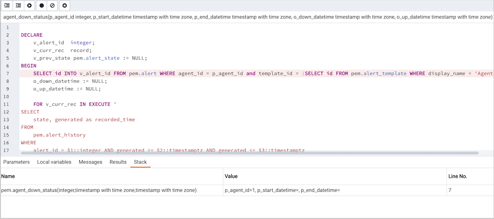

**Direct Debugging**

To use the debugger for direct debugging, right click on the name of the object that you wish to debug in the pgAdmin tree control and select `Debug` from the `Debugging` sub-menu. The debugger window will open, prompting you for any values required by the program:

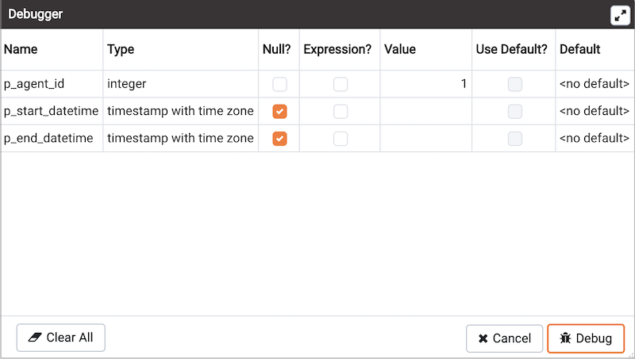

Use the fields on the `Debugger` dialog to provide a value for each parameter:

> -   The `Name` field contains the formal parameter name.
> -   The `Type` field contains the parameter data type.
> -   Check the `Null?` checkbox to indicate that the parameter is a NULL value.
> -   Check the `Expression?` checkbox if the Value field contains an expression.
> -   Use the `Value` field to provide the parameter value that will be passed to the program. When entering parameter values, type the value into the appropriate cell on the grid, or, leave the cell empty to represent NULL, enter '' (two single quotes) to represent an empty string, or to enter a literal string consisting of just two single quotes, enter ''. PostgreSQL 8.4 and above supports variadic function parameters. These may be entered as a comma-delimited list of values, quoted and/or cast as required.
> -   Check the `Use default?` checkbox to indicate that the program should use the value in the Default Value field.
> -   The `Default Value` field contains the default value of the parameter.

Provide values required by the program, and click the `Debug` button to start stepping through the program, The values of the arguments provided here are saved. The values will be pre-filled next time the dialog opens. To clear the values, use the `Clear All` button.


**Using the Debugger**

The main debugger window consists of two panels and a context-sensitive toolbar. Use toolbar icons to manage breakpoints and step into or through code; hover over an icon for a tooltip that identifies the option associated with the icon. The toolbar options are:


| Option                  | Action                                                                                                                                                                                    |
| ----------------------- | ----------------------------------------------------------------------------------------------------------------------------------------------------------------------------------------- |
| `Step into`             | Click the `Step into` icon to execute the currently highlighted line of code.<br />                                                                                                       |
| `Step over`             | Click the `Step over` icon to execute a line of code, stepping over any sub-functions invoked by the code.The sub-function executes, but is not debugged unless it contains a breakpoint. |
| `Continue/Start`        | Click the `Continue/Start` icon to execute the highlighted code, and continue until the programencounters a breakpoint or completes.                                                      |
| `Toggle breakpoint`     | Use the `Toggle breakpoint` icon to enable or disable a breakpoint (without removing the breakpoint).<br />                                                                               |
| `Clear all breakpoints` | Click the `Clear all breakpoints` icon to remove all breakpoints from the program.<br />                                                                                                  |
| `Stop`                  | Click the `Stop` icon to halt the execution of a program.<br />                                                                                                                           |

The top panel of the debugger window displays the program body; click in the grey margin next to a line number to add a breakpoint. The highlighted line in the top panel is the line that is about to execute.


The lower panel of the debugger window provides a set of tabs that allow you to review information about the program:

> -   The `Parameters` tab displays the value of each parameter.
> -   The `Local` variables tab displays the current value of the program variables.
> -   The `Messages` tab displays any messages returned by the server (errors, warnings and informational messages).
> -   The `Results` tab displays the server message when the program completes.
> -   The `Stack` tab displays the list of functions that have been invoked, but which have not yet completed.

As you step through a program, the `Local variables` tab displays the current value of each variable:

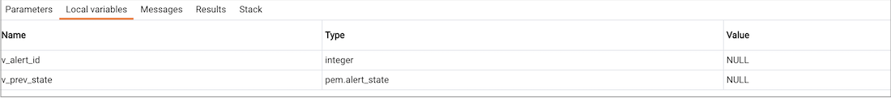

When you step into a subroutine, the `Stack` tab displays the call stack, including the name of each caller, the parameter values for each caller (if any), and the line number within each caller:

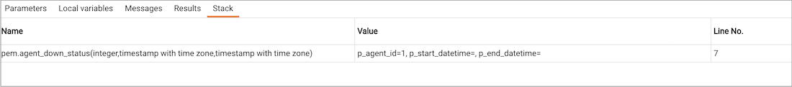

Select a caller to change focus to that stack frame and display the state of the caller in the upper panel.

When the program completes, the `Results` tab displays the message returned by the server. If the program encounters an error, the `Messages` tab displays details:

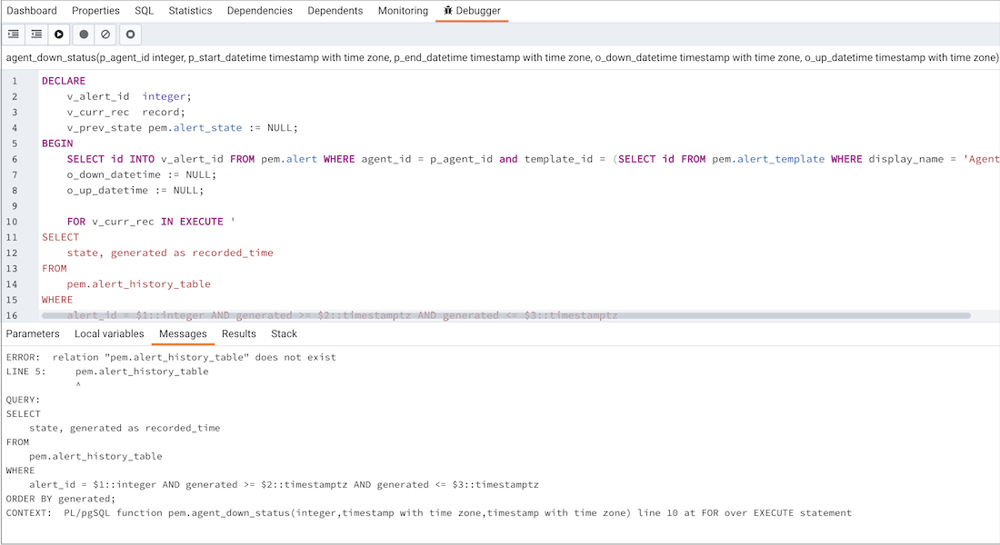

---
8.2&nbsp;&nbsp;&nbsp;&nbsp;&nbsp;&nbsp;&nbsp;&nbsp;&nbsp;&nbsp;Query Tool
---

<div id="query_tool" class="registered_link"></div>

The Query Tool is a powerful, feature-rich environment that allows you to execute arbitrary SQL commands and review the result set. You can access the Query Tool via the `Query Tool` menu option on the `Tools` menu, or through the context menu of select nodes of the Browser tree control. The Query Tool allows you to:

-   Issue ad-hoc SQL queries.
-   Execute arbitrary SQL commands.
-   Edit the result set of a SELECT query if it is [updatable](#updatable-result-set).
-   Displays current connection and transaction status as configured by the user.
-   Save the data displayed in the output panel to a CSV file.
-   Review the execution plan of a SQL statement in either a text, a graphical format or a table format (similar to <https://explain.depesz.com>).
-   View analytical information about a SQL statement.


You can open multiple copies of the Query tool in individual tabs simultaneously. To close a copy of the Query tool, click the `X` in the upper-right hand corner of the tab bar.

The Query Tool features two panels:

-   The upper panel displays the `SQL Editor`. You can use the panel to enter, edit, or execute a query. It also shows the `History` tab which can be used to view the queries that have been executed in the session, and a `Scratch Pad` which can be used to hold text snippets during editing. If the Scratch Pad is closed, it can be re-opened (or additional ones opened) by right-clicking in the SQL Editor and other panels and adding a new panel.
-   The lower panel displays the `Data Output` panel. The tabbed panel displays the result set returned by a query, information about a query's execution plan, server messages related to the query's execution and any asynchronous notifications received from the server.

**The Query Tool Toolbar**

The `Query Tool` toolbar uses context-sensitive icons that provide shortcuts to frequently performed tasks. If an icon is highlighted, the option is enabled; if the icon is grayed-out, the task is disabled. Please note that disabled icons may support functionality accessed via the [data editor](04_editgrid/#editgrid).

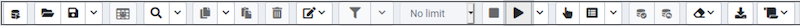

Hover over an icon to display a tooltip that describes the icon's functionality:

| Icon              | Behavior                                                                                                                                                                                                                                                                                                                                                                                                                                                                                                                                                                                                                                                                                                                                                                                                                                                                    | Shortcut                                                                                    |
| ----------------- | --------------------------------------------------------------------------------------------------------------------------------------------------------------------------------------------------------------------------------------------------------------------------------------------------------------------------------------------------------------------------------------------------------------------------------------------------------------------------------------------------------------------------------------------------------------------------------------------------------------------------------------------------------------------------------------------------------------------------------------------------------------------------------------------------------------------------------------------------------------------------- | ------------------------------------------------------------------------------------------- |
| `Open File`       | Click the `Open File` icon to display a previously saved query in the SQL Editor.                                                                                                                                                                                                                                                                                                                                                                                                                                                                                                                                                                                                                                                                                                                                                                                           | Accesskey + O                                                                               |
| `Save`            | Click the `Save` icon to perform a quick-save of a previously saved query, or to access the `Save` menu:<br />-   Select      `Save`      to save the selected content of the SQL Editor panel in a file.     <br /> -   Select      `Save As`      to open a new browser dialog and specify a new location to which to save the selected content of the SQL Editor panel.     <br />                                                                                                                                                                                                                                                                                                                                                                                                                                                                                       | Accesskey + S                                                                               |
| `Find`            | Use the `Find` menu to search, replace, or navigate the code displayed in the SQL Editor:<br />-   Select      `Find`      to provide a search target, and search the SQL Editor contents.     <br /> -   Select      `Find next`      to locate the next occurrence of the search target.     <br /> -   Select      `Find previous`      to move to the last occurrence of the search target.     <br /> -   Select      `Pesistent find`      to identify all occurrences of the search target within the editor.     <br /> -   Select      `Replace`      to locate and replace (with prompting) individual occurrences of the target.     <br /> -   Select      `Replace all`      to locate and replace all occurrences of the target within the editor.     <br /> -   Select      `Jump`      to navigate to the next occurrence of the search target.     <br /> | Cmd+F<br /><br />Cmd+G<br /><br />Cmd+Shift+G<br /><br />Cmd+Shift+F<br /><br />Alt+G<br /> |
| `Copy`            | Click the `Copy` icon to copy the content that is currently highlighted in the Data Output panel. when in View/Edit data mode.                                                                                                                                                                                                                                                                                                                                                                                                                                                                                                                                                                                                                                                                                                                                              | Accesskey + C                                                                               |
| `Paste`           | Click the `Paste` icon to paste a previously row into a new row when in View/Edit data mode.                                                                                                                                                                                                                                                                                                                                                                                                                                                                                                                                                                                                                                                                                                                                                                                | Accesskey + P                                                                               |
| `Delete`          | Click the `Delete` icon to mark the selected rows for delete when in View/Edit data mode.                                                                                                                                                                                                                                                                                                                                                                                                                                                                                                                                                                                                                                                                                                                                                                                   | Accesskey + D                                                                               |
| `Edit`            | Use options on the `Edit` menu to access text editing tools; the options operate on the text displayed in the SQL Editor panel when in Query Tool mode:<br />-   Select      `Indent Selection`      to indent the currently selected text.     <br /> -   Select      `Unindent Selection`      to remove indentation from the currently selected text.     <br /> -   Select      `Inline Comment Selection`      to enclose any lines that contain the selection in SQL style comment notation.     <br /> -   Select      `Inline Uncomment Selection`      to remove SQL style comment notation from the selected line.     <br /> -   Select      `Block Comment`      to enclose all lines that contain the selection in C style comment notation. This option acts as a toggle.     <br />                                                                          | Tab<br /><br />Shift+Tab<br /><br />Cmd+/<br /><br />Cmd+.<br /><br />Shift+Cmd+/<br />     |
| `Filter`          | Click the `Filter` icon to set filtering and sorting criteria for the data when in View/Edit data mode. Click the down arrow to access other filtering and sorting options:<br />-   Click      `Sort/Filter`      to open the sorting and filtering dialogue.     <br /> -   Click      `Filter by Selection`      to show only the rows containing the values in the selected cells.     <br /> -   Click      `Exclude by Selection`      to show only the rows that do not contain the values in the selected cells.     <br /> -   Click      `Remove Sort/Filter`      to remove any previously selected sort or filtering options.     <br />                                                                                                                                                                                                                        | Accesskey + F                                                                               |
| Limit Selector    | Select a value in the `Limit Selector` to limit the size of the dataset to a number of rows.                                                                                                                                                                                                                                                                                                                                                                                                                                                                                                                                                                                                                                                                                                                                                                                | Accesskey + R                                                                               |
| `Stop`            | Click the `Stop` icon to cancel the execution of the currently running query.                                                                                                                                                                                                                                                                                                                                                                                                                                                                                                                                                                                                                                                                                                                                                                                               | Accesskey + Q                                                                               |
| `Execute/Refresh` | Click the `Execute/Refresh` icon to either execute or refresh the query highlighted in the SQL editor panel. Click the down arrow to access other execution options:<br />-   Add a check next to      `Auto-Rollback`      to instruct the server to automatically roll back a transaction if an error occurs during the transaction.     <br /> -   Add a check next to      `Auto-Commit`      to instruct the server to automatically commit each transaction. Any changes made by the transaction will be visible to others, and durable in the event of a crash.     <br />                                                                                                                                                                                                                                                                                           | F5                                                                                          |
| `Explain`         | -   Click the       `Explain`       icon to view an explanation plan for the current query. The result of the      <br />      <br />      EXPLAIN is displayed graphically on the       `Explain`       tab of the output panel, and in text form on the       `Data Output`       tab.      <br />                                                                                                                                                                                                                                                                                                                                                                                                                                                                                                                                                                        | F7                                                                                          |
| `Explain analyze` | Click the `Explain analyze` icon to invoke an EXPLAIN ANALYZE command on the current query.<br /><br />Navigate through the `Explain Options` menu to select options for the EXPLAIN command:<br />-   Select      `Verbose`      to display additional information regarding the query plan.     <br /> -   Select      `Costs`      to include information on the estimated startup and total cost of each plan node, as well as the estimated number of rows and the estimated width of each row.     <br /> -   Select      `Buffers`      to include information on buffer usage.     <br /> -   Select      `Timing`      to include information about the startup time and the amount of time spent in each node of the query.     <br />                                                                                                                            | Shift+F7                                                                                    |
| `Commit`          | Click the `Commit` icon to commit the transaction.                                                                                                                                                                                                                                                                                                                                                                                                                                                                                                                                                                                                                                                                                                                                                                                                                          | Shift+CTRL+M                                                                                |
| `Rollback`        | Click the `Rollback` icon to rollback the transaction.                                                                                                                                                                                                                                                                                                                                                                                                                                                                                                                                                                                                                                                                                                                                                                                                                      | Shift+CTRL+R                                                                                |
| `Clear`           | Use options on the `Clear` drop-down menu to erase display contents:<br />-   Select      `Clear Query Window`      to erase the content of the SQL Editor panel.     <br /> -   Select      `Clear History`      to erase the content of the      `History`      tab.     <br />                                                                                                                                                                                                                                                                                                                                                                                                                                                                                                                                                                                           | Accesskey + L                                                                               |
| `Download as CSV` | Click the `Download as CSV` icon to download the result set of the current query to a comma-separated list. You can specify the CSV settings through `Preferences -> SQL Editor -> CSV output` dialogue.                                                                                                                                                                                                                                                                                                                                                                                                                                                                                                                                                                                                                                                                    | F8                                                                                          |
| `Macros`          | Click the *Macros* icon to manage the macros. You can create, edit or clear the macros through *Manage Macros* option.                                                                                                                                                                                                                                                                                                                                                                                                                                                                                                                                                                                                                                                                                                                                                      |                                                                                             |

**The SQL Editor Panel**

The `SQL editor` panel is a workspace where you can manually provide a query, copy a query from another source, or read a query from a file. The SQL editor features syntax coloring and autocompletion.


To use autocomplete, begin typing your query; when you would like the Query editor to suggest object names or commands that might be next in your query, press the Control+Space key combination. For example, type "*SELECT \* FROM*" (without quotes, but with a trailing space), and then press the Control+Space key combination to select from a popup menu of autocomplete options.


After entering a query, select the `Execute/Refresh` icon from the toolbar. The complete contents of the SQL editor panel will be sent to the database server for execution. To execute only a section of the code that is displayed in the SQL editor, highlight the text that you want the server to execute, and click the `Execute/Refresh` icon.

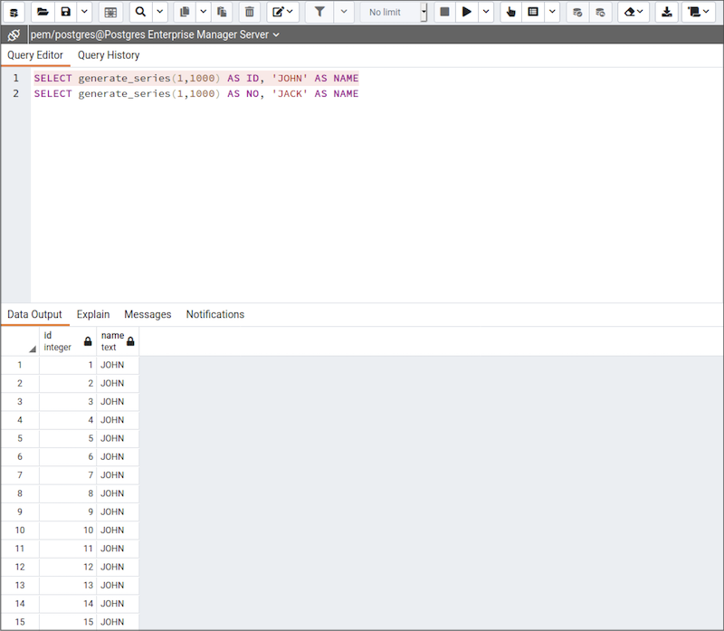

The message returned by the server when a command executes is displayed on the `Messages` tab. If the command is successful, the `Messages` tab displays execution details.


Options on the `Edit` menu offer functionality that helps with code formatting and commenting:

-   The auto-indent feature will automatically indent text to the same depth as the previous line when you press the Return key.
-   Block indent text by selecting two or more lines and pressing the Tab key.
-   Implement or remove SQL style or toggle C style comment notation within your code.

You can also **drag and drop** certain objects from the treeview which can save time in typing long object names. Text containing the object name will be fully qualified with schema. Double quotes will be added if required. For functions and procedures, the function name along with parameter names will be pasted in the Query Tool.

**The Data Output Panel**

The `Data Output` panel displays data and statistics generated by the most recently executed query.


The `Data Output` tab displays the result set of the query in a table format. You can:

-   Select and copy from the displayed result set.
-   Use the `Execute/Refresh` options to retrieve query execution information and set query execution options.
-   Use the `Save results to file` icon to save the content of the `Data Output` tab as a comma-delimited file.
-   Edit the data in the result set of a SELECT query if it is updatable.

<div id="updatable-result-set" class="registered_link"></div>

A result set is updatable if:

-   All columns are either selected directly from a single table, or are not table columns at all (e.g. concatenation of 2 columns). Only columns that are selected directly from the table are editable, other columns are read-only.
-   All the primary key columns or OIDs of the table are selected in the result set.

Any columns that are renamed or selected more than once are also read-only.

Editable and read-only columns are identified using pencil and lock icons (respectively) in the column headers.

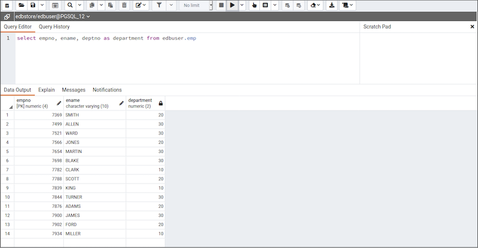

The psycopg2 driver version should be equal to or above 2.8 for updatable query result sets to work.

An updatable result set is identical to the [Data Grid](04_editgrid/#data-grid) in View/Edit Data mode, and can be modified in the same way.

If Auto-commit is off, the data changes are made as part of the ongoing transaction, if no transaction is ongoing a new one is initiated. The data changes are not committed to the database unless the transaction is committed.

If any errors occur during saving (for example, trying to save NULL into a column with NOT NULL constraint) the data changes are rolled back to an automatically created SAVEPOINT to ensure any previously executed queries in the ongoing transaction are not rolled back.

All rowsets from previous queries or commands that are displayed in the `Data Output` panel will be discarded when you invoke another query; open another query tool browser tab to keep your previous results available.

### Explain Panel

To generate the `Explain` or `Explain Analyze` plan of a query, click on `Explain` or `Explain Analyze` button in the toolbar.

More options related to `Explain` and `Explain Analyze` can be selected from the drop down on the right side of `Explain Analyze` button in the toolbar.

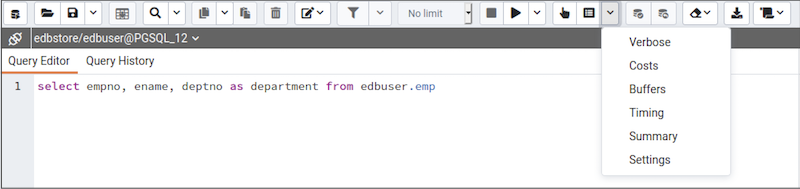

Please note that pgAdmin generates the `Explain [Analyze]` plan in JSON format.

On successful generation of `Explain` plan, it will create three tabs/panels under the Explain panel.

-   Graphical

Please note that `EXPLAIN VERBOSE` cannot be displayed graphically. Click on a node icon on the `Graphical` tab to review information about that item; a popup window will display on the right side with the information about the selected object. For information on JIT statistics, triggers and a summary, Click on the button top-right corner; a similar popup window will be displayed when appropriate.

Use the download button on top left corner of the `Explain` canvas to download the plan as an SVG file.

!!! Note
    Download as SVG is not supported on Internet Explorer.


Note that the query plan that accompanies the `Explain analyze` is available on the `Data Output` tab.

-   Table

`Table` tab shows the plan details in table format, it generates table format similar to `explain.depsez.com`. Each row of the table represent the data for a `Explain Plan Node`. It may contain the node information, exclusive timing, inclusive timing, actual vs planned rows differences, actual rows, planned rows, loops.

background color of the exclusive, inclusive, and Rows X columns may vary based on the difference between actual vs planned.

If percentage of the exclusive/inclusive timings of the total query time is: > 90 - Red color > 50 - Orange (between red and yellow) color > 10 - Yellow color

If planner mis-estimated number of rows (actual vs planned) by 10 times - Yellow color 100 times - Orange (between Red and Yellow) color 1000 times - Red color

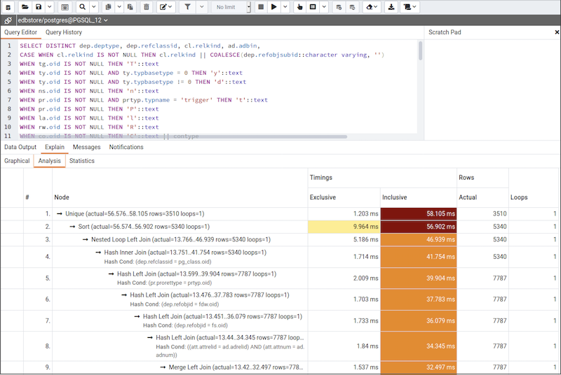

-   Statistics

`Statistics` tab shows two tables: 1. Statistics per Plan Node Type 2. Statistics per Table


### Messages Panel

Use the `Messages` tab to view information about the most recently executed query:


If the server returns an error, the error message will be displayed on the `Messages` tab, and the syntax that caused the error will be underlined in the SQL editor. If a query succeeds, the `Messages` tab displays how long the query took to complete and how many rows were retrieved:


*Query tool output information*

### Query History Panel

Use the `Query History` tab to review activity for the current session:


The Query History tab displays information about recent commands:

-   The date and time that a query was invoked.
-   The text of the query.
-   The number of rows returned by the query.
-   The amount of time it took the server to process the query and return a result set.
-   Messages returned by the server (not noted on the `Messages` tab).
-   The source of the query (indicated by icons corresponding to the toolbar).

You can show or hide the queries generated internally by pgAdmin (during 'View/Edit Data' or 'Save Data' operations).

To erase the content of the `Query History` tab, select `Clear history` from the `Clear` drop-down menu.

Query History is maintained across sessions for each database on a per-user basis when running in Query Tool mode. In View/Edit Data mode, history is not retained. By default, the last 20 queries are stored for each database. This can be adjusted in <span class="title-ref">config_local.py</span> by overriding the <span class="title-ref">MAX_QUERY_HIST_STORED</span> value.

### Connection Status

Use the `Connection status` feature to view the current connection and transaction status by clicking on the status icon in query tool:

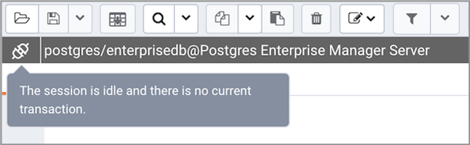

Change connection +\*\*\*\*\*\*\*\*\*\*\*\*\*\*\*\*\*

User can connect to another server or database from existing open session of query tool.

-   Click on the connection link next to connection status.
-   Now click on the *&lt;New Connection>* option from the dropdown.

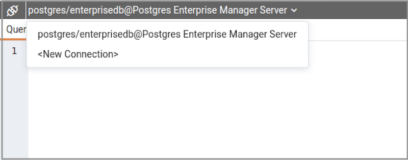

-   Now select server, database, user, and role to connect and click OK.


-   A newly created connection will now get listed in the options.
-   To connect, select the newly created connection from the dropdown list.

### Macros

Query Tool Macros enable you to execute pre-defined SQL queries with a single key press. Pre-defined queries can contain the placeholder $SELECTION$. Upon macro execution, the placeholder will be replaced with the currently selected text in the Query Editor pane of the Query Tool.


To create a macro, select the *Manage Macros* option from the *Macros* menu on the *Query Tool*. Select the key you wish to use, enter the name of the macro, and the query, optionally including the selection placeholder, and then click the *Save* button to store the macro.


To clear a macro, select the macro on the *Manage Macros* dialogue, and then click the *Clear* button.


The server will prompt you for confirmation to clear the macro.


To clear all macros, click on the *Clear* button on left side of the key. The server will prompt you for confirmation to clear all the rows.

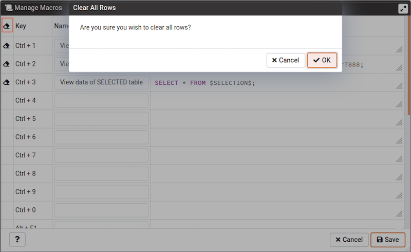

To execute a macro, simply select the appropriate shortcut keys, or select it from the *Macros* menu.


---
8.3&nbsp;&nbsp;&nbsp;&nbsp;&nbsp;&nbsp;&nbsp;&nbsp;&nbsp;&nbsp;Interpreting Graphical Query Plans
---

<div id="pem_interpreting_graphical_query" class="registered_link"></div>

The graphical explain plan provides clues that can help you identify the aspects of the selected query that consume the most resources; within the diagram, thicker lines indicate the portions of the query that are expected to take the most processing time.

To view a graphical interpretation of an executed query, select `Explain` or `Explain Analyze` from the `Execute/Refresh` drop-down menu. Please note that you can use the `Explain Options` pull-aside menu to specify the level of detail displayed for each node.


Hover over an icon within the plan to view details for the selected node:


Each query operator (within the selected query) is represented in the graphical display by an icon. The table below describes the Advanced Server query operators:

| Icon                                                                    | Represents                              | Description                                                                                                                                                                                                                                          |
| ----------------------------------------------------------------------- | --------------------------------------- | ---------------------------------------------------------------------------------------------------------------------------------------------------------------------------------------------------------------------------------------------------- |
|                        | Result Set                              | The Result Set icon represents a simple result set in the query plan. Typically, a Result Set operator is used to evaluate a query that does not fetch data from a table.                                                                            |
|                           | Aggregate                               | The server creates an Aggregate operator whenever the query invokes an aggregate function (a function that returns a value computed from multiple rows). Aggregate functions include: AVG(), COUNT(), MAX(), MIN(), STDDEV(), SUM(), and VARIANCE(). |
|            | Window Aggregate                        | The server may use a Window aggregate operator to implement windowed aggregate functions; a windowed aggregate function is a function that returns a value computed from a set of rows within the input.                                             |
|                                    | Seek                                    | The server may use a Seek operator in any plan that includes an Index Scan operator. The Seek operator represents a probe into the heap to fetch the tuple that corresponds to an index entry (found by the Index Scan operator).                    |
|                            | Seq Scan                                | The server may use a Seq scan (sequential scan) to read through a table from beginning to end.                                                                                                                                                       |
|                        | Index Scan                              | The server may use an Index scan operator to read through a table in the order specified in the index.                                                                                                                                               |
|                            | CTE Scan                                | The server may use a CTE Scan operator if the query performs a scan of a common table expression.                                                                                                                                                    |
|                  | Tuple ID Scan                           | The server uses a Tuple ID scan if the query uses the Tuple ID (ctid) as a constraint in a WHERE clause.                                                                                                                                             |
|                                  | Group                                   | The server may use a Group operator when the query includes a GROUP BY clause. The operator requires a single input set ordered by the target column(s).                                                                                             |
|                                    | Sort                                    | The server may use a Sort operator when a query includes an ORDER BY clause to impose an order on a result set.                                                                                                                                      |
|                                  | Limit                                   | The server may use the Limit operator to limit the size of a result set (when a query includes the LIMIT or OFFSET clause).                                                                                                                          |
|                             | Sub Plan                                | The server may use a Subplan operator for queries that include subselects.                                                                                                                                                                           |
|                                | Unique                                  | The server may use the Unique operator to remove duplicate values from a result set; the diagram will include a Unique operator if the query includes a DISTINCT clause.                                                                             |
| 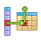                                   | Hash                                    | The server may use a Hash operator when joining two input sets that are not ordered by the column that controls the join.                                                                                                                            |
| 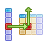               | Hash Semi-Join                          | The server may use a Hash Semi-Join operator to evaluate a query that joins two tables, but returns data from only one of those tables.                                                                                                              |
| 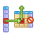               | Hash Anti-Join                          | The server may use a Hash Anti-Join operator to evaluate a query that includes a NOT IN clause.                                                                                                                                                      |
|                          | Anti-Join                               | The server may use an Anti-Join operator to evaluate a query that includes a NOT IN clause.                                                                                                                                                          |
|                                    | Join                                    | The server may use a Join operator when joining two input sets that are ordered by the column that controls the join.                                                                                                                                |
| 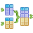             | Recursive Union                         | The server may use a Recursive Union operator if the query includes a WITH RECURSIVE clause.                                                                                                                                                         |
|                    | Set Operator                            | The server may use a Set operator if the query includes an INTERSECT, INTERSECT ALL, EXCEPT or EXCEPT ALL clause.                                                                                                                                    |
|          | Hash Set Operator (Setop) Intersect     | The server may use an Intersect Set operator if the query includes an INTERSECT clause.                                                                                                                                                              |
|        | Hash Set Operator (Setop) Intersect All | The server may use an Intersect Set operator if the query includes an INTERSECT ALL.                                                                                                                                                                 |
|          | Hash Set Operator (Setop) Except        | The server may use an Except Set operator if the query includes an EXCEPT.                                                                                                                                                                           |
|  | Hash Set Operator (Setop) Except All    | The server may use an Except All Set operator if the query includes an EXCEPT ALL clause.                                                                                                                                                            |
|                      | Materialize                             | The server may choose to use a Materialize operator for a subselect operation (a nested query).                                                                                                                                                      |
|                                | Append                                  | The server may use an Append operator to implement queries that contain a UNION clause.                                                                                                                                                              |
|                      | Nested Loop                             | The server may use a Nested Loop operator to perform a join between two tables. When implementing a nested loop, the server searches for rows from the inner table that match the corresponding row in the outer table.                              |
| 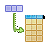                       | Merge Join                              | The server may use a Merge Join operator to join two tables. A Merge Join requires two sets of inputs, where each set is ordered by the column used for the comparison.                                                                              |
|              | Merge Semi-Join                         | The server may use a Merge Semi-Join operator to evaluate a query that joins two tables, but returns data from only one of those tables.                                                                                                             |
| 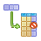             | Merge Anti-Join                         | The server may use a Merge Anti-Join operator to evaluate a query that includes a NOT IN clause.                                                                                                                                                     |
|  | Nested Loop Semi-Join                   | The server may use a Nested Semi-Join operator to evaluate a query that joins two tables, but returns data fro m only one of those tables.                                                                                                           |
|  | Nested Loop Anti-Join                   | The server may use a Nested Anti-Join operator to evaluate a query that includes a NOT IN clause.                                                                                                                                                    |
| 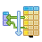                   | Bitmap Index                            | The server may use a Bitmap Index operator when locating a subset of rows in an indexed table.                                                                                                                                                       |
| 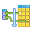                     | Bitmap Heap                             | The server may use a Bitmap Heap operator when the query returns a subset of rows from an indexed table.                                                                                                                                             |

While you cannot directly specify the execution plan of a query, you can use indexes, configuration parameters and optimizer hints to direct Advanced Server as it selects from the query plans presented by the server. See the following resources for more information about query optimization:

-   For more information about interpreting and understanding a query plan, see Using EXPLAIN, in the PostgreSQL documentation.
-   For information about using PEM's Index Advisor, see the EDB Postgres Advanced Server Guide, available from the EnterpriseDB website at [www.enterprisedb.com](http://www.enterprisedb.com).
-   For information about using configuration parameters to influence query plans, see Query Planning, in the PostgreSQL documentation.
-   For more information about using Oracle-compatible optimizer hints, see the EDB Postgres Advanced Server Oracle Compatibility Developer's Guide, available from the EnterpriseDB website at [www.enterprisedb.com](http://www.enterprisedb.com).

---
8.4&nbsp;&nbsp;&nbsp;&nbsp;&nbsp;&nbsp;&nbsp;&nbsp;&nbsp;&nbsp;Reviewing and Editing Data
---

<div id="editgrid" class="registered_link"></div>

To review or modify data, right click on a table or view name in the `Browser` tree control. When the context menu opens, use the `View/Edit Data` menu to specify the number of rows you would like to display in the editor panel.


To modify the content of a table, each row in the table must be uniquely identifiable. If the table definition does not include an OID or a primary key, the displayed data is read only. Note that views cannot be edited; updatable views (using rules) are not supported.

The editor features a toolbar that allows quick access to frequently used options, and a work environment divided into two panels:

-   The upper panel displays the SQL command that was used to select the content displayed in the lower panel.
-   The lower panel (the Data Grid) displays the data selected from the table or view.

**The View/Edit Data Toolbar**

The toolbar includes context-sensitive icons that provide shortcuts to frequently performed tasks.


Hover over an icon to display a tooltip that describes the icon's functionality.

| Icon              | Behavior                                                                                                                                                                                                                                                                                                                                                                                                                                                                                                                                                                                                                                                                                                                                                                                                                                                                                                                                                                     | Shortcut    |
| ----------------- | ---------------------------------------------------------------------------------------------------------------------------------------------------------------------------------------------------------------------------------------------------------------------------------------------------------------------------------------------------------------------------------------------------------------------------------------------------------------------------------------------------------------------------------------------------------------------------------------------------------------------------------------------------------------------------------------------------------------------------------------------------------------------------------------------------------------------------------------------------------------------------------------------------------------------------------------------------------------------------- | ----------- |
| `Save`            | Use the `Save` icon to save your changes to the currently displayed table contents.                                                                                                                                                                                                                                                                                                                                                                                                                                                                                                                                                                                                                                                                                                                                                                                                                                                                                          |             |
| `Find`            | Use options on the `Find` menu to access Search and Replace functionality or to Jump to another line.                                                                                                                                                                                                                                                                                                                                                                                                                                                                                                                                                                                                                                                                                                                                                                                                                                                                        | Ctrl/Cmd +F |
| `Copy`            | Click the `Copy` icon to copy the currently selected data.                                                                                                                                                                                                                                                                                                                                                                                                                                                                                                                                                                                                                                                                                                                                                                                                                                                                                                                   | Ctrl+C      |
| `Paste Row`       | Click the `Paste Row` icon to paste the content that is currently on the clipboard.                                                                                                                                                                                                                                                                                                                                                                                                                                                                                                                                                                                                                                                                                                                                                                                                                                                                                          |             |
| `Delete Row`      | Use the `Delete Row` icon to delete all the selected rows from the output panel.                                                                                                                                                                                                                                                                                                                                                                                                                                                                                                                                                                                                                                                                                                                                                                                                                                                                                             |             |
| `Filter`          | Click the `Filter` icon to open a dialog that allows you to write and apply a filter for the content currently displayed in the output panel. Click the down arrow to open the `Filter` drop-down menu and select from pre-defined options:<br /><br /><br />Use options on the `Filter` menu to quick-sort or quick-filter the data set:<br />-   Filter: This option opens a dialog that allows you to define a filter. A filter is a condition that is supplied to an arbitrary WHERE clause that restricts the result set.     <br /> -   Remove Filter: This option removes all selection / exclusion filter conditions.     <br /> -   By Selection: This option refreshes the data set and displays only those rows whose column value matches the value in the cell currently selected.     <br /> -   Exclude Selection: This option refreshes the data set and excludes those rows whose column value matches the value in the cell currently selected.     <br /> |             |
| `No limit`        | Use the `No limit` drop-down listbox to specify how many rows to display in the output panel. Select from: `No limit` (the default), `1000 rows`, `500 rows`, or `100 rows`.                                                                                                                                                                                                                                                                                                                                                                                                                                                                                                                                                                                                                                                                                                                                                                                                 |             |
| `Execute/Refresh` | Click the `Execute/Refresh` icon to execute the SQL command that is displayed in the top panel. If you have not saved modifications to the content displayed in the data grid, you will be prompted to confirm the execution. To preserve your changes before refreshing the content, click the `Save` toolbar button before executing the refresh.                                                                                                                                                                                                                                                                                                                                                                                                                                                                                                                                                                                                                          | F5          |
| `Stop`            | Click the `Stop` icon to cancel the execution of the currently running query.                                                                                                                                                                                                                                                                                                                                                                                                                                                                                                                                                                                                                                                                                                                                                                                                                                                                                                |             |
| `Clear History`   | Use the `Clear History` drop-down menu to erase the contents of the `History` tab.                                                                                                                                                                                                                                                                                                                                                                                                                                                                                                                                                                                                                                                                                                                                                                                                                                                                                           |             |
| `Download as CSV` | Click the `Download as CSV` icon to download the result set of the current query to a comma-separated list. You can control the CSV settings through `Preferences -> SQL Editor -> CSV output` dialogue.                                                                                                                                                                                                                                                                                                                                                                                                                                                                                                                                                                                                                                                                                                                                                                     | F8          |

**The Data Grid**

The top row of the data grid displays the name of each column, the data type, and if applicable, the number of characters allowed. A column that is part of the primary key will additionally be marked with \[PK].

<div id="data-grid" class="registered_link"></div>

To modify the displayed data:

-   To change a numeric value within the grid, double-click the value to select the field. Modify the content in the square in which it is displayed.
-   To change a non-numeric value within the grid, double-click the content to access the edit bubble. After modifying the contentof the edit bubble, click the `Save` button to display your changes in the data grid, or `Cancel` to exit the edit bubble without saving.

To enter a newline character, click Ctrl-Enter or Shift-Enter. Newline formatting is only displayed when the field content is accessed via an edit bubble.

To add a new row to the table, enter data into the last (unnumbered) row of the table. As soon as you store the data, the row is assigned a row number, and a fresh empty line is added to the data grid.

To write a SQL NULL to the table, simply leave the field empty. When you store the new row, the will server fill in the default value for that column. If you store a change to an existing row, the value NULL will explicitly be written.

To write an empty string to the table, enter the special string '' (two single quotes) in the field. If you want to write a string containing solely two single quotes to the table, you need to escape these quotes, by typing ''

To delete a row, press the `Delete` toolbar button. A popup will open, asking you to confirm the deletion.

To commit the changes to the server, select the `Save` toolbar button. Modifications to a row are written to the server automatically when you select a different row.

**Geometry Data Viewer**

If PostGIS is installed, you can view GIS objects in a map by selecting row(s) and clicking the 'View Geometry' button in the column. If no rows are selected, the entire data set will be rendered:


You can adjust the layout by dragging the title of the panel. To view the properties of the geometries directly in map, just click the specific geometry:


Notes:

-   `Supported data types:` The Geometry Viewer supports 2D and 3DM geometries in EWKB format including <span class="title-ref">Point, LineString, Polygon MultiPoint, MultiLineString, MultiPolygon and GeometryCollection</span>.
-   `SRIDs:` If there are geometries with different SRIDs in the same column, the viewer will render geometries with the same SRID in the map. If SRID=4326 the OSM tile layer will be added into the map.
-   `Data size:` For performance reasons, the viewer will render no more than 100000 geometries, totaling up to 20MB.
-   `Internet access:` An internet connection is required for the Geometry Viewer to function correctly.

**Sort/Filter options dialog**

You can access `Sort/Filter options dialog` by clicking on Sort/Filter button. This allows you to specify an SQL Filter to limit the data displayed and data sorting options in the edit grid window:


-   Use `SQL Filter` to provide SQL filtering criteria. These will be added to the "WHERE" clause of the query used to retrieve the data. For example, you might enter:

```sql
id > 25 AND created > '2018-01-01'
```

-   Use `Data Sorting` to sort the data in the output grid

To add new column(s) in data sorting grid, click on the \[+] icon.

-   Use the drop-down `Column` to select the column you want to sort.
-   Use the drop-down `Order` to select the sort order for the column.

To delete a row from the grid, click the trash icon.

-   Click the `Help` button (?) to access online help.
-   Click the `Ok` button to save work.
-   Click the `Close` button to discard current changes and close the dialog.


---
8.4.1&nbsp;&nbsp;&nbsp;&nbsp;&nbsp;&nbsp;&nbsp;&nbsp;&nbsp;&nbsp;View/Edit Data Filter
---

<div id="viewdata_filter" class="registered_link"></div>

You can access `Data Filter dialog` by clicking on `Filtered Rows` toolbar button visible on the Browser panel or by selecting *View/Edit Data -> Filtered Rows* context menu option.

This allows you to specify an SQL Filter to limit the data displayed in the edit grid window:


<div class="note">

<div class="title">

Note

</div>

Use SHIFT + ENTER keys to apply filter.

</div>

---
8.5&nbsp;&nbsp;&nbsp;&nbsp;&nbsp;&nbsp;&nbsp;&nbsp;&nbsp;&nbsp;Schema Diff
---

<div id="schema_diff_feature" class="registered_link"></div>

**Schema Diff** is a feature that allows you to compare objects between two database or two schemas. Use the `Tools` menu to access Schema Diff.

The Schema Diff feature allows you to:

> -   Compare and synchronize the database objects (from source to target).
> -   Visualize the differences between database objects.
> -   List the differences in SQL statement for target database objects.
> -   Generate synchronization scripts.

!!! Note
    > -   The source and target database servers must be of the same major version.
    > -   If you compare two **schemas** then dependencies won't be resolved.

Click on *Schema Diff* under the *Tools* menu to open a selection panel. To compare **databases** choose the source and target servers, and databases. To compare **schemas** choose the source and target servers, databases, and schemas. After selecting the objects, click on the *Compare* button.

You can open multiple copies of `Schema Diff` in individual tabs simultaneously. To close a copy of Schema Diff, click the \*X\* in the upper-right hand corner of the tab bar. You can rename the panel title by right-clicking and select the "Rename Panel" option.


Use the [Preferences](../03_toc_pem_client/04_preferences/#preferences) dialog to specify following:

> -   *Schema Diff* should open in a new browser tab. Set *Open in new browser tab* option to true.
> -   *Schema Diff* should ignore the whitespaces while comparing string objects. Set *Ignore whitespaces* option to true.
> -   *Schema Diff* should ignore the owner while comparing objects. Set *Ignore owner* option to true.

The `Schema Diff` panel is divided into two panels; an Object Comparison panel and a DDL Comparison panel.

### The Schema Diff Object Comparison Panel

In the object comparison panel, you can select the source and target servers of the same major version, and databases to be compared. You can select any server listed under the browser tree whether it is connected or disconnected. If you select a server that is not connected then it will prompt you for the password before using the server.

Next, select the databases that will be compared. The databases can be the same or different (and within the same server or from different servers).


After you select servers and databases, click on the *Compare* button to obtain the `Comparison Result`.

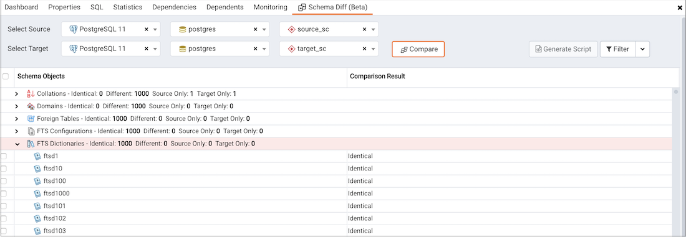

Use the drop-down lists of Database Objects to view the DDL statements.

In the upper-right hand corner of the object comparison panel is a *Filter* option that you can use to filter the database objects based on the following comparison criteria:

> -   Identical – If the object is found in both databases with the same SQL statement, then the comparison result is identical.
> -   Different – If the object is found in both databases but have different SQL statements, then the comparison result is different.
> -   Source Only – If the object is found in source database only and not in target database, then the comparison result is source only.
> -   Target Only – If the object is found in target database only and not in source database, then the comparison result is target only.

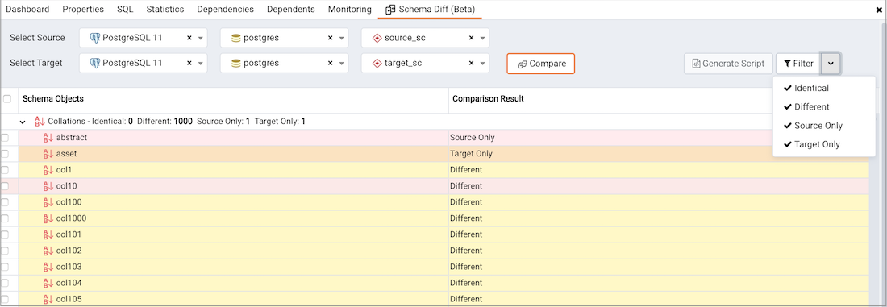

Click on any of the database objects in the object comparison panel to display the DDL Statements of that object in the DDL Comparison panel.

### Schema Diff DDL Comparison Panel

The `DDL Comparison` panel displays three columns:

-   The first column displays the DDL statement of the object from the source database.
-   The second column displays the DDL statement of the object from the target database.
-   The third column displays the difference in the SQL statement of the target database object.


You can review the DDL statements of all the database objects to check for the differences in the SQL statements.

Also, you can generate the SQL script of the differences found in the target database object based on the SQL statement of the source database object. To generate the script, select the checkboxes of the database objects in the object comparison panel and then click on the *Generate Script* button in the upper-right hand corner of the object comparison panel.

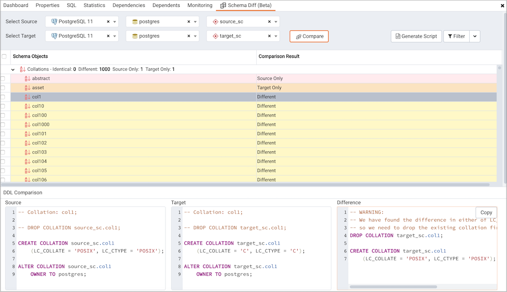

Select the database objects and click on the *Generate Script* button to open the `Query Tool` in a new tab, with the difference in the SQL statement displayed in the `Query Editor`.

If you have clicked on the database object to check the difference generated in the `DDL Comparison` Panel, and you have not selected the checkbox of the database object, PEM will open the `Query Tool` in a new tab, with the differences in the SQL statements displayed in the `Query Editor`.

You can also use the `Copy` button to copy the difference generated in the `DDL Comparison` panel.

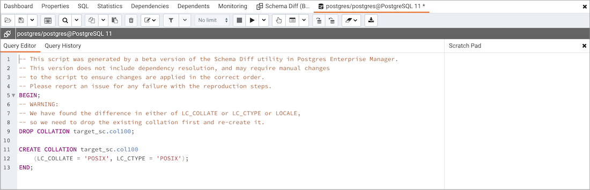

Apply the SQL Statement in the target database to synchronize the databases.

---
9&nbsp;&nbsp;&nbsp;&nbsp;&nbsp;&nbsp;&nbsp;&nbsp;&nbsp;&nbsp;Configuring pgBouncer for use with PEM Agents
---

<div id="toc_pem_pgbouncer" class="registered_link"></div>

pgBouncer is a lightweight connection pooler for Postgres. You can use pgBouncer to limit the number of connections from the PEM Agent towards the Postgres Enterprise Manager (PEM) server on a non-Windows machine.

Contents:


---
9.1&nbsp;&nbsp;&nbsp;&nbsp;&nbsp;&nbsp;&nbsp;&nbsp;&nbsp;&nbsp;Connecting PEM to pgBouncer
---

<div id="pem_pgbouncer_server_agent_connection" class="registered_link"></div>

Each PEM agent connects to the PEM database server using the SSL certificates for each individual user. For example, an agent with ID#1 connects to the PEM database server using the agent1 user.

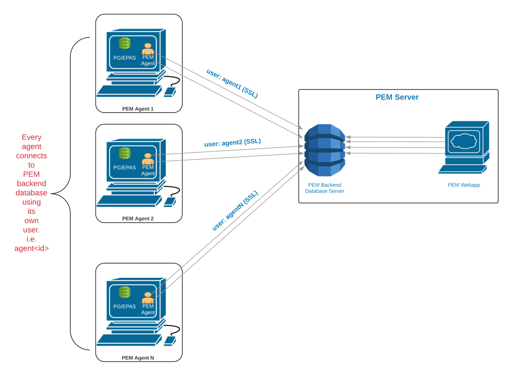

Prior to PEM version 7.5, the following limitations did not allow use of the connection pooler between the PEM server and PEM agent: \* The PEM agent uses an SSL Certificate to connect the PEM database server. \* It uses an individual user identifier when connecting to the PEM database server. EnterpriseDB has modified the PEM agent to allow the agent to use a common database user (instead of the dedicated agent users) to connect the PEM database server.

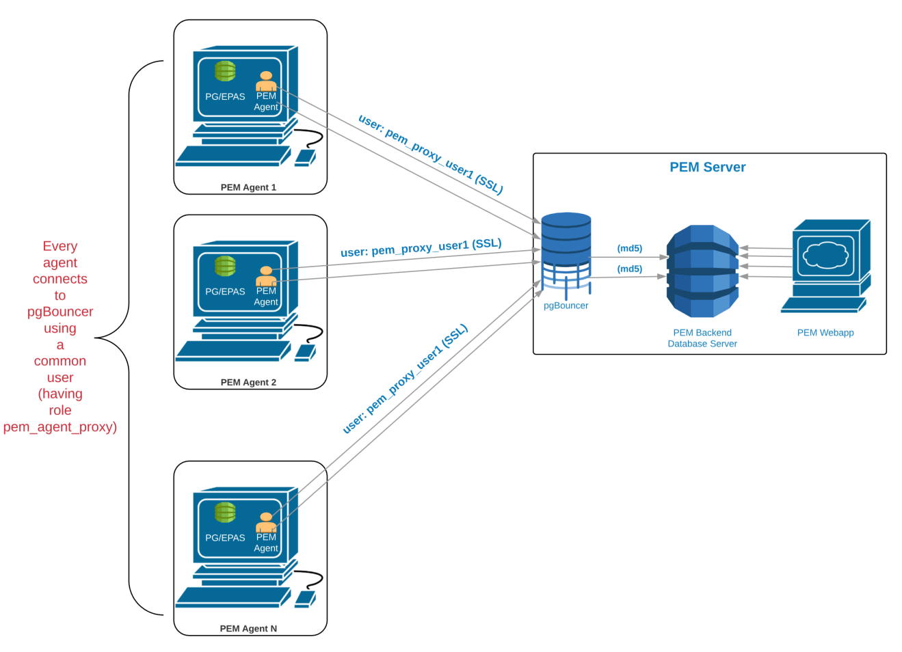

We recommend using pgBouncer versions equal to or later than version 1.9.0 as the connection pooler. Since versions 1.9.0 or later support cert authentication; PEM Agents can connect to pgBouncer using SSL certificates.

---
9.2&nbsp;&nbsp;&nbsp;&nbsp;&nbsp;&nbsp;&nbsp;&nbsp;&nbsp;&nbsp;Preparing the PEM Server for pgBouncer Connections
---

<div id="pem_pgbouncer_preparing_dbserver" class="registered_link"></div>

You must configure the PEM database server to accept connections from pgBouncer; the following example demonstrates the steps required to prepare the PEM database server.

1.  Create a dedicated user named pgbouncer on the PEM database server. For example:

    ```
    pem=# CREATE USER pgbouncer PASSWORD 'ANY_PASSWORD' LOGIN;
    CREATE ROLE
    ```

2.  Create a user named pem_admin1 (a non-super user) with pem_admin and pem_agent_pool role membership on the PEM database server. For example:

    ```
    pem=# CREATE USER pem_admin1 PASSWORD 'ANY_PASSWORD' LOGIN CREATEROLE;
    CREATE ROLE
    pem=# GRANT pem_admin, pem_agent_pool TO pem_admin1;
    GRANT ROLE
    ```

3.  Grant CONNECT privilege to the pgbouncer user on the pem database. For example:

    ```
    pem=# GRANT CONNECT ON DATABASE pem TO pgbouncer ;GRANT USAGE ON SCHEMA pem TO pgbouncer;
    GRANT
    ```

4.  Grant USAGE privilege to the pgbouncer user for the pem schema on the pem database. For example:

    ```
    pem=# GRANT USAGE ON SCHEMA pem TO pgbouncer;
    GRANT
    ```

5.  Grant EXECUTE privilege to the pgbouncer user on the pem.get_agent_pool_auth(text) function in the pem database. For example:

    ```
    pem=# GRANT EXECUTE ON FUNCTION pem.get_agent_pool_auth(text) TO pgbouncer;
    GRANT
    ```

6.  Use the pem.create_proxy_agent_user(varchar) function to create a user named pem_agent_user1 on the PEM database server. The function will create a user with the same name with a random password, and grant `pem_agent` and `pem_agent_pool` roles to the user. This allows pgBouncer to use a proxy user on behalf of the agent. For example:

    ```
    pem=# SELECT pem.create_proxy_agent_user('pem_agent_user1');
    create_proxy_agent_user
    -------------------------
     (1 row)
    ```

7.  Add the following entries to the start of the `pg_hba.conf` file of the PEM database server; this will allow pgBouncer user to connect to the pem database using the md5 authentication method. For example:

    ```
    # Allow the PEM agent proxy user (used by
    # pgbouncer) to connect the to PEM server using
    # md5

    local pem pgbouncer,pem_admin1 md5
    ```

After configuring the PEM server, you should configure pgBouncer.

---
9.3&nbsp;&nbsp;&nbsp;&nbsp;&nbsp;&nbsp;&nbsp;&nbsp;&nbsp;&nbsp;Configuring pgBouncer
---

<div id="pem_pgbouncer_configuring_pgBouncer" class="registered_link"></div>

You must configure pgBouncer to work with the PEM database server. In our example, we will run pgBouncer as the enterprisedb system user. The following steps outline the process of configuring pgBouncer (version >= 1.9).

1.  Open a terminal window and navigate into the pgBouncer directory.

2.  Change the owner of the etc directory for pgBouncer (where pgbouncer.ini resides) to enterprisedb, and change the directory permissions to 0700. For example:

    ```
    $ chown enterprisedb:enterprisedb /etc/edb/pgbouncer1.9
    $ chmod 0700 /etc/edb/pgbouncer1.9
    ```

3.  Change the contents of the pgbouncer.ini or edb-pgbouncer.ini file as follows:

    ```
    [databases]
    ;; Change the pool_size according to maximum connections allowed
    ;; to the PEM database server as required.
    ;; 'auth_user' will be used for authenticate the db user (proxy
    ;; agent user in our case)
    pem = port=5444 host=/tmp dbname=pem auth_user=pgbouncer pool_size=80 pool_mode=transaction
    * = port=5444 host=/tmp dbname=pem auth_user=pgbouncer pool_size=10
    [pgbouncer]
    logfile = /var/log/edb/pgbouncer1.9/edb-pgbouncer-1.9.log
    pidfile = /var/run/edb/pgbouncer1.9/edb-pgbouncer-1.9.pid
    listen_addr = *
    ;; Agent needs to use this port to connect the pem database now
    listen_port = 6432
    ;; Require to support for the SSL Certificate authentications
    ;; for PEM Agents
    client_tls_sslmode = require
    ;; These are the root.crt, server.key, server.crt files present
    ;; in the present under the data directory of the PEM database
    ;; server, used by the PEM Agents for connections.  
    client_tls_ca_file = /var/lib/edb/as11/data/root.crt
    client_tls_key_file = /var/lib/edb/as11/data/server.key
    client_tls_cert_file = /var/lib/edb/as11/data/server.crt
    ;; Use hba file for client connections
    auth_type = hba
    ;; Authentication file, Reference:
    ;; https://pgbouncer.github.io/config.html#auth_file 
    auth_file = /etc/edb/pgbouncer1.9/userlist.txt 
    ;; HBA file
    auth_hba_file = /etc/edb/pgbouncer1.9/hba_file
    ;; Use pem.get_agent_pool_auth(TEXT) function to authenticate
    ;; the db user (used as a proxy agent user).
    auth_query = SELECT * FROM pem.get_agent_pool_auth($1)
    ;; DB User for administration of the pgbouncer
    admin_users = pem_admin1
    ;; DB User for collecting the statistics of pgbouncer
    stats_users = pem_admin1
    server_reset_query = DISCARD ALL
    ;; Change based on the number of agents installed/required
    max_client_conn = 500
    ;; Close server connection if its not been used in this time.
    ;; Allows to clean unnecessary connections from pool after peak.
    server_idle_timeout = 60
    ```

4.  Use the following command to create and update the /etc/edb/pgbouncer1.9/userlist.txt authentication file for pgBouncer:

    ```
    pem=# COPY (
       SELECT 'pgbouncer'::TEXT, 'pgbouncer_password'
       UNION ALL
       SELECT 'pem_admin1'::TEXT, 'pem_admin1_password'
    ) TO '/etc/edb/pgbouncer1.9/userlist.txt'
        WITH (FORMAT CSV, DELIMITER ' ', FORCE_QUOTE *);
    COPY 2
    ```

> NOTE: A super user cannot invoke the PEM authentication query function pem.get_proxy_auth(text). If the pem_admin user is a super user, you must add the password to the authentication file, which is enterprisedb in the above example.

1.  Create an HBA file (/etc/edb/pgbouncer1.9/hba_file) for pgBouncer that contains the following content:

    ```
    # Use authentication method md5 for the local connections to
    # connect pem database & pgbouncer (virtual) database. 
    local pgbouncer all md5

    # Use authentication method md5 for the remote connections to
    # connect to pgbouncer (virtual database) using enterprisedb
    # user.
    host pgbouncer,pem pem_admin1 0.0.0.0/0 md5
    # Use authentication method cert for the TCP/IP connections to
    # connect the pem database using pem_agent_user1
    hostssl pem pem_agent_user1 0.0.0.0/0 cert
    ```

2.  Change the owner of the HBA file (/etc/edb/pgbouncer1.9/hba_file) to enterprisedb, and change the directory permissions to 0600. For example:

    ```
    $ chown enterprisedb:enterprisedb /etc/edb/pgbouncer1.9/hba_file
    $ chmod 0600 /etc/edb/pgbouncer1.9/hba_file
    ```

3.  Enable the pgBouncer service, and start the service. For example:

    ```
    $ systemctl enable edb-pgbouncer-1.9
    Created symlink from /etc/systemd/system/multi-user.target.wants/edb-pgbouncer-1.9.service to /usr/lib/systemd/system/edb-pgbouncer-1.9.service.
    $ systemctl start edb-pgbouncer-1.9
    ```

---
9.4&nbsp;&nbsp;&nbsp;&nbsp;&nbsp;&nbsp;&nbsp;&nbsp;&nbsp;&nbsp;Configuring the PEM Agent to use pgBouncer
---

<div id="pem_pgbouncer_configuring_pem_agent" class="registered_link"></div>

You can use an RPM package to install a PEM Agent; for detailed installation information, please see the PEM Installation Guide, available from the [EnterpriseDB website](https://www.enterprisedb.com/resources/product-documentation)

Please note that PEM Agent which is responsible for sending SNMP notifications should not be configured with pgBouncer. For Example - If default PEM Agent installed along with PEM Server is used for SNMP notifications, then it should not be configured with pgBouncer.

### Configuring a New PEM Agent (installed using an RPM)

After using an RPM package to install the PEM agent, you will need to configure it to work it against a particular PEM database server. Use the following command:

```
$ PGSSLMODE=require PEM_SERVER_PASSWORD=pem_admin1_password /usr/edb/pem/agent/bin/pemworker --register-agent --pem-server 172.16.254.22 --pem-port 6432 --pem-user pem_admin1 --pem-agent-user pem_agent_user1 --display-name *Agent_Name*
Postgres Enterprise Manager Agent registered successfully!
```

In above command, the command line argument --pem-agent-user instructs the agent to create an SSL certificate and key pair for the pem_agent_user1 database user in /root/.pem directory. For example:

```
/root/.pem/pem_agent_user1.crt
/root/.pem/pem_agent_user1.key
```

They will be used by the PEM agent to connect to the PEM database server as pem_agent_user1. It will also create /usr/edb/pem/agent/etc/agent.cfg.

You will find a line mentioning the agent-user to be used in the agent.cfg configuration file. For example:

```
$ cat /usr/edb/pem/agent/etc/agent.cfg
[PEM/agent]
pem_host=172.16.254.22
pem_port=6432
agent_id=12
agent_user=pem_agent_user1
agent_ssl_key=/root/.pem/pem_agent_user1.key
agent_ssl_crt=/root/.pem/pem_agent_user1.crt
log_level=warning
log_location=/var/log/pem/worker.log
agent_log_location=/var/log/pem/agent.log
long_wait=30
short_wait=10
alert_threads=0
enable_smtp=false
enable_snmp=false
enable_webhook=false
max_webhook_retries=3
allow_server_restart=true
max_connections=0
connect_timeout=-1
connection_lifetime=0
allow_batch_probes=false
heartbeat_connection=false
```

### Configuring an Existing PEM Agent (installed using an RPM)

If you are using an existing PEM agent, you can copy the SSL certificate and key files to the target machine, and reuse the files. You will need to modify the files, adding a new parameter and replacing some parameters in the existing `agent.cfg` file.

Add a line for agent_user to be used for the agent. For example:

```
agent_user=pem_agent_user1
```

Update the port to specify the pgBouncer port. For example:

```
pem_port=6432
```

Update the certificate and key path locations. For example:

```
agent_ssl_key=/root/.pem/pem_agent_user1.key
agent_ssl_crt=/root/.pem/pem_agent_user1.crt
```

Please note: as an alternative, you can run the agent self registration, but that will create a new agent id. If you do run the agent self-registration, you must replace the new agent id with existing id, and disable the entry for the new agent id in the pem.agent table. For example:

```
pem=# UPDATE pem.agent SET active = false WHERE id = *new_agent_id*;
UPDATE 1
```

Please keep a backup of the existing SSL certificate, key file, and agent configuration file.

---
10&nbsp;&nbsp;&nbsp;&nbsp;&nbsp;&nbsp;&nbsp;&nbsp;&nbsp;&nbsp;pgAgent
---

<div id="pgagent" class="registered_link"></div>

pgAgent is a job scheduling agent for Postgres databases, capable of running multi-step batch or shell scripts and SQL tasks on complex schedules.

pgAgent is distributed independently. You can download pgAgent from the [download area](http://www.pgadmin.org/download) of the pgAdmin website.

Contents:


---
10.1&nbsp;&nbsp;&nbsp;&nbsp;&nbsp;&nbsp;&nbsp;&nbsp;&nbsp;&nbsp;Using pgAgent
---

<div id="using_pgagent" class="registered_link"></div>

pgAgent is a scheduling agent that runs and manages jobs; each job consists of one or more steps and schedules. If two or more jobs are scheduled to execute concurrently, pgAgent will execute the jobs in parallel (each with its own thread).

A step may be a series of SQL statements or an operating system batch/shell script. Each step in a given job is executed when the previous step completes, in alphanumeric order by name. Switches on the `pgAgent Job` dialog (accessed through the `Properties` context menu) allow you to modify a job, enabling or disabling individual steps as needed.

Each job is executed according to one or more schedules. Each time the job or any of its schedules are altered, the next runtime of the job is re-calculated. Each instance of pgAgent periodically polls the database for jobs with the next runtime value in the past. By polling at least once every minute, all jobs will normally start within one minute of the specified start time. If no pgAgent instance is running at the next runtime of a job, it will run as soon as pgAgent is next started, following which it will return to the normal schedule.

When you highlight the name of a defined job in the browser tree control, the `Properties` tab of the main PEM window will display details about the job, and the `Statistics` tab will display details about the job's execution.

### Security concerns

pgAgent is a very powerful tool, but does have some security considerations that you should be aware of:

**Database password** - `DO NOT` be tempted to include a password in the pgAgent connection string - on Unix systems it may be visible to all users in 'ps' output, and on Windows systems it will be stored in the registry in plain text. Instead, use a libpq `~/.pgpass` file to store the passwords for every database that pgAgent must access. Details of this technique may be found in the [PostgreSQL documentation on .pgpass file](http://www.postgresql.org/docs/current/static/libpq-pgpass.html).

**System/database access** - all jobs run by pgAgent will run with the security privileges of the pgAgent user. SQL steps will run as the user that pgAgent connects to the database as, and batch/shell scripts will run as the operating system user that the pgAgent service or daemon is running under. Because of this, it is essential to maintain control over the users that are able to create and modify jobs. By default, only the user that created the pgAgent database objects will be able to do this - this will normally be the PostgreSQL superuser.

---
10.2&nbsp;&nbsp;&nbsp;&nbsp;&nbsp;&nbsp;&nbsp;&nbsp;&nbsp;&nbsp;Installing pgAgent
---

<div id="pgagent_install" class="registered_link"></div>

pgAgent runs as a daemon on Unix systems, and a service on Windows systems. In most cases it will run on the database server itself - for this reason, pgAgent is not automatically configured when PEM is installed. In some cases however, it may be preferable to run pgAgent on multiple systems, against the same database; individual jobs may be targeted at a particular host, or left for execution by any host. Locking prevents execution of the same instance of a job by multiple hosts.

### Database setup

Before using PEM to manage pgAgent, you must create the pgAgent extension in the maintenance database registered with PEM. To install pgAgent on a PostgreSQL host, connect to the `postgres` database, and navigate through the `Tools` menu to open the Query tool. For server versions 9.1 or later, and pgAgent 3.4.0 or later, enter the following command in the query window, and click the `Execute` icon:

```
CREATE EXTENSION pgagent;
```

This command will create a number of tables and other objects in a schema called 'pgagent'.

The database must also have the pl/pgsql procedural language installed - use the PostgreSQL `CREATE LANGUAGE` command to install pl/pgsql if necessary. To install pl/pgsql, enter the following command in the query window, and click the `Execute` icon:

```
CREATE LANGUAGE plpgsql;
```

### Daemon installation on Unix

<div class="note">

<div class="title">

Note

</div>

pgAgent is available in Debian/Ubuntu (DEB) and Redhat/Fedora (RPM) packages for Linux users, as well as source code. See the [pgAdmin Website](https://www.pgadmin.org/download/). for more information.

</div>

To install the pgAgent daemon on a Unix system, you will normally need to have root privileges to modify the system startup scripts. Modifying system startup scripts is quite system-specific so you should consult your system documentation for further information.

The program itself takes few command line options, most of which are only needed for debugging or specialised configurations:

```
Usage:
  /path/to/pgagent [options] <connect-string>


options:
  -f run in the foreground (do not detach from the terminal)
  -t <poll time interval in seconds (default 10)>
  -r <retry period after connection abort in seconds (>=10, default 30)>
  -s <log file (messages are logged to STDOUT if not specified)>
  -l <logging verbosity (ERROR=0, WARNING=1, DEBUG=2, default 0)>
```

The connection string is a standard PostgreSQL libpq connection string (see the [PostgreSQL documentation on the connection string](http://www.postgresql.org/docs/current/static/libpq.html#libpq-connect) for further details). For example, the following command line will run pgAgent against a server listening on the localhost, using a database called 'postgres', connecting as the user 'postgres':

```
/path/to/pgagent hostaddr=127.0.0.1 dbname=postgres user=postgres
```

### Service installation on Windows

<div class="note">

<div class="title">

Note

</div>

pgAgent is available in a pre-built installer if you use [EnterpriseDB's PostgreSQL Installers](https://www.enterprisedb.com/downloads/postgres-postgresql-downloads). Use the StackBuilder application to download and install it. If installed in this way, the service will automatically be created and the instructions below can be ignored.

</div>

pgAgent can install itself as a service on Windows systems. The command line options available are similar to those on Unix systems, but include an additional parameter to tell the service what to do:

```
Usage:
  pgAgent REMOVE <serviceName>
  pgAgent INSTALL <serviceName> [options] <connect-string>
  pgAgent DEBUG [options] <connect-string>

  options:
    -u <user or DOMAIN\user>
    -p <password>
    -d <displayname>
    -t <poll time interval in seconds (default 10)>
    -r <retry period after connection abort in seconds (>=10, default 30)>
    -l <logging verbosity (ERROR=0, WARNING=1, DEBUG=2, default 0)>
```

The service may be quite simply installed from the command line as follows (adjust the path as required):

```
"C:\Program Files\pgAgent\bin\pgAgent" INSTALL pgAgent -u postgres -p secret hostaddr=127.0.0.1 dbname=postgres user=postgres
```

You can then start the service at the command line using `net start pgAgent`, or from the `Services` control panel applet. Any logging output or errors will be reported in the Application event log. The DEBUG mode may be used to run pgAgent from a command prompt. When run this way, log messages will output to the command window.

---
10.3&nbsp;&nbsp;&nbsp;&nbsp;&nbsp;&nbsp;&nbsp;&nbsp;&nbsp;&nbsp;Creating a pgAgent Job
---

<div id="pgagent_jobs" class="registered_link"></div>

pgAgent is a scheduling agent that runs and manages jobs; each job consists of steps and schedules.

To create or manage a job, use the Browser tree control to browse to the server on which the pgAgent database objects were created. The tree control will display a `pgAgent Jobs` node, under which currently defined jobs are displayed. To add a new job, right click on the `pgAgent Jobs` node, and select `Create pgAgent Job...` from the context menu.

When the pgAgent dialog opens, use the tabs on the `pgAgent Job` dialog to define the steps and schedule that make up a pgAgent job.

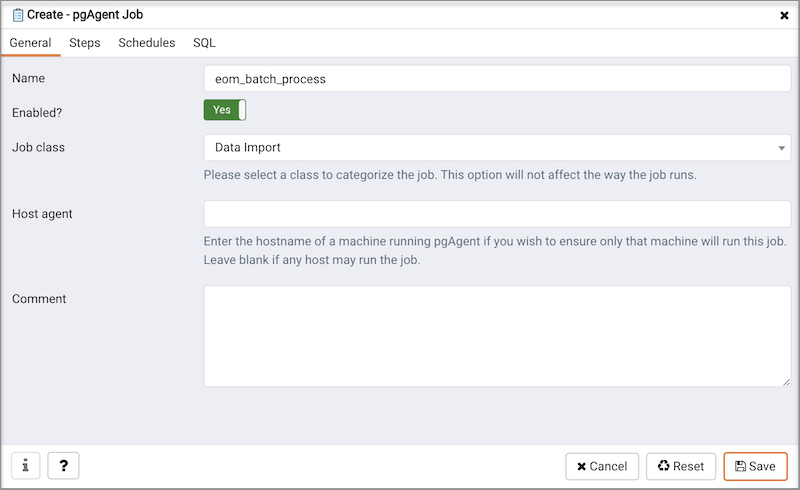

Use the fields on the `General` tab to provide general information about a job:

> -   Provide a name for the job in the `Name` field.
>
> -   Move the `Enabled` switch to the `Yes` position to enable a job, or `No` to disable a job.
>
> -   Use the `Job Class` drop-down to select a class (for job categorization).
>
> -   Use the `Host Agent` field to specify the name of a machine that is running pgAgent to indicate that only that machine may execute the job. Leave the field blank to specify that any machine may perform the job.
>
>     !!! Note
>         It is not always obvious what value to specify for the Host Agent in order to target a job step to a specific machine. With pgAgent running on the required machines and connected to the scheduler database, you can use the following query to view the hostnames as reported by each agent:
>
>     ```
>     SELECT jagstation FROM pgagent.pga_jobagent
>     ```
>
>     Use the hostname exactly as reported by the query in the Host Agent field.
>
> -   Use the `Comment` field to store notes about the job.

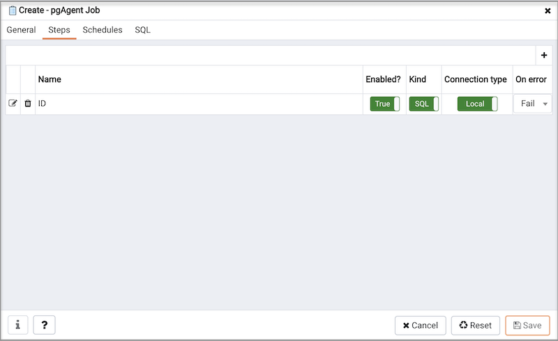

Use the `Steps` tab to define and manage the steps that the job will perform. Click the Add icon (+) to add a new step; then click the compose icon (located at the left side of the header) to open the step definition dialog:

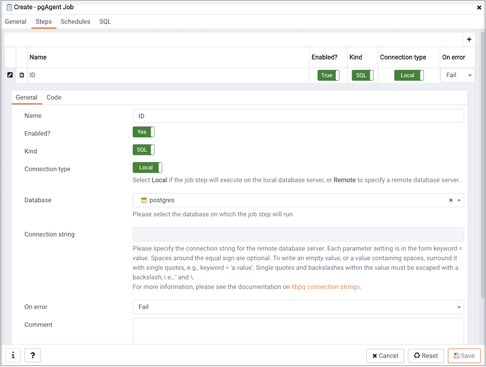

Use fields on the step definition dialog to define the step:

> -   Provide a name for the step in the `Name` field; please note that steps will be performed in alphanumeric order by name.
> -   Use the `Enabled` switch to include the step when executing the job (`True`) or to disable the step (`False`).
> -   Use the `Kind` switch to indicate if the job step invokes SQL code (`SQL`) or a batch script (`Batch`).
>
> > -   If you select `SQL`, use the `Code` tab to provide SQL code for the step.
> > -   If you select `Batch`, use the `Code` tab to provide the batch script that will be executed during the step.

<div class="note">

<div class="title">

Note

</div>

The fields `Connection type`, `Database` and `Connection string` are only applicable when `SQL` is selected because `Batch` cannot be run on remote servers.

</div>

-   Use the `Connection type` switch to indicate if the step is performed on a local server (`Local`) or on a remote host (`Remote`). If you specify a remote connection should be used for the step, the `Connection string` field will be enabled, and you must provide a libpq-style connection string.
-   Use the `Database` drop-down to select the database on which the job step will be performed.
-   Use the `Connection string` field to specify a libpq-style connection string to the remote server on which the step will be performed. For more information about writing a connection string, please see the [PostgreSQL documentation](https://www.postgresql.org/docs/current/libpq.html#libpq-connect).
-   Use the `On error` drop-down to specify the behavior of pgAgent if it encounters an error while executing the step. Select from:
    -   `Fail` - Stop the job if you encounter an error while processing this step.
    -   `Success` - Mark the step as completing successfully, and continue.
    -   `Ignore` - Ignore the error, and continue.

> -   Use the `Comment` field to provide a comment about the step.

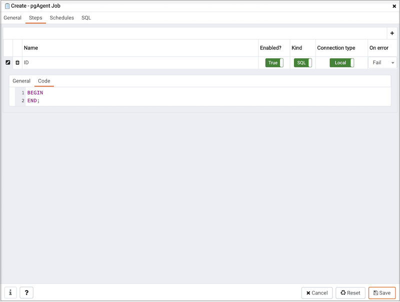

Use the context-sensitive field on the step definition dialog's `Code` tab to provide the SQL code or batch script that will be executed during the step:

> -   If the step invokes SQL code, provide one or more SQL statements in the `SQL query` field.
> -   If the step performs a batch script, provide the script in the `Script` field. If you are running on a Windows server, standard batch file syntax must be used. When running on a Linux server, any shell script may be used, provided that a suitable interpreter is specified on the first line (e.g. `#!/bin/sh`).

When you've provided all of the information required by the step, click the compose icon to close the step definition dialog. Click the add icon (+) to add each additional step, or select the `Schedules` tab to define the job schedule.

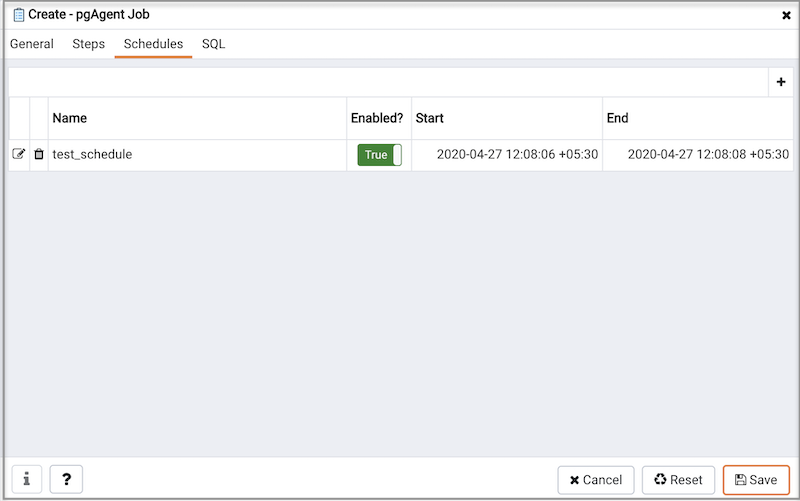

Click the Add icon (+) to add a schedule for the job; then click the compose icon (located at the left side of the header) to open the schedule definition dialog:

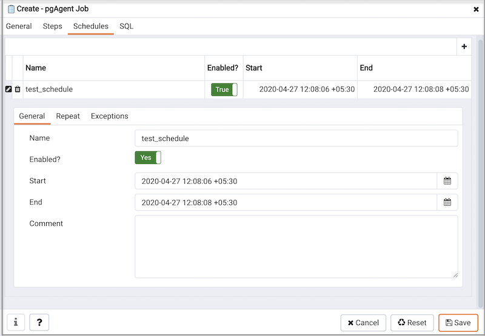

Use the fields on the schedule definition tab to specify the days and times at which the job will execute.

> -   Provide a name for the schedule in the `Name` field.
> -   Use the `Enabled` switch to indicate that pgAgent should use the schedule (`Yes`) or to disable the schedule (`No`).
> -   Use the calendar selector in the `Start` field to specify the starting date and time for the schedule.
> -   Use the calendar selector in the `End` field to specify the ending date and time for the schedule.
> -   Use the `Comment` field to provide a comment about the schedule.

Select the `Repeat` tab to define the days on which the schedule will execute.

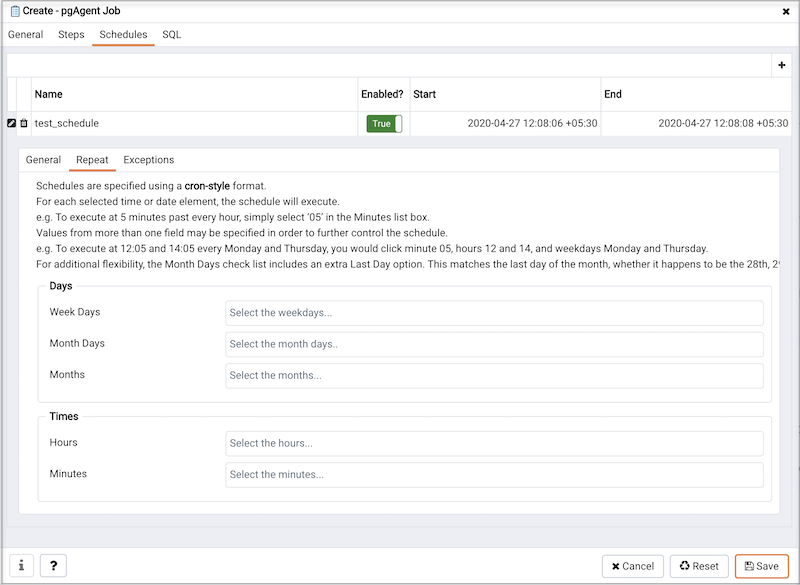

Use the fields on the `Repeat` tab to specify the details about the schedule in a cron-style format. The job will execute on each date or time element selected on the `Repeat` tab.

Click within a field to open a list of valid values for that field; click on a specific value to add that value to the list of selected values for the field. To clear the values from a field, click the X located at the right-side of the field.

Use the fields within the `Days` box to specify the days on which the job will execute:

> -   Use the `Week Days` field to select the days on which the job will execute.
> -   Use the `Month Days` field to select the numeric days on which the job will execute. Specify the `Last Day` to indicate that the job should be performed on the last day of the month, irregardless of the date.
> -   Use the `Months` field to select the months in which the job will execute.

Use the fields within the `Times` box to specify the times at which the job will execute:

> -   Use the `Hours` field to select the hour at which the job will execute.
> -   Use the `Minutes` field to select the minute at which the job will execute.

Select the `Exceptions` tab to specify any days on which the schedule will `not` execute.

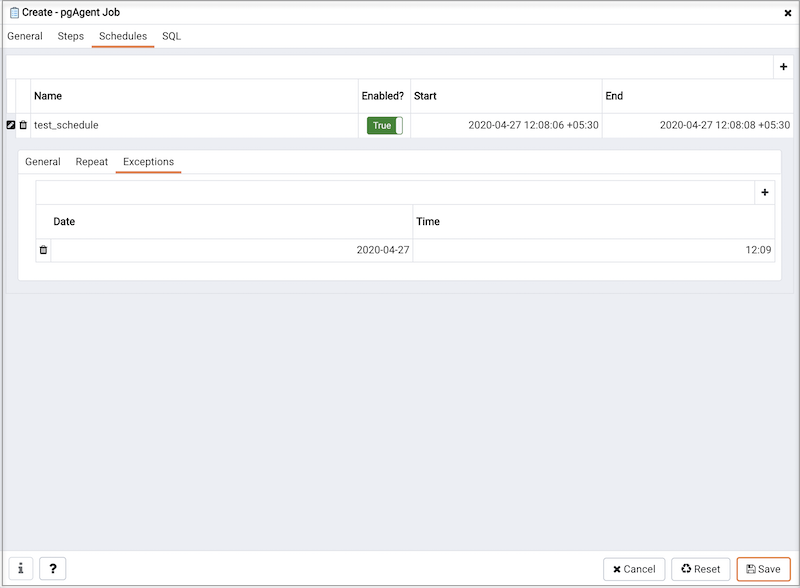

Use the fields on the `Exceptions` tab to specify days on which you wish the job to not execute; for example, you may wish for jobs to not execute on national holidays.

Click the Add icon (+) to add a row to the exception table, then:

> -   Click within the `Date` column to open a calendar selector, and select a date on which the job will not execute. Specify `<Any>` in the `Date` column to indicate that the job should not execute on any day at the time selected.
> -   Click within the `Time` column to open a time selector, and specify a time on which the job will not execute. Specify `<Any>` in the `Time` column to indicate that the job should not execute at any time on the day selected.

When you've finished defining the schedule, you can use the `SQL` tab to review the code that will create or modify your job.

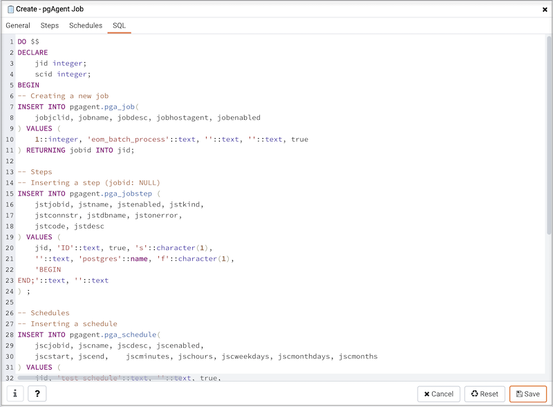

Click the `Save` button to save the job definition, or `Cancel` to exit the job without saving. Use the `Reset` button to remove your unsaved entries from the dialog.

After saving a job, the job will be listed under the `pgAgent Jobs` node of the browser tree control of the server on which it was defined. The `Properties` tab in the main PEM window will display a high-level overview of the selected job, and the `Statistics` tab will show the details of each run of the job.

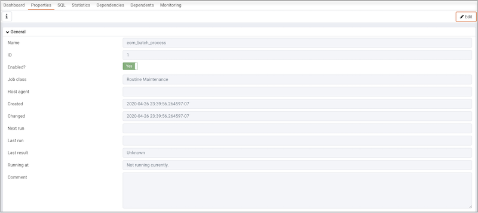

To modify an existing job or to review detailed information about a job, right-click on a job name, and select `Properties` from the context menu.

---
10.4&nbsp;&nbsp;&nbsp;&nbsp;&nbsp;&nbsp;&nbsp;&nbsp;&nbsp;&nbsp;pgAgent Steps
---

<div id="pgagent-steps" class="registered_link"></div>

Each Job consists of a number of steps, each of which may be an SQL script, or an operating system batch/shell script. Each step in a given job is run in turn, in alphanumeric name order.

Steps may be added to a job through the job properties dialogue, or added as a sub-object. The `Properties` tab of the main PEM client window will display details of the selected step, and the `Statistics` tab will display details of each run of the step, including and output or errors from the script.


Each step consists of the details shown on the screenshot below, most of which are self-explanatory. If `Kind` is set to SQL, then it goes without saying that a database against which to run the script must be selected. If set to `Batch`, the database/connection string should be left blank. The `On Error` option controls how failure of this step will affect the status of the overall job.

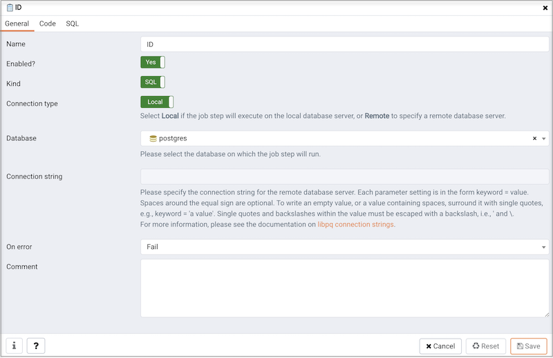

The `Definition` tab contains a single text box into which the step script should be entered. For SQL steps, this should be a series of one or more SQL statements. For batch jobs, when running on a Windows server, standard batch file syntax must be used, and when running on a *nix server, any shell script may be used, provided that a suitable interpreter is specified on the first line (e.g.*#!/bin/sh\*).

---
10.5&nbsp;&nbsp;&nbsp;&nbsp;&nbsp;&nbsp;&nbsp;&nbsp;&nbsp;&nbsp;pgAgent Schedules
---

<div id="pgagent-schedules" class="registered_link"></div>

Each Job is executed according to one or more schedules. Each time the job or any of its schedules are altered, the next runtime of the job is re-calculated. Each instance of pgAgent periodically polls the database for jobs with the next runtime value in the past. By polling at least once every minute, all jobs will normally start within one minute of the specified start time. If no pgAgent instance is running at the next runtime of a job, it will run as soon as pgAgent is next started, following which it will return to the normal schedule.

Schedules may be added to a job through the job properties dialogue, or added as a sub-object. The `Properties` tab of the main PEM client window will display details of the selected schedule.

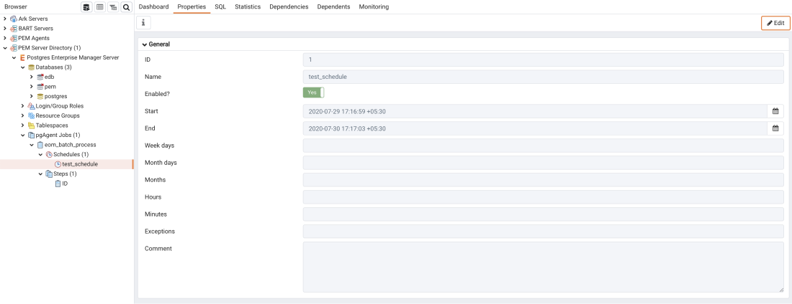

Each schedule consists of the basic details such as a name, whether or not it is enable and a comment. In addition, a start date and time is specified (before which the schedule has no effect), and optionally an end date and time (after which the schedule has no effect).

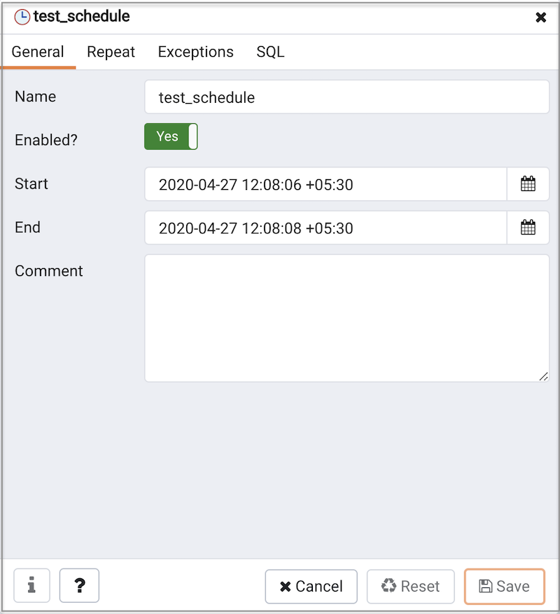

Schedules are specified using a cron-style format. For each selected time or date element, the schedule will execute. For example, to execute at 5 minutes past every hour, simply tick '5' in the `Minutes` list box. Values from more than one field may be specified in order to further control the schedule. For example, to execute at 12:05 and 14:05 every Monday and Thursday, you would tick minute 5, hours 12 and 14, and weekdays Monday and Thursday. For additional flexibility, the `Month Days` check list includes an extra `Last Day` option. This matches the last day of the month, whether it happens to be the 28th, 29th, 30th or 31st.

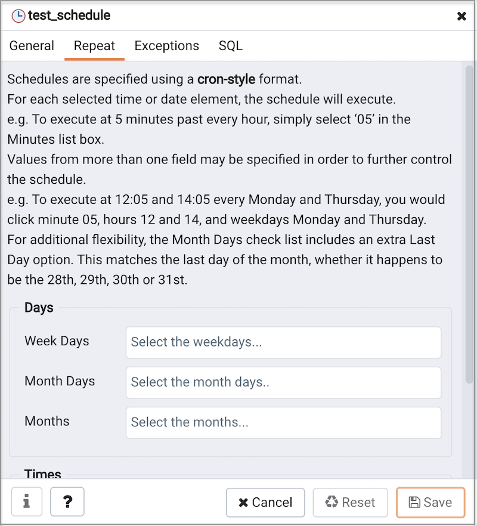

On occasion it may be desirable to specify an exception for a schedule - for example, you may not want a schedule to fire on a particular national holiday. To achieve this, each schedule may have a list of date and/or time exceptions attached to it. If a schedule lands on an exception, that instance will be skipped, and the following occurance will become the next runtime.

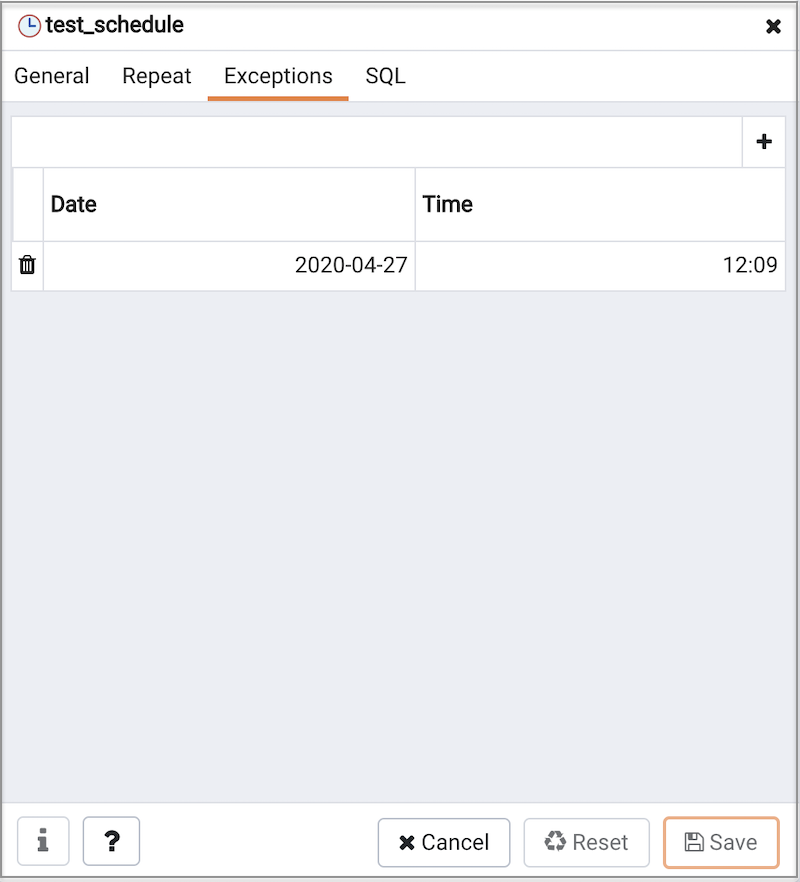

---
11&nbsp;&nbsp;&nbsp;&nbsp;&nbsp;&nbsp;&nbsp;&nbsp;&nbsp;&nbsp;Appendices
---

<div id="appendices" class="registered_link"></div>

Contents:

| --------------------------------- | ---------------------- | ----------------------------------------------------------------------------- |

---
11.1&nbsp;&nbsp;&nbsp;&nbsp;&nbsp;&nbsp;&nbsp;&nbsp;&nbsp;&nbsp;Licence
---

<div id="licence" class="registered_link"></div>

pgAdmin is released under the [PostgreSQL Licence](http://www.postgresql.org/about/licence), which is a liberal Open Source licence similar to BSD or MIT, and approved by the Open Source Initiative. The copyright for the project source code, website and documentation is attributed to the [pgAdmin Development Team](https://www.pgadmin.org/development/team.php).

---
11.2&nbsp;&nbsp;&nbsp;&nbsp;&nbsp;&nbsp;&nbsp;&nbsp;&nbsp;&nbsp;The MIT Kerberos Licence
---

<div id="kerberos" class="registered_link"></div>

Postgres Enterprise Manager uses PostgreSQL's libpq library which may be linked with MIT Kerberos Libraries on some distributions. The MIT Kerberos licence is included below:

### Kerberos Copyright

This software is being provided to you, the LICENSEE, by the Massachusetts Institute of Technology (M.I.T.) under the following license. By obtaining, using and/or copying this software, you agree that you have read, understood, and will comply with these terms and conditions:

Permission to use, copy, modify and distribute this software and its documentation for any purpose and without fee or royalty is hereby granted, provided that you agree to comply with the following copyright notice and statements, including the disclaimer, and that the same appear on ALL copies of the software and documentation, including modifications that you make for internal use or for distribution:

Copyright 1992-2004 by the Massachusetts Institute of Technology. All rights reserved.

THIS SOFTWARE IS PROVIDED "AS IS", AND M.I.T. MAKES NO REPRESENTATIONS OR WARRANTIES, EXPRESS OR IMPLIED. By way of example, but not limitation, M.I.T. MAKES NO REPRESENTATIONS OR WARRANTIES OF MERCHANTABILITY OR FITNESS FOR ANY PARTICULAR PURPOSE OR THAT THE USE OF THE LICENSED SOFTWARE OR DOCUMENTATION WILL NOT INFRINGE ANY THIRD PARTY PATENTS, COPYRIGHTS, TRADEMARKS OR OTHER RIGHTS.

The name of the Massachusetts Institute of Technology or M.I.T. may NOT be used in advertising or publicity pertaining to distribution of the software. Title to copyright in this software and any associated documentation shall at all times remain with M.I.T., and USER agrees to preserve same.

Project Athena, Athena, Athena MUSE, Discuss, Hesiod, Kerberos, Moira, OLC, X Window System, and Zephyr are trademarks of the Massachusetts Institute of Technology (MIT). No commercial use of these trademarks may be made without prior written permission of MIT.

---
11.3&nbsp;&nbsp;&nbsp;&nbsp;&nbsp;&nbsp;&nbsp;&nbsp;&nbsp;&nbsp;The OpenSSL Licence
---

<div id="openssl" class="registered_link"></div>

Postgres Enterprise Manager uses code from the OpenSSL project to provide support for SSL encrypted connections. The OpenSSL licence is included below:

**Copyright (c) 1998-2011 The OpenSSL Project. All rights reserved.**

Redistribution and use in source and binary forms, with or without modification, are permitted provided that the following conditions are met:

-   Redistributions of source code must retain the above copyright notice, this list of conditions and the following disclaimer.
-   Redistributions in binary form must reproduce the above copyright notice, this list of conditions and the following disclaimer in the documentation and/or other materials provided with the distribution.
-   All advertising materials mentioning features or use of this software must display the following acknowledgment: "This product includes software developed by the OpenSSL Project for use in the OpenSSL Toolkit. (<http://www.openssl.org/>)"
-   The names "OpenSSL Toolkit" and "OpenSSL Project" must not be used to endorse or promote products derived from this software without prior written permission. For written permission, please contact [openssl-core@openssl.org](mailto:openssl-core@openssl.org).
-   Products derived from this software may not be called "OpenSSL" nor may "OpenSSL" appear in their names without prior written permission of the OpenSSL Project.
-   Redistributions of any form whatsoever must retain the following acknowledgment: "This product includes software developed by the OpenSSL Project for use in the OpenSSL Toolkit (<http://www.openssl.org/>)"

THIS SOFTWARE IS PROVIDED BY THE OpenSSL PROJECT ''AS IS'' AND ANY EXPRESSED OR IMPLIED WARRANTIES, INCLUDING, BUT NOT LIMITED TO, THE IMPLIED WARRANTIES OF MERCHANTABILITY AND FITNESS FOR A PARTICULAR PURPOSE ARE DISCLAIMED. IN NO EVENT SHALL THE OpenSSL PROJECT OR ITS CONTRIBUTORS BE LIABLE FOR ANY DIRECT, INDIRECT, INCIDENTAL, SPECIAL, EXEMPLARY, OR CONSEQUENTIAL DAMAGES (INCLUDING, BUT NOT LIMITED TO, PROCUREMENT OF SUBSTITUTE GOODS OR SERVICES; LOSS OF USE, DATA, OR PROFITS; OR BUSINESS INTERRUPTION) HOWEVER CAUSED AND ON ANY THEORY OF LIABILITY, WHETHER IN CONTRACT, STRICT LIABILITY, OR TORT (INCLUDING NEGLIGENCE OR OTHERWISE) ARISING IN ANY WAY OUT OF THE USE OF THIS SOFTWARE, EVEN IF ADVISED OF THE POSSIBILITY OF SUCH DAMAGE.

This product includes cryptographic software written by Eric Young ([eay@cryptsoft.com](eay@cryptsoft.com)). This product includes software written by Tim Hudson ([tjh@cryptsoft.com](tjh@cryptsoft.com)).

---
11.4&nbsp;&nbsp;&nbsp;&nbsp;&nbsp;&nbsp;&nbsp;&nbsp;&nbsp;&nbsp;The SNMP++ Licence
---

<div id="snmp++" class="registered_link"></div>

Postgres Enterprise Manager uses code from the SNMP++ project to send snmp v1/v2 notifications. The SNMP++ licence is included below:

**Copyright (c) 2001-2010 Jochen Katz, Frank Fock**

This software is based on SNMP++2.6 from Hewlett Packard:

Copyright (c) 1996 Hewlett-Packard Company

ATTENTION: USE OF THIS SOFTWARE IS SUBJECT TO THE FOLLOWING TERMS. Permission to use, copy, modify, distribute and/or sell this software and/or its documentation is hereby granted without fee. User agrees to display the above copyright notice and this license notice in all copies of the software and any documentation of the software. User agrees to assume all liability for the use of the software; Hewlett-Packard and Jochen Katz make no representations about the suitability of this software for any purpose. It is provided "AS-IS" without warranty of any kind, either express or implied. User hereby grants a royalty-free license to any and all derivatives based upon this software code base.

---
11.5&nbsp;&nbsp;&nbsp;&nbsp;&nbsp;&nbsp;&nbsp;&nbsp;&nbsp;&nbsp;The jquery table sort Licence
---

<div id="jquery_table_sort" class="registered_link"></div>

TABLESORT.JS Copyright, Andy Croxall ([mitya@mitya.co.uk](mailto:mitya@mitya.co.uk)) For documentation and demo see <http://mitya.co.uk/scripts/Animated-table-sort-REGEXP-friendly-111>

USAGE This script may be used, distributed and modified freely but this header must remain in tact. For usage info and demo, including info on args and params, see [www.mitya.co.uk/scripts](http://www.mitya.co.uk/scripts)

---
12&nbsp;&nbsp;&nbsp;&nbsp;&nbsp;&nbsp;&nbsp;&nbsp;&nbsp;&nbsp;Release Notes
---

EDB Postgres Enterprise Manager release notes provide the information on the features and improvements in each release. This page includes release notes for major release and minor (bugfix) releases. Select your version from the list below to see the release notes for it.


---
12.1&nbsp;&nbsp;&nbsp;&nbsp;&nbsp;&nbsp;&nbsp;&nbsp;&nbsp;&nbsp;PEM v8.0.1
---

Release date: 2021-03-03

### Features

[Issue #5091](https://redmine.postgresql.org/issues/5091) - Make Statistics, Dependencies, Dependants tabs closable and the user can add them back using the 'Add panel' option.

### Housekeeping

[Issue #5338](https://redmine.postgresql.org/issues/5338) - Improve code coverage and API test cases for pgAgent.  
[Issue #5343](https://redmine.postgresql.org/issues/5343) - Improve code coverage and API test cases for Debugger.  
[Issue #6079](https://redmine.postgresql.org/issues/6079) - Updated mimetype from 'text/javascript' to 'application/javascript' as 'text/javascript' is obsolete.

### Bug fixes

PEM-3549 - Fixed the issue where latest BART backups were not displaying on BART dashboard refresh. \[Support ticket # 1046037]  
PEM-3577 - Allow superuser name containing "-" provided during configuring configure-pem-server.sh script. \[Support ticket # 1055435]  
PEM-3881 - Close the operating system resources properly during batch probe and command execution to avoid 'too many open files' error. \[Support ticket # 1048713]  
PEM-3845 - Bundle pgaevent dll in agent windows installer to suppress event message log error. \[Support ticket # 1106021]  
PEM-3901 - Fixed the unicode string handling support in pemAgent. \[Support ticket # 1153153]  
PEM-3903 - Fixed the issue where BART restore was failing when agent was not bound with BART server. \[Support ticket # 1129454]  
[Issue #4892](https://redmine.postgresql.org/issues/4892) - Fixed an issue where pressing the back button will show another instance of the main page inside of the Query Tool tab.  
[Issue #5282](https://redmine.postgresql.org/issues/5282) - Added 'Count Rows' option to the partition sub tables.  
[Issue #5488](https://redmine.postgresql.org/issues/5488) - Improve the explain plan details by showing popup instead of tooltip on clicking of the specified node.  
[Issue #5571](https://redmine.postgresql.org/issues/5571) - Added support for expression in exclusion constraints.  
[Issue #5809](https://redmine.postgresql.org/issues/5809) - Fixed an issue where the focus is not properly set on the filter text editor after closing the error dialog.  
[Issue #5871](https://redmine.postgresql.org/issues/5871) - Ensure that username should be visible in the 'Connect to Server' popup when service and user name both specified.  
[Issue #5875](https://redmine.postgresql.org/issues/5875) - Ensure that the 'template1' database should not be visible after pg_upgrade.  
[Issue #5886](https://redmine.postgresql.org/issues/5886) - Fixed false error is shown while adding a new foreign key from the table dialog when a foreign key already exists with Auto FK Index set to true.  
[Issue #5905](https://redmine.postgresql.org/issues/5905) - Fixed an issue where the Save button is enabled by default in Macro.  
[Issue #5906](https://redmine.postgresql.org/issues/5906) - Remove extra line after Manage Macros menu while clearing all macros.  
[Issue #5907](https://redmine.postgresql.org/issues/5907) - Ensure that 'Clear All Rows' should not work if there is no existing macro available and the user does not specify any value.  
[Issue #5929](https://redmine.postgresql.org/issues/5929) - Fixed an issue where the server is disconnected error message displayed if the user creates Macro with invalid SQL.  
[Issue #5965](https://redmine.postgresql.org/issues/5965) - Ensure that the macro query result should be download properly.  
[Issue #5973](https://redmine.postgresql.org/issues/5973) - Added appropriate help message and a placeholder for letting users know about the account password expiry for Login/Group Role.  
[Issue #5991](https://redmine.postgresql.org/issues/5991) - Ensure that dirty indicator (\*) should not be visible when renaming the tabs.  
[Issue #5992](https://redmine.postgresql.org/issues/5992) - Fixed an issue where escape character is shown when the server/database name has some special characters.  
[Issue #5997](https://redmine.postgresql.org/issues/5997) - Updated Flask-BabelEx to the latest.  
[Issue #5998](https://redmine.postgresql.org/issues/5998) - Fixed an issue where schema diff doesn't show the result of compare if source schema has tables with RLS.  
[Issue #6003](https://redmine.postgresql.org/issues/6003) - Fixed an issue where an illegal argument is showing for trigger SQL when a trigger is created for View.  
[Issue #6045](https://redmine.postgresql.org/issues/6045) - Fixed autocomplete issue where it is not showing any suggestions if the schema name contains escape characters.  
[Issue #6046](https://redmine.postgresql.org/issues/6046) - Fixed an issue where the state of the Save File icon does not match the dirty editor indicator.  
[Issue #6047](https://redmine.postgresql.org/issues/6047) - Fixed an issue where the dirty indicator stays active even if all changes were undone.  
[Issue #6058](https://redmine.postgresql.org/issues/6058) - Ensure that the rename panel should be disabled when the SQL file opened in the query tool.  
[Issue #6061](https://redmine.postgresql.org/issues/6061) - Fixed extra parentheses issue around joins for Views.  
[Issue #6065](https://redmine.postgresql.org/issues/6065) - Fixed accessibility issues in schema diff module.  
[Issue #6069](https://redmine.postgresql.org/issues/6069) - Fixed an issue on refreshing files in Query Tool.  
[Issue #6077](https://redmine.postgresql.org/issues/6077) - Fixed accessibility issues in various dialogs.  
[Issue #6084](https://redmine.postgresql.org/issues/6084) - Fixed TypeError exception in schema diff when selected any identical object.  
[Issue #6087](https://redmine.postgresql.org/issues/6087) - Fixed an issue where the dependencies tab showing multiple owners for the objects having shared dependencies.  
[Issue #6098](https://redmine.postgresql.org/issues/6098) - Fixed an issue of deleting records when the user tries to delete multiple records.  
[Issue #6120](https://redmine.postgresql.org/issues/6120) - Ensure that the user should be able to specify an older date for the account expiration of the role/user.  
[Issue #6121](https://redmine.postgresql.org/issues/6121) - Fixed an issue where the database list in the new connection window is not visible.  
[Issue #6122](https://redmine.postgresql.org/issues/6122) - Added informative message when there is no difference found for schema diff.  
[Issue #6128](https://redmine.postgresql.org/issues/6128) - Fixed an issue where sequences are not created.  
[Issue #6140](https://redmine.postgresql.org/issues/6140) - Ensure that verbose logs should be visible for Utility(Backup, Maintenance) jobs.  
[Issue #6144](https://redmine.postgresql.org/issues/6144) - Ensure that the current value of the sequence should be ignored while comparing using schema diff.  
[Issue #6157](https://redmine.postgresql.org/issues/6157) - Fixed an issue where strike-through is not visible for rows selected for deletion after scrolling.  
[Issue #6178](https://redmine.postgresql.org/issues/6178) - Fixed an issue where the user unable to change the background color for a server.  
[Issue #6187](https://redmine.postgresql.org/issues/6187) - Limit the upgrade check to run once per day.  
[Issue #6208](https://redmine.postgresql.org/issues/6208) - Fixed an issue where utility(Backup, Maintenance, ...) jobs are failing when the log level is set to DEBUG.

---
12.2&nbsp;&nbsp;&nbsp;&nbsp;&nbsp;&nbsp;&nbsp;&nbsp;&nbsp;&nbsp;PEM v8.0
---

Release date: 2020-12-09

### Features

PEM-3669 - Support new configurations of BART ('bart_socket_name') in PEM  
PEM-3612 - Enhanced the placeholders for alert script execution. \[Support Ticket # 1051538]  
PEM-3613 - Added documentation for "How to replace alert placeholders inside script". \[Support Ticket # 1051538]  
PEM-3786 - Added support for --checksum-algorithm and --disable-checksum parameters introduced in BART 2.6.0.  
PEM-2501 - Added alert details sql for template 'A user expires in N days'. \[Support Ticket # 891377]  
PEM-3684, PEM-3665 - Added alert details sql for Alert Errors, Table bloat, Dead/live tuples and few other. \[Support Ticket # 1065250]  
PEM-3802, PEM-3805 - Documented the best security practices for PEM to avoid security vulnerabilities.  
PEM-3808 - Improved installtion and upgrade guide as per customer feedback. \[Support Ticket # 1101462]  
PEM-3819 - Add webhooks for event-based alerting  
[Issue #1402](https://redmine.postgresql.org/issues/1402) - Added Macro support.  
[Issue #2519](https://redmine.postgresql.org/issues/2519) - Added support to view trigger function under the respective trigger node.  
[Issue #3318](https://redmine.postgresql.org/issues/3318) - Added support to download utility files at the client-side.  
[Issue #3794](https://redmine.postgresql.org/issues/3794) - Allow user to change the database connection from an open query tool tab.  
[Issue #4230](https://redmine.postgresql.org/issues/4230) - Added support to rename query tool and debugger tabs title.  
[Issue #4231](https://redmine.postgresql.org/issues/4231) - Added support for dynamic tab size.  
[Issue #4232](https://redmine.postgresql.org/issues/4232) - Added tab title placeholder for Query Tool, View/Edit Data, and Debugger.  
[Issue #5200](https://redmine.postgresql.org/issues/5200) - Added support to ignore the owner while comparing objects in the Schema Diff tool.  
[Issue #5857](https://redmine.postgresql.org/issues/5857) - Added documentation for Macro support.

### Housekeeping

[Issue #5328](https://redmine.postgresql.org/issues/5328) - Improve code coverage and API test cases for Foreign Tables.  
[Issue #5330](https://redmine.postgresql.org/issues/5330) - Improve code coverage and API test cases for Functions.  
[Issue #5337](https://redmine.postgresql.org/issues/5337) - Improve code coverage and API test cases for Views and Materialized Views.  
[Issue #5395](https://redmine.postgresql.org/issues/5395) - Added RESQL/MSQL test cases for Functions.  
[Issue #5497](https://redmine.postgresql.org/issues/5497) - Merged the latest code of 'pgcli' used for the autocomplete feature.  
[Issue #5938](https://redmine.postgresql.org/issues/5938) - Documentation of Storage Manager.

### Bug fixes

PEM-672 - Documented that while configuring the pem server, certificates must be present in data directory of backend database server in the installation guides. \[Support ticket # 729238]  
PEM-3184 - Fixed an issue where connections were not getting released when user disconnects the database server. \[Support Ticket # 969833]  
PEM-3737 - Fixed an issue where BART integration isn't working, when BART is installed at custom location. \[Support Ticket # 1088574]  
PEM-3791 - Do not include detail alert information while sending SNMP traps. \[Support Ticket # 1069206, # 1115277]  
PEM-3816 - Fixed the issue of making two database connections for failed login attempt which result in locking the user profile. \[Support Ticket # 1103288]  
PEM-3795 - Added python3 as prerequisite for PEM in Upgrade and migration guide.  
PEM-3799 - Package deployment and streaming replication deprecation warning is added in Upgrade and migration guide. \[Support ticket # 1021617]  
[Issue #4639](https://redmine.postgresql.org/issues/4639) - Ensure that some fields should be disabled for the trigger in edit mode.  
[Issue #4806](https://redmine.postgresql.org/issues/4806) - Added useful message when the explain plan is not used and empty.  
[Issue #4855](https://redmine.postgresql.org/issues/4855) - Fixed an issue where file extension is stripped on renaming a file.  
[Issue #5131](https://redmine.postgresql.org/issues/5131) - Ensure that 'ctrl + a' shortcut does not move the cursor in SQL editor.  
[Issue #5826](https://redmine.postgresql.org/issues/5826) - Fixed an issue where schema diff is showing identical table as different due to default vacuum settings.  
[Issue #5830](https://redmine.postgresql.org/issues/5830) - Fixed reverse engineering SQL where parenthesis is not properly arranged for View/MView definition.  
[Issue #5835](https://redmine.postgresql.org/issues/5835) - Fixed 'can't execute an empty query' message if the user change the option of Auto FK Index.  
[Issue #5841](https://redmine.postgresql.org/issues/5841) - Fixed an issue where the server is not able to connect using the service.  
[Issue #5842](https://redmine.postgresql.org/issues/5842) - Ensure that query history should be listed by date/time in descending order.  
[Issue #5843](https://redmine.postgresql.org/issues/5843) - Fixed an issue where the 'PARALLEL UNSAFE' option is missing from reverse engineering SQL of function/procedure.  
[Issue #5853](https://redmine.postgresql.org/issues/5853) - Fixed an issue where 'Rows X' column values were not visible properly for Explain Analyze in Dark theme.  
[Issue #5855](https://redmine.postgresql.org/issues/5855) - Ensure that the user should be able to change the start value of the existing sequence.  
[Issue #5858](https://redmine.postgresql.org/issues/5858) - Ensure that search object functionality works with case insensitive string.  
[Issue #5882](https://redmine.postgresql.org/issues/5882) - Fixed invalid literal issue when fetching dependencies for Materialized View.  
[Issue #5885](https://redmine.postgresql.org/issues/5885) - Fixed an issue where the user is unable to change the macro name.  
[Issue #5895](https://redmine.postgresql.org/issues/5895) - Fixed an issue where the suffix for Toast table size is not visible in the Statistics tab.  
[Issue #5911](https://redmine.postgresql.org/issues/5911) - Ensure that macros should be run on the older version of Safari and Chrome.  
[Issue #5914](https://redmine.postgresql.org/issues/5914) - Fixed an issue where a mismatch in the value of 'Estimated row' for functions.  
[Issue #5923](https://redmine.postgresql.org/issues/5923) - Fixed an issue where non-closeable tabs are getting closed.  
[Issue #5943](https://redmine.postgresql.org/issues/5943) - Ensure that folder rename should work properly in Storage Manager.  
[Issue #5950](https://redmine.postgresql.org/issues/5950) - Fixed an issue where a long file name is not visible on the process watcher dialog.  
[Issue #5953](https://redmine.postgresql.org/issues/5953) - Fixed an issue where connection to the server is on wait state if a different user is provided.  
[Issue #5959](https://redmine.postgresql.org/issues/5959) - Ensure that Grant Wizard should include foreign tables.  
[Issue #5974](https://redmine.postgresql.org/issues/5974) - Fixed an issue where the debugger's custom tab title not applied when opened in the new browser tab.  
[Issue #5978](https://redmine.postgresql.org/issues/5978) - Fixed an issue where dynamic tab title has not applied the first time for debugger panel.  
[Issue #5983](https://redmine.postgresql.org/issues/5983) - Added the appropriate server icon based on the server type in the new connection dialog.  
[Issue #5985](https://redmine.postgresql.org/issues/5985) - Fixed an issue where the process watcher dialog throws an error for the database server which is already removed.

---
12.3&nbsp;&nbsp;&nbsp;&nbsp;&nbsp;&nbsp;&nbsp;&nbsp;&nbsp;&nbsp;PEM v7.16
---

Release date: 2020-09-30

### Features

PEM-3157 - Documentation of Defining and Monitoring Postgres instances on AWS EC2 and RDS is added. \[Support Ticker #1060981]  
PEM-322 - Use the same agent-id on agent registration using '--force-registration', and regenerate the certificates. \[Support Ticket #695978]  
PEM-688 - Added capability to monitor parameters set by EFM (missingnodes, minimumstandbys and membershipcoordinator).  
PEM-2200 - Auto discover database servers installed using debian packaging.  
PEM-2578 - Allow user to schedule bulk alert blackout from PEM console. \[Support Ticket #901007]  
PEM-2651 - List all the events and display error message on tooltip in BART activities graph. \[Support Ticket #950623]  
PEM-3053 - Automate BART Obsolete backup Cleanup process in PEM. \[Support Ticket #950518]  
PEM-3054 - Manage bart-scanner from PEM console. \[Support Ticket #951184, #1027171]  
PEM-3421 - Perform EFM cluster switchover from PEM console. \[Support Ticket #1059731]  
PEM-3528 - Make the current state and related information of the alerts available through REST API  
PEM-3529 - Make the state change history of the alerts available at Agent, Server & Database through REST API  
PEM-3614 - Added details of directory creation and permissions for backups taken using BART in PEM - BART Management Features Guide \[Support Ticket #1038375]  
PEM-3615 - Allow incremental backup from a parent backup which was taken in tar.gz format. \[Support Ticket #1059420]  
[Issue #2042](https://redmine.postgresql.org/issues/2042) - Added SQL Formatter support in Query Tool.  
[Issue #3904](https://redmine.postgresql.org/issues/3904) - Replace charting library Flotr2 with ChartJS using React on the Dashboard panel.  
[Issue #4059](https://redmine.postgresql.org/issues/4059) - Added a new button to the query tool toolbar to open a new query tool window.  
[Issue #5126](https://redmine.postgresql.org/issues/5126) - Modified schema diff tool to compare two databases instead of two schemas.  
[Issue #5653](https://redmine.postgresql.org/issues/5653) - Added High Contrast (Beta) theme support.  
[Issue #5772](https://redmine.postgresql.org/issues/5772) - Warn the user when connecting to a server that is older than PEM supports.

### Housekeeping

[Issue #5323](https://redmine.postgresql.org/issues/5323) - Improve code coverage and API test cases for Foreign Data Wrapper.  
[Issue #5324](https://redmine.postgresql.org/issues/5324) - Improve code coverage and API test cases for Foreign Servers and User Mappings.  
[Issue #5327](https://redmine.postgresql.org/issues/5327) - Improve code coverage and API test cases for Schemas.  
[Issue #5332](https://redmine.postgresql.org/issues/5332) - Improve code coverage and API test cases for Columns and Constraints (Index, Foreign Key, Check, Exclusion).  
[Issue #5336](https://redmine.postgresql.org/issues/5336) - Improve code coverage and API test cases for Types.  
[Issue #5344](https://redmine.postgresql.org/issues/5344) - Improve code coverage and API test cases for Grant Wizard.  
[Issue #5731](https://redmine.postgresql.org/issues/5731) - Upgrade font awesome from v4 to v5.  
[Issue #5774](https://redmine.postgresql.org/issues/5774) - Improve code coverage and API test cases for Tables.

### Bug fixes

PEM-812/ <span class="title-ref">Issue #5830 &lt;<https://redmine.postgresql.org/issues/5830>></span> - Display parenthesis around AND/OR conditions in the same order within PEM and dba_views. Fixed reverse engineering SQL where parenthesis is not properly arranged for View/MView definition. \[Support Ticket #315838]  
PEM-2579 - Fixed issues in SNMP's MIB file reported by <https://www.simpleweb.org/ietf/mibs/validate/> \[Support Ticket #900679]  
PEM-3532 - Fixed the issue in monitoring dashboard line charts where data points were not showing correct local time information. \[Support Ticket #1023887]  
PEM-3542 - Fixed potential data type migration problem when upgrading PEM Server to PG v.12 \[Support Ticket #1044052]  
PEM-3487 - Fixed configure script issue for google cloud instance running RHEL7  
PEM-3666 - Fixed security issue related to secure flag for session cookies. \[Support Ticket #1035935]  
PEM-3667 - Fixed security issue related to information exposed in Server response header. \[Support Ticket #1035935]  
PEM-3677 - Fixed security issue related to content Security Policy (CSP) configuration. \[Support Ticket #1035935]  
PEM-3678 - Fixed security issue related to HTTP Strict Transport Security (HSTS) in server response header. \[Support Ticket #1035935]  
PEM-3679 - Fixed security issue related to session fixation. \[Support Ticket #1035935]  
PEM-3682 - Fixed security issue related to directory listing. \[Support Ticket #1035935]  
PEM-3693 - Fixed security issue in the Capacity manager report. \[Support Ticket #1035935]  
PEM-3695 - Transaction ID or timestamp must be provided during BART restore point-in time recovery operation \[Support Ticket #1067393]  
PEM-3696 - Fixed security issue in the pem configure script where it should not log sensitive informations. \[Support Ticket #1035935]  
PEM-3663 - Fixed pemworker segfault error in dmesg and messages file. \[Support Ticket #999681]  
PEM-3698 - Fixed current and previous alert state related issue during alert script execution when alert state gets clear. \[Support Ticket #1078828]  
PEM-2015 - Fixed vulnerability issues related to webserver. \[Support Ticket # 856609]  
[Issue #3767](https://redmine.postgresql.org/issues/3767) - Ensure that the original file format should be retained when saving the same file in SQL editor.  
[Issue #3791](https://redmine.postgresql.org/issues/3791) - Added missing comments in reverse engineering SQL for each column of a View.  
[Issue #4123](https://redmine.postgresql.org/issues/4123) - Fixed an issue where debugger doesn't work if the search path is set other than 'public'.  
[Issue #4216](https://redmine.postgresql.org/issues/4216) - Ensure that schema names starting with 'pg' should be visible in browser tree when standard_conforming_strings is set to off.  
[Issue #4361](https://redmine.postgresql.org/issues/4361) - Fixed ssh tunnel hang issue when the user tries to disconnect the server.  
[Issue #4387](https://redmine.postgresql.org/issues/4387) - Fixed an issue where the user is not able to insert the data if the table and columns name contains special characters.  
[Issue #4810](https://redmine.postgresql.org/issues/4810) - Fixed an issue where the user is not able to save the new row if the table is empty.  
[Issue #5137](https://redmine.postgresql.org/issues/5137) - Fixed save button enable issue when focusing in and out of numeric input field.  
[Issue #5417](https://redmine.postgresql.org/issues/5417) - Fixed and improve API test cases for the schema diff tool.  
[Issue #5426](https://redmine.postgresql.org/issues/5426) - Adjusted the height of jobstep code block to use maximum space.  
[Issue #5429](https://redmine.postgresql.org/issues/5429) - Ensure that the Dictionaries drop-down shows all the dictionaries in the FTS configuration dialog.  
[Issue #5526](https://redmine.postgresql.org/issues/5526) - Fixed an issue where copying and pasting a cell with multiple line data will result in multiple rows.  
[Issue #5530](https://redmine.postgresql.org/issues/5530) - Ensure that the referenced table should be displayed on foreign key constraints.  
[Issue #5567](https://redmine.postgresql.org/issues/5567) - Fixed an issue where conversion of bytea to the binary string results in an error.  
[Issue #5569](https://redmine.postgresql.org/issues/5569) - Fixed reverse engineered SQL for partitions when storage parameters are specified.  
[Issue #5604](https://redmine.postgresql.org/issues/5604) - Fixed an issue where the entire logs is in red text when the user runs backup and restore.  
[Issue #5632](https://redmine.postgresql.org/issues/5632) - Ensure that the user will be able to modify the start value of the Identity column.  
[Issue #5646](https://redmine.postgresql.org/issues/5646) - Ensure that RLS Policy node should be searchable using search object.  
[Issue #5652](https://redmine.postgresql.org/issues/5652) - Modified the 'Commit' and 'Rollback' query tool button icons.  
[Issue #5666](https://redmine.postgresql.org/issues/5666) - Added missing dependencies/dependent and corrected some wrongly identified.  
[Issue #5670](https://redmine.postgresql.org/issues/5670) - Fixed an issue where the error message does not have a close button on utility dialogs.  
[Issue #5675](https://redmine.postgresql.org/issues/5675) - Fixed CSRF errors when PEM opened in an iframe on safari browser.  
[Issue #5677](https://redmine.postgresql.org/issues/5677) - Fixed text color issue in explain analyze for the Dark theme.  
[Issue #5686](https://redmine.postgresql.org/issues/5686) - Fixed issue where the user was not able to update policy if the policy is created with space.  
[Issue #5689](https://redmine.postgresql.org/issues/5689) - Added the 'ORDER BY' clause for the privileges type to fix schema diff issue.  
[Issue #5710](https://redmine.postgresql.org/issues/5710) - Fixed an issue when comparing the table with a trigger throwing error in schema diff.  
[Issue #5713](https://redmine.postgresql.org/issues/5713) - Corrected DROP SQL syntax for catalog.  
[Issue #5716](https://redmine.postgresql.org/issues/5716) - Fixed an issue where ajax call continues to fire even after disconnect the database server.  
[Issue #5722](https://redmine.postgresql.org/issues/5722) - Ensure that the user should be able to drop the database even if it is connected.  
[Issue #5724](https://redmine.postgresql.org/issues/5724) - Clarify some of the differences when running in server mode in the docs.  
[Issue #5730](https://redmine.postgresql.org/issues/5730) - Resolve schema diff dependencies by selecting the appropriate node automatically and maintain the order in the generated script.  
[Issue #5732](https://redmine.postgresql.org/issues/5732) - Fixed some accessibility issues.  
[Issue #5734](https://redmine.postgresql.org/issues/5734) - Update the description of GIN and GiST indexes in the documentation.  
[Issue #5739](https://redmine.postgresql.org/issues/5739) - Ensure that the import/export feature should work with SSH Tunnel.  
[Issue #5746](https://redmine.postgresql.org/issues/5746) - Fixed an issue where --load-server does not allow loading connections that use pg_services.  
[Issue #5748](https://redmine.postgresql.org/issues/5748) - Fixed incorrect reverse engineering SQL for Foreign key when creating a table.  
[Issue #5754](https://redmine.postgresql.org/issues/5754) - Fixed an issue where schema diff is not working when providing the options to Foreign Data Wrapper, Foreign Server, and User Mapping.  
[Issue #5764](https://redmine.postgresql.org/issues/5764) - Fixed SQL for Row Level Security which is incorrectly generated.  
[Issue #5765](https://redmine.postgresql.org/issues/5765) - Fixed an issue in the query tool when columns are having the same name as javascript object internal functions.  
[Issue #5766](https://redmine.postgresql.org/issues/5766) - Fixed string indices must be integers issue for PostgreSQL &lt; 9.3.  
[Issue #5779](https://redmine.postgresql.org/issues/5779) - Remove illegal argument from trigger function in trigger DDL statement.  
[Issue #5794](https://redmine.postgresql.org/issues/5794) - Fixed excessive CPU usage by stopping the indefinite growth of the graph dataset.  
[Issue #5802](https://redmine.postgresql.org/issues/5802) - Remove maximum length on the password field in the server dialog.  
[Issue #5807](https://redmine.postgresql.org/issues/5807) - Fixed an issue where a column is renamed and then removed, then the drop SQL query takes the wrong column name.  
[Issue #5815](https://redmine.postgresql.org/issues/5815) - Fixed an issue where clicking on the 'Generate script' button shows a forever spinner due to pop up blocker.  
[Issue #5816](https://redmine.postgresql.org/issues/5816) - Ensure that the 'CREATE SCHEMA' statement should be present in the generated script if the schema is not present in the target database.  
[Issue #5820](https://redmine.postgresql.org/issues/5820) - Fixed an issue while refreshing Resource Group.  
[Issue #5833](https://redmine.postgresql.org/issues/5833) - Fixed an issue where custom sequences are not visible when show system objects are set to false.  
[Issue #5834](https://redmine.postgresql.org/issues/5834) - Ensure that the 'Remove Server Group' option is available in the context menu.  
[Issue #5839](https://redmine.postgresql.org/issues/5839) - Ensure that multiple extensions can be dropped from the properties tab.  
[Issue #5845](https://redmine.postgresql.org/issues/5845) - Fixed an issue where the query tool is not fetching more than 1000 rows for the table does not have any primary key.

---
12.4&nbsp;&nbsp;&nbsp;&nbsp;&nbsp;&nbsp;&nbsp;&nbsp;&nbsp;&nbsp;PEM v7.15
---

Release date: 2020-07-22

### Features

PEM-2457 - Added support for schema level restriction. \[Support Ticket #883404]  
PEM-2540 - Added capability to monitor the xLogReceive parameter set by EFM  
PEM-3432 - Added support to monitor PG/EPAS 13  
PEM-3445 - Support new configurations of BART ('archive_path', 'bart_socket_directory') in PEM \[Support Ticket #1015972]  
PEM-3446 - Document SNMP trap oid detailed information used by PEM \[Support Ticket #900679]  
PEM-3482 - Improve the performance diagnostics tool to show CPU usage for the active sessions along with the wait events for better performance analysis  
[Issue #5452](https://redmine.postgresql.org/issues/5452) - Added connected PEM user and connection name in the log file.  
[Issue #5468](https://redmine.postgresql.org/issues/5468) - Added option to ignore the whitespaces while comparing objects in schema diff.  
[Issue #5500](https://redmine.postgresql.org/issues/5500) - Added server group name while selecting servers in schema diff.  
[Issue #5516](https://redmine.postgresql.org/issues/5516) - Added support of Row Security Policies.  
[Issue #5576](https://redmine.postgresql.org/issues/5576) - Improve error messaging if the storage and log directories cannot be created.  
[Issue #5601](https://redmine.postgresql.org/issues/5601) - Added RLS Policy support in Schema Diff.  
[Issue #5622](https://redmine.postgresql.org/issues/5622) - Added support for permissive/restricted policy type while creating RLS Policy.

### Housekeeping

[Issue #5325](https://redmine.postgresql.org/issues/5325) - Improve code coverage and API test cases for Collations.  
[Issue #5326](https://redmine.postgresql.org/issues/5326) - Improve code coverage and API test cases for Domain and Domain Constraints.  
[Issue #5329](https://redmine.postgresql.org/issues/5329) - Improve code coverage and API test cases for FTS Configuration, FTS Parser, FTS Dictionaries, and FTS Template.  
[Issue #5333](https://redmine.postgresql.org/issues/5333) - Improve code coverage and API test cases for Indexes.  
[Issue #5334](https://redmine.postgresql.org/issues/5334) - Improve code coverage and API test cases for the Rules module.  
[Issue #5335](https://redmine.postgresql.org/issues/5335) - Improve code coverage and API test cases for Triggers and Compound Triggers.  
[Issue #5455](https://redmine.postgresql.org/issues/5455) - Refactor PEM entrypoint python file so it can be imported and is a lot more readable.  
[Issue #5493](https://redmine.postgresql.org/issues/5493) - Search object UI improvements.  
[Issue #5581](https://redmine.postgresql.org/issues/5581) - Documentation of Row Level Security Policies.

### Bug fixes

PEM-699 - "Long running queries" alert should not log autovacuum queries. \[Support Ticket #679920]  
PEM-3349 - pemworker register server help option should show the agent configuration directory path. \[Support Ticket #1001212]  
PEM-1508 - Documented about calculation of shared system memory and removed it from capacity manager metrics as is always constant. \[809378]  
PEM-3322 - Documented about system jobs and their default schedules. \[990553]  
PEM-3436 - Updated all the alert templates queries which show negative values and improve the performance while fetching the data from history tables. \[992418]  
PEM-2490 - Supported Platforms and Versions link is added to Software prerequisites section in Installation guides. \[Support Ticket #885334]  
PEM-3490 - Removed send_email from POST/PUT payload and added validation for all_low_alert_enable/high_low_alert_enable/med_low_alert_enable/low_alert_enable for their respective email group id. \[Support Ticket #1005781]  
[Issue #3591](https://redmine.postgresql.org/issues/3591) - Ensure that the query tool should display the proper error message while terminating the active session.  
[Issue #3669](https://redmine.postgresql.org/issues/3669) - Ensure that proper error should be displayed for the deleted node.  
[Issue #3694](https://redmine.postgresql.org/issues/3694) - Gracefully informed the user that the database is already connected when they click on "Connect Database...".  
[Issue #3787](https://redmine.postgresql.org/issues/3787) - Disabled the Stop process button after clicking it and added a message 'Terminating the process...' to notify the user.  
[Issue #3814](https://redmine.postgresql.org/issues/3814) - Fixed issue of error message not getting displayed when filename is empty for backup, restore, and import/export.  
[Issue #3851](https://redmine.postgresql.org/issues/3851) - Add proper indentation to the code while generating functions, procedures, and trigger functions.  
[Issue #4033](https://redmine.postgresql.org/issues/4033) - Fixed an issue where clicking on the cross button of the alert box on the login page is not working.  
[Issue #4099](https://redmine.postgresql.org/issues/4099) - Fixed the SQL help issue for EDB Postgres Advanced Server.  
[Issue #4223](https://redmine.postgresql.org/issues/4223) - Ensure that maintenance jobs should be worked properly for indexes under a materialized view.  
[Issue #4226](https://redmine.postgresql.org/issues/4226) - Fixed an issue where select all checkbox only selects the first 50 tables.  
[Issue #4235](https://redmine.postgresql.org/issues/4235) - Fixed tab indent issue on a selection of lines is deleting the content when 'use spaces == true' in the preferences.  
[Issue #4840](https://redmine.postgresql.org/issues/4840) - Ensure that 'With OID' option should be disabled while taking backup of database server version 12 and above.  
[Issue #5001](https://redmine.postgresql.org/issues/5001) - Fixed invalid literal issue when removing the connection limit for the existing role.  
[Issue #5287](https://redmine.postgresql.org/issues/5287) - Fixed dark theme-related CSS and modify the color codes.  
[Issue #5398](https://redmine.postgresql.org/issues/5398) - Fixed generated SQL issue for auto vacuum options.  
[Issue #5416](https://redmine.postgresql.org/issues/5416) - Ensure that the query tool panel gets closed when clicking on the 'Don't Save' button.  
[Issue #5422](https://redmine.postgresql.org/issues/5422) - Ensure that the dependencies tab shows correct information for Synonyms.  
[Issue #5434](https://redmine.postgresql.org/issues/5434) - Fixed an issue where the newly added table is not alphabetically added to the tree.  
[Issue #5440](https://redmine.postgresql.org/issues/5440) - Fixed list sorting issue in the schema diff tool.  
[Issue #5449](https://redmine.postgresql.org/issues/5449) - Fixed an issue while comparing the two identical schemas using the schema diff tool.  
[Issue #5450](https://redmine.postgresql.org/issues/5450) - Fixed an issue when renaming the column not added in the proper order.  
[Issue #5463](https://redmine.postgresql.org/issues/5463) - Fixed an issue where CSV download quotes numeric columns.  
[Issue #5465](https://redmine.postgresql.org/issues/5465) - Fixed an issue where the Edge browser version is showing wrong and warning message gets displayed.  
[Issue #5470](https://redmine.postgresql.org/issues/5470) - Fixed backgrid row hover issue where on hover background color is set for edit and delete cell only.  
[Issue #5481](https://redmine.postgresql.org/issues/5481) - Fixed data truncation issue when updating the data of type character with length.  
[Issue #5492](https://redmine.postgresql.org/issues/5492) - Fixed an issue where the search object is unable to locate inherited tables and constraint filters are not working.  
[Issue #5496](https://redmine.postgresql.org/issues/5496) - Fixed an issue where clicking on Select All button, not selecting all the options in pgAgent job scheduler.  
[Issue #5507](https://redmine.postgresql.org/issues/5507) - Fixed connection and version number detection issue when the database server is upgraded.  
[Issue #5539](https://redmine.postgresql.org/issues/5539) - Fixed typo in exception keyword.  
[Issue #5584](https://redmine.postgresql.org/issues/5584) - Fixed an issue where two identical tables showing different by schema diff tool.  
[Issue #5620](https://redmine.postgresql.org/issues/5620) - Fixed an issue while creating RLS Policy with the name having space.  
[Issue #5621](https://redmine.postgresql.org/issues/5621) - Remove extra brackets from reverse engineering SQL of RLS Policy.  
[Issue #5629](https://redmine.postgresql.org/issues/5629) - Fixed an issue where the user is able to edit properties when some of the collection nodes are selected.  
[Issue #5631](https://redmine.postgresql.org/issues/5631) - Fixed 'cant execute empty query' issue when remove the value of 'USING' or 'WITH CHECK' option of RLS Policy.  
[Issue #5633](https://redmine.postgresql.org/issues/5633) - Ensure that create RLS Policy menu should not be visible for catalog objects.  
[Issue #5647](https://redmine.postgresql.org/issues/5647) - Fixed an issue where difference DDL is showing the wrong SQL when changing the policy owner.  
[Issue #5673](https://redmine.postgresql.org/issues/5673) - Fixed an issue where fetching the schema throws an error if the database is not connected in Schema Diff.

---
12.5&nbsp;&nbsp;&nbsp;&nbsp;&nbsp;&nbsp;&nbsp;&nbsp;&nbsp;&nbsp;PEM v7.14
---

Release date: 2020-05-13

### Features

PEM-799 - Allow multiple agents to send emails & SNMP traps by enabling the configurations 'enable_smtp' & 'enable_snmp' in agent configuration (agent.cfg) file.  
PEM-1593 - Introduced a new state 'Unmanaged' for the database servers for which are not being not monitored by PEM, but registered with it.  
PEM-3283 - Modified the configuration script, installer & PEMAgent to generate certificates using 4096 bit key, and modified SSLUtils to sign certificates using SHA256 Hash \[Support Ticket #989497]  
PEM-3283 - PEMAgent service will not get disabled after upgrading \[Support Ticket #994563]  
PEM-3308 - Introduced new v3 version of REST API, which includes SNMP v3 support.  
[Issue #2172](https://redmine.postgresql.org/issues/2172) - Added search object functionality.  
[Issue #5154](https://redmine.postgresql.org/issues/5154) - Added accessibility support in AlertifyJS.  
[Issue #5179](https://redmine.postgresql.org/issues/5179) - Added Python 3.8 support.  
[Issue #5184](https://redmine.postgresql.org/issues/5184) - Added support for parameter toast_tuple_target and parallel_workers of the table.  
[Issue #5261](https://redmine.postgresql.org/issues/5261) - Added support of Collation, FTS Configuration, FTS Dictionary, FTS Parser, and FTS Template to the Schema Diff.  
[Issue #5262](https://redmine.postgresql.org/issues/5262) - Added support of Domain, Domain Constraints and Types to the Schema Diff.  
[Issue #5263](https://redmine.postgresql.org/issues/5263) - Added support of Foreign Tables to the Schema Diff.  
[Issue #5264](https://redmine.postgresql.org/issues/5264) - Added support of Packages, Sequences and Synonyms to the Schema Diff.  
[Issue #5399](https://redmine.postgresql.org/issues/5399) - Warn the user if an unsupported, deprecated or unknown browser is detected.

### Housekeeping

[Issue #5133](https://redmine.postgresql.org/issues/5133) - Improvements in the UI for both default and dark themes.  
[Issue #5271](https://redmine.postgresql.org/issues/5271) - Enhance the color of switch control for both light and dark theme.  
[Issue #4620](https://redmine.postgresql.org/issues/4620) - Add Reverse Engineered and Modified SQL tests for procedures.

### Bug fixes

PEM-965 - Fixed hanging issue after 'Enable Remote Monitoring?' prompted to user. \[Support Ticket #771096]  
PEM-2500 - Corrected the version 3 of the certificate generated by sslutils  
PEM-3129 - Update 'pem.bart_backups' table with primary key as server id and backup id. \[Support Ticket #972254]  
PEM-3183 - SQL profiler plugin was not able to load the profiler traces on ppcle machine \[Support Ticket #991929]  
PEM-3202 - Allow user to open the job step logs in the new browser window as well as download it from schedule tasks.  
PEM-3248 - Check for proper PEM schema version before running BART specific functions for backward compatibility \[Support Ticket #981208]  
PEM-3272 - Fixed issue where SQL profiler filter dialog not able to display applied filter properly \[Support Ticket #987042]  
PEM-3316 - Fixed PEMAgent service should not get disabled after upgrading \[Support Ticket #994563]  
PEM-3323 - Fixed an issue where user was not able to change the email group from Agent dialog \[Support Ticket #995734]  
[Issue #1257](https://redmine.postgresql.org/issues/1257) - Ensure all object types have a "System XXX?" property.  
[Issue #2813](https://redmine.postgresql.org/issues/2813) - Ensure that the password prompt should not be visible if the database server is in trust authentication mode.  
[Issue #3495](https://redmine.postgresql.org/issues/3495) - Fixed an issue where the query tool unable to load the file which contains the BOM marker.  
[Issue #3523](https://redmine.postgresql.org/issues/3523) - Fixed an issue where right-clicking a browser object does not apply to the object on which right-click was fired.  
[Issue #3645](https://redmine.postgresql.org/issues/3645) - Ensure that the start and end date should be deleted when clear the selection for pgAgent Job.  
[Issue #3900](https://redmine.postgresql.org/issues/3900) - Added multiple drop/delete functionality for the table constraints.  
[Issue #3947](https://redmine.postgresql.org/issues/3947) - Fixed copy-paste row issues in View/Edit Data.  
[Issue #3972](https://redmine.postgresql.org/issues/3972) - Modified keyboard shortcuts in Query Tool for OSX native support.  
[Issue #3988](https://redmine.postgresql.org/issues/3988) - Fixed cursor disappeared issue in the query editor for some of the characters when zoomed out.  
[Issue #4180](https://redmine.postgresql.org/issues/4180) - Fixed mouse click issue where it does not select an object in Browser unless the pointer is over the object.  
[Issue #4237](https://redmine.postgresql.org/issues/4237) - Fix an issue where the user can not change the value of DateTime picker control using keyboard.  
[Issue #4440](https://redmine.postgresql.org/issues/4440) - Ensure the DROP statements in reverse engineered SQL are properly quoted for all objects.  
[Issue #4445](https://redmine.postgresql.org/issues/4445) - Ensure all object names in the title line of the reverse-engineered SQL are not quoted.  
[Issue #4504](https://redmine.postgresql.org/issues/4504) - Fixed an issue where like options should be disabled if the relation is not selected while creating a table.  
[Issue #4512](https://redmine.postgresql.org/issues/4512) - Fixed calendar opening issue on the exception tab inside the schedules tab of pgAgent.  
[Issue #4573](https://redmine.postgresql.org/issues/4573) - Ensure that if the delimiter is set other than comma then download the file as '.txt' file.  
[Issue #4608](https://redmine.postgresql.org/issues/4608) - Fixed some accessibility issues in the dialogs.  
[Issue #4684](https://redmine.postgresql.org/issues/4684) - Fixed encoding issue while saving data in encoded charset other than 'utf-8'.  
[Issue #4709](https://redmine.postgresql.org/issues/4709) - Added schema-qualified dictionary names in FTS configuration to avoid confusion of duplicate names.  
[Issue #4856](https://redmine.postgresql.org/issues/4856) - Enable the save button by default when a query tool is opened with CREATE or other scripts.  
[Issue #4858](https://redmine.postgresql.org/issues/4858) - Fixed python exception error when user tries to download the CSV and there is a connection issue.  
[Issue #4873](https://redmine.postgresql.org/issues/4873) - Fixed an issue when changing the comments of the procedure with arguments gives error in case of overloading.  
[Issue #4946](https://redmine.postgresql.org/issues/4946) - Fixed an issue when the user creates a temporary table with 'on commit drop as' clause.  
[Issue #4955](https://redmine.postgresql.org/issues/4955) - Changed the color of selected and hovered item for Select2 dropdown.  
[Issue #4957](https://redmine.postgresql.org/issues/4957) - Ensure that Constraint Trigger, Deferrable, Deferred option should be disabled when the user selects EDB-SPL function for the trigger.  
[Issue #4969](https://redmine.postgresql.org/issues/4969) - Fixed an issue where changing the values of columns with JSONB or JSON types to NULL.  
[Issue #4996](https://redmine.postgresql.org/issues/4996) - Improve the style of the highlighted code after query execution for Dark mode.  
[Issue #5007](https://redmine.postgresql.org/issues/5007) - Ensure index dropdown should have existing indexes while creating unique constraints.  
[Issue #5043](https://redmine.postgresql.org/issues/5043) - Fixed an issue where columns names should be visible in the order of their creation in the browser tree.  
[Issue #5053](https://redmine.postgresql.org/issues/5053) - Fixed an issue where changing the columns in the existing view throws an error.  
[Issue #5058](https://redmine.postgresql.org/issues/5058) - Ensure that AlertifyJS should not be visible as a title for alert dialog.  
[Issue #5077](https://redmine.postgresql.org/issues/5077) - Changed background pattern for geometry viewer to use #fff for all themes.  
[Issue #5101](https://redmine.postgresql.org/issues/5101) - Fix an issue where debugger not showing all arguments anymore after hitting SQL error while debugging.  
[Issue #5115](https://redmine.postgresql.org/issues/5115) - Fix an issue where command and statements were parsed incorrectly for Rules.  
[Issue #5142](https://redmine.postgresql.org/issues/5142) - Ensure that all the transactions should be canceled before closing the connections when a server is disconnected using PEM.  
[Issue #5143](https://redmine.postgresql.org/issues/5143) - Fix accessibility issue for the maximize button of the Alertify dialog.  
[Issue #5157](https://redmine.postgresql.org/issues/5157) - Ensure that default sort order should be using the primary key in View/Edit data.  
[Issue #5180](https://redmine.postgresql.org/issues/5180) - Fixed an issue where the autovacuum_enabled parameter is added automatically in the RE-SQL when the table has been created using the WITH clause.  
[Issue #5184](https://redmine.postgresql.org/issues/5184) - Fixed Firefox monospaced issue by updating the font to the latest version.  
[Issue #5213](https://redmine.postgresql.org/issues/5213) - Fixed an issue when the user performs refresh on a large size materialized view.  
[Issue #5214](https://redmine.postgresql.org/issues/5214) - Update Flask-SQLAlchemy and SQLAlchemy package which is not working on Windows with Python 3.8.  
[Issue #5215](https://redmine.postgresql.org/issues/5215) - Fix syntax error when changing the event type for the existing rule.  
[Issue #5221](https://redmine.postgresql.org/issues/5221) - Improve logic to get the DDL statements as a part of the comparison.  
[Issue #5227](https://redmine.postgresql.org/issues/5227) - Fixed an issue where user cannot be added if many users are already exists.  
[Issue #5241](https://redmine.postgresql.org/issues/5241) - Fixed tab key navigation issue for Grant Wizard.  
[Issue #5268](https://redmine.postgresql.org/issues/5268) - Fixed generated SQL when any token in FTS Configuration or any option in FTS Dictionary is changed.  
[Issue #5270](https://redmine.postgresql.org/issues/5270) - Ensure that OID should be shown in properties for Synonyms.  
[Issue #5275](https://redmine.postgresql.org/issues/5275) - Fixed tab key navigation issue for parameters in table dialog.  
[Issue #5279](https://redmine.postgresql.org/issues/5279) - Fixed Unicode character issue causing error on Python2 environment.  
[Issue #5302](https://redmine.postgresql.org/issues/5302) - Fixed an issue where difference SQL is not seen in the schema diff tool for Types.  
[Issue #5314](https://redmine.postgresql.org/issues/5314) - Ensure that switch cell is in sync with switch control for accessibility.  
[Issue #5315](https://redmine.postgresql.org/issues/5315) - Fixed an issue where schema diff showing changes in the identical domain constraints.  
[Issue #5350](https://redmine.postgresql.org/issues/5350) - Fixed an issue where schema diff marks an identical table as different.  
[Issue #5352](https://redmine.postgresql.org/issues/5352) - Fixed the rightmost and bottom tooltip crop issues in the explain query plan.  
[Issue #5356](https://redmine.postgresql.org/issues/5356) - Fixed modified SQL issue while adding an exception in pgAgent job schedule.  
[Issue #5361](https://redmine.postgresql.org/issues/5361) - Fixes an issue where PEM GUI does not display properly in IE 11.  
[Issue #5362](https://redmine.postgresql.org/issues/5362) - Fixed an issue where the identical packages and sequences visible as different in the schema diff tool.  
[Issue #5366](https://redmine.postgresql.org/issues/5366) - Added alert message to Reset Layout if any of the panels from Query Tool failed to load.  
[Issue #5371](https://redmine.postgresql.org/issues/5371) - Fixed tab key navigation for some dialogs.  
[Issue #5375](https://redmine.postgresql.org/issues/5375) - Fixed an issue where the Mode cell of argument grid does not appear completely in the Functions dialog.  
[Issue #5383](https://redmine.postgresql.org/issues/5383) - Fixed syntax error while refreshing the existing synonyms.  
[Issue #5387](https://redmine.postgresql.org/issues/5387) - Fixed an issue where the mode is not shown in the properties dialog of functions/procedures if all the arguments are "IN" arguments.  
[Issue #5396](https://redmine.postgresql.org/issues/5396) - Fixed an issue where the search object module unable to locate the object in the browser tree.  
[Issue #5400](https://redmine.postgresql.org/issues/5400) - Fixed internal server error when the database server is logged in with non-super user.  
[Issue #5401](https://redmine.postgresql.org/issues/5401) - Fixed search object issue when the object name contains special characters.  
[Issue #5410](https://redmine.postgresql.org/issues/5410) - Fixed an issue while removing the package body showing wrong modified SQL.  
[Issue #5441](https://redmine.postgresql.org/issues/5441) - Fixed an issue where the search object not able to locate pg\_[toast](<>)\* tables in the pg_toast schema.  
[Issue #5415](https://redmine.postgresql.org/issues/5415) - Ensure that the query tool context menu should work on the collection nodes.  
[Issue #5447](https://redmine.postgresql.org/issues/5447) - Fixed failed to fetch utility error when click on refresh(any option) materialized view.

---
12.6&nbsp;&nbsp;&nbsp;&nbsp;&nbsp;&nbsp;&nbsp;&nbsp;&nbsp;&nbsp;PEM v7.13
---

Release date: 2020-02-20

### Features

PEM-594 - Logout the user session when there is no user activity.  
PEM-3107 - Core usage report.  
PEM-2794 - Added capability in pemAgent to send SNMP trap with SNMP v3 support.  
[Issue #2554](https://redmine.postgresql.org/issues/2554) - Added support for a multi-level partitioned table.  
[Issue #3452](https://redmine.postgresql.org/issues/3452) - Added a Schema Diff tool to compare two schemas and generate the diff script.  
[Issue #4762](https://redmine.postgresql.org/issues/4762) - Allow screen-reader to read label & description of non-textable elements.  
[Issue #4763](https://redmine.postgresql.org/issues/4763) - Allow screen-reader to identify the alert errors.  
[Issue #4764](https://redmine.postgresql.org/issues/4764) - Allow screen-reader to read relationship attributes in nested elements.  
[Issue #4770](https://redmine.postgresql.org/issues/4770) - Added labels and titles after parsing and validating all the web pages for accessibility.  
[Issue #4993](https://redmine.postgresql.org/issues/4993) - Set input controls as read-only instead of disabled will allow tab navigation in the properties tab and also allow screen readers to read it.

### Housekeeping

[Issue #4988](https://redmine.postgresql.org/issues/4988) - Refactored SQL of Table's and it's child nodes.  
[Issue #5023](https://redmine.postgresql.org/issues/5023) - Refactored SQL of Views and Materialized Views.  
[Issue #5024](https://redmine.postgresql.org/issues/5024) - Refactored SQL of Functions and Procedures.  
[Issue #5038](https://redmine.postgresql.org/issues/5038) - Added support for on-demand loading of items in Select2.  
[Issue #5049](https://redmine.postgresql.org/issues/5049) - Improve code coverage and API test cases for the CAST module.  
[Issue #5050](https://redmine.postgresql.org/issues/5050) - Improve code coverage and API test cases for the LANGUAGE module.  
[Issue #5072](https://redmine.postgresql.org/issues/5072) - Updated wcDocker package which includes aria-label accessibility improvements.  
[Issue #5088](https://redmine.postgresql.org/issues/5088) - Improve code coverage and API test cases for the Event Trigger module.  
[Issue #5096](https://redmine.postgresql.org/issues/5096) - Replace node-sass with sass for SCSS compilation.  
[Issue #5176](https://redmine.postgresql.org/issues/5176) - Enhance logging by tracking stdout and stderr of subprocess when log level set to DEBUG.  
[Issue #5185](https://redmine.postgresql.org/issues/5185) - Added option to override the class name of a label tag for select2 control.

### Bug fixes

PEM-383 - Provide the column picker toolbar button in SQL profiler trace window.  
PEM-723 - Fixed a SQL Syntax error when PEM Agent queries tablespaces. \[Support Ticket #570926]  
PEM-789 - Fixed historical span issue with memory usage graph. \[Support Ticket #665140]  
PEM-933 - Fixed sorting of table chart data when rendering on custom dashboard. \[Support Ticket #764647]  
PEM-1406 - Fixed the Swap Consumption alert template to reflect the actual swap consumption instead of total swap space. \[Support Ticket #806008]  
PEM-2255 - Fixed in PEM RestAPI for server black out option. \[Support Ticket #882589]  
PEM-2545/<span class="title-ref">Issue #4511 &lt;<https://redmine.postgresql.org/issues/4511>></span> - Grant wizard is not able to handle multiple objects because all objects are passed as query string URL \[Support Ticket #897419]  
PEM-2573 - Fixed for shared_buffers dashboard's historical span issue. \[Support Ticket #894867]  
PEM-2614 - Fixed idle in transaction (aborted) state check in the probe code for session info. \[Support Ticket #908442]  
PEM-2647 - Fixed storage pie chart issue to display the correct value. \[Support Ticket #907753]  
PEM-2686 - Fixed save password functionality is not working when server was registered by PEM worker. \[Support Ticket #912948]  
PEM-2828 - Fixed "Alert Errors" alert template to count the errors for which alerts are enabled. \[Support Ticket #903272]  
PEM-3041 - Fixed not able to see the agent status in the PEM Monitoring dashboard due to numeric overflow error. \[Support Ticket #934778]  
PEM-3139 - RLS policy was not updated properly for "pem.job" table during the PEM upgrade. \[Support Ticket #937823]  
[Issue #3812](https://redmine.postgresql.org/issues/3812) - Ensure that path file name should not disappear when changing ext from the dropdown in file explorer dialog.  
[Issue #4198](https://redmine.postgresql.org/issues/4198) - Fix syntax highlighting in code mirror for backslash and escape constant.  
[Issue #4410](https://redmine.postgresql.org/issues/4410) - Fixed an issue while editing char\[] or character varying\[] column from View/Edit data throwing an error.  
[Issue #4506](https://redmine.postgresql.org/issues/4506) - Fix an issue where clicking on an empty textbox like fill factor or comments, considers it as change and enabled the save button.  
[Issue #4601](https://redmine.postgresql.org/issues/4601) - Added tab navigation on close buttons for all the panels and create/properties dialog.  
[Issue #4633](https://redmine.postgresql.org/issues/4633) - Added support to view multilevel partitioned tables.  
[Issue #4724](https://redmine.postgresql.org/issues/4724) - Fix network disconnect issue while establishing the connection via SSH Tunnel and it impossible to expand the Servers node.  
[Issue #4818](https://redmine.postgresql.org/issues/4818) - Fix server connection drops out issue in query tool.  
[Issue #4827](https://redmine.postgresql.org/issues/4827) - Fix column resizable issue in the file explorer dialog.  
[Issue #4842](https://redmine.postgresql.org/issues/4842) - Ensure that constraints, indexes, rules, triggers, and compound triggers should be created on partitions.  
[Issue #4926](https://redmine.postgresql.org/issues/4926) - Fix VPN network disconnect issue where it hangs on expanding the Servers node.  
[Issue #4933](https://redmine.postgresql.org/issues/4933) - Ensure that the Servers collection node should expand independently of server connections.  
[Issue #4943](https://redmine.postgresql.org/issues/4943) - Added more information to the 'Database connected/disconnected' message.  
[Issue #5000](https://redmine.postgresql.org/issues/5000) - Logout the session when no user activity of mouse move, click or keypress.  
[Issue #5008](https://redmine.postgresql.org/issues/5008) - Ensure that the error message should not be displayed if Tablespace is not selected while creating the index.  
[Issue #5009](https://redmine.postgresql.org/issues/5009) - Fix an issue where operator, access method and operator class is not visible for exclusion constraints.  
[Issue #5025](https://redmine.postgresql.org/issues/5025) - Fix an issue where setting STORAGE_DIR to empty should show all the volumes on Windows in server mode.  
[Issue #5047](https://redmine.postgresql.org/issues/5047) - Added tab navigation for tabs under explain panel in query tool.  
[Issue #5065](https://redmine.postgresql.org/issues/5065) - Updated the incorrect icon used for the cast node on refresh.  
[Issue #5066](https://redmine.postgresql.org/issues/5066) - Fix an issue where refreshing a package results in the change in the object completely.  
[Issue #5074](https://redmine.postgresql.org/issues/5074) - Fix an issue where select, insert and update scripts on tables throwing an error.  
[Issue #5107](https://redmine.postgresql.org/issues/5107) - Set proper focus on tab navigation for file manager dialog.  
[Issue #5116](https://redmine.postgresql.org/issues/5116) - Fixed an issue where Save Password control disappears after clicking on it while creating a server.

---
12.7&nbsp;&nbsp;&nbsp;&nbsp;&nbsp;&nbsp;&nbsp;&nbsp;&nbsp;&nbsp;PEM v7.12
---

Release date: 2019-12-02

### Features

PEM-2477 - Allow the pemAgent to create a password-less SSH authentication between two linux systems. User can now choose to create it from the database server properties dialog, and backup restore dialog.  
PEM-2848 - Allow the pemAgent to set/override the 'archive_command' of the database server configuration using 'BART INIT' command. User can choose to set/override the 'archive_command' from the database server properties dialog.  
[Issue #1974](https://redmine.postgresql.org/issues/1974) - Added encrypted password in reverse engineered SQL for roles.  
[Issue #3741](https://redmine.postgresql.org/issues/3741) - Added Dark (Beta) UI Theme option.  
[Issue #4006](https://redmine.postgresql.org/issues/4006) - Support Enable Always and Enable Replica on triggers.  
[Issue #4351](https://redmine.postgresql.org/issues/4351) - Add an option to request confirmation before cancelling changes on a Properties dialog.  
[Issue #4396](https://redmine.postgresql.org/issues/4396) - Warn the user on changing the definition of Materialized View about the loss of data and its dependent objects.  
[Issue #4435](https://redmine.postgresql.org/issues/4435) - Allow drag and drop functionality for all the nodes under the database node, excluding collection nodes.  
[Issue #4711](https://redmine.postgresql.org/issues/4711) - Use a 'play' icon for the Execute Query button in the Query Tool for greater consistency with other applications.  
[Issue #4772](https://redmine.postgresql.org/issues/4772) - Added aria-label to provide an invisible label where a visible label cannot be used.  
[Issue #4773](https://redmine.postgresql.org/issues/4773) - Added role="status" attribute to all the status messages for accessibility.  
[Issue #4990](https://redmine.postgresql.org/issues/4990) - Changed the open query tool and data filter icons.

### Housekeeping

[Issue #4696](https://redmine.postgresql.org/issues/4696) - Add Reverse Engineered and Modified SQL tests for Materialized Views.  
[Issue #4701](https://redmine.postgresql.org/issues/4701) - Optimize Webpack to improve overall performance.  
[Issue #4807](https://redmine.postgresql.org/issues/4807) - Refactored code of table and it's child nodes.  
[Issue #4938](https://redmine.postgresql.org/issues/4938) - Refactored code of columns node.

### Bug fixes

[Issue #3130](https://redmine.postgresql.org/issues/3130) - Ensure create new object dialog should be opened when alt+shift+n key is pressed on the collection node.  
[Issue #3279](https://redmine.postgresql.org/issues/3279) - Fixed issue where Drop and Disconnect connection menu points are too close to each other.  
[Issue #3538](https://redmine.postgresql.org/issues/3538) - Fix issue where the Reset button does not get enabled till all the mandatory fields are provided in the dialog.  
[Issue #3789](https://redmine.postgresql.org/issues/3789) - Ensure context menus never get hidden below the menu bar.  
[Issue #3859](https://redmine.postgresql.org/issues/3859) - Rename the context menu from 'Drop Server' to 'Remove Server'.  
[Issue #3913](https://redmine.postgresql.org/issues/3913) - Ensure the correct "running at" agent is shown when a pgAgent job is executing.  
[Issue #3915](https://redmine.postgresql.org/issues/3915) - Fix an issue in the Query Tool where shortcut keys could be ignored following a query error.  
[Issue #3999](https://redmine.postgresql.org/issues/3999) - Fix the toggle case shortcut key combination.  
[Issue #4191](https://redmine.postgresql.org/issues/4191) - Ensure comments are shown in reverse engineered SQL for table partitions.  
[Issue #4242](https://redmine.postgresql.org/issues/4242) - Handle NULL values appropriately when sorting backgrid tables.  
[Issue #4341](https://redmine.postgresql.org/issues/4341) - Give appropriate error messages when the user tries to use an blank master password.  
[Issue #4451](https://redmine.postgresql.org/issues/4451) - Remove arbitrary (and incorrect) requirement that composite types must have at least two members.  
[Issue #4459](https://redmine.postgresql.org/issues/4459) - Don't quote bigints when copying them from the Query Tool results grid.  
[Issue #4482](https://redmine.postgresql.org/issues/4482) - Ensure compression level is passed to pg_dump when backing up in directory format.  
[Issue #4483](https://redmine.postgresql.org/issues/4483) - Ensure the number of jobs can be specified when backing up in directory format.  
[Issue #4516](https://redmine.postgresql.org/issues/4516) - Remove the sorting of table headers with no labels.  
[Issue #4564](https://redmine.postgresql.org/issues/4564) - Ensure Javascript errors during Query Tool execution are reported as such and not as Ajax errors.  
[Issue #4610](https://redmine.postgresql.org/issues/4610) - Suppress Enter key presses in Alertify dialogues when the come from Select2 controls to allow item selection with Enter.  
[Issue #4647](https://redmine.postgresql.org/issues/4647) - Ensure that units are respected when sorting by file size in the File dialog.  
[Issue #4659](https://redmine.postgresql.org/issues/4659) - Updated documentation for default privileges to clarify more on the grantor.  
[Issue #4674](https://redmine.postgresql.org/issues/4674) - Fix query tool launch error if user name contains HTML characters. It's a regression.  
[Issue #4730](https://redmine.postgresql.org/issues/4730) - Ensure all messages are retained in the Query Tool from long running queries.  
[Issue #4734](https://redmine.postgresql.org/issues/4734) - Updated documentation for the delete row button that only strikeout the row instead of deleting it.  
[Issue #4761](https://redmine.postgresql.org/issues/4761) - Fix an issue where the wrong type is displayed when changing the datatype from timestamp with time zone to timestamp without time zone.  
[Issue #4779](https://redmine.postgresql.org/issues/4779) - Updated documentation for the query tool toolbar buttons.  
[Issue #4792](https://redmine.postgresql.org/issues/4792) - Ensure that the superuser should be able to create database, as the superuser overrides all the access restrictions.  
[Issue #4878](https://redmine.postgresql.org/issues/4878) - Ensure that the superuser should be able to create role, as the superuser overrides all the access restrictions.  
[Issue #4893](https://redmine.postgresql.org/issues/4893) - Fix reverse engineering SQL issue for partitions when specifying digits as comments.  
[Issue #4896](https://redmine.postgresql.org/issues/4896) - Fixed an issue where escape key not working to close the open/save file dialog.  
[Issue #4906](https://redmine.postgresql.org/issues/4906) - Fixed an issue where keyboard shortcut for context menu is not working when using Firefox on CentOS7.  
[Issue #4923](https://redmine.postgresql.org/issues/4923) - Enhance the logic to change the label from 'Delete/Drop' to 'Remove' for the server and server group node.  
[Issue #4925](https://redmine.postgresql.org/issues/4925) - Shown some text on process watcher till the initial logs are loaded.  
[Issue #4930](https://redmine.postgresql.org/issues/4930) - Fix main window tab navigation accessibility issue.  
[Issue #4935](https://redmine.postgresql.org/issues/4935) - Fix accessibility issues.  
[Issue #4947](https://redmine.postgresql.org/issues/4947) - Fix XSS issue in explain and explain analyze for table and type which contain HTML.  
[Issue #4952](https://redmine.postgresql.org/issues/4952) - Fix an issue of retrieving properties for Compound Triggers. It's a regression of #4006.  
[Issue #4953](https://redmine.postgresql.org/issues/4953) - Fix an issue where PEM unable to retrieve table node if the trigger is already disabled and the user clicks on Enable All.  
[Issue #4958](https://redmine.postgresql.org/issues/4958) - Fix reverse engineering SQL issue for triggers when passed a single argument to trigger function.  
[Issue #4964](https://redmine.postgresql.org/issues/4964) - Fix an issue where length and precision are not removed from table/column dialog.  
[Issue #4965](https://redmine.postgresql.org/issues/4965) - Fix an issue where the Interval data type is not displayed in the properties dialog of table/column.  
[Issue #4966](https://redmine.postgresql.org/issues/4966) - Fix 'Could not find the object on the server.' error while refreshing the check constraint.  
[Issue #4975](https://redmine.postgresql.org/issues/4975) - Fix issue where the user can not switch the UI language. It's a regression of #4348.  
[Issue #4976](https://redmine.postgresql.org/issues/4976) - Fix reverse engineering SQL issue where when clause is not visible for PG/EPAS 12.  
[Issue #4982](https://redmine.postgresql.org/issues/4982) - Added statistics and storage information in reverse engineering SQL of table/column.  
[Issue #4985](https://redmine.postgresql.org/issues/4985) - Fix an issue where the inherited table name with quotes did not escape correctly.  
[Issue #4991](https://redmine.postgresql.org/issues/4991) - Fix an issue where context menu is open along with submenu and the focus is not on context menu or submenu.

---
12.8&nbsp;&nbsp;&nbsp;&nbsp;&nbsp;&nbsp;&nbsp;&nbsp;&nbsp;&nbsp;PEM v7.11
---

Release date: 2019-12-18

### Features

[Issue #4778](https://redmine.postgresql.org/issues/4778) - Implemented the Query Plan Analyser.

### Housekeeping

### Bug fixes

PEM-2793 - User with 'super_pem_admin' role should be able to see all servers and agents. (922716)  
PEM-2827 - Fixed a security risk - PEMAgent used to run the SHELL/BATCH script(s), defined as the step(s) of user job(s), alert script(s) and custom batch probes, as root user on non-windows system and as an Administrator on Windows.  
[Issue #3386](https://redmine.postgresql.org/issues/3386) - Ensure backup a partition table should not backup the whole database.  
[Issue #4590](https://redmine.postgresql.org/issues/4590) - Fix issue where backup fails for schema name that needs quoting.  
[Issue #4728](https://redmine.postgresql.org/issues/4728) - Highlighted the color of closing or opening parenthesis when user select them in CodeMirror.  
[Issue #4751](https://redmine.postgresql.org/issues/4751) - Fix issue where export job fails when deselecting all the columns.  
[Issue #4753](https://redmine.postgresql.org/issues/4753) - Fix an error where 'false' string is displayed when we add a new parameter in the Parameters tab, also clear the old value when the user changes the parameter name.  
[Issue #4760](https://redmine.postgresql.org/issues/4760) - Ensure the search path should not be quoted for Database.  
[Issue #4780](https://redmine.postgresql.org/issues/4780) - Ensure the search path should not be quoted for Function, Procedure and Trigger Function.  
[Issue #4791](https://redmine.postgresql.org/issues/4791) - Fix issue where VALID foreign keys show as NOT VALID in the SQL tab for tables.  
[Issue #4845](https://redmine.postgresql.org/issues/4845) - Fixed potential error in the properties dialog for the Code tab.  
[Issue #4850](https://redmine.postgresql.org/issues/4850) - Fixed an issue where Datetimepicker control opens when clicking on the label.

---
12.9&nbsp;&nbsp;&nbsp;&nbsp;&nbsp;&nbsp;&nbsp;&nbsp;&nbsp;&nbsp;PEM v7.10
---

Release date: 2019-10-09

### Features

Issue #PEM-952 - Allow to configure and manage the BART server through PEM (limited functionalities)  
Issue #PEM-2088 - Allow a banner to be displayed on the login and other related pages showing custom text. (869690)  
Issue #PEM-2152 - Allow to manage and monitor PostgreSQL 12 and EDB Postgres Advanced Server 12.  
[Issue #3009](https://redmine.postgresql.org/issues/3009) - Added Copy with headers functionality when copy data from Query Tool/View Data.  
[Issue #4144](https://redmine.postgresql.org/issues/4144) - Add support of Compound Triggers for EPAS 12+.  
[Issue #4139](https://redmine.postgresql.org/issues/4139) - Allow some objects to be dragged/dropped into the Query Tool to insert their signature into the query text.  
[Issue #4333](https://redmine.postgresql.org/issues/4333) - Add support for planner support functions in PostgreSQL 12+ functions.  
[Issue #4334](https://redmine.postgresql.org/issues/4334) - Add support for generated columns in Postgres 12+.  
[Issue #4540](https://redmine.postgresql.org/issues/4540) - Use the full tab space for CodeMirror instances on dialogues where appropriate.  
[Issue #4566](https://redmine.postgresql.org/issues/4566) - Allow enhanced cookie protection to be disabled for compatibility with dynamically addressed hosting environments.  
[Issue #4570](https://redmine.postgresql.org/issues/4570) - Add an optimisation to the internal code responsible for searching for treeview nodes.  
[Issue #4574](https://redmine.postgresql.org/issues/4574) - Display the row count in the popup message when counting table rows, not just in the properties list.  
[Issue #4612](https://redmine.postgresql.org/issues/4612) - Add support in query history to show internal queries generated by pgAdmin during save data operations.  
[Issue #4667](https://redmine.postgresql.org/issues/4667) - Ensure editable and read-only columns in Query Tool should be identified by icons and tooltips in the column header.

### Housekeeping

[Issue #4472](https://redmine.postgresql.org/issues/4472) - Add Reverse Engineered and Modified SQL tests for Synonyms.  
[Issue #4546](https://redmine.postgresql.org/issues/4546) - Add Reverse Engineered SQL tests for Columns.  
[Issue #4554](https://redmine.postgresql.org/issues/4554) - Add Reverse Engineered SQL tests for Trigger Functions.  
[Issue #4555](https://redmine.postgresql.org/issues/4555) - Add Reverse Engineered SQL tests for Exclusion Constraint.  
[Issue #4560](https://redmine.postgresql.org/issues/4560) - Add a --modules option to the RE-SQL test suite to allow testing of specific object types.  
[Issue #4575](https://redmine.postgresql.org/issues/4575) - Add Reverse Engineered SQL tests for Schemas.  
[Issue #4576](https://redmine.postgresql.org/issues/4576) - Add Reverse Engineered SQL tests for Views.  
[Issue #4600](https://redmine.postgresql.org/issues/4600) - Add Reverse Engineered SQL tests for Rules.  
[Issue #4616](https://redmine.postgresql.org/issues/4616) - Add Reverse Engineered and Modified SQL tests for Foreign Keys.  
[Issue #4617](https://redmine.postgresql.org/issues/4617) - Add Reverse Engineered and Modified SQL tests for Foreign Servers.  
[Issue #4618](https://redmine.postgresql.org/issues/4618) - Add Reverse Engineered and Modified SQL tests for Foreign Tables.  
[Issue #4619](https://redmine.postgresql.org/issues/4619) - Add Reverse Engineered and Modified SQL tests for FTS Templates.  
[Issue #4621](https://redmine.postgresql.org/issues/4621) - Add Reverse Engineered and Modified SQL tests for Indexes.  
[Issue #4624](https://redmine.postgresql.org/issues/4624) - Add Reverse Engineered and Modified SQL tests for Primary Keys.  
[Issue #4627](https://redmine.postgresql.org/issues/4627) - Add Reverse Engineered and Modified SQL tests for User Mappings.  
[Issue #4628](https://redmine.postgresql.org/issues/4628) - Add Reverse Engineered and Modified SQL tests for Unique Constraints.  
[Issue #4690](https://redmine.postgresql.org/issues/4690) - Add Modified SQL tests for Resource Group.

### Bug fixes

Issue #PEM-706 - Changed the label from "Blocked Users" to "Blocked Sessions" on User Activity chart. (661653)  
Issue #PEM-2492 - Ensure parameter values are quoted when needed when editing roles. (876762)  
Issue #PEM-2581 - Error when changing kind(SQL/BATCH) for pgAgent job step. (893794)  
Issue #PEM-2727 - Upgrading SNMP to fix the agent crash issue (913881)  
[Issue #2706](https://redmine.postgresql.org/issues/2706) - Added ProjectSet icon for explain module.  
[Issue #2828](https://redmine.postgresql.org/issues/2828) - Added Gather Merge, Named Tuple Store Scan and Table Function Scan icon for explain module.  
[Issue #3605](https://redmine.postgresql.org/issues/3605) - Fix issue where Deleting N number of rows makes first N number of rows disable.  
[Issue #3778](https://redmine.postgresql.org/issues/3778) - Ensure Boolean columns should be editable using keyboard keys.  
[Issue #3936](https://redmine.postgresql.org/issues/3936) - Further code refactoring to stabilise the Feature Tests.  
[Issue #4179](https://redmine.postgresql.org/issues/4179) - Fix generation of reverse engineered SQL for tables with Greenplum 5.x.  
[Issue #4199](https://redmine.postgresql.org/issues/4199) - Ensure that 'ENTER' key in the data filter should not run the query.  
[Issue #4229](https://redmine.postgresql.org/issues/4229) - Update wcDocker to allow the browser's context menu to be used except in tab strips and panel headers.  
[Issue #4381](https://redmine.postgresql.org/issues/4381) - Fix an issue where oid column should not be pasted when copy/paste row is used on query output containing the oid column.  
[Issue #4401](https://redmine.postgresql.org/issues/4401) - Ensure type names are properly encoded in the results grid.  
[Issue #4408](https://redmine.postgresql.org/issues/4408) - Fix display of validation error message in SlickGrid cells.  
[Issue #4412](https://redmine.postgresql.org/issues/4412) - Fix issue where Validated switch option is inverted for the Foreign Key.  
[Issue #4414](https://redmine.postgresql.org/issues/4414) - Fix generation of reverse engineered SQL for partition table, partitions were shown as a child of indexes.  
[Issue #4419](https://redmine.postgresql.org/issues/4419) - Fix a debugger error when using Python 2.7.  
[Issue #4429](https://redmine.postgresql.org/issues/4429) - Ensure drag/drop from the treeview works as expected on Firefox.  
[Issue #4461](https://redmine.postgresql.org/issues/4461) - Fix error while importing data to a table using Import/Export dialog and providing "Not null columns" option.  
[Issue #4486](https://redmine.postgresql.org/issues/4486) - Ensure View should be created with special characters.  
[Issue #4487](https://redmine.postgresql.org/issues/4487) - Ensure Boolean columns should be editable in View/Edit data and Query Tool.  
[Issue #4489](https://redmine.postgresql.org/issues/4489) - Update wcDocker to prevent window state loading creating blank dialogues.  
[Issue #4490](https://redmine.postgresql.org/issues/4490) - Fix accessibility issue for checkbox in IE11.  
[Issue #4492](https://redmine.postgresql.org/issues/4492) - Ensure the Query Tool doesn't throw an error when viewing the contents of a table with no columns.  
[Issue #4496](https://redmine.postgresql.org/issues/4496) - Ensure columns can be created when they are IDENTITY fields with the CYCLE option enabled.  
[Issue #4497](https://redmine.postgresql.org/issues/4497) - Ensure purely numeric comments can be saved on new columns.  
[Issue #4508](https://redmine.postgresql.org/issues/4508) - Fix accessibility issue for Datetime cell in backgrid.  
[Issue #4520](https://redmine.postgresql.org/issues/4520) - Ensure the query tool will work with older versions of psycopg2 than we officially support, albeit without updatable resultsets.  
[Issue #4525](https://redmine.postgresql.org/issues/4525) - Ensure command tags are shown in the messages tab of the Query Tool.  
[Issue #4536](https://redmine.postgresql.org/issues/4536) - Fix load on demand in View/Edit data mode.  
[Issue #4552](https://redmine.postgresql.org/issues/4552) - Fix some errors thrown on the JS console when dragging text in the Query Tool.  
[Issue #4559](https://redmine.postgresql.org/issues/4559) - Ensure triggers should be updated properly for EPAS server.  
[Issue #4565](https://redmine.postgresql.org/issues/4565) - Fix the reverse engineered SQL for trigger functions with the WINDOW option selected.  
[Issue #4577](https://redmine.postgresql.org/issues/4577) - Fix an error that could be seen when click on any system column of a table.  
[Issue #4578](https://redmine.postgresql.org/issues/4578) - Ensure enable trigger menu should be visible when trigger is disabled.  
[Issue #4581](https://redmine.postgresql.org/issues/4581) - Ensure the comment on a Primary Key constraint can be edited under the Table node.  
[Issue #4582](https://redmine.postgresql.org/issues/4582) - Fix console error when changing kind(SQL/BATCH) for pgAgent job step.  
[Issue #4584](https://redmine.postgresql.org/issues/4584) - Unescape HTML entities in database names in the Query Tool title bar.  
[Issue #4585](https://redmine.postgresql.org/issues/4585) - Fix double click issue to expand the contents of a cell if the resultset was not editable.  
[Issue #4586](https://redmine.postgresql.org/issues/4586) - Fix generation of reverse engineered SQL for Rules.  
[Issue #4631](https://redmine.postgresql.org/issues/4631) - Add editor options for plain text mode and to disable block folding to workaround rendering speed issues in CodeMirror with very large scripts.  
[Issue #4635](https://redmine.postgresql.org/issues/4635) - Ensure compound triggers for event should be updated properly.  
[Issue #4638](https://redmine.postgresql.org/issues/4638) - Ensure compound triggers should be displayed under Views.  
[Issue #4641](https://redmine.postgresql.org/issues/4641) - Ensure Truncate option should be available for Compound Triggers.  
[Issue #4643](https://redmine.postgresql.org/issues/4643) - Fix Truncate option deselect issue for compound triggers.  
[Issue #4644](https://redmine.postgresql.org/issues/4644) - Fix length and precision enable/disable issue when changing the data type for Domain node.  
[Issue #4650](https://redmine.postgresql.org/issues/4650) - Fix SQL tab issue for Views. It's a regression of compound triggers.  
[Issue #4663](https://redmine.postgresql.org/issues/4663) - Fix exception in query history for python 2.7.  
[Issue #4674](https://redmine.postgresql.org/issues/4674) - Fix query tool launch error if user name contain html characters.  
[Issue #4681](https://redmine.postgresql.org/issues/4681) - Increase cache control max age for static files to improve performance over longer run.  
[Issue #4698](https://redmine.postgresql.org/issues/4698) - Fix SQL issue of length and precision when changing the data type of Column.  
[Issue #4702](https://redmine.postgresql.org/issues/4702) - Fix modified SQL for Index when reset the value of Fill factor and Clustered?.  
[Issue #4703](https://redmine.postgresql.org/issues/4703) - Fix reversed engineered SQL for btree Index when provided sort order and NULLs.  
[Issue #4726](https://redmine.postgresql.org/issues/4726) - Ensure sequence with negative value should be created.  
[Issue #4727](https://redmine.postgresql.org/issues/4727) - Fix issue where EXEC script doesn't write the complete script for Procedures.  
[Issue #4742](https://redmine.postgresql.org/issues/4742) - Ensure Primary Key should be created with Index.  
[Issue #4750](https://redmine.postgresql.org/issues/4750) - Fix query history exception for Python 3.6.  
[Issue #4756](https://redmine.postgresql.org/issues/4756) - Fix issue where PEM/pgAdmin does not load completely if loaded in an iframe.  
[Issue #4777](https://redmine.postgresql.org/issues/4777) - Fix issue where query history is not visible in the query history tab.

---
12.10&nbsp;&nbsp;&nbsp;&nbsp;&nbsp;&nbsp;&nbsp;&nbsp;&nbsp;&nbsp;PEM v7.9
---

Release date: 2019-07-31

### Features

Issue #PEM-2525 - Send SMTP notification on the completion of a scheduled task  
Issue #PEM-2526 - Schedule a SHELL/BATCH script, SQL based jobs at agent level  
Issue #PEM-2048 - Allow to configure pem-server without disabling the selinux on RHLE/CentOS (883342)  
[Issue #1760](https://redmine.postgresql.org/issues/1760) - Add support for editing of resultsets in the Query Tool, if the data can be identified as updatable.  
[Issue #2653](https://redmine.postgresql.org/issues/2653) - Allow the UI layout to be fully locked or to prevent docking changes.  
[Issue #3174](https://redmine.postgresql.org/issues/3174) - Visually distinguish simple tables from tables that are inherited and from which other tables are inherited.  
[Issue #4283](https://redmine.postgresql.org/issues/4283) - Initial support for PostgreSQL 12.  
[Issue #4288](https://redmine.postgresql.org/issues/4288) - Initial support for PostgreSQL 12.  
[Issue #4290](https://redmine.postgresql.org/issues/4290) - Initial support for PostgreSQL 12.  
[Issue #4318](https://redmine.postgresql.org/issues/4318) - Set the mouse cursor appropriately based on the layout lock state.  
[Issue #4335](https://redmine.postgresql.org/issues/4335) - Add EXPLAIN options for SETTINGS and SUMMARY.

### Housekeeping

[Issue #4202](https://redmine.postgresql.org/issues/4202) - Add a framework for testing reversed engineered SQL and CRUD API endpoints.  
[Issue #4415](https://redmine.postgresql.org/issues/4415) - Add Reverse Engineered SQL tests for Roles and Resource Groups.  
[Issue #4441](https://redmine.postgresql.org/issues/4441) - Add Reverse Engineered SQL tests for FDWs.  
[Issue #4450](https://redmine.postgresql.org/issues/4450) - Fix reverse engineered sql for Foreign Data Wrapper created on EPAS server in redwood mode.  
[Issue #4452](https://redmine.postgresql.org/issues/4452) - Add Reverse Engineered SQL tests for Languages.  
[Issue #4453](https://redmine.postgresql.org/issues/4453) - Add Reverse Engineered SQL tests for Extensions.  
[Issue #4454](https://redmine.postgresql.org/issues/4454) - Add Reverse Engineered SQL tests for FTS Configurations.  
[Issue #4456](https://redmine.postgresql.org/issues/4456) - Add Reverse Engineered SQL tests for Packages.  
[Issue #4460](https://redmine.postgresql.org/issues/4460) - Add Reverse Engineered SQL tests for FTS Dictionaries.  
[Issue #4463](https://redmine.postgresql.org/issues/4463) - Add Reverse Engineered SQL tests for Domains.  
[Issue #4464](https://redmine.postgresql.org/issues/4464) - Add Reverse Engineered SQL tests for Collations.  
[Issue #4468](https://redmine.postgresql.org/issues/4468) - Add Reverse Engineered SQL tests for Types.  
[Issue #4469](https://redmine.postgresql.org/issues/4469) - Add Reverse Engineered SQL tests for Sequences.  
[Issue #4471](https://redmine.postgresql.org/issues/4471) - Add Reverse Engineered SQL tests for FTS Parsers.

### Bug fixes

Issue #PEM-2459 - Tuning wizard shows wrong original value for 'max_wal_size' parameter \[Support Ticket #880186]  
Issue #PEM-2499 - Index Advisor is not suggesting index on PEM UI. \[Support Ticket #891318]  
Issue #PEM-2503 - Issue while scheduling the pgAgent job on PEM UI. \[Support Ticket #891220]  
[Issue #3919](https://redmine.postgresql.org/issues/3919) - Allow keyboard navigation of all controls on subnode grids.  
[Issue #3994](https://redmine.postgresql.org/issues/3994) - Fix issue where the dependencies tab for inherited tables/foreign keys shows partial text.  
[Issue #3996](https://redmine.postgresql.org/issues/3996) - Fix dropping of pgAgent schedules through the Job properties.  
[Issue #4036](https://redmine.postgresql.org/issues/4036) - Allow editing of data where a primary key column includes a % sign in the value.  
[Issue #4162](https://redmine.postgresql.org/issues/4162) - Fix syntax error when adding more than one column to the existing table.  
[Issue #4169](https://redmine.postgresql.org/issues/4169) - Omit the geometry viewer in the Query Tool from layout saving.  
[Issue #4171](https://redmine.postgresql.org/issues/4171) - Fix issue where reverse engineered SQL was failing for foreign tables, if it had "=" in the options.  
[Issue #4195](https://redmine.postgresql.org/issues/4195) - Fix keyboard navigation in "inner" tabsets such as the Query Tool and Debugger.  
[Issue #4224](https://redmine.postgresql.org/issues/4224) - Prevent flickering of large tooltips on the Graphical EXPLAIN canvas.  
[Issue #4228](https://redmine.postgresql.org/issues/4228) - Ensure the correct label is used in panel headers when viewing filtered rows.  
[Issue #4253](https://redmine.postgresql.org/issues/4253) - Fix issue where new column should be created with Default value.  
[Issue #4255](https://redmine.postgresql.org/issues/4255) - Prevent the geometry viewer grabbing key presses when not in focus under Firefox, IE and Edge.  
[Issue #4284](https://redmine.postgresql.org/issues/4284) - Fix syntax error when creating a table with a serial column.  
[Issue #4320](https://redmine.postgresql.org/issues/4320) - Fix issue where SSH tunnel connection using password is failing, it's regression of Master Password.  
[Issue #4329](https://redmine.postgresql.org/issues/4329) - Fix an initialisation error when two functions with parameters are debugged in parallel.  
[Issue #4343](https://redmine.postgresql.org/issues/4343) - Fix issue where property dialog of column should open properly for EPAS v12.  
[Issue #4345](https://redmine.postgresql.org/issues/4345) - Capitalize the word 'export' used in Import/Export module.  
[Issue #4349](https://redmine.postgresql.org/issues/4349) - Ensure strings are properly encoded in the Query History.  
[Issue #4350](https://redmine.postgresql.org/issues/4350) - Ensure we include the CSRF token when uploading files.  
[Issue #4360](https://redmine.postgresql.org/issues/4360) - Ensure the debugger control buttons are only enabled once initialisation is complete.  
[Issue #4362](https://redmine.postgresql.org/issues/4362) - Remove additional "SETOF" included when generating CREATE scripts for trigger functions.  
[Issue #4365](https://redmine.postgresql.org/issues/4365) - Fix help links for backup globals and backup server.  
[Issue #4367](https://redmine.postgresql.org/issues/4367) - Fix an XSS issue seen in View/Edit data mode if a column name includes HTML.  
[Issue #4378](https://redmine.postgresql.org/issues/4378) - Ensure Python escaping matched JS escaping and fix a minor XSS issue in the Query Tool that required superuser access to trigger.  
[Issue #4380](https://redmine.postgresql.org/issues/4380) - Ensure that both columns and partitions can be edited at the same time in the table dialog.  
[Issue #4386](https://redmine.postgresql.org/issues/4386) - Fix an XSS issue when username contains XSS vulnerable text.  
[Issue #4389](https://redmine.postgresql.org/issues/4389) - Fix an error that could be seen when editing column privileges.  
[Issue #4393](https://redmine.postgresql.org/issues/4393) - Ensure parameter values are quoted when needed when editing roles.  
[Issue #4403](https://redmine.postgresql.org/issues/4403) - Ensure the browser close confirmation is only shown when closing a Query Tool which is running in a separate browser tab.  
[Issue #4404](https://redmine.postgresql.org/issues/4404) - Prevent an error that may occur when editing data with an integer primary key.  
[Issue #4407](https://redmine.postgresql.org/issues/4407) - Fix a quoting issue that caused a blank UI to be displayed when running in French.  
[Issue #4427](https://redmine.postgresql.org/issues/4427) - Fix an error while retrieving json data from the table.  
[Issue #4428](https://redmine.postgresql.org/issues/4428) - Fix 'malformed array literal' error when updating a pgAgent job.  
[Issue #4437](https://redmine.postgresql.org/issues/4437) - Fix table icon issue when updating any existing field.  
[Issue #4446](https://redmine.postgresql.org/issues/4446) - Use ROLE consistently when generating RE-SQL for roles, not USER.  
[Issue #4448](https://redmine.postgresql.org/issues/4448) - Fix an error seen when updating a connection string in a pgAgent job step.  
[Issue #4462](https://redmine.postgresql.org/issues/4462) - Fix some minor UI issues on IE11.  
[Issue #4470](https://redmine.postgresql.org/issues/4470) - Fix sequence reverse engineered SQL generation with quoted names on PG/EPAS 10+.  
[Issue #4484](https://redmine.postgresql.org/issues/4484) - Fix an issue where Explain and Explain Analyze are not working, it's regression of #1760.  
[Issue #4485](https://redmine.postgresql.org/issues/4485) - Fix an issue where Filter toolbar button is not working in view/edit data, it's regression of keyboard navigation.

---
12.11&nbsp;&nbsp;&nbsp;&nbsp;&nbsp;&nbsp;&nbsp;&nbsp;&nbsp;&nbsp;PEM v7.8
---

Release date: 2019-06-05

### Features

Feature #PEM-614 - Added --enable-heartbeat-connection parameter to use dedicated heartbeat connection while self registring pemagent. \[Support Ticket #742120]  
[Feature #4017](https://redmine.postgresql.org/issues/4017) - Make the Query Tool history persistent across sessions.  
[Feature #4018](https://redmine.postgresql.org/issues/4018) - Remove the large and unnecessary dependency on React and 87 other related libraries.  
[Feature #4030](https://redmine.postgresql.org/issues/4030) - Add support for IDENTITY columns.

### Bug fixes

Bug #PEM-986 - Fetch the pem schema version again in pemagent when PEM server restarts. \[Support Ticket #769569]  
Bug #PEM-1449 - Copy alert REST API document is missing. \[Support Ticket #804272]  
Bug #PEM-2046 - Use the 'g' flag to replace all occurance of placeholder in the alert script code, alert email template, alert email subject. \[Support Ticket #856746]  
Bug #PEM-2087 - Line chart on Dashboard is not honouring the user's selected start & end timespan. \[Support Ticket #859558]  
Bug #PEM-2135 - No take over is happening after PEM agent and server upgrade from version 7.4 to 7.7. \[Support Ticket #859340]  
Bug #PEM-2166 - Table chart created using custom probe should render properly. \[Support Ticket #872498]  
[Bug #4217](https://redmine.postgresql.org/issues/4217)/PEM-2204 - Fixed CSRF security vulnerability issue.  
[Bug #1269](https://redmine.postgresql.org/issues/1269) - Fix naming inconsistency for the column and FTS parser modules.  
[Bug #2392](https://redmine.postgresql.org/issues/2392) - Ensure that on clicking Delete button should not delete rows immediately from the database server, it should be deleted when Save button will be clicked.  
[Bug #2627](https://redmine.postgresql.org/issues/2627) - Include inherited column comments and defaults in reverse engineered table SQL.  
[Bug #3582](https://redmine.postgresql.org/issues/3582) - Ensure that JSON strings as comments should be added properly for all the objects.  
[Bug #3605](https://redmine.postgresql.org/issues/3605) - Fix an issue where Deleting N number of rows makes first N number of rows disable.  
[Bug #3933](https://redmine.postgresql.org/issues/3933) - Ignore exceptions in the logger.  
[Bug #3938](https://redmine.postgresql.org/issues/3938) - Added support for Default Partition.  
[Bug #4019](https://redmine.postgresql.org/issues/4019) - Update all Python and JavaScript dependencies.  
[Bug #4037](https://redmine.postgresql.org/issues/4037) - Include comment SQL for inherited columns in reverse engineered table SQL.  
[Bug #4050](https://redmine.postgresql.org/issues/4050) - Make the WHEN field a CodeMirror control on the Event Trigger dialogue.  
[Bug #4052](https://redmine.postgresql.org/issues/4052) - Fix the online help button on the resource group dialogue.  
[Bug #4053](https://redmine.postgresql.org/issues/4053) - Enable the online help button on the index dialogue.  
[Bug #4062](https://redmine.postgresql.org/issues/4062) - Fix handling of numeric arrays in View/Edit Data.  
[Bug #4063](https://redmine.postgresql.org/issues/4063) - Enlarge the grab handles for resizing dialogs etc.  
[Bug #4069](https://redmine.postgresql.org/issues/4069) - Append the file suffix to filenames when needed in the File Create dialogue.  
[Bug #4073](https://redmine.postgresql.org/issues/4073) - Change the CodeMirror active line background colour to $color-danger-lighter so it doesn't conflict with the selection colour.  
[Bug #4081](https://redmine.postgresql.org/issues/4081) - Fix the RE-SQL syntax for roles with a VALID UNTIL clause.  
[Bug #4082](https://redmine.postgresql.org/issues/4082) - Prevent an empty error message being shown when "downloading" a CREATE script using the CSV download.  
[Bug #4084](https://redmine.postgresql.org/issues/4084) - Overhaul the layout saving code so it includes the Query Tool and Debugger, and stores the layout when change events are detected rather than (unreliably) on exit.  
[Bug #4085](https://redmine.postgresql.org/issues/4085) - Display errors during CSV download from the Query Tool in the UI rather than putting them in the CSV file.  
[Bug #4087](https://redmine.postgresql.org/issues/4087) - Fix an issue where 'GRANT UPDATE' sql should be displayed for default sequence privileges.  
[Bug #4096](https://redmine.postgresql.org/issues/4096) - Ensure the toolbar buttons are properly reset following a CSV download in the Query Tool.  
[Bug #4099](https://redmine.postgresql.org/issues/4099) - Fix SQL help for EPAS 10+, and refactor the URL generation code into a testable function.  
[Bug #4100](https://redmine.postgresql.org/issues/4100) - Ensure sequences can be created with increment, start, minimum and maximum options set.  
[Bug #4101](https://redmine.postgresql.org/issues/4101) - Ensure that confirmation dialog should be popped up before reload of query tool or debugger if it is opened in a new browser tab.  
[Bug #4104](https://redmine.postgresql.org/issues/4104) - Ensure that record should be add/edited for root partition table with primary keys.  
[Bug #4105](https://redmine.postgresql.org/issues/4105) - Fix an issue where JSON data would not be rendered in the Query Tool.  
[Bug #4109](https://redmine.postgresql.org/issues/4109) - Ensure View/Materialized View node should be visible after updating any property.  
[Bug #4110](https://redmine.postgresql.org/issues/4110) - Fix custom autovacuum configuration for Materialized Views.  
[Bug #4121](https://redmine.postgresql.org/issues/4121) - Fixed alignment issue of columns in definition section of Index node.  
[Bug #4131](https://redmine.postgresql.org/issues/4131) - Relabel the Save button on the datagrid text editor to avoid confusion with the actual Save button that updates the database.  
[Bug #4134](https://redmine.postgresql.org/issues/4134) - Fixed 'Location cannot be empty' error when open Tablespace properties.  
[Bug #4138](https://redmine.postgresql.org/issues/4138) - Fix an issue where the dropdown becomes misaligned/displaced.  
[Bug #4142](https://redmine.postgresql.org/issues/4142) - Added recommended ESLinter checks.  
[Bug #4143](https://redmine.postgresql.org/issues/4143) - Ensure that pgAdmin4 should work properly with psycopg2 v2.8  
[Bug #4154](https://redmine.postgresql.org/issues/4154) - Ensure the treeview shows all sequences except those used to implement IDENTITY columns (which can be edited as part of the column). Show all if Show System Objects is enabled.  
[Bug #4160](https://redmine.postgresql.org/issues/4160) - Fixed 'Increment value cannot be empty' error for existing tables.  
[Bug #4161](https://redmine.postgresql.org/issues/4161) - Ensure that parameters of procedures for EPAS server 10 and below should be set/reset properly.  
[Bug #4163](https://redmine.postgresql.org/issues/4163) - Prevent duplicate columns being included in reverse engineered SQL for tables.  
[Bug #4164](https://redmine.postgresql.org/issues/4164) - Fix file browser path issue which occurs when client is on Windows and server is on Mac/Linux.  
[Bug #4182](https://redmine.postgresql.org/issues/4182) - Ensure sanity of the permissions on the storage and session directories and the config database.  
[Bug #4218](https://redmine.postgresql.org/issues/4218) - Properly assign dropdownParent in Select2 controls.  
[Bug #4219](https://redmine.postgresql.org/issues/4219) - Ensure popper.js is installed when needed.  
[Bug #4246](https://redmine.postgresql.org/issues/4246) - Fixed console error when subnode control is used in panels.  
[Bug #4194](https://redmine.postgresql.org/issues/4194) - Fix accessibility issue for menu navigation.  
[Bug #4227](https://redmine.postgresql.org/issues/4227) - Fixed Tab key navigation for Maintenance dialog.  
[Bug #4244](https://redmine.postgresql.org/issues/4244) - Fix Tab key issue for Toggle switch controls and button on the dialog footer in Safari browser.  
[Bug #4245](https://redmine.postgresql.org/issues/4245) - Ensure that element should get highlighted when they get focus on using Tab key.  
[Bug #4261](https://redmine.postgresql.org/issues/4261) - Stop using application/x-javascript as a mime type and use the RFC-compliant application/javascript instead.  
[Bug #4262](https://redmine.postgresql.org/issues/4262) - Fixed error on displaying table properties of a table partitioned by list having a default partition.  
[Bug #4263](https://redmine.postgresql.org/issues/4263) - Fix handling of JSON in the Query Tool with NULL elements.  
[Bug #4269](https://redmine.postgresql.org/issues/4269) - Fix navigation of switch cells in grids.  
[Bug #4276](https://redmine.postgresql.org/issues/4276) - Relax the permission check on the directory containing the config database, as it may fail in some environments such as OpenShift.  
[Bug #4278](https://redmine.postgresql.org/issues/4278) - Prevent Backgrid Password cells from losing focus if the browser opens an autocomplete list.  
[Bug #4308](https://redmine.postgresql.org/issues/4308) - Fix the issue of accessing the SQL for Views and Materialized Views. Regression of pluralisation of folder names.

---
12.12&nbsp;&nbsp;&nbsp;&nbsp;&nbsp;&nbsp;&nbsp;&nbsp;&nbsp;&nbsp;PEM v7.7.1
---

Release date: 2019-04-10

This release contains bug fixes.

### Bug fixes

Bug #PEM-2092 - Remove the obsolete packages while upgrading the edb-pem-server (v7.5 and ealier) using the RPM  
Bug #PEM-2089 - Zooming on a line chart does not working when line charts are linked.

---
12.13&nbsp;&nbsp;&nbsp;&nbsp;&nbsp;&nbsp;&nbsp;&nbsp;&nbsp;&nbsp;PEM v7.7
---

Release date: 2019-03-13

This release contains a new PEM UI update and some of the features and bug fixes.

### Features

[Feature #2233](https://redmine.postgresql.org/issues/2233) - Add a "scratch pad" to the Query Tool to hold text snippets whilst editing.  
[Feature #2418](https://redmine.postgresql.org/issues/2418) - Add Commit and Rollback buttons to the Query Tool.  
[Feature #3439](https://redmine.postgresql.org/issues/3439) - Allow X-FRAME-OPTIONS to be set for security. Default to SAMEORIGIN.  
[Feature #3559](https://redmine.postgresql.org/issues/3559) - Automatically expand child nodes as well as the selected node on the treeview if there is only one.  
[Feature #4034](https://redmine.postgresql.org/issues/4034) - Support double-click on Query Tool result grid column resize handles to auto-size to the content.

### Bug fixes

Bug #PEM-732 - Allow user to download explain plan from sql profiler \[Support Ticket #484049]  
Bug #PEM-1544 - Give proper privileges and explicit type cast to hstore extension \[Support Ticket #820063]  
Bug #PEM-1596 - PEM Agent registration creates cert files with additional .crt extension \[Support Ticket #853579]  
Bug #PEM-1684 - Handle proper exception during alert processing. \[Support Ticket #830175]  
Bug #PEM-1743 - Delete all the agent entry except for the lastest one sorted by login time \[Support Ticket #829037]  
Bug #PEM-1855 - Server info probe shows numeric overflow error if shared memory size is too high \[Support Ticket #833535]  
Bug #PEM-1943 - Honour the pause of the auto-refresh on the 'Alert Status' table whilst showing the alert details \[Support Ticket #853200]  
Bug #PEM-1964 - RPM libboost dependencies issues on IBM powerbox \[Support Ticket #849462]  
Bug #PEM-1976 - Fetch the session information for the same server when fetching the lock information \[Support Ticket #853549]  
[Bug #3051](https://redmine.postgresql.org/issues/3051) - Replace Bootstrap switch with Bootstrap4 toggle to improve the performance.  
[Bug #3096](https://redmine.postgresql.org/issues/3096) - Ensure size stats are prettified on the statistics tab when the UI language is not English.  
[Bug #3272](https://redmine.postgresql.org/issues/3272) - Replace the PyCrypto module with the cryptography module.  
[Bug #3352](https://redmine.postgresql.org/issues/3352) - Handle display of roles with expiration set to infinity correctly.  
[Bug #3418](https://redmine.postgresql.org/issues/3418) - Allow editing of values in columns with the oid datatype which are not an actual row OID.  
[Bug #3453](https://redmine.postgresql.org/issues/3453) - Fixed SQL for foreign table options.  
[Bug #3475](https://redmine.postgresql.org/issues/3475) - Fixed execution time to show Hours part for long running queries in Query Tool.  
[Bug #3505](https://redmine.postgresql.org/issues/3505) - Fix SQL generated for tables with inherited columns.  
[Bug #3544](https://redmine.postgresql.org/issues/3544) - Make the Query Tool tab titles more concise and useful.  
[Bug #3549](https://redmine.postgresql.org/issues/3549) - Display event trigger functions correctly on EPAS.  
[Bug #3575](https://redmine.postgresql.org/issues/3575) - Ensure the context menu works after a server is renamed.  
[Bug #3583](https://redmine.postgresql.org/issues/3583) - Update CodeMirror to 5.43.0 to resolve issues with auto-indent.  
[Bug #3587](https://redmine.postgresql.org/issues/3587) - Fix support for bigint's in JSONB data.  
[Bug #3600](https://redmine.postgresql.org/issues/3600) - Ensure JSON data isn't modified in-flight by psycopg2 when using View/Edit data.  
[Bug #3608](https://redmine.postgresql.org/issues/3608) - Messages tab of query tool should be clear on subsequent execution of table/view using View/Edit Data.  
[Bug #3609](https://redmine.postgresql.org/issues/3609) - Clear drop-down menu should be disabled for View/Edit Data.  
[Bug #3664](https://redmine.postgresql.org/issues/3664) - Fixed Statistics panel hang issue for 1000+ tables.  
[Bug #3673](https://redmine.postgresql.org/issues/3673) - Modify the Download as CSV option to use the same connection as the Query Tool its running in so temporary tables etc. can be used.  
[Bug #3679](https://redmine.postgresql.org/issues/3679) - Fix a webpack issue that could cause the Query Tool to fail to render.  
[Bug #3693](https://redmine.postgresql.org/issues/3693) - Proper error should be thrown when server group is created with existing name.  
[Bug #3695](https://redmine.postgresql.org/issues/3695) - Ensure long string should be wrap in alertify dialogs.  
[Bug #3697](https://redmine.postgresql.org/issues/3697) - Ensure that output of the query should be displayed even if Data Output window is detached from the Query Tool.  
[Bug #3702](https://redmine.postgresql.org/issues/3702) - Ensure we display the relation name (and not the OID) in the locks table wherever possible.  
[Bug #3740](https://redmine.postgresql.org/issues/3740) - Inline edbspl trigger functions should not be visible in Grant Wizard.  
[Bug #3774](https://redmine.postgresql.org/issues/3774) - Proper SQL should be generated when create function with return type as custom type argument.  
[Bug #3780](https://redmine.postgresql.org/issues/3780) - Ensure that null values handled properly in CSV download.  
[Bug #3800](https://redmine.postgresql.org/issues/3800) - Ensure that database restriction of server dialog should work with special characters.  
[Bug #3809](https://redmine.postgresql.org/issues/3809) - Ensure auto complete should works when first identifier in the FROM clause needs quoting.  
[Bug #3810](https://redmine.postgresql.org/issues/3810) - Ensure auto complete should works for columns from a schema-qualified table.  
[Bug #3811](https://redmine.postgresql.org/issues/3811) - Ensure that Backup/Restore button should work on single click.  
[Bug #3836](https://redmine.postgresql.org/issues/3836) - Fix ordering of VACUUM options which changed in PG11.  
[Bug #3837](https://redmine.postgresql.org/issues/3837) - Fixed SQL for when clause while creating Trigger.  
[Bug #3838](https://redmine.postgresql.org/issues/3838) - Proper SQL should be generated when creating/changing column with custom type argument.  
[Bug #3840](https://redmine.postgresql.org/issues/3840) - Ensure that file format combo box value should be retained when hidden files checkbox is toggled.  
[Bug #3842](https://redmine.postgresql.org/issues/3842) - Don't show system catalogs in the schemas property list unless show system objects is enabled.  
[Bug #3846](https://redmine.postgresql.org/issues/3846) - Proper SQL should be generated when create procedure with custom type arguments.  
[Bug #3849](https://redmine.postgresql.org/issues/3849) - Ensure that browser should warn before close or refresh.  
[Bug #3850](https://redmine.postgresql.org/issues/3850) - Fixed EXEC script for procedures.  
[Bug #3853](https://redmine.postgresql.org/issues/3853) - Proper SQL should be generated when create domain of type interval with precision.  
[Bug #3856](https://redmine.postgresql.org/issues/3856) - Fixed an issue while creating export job.  
[Bug #3858](https://redmine.postgresql.org/issues/3858) - Drop-down should be closed when click on any other toolbar button.  
[Bug #3861](https://redmine.postgresql.org/issues/3861) - Fix help for the backup/restore dialogues.  
[Bug #3862](https://redmine.postgresql.org/issues/3862) - Fixed keyboard navigation for dialog tabs.  
[Bug #3865](https://redmine.postgresql.org/issues/3865) - Increase frames splitter mouse hover area to make it easier to resize.  
[Bug #3866](https://redmine.postgresql.org/issues/3866) - Ensure that last row of table data should be visible and user will be able to add new row.  
[Bug #3871](https://redmine.postgresql.org/issues/3871) - Fixed alignment of tree arrow icons for Internet Explorer.  
[Bug #3872](https://redmine.postgresql.org/issues/3872) - Ensure object names in external process dialogues are properly escaped.  
[Bug #3873](https://redmine.postgresql.org/issues/3873) - Fix context sub-menu alignment on Safari.  
[Bug #3877](https://redmine.postgresql.org/issues/3877) - Make the browser more robust in the face of multibyte characters in SQL_ASCII databases.  
[Bug #3891](https://redmine.postgresql.org/issues/3891) - Correct order of Save and Cancel button for json/jsonb editing.  
[Bug #3897](https://redmine.postgresql.org/issues/3897) - Data should be updated properly for FTS Configurations, FTS Dictionaries, FTS Parsers and FTS Templates.  
[Bug #3899](https://redmine.postgresql.org/issues/3899) - Fixed unable to drop multiple Rules and Foreign Tables from properties tab.  
[Bug #3903](https://redmine.postgresql.org/issues/3903) - Fixed Query Tool Initialization Error.  
[Bug #3906](https://redmine.postgresql.org/issues/3906) - Fix alignment of Close and Maximize button of Grant Wizard.  
[Bug #3908](https://redmine.postgresql.org/issues/3908) - Fixed keyboard navigation for Select2 and Privilege cell in Backgrid.  
[Bug #3911](https://redmine.postgresql.org/issues/3911) - Add full support and tests for all PG server side encodings.  
[Bug #3912](https://redmine.postgresql.org/issues/3912) - Fix editing of table data with a JSON primary key.  
[Bug #3916](https://redmine.postgresql.org/issues/3916) - Correct schema should be displayed in Materialized View dialog.  
[Bug #3927](https://redmine.postgresql.org/issues/3927) - Fixed debugger issue for procedure inside package for EPAS servers.  
[Bug #3929](https://redmine.postgresql.org/issues/3929) - Fix alignment of help messages in properties panels.  
[Bug #3932](https://redmine.postgresql.org/issues/3932) - Fix alignment of submenu for Internet Explorer.  
[Bug #3935](https://redmine.postgresql.org/issues/3935) - Ensure that grant wizard should list down functions for EPAS server running with no-redwood-compat mode. \[Support Ticket #833292]  
[Bug #3941](https://redmine.postgresql.org/issues/3941) - Dashboard graph optimization.  
[Bug #3946](https://redmine.postgresql.org/issues/3946) - Fix alignment of checkbox to drop multiple schedules of pgAgent job.  
[Bug #3948](https://redmine.postgresql.org/issues/3948) - Set the background colour for backform notes, and add an icon.  
[Bug #3954](https://redmine.postgresql.org/issues/3954) - Remove Python 2.6 code that's now obsolete.  
[Bug #3958](https://redmine.postgresql.org/issues/3958) - Don't exclude SELECT statements from transaction management in the Query Tool in case they call data-modifying functions.  
[Bug #3959](https://redmine.postgresql.org/issues/3959) - Optimise display of Dependencies and Dependents, and use on-demand loading of rows in batches of 100.  
[Bug #3961](https://redmine.postgresql.org/issues/3961) - Exclude HTTPExceptions from the all_exception_handler as they should be returned as-is.  
[Bug #3963](https://redmine.postgresql.org/issues/3963) - Fix alignment of import/export toggle switch.  
[Bug #3968](https://redmine.postgresql.org/issues/3968) - Update wcDocker to fix the issue where the Scratch Pad grows in size if the results panel is resized.  
[Bug #3970](https://redmine.postgresql.org/issues/3970) - Prevent an error when closing the Sort/Filter dialogue with an empty filter string.  
[Bug #3973](https://redmine.postgresql.org/issues/3973) - Use 'set_config(...)' function to update the 'bytea_output' settings instead of 'UPDATE' statement, which is not allowed in the the read-only instances.  
[Bug #3974](https://redmine.postgresql.org/issues/3974) - Fix alignment of Connection type toggle switch of pgagent.  
[Bug #3982](https://redmine.postgresql.org/issues/3982) - Add full support and tests for all PG server side encodings.  
[Bug #3992](https://redmine.postgresql.org/issues/3992) - Add full support and tests for all PG server side encodings.  
[Bug #3995](https://redmine.postgresql.org/issues/3995) - Avoid 'bogus varno' message from Postgres when viewing the SQL for a table with triggers.  
[Bug #3998](https://redmine.postgresql.org/issues/3998) - Custom-encode forward slashes in URL parameters as Apache HTTPD doesn't allow them in some cases.  
[Bug #4000](https://redmine.postgresql.org/issues/4000) - Update CodeMirror to 5.43.0 to resolve issues with tab indent with use spaces enabled.  
[Bug #4013](https://redmine.postgresql.org/issues/4013) - Ensure long queries don't cause errors when downloading CSV in the Query Tool.  
[Bug #4021](https://redmine.postgresql.org/issues/4021) - Disable the editor and execute functions whilst queries are executing.  
[Bug #4054](https://redmine.postgresql.org/issues/4054) - Handle resultsets with zero columns correctly in the Query Tool.  
[Bug #4071](https://redmine.postgresql.org/issues/4071) - Ensure that Firefox prompts for a filename/location when downloading query results as a CSV file.

---
12.14&nbsp;&nbsp;&nbsp;&nbsp;&nbsp;&nbsp;&nbsp;&nbsp;&nbsp;&nbsp;PEM v7.6
---

Release date: 2019-01-09

This release contains a number of features and fixes reported since the release of PEM v7.6

### Features

Feature #PEM-545 - Allow to delete the server group \[Support Ticket #737596]  
Feature #PEM-945 - Allow to use the performance diagnostic (edb_wait_stat) plugin for EDB Postgres Advance Server  
Feature #PEM-1522 - Adding support in the sslutils to work with OpenSSL 1.1+  
[Feature #1513](https://redmine.postgresql.org/issues/1513) - Add support for dropping multiple objects at once from the collection Properties panel.  
[Feature #3562](https://redmine.postgresql.org/issues/3562) - Migrate from Bootstrap 3 to Bootstrap 4.  
Feature #PEM-1528/[Feature #3589](https://redmine.postgresql.org/issues/3589) - Allow query plans to be downloaded as an SVG file \[Support Ticket #816621]

### Bug fixes

Bug #PEM-1368/[Bug #3676](https://redmine.postgresql.org/issues/3676) - Fix CREATE Script functionality for EDB-Wrapped functions. \[Support Ticket #796491]  
Bug #PEM-1530 - Fix the server level charts \[Support Ticket #815806]  
Bug #PEM-1532 - Disable TRACE option from the configuration file for the apache server \[Support Ticket #784345, #818383]  
Bug #PEM-1610 - EFM Status in streaming replication dashborad on PEM not shown \[Support Ticket #826397]  
Bug #PEM-1611 - PEM not able to monitor EFM with error: Failed to parse EFM json file \[Support Ticket #826197]  
[Bug #3016](https://redmine.postgresql.org/issues/3016) - Ensure previous notices are not removed from the Messages tab in the Query Tool if an error occurs during query execution.  
[Bug #3029](https://redmine.postgresql.org/issues/3029) - Allow the selection order to be preserved in the Select2 control to fix column ordering in data Import/Export.  
[Bug #3083](https://redmine.postgresql.org/issues/3083) - Increase the size of the resize handle of the edit grid text pop-out.  
[Bug #3232](https://redmine.postgresql.org/issues/3232) - Ensure that Utilities(Backup/Restore/Maintenence/Import-Export) should not be started if binary path is wrong and also added 'Stop Process' button to cancel the process.  
[Bug #3354](https://redmine.postgresql.org/issues/3354) - Fix handling of array types as inputs to the debugger.  
[Bug #3433](https://redmine.postgresql.org/issues/3433) - Fix an issue that could cause the Query Tool to fail to render.  
[Bug #3559](https://redmine.postgresql.org/issues/3559) - Further improvements to treeview restoration.  
[Bug #3619](https://redmine.postgresql.org/issues/3619) - Add titles to the code areas of the Query Tool and Debugger to ensure that panels can be re-docked within them.  
[Bug #3629](https://redmine.postgresql.org/issues/3629) - Allow use of 0 (integer) and empty strings as parameters in the debugger.  
[Bug #3638](https://redmine.postgresql.org/issues/3638) - Fix syntax error when creating new pgAgent schedules with a start date/time and exception.  
[Bug #3711](https://redmine.postgresql.org/issues/3711) - Fix an encoding issue in the query tool.  
[Bug #3722](https://redmine.postgresql.org/issues/3722) - Ensure that utility existence check should work for schema and other child objects while taking Backup/Restore.  
[Bug #3723](https://redmine.postgresql.org/issues/3723) - Properly report errors when debugging cannot be started.  
[Bug #3726](https://redmine.postgresql.org/issues/3726) - Include the WHERE clause on EXCLUDE constraints in RE-SQL.  
[Bug #3734](https://redmine.postgresql.org/issues/3734) - Prevent the debugger controls being pressed again before previous processing is complete.  
[Bug #3736](https://redmine.postgresql.org/issues/3736) - Fix toggle breakpoints buttons in the debugger.  
[Bug #3742](https://redmine.postgresql.org/issues/3742) - Fix changes to the NOT NULL and default value options in the Table Dialogue.  
[Bug #3746](https://redmine.postgresql.org/issues/3746) - Fix dropping of multiple functions/procedures at once.  
[Bug #3753](https://redmine.postgresql.org/issues/3753) - Fix an issue when user define Cast from smallint->text is created.  
[Bug #3757](https://redmine.postgresql.org/issues/3757) - Hide Radio buttons that should not be shown on the maintenance dialogue.  
[Bug #3797](https://redmine.postgresql.org/issues/3797) - Prevent attempts to bulk-drop schema objects.  
[Bug #3798](https://redmine.postgresql.org/issues/3798) - Ensure the browser toolbar buttons work in languages other than English.  
[Bug #3805](https://redmine.postgresql.org/issues/3805) - Allow horizontal sizing of the edit grid text pop-out.  
[Bug #3821](https://redmine.postgresql.org/issues/3821) - Ensure identifiers are properly displayed in the plan viewer.  
[Bug #3823](https://redmine.postgresql.org/issues/3823) - Delete/Drop and drop cascade option under properties section is disabled for multiple objects.  
[Bug #3824](https://redmine.postgresql.org/issues/3824) - Ensure the dashboard tabs are styles correctly.

---
12.15&nbsp;&nbsp;&nbsp;&nbsp;&nbsp;&nbsp;&nbsp;&nbsp;&nbsp;&nbsp;PEM v7.5
---

Release date: 2018-10-24

This release contains a number of features and fixes reported since the release of PEM v7.5

### Features

Feature #PEM-796 - As a user I should be able to exclude particular mount point from the disk-space probe  
Feature #PEM-1020 - As a user I would like to monitor the advanced server V11  
Feature #PEM-1021 - As a user I would like to monitor the postgres V11  
Feature #PEM-1022 - As a user I would like to use PG/EPAS v11 as backend server for the PEM  
Feature #PEM-1295 - Limit the number of connections to the PEM DB Server (using pgbouncer - connection pooler) \[Support Ticket #784672]  
[Feature #3564](https://redmine.postgresql.org/issues/3564) - Add shortcuts for View Data and the Query tool to the Browser header bar.  
[Feature #3514](https://redmine.postgresql.org/issues/3514) - Add optional data point markers and mouse-over tooltips to display values on graphs.  
[Feature #1407](https://redmine.postgresql.org/issues/1407) - Add a geometry viewer that can render PostGIS data on a blank canvas or various map sources.  
[Feature #1253](https://redmine.postgresql.org/issues/1253) - Save the treeview state periodically, and restore it automatically when reconnecting.

### Bug fixes

Bug #PEM-724 - Can't debug function and procedure in package(EnterpriseDB) use non-superuser role \[Support Ticket #569062]  
Bug #PEM-918/[#3596](https://redmine.postgresql.org/issues/3596) - Fix support for the CLOB datatype in EPAS \[Support Ticket #761853]  
Bug #PEM-1004 - Allow to enter floating values for threshold fields in Alerts configuration window \[Support Ticket #775364]  
Bug #PEM-1330 - User can not save password when connecting to server \[Support Ticket #792298]  
Bug #PEM-1350 - Allow to install on PostgreSQL/EDB Postgres Advanced Server 9.4 \[Support Ticket #796149]  
Bug #PEM-1431 - Release the connections for the connected servers on logout \[Support Ticket #807009]  
[Bug #3191](https://redmine.postgresql.org/issues/3191) - Fixed debugger execution issues.  
[Bug #3420](https://redmine.postgresql.org/issues/3420) - Merge pgcli code with version 1.10.3, which is used for auto complete feature.  
[Bug #3525](https://redmine.postgresql.org/issues/3525) - Ensure that refresh button on dashboard should refresh the table.  
[Bug #3551](https://redmine.postgresql.org/issues/3551) - Fix handling of backslashes in the edit grid.  
[Bug #3554](https://redmine.postgresql.org/issues/3554) - Fix auto scrolling issue in debugger on step in and step out. \[Support Ticket #779956]  
[Bug #3576](https://redmine.postgresql.org/issues/3576) - Ensure queries are no longer executed when dashboards are closed.  
[Bug #3604](https://redmine.postgresql.org/issues/3604) - Correct the documentation of View/Edit data.  
[Bug #3607](https://redmine.postgresql.org/issues/3607) - Fix logic around validation and highlighting of Sort/Filter in the Query Tool.  
[Bug #3630](https://redmine.postgresql.org/issues/3630) - Ensure auto-complete works for objects in schemas other than public and pg_catalog.  
[Bug #3657](https://redmine.postgresql.org/issues/3657) - Ensure changes to Query Tool settings from the Preferences dialogue are applied before executing queries.  
[Bug #3658](https://redmine.postgresql.org/issues/3658) - Swap the Schema and Schemas icons and Catalog and Catalogs icons that had been used the wrong way around.  
[Bug #3660](https://redmine.postgresql.org/issues/3660) - Rename the 'SQL Editor' section of the Preferences to 'Query Tool' as it applies to the whole tool, not just the editor.  
[Bug #3674](https://redmine.postgresql.org/issues/3674) - Cleanup session files periodically.  
[Bug #3700](https://redmine.postgresql.org/issues/3700) - Fix connection garbage collector.  
[Bug #3703](https://redmine.postgresql.org/issues/3703) - Purge connections from the cache on logout. \[Support Ticket #807009]

