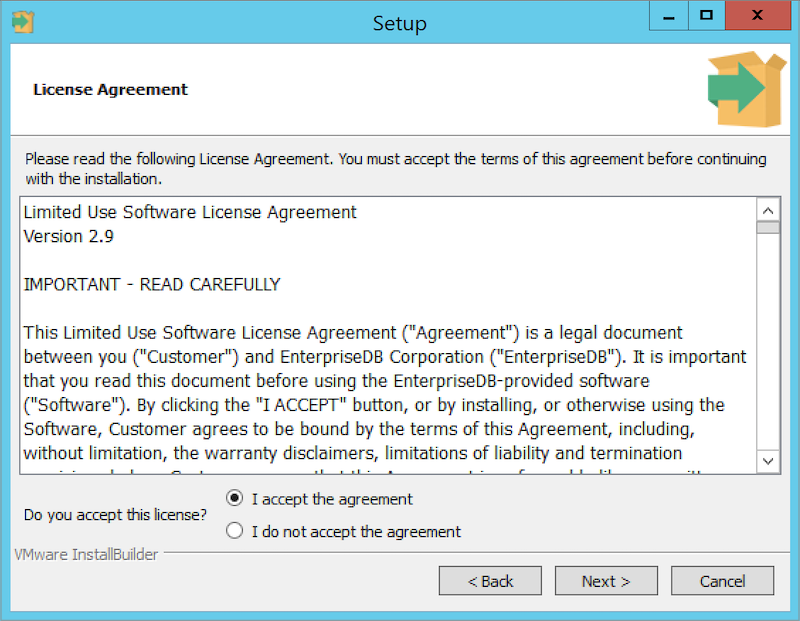
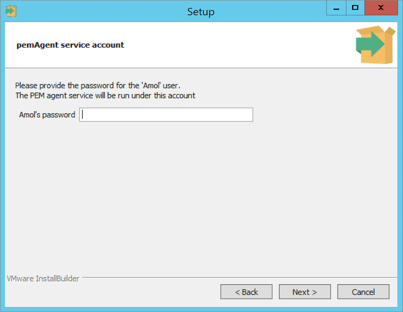
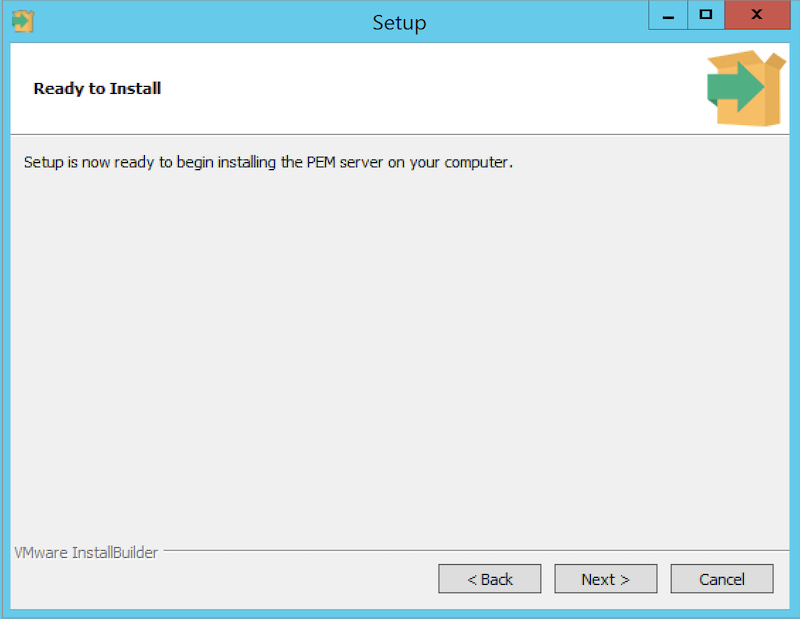
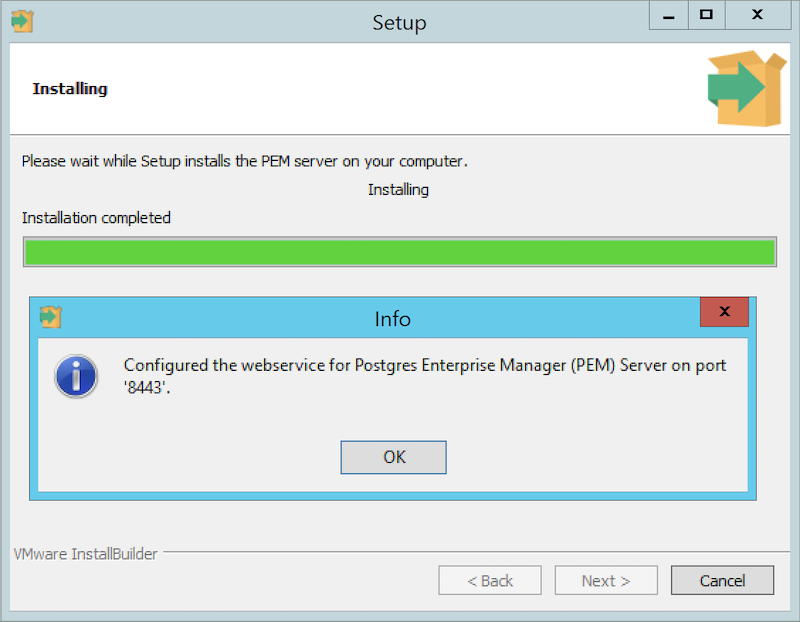
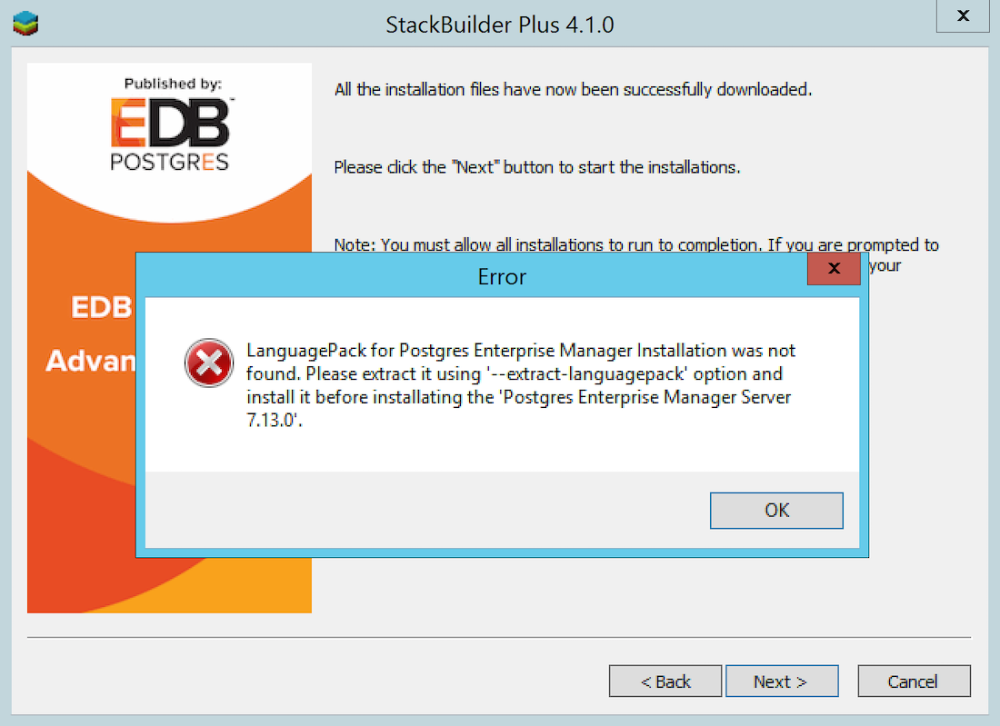

<div id="upgrading_pem_installation_windows" class="registered_link"></div>


To upgrade PEM component software on Windows hosts, simply invoke a newer version of the PEM component installers in the following order:

1.  Invoke the PEM agent installer on each monitored node `except` the PEM server host.
2.  Invoke the PEM server installer; this installer will upgrade `both` the PEM server and the PEM agent that resides on the PEM server host.

During an installation, the component installer will automatically detect an existing installation, and perform an upgrade. After upgrading the PEM agent and server, you can upgrade SQL Profiler if required; this step is platform-specific.

The following sections will walk you through the upgrade process on a Windows host, step-by-step.

## Upgrading a PEM Agent on a Windows Host

To upgrade a system that is currently monitored by a PEM agent to a more-recent PEM agent, simply download and invoke a newer version of the PEM agent installer on the system that the agent is monitoring.

You can invoke the installer by right-clicking on the downloaded installer's icon, and selecting `Run as Administrator`. The `PEM Agent Setup Wizard` opens, welcoming you.

<figure><figcaption aria-hidden="true"><em>The PEM Agent Installer - Welcome Window</em></figcaption></figure>

Read and accept the `License Agreement` before clicking `Next` to continue.

<figure><figcaption aria-hidden="true"><em>The PEM Agent Installer - License Agreement</em></figcaption></figure>

The setup wizard will automatically detect an existing agent, and upgrade the installed version. Click `Next` to continue.

<figure><figcaption aria-hidden="true"><em>The PEM Agent Installer - Existing Installation Location</em></figcaption></figure>

The `pemAgent service account` dialog may prompt you for the password of the account under which the PEM Agent service runs.

<figure><figcaption aria-hidden="true"><em>The PEM Agent Installer - pemAgent Service Account password</em></figcaption></figure>

If prompted, provide the password, and click `Next` to continue.

When the `Ready to Install` dialog informs you that the installation is about to begin, click `Next` to continue. It will upgrade your PEM Agent to the latest version.

<figure><figcaption aria-hidden="true"><em>The PEM Agent Installer - Ready to Install</em></figcaption></figure>

The setup wizard displays progress bars to inform you of each component that is being installed.

The `PEM Agent Setup Wizard` will inform you when the installation completes. Click `Finish` to exit the wizard and close the window.

<figure><figcaption aria-hidden="true"><em>The PEM Agent Installer - Finish</em></figcaption></figure>

After the installation completes, a window pops-up to restart the machine. Click `Yes` to restart the machine and the PEM Agent.

<figure><figcaption aria-hidden="true"><em>The PEM Agent Installer - Restart pop-up</em></figcaption></figure>

## Upgrading the PEM Server on a Windows Host

The PEM server installer facilitates upgrading directly between major versions of the PEM server; you can upgrade directly from version 5.0 to version 7.16 without first upgrading to version 6.0.

You can invoke the installer by right-clicking on the downloaded installer's icon, and selecting `Run as Administrator`.

<figure><figcaption aria-hidden="true"><em>The PEM Server Installer - Welcome Window</em></figcaption></figure>

The `PEM Server Setup Wizard` welcomes you, as shown in the image. Click `Next` to continue to the `License Agreement`.

The `PEM server setup wizard` will prompt you to accept the `License Agreement`. After reviewing the license agreement, check the radio button next to `I accept the agreement`, and click `Next` to continue to the `Existing installation dialog`.

<figure><figcaption aria-hidden="true"><em>The PEM Server Installer - License Agreement</em></figcaption></figure>

The wizard will check the PEM server host for an existing PEM server installation; if the wizard locates an installation, it will perform an upgrade. Click `Next` to continue.

<figure><figcaption aria-hidden="true"><em>The PEM Server Installer - Existing PEM Server Location</em></figcaption></figure>

Before upgrading the PEM server, the wizard will confirm that the requirements of the new PEM server are present. If any supporting components are missing, or are a version that will not support the new PEM installation, the PEM installation wizard will inform you that it must upgrade the dependencies, and will invoke the required installers.

<figure><figcaption aria-hidden="true"><em>The PEM Server Installater - Missing Dependencies</em></figcaption></figure>

When the installation wizards complete the dependency upgrades, then a window pops-up asking whether you want to restart the machine or not.

<figure><figcaption aria-hidden="true"><em>The PEM Server Installer - Restart pop-up</em></figcaption></figure>

Click on `No` to continue the upgrade process.

The wizard then opens the `Database Server Installation Details` dialog, prompting you for connection credentials for the database superuser of the PEM backend database. Provide:

-   The name of the database superuser in the `User` field.
-   The password associated with the database superuser in the `Password` field.

Click `Next` to continue.

<figure><figcaption aria-hidden="true"><em>The PEM Server Installer - Database Server Installation Details</em></figcaption></figure>

The `pemAgent service account` dialog may prompt you for the password of the account under which the PEM agent service runs.

<figure><figcaption aria-hidden="true"><em>The PEM Server Installer - pemAgent Service Account password</em></figcaption></figure>

If prompted, provide the password, and click `Next` to continue.

<figure><figcaption aria-hidden="true"><em>The PEM Server Installer - Ready to Install</em></figcaption></figure>

The `Ready to Install` dialog will inform you that the setup wizard is ready to perform the installation. Click `Next` to start the installation.

During the installation, progress bars will keep you informed of the progress of the update.

<figure><figcaption aria-hidden="true"><em>The PEM Server installation in progress</em></figcaption></figure>

After upgrading the PEM server (and the agent that resides on the same host as the PEM server) and configuring the web service, the PEM setup wizard notifies you of the port on which the service is listening. Use this port number when connecting to the PEM Server with the PEM client.

<figure><figcaption aria-hidden="true"><em>The PEM Server Installer - the PEM Web Service configured</em></figcaption></figure>

Click `OK` to close the `Info` popup. The PEM server setup wizard informs you that the installation is complete.

<figure><figcaption aria-hidden="true"><em>The PEM Server Installer - Upgrade Completion</em></figcaption></figure>

If the window pops-up asking to restart the machine, then click on `Yes` to restart the machine and hence the `httpd` service.

If you have installed the PEM backend database server and PEM-HTTPD on different hosts, then you must run the PEM server installer twice – once on each host. Extract the language pack installer, and install it on the host of PEM-HTTPD before invoking the PEM installer. Include the following keywords when invoking the installer to extract the language pack:

> `--extract-languagepack <path>`

Where `<path>` specifies an existing path for extracting the language pack installer.

<div class="note">

<div class="title">

Note

</div>

By default EDB Language Pack is installed in `C:\edb\languagepack\v1`.

</div>

If you are upgrading the PEM Server via StackBuilder Plus then you might face the error shown below; after displaying the error, PEM will say that installation is completed. Please note that the installation is not done and you will need to do the installation by invoking the installer file from the location where it is downloaded.

<figure><figcaption aria-hidden="true"><em>The PEM Server upgrade error</em></figcaption></figure>

After upgrading the PEM server, you may wish to upgrade the backend database to a more recent version; for information about upgrading the backend database, see [Upgrading the Backend Postgres Database](../#upgrading_backend_database).

## Upgrading SQL Profiler on a Windows Host

If you are using SQL Profiler on a Windows host, Windows will lock any files that have been executed or loaded into memory. To release any locked files, you must stop the Postgres server before performing an upgrade.

On Windows, you can use the `Services` dialog to control the service. To open the `Services` dialog, navigate through the `Control Panel` to the `System and Security menu`. Select `Administrative Tools`, and then double-click the `Services` icon. When the `Services` dialog opens, highlight the service name in the list, and use the option provided on the dialog to `Stop` the service.

After stopping the Postgres Server:

1.  Delete the existing SQL Profiler query set on each node by invoking the `uninstall-sql-profiler.sql` script. By default, on a Windows host the script resides in the `share\contrib` directory under your Advanced Server or PostgreSQL installation.

    You can use the following server-specific commands.

    For PostgreSQL:

    ``` text
    psql -f C:\Program Files\PostgreSQL\<x>\share\contrib\uninstall-sql-profiler.sql -d postgres -U postgres
    ```

    Where, `x` is the version of PostgreSQL and `-d` specifies the name of the maintenance database.

    For Advanced Server:

    ``` text
    psql -f C:\Program Files\edb\as<x>\share\contrib\uninstall-sql-profiler.sql -d edb -U enterprisedb
    ```

    Where `x` is the version of Advanced Server and `-d` specifies the name of the maintenance database.

2.  Invoke the new SQL Profiler installer on each node you wish to profile; run the installer as `Administrator`.

    For PostgreSQL:

    ``` text
    sqlprofiler-pg-<x>-<y>-windows-x64.exe
    ```

    Where, `x` is the version of the PostgreSQL and `y` is the version of SQL Profiler. For example: `sqlprofiler-pg-12-7.14.0-1-windows-x64.exe`.

    For Advanced Server:

    ``` text
    sqlprofiler-edb-as<x>-<y>-windows-x64.exe
    ```

    Where `x` is the version of Advanced Server and `y` is the version of SQL Profiler. For example: `sqlprofiler-edb-as12-7.14.0-1-windows-x64.exe`.

    The SQL Profiler installer will detect the existing `SQL Profiler` installation and upgrade it with the latest version of SQL Profiler.

3.  Run the `sql-profiler.sql` script file in the maintenance database.

    For PostgreSQL:

    ``` text
    psql -f C:\Program Files\PostgreSQL\<x>\share\contrib\sql-profiler.sql -d postgres -U postgres
    ```

    Where `x` is the version of PostgreSQL and `-d` specifies the name of the maintenance database.

> For Advanced Server:
>
> ``` text
> psql -f C:\Program Files\edb\as<x>\share\contrib\sql-profiler.sql -d edb -U enterprisedb
> ```
>
> Where, `x` is the version of Advanced Server and `-d` specifies the name of the maintenance database.

1.  Then, restart the Postgres Server to resume profiling the node from a PEM client.

After updating the PEM components, you are ready to update the backend database.
