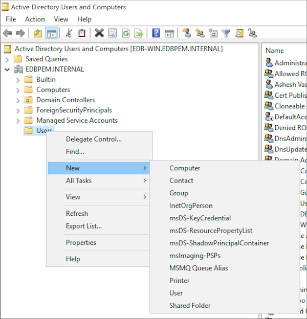
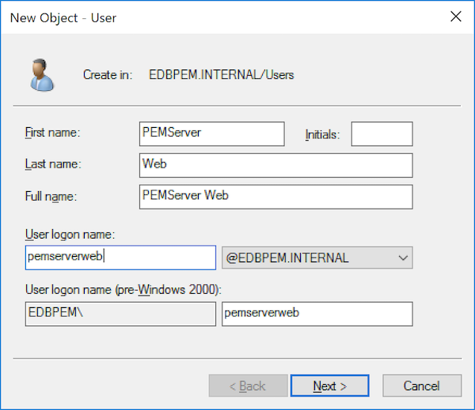
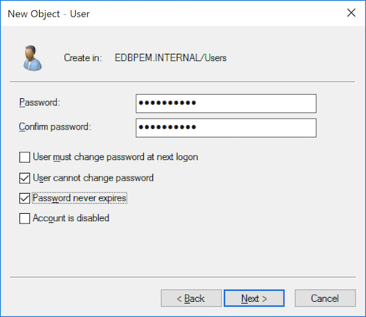
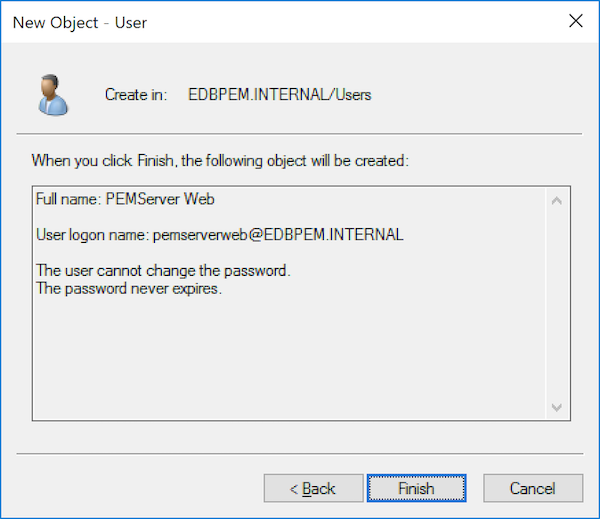
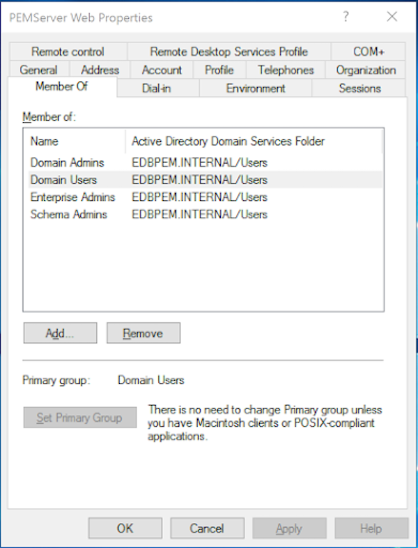
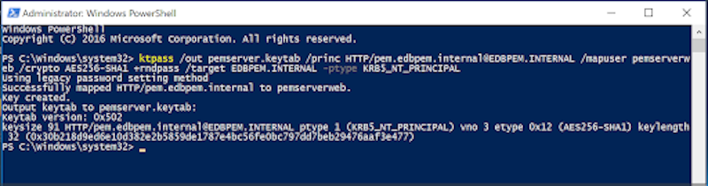
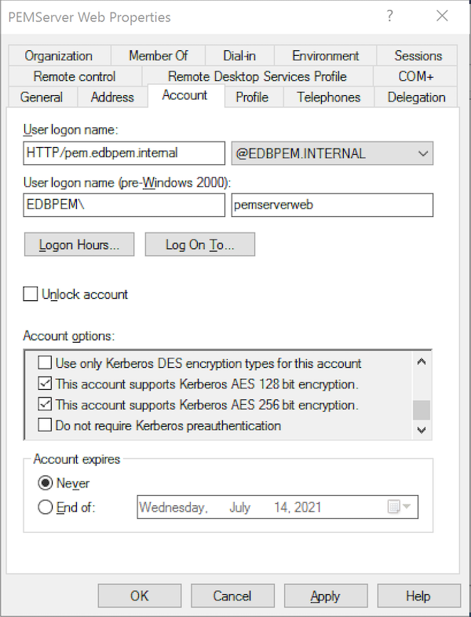
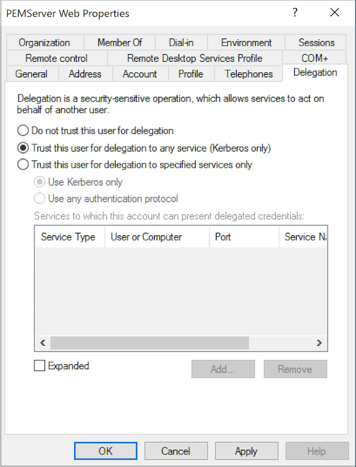

-   The Windows Active Directory Domain Services works with hostnames and not with `ip addresses`. To use single sign-on in PEM Server using `Active Directory Domain Services`, the following machines must be configured with hostnames using the DNS. 

    -   Windows Server (Domain Controller)
    -   PEM Server (PEM Web Server and PEM Backend Database Server)
    -   Client machine
-   For example the `REALM` on Windows Active Directory is `edbpem.internal` then Windows Server hostname can be set as `Krb5server.edbpem.internal`, the PEM Server hostname as `pem.edbpem.internal` and the client's hostname as `pg12.edbpem.internal`.

Follow the steps to configure the Kerberos Authentication for the PEM Server:

## 1. Install Active Directory, the PEM server, and the PEM backend database server

-   Install the Active Directory on the Windows Server (Domain Controller) that functions as the authentication server. Also, configure the Active Directory Domain Services to use Kerberos Authentication and it should be up and running.

-   Install the PEM Server on the separate Linux machine, for more information see [Installing the PEM Server](03_installing_pem_server_on_linux/#installing_pem_server_on_linux).

-   Install the PEM Backend Database (Postgres/EDB Postgres Advanced Server) on the same or different Linux machine as the PEM Server. For more information, see the Installation guides on [EDB Docs Website](https://www.enterprisedb.com/docs).

## 2. Create users in Active Directory to map with service principals

-   Create user in Active directory of Windows Server to map with the HTTP Service Principal for the PEM Web Application.

    a. Open `Active Directory Users and Computers` -> `<DOMAIN_NAME>` -> `Users` -> Right Click -> `New` -> `User`

    

    b. Enter the user details

    

    c. Give the password and make sure to deselect `User must change password at next logon`, and select `User cannot change password` and `Password never expires`.

    

    d. Review the user details

    

    e. On the `PEMServer Web Properties`, add the Users as member of the `Domain Users` group:

    

-   Create user (for eg: `pemserverdb`) in Active directory of Windows Server to map with the Postgres Service Principal for the PEM Backend Database.

    Repeat the steps from `a` to `e` as above.

## 3. Extract Key Tables from Active Directory

-   Extract the Key Tables for the Service Principals and map with the respective domain users created in above step.

a.  Open `Windows PowerShell` as an `Administrator` user, create a Key Table for HTTP Service Principal mapping with user `pemserverweb` and a Key Table for Postgres Service Principal mappping with user `pemserverdb`.

```text
ktpass /out pemserver.keytab /princ HTTP/pem.edbpem.internal@EDBPEM.INTERNAL /mapuser pemserverweb /crypto AES256-SHA1 +rndpass /target EDBPEM.INTERNAL -ptype KRB5_NT_PRINCIPAL -kvno 0
ktpass /out pemdb.keytab /princ postgres/pem.edbpem.internal@EDBPEM.INTERNAL /mapuser pemserverdb /crypto AES256-SHA1 +rndpass /target EDBPEM.INTERNAL -ptype KRB5_NT_PRINCIPAL -kvno 0
```

Where,

-   `pemserver.keytab` is the name of the Key Table for the PEM Web Application
-   `pemdb.keytab` is the name of the key Table for the PEM Backend Database Server
-   `pem.edbpem.internal@EDBPEM.INTERNAL` is the hostname of the PEM Server (here @EDBPEM.INTERNAL means @REALM)
-   `pemserverweb` is the user for the PEM Web Application
-   `pemserverdb` is the user for the PEM Backend Database Server
-   `EDBPEM.INTERNAL` is the domain of the target

    

!!! Note
    -   The command line argument `+rndpass` will reset the password for the Domain User `pemserverweb` to a random password.
    -   The /target option is optinal. 

b.  Add the Kerberos Support for the User accounts on the `Accounts` tab

   

!!! Note
    On the Account tab the `User logon name` shows `HTTP/pem.edbpem.internal@EDBPEM.INTERNAL`  and `Delegation` tab is enabled for the `pemserverweb` user.

c. Select `Trust this user for delegation to any service (Kerberos only)` option on the `Delegation` tab for the created users.

   

d. Copy both the Key Tables to the PEM Server Host (or respectively to PEM Web Server and PEM Backend Database Server hosts if installed on different hosts.)

e.  On the PEM Server, move the Key Tables to the required location and change the ownership as following:

```text
mv /tmp/pemserver.keytab <PEM_INSTALLATION_DIRECTORY>/share
chown pem <PEM_INSTALLATION_DIRECTORY>/share/pemserver.keytab
```

```text
mv /tmp/pemdb.keytab <DATA_DIRECTORY_OF_POSTGRES>/
chown enterprisedb <DATA_DIRECTORY_OF_POSTGRES>/pemdb.keytab
```

  Where, 

-   `OS_USERNAME_ON_PEM_SERVER` is the name of the operating system user on the PEM Server.
-   `DATA_DIRECTORY_OF_POSTGRES` is the path of the data directory of the installed postgres (PostgreSQL/EDB Postgres Advanced Server).

## 4. Configure the PEM backend database server

-   Add the Key Table location in `postgresql.conf` file

    ```text
    krb_server_keyfile='FILE:/<DATA_DIRECTORY_OF_POSTGRES>/pemdb.keytab'
    ```

     Where,

    -   `DATA_DIRECTORY_OF_POSTGRES` is the path of the data directory of the installed postgres (PostgreSQL/EDB Postgres Advanced Server.

-   Edit the `krb5.conf` file:

    ```text
    $ sudo vim /etc/krb5.conf
    [libdefaults]
    default_realm = EDBPEM.INTERNAL
    Forwardable = True

    [domain_realm]
    .edbpem.org = EDBPEM.INTERNAL
    edbpem.org = EDBPEM.INTERNAL

    [realms]
    EDBPEM.INTERNAL = {
       kdc = krb5server.edbpem.internal
       admin_server = krb5server.edbpem.internal
    }
    ```

-   Restart the database server to reflect the changes

    ```text
    systemctl restart <POSTGRES_SERVICE_NAME>
    ```

     Where,

    -   `POSTGRES_SERVICE_NAME` is the service name of Postgres (PostgreSQL/EDB Postgres Advanced Server) database. For eg: postgresql-13 for PostgreSQL 13 database on CentOS or RHEL or Rocky Linux platforms.

## 5. Obtain and view the initial ticket

-   The `kinit` utility obtains and caches Kerberos tickets. This utility is typically used to obtain the ticket-granting ticket, using a password entered by the user to decrypt the credential from the key distribution center (KDC). The ticket-granting ticket is then stored in the user's credential cache.

-   You can view the details of the ticket using `klist` utility.

!!! Note
    The `Kerberos Client` must be installed on the PEM Server and the Client machine to use `kinit` and `klist`.

```text
$ kinit <USERNAME@REALM>
$ klist 
```

It will display the principal along with the kerberos ticket.

!!! Note
    The `USERNAME@REALM` specified here must be a database user having the `pem_admin` role and `CONNECT` privilege on `pem` database.

## 6. Configure the PEM server

-   Run the PEM configure script on the PEM Server to use Kerberos Authentication

    ```text
    $ sudo PEM_APP_HOST=pem.edbpem.internal PEM_KRB_KTNAME=<PEM_INSTALLATION_DIRECTORY/share/pemserver.keytab <PEM_INSTALLATION_DIRECTORY>/bin/configure-pem-server.sh
    ```

-   Configure the `PEM_DB_HOST` in `config_setup.py` file and check the value of `PEM_AUTH_METHOD` is set to `'kerberos'`.
    ```text
    $ sudo vim <PEM_INSTALLATION_DIRECTORY>/share/web/config_setup.py
    PEM_DB_HOST=`pem.edbpem.internal`
    ```

-   Configure the `HOST` in `.install-config` file 

    ```text
    $ sudo vim <PEM_INSTALLATION_DIRECTORY>/share/.install-config
    HOST=`pem.edbpem.internal`
    ```

-   If the PEM Server uses Kerberos Authentication,

    -   All the monitored servers will default to use the same authentication. To override the default, add the parameter `ALLOW_DATABASE_CONNECTION_WITHOUT_KERBEROS` and set to `True` in `config_local.py` file.

    -   All the authenticated user principal will be appended with realm (USERNAME@REALM) and passed as database user name by default. To override the default, add the parameter `PEM_USER_KRB_INCLUDE_REALM` and set to `False` in `config_local.py` file.

-   Restart the Apache server

    ```text
    sudo systemctl restart <SERVICE_NAME>
    ```

-   Edit the entries at the top in `pg_hba.conf` to use `gss` authentication method and reload the database server.

    ```text
    host  pem       +pem_user    <ip_of_pem_server>/32   gss
    host  postgres  +pem_user    <ip_of_pem_server>/32   gss
    ```

    ```text
    systemctl reload <POSTGRES_SERVICE_NAME>
    ```

    Where,

-   `POSTGRES_SERVICE_NAME` is the service name of Postgres (PostgreSQL/EDB Postgres Advanced Server) database. For eg: postgresql-13 for PostgreSQL 13 database on CentOS or RHEL or Rocky Linux platforms.

!!! Note
    You cannot specify connection type as `hostgssenc` as windows does not support gss encrypted connection.

## 7. Browser settings

Configure the Browser on the Client machine to access the PEM Web Client to use the `Spnego/Kerberos`.

-   For Mozilla Firefox

    -   Open the low level Firefox configuration page by loading the `about:config` page.
    -   In the Search text box, enter: `network.negotiate-auth.trusted-uris`
    -   Double-click the `network.negotiate-auth.trusted-uris` preference and enter the hostname or the domain of the web server that is protected by Kerberos HTTP SPNEGO. Separate multiple domains and hostnames with a comma.
    -   In the Search text box, enter: `network.negotiate-auth.delegation-uris`
    -   Double-click the `network.negotiate-auth.delegation-uris` preference and enter the hostname or the domain of the web server that is protected by Kerberos HTTP SPNEGO. Separate multiple domains and hostnames with a comma.
    -   Click OK.

-   For Google Chrome on Linux or MacOS:

    -   Add the `--auth-server-whitelist` parameter to the google-chrome command. For example, to run Chrome from a Linux prompt, run the google-chrome command as follows:

    ```text
    google-chrome --auth-server-whitelist = "hostname/domain"
    ```

-   After configuring the PEM server, you can access the PEM web interface in your browser. Navigate to:

    ```text
    https://<ip_address_of_PEM_server>:8443/pem
    ```

!!! Note
    If you run into the following error while connecting to your Postgres cluster:

    `psql -h hostname template1`
    `psql: GSSAPI continuation error: Unspecified GSS failure. Minor code may provide more information`
    `GSSAPI continuation error: Key version is not available`

    The resolution is to add the additional encryption types to the keytab using `ktutil` or recreating the Postgres keytab with all crypto systems from AD. 
