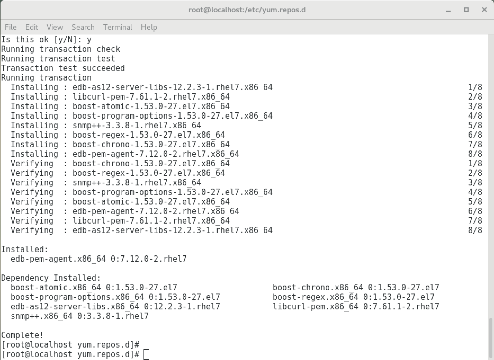

A PEM agent can monitor one or more servers on one or more hosts. For detailed information about managing a PEM agent, see [Managing an agent](../../../managing_pem_agent).

On a RHEL or OL system, you can use the yum package manager to install a PEM Agent. The installation tool you use depends on the version of the host operating system. Before installing the agent, you must ensure that your system contains the required prerequisite software.

## Install the epel-release package

```shell
yum -y install https://dl.fedoraproject.org/pub/epel/epel-release-latest-7.noarch.rpm
```

If you are a Red Hat Network user, enable the optional, extras, and HA repositories since EPEL packages might depend on packages from these repositories:

```shell
subscription-manager repos --enable "rhel-*-optional-rpms" --enable "rhel-*-extras-rpms"  --enable "rhel-ha-for-rhel-*-server-rpms"
```

## Install and configure the edb.repo file

To create an EDB repository configuration file, assume superuser privileges and invoke the following command:

```shell
yum -y install https://yum.enterprisedb.com/edb-repo-rpms/edb-repo-latest.noarch.rpm
```

The repository configuration file is named `edb.repo`. The file resides in `/etc/yum.repos.d`. After creating the `edb.repo` file, use the following command to replace the `USERNAME` and `PASSWORD` placeholders in the `baseurl` specification with the username and password of a registered EDB user:

```shell
sed -i "s@<username>:<password>@USERNAME:PASSWORD@" /etc/yum.repos.d/edb.repo
```

To request credentials for the repository, contact [EDB](https://www.enterprisedb.com/repository-access-request).

## Installing the PEM agent

Install the PEM agent package:

    ```shell
    yum install edb-pem-agent
    ```

When the installation is complete, you can review a list of the installed packages and dependencies.



When you install an RPM package that's signed by a source that isn't recognized by your system, yum might ask for your permission to import the key to your local server. If prompted, and you're satisfied that the packages come from a trustworthy source, enter `y`, and press **Return** to continue.

During the installation, yum might encounter a dependency that it can't resolve. If it does, it provides a list of the required dependencies to manually resolve.

After installing PEM agent using yum, register the PEM agent. For detailed information, see [Registering an agent](../../../registering_agent).

