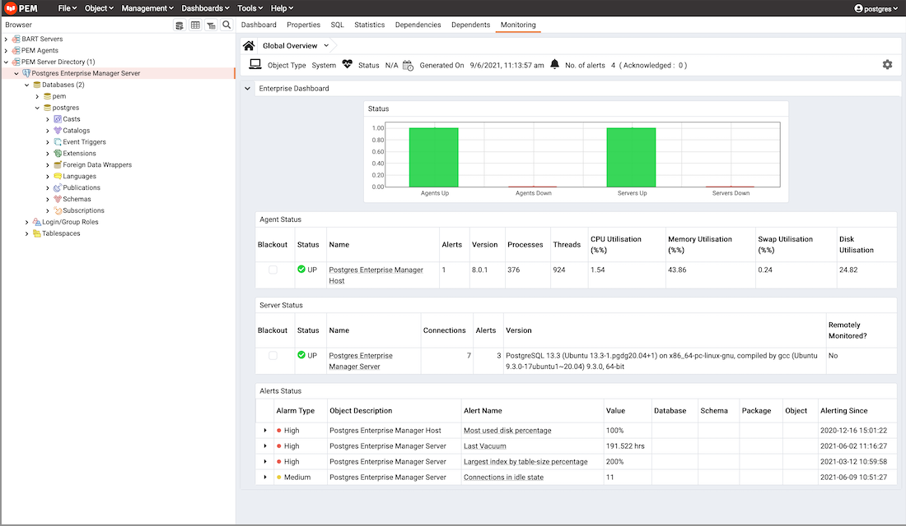

On Windows, the PEM server graphical installer installs and configures the PEM server, a PEM agent, and the software required to connect to the PEM web interface with your choice of browser.

At the heart of each PEM installation is the PEM server. In a production environment, the server will typically be a dedicated machine, monitoring a large number of Postgres servers or a smaller number of busy servers.

The PEM server backend database may be an EDB distribution of the PostgreSQL or Advanced Server database server, or an existing Postgres server installed from another source. The Postgres backend database server must be version 11 or later, and will contain a database named `pem`, which is used by the PEM server as a repository.

-   If you would like to use an existing Postgres server to host the PEM server, the PEM server installer can create the `pem` database on the Postgres host. You must manually satisfy the software pre-requisites if you choose to use an existing server.

    For more information about using an existing Postgres server to host the PEM server backend database, see [Installing the PEM Server on an Existing Postgres Server](pem_server_on_existing_pg_server/) section.

-   If you do not wish to use an existing installation of Postgres as the PEM server host, the PEM server installer can install PostgreSQL, satisfy the server host's software pre-requisites, and create an instance (a PostgreSQL database cluster) that contains the `pem` database. This is the simplest PEM server installation option.

-   PEM-HTTPD is made available for Postgres installations through the PEM server installer or the StackBuilder utility. If PEM-HTTPD is already installed on the host, the PEM server installer will review and update the existing installation if required. If the PEM server host does not contain an existing PEM-HTTPD installation, the PEM server installer will add it.

-   Before installing the PEM server, you must decide if you wish to run PostgreSQL and PEM-HTTPD on the same host or on separate hosts. If you intend to run the PostgreSQL database server and PEM-HTTPD on different hosts, then you must run the PEM server installer twice – once on each host, as detailed in [Installing the PEM Server and PEM-HTTPD on Separate Hosts](pem_server_and_httpd_on_diff_host/) section.

-   For detailed information to install the PEM server and PEM-HTTPD on same host, see [Installing the PEM Server and PEM-HTTPD on same host](pem_server_and_httpd_on_same_host/) section.

-   For detailed information about installing and configuring a standalone PEM Agent, see [Installing the PEM agent on Windows](08_installing_pem_agent_using_edb_repository).

-   Language pack installers contain supported languages that may be used with EDB Postgres Advanced Server and EDB PostgreSQL database installers. The language pack installer allows you to install Perl, TCL/TK, and Python without installing supporting software from third party vendors. For more information about installing and using Language Pack, please see the [EDB Postgres Language Pack docs](https://www.enterprisedb.com/docs/epas/latest/language_pack/).

-   For troubleshooting the installation or configuration of the PEM agent, see [Troubleshooting PEM agent](../troubleshooting_agent/).

The PEM server installer will also install the software required to access the server via the PEM web interface. You can access the web interface with a supported version of your browser.

You can use the web interface to review information about objects that reside on monitored servers, manage databases and database objects that reside on monitored servers, or review statistical information gathered by the PEM server.

!!! Note
    If you are using the SSL certificates then make sure that all the SSL certificates are inside the data directory the backend database server. If the certificates are not inside the data directory then the PEM Server's configuration may fail as it looks in to the data directory while configuring the PEM Server.