To use separate hosts for the PEM server backend database and PEM-HTTPD, you must:

1.  Invoke the PEM server installer on the host of the Postgres server that will contain the `pem` database. During the installation, select the `Database` option on the `Advanced options` dialog, and provide connection information for the Postgres server.
2.  Modify the `pg_hba.conf` file of the Postgres installation on which the PEM server (and `pem` database) resides, allowing connections from the host of the PEM-HTTPD server.
3.  Invoke the PEM server installer on the host of the PEM-HTTPD server, selecting the `Web Services` option on the `Installation Type` dialog.

To invoke the PEM server installer on a Windows system, right click the installer icon and select `Run as Administrator`. The installer displays a `Welcome` dialog.

Click `Next` to continue to the `License Agreement` dialog.

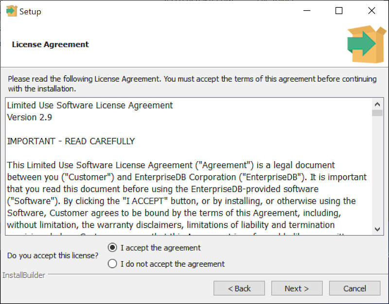

Carefully review the license agreement before highlighting the appropriate radio button and accepting the agreement; click `Next` to continue.

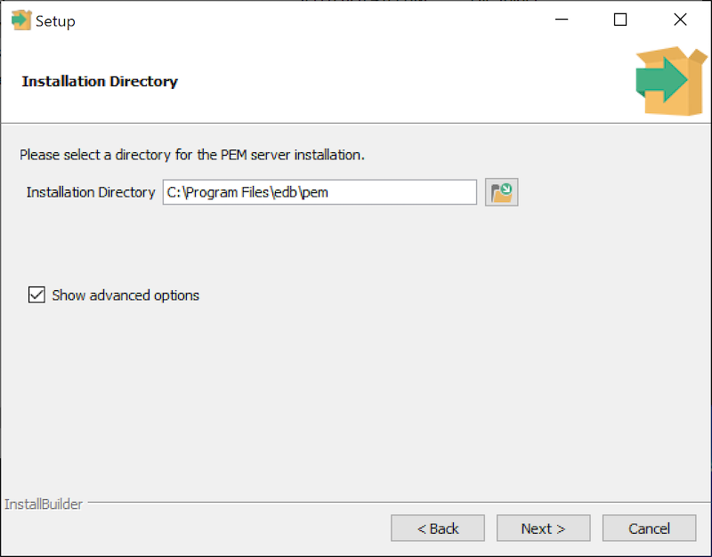

Use fields on the `Installation Directory` dialog to specify the directory in which the PEM server will reside, and to access the `Advanced options` dialog:

-   By default, the PEM server is installed in the `C:\Program Files\edb\pem` on Windows. Accept the default location, or use the `Installation Directory` field to open a browser dialog and select the directory in which the PEM server will be installed.
-   To install the PEM server and PEM-HTTPD on separate hosts, you must use the `Advanced options` dialog to specify the installation type (`Web Services` or `Database`). Select the `Show advanced options` check box to instruct the installer to include the `Advanced options` dialog in the installation process.

Click `Next` to continue to the `Advanced Options` dialog.

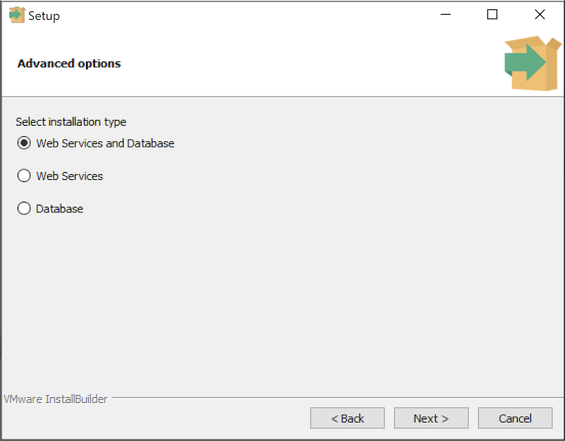

Use the radio buttons on the `Advanced options` dialog to specify the component or components that you would like to install:

-   Select `Web Services and Database` to indicate that the Postgres server and PEM-HTTPD will both reside on the current host. If you select the `Web Services and Database` option, the PEM server installer will allow you to specify which Postgres server you wish to use for the PEM server before checking for a PEM-HTTPD installation.
-   Select `Web Services` to install PEM-HTTPD on the current host, while using a Postgres database server that resides on another host to host the PEM server and `pem` database.

!!! Note
    You must complete the PEM server installation process on the host of the PEM server (and `pem` backend database), selecting `Database` on the `Advanced options` dialog, and modifying the connection properties of the `pg_hba.conf` file on the PEM server before using the `Web Services` option to install PEM-HTTPD.

This option invokes the installation steps documented in [Installing Web Services](#installing-web-services) section.

-   Select `Database` to use an existing Postgres server (version 11 or greater), or to install only the database server that is distributed with the PEM server installer. This option invokes the installation steps documented in [Specifying a Database Host](#specifying-a-database-host).

After selecting an installation option, click `Next` to continue.

## Specifying a database host

Selecting the `Database` option on the `Advanced options` dialog allows you to specify connection information for the host on which the PEM server backend database (named `pem`) will reside.

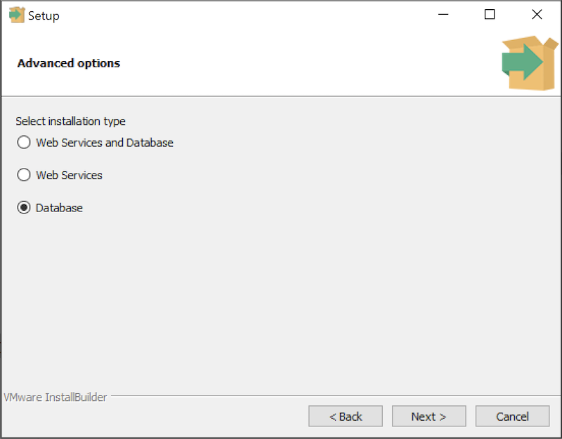

Click `Next` to continue to the `Database Server Selection` dialog.

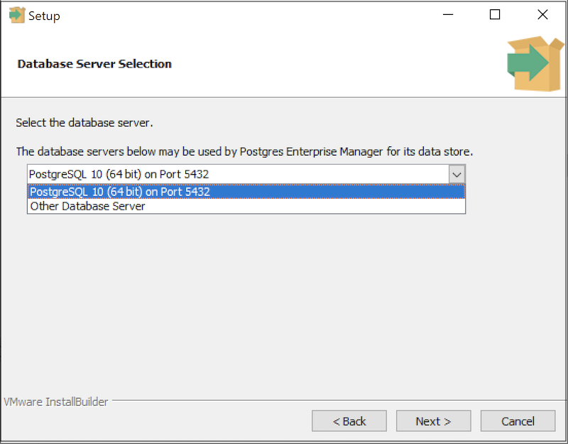

Use the drop-down listbox on the `Database Server Selection` dialog to select a host for the PEM server backend database. You can:

-   Select a host from existing Postgres installations that reside on the current host.

!!! Note
    You may be required to add the `sslutils` package to your installation.

-   Select the `PostgreSQL x` option to install the Postgres server that is distributed with the PEM server installer where `x` is the PostgreSQL database server version. If you decide to use the version of PostgreSQL that is bundled with the PEM server installer, the EnterpriseDB one-click PostgreSQL installer will open and walk you through the installation.
-   Select `Other Database Server` to specify connection information for a Postgres server that was not installed using a one-click graphical installer from EnterpriseDB. For information about the software pre-requisites for the PEM server database host, please see [Preparing the Postgres Server](pem_server_on_existing_pg_server/#preparing-the-postgres-server) section.

Click `Next` to continue.

If the PEM server will reside on an existing Postgres server, the `Database Server Installation Details` dialog shown in opens.

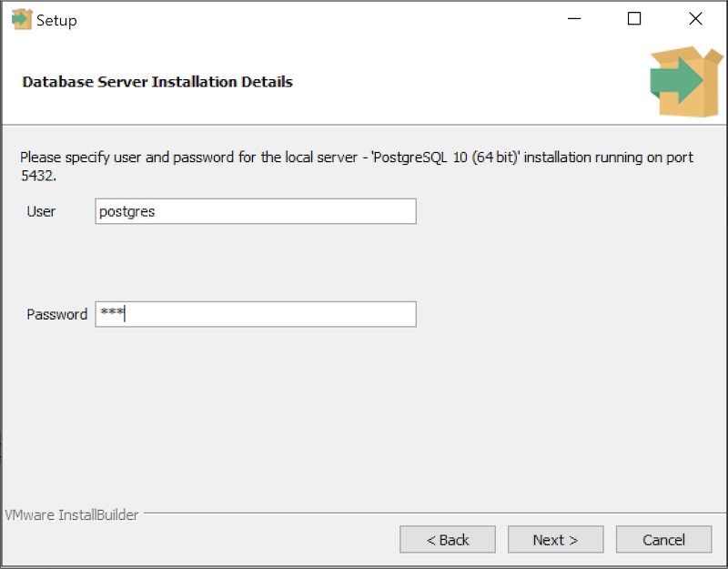

The information required on the `Database Server Installation Details` dialog may vary; the PEM server installer will ask you to provide only the information about the selected installation that it cannot locate:

-   Specify the name of a Postgres database superuser in the `User` field.
-   Specify the password associated with that user in the `Password` field.

Click `Next` to continue.

If prompted, provide the system password for the service account under which the PEM agent will run.

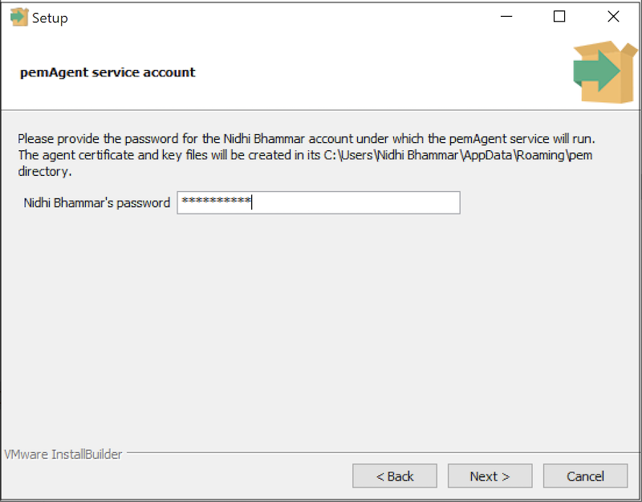

click `Next` to continue to the `Network Details` dialog.

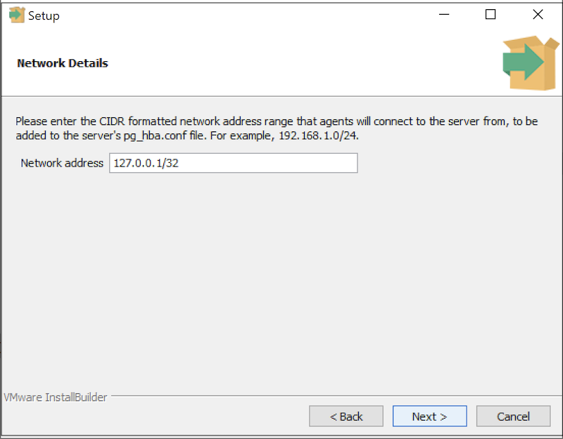

Use the `Network Details` dialog to specify the CIDR-style network address from which PEM agents will connect to the server (the `client-side` address). The specified address will be added to the server's `pg_hba.conf` file.

!!! Note
    You can specify additional network addresses by manually adding entries to the `pg_hba.conf` file on the PostgreSQL server.

Accept the default (specifying the localhost), or specify a `Network address` range, and click `Next` to continue to the `Agent Details` dialog.

The PEM server installer will install a PEM agent on the host on which the server resides, to monitor the server and provide alert processing and garbage collection services. A certificate will also be installed in the location specified in the `Agent certificate path` field.

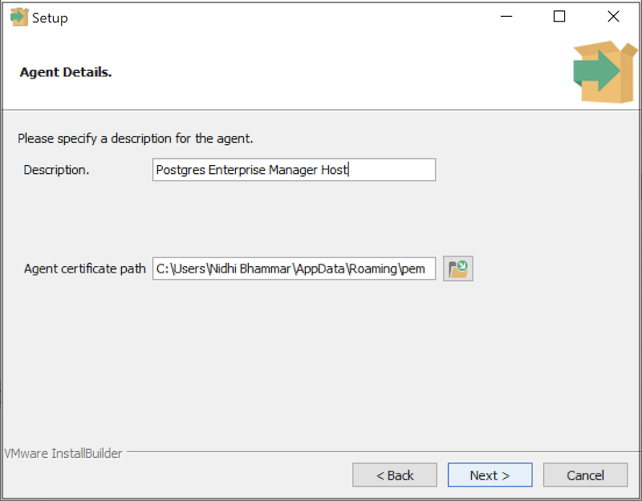

You can enter an alternate description or an alternate agent certificate path for the PEM agent, or accept the defaults. Click `Next` to continue.

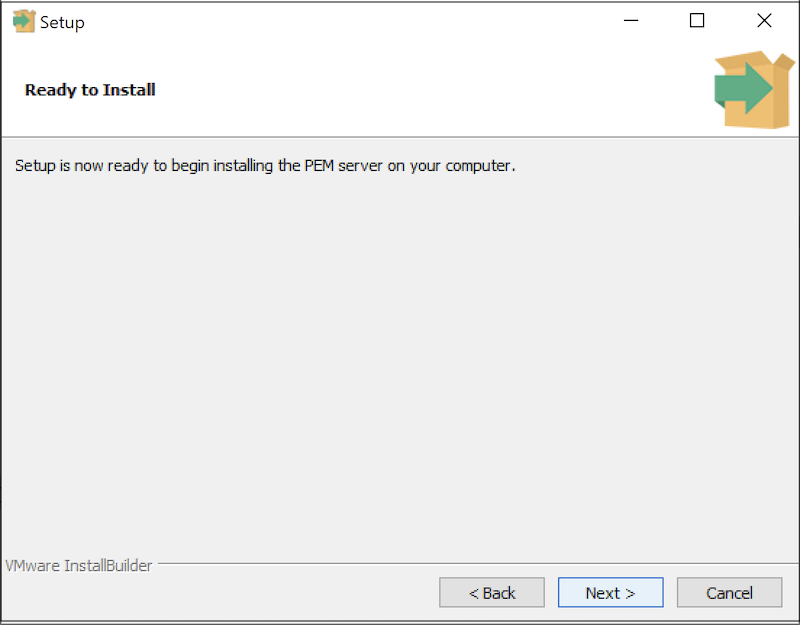

The wizard is now ready to install the PEM server. Click `Back` to modify any of the options previously selected, or `Next` to proceed with the installation.

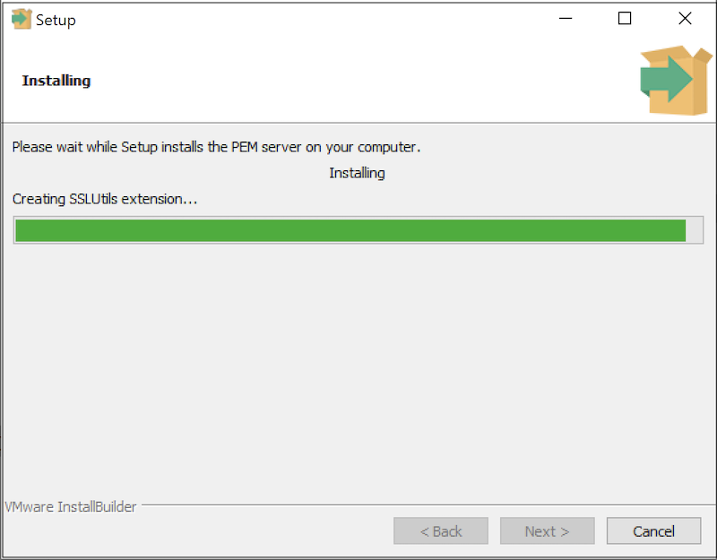

During the installation process, the installer will copy files to the system, and set up the PEM server's backend database. A popup dialog opens confirming that the `pem` database has been created and configured.

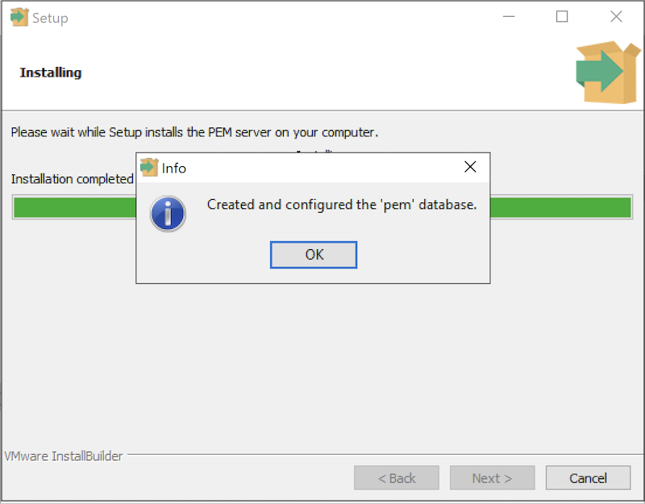

Click `OK` to acknowledge that the `pem` database has been created, and continue to the `Completed…` dialog.

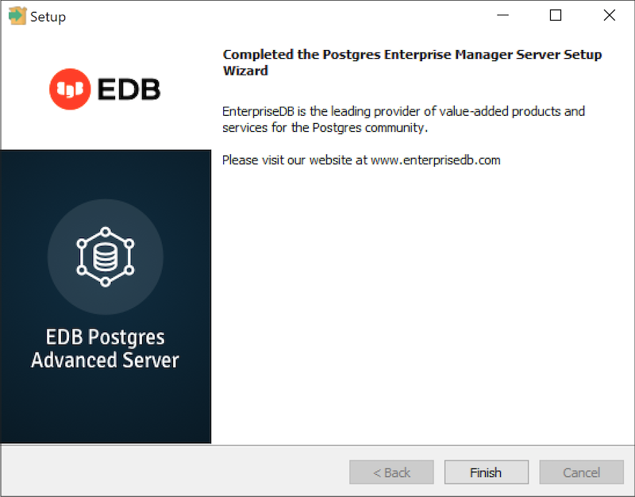

When the database portion of the PEM server installation is complete, you can invoke the PEM server on another host to install (or upgrade) PEM-HTTPD.

## Installing web services

Selecting the `Web Services` radio button on the `Advanced options` dialog instructs the PEM server installer to either install PEM-HTTPD on the current host or update an existing PEM-HTTPD installation.

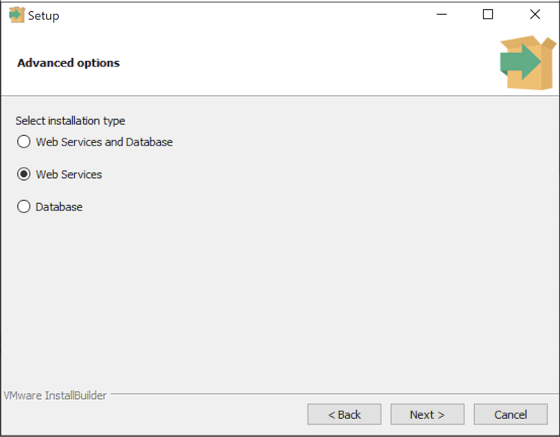

!!! Note
    The current host may not be the host of the PEM backing database.

Before selecting this option, you must have:

-   Completed an installation of the PEM server installer on a host system, during which you specified a backing database for the PEM server.
-   Modified the `pg_hba.conf` file on the PEM server database host to allow connections from the PEM-HTTPD host, and restarted the database server.

When you select the `Web Services` option and click `Next`, the PEM server installer will check the current host for existing PEM-HTTPD and LanguagePack installations.

If the installer does not locate the components, the installer will inform you that one or more dependencies are missing.

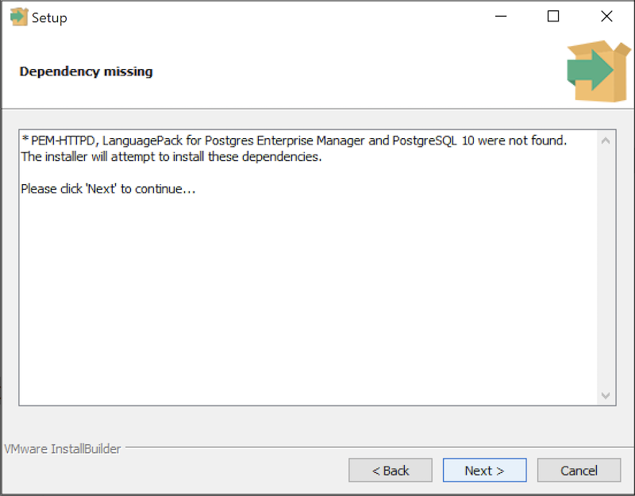

Click `Next` to instruct the server to install LanguagePack

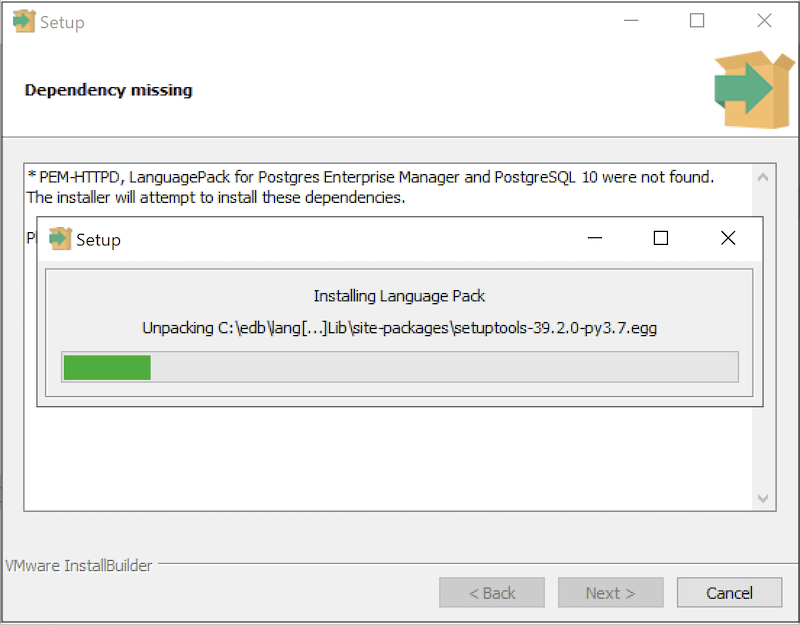

After installing language pack, the installer will invoke the PEM-HTTPD setup wizard.

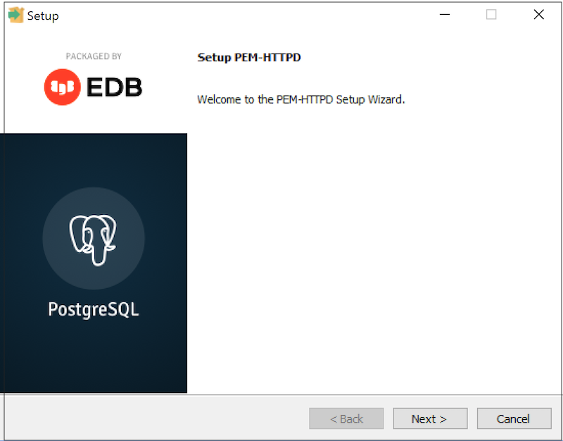

Follow the onscreen instructions of the `PEM-HTTPD Setup Wizard`. When the wizard completes the installation, click `Finish` to open the `Database Server Installation Details` dialog.

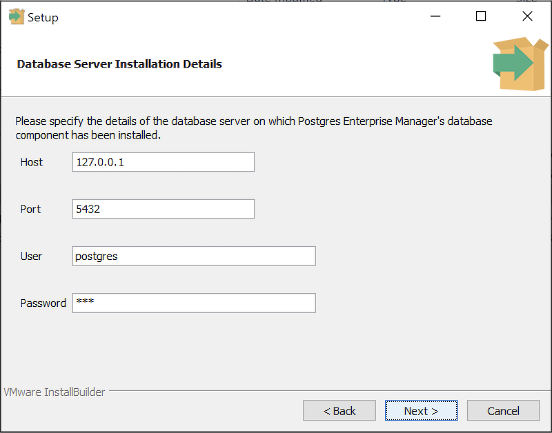

Use the fields on the `Database Server Installation Details` dialog to provide connection information for the Postgres installation that is hosting the PEM server installation:

-   Enter the name or IP address of the PEM server host in the `Host` field.
-   Enter the port number on which the Postgres server is listening in the `Port` field.
-   Enter the name of a Postgres database superuser in the `User` field.
-   Enter the password associated with the Postgres superuser in the `Password` field.

Click `Next` to continue. Before completing the PEM server installation, the installer will contact the database host. The `pg_hba.conf` file on the PEM database host must be configured to accept connections from the host of the httpd server and the firewall must allow a connection for the installation to continue. The PEM server installer will complete the PEM server installation, adding only those items that must reside on the host of the PEM-HTTPD server.

