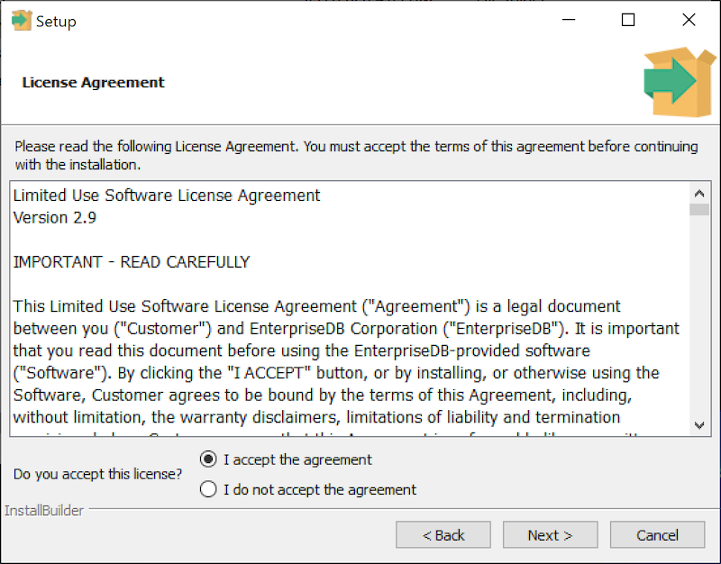
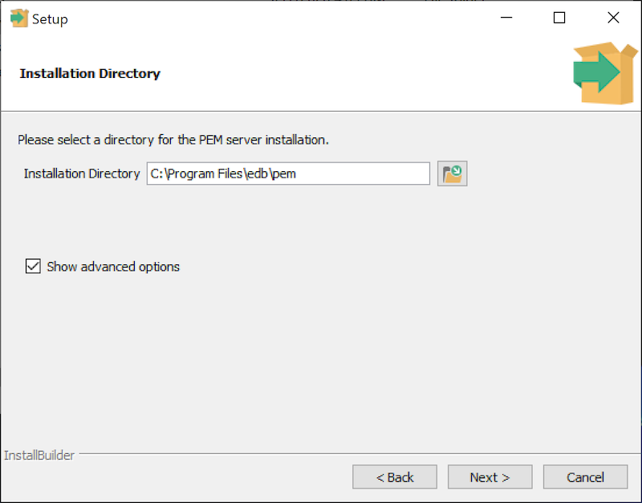
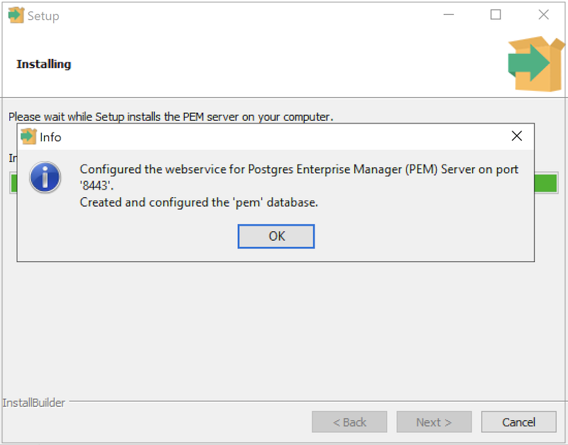
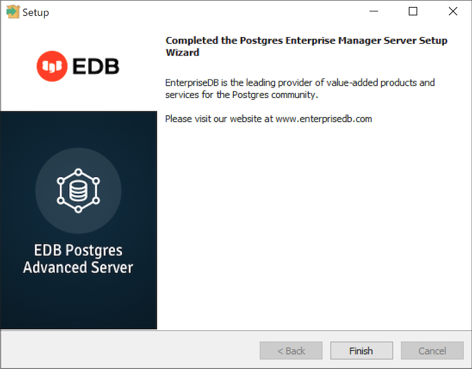

You can use an existing Postgres server (version 11 or later) to host the PEM server and the `pem` database. Postgres installers and pre-requisite software extensions are freely available on the [EnterpriseDB website](https://www.enterprisedb.com/downloads).

This section provides information about configuring an existing Postgres server for a PEM server installation.

!!! Note
    The steps that follow should be considered guidelines only; the actual steps required to configure your Postgres installation will vary depending on the configuration of your Postgres server.

The following versions of Postgres are pre-configured to contain the `sslutils` extension and a service script; no additional preparation is required to use the following Postgres versions as a PEM backend database server:

-   PostgreSQL 11 or later (as bundled with the PEM Server installer)
-   Advanced Server 11 or later

## Preparing the Postgres server

Before installing the PEM server on an existing Postgres server, you must:

-   Ensure that the Postgres server contains an installation of the `sslutils` extension. For more information, see [Installing the sslutils Extension](#installing-the-sslutils-extension) section.
-   Register the server with the Windows service manager. For more information, see the [Registering the Service](#registering-the-service) section.

After preparing the server, you can use the PEM server installer to install PEM on the existing Postgres server.

## Installing the sslutils extension

The Postgres server on which the PEM server will reside must contain the `sslutils` extension. The `sslutils` package is freely available for download from the [EDB website](https://www.enterprisedb.com/downloads/modified-gpl-source-code)

When the web page opens, select the link for the `SRC- SSL Utils 1.3` package. When the download completes, extract the file, and copy it into the Postgres installation directory.

Remember: You are *not* required to manually add the `sslutils` extension when using the following Postgres installations:

-   PostgreSQL 9.6 or later (as distributed with the PEM server installer)
-   Advanced Server 9.6 or later

`sslutils` must be built with the same compiler that was used to compile the backend Postgres installation. If you are using a backend Postgres database that was installed on a Windows platform using a PostgreSQL one-click installer (from EnterpriseDB) or an Advanced Server installer, you must use Visual Studio to build `sslutils`.

While specific details of the installation process will vary by platform and compiler, the basic steps are the same. You must:

1.  Copy the `sslutils` package to the Postgres installation directory.

2.  Open the command line of the appropriate compiler, and navigate into the `sslutils` directory.

3.  Use the following commands to build `sslutils`:

    ```text
    SET USE_PGXS=1

    SET GETTEXTPATH=<path_to_gettext>

    SET OPENSSLPATH=<path_to_openssl>

    SET PGPATH=<path_to_pg_installation_dir>

    SET ARCH=x86

    REM Set ARCH x64 for 64 bit

    msbuild sslutils.proj /p:Configuration=Release
    ```

    Where:

    `path_to_gettext` specifies the location of the `GETTEXT` library and header files.

    `path_to_openssl` specifies the location of the `openssl` library and header files.

    `path_to_pg_installation_dir` specifies the location of the Postgres installation.

4.  Copy the compiled `sslutils` files to the appropriate directory for your installation. The `sslutils` directory will contain the following files:

    ```text
    sslutils--1.3.sql

    sslutils--unpackaged--1.3.sql

    sslutils--pemagent.sql.in

    sslutils.dll
    ```

    Copy the `.dll` libraries and `.sql` files into place:

    ```text
    COPY sslutils*.sql* "%PGPATH%\share\extension\"

    COPY sslutils.dll "%PGPATH%\lib\"
    ```

## Registering the service

When you install a PostgreSQL or an Advanced Server database using an installer from EnterpriseDB, the installer will register the service for you.

If you are using Windows to host the PEM backend database, you must register the name of the Postgres server with the Windows service manager. If you are using a Postgres server that was created using an EnterpriseDB installer, the service will be registered automatically. If you are manually building the installation, you can use the `register` clause of the Postgres `pg_ctl` command to register the service. The syntax of the command is:

```text
pg_ctl register [-N <service_name>] [-U <user_name>]
 | [-P <password>] [-D <data_directory>]
```

Where:

 `service name` specifies the name of the Postgres cluster.

 `user_name` specifies the name of an operating system user with sufficient privileges to access the Postgres installation directory and start the Postgres service.

 `password` specifies the operating system password associated with the user.

 `data_directory` specifies the location of the Postgres data directory.

For more information about using the `pg_ctl` command and the available command options, see the

 [Postgres core documentation](http://www.postgresql.org/docs/current/static/app-pg-ctl.html)

## Invoking the PEM server installer

After preparing the existing Postgres server, invoke the PEM server installer. Assume Administrative privileges and navigate into the directory that contains the installer. Then, invoke the installer with the command:

```text
pem_server-7.<x>.<x>-<x>-<platform>
```

Where *x* is the major and minor versions of PEM and platform is the platform.

The installer displays a `Welcome` dialog.


Click `Next` to continue to the `License Agreement` dialog.



Carefully review the license agreement before highlighting the appropriate radio button and accepting the agreement; click `Next` to continue to the `Installation Directory` dialog.



Use the `Installation Directory` dialog to specify the location of the PEM server and access the `Advanced options` dialog:

-   Use the `Installation Directory` field to open a browser dialog and select the directory in which the PEM server will be installed.
-   If you are installing the PEM server on an existing server, check the box next to `Show advanced options` to instruct the installer to include the `Advanced options` dialog in the installation process.

Click `Next` to continue.


Use the radio buttons on the `Advanced options` dialog to specify an installation type. Select:

-   `Web Services and Database` if both the Postgres server and the PEM-HTTPD server will reside on the current host. This option is valid if you are using an existing Postgres server to host the PEM server, or using the PEM server installer to install the Postgres server on which the PEM server will reside.

    If you select `Web Services and Database`, the PEM server installer will check the current host for a PEM-HTTPD installation, and upgrade or install PEM-HTTPD if necessary.

-   `Web Services` if only the PEM-HTTPD server will reside on the current host. See [Installing Web Services](pem_server_and_httpd_on_diff_host/#installing-web-services) section for more information about invoking this option.

-   `Database` if you are installing only the PEM server (and creating the `pem` backend database) on the current host. This option is valid if you are using an existing Postgres server to host the PEM server, or using the PEM server installer to install the PostgreSQL server on which PEM will reside.

After selecting an installation option, click `Next` to continue.


Use the drop-down listbox on the `Database Server Selection` dialog to select a backend database for the PEM server:

-   Select the name of a Postgres server on the current host that was installed using a Postgres one-click installer or Advanced Server installer.
-   Select the `PostgreSQL x (Packaged)` option to instruct the installation wizard to install and use the PostgreSQL server that is packaged with the PEM server installer. Where `x` is the version of the PostgreSQL database server.
-   Select `Other Database Server` to instruct the PEM server installer to use a Postgres database that was installed from a source other than an EnterpriseDB installer (i.e. from an rpm, or built from source).

!!! Note
    The selected database server must include an installation of the `sslutils` contrib module, and a registered service (on Windows).

For information about Preparing the Postgres Server, please see [this section](#preparing-the-postgres-server).

If you selected `Web Services and Database` on the `Advanced options` dialog, the installation wizard will check the current host for an existing PEM-HTTPD installation, and upgrade or install the service as needed.

If you selected `Database` on the `Advanced options` dialog, the `Database Server Installation Details` dialog opens.


Use the fields on the `Database Server Installation Details` dialog to describe the connection to the Postgres server that will host the PEM server:

-   Enter the name of a database superuser in the `User` field.
-   Enter the password associated with the superuser in the `Password` field.

Click `Next` to continue.


Provide the administrators password under which PEM Agent service will run.

Click `Next` to continue.


Use the `Network Details` dialog to specify the CIDR-style network address from which the PEM agents will connect to the server (the `client-side` address). The specified address will be added to the server's `pg_hba.conf file.`

You can specify additional network addresses by manually adding entries to the `pg_hba.conf` file on the PostgreSQL server if required, using the initial entry as a template.

When you've added the `Network address`, click `Next` to continue to the `Agent Details` dialog.

The PEM server installer will install a PEM agent to the host on which the server resides, to monitor the server and provide alert processing and garbage collection services. A certificate will also be installed in the location specified in the `Agent certificate` path field.


You can enter an alternate description or an alternate agent certificate path for the PEM agent, or accept the defaults. Click `Next` to continue to the `Ready to Install` dialog.


The wizard is now ready to install the PEM server. Click `Back` to modify any of the options previously selected, or `Next` to continue with the installation.


During the installation process, the installer will copy files to the system, and set up the PEM server's backend database. A popup dialog opens confirming that the `pem` database has been created and configured.



 Click `OK` to acknowledge that the pem database has been created, and continue to the `Completed…` dialog.



If you are using a PEM-HTTPD service that resides on a separate host, you must:

-   Modify the `pg_hba.conf` file on the Postgres server host to allow connections between the hosts.
-   Invoke the PEM server installer on the host of the PEM-HTTPD server. See [Installing Web Services](pem_server_and_httpd_on_diff_host/#installing-web-services) section for more information about installing PEM-HTTPD.

## Invoking the server installer from the command line

The command line options of the PEM server and PEM agent installers offer functionality in situations where a graphical installation may not work because of limited resources or system configuration. You can:

-   Include the `--mode unattended` option when invoking the installer to perform an installation without additional user input.

Not all command line options are suitable for all platforms. For a complete reference guide to the command line options, include the `--help` option when you invoke the installer.

## Invoking the PEM server installer in unattended mode

You can perform an unattended PEM server installation by providing installation preferences on the command line when invoking the installer. Please note that the system on which you are installing the PEM server must have internet access.

You must have Administrative privileges to install the PEM server. Before invoking the PEM server installer, you must install the following dependencies:

-   PostgreSQL
-   pem-httpd
-   Language Pack

You can use the PEM server installer to satisfy the dependencies of the PEM server; use the following command to extract the dependencies. Navigate to the location of the installer, and use the following command to extract the dependencies:

```text
pem-server-7.<x>.<x>-windows-x64.exe --extract-dependents C:\
```

In our example, the files are extracted to the `C:\` directory. After extracting the files, you must install each program. Navigate into the directory that contains the files (in our example, `C:\)`, and enter:

```text
edb-languagepack-<version>-windows-x64.exe --mode unattended
pem-httpd-<version>-windows-x64.exe --mode unattended
postgresql-<version>-windows-x64.exe --mode unattended
```

Then, you can invoke the PEM server installer:

```text
pem-server-7.<x>.<x>-windows-x64.exe --mode unattended
--existing-user <registered_edb_user> --existing-password
<edb_user_password> --pgport <port> --pguser postgres
--agent_description pem-agent --systempassword <windows_password>
--agent-crt-path C:\edb``
```

Where:

-   `registered_edb_user` specifies the name of a registered EnterpriseDB user. To register, visit the [EDB website](https://www.enterprisedb.com/user/register)
-   `edb_user_password` specifies the password associated with the EDB user account.
-   `port` specifies the port used by the backing PostgreSQL database; by default, the PostgreSQL database uses port `5432`.
-   `cidr_address_range` specifies the address range that will be added to the `pg_hba.conf` file of the PEM server's backing database to allow connections from the agents that will be monitored by the server. You may wish to specify a network range (for example, 192.168.2.0/24) to provide server access to agents that reside on the same network.
-   `windows_password` specifies the password associated with the Windows Administrator's account.

!!! Note
    when invoked in unattended mode, the PostgreSQL installer creates a user named `postgres`, with a password of `postgres`.
