PEM contains built-in functionality that implements enterprise-wide performance monitoring of all managed servers. While you can customize many aspects of the various performance monitoring aspects of PEM, you can also elect to accept the recommended defaults that come out-of-the-box with the product.


The top-level dashboard is the `Global Overview`. The Global Overview presents a status summary of all the servers and agents that are being monitored by the PEM server, a list of the monitored servers, and the state of any currently triggered alerts.

## Using dashboards to view performance information

PEM displays performance statistics through a number of dashboards; each dashboard contains a series of summary views that contain charts, graphs and tables that display the statistics related to the selected object.

The PEM client displays the `Global Overview` dashboard when it connects to the PEM server. Additional dashboards provide statistical information about monitored objects. These include the:

**Alerts Dashboard**

The Alerts dashboard displays the currently triggered alerts. If opened from the Global Overview, the dashboard displays the current alerts for all monitored nodes on the system; if opened from a node within a server, the report will reflect alerts related to that node, and all monitored objects that reside below that object in the tree control.

**Audit Log Analysis Dashboard**

For Advanced Server users, the Audit Log Analysis dashboard allows you to browse the audit logs that have been collected from instances that have audit logging and collection enabled.

**BDR Admin Dashboard**

The BDR Admin dashboard displays the overview of information about BDR node, BDR group, and BDR worker.

**BDR Group Monitoring Dashboard**

The BDR Group Monitoring dashboard displays the information about BDR group Subscription and BDR group replication slots.

**BDR Node Monitoring Dashboard**

The BDR Node Monitoring dashboard displays the information about BDR node slots, BDR node Replication rates, and BDR conflict history summary for the selected node. 

**Database Analysis Dashboard**

The Database Analysis dashboard displays performance statistics for the selected database.

**I/O Analysis Dashboard**

The I/O Analysis dashboard displays I/O activity across various areas such as object DML activity, log operations and more.

**Memory Analysis Dashboard**

The Memory Analysis dashboard supplies statistics concerning various memory-related metrics for the Postgres server.

**Object Activity Analysis Dashboard**

The Object Activity Analysis dashboard provides performance details on tables/indexes of a selected database.

**Operating System Analysis Dashboard**

The Operating System Analysis dashboard supplies information regarding the performance of the underlying machine’s operating system.

**Probe Log Analysis Dashboard**

The Probe Log Analysis dashboard displays any error messages returned by a PEM agent.

**Server Analysis Dashboard**

The Server Analysis dashboard provides general performance information about the overall operations of a selected Postgres server.

**Server Log Analysis Dashboard**

The Server Log Analysis dashboard allows you to filter and review the contents of server logs that are stored on the PEM server.

**Session Activity Analysis Dashboard**

The Session Activity Analysis dashboard provides information about the session workload and lock activity for the selected server

**Session Waits Analysis Dashboard**

The Session Waits Analysis dashboard provides an overview of the current DRITA wait events for an Advanced Server session.

**Storage Analysis Dashboard**

The Storage Analysis dashboard displays space-related metrics for tablespaces and objects.

**System Waits Analysis Dashboard**

The System Waits Analysis dashboard displays a graphical analysis of system wait information for an Advanced Server session.

**Streaming Replication Analysis Dashboard**

The Streaming Replication Analysis dashboard displays statistical information about WAL activity for a monitored server and allows you to monitor the status of Failover Manager clusters.

There are two ways to open a dashboard; you can:

-   Select an active dashboard name from the `Dashboards` menu (accessed via the Management menu).
-   Right click on the name of a monitored object in the tree control and select the name of the dashboard you would like to review from the Dashboards menu.

Each dashboard is displayed on the `Monitoring` tab in the main panel of the client window. After opening a dashboard, you can navigate to other dashboards within the same tab.

Each dashboard header includes navigation menus that allow you to navigate to other dashboards; use your browsers forward and back icons to scroll through previously-viewed dashboards. Use the Refresh icon to update the current dashboard.

Options on the `Dashboard Configuration` dialog allow you to link the time lines of all of the line graphs on the dashboard. To open the `Dashboard Configuration` dialog, click the Settings icon displayed in the dashboard header.


Use fields on the `Dashboard Configuration` dialog to control attributes of the charts displayed on the dashboard:

-   Set the Link timelines of all the line charts slider to Enable to indicate that the specified timeline should be applied to line graphs displayed on the dashboard; if set to Disable, your preferences will be preserved for later use, but will not modify the amount of data displayed.
-   Use the `Days` selector to specify the number of days of gathered data that should be displayed on line graphs.
-   Use the `Hour(s)` selector to specify the number of hours of gathered data that should be displayed on line graphs.
-   Check the box next to Remember configuration for this dashboard to indicate that the customized time span should be applied to the current dashboard only; if left unchecked, the time span will be applied globally to line graphs on all dashboards.

Please note that settings specified on the `Dashboard Configuration` dialog are applied only to the current user's session.

## Managing custom dashboards

PEM displays performance statistics through a number of system-defined dashboards; each dashboard contains a series of summary views that contain charts, graphs and tables that display statistics related to the selected object. You can use the `Manage Dashboards` tab to create and manage custom dashboards that display the information that is most relevant to your system.


To create a custom dashboard, click the `Create New Dashboard` link (located in the Quick Links section of the Manage Dashboards tab).

To modify an existing dashboard, click the edit icon to the left of a dashboard name. The dashboard editor will open, displaying the definition of the dashboard. When you've finished modifying the dashboard's definition, click the `Save` button to preserve your changes; click `Cancel` to exit without saving your changes.

To delete a dashboard, click the delete icon to the left of a dashboard name. A popup will ask you to confirm that you wish to delete the dashboard; click `OK` to delete the selected dashboard.

### Creating a custom dashboard

You can use the PEM dashboard editor to create or modify a user-defined dashboard. The custom dashboard may include pre-defined charts, user-defined charts or a mix of pre-defined and user-defined charts.


Use the fields in the `Configure` section to specify general information about the dashboard:

-   Specify a name for the dashboard in the `Name` field. The name specified will also be the title of the dashboard if the title is displayed.
-   Use the `Level` drop-down listbox to specify the level of the PEM hierarchy within the PEM client on which the dashboard will be displayed. A dashboard may be accessed via the Dashboards menu on a Global level, an Agent level, the Server level or the Database level. Each selected level within the list will expose a different set of metrics on which the custom dashboard's charts may be based.
-   Provide a description of the dashboard in the Description field.

Provide information in the fields in the `Ops dashboard options` box if the dashboard will be used as an Ops dashboard:

-   Set the `Ops Dashboard?` field to Yes to instruct the server to create a dashboard that is formatted for display on an Ops monitor.
-   Set the `Show Title?` field to Yes to display the dashboard name at the top of the Ops dashboard.
-   Use the `Font` drop-down list box to select a custom font style for the title. The selected font style will be displayed in the Preview box.
-   Use the `Font size` drop-down list box to select a custom font size for the title. The selected font style will be displayed in the Preview box.

Use the `Permissions` box to specify the users that will be able to view the new dashboard:

-   Set the `Share with all slider` to Yes to instruct the server to allow all Teams to access the dashboard, or set Share with all to No to enable the Access permissions field.
-   Use the `Access permissions` field to specify which roles can view the new dashboard. Click in the field, and select from the list of users to add a role to the list of users with dashboard access.

When you've completed the `Configure Dashboard` section, click the arrow in the upper-right corner to close the section, and access the `Dashboard Layout Design` section.


Click the edit icon in a section header to specify a section name; then, click the add icon (+) to add a chart to the section.

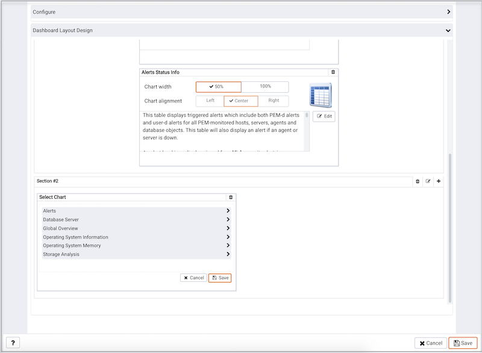

Use the arrows to the right of each chart category to display the charts available and select a chart.

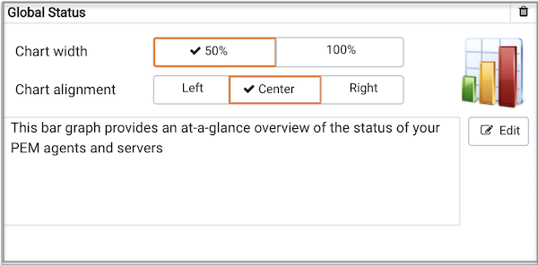

Use the chart detail selectors to specify placement details for the chart:

-   Use the `Chart width` selector to indicate the width of the chart; select 50% to display the chart in half of the dashboard, or 100% to use the whole dashboard width.

-   Use the `Chart alignment` selector to indicate the position of the chart within the section:

    Select `Left` to indicate that the chart should be left-justified.

    Select `Center` to indicate that the chart should be centered.

    Select `Right` to indicate that the chart should be right-justified.

Please note that tables are always displayed centered.

When creating or editing a custom dashboard, you can use drag and drop to re-arrange the charts within a section or to move a chart to a different section.

To add another chart to your dashboard, click the add icon (+) in the section header. When you've finished editing the dashboard, click the `Save` button to save your edits and exit.

To exit without saving your changes, click the `Cancel` button.

### Creating an Ops dashboard

You can use the PEM dashboard editor to create a custom dashboard formatted for display on an Ops monitor. An Ops dashboard displays the specified charts and graphs, while omitting header information and minimizing extra banners, titles, and borders.

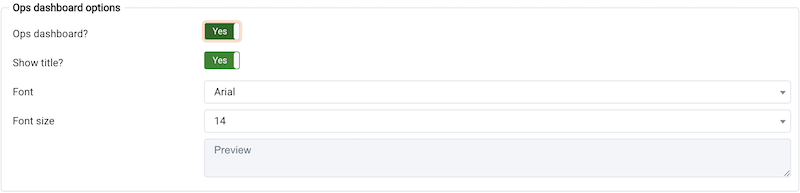

To create an `Ops dashboard`, provide detailed information about the Ops display in the `Ops dashboard options` section of the `Create Dashboard` dialog.

-   Set the `Ops Dashboard?` field to `Yes` to instruct the server to create a dashboard that is formatted for display on an Ops monitor.
-   Set the `Show Title?` field to `Yes` to display the dashboard name at the top of the Ops dashboard.
-   Use the `Font` drop-down list box to select a custom font style for the title. The selected font style will be displayed in the `Preview` box.
-   Use the `Font size` drop-down list box to select a custom font size for the title. The selected font style will be displayed in the `Preview` box.

After adding charts and tables to the Ops dashboard, click the `Save` button to save your work. You can then access the dashboard by navigating through the Dashboards menu of the hierarchy level specified in the `Level` field on the `New Dashboard` dialog.

## Using the Manage Charts tab

You can use the `Manage Charts` tab to access dialogs that allow you to create or modify a custom line chart or table, or import a Capacity Manager template for use in a custom chart. After defining a chart, you can display the chart on a custom dashboard. To open the `Manage Charts` tab, select `Manage Charts...` from the PEM client `Management` menu.


The `Manage Charts` tab provides a `Quick Links` menu that allows you to access dialogs to:

-   `Create a New Chart` for use on a custom dashboard.
-   `Import a Capacity Manager` template to use as a template for creating a custom chart.
-   Access online `Help`.

The `Custom Charts` table displays a list of user-defined charts; when a chart is newly added, the font displays in green. When you add an additional chart or refresh the screen, the name of the chart is displayed in black.


Use the search box in the upper-right hand corner of the `Custom Charts` table to search through your custom charts. Specify a:

-   Chart name
-   Type
-   Level
-   Metrics Category

Use icons to the left of a charts name in the `Custom Charts` table to manage a chart:

-   Click the edit icon to open the `Chart Configuration` wizard and modify aspects of the chart or table.
-   Click the delete icon to delete the selected chart.

### Creating a custom chart

Click the `Create New Chart` icon in the `Quick Links` section of the `Manage Charts` tab to open the `Create Chart` wizard. The wizard will walk you through the steps required to define a new chart.


Use the fields on the `Configure Chart` dialog to specify general information about the chart:

-   Specify the name of the chart in the `Name` field.
-   Use the drop-down listbox in the `Category` field to specify the category in which this chart will be displayed; when adding a custom chart to a custom dashboard, the chart will be displayed for selection in the category specified.
-   Use the radio buttons in the `Type` field to specify if the chart will be a `Line chart` or a `Table`.
-   Provide a description of the chart in the `Description` field. The description will be displayed to the user viewing the chart (on a custom dashboard) when they click the information icon.

When you've completed the fields on the `Configure Chart` dialog, click `Next` to continue.


Use the fields on the `Select Metrics` dialog to select the metrics that will be displayed on the chart.

-   Use the `Metric level` drop-down listbox to specify the level of the PEM hierarchy from which you wish to select metrics. You can specify Agent, Database, or Server. Each level offers access to a unique set of probes and metrics.

-   Use the tree control in the Available metrics box to select the metrics that will be displayed on the chart.

    If you are creating a table, you may only select metrics from one probe; each node of the tree control lists the metrics returned by a single probe. Expand a node of the tree control, and check the boxes to the left of a metric name to include that metric data in the table.

    If you are creating a line chart, expand the nodes of the tree control and double-click each metric that you would like to include in the chart.

-   Use the fields in the Selected metrics panel to specify how the metric data will be displayed in your chart. The selection panel displays the name of the metric in the (non-modifiable) Metric \[Probe] column. You can:

    -   Click the garbage can icon to delete a metric from the list of selected metrics.
    -   Use the drop-down listboxes in the `Selection Criteria` column to specify the order of the data displayed.
    -   Use the `Limit` field to specify the number of rows in a table or lines in a chart:

    The maximum number of lines allowed in a chart is 32.

    The maximum number of rows allowed in a table is 100.

-   If you are creating a line chart, PEM supports comparisons of cross-hierarchy metrics.

    -   Click the `compare icon` to open a selection box that allows you to select one or more probe-specific attributes (i.e. CPUs, interfaces, databases, etc.) to compare in the chart.
    -   Click the `copy` icon to apply your selections to all of the metrics for the same probe. When the popup opens, click `Yes` to confirm that other selections for the same probe will be overwritten, or `No` to exit the popup without copying the attributes.

When you've completed the fields on the `Select Metrics` dialog, click `Next` to continue.


Use the fields on the `Set Options` dialog to specify display options for your chart:

-   Use the `Auto Refresh` field to specify the number of minutes between chart updates - choose a value from 1 to 120. The default auto refresh rate is 2 minutes.

Use fields under the Line chart options heading to specify display preferences for a line chart:

-   Use the `Points to plot` field to specify the maximum number of points that will be plotted on the chart.
-   Use the fields to the right of the Historical span label to specify how much historical data should be displayed on the chart:
-   Use the `Day(s)` field to specify the number of days of historical data that should be included on the chart.
-   Use the `Hour(s)` field to specify the number of hours of historical data that should be included on the chart.
-   Use the `Minute(s)` field to specify the number of minutes of historical data that should be included on the chart.

Use the fields in the `Data extrapolation` box to specify if PEM should generate extrapolated data based on historical data:

-   Click the `No Extrapolation` label to omit extrapolated data from the chart.
-   Click the `Span` label to use the Days and Hours selectors to specify the period of time spanned by the metrics on the chart.
-   Click the `Threshold` label to use threshold selectors to specify a maximum or minimum value for the chart.

When you've completed the fields on the `Set Options` dialog, click `Next` to continue.


Use the fields on the `Set Permissions` dialog to specify display options for your chart.

-   Set the `Share with all slider` to `Yes` to indicate that the chart will be available to all authorized users, or `No` to restrict access to the users or groups specified in the Access permissions field.
-   Use the `Access permissions` field to select the group or groups that will have access to the chart.


When you've finished defining the chart, click `Finish` to save your edits and add your chart to the list on the `Manage Charts` tab.

### Importing a Capacity Manager Template

Click the `Import Capacity Manager Template` icon in the Quick Links section of the `Manage Charts` tab to open the `Create Chart` dialog, and use a Capacity Manager template as a starting point for a chart or table.

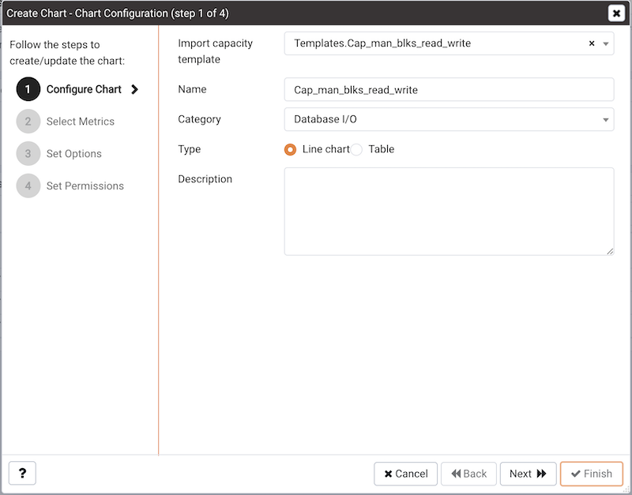

When the `Create Chart` dialog opens, provide information about the custom chart:

-   Use the drop-down listbox in the `Import capacity template` field to select the name of the template on which the chart will be based.
-   Specify the name of the chart in the `Name` field.
-   Use the drop-down listbox in the `Category` field to specify the category in which this chart will be displayed. When adding a custom chart to a custom dashboard, the chart will be displayed for selection in the Category specified.
-   Use the radio buttons in the `Type` field to specify if the chart will be a `Line chart` or a `Table`.
-   Provide a description of the chart in the `Description` field. The description will be displayed to the user viewing the chart (on a custom dashboard) when they click the information icon.

Click `Next` to continue to the Select Metrics dialog.


The `Select Metrics` window allows you to review the metrics specified by the selected template. The bottom panel of the chart editor displays the metrics that will be included in the chart. The metrics included in the chart are not modifiable via the chart editor; to modify the metrics, you must use the Capacity Manager utility to update the template.

When you've reviewed the metrics, click `Next` to continue to the Set Options dialog.


Use the fields on the `Set Options` window to specify display options for your chart:

-   Use the `Auto Refresh` field to specify the number of minutes between chart updates - choose a value from 1 to 120. The default auto refresh rate is 2 minutes.

Use the fields in the `Data extrapolation` box to specify the time period covered by the chart. You can either:

-   click the `Historical days and extrapolated days` label and provide:
    -   the number of days of historical data that should be charted in the `Historical` field.
    -   the number of projected days that should be charted in the `Extrapolated` field.
-   or, click the Historical days and threshold label and provide:
    -   the number of days of historical data that should be charted in the `Historical` field
    -   the `threshold` value at which the chart will end.

When you've completed the Set Options window, click `Next` to continue.


Use the fields on the `Set Permissions` window to specify display options for your chart:

-   Set the `Share with all slider` to Yes to indicate that the chart will be available to all authorized users, or No to restrict access to the users or groups specified in the Access permissions field.
-   Use the `Access permissions` field to select the group or groups that will have access to the chart.

When you've finished defining the chart, click `Finish` to save your edits and add your chart to the list on the `Manage Charts` tab.

## Probes

A `probe` is a scheduled task that retrieves information about the database objects that are being monitored by the PEM agent. PEM uses the collected information to build the graphs displayed on each homepage. The `Manage Probes` tab (accessed via the `Management` menu) allows you to modify the data collection schedule and the length of time that PEM will retain information returned by a specific probe.

### System probes

Unless otherwise noted, Postgres Enterprise Manager enables the following probes at the server, database, schema, extension (starting with version 8.4), or agent levels:

| Probe Name                               | Information Monitored by Probe                                                                                                                                                                                                                                                                                                                                                                                                                                                                                                                       | Level    |
| ---------------------------------------- | ---------------------------------------------------------------------------------------------------------------------------------------------------------------------------------------------------------------------------------------------------------------------------------------------------------------------------------------------------------------------------------------------------------------------------------------------------------------------------------------------------------------------------------------------------- | -------- |
| Background Writer Statistics             | This probe monitors information about the background writer. The information includes:<br/>The number of timed checkpoints<br/>The number of requested checkpoints<br/>The number of buffers written (by checkpoint)<br/>The number of buffers written (by background writer)<br/>The number of background writer cycles<br/>The number of background buffers written<br/>The number of buffers allocated                                                                                                                                            | Server   |
| Barman Configuration                     | This probe returns information about the Barman tool global configuration.                                                                                                                                                                                                                                                                                                                                                                                                                                                                                                                                                                                                                                                         | Agent                    |
| Barman Information                       | This probe returns information about the Barman tool.                                                                                                                                                                                                                                                                                                                                                                                                                                                                                                                                                                                                                                                                              | Agent                    |
| Barman Server                            | This probe returns information about the respective database server configuration monitored by Barman.                                                                                                                                                                                                                                                                                                                                                                                                                                                                                                                                                                                                                             | Agent                    |
| Barman Server Status                     | This probe returns information about the respective database server status monitored by Barman.                                                                                                                                                                                                                                                                                                                                                                                                                                                                                                                                                                                                                                    | Agent                    |
| Barman Server Backup                     | This probe returns information about the backups of the respective database servers.                                                                                                                                                                                                                                                                                                                                                                                                                                                                                                                                                                                                                                               | Agent                    |
| Barman Server WAL Status                 | This probe returns information about the Barman server WAL files.                                                                                                                                                                                                                                                                                                                                                                                                                                                                                                                                                                                                                                                                  | Agent                    |
| Blocked Session Information              | This probe provides information about blocked sessions.                                                                                                                                                                                                                                                                                                                                                                                                                                                                                              | Server   |
| CPU Usage                                | This probe monitors CPU Usage information.                                                                                                                                                                                                                                                                                                                                                                                                                                                                                                           | Agent    |
| Data and Log File Analysis               | This probe monitors information about log files. The information includes:<br/>The name of the log file<br/>The directory in which the log file resides                                                                                                                                                                                                                                                                                                                                                                                              | Server   |
| Database Frozen XID                      | This probe monitors the frozen XID of each database.                                                                                                                                                                                                                                                                                                                                                                                                                                                                                                 | Server   |
| Database Size                            | This probe monitors information about the size of the monitored databases.The information includes:<br/>The time the information was gathered<br/>The database name<br/>The database size (in MB's).                                                                                                                                                                                                                                                                                                                                                 | Server   |
| Database Statistics                      | This probe monitors database statistics. The information includes:<br/>The number of backends<br/>The number of transactions committed<br/>The number of transactions rolled back<br/>The number of blocks read<br/>The number of blocks hit<br/>The number of rows returned<br/>The number of rows fetched<br/>The number of rows inserted<br/>The number of rows updated<br/>The number of rows deleted                                                                                                                                            | Server   |
| Disk Busy Info                           | This probe monitors information about disk activity.<br/>Note: This probe is not supported on Mac OS X, Solaris or HP-UX                                                                                                                                                                                                                                                                                                                                                                                                                             | Agent    |
| Disk Space                               | This probe monitors information about disk space usage. The information includes:<br/>The amount of disk space used<br/>The amount of disk space available                                                                                                                                                                                                                                                                                                                                                                                           | Agent    |
| EDB Audit Configuration                  | This probe monitors the audit logging configuration of EDB Postgres Advanced Server.                                                                                                                                                                                                                                                                                                                                                                                                                                                                 | Server   |
| Failover Manager Cluster Info            | This probe monitors a Failover Manager cluster, returning information about the cluster. This probe is disabled unless a cluster name and path of the Failover Manager binary is provided on the Server Properties dialog.                                                                                                                                                                                                                                                                                                                           | Server   |
| Failover Manager Node Status             | This probe monitors a Failover Manager cluster, returning detailed about each node within the cluster. This probe is disabled unless a cluster name and path of the Failover Manager binary is provided on the Server Properties dialog.                                                                                                                                                                                                                                                                                                             | Server   |
| Function Statistics                      | This probe monitors a database, retrieving information about functions. The information includes:<br/>Function names<br/>Argument types<br/>Return values                                                                                                                                                                                                                                                                                                                                                                                            | Database |
| Index Size                               | This probe monitors a database, retrieving information about indexes. The information includes:<br/>The name of the index<br/>The time the data was gathered<br/>The size of the index (in MB's)                                                                                                                                                                                                                                                                                                                                                     | Database |
| Index Statistics                         | This probe monitors index statistics. The information includes:<br/>The number of index scans<br/>The number of rows read<br/>The number of rows fetched<br/>The number of blocks read<br/>The number of blocks hit                                                                                                                                                                                                                                                                                                                                  | Database |
| Installed Packages                       | This probe monitors the packages that are currently installed. The information gathered includes:<br/>The name of the installed package<br/>The version of the installed package<br/>The date and time that the probe executed                                                                                                                                                                                                                                                                                                                       | Agent    |
| IO Analysis                              | This probe monitors disk I/O information in. The information includes:<br/>The number of blocks read<br/>The number of blocks written<br/>The date and time that the probe executed<br/>Note: This probe is not supported on Mac OS X                                                                                                                                                                                                                                                                                                                | Agent    |
| Load Average                             | This probe monitors CPU load averages. The information includes:<br/>The 1-minute load average<br/>The 5-minute load average<br/>The 15-minute load average<br/>Note: This probe is not supported on Windows                                                                                                                                                                                                                                                                                                                                         | Agent    |
| Lock Information                         | This probe monitors lock information. The information includes:<br/>The database name<br/>The lock type<br/>The lock mode<br/>The process holding the lock                                                                                                                                                                                                                                                                                                                                                                                           | Server   |
| Memory Usage                             | This probe monitors information about system memory usage.The information includes:<br/>Total RAM in MB<br/>Free RAM in MB<br/>Total swap memory in MB<br/>Free swap memory in MB<br/>Shared system memory in MB(It is used by tuning wizard to tune the memory parameters for the database server)<br/>- On non-windows system, it is `shmmax` value and read from `/proc/sys/kernel/shmmax`.<br/>- On windows, it is same as total memory.                                                                                                         | Agent    |
| Network Statistics                       | This probe monitors network statistics. The information includes:<br/>The interface IP address<br/>The number of packets sent<br/>The number of packets received<br/>The number of bytes sent<br/>The number of bytes received<br/>The link speed (in MB/second)                                                                                                                                                                                                                                                                                     | Agent    |
| Number of Prepared Transactions          | This probe stores the number of prepared transactions.                                                                                                                                                                                                                                                                                                                                                                                                                                                                                               | Server   |
| Number of WAL Files                      | This probe monitors the number of WAL files.                                                                                                                                                                                                                                                                                                                                                                                                                                                                                                         | Server   |
| Object Catalog: Database                 | This probe monitors a list of databases and their properties The information includes:<br/>The database name<br/>The database encoding type<br/>If the database allows user connections or system connections                                                                                                                                                                                                                                                                                                                                        | Server   |
| Object Catalog: Foreign Key              | This probe monitors a list of foreign keys and their properties. The information includes:<br/>The name of the table that contains the foreign key<br/>The name of the table that the foreign key references<br/>The name of the database in which the table resides<br/>The name of the schema in which the table resides                                                                                                                                                                                                                           | Schema   |
| Object Catalog: Function                 | This probe monitors a list of functions and their properties. The information includes:<br/>The name of the function<br/>The name of the schema in which the function resides<br/>The name of the database in which the function resides                                                                                                                                                                                                                                                                                                             | Schema   |
| Object Catalog: Index                    | This probe monitors a list of indexes and their properties. The information includes:<br/>The name of the index<br/>The name of the table that the index is associated with<br/>The name of the database in which the indexed table resides                                                                                                                                                                                                                                                                                                          | Schema   |
| Object Catalog: Schema                   | This probe monitors a list of schemas and their associated databases and servers.                                                                                                                                                                                                                                                                                                                                                                                                                                                                    | Database |
| Object Catalog: Sequence                 | This probe monitors a list of sequences and their properties.                                                                                                                                                                                                                                                                                                                                                                                                                                                                                        | Schema   |
| Object Catalog: Table                    | This probe monitors a list of table information. The information includes:<br/>The table name<br/>The name of the schema in which the table resides<br/>The name of the database in which the schema resides<br/>A Boolean indicator that indicates if the table has a primary key                                                                                                                                                                                                                                                                   | Schema   |
| Object Catalog: Tablespace               | This probe monitors a list of tablespaces.                                                                                                                                                                                                                                                                                                                                                                                                                                                                                                           | Server   |
| Operating System Information             | This probe monitors the operating system details and boot time.                                                                                                                                                                                                                                                                                                                                                                                                                                                                                      | Agent    |
| Package Catalog                          | This probe monitors the packages that are currently available for installation. The information gathered includes:<br/>The package name<br/>The package version                                                                                                                                                                                                                                                                                                                                                                                      | Agent    |
| PG HBA Conf                              | This probe monitors authentication configuration information from the pg_hba.conf file.                                                                                                                                                                                                                                                                                                                                                                                                                                                              | Server   |
| Server Information                       | This probe monitors server information.                                                                                                                                                                                                                                                                                                                                                                                                                                                                                                              | Server   |
| Session Information                      | This probe monitors session information. The information includes:<br/>The name of the session user<br/>The date and time that the session connected to the server<br/>The status of the session at the time that the information was gathered (idle, waiting, etc)<br/>The client address and port number                                                                                                                                                                                                                                           | Server   |
| Settings                                 | This probe monitors the values currently assigned to GUC variables.                                                                                                                                                                                                                                                                                                                                                                                                                                                                                  | Server   |
| SQL Protect                              | This probe monitors a server, retrieving information about SQL injection attacks.                                                                                                                                                                                                                                                                                                                                                                                                                                                                    | Server   |
| Slony Replication                        | This probe monitors lag data for clusters replicated using Slony.                                                                                                                                                                                                                                                                                                                                                                                                                                                                                    | Database |
| Streaming Replication                    | This probe monitors a cluster that is using streaming replication, retrieving information about:<br/>The sent Xlog location (in bytes)<br/>The write Xlog location (in bytes)<br/>The flush Xlog location (in bytes)<br/>The replay Xlog location (in bytes)<br/>The Xlog lag (in segments)<br/>The Xlog lag (in pages)                                                                                                                                                                                                                              | Server   |
| Streaming Replication Lag Time           | This probe monitors a cluster that is using streaming replication, retrieving lag information about:<br/>Replication lag time (in seconds)<br/>Current status of replication (running/paused)                                                                                                                                                                                                                                                                                                                                                        | Server   |
| Streaming Replication Database Conflicts | This probe monitors a database that is using streaming replication, retrieving information about any conflicts that arise. This includes information about queries that have been canceled due to:<br/>The # of drop tablespace conflicts<br/>The # of lock timeout conflicts<br/>The # of old snapshot conflicts<br/>The # of pinned buffer conflicts<br/>The # of deadlock conflicts                                                                                                                                                               | Server   |
| Table Bloat                              | This probe monitors information about the current table bloat. The information includes:<br/>The name of the table<br/>The name of the schema in which the table resides<br/>The estimated number of pages<br/>The estimated number of wasted pages<br/>The estimated number of bytes per row                                                                                                                                                                                                                                                        | Database |
| Table Frozen XID                         | This probe monitors the frozen XID of each table.                                                                                                                                                                                                                                                                                                                                                                                                                                                                                                    | Schema   |
| Table Size                               | This probe monitors information about table size. The information includes:<br/>Table size (in MB's)<br/>Total index size (in MB's)<br/>Total table size, with indexes and TOAST (in MB's)                                                                                                                                                                                                                                                                                                                                                           | Database |
| Table Statistics                         | This probe monitors table statistics. The information includes:<br/>The number of sequential scans<br/>The number of sequential scan rows<br/>The number of index scans<br/>The number of index scan rows<br/>The number of rows inserted<br/>The number of rows updated<br/>The number of rows deleted<br/>The number of live rows<br/>The number of dead rows<br/>The last VACUUM<br/>The last auto-vacuum<br/>The last ANALYZE<br/>The last auto-analyze<br/>The number of pages estimated by ANALYZE<br/>The number of rows estimated by ANALYZE | Database |
| Tablespace Size                          | This probe monitors a list of tablespaces and their sizes.                                                                                                                                                                                                                                                                                                                                                                                                                                                                                           | Server   |
| User Information                         | This probe monitors a list of the current users. The stored information includes:<br/>The user name<br/>The user type (superuser vs. non-superuser)<br/>The server to which the user is connected                                                                                                                                                                                                                                                                                                                                                    | Server   |
| WAL Archive Status                       | This probe monitors the status of the WAL archive. The stored information includes:<br/>The # of WAL archives done<br/>The # of WAL archives pending<br/>The last archive time<br/>The # of WAL archives failed<br/>The time of the last failure                                                                                                                                                                                                                                                                                                     | Server   |
| xDB Replication                          | This probe monitors lag data for clusters replicated using xDB replication.                                                                                                                                                                                                                                                                                                                                                                                                                                                                          | Database |

<div id="bdr_probes" class="registered_link"></div>

### BDR probes

To monitor the BDR Group via BDR dashboards, the following probes must be enabled. All these probes are configured at extension level.

!!! Note
    Prior to version 8.4, all these probes are available at the server level.


The user with `bdr_superuser` will be able to view information from all the following probes.

All the following probes works with `BDR Enterprise Edition`.

| Probe Name                         | Information Monitored by Probe                                                                                                                                                                                                                                                                                                                                                                                                                                                                                                                                                                                                                                                                                                                    | `bdr_monitor` role required? | Works with BDR SE? |
| ---------------------------------- | ------------------------------------------------------------------------------------------------------------------------------------------------------------------------------------------------------------------------------------------------------------------------------------------------------------------------------------------------------------------------------------------------------------------------------------------------------------------------------------------------------------------------------------------------------------------------------------------------------------------------------------------------------------------------------------------------------------------------------------------------- | ---------------------------- | ------------------ |
| BDR Conflict History Summary       | This probe returns information about row conflicts per conflict type. The stored information inlcudes:<br/>The local time of the conflict <br/>The type of the conflict                                                                                                                                                                                                                                                                                                                                                                                                                                                                                                                                                                           | Yes                          | Yes                |
| BDR Global Locks                   | This probe returns information about global locks in a BDR Group. The stored information includes: <br/>The name of the node where the global lock has originated<br/>The PID of the process holding the lock<br/>The type of lock (DDL or DML)<br/>The name of the locked relation(for DML Locks) or Keys(for advisory locks)<br/>The internal state of the lock acquistion process<br/>The list of backends waiting for the same global lock<br/>The time when the global lock acquire was initiated by origin node<br/>The time when the local node started trying to acquire the local lock<br/>The time acquire_stage last changed                                                                                                           | Yes                          | Yes                |
| BDR Group Camo Details             | This probe returns information about Camo's in BDR Group. The stored information includes:<br/>The name of the node<br/>The node name for whom this node is partner<br/>The node name for whom this node is origin<br/>The connection status<br/>The readiness status<br/>The number of pending or unresolved camo transactions<br/>The lsn of last applied wal log<br/>The lsn of last received wal log                                                                                                                                                                                                                                                                                                                                          | No                           | No                 |
| BDR Group Replication Slot Details | This probe returns information about replication slots in BDR Group. The stored information includes:<br/>The name of the BDR Group<br/>The name of the origin node<br/>The name of the target node<br/>The slot name on the origin node used by this subscription<br/>The active status<br/>The state of the replication (catchup,streaming,disconnected,..)<br/>The approximate lag time for reported write <br/>The approximate lag time for reported flush<br/>The approximate lag time for reported replay<br/>The bytes difference between sent_lsn and current WAL write position<br/>The bytes difference between write_lsn and current WAL write position<br/>The bytes difference between flush_lsn and current WAL write position<br/> | No                           | Yes                |
| BDR Group Subscription Summary     | This probe returns information about the summary of Subscriptions in the BDR Group. The stored information includes: <br/>The name of the origin of the subscription<br/>The name of the target of the subscription<br/>The timestamp of the last replayed transaction<br/>The lag between now and time of last replayed transaction<br/>                                                                                                                                                                                                                                                                                                                                                                                                         | No                           | Yes                |
| BDR Monitor Group Raft             | This probe returns the status and message of a cluster-wide raft check.                                                                                                                                                                                                                                                                                                                                                                                                                                                                                                                                                                                                                                                                           | Yes                          | Yes                |
| BDR Group Raft Details             | This probe returns the information about raft consensus status from all the nodes in BDR Group. The stored information includes: <br/>The name of the node<br/>The raft worker state on the node<br/>The node id of the RAFT_LEADER<br/>The raft election internal id<br/>The raft snapshot internal id                                                                                                                                                                                                                                                                                                                                                                                                                                           | Yes                          | Yes                |
| BDR Monitor Group Versions         | This prove returns the status and message of cluster-wide version check.                                                                                                                                                                                                                                                                                                                                                                                                                                                                                                                                                                                                                                                                          | Yes                          | Yes                |
| BDR Group Versions Details         | This probe returns the information about version details of the installed postgres, pglogical, bdr, and bdr edition for each node in the BDR Group. The stored information includes: <br/>The name of the node<br/>The installed postgres version on the node<br/>The installed pglogical version on the node <br/>The version of the BDR on the node<br/>The BDR edition (Standard/Enterprise)                                                                                                                                                                                                                                                                                                                                                   | No                           | Yes                |
| BDR Node Replication Rates         | This probe returns information about outgoing replication activity from a given node. The stored information includes:<br/>The name of the target peer node<br/>The latest sent position<br/>The latest position reported as replayed<br/>The approximate lag time for reported replay<br/>The bytes difference between replay_lsn and current WAL write position on origin<br/>The human readable bytes difference between replay_lsn and current WAL write position<br/>Approximate time required for the peer node to catchup to all the changes that are yet to be applied                                                                                                                                                                    | Yes                          | No                 |
| BDR Node Slots                     | This probe returns information about the mapping of local BDR nodes to replication slots, their status, and replication progress. The stored information includes:<br/>The name of the slot<br/>The name of the target node<br/>The name of the BDR Group<br/>The database name on the target node<br/>The PID of the process attached to the slot <br/>The catalog XID needed by the slot<br/>The IP address of the client connection<br/>The latest sent position<br/>The latest position reported as replayed<br/>The approximate lag time for reported replay<br/>The Bytes difference between replay_lsn and current WAL write position<br/>The Human-readable bytes difference between replay_lsn and current WAL write position            | Yes                          | Yes                |
| BDR Node Summary                   | This probe returns information about all the nodes in the BDR Group. The stored information includes:<br/>The name of the Node<br/>The name of the BDR group the node is part of<br/>The consistent state of the node in human readable form<br/>The state which the node is trying to reach (during join or promotion)<br/>The name of subscribed repsets                                                                                                                                                                                                                                                                                                                                                                                        | Yes                          | Yes                |
| BDR Workers                        | This probe returns information about workers in BDR node. The stored information includes:<br/>The PID of the worker process<br/>The worker query start timestamp<br/>The worker state change timestamp<br/>The worker wait event type<br/>The worker wait event<br/>The worker state<br/>The worker role name<br/>The worker commit timestamp<br/>The worker local timestamp<br/>The name of the origin node<br/>The receive LSN<br/>The receive commit LSN<br/>The last exact replay LSN<br/>The last exact flush LSN<br/>The last exact replay timestamp<br/>The worker query                                                                                                                                                                  | Yes                          | Yes                |
| BDR Work Errors                    | This probe returns information aboutthe work errors in BDR node. The stored information includes:<br/>The process id of the worker causing the error<br/>The name of the BDR Group the node is part of<br/>The name of the origin node <br/>The name of the source node<br/><br/>The name of the target node<br/>The name of the subscription<br/>The internal identifier of the role of this worker<br/>The name of the role of this worker<br/>The date and time of the error<br/>The age of the error<br/>The description of the error<br/>he context in which the error happened<br/>The remote relation id<br/>The subscription writer id<br/>The subscription writer name                                                                   | Yes                          | Yes                |

### Customizing probes

A probe is a scheduled task that returns a set of performance metrics about a specific monitored object. A probe retrieves statistics from a monitored server, database, operating system or agent. You can use the `Manage Probes` tab to override the default configuration and customize the behavior of each probe.

To open the `Manage Probes` tab, select `Manage Probes...` from the `Management` menu. The `Manage Probes` tab opens in the PEM client.


The `Manage Probes` tab provides a set of Quick Links that you can use to create and manage probes:

-   Click the `Manage Custom Probes` icon to open the `Custom Probes` tab and create or modify a custom probe.
-   Click the `Copy Probes` icon to open the Copy Probe dialog, and copy the probe configurations from the currently selected object to one or more monitored objects.

!!! Note
    At the moment the `Copy Probe` is not supported for the extension level probes.

A probe monitors a unique set of metrics for each specific object type (server, database, database object, or agent); select the name of an object in the tree control to review the probes for that object.

To modify the properties associated with a probe, highlight the name of a probe, and customize the settings that are displayed in the Probes table:

-   Move the `Default` switch in the `Execution Frequency` columns to `N` to enable the Minutes and Seconds selectors, and specify a non-default value for the length of time between executions of the probe.
-   Move the `Default` switch in the `Enabled?` column to `No` to change the state of the probe, and indicate if the probe is active or not active.

!!! Note
    If data from a disabled probe is used in a chart, the chart will display an information icon in the upper-left corner that allows you to enable the probe by clicking the provided link.

-   Move the `Default` switch in the `Data Retention` column to `No` to enable the Day(s) field and specify the number of days that information gathered by the probe is stored on the PEM server.

The `Manage Probes` tab may display information about probes that cannot be modified from the current node. If a probe cannot be modified from the current dialog, the switches are disabled. Generally, a disabled probe can be modified from a node that is higher in the hierarchy of the PEM client tree control; select another object in the tree control to modify which probes are displayed or enabled in the `Manage Probes` tab.

#### Creating a custom probe

You can use the `PEM Custom Probes` tab to create a new probe or modify an existing user-defined probe. To open the `Custom Probes` tab, select the `Manage Custom Probes...` icon from the `Manage Probes` tab.


Use the `Show System Probes?` switch to display or conceal the system probes on the `Custom Probes` tab.

You can use the `Custom Probes` tab to create a new probe or modify an existing probe. To create a new probe, click the `Add` icon in the upper-right corner of the tab; provide a name for the new probe in the `Probe Name` column. Then, select the `Edit` icon (located to the left of the probe name) to review or add the probe definition.


Use the fields on the `General` tab to modify the definition of an existing probe or to specify the properties of a new probe:

-   Use the `Probe Name` field to provide a name for a new probe.

-   Use the `Collection method` field to specify the probe type. Use the drop-down listbox to select:

    -   SQL - the probe will gather information via a SQL statement.
    -   WMI - the probe will gather information via a Windows Management Instrumentation extension.
    -   Batch - the probe will use a command-script or shell-script to gather information.

    Before creating a batch probe on a Linux system, you must modify the `agent.cfg` file, setting the `allow_batch_probes` parameter equal to `true`, and restart the PEM agent. The `agent.cfg` file is located in one of the following directories:

    -   If you have installed PEM using graphical installer: `/opt/edb/pem/agent/etc/agent.cfg`
    -   If you have installed PEM using RPM: `/usr/edb/pem/agent/etc/agent.cfg`

    On 64-bit Windows systems, agent settings are stored in the registry. Before creating a batch probe, modify the registry entry for the `AllowBatchProbes` registry entry and restart the PEM agent. PEM registry entries are located in `HKEY_LOCAL_MACHINE\Software\Wow6432Node\EnterpriseDB\PEM\agent`.

    Please note that batch probes are platform-specific. If you specify a collection method of Batch, you must specify a platform type in the Platform field.

    To invoke a script on a Linux system, you must modify the entry for `batch_script_user` parameter of `agent.cfg` file and specify the user that should be used to run the script. You can either specify a non-root user or root for this parameter. If you do not specify a user, or the specified user does not exist, then the script will not be executed. Restart the agent after modifying the file.

    To invoke a script on a Windows system, set the registry entry for `AllowBatchJobSteps` to true and restart the PEM agent.

-   Use the `Target Type` drop-down listbox to select the object type that the probe will monitor. Target type is disabled if Collection method is WMI.

-   Use the `Minutes` and `Seconds` selectors to specify how often the probe will collect data.

-   Use the `Probe Enable?` switch to specify if the probe in enabled by default. Specify Yes to enable the probe by default, or No to specify that the probe is disabled by default.

!!! Note
    If data from a disabled probe is used in a chart, the chart will display an information icon in the upper-left corner that allows you to enable the probe by clicking the provided link.

-   Use the `Data Retention` field to specify the number of days that gathered information will be retained in the probe's history table.
-   Use the switch next to `Discard from history` to specify if the server should create a history table for the probe. Select `Yes` to discard probe history, or `No` to retain the probe history in a table.
-   Use the `Platform` drop-down listbox to specify the type of platform that the probe will monitor. This field is enabled only when the Collection method is Batch.


Use the `Columns` tab to define the columns in which the probe data will be stored. Navigate to the `Columns` tab, and click the `Add` button (in the upper-right corner) to define a new column. After a providing a column name in the `Name` field, click the `Edit` button (to the left of the new column name) to provide information about the column:

-   Provide a descriptive name for the column in the `Name` field.

-   The `Internal Name` field is not enabled for user-defined probes.

-   Use the `Column Type` drop-down listbox to specify if the column is a Key column (a primary key) or a Non key column. Non-key columns are generally metric items (values that can be graphed).

-   Use the `Data Type` drop-down listbox to specify the type of data that will be stored in the column.

-   Use the `Unit` field to specify the unit of measure that applies to the metric stored in the column. This unit is displayed on the Y-Axis of a custom chart or a Capacity Manager chart. This is an optional field.

-   Use the `Graphable` switch to specify if the defined metric may be graphed, and that the probe should be accessible from the Capacity Manager or Manage Charts dialogs.

-   Use the `Is PIT` switch to specify if the metric should be stored by point-in-time.

    'Point-in-time' metrics are those metrics that change (increase or decrease) at any given point of time. For example, database size is a point-in-time metric; at any given point-in-time, the size of the database is fluctuating. Metrics that are not point-in-time (also referred to as cumulative metrics) are metrics whose size always increases over time. For example, Blocks Read and Tuples Read are cumulative metrics; the value stays the same or increases.

-   Use the `Calculate PIT` switch to specify that the server should calculate a point-in-time value for the metric data. `Calculate PIT` is disabled if `Is PIT` is `Yes`.

    PEM allows you to store point-in time-values of cumulative metrics as well. PEM subtracts the last collected value of a cumulative metric from the current value, and stores the difference as a point-in-time value.


Use the `Code` tab to specify the default code that will be executed by the probe:

-   If the probe is a SQL probe, you must specify the `SQL SELECT` statement invoked by the probe on the `Code` tab. The column names returned by the query must match the Internal Name specified on the `Columns` tab. The number of columns returned by the query, as well as the column name, data type, etc. must match the information specified on the `Columns` tab.

-   If the probe is a batch probe, you must specify the shell or .bat script that will be invoked when the probe runs. The output of the script should be as follows:

    The first line must contain the names of the columns provided on the `Columns` tab. Each column name should be separated by a tab (t) character. From the second line onwards, each line should contain the data for each column, separated by a tab character.

    If a specified column is defined as key column, you should ensure that the script does not produce duplicate data for that column across lines of output. The number of columns specified in the `Columns` tab and their names, data type, etc. should match with the output of the script output.

-   If the probe is a WMI probe, you must specify the WMI query as a `SELECT WMI` query. The column name referenced in the `SELECT` statement should be same as the name of the corresponding column specified on the `Column` tab. The column names returned by the query must match the `Internal Name` specified on the `Column` tab. The number of columns returned by the query, as well as the column name, data type, etc. must match the information specified on the Columns tab.


Use the `Alternate Code` tab to provide code that will be invoked if the probe fires on a specific version of the server. To provide version-specific code, move the `Applies to any server version?` switch to `No`, and click the `Add` button. Then, use the `Database Version(s)` drop-down listbox to select a version, and click the `Edit` button (to the left of the version name) to provide the code that will execute when the probe fires.

If you select a database version, and leave the `Probe Code` column blank, PEM will invoke the code specified on the `Code` tab when the probe executes on a server that matches that version.

When you've finished defining the probe, click the `Save` icon (in the corner of the `Custom Probes` tab) to save the definition, and make the probe data available for use on custom charts and graphs.

#### Exporting or importing a probe

!!! Tip "New Feature"
    Export and import of probes to another PEM Server is available from 8.2.0 and later.

To `Export` the probe, select any probe/s from the `Manage Custom Probes` tab and then select the `Export` icon in the upper-right corner of the table. Select `Save File` option and then select `ok`, it will generate the `JSON` file.


To `Import` the probe, go to the `Manage Custom Probes` tab and then select the `Import` icon in the upper-right corner of the table.


Click on the `Browse` button to select the `JSON` file with the probe code to be imported and then click `Import`.


After selecting the file to import you can select the `skip existing` checkbox. If selected then it will skip the probe if it already exists.

If the checkbox is selected and the probe already exists, then it skips importing the probe with the message as below:


If the checkbox is not selected and the probe already exists, then it does not import the probe and throws the below error:


!!! Note
    `Import` cannot overwrite the existing probe as it may be configured to retain historical data as per the configured retention policy.

If the checkbox is not selected and probe does not exist but the corresponding table in the `pem` schema exists, then it imports the probe successfully using the same table.


!!! Note
    It is possible that probe is deleted and not listed on `Manage Custom Probe` tab, but still the table holding the data of that probe exists in the `pem` schema.

#### Deleting a probe

You may delete only user-defined probes.  To delete a probe, select the probe name in the probes table, and select the `Delete` icon (located to the upper-right corner of the table).  The probe history will persist for the length of time specified on the `History Retention` field in the probe definition. During the deletion the probe definition is deleted and any corresponding tables are  dropped from the `pemdata` and `pemhistory` schemas.

System probes are the built-in probes provided by PEM, and are part of the PEM schema. You may only modify system probes; if you attempt to delete a system probe, you will receive an error from PEM.


#### Copying a probe

You can use the `Copy Probe Configuration...` dialog to copy probe definitions from one monitored object to one or more monitored objects of the same type. To open the `Copy Probe Configuration...` dialog, highlight the object from which you are copying probes in the PEM client tree control, and select `Manage Probes` from the `Management` menu. When the `Manage Probes` tab opens, click on `Copy Probe` to open the `Copy Probe Configuration` dialog:


The dialog will copy the probe definitions from the object through which the Copy Probe Configuration dialog was opened, to the location(s) selected on the tree control.

Note that if you specify a parent node in the `Copy Probe Configuration` tree control, PEM will copy the probe configurations to each object (of the same type) that resides under that node in the tree control. For example, to copy the probe definitions from one schema to all schemas that reside within a database, select only the parent database of the target schemas. Please note that a red warning symbol is displayed to the left of the name of a listed target object if that object is the source of the probe that is being copied.

When you have selected the target object or objects, click the `Configure Probes` button to copy the probe definitions to the location selected on the dialog.

## Alerting

PEM continually monitors registered servers and compares performance metrics against pre-defined and user-specified thresholds that constitute good or acceptable performance for each statistic. Any deviation from an acceptable threshold value triggers an alert. An alert is a system-defined or user-defined set of conditions that PEM compares to the system statistics. Alerts call your attention to conditions on registered servers that require your attention.

### Viewing the alerts via Global dashboard

When your system statistics deviate from the boundaries specified for that statistic, the alert triggers, displaying a high (red), low (yellow), or medium (orange) severity warning in the left-most column of the `Alert Status` table on the `Global Overview` dashboard.

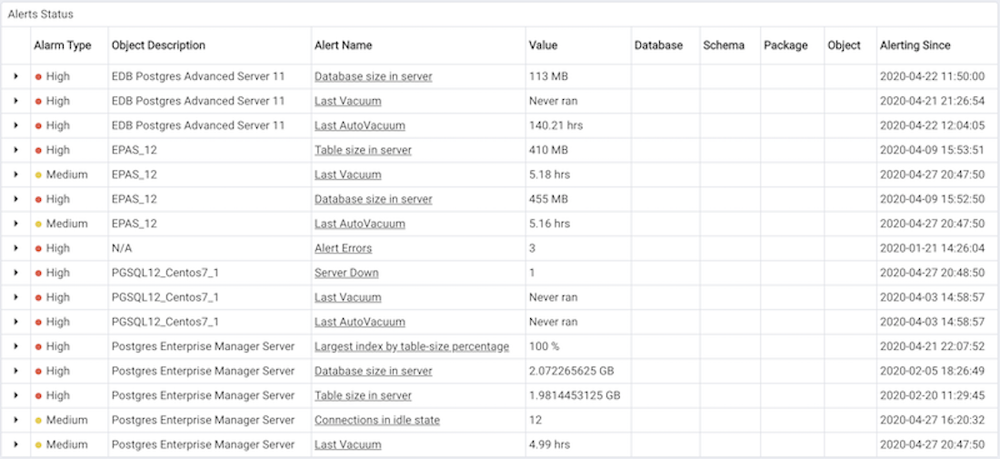

The PEM server includes a number of pre-defined alerts that are actively monitoring your servers. If the alert definition makes details available about the cause of the alert, you can click the down arrow to the right of the severity warning to access a dialog with detailed information about the condition that triggered the alert.


PEM also provides an interface that allows you to create customized alerts. Each alert uses metrics defined on an alert template. An alert template defines how the server will evaluate the statistics for a resource or metric. The PEM server includes a number of pre-defined alert templates, or you can create custom alert templates.

### Viewing the alerts via Alerts dashboard

Use the `Dashboards` menu (on the `Monitoring` tab) to access the `Alerts` dashboard. The `Alerts` dashboard displays a summary of the active alerts and the status of each alert:


The `Alerts Dashboard` header displays the date and time that the dashboard was last updated, and the number of current alerts.

The `Alerts Overview` section displays a graphic representation of the active alerts, as well as a count of the current high, low and medium alerts. The vertical bar on the left of the graph provides the count of the alerts displayed in each column. Hover over a bar to display the alert count for the selected alert severity in the upper-right hand corner of the graph.

The `Alert Details` table provides a list of the alerts that are currently triggered. The entries are prioritized from high-severity to lower-severity; each entry includes information that will allow you to identify the alert and recognize the condition that triggered the alert. Click the name of an alert to review detailed information about the alert definition.

The `Alert Errors` table displays configuration-related errors (eg. accidentally disabling a required probe, or improperly configuring an alert parameter). You can use the information provided in the Error Message column to identify and resolve the conflict that is causing the error.

#### Customizing the Alerts dashboard

You can customize tables and charts that appear on the Alerts dashboard. To customize a table or chart, click the Settings icon located in the upper-right corner.

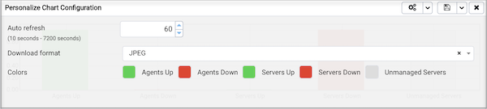

Use fields on the Personalize chart configuration dialog to provide your display preferences:

-   Use the `Auto Refresh` field to specify the number of seconds between updates of the data displayed in the table or chart.
-   If applicable, use the `Download as` field to indicate if you would like a chart to be downloaded as a JPEG image or a PNG image.
-   If applicable, use the `Colours selectors` to specify the display colors that will be used on a chart.
-   If applicable, set the `Show Acknowledged Alerts` switch to Yes indicate that you would like the table to display alerts that you have acknowledged with a checkbox in the Ack'ed column. Set the field to No to indicate that the table should hide any acknowledged alerts. The switch acts as a toggle; acknowledged alerts are not purged from the table content until the time specified in the alert definition passes.

To save your customizations, click the `Save` icon (a check mark) in the upper-right corner; to delete any previous changes and revert to the default values, click the `Delete` icon. The `Save` and `Delete` drop-down menus allow you to specify if your preferences should be applied to `All Dashboards`, or to a selected server or database.

### Managing alerts

Use the PEM Client's `Manage Alerts` tab to define, copy, or manage alerts. To open the `Manage Alerts` tab, select `Manage Alerts` from the `Management` menu.


Use the `Quick Links` toolbar to open dialogs and tabs that will assist you when managing alerts:

-   Click `Copy Alerts` to open the `Copy Alert Configuration` dialog and copy an alert definition.
-   Click `Alert Templates` to open the `Alert Template` tab, and modify or create an alert template.
-   Click `Email Groups` to open the `Email Groups` tab, and modify or create an email group.
-   Click `Webhooks` to open the `Webhooks` tab, and create or manage the webhooks endpoints.
-   Click `Server Configurations` to open the `Server Configuration` dialog and review or modify server configuration settings.
-   Click `Help` to open the PEM online help in a new tab of the PEM web interface.

Use the table in the `Alerts` section of the `Manage Alerts` tab to create new alerts or manage existing alerts.

#### Alert templates

An alert template is a prototype that defines the properties of an alert. An alert instructs the server to compare the current state of the monitored object to a threshold (specified in the alert template) to determine if a situation exists that requires administrative attention.

You can use the `Alert Templates` tab to define a custom alert template or view the definitions of existing alert templates. To open the `Alert Templates` tab, select the `Manage Alerts...` menu option from the `Management` menu. When the `Manage Alerts` tab opens, select `Alert Templates` from the `Quick Links` toolbar.


Use the `Show System Template` drop-down listbox to filter the alert templates that are displayed in the `Alert Templates` table. Use the listbox to select a level of the PEM hierarchy to view all of the templates for the selected level.

**Defining a New Alert Template**

To define a new alert template, use the `Show System Template` drop-down listbox to select None, and click the `Add` icon (+) located in the upper-right corner of the alert template table. The alert template editor opens.


Use fields on the `General` tab to specify general information about the template:

-   Use the `Template name` field to specify a name for the new alert template.

-   Use the `Description` field to provide a description of the alert template.

-   Use the `Target type` drop-down listbox to select the type of object that will be the focus of the alert.

-   Use the `Applies to server` drop-down listbox to specify the server type (EDB Postgres Advanced Server or PostgreSQL) to which the alert will be applied; you can specify a single server type, or ALL.

-   Use the `History retention` field to specify the number of days that the result of the alert execution will be stored on the PEM server.

-   Use the `Threshold unit` field to specify the unit type of the threshold value.

-   Use fields in the `Auto create` box to indicate if PEM should use the template to generate an automatic alert. If enabled, PEM will automatically create an alert when a new server or agent (as specified by the Target type drop-down listbox) is added, and delete that alert when the target object is dropped.

    -   Move the `Auto create?` slider to `Yes` to indicate that PEM should automatically create alerts based on the template. If you modify an existing alert template, changing the Auto create? slider from No to Yes, PEM will create alerts on the existing agents and servers. Please note that if you change the slider from Yes to No, the default threshold values in existing alerts will be erased, and cannot be recovered.
    -   Use the `Operator` drop-down listbox to select the operator that PEM will use when evaluating the current system values.

    Select a greater-than sign (>) to indicate that the alert should be triggered when the system values are greater than the values entered in the Threshold values fields.

    Select a less-than sign (&lt;) to indicate that the alert should be triggered when the system values are less than the values entered in the Threshold values fields.

-   Use the threshold fields to specify the values that PEM will compare to the system values to determine if an alert should be raised. Please note that you must specify values for all three thresholds (Low, Medium, and High):

    Enter a value that will trigger a low-severity alert in the `Low` field.

    Enter a value that will trigger a medium-severity alert in the `Medium` field.

    Enter a value that will trigger a high-severity alert in the `High` field.

-   Use the `Check frequency` field to specify the default number of minutes between alert executions. This value specifies how often the server will invoke the SQL code specified in the definition and compare the result to the threshold value specified in the template.


Use the fields on the `Probe Dependency` tab to specify the names of probes referred to in the SQL query specified on the SQL tab:

-   Use the `Probes` drop-down listbox to select from a list of the available probes; highlight a probe name, and click the `Add` button to add the probe to the list of probes used by the alert template. To remove a probe from the selected probes list, highlight the probe name, and click the `Delete` icon.

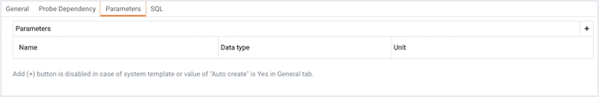

-   Use fields on the `Parameters` tab to define the parameters that will be used in the SQL code specified on the `SQL` tab. Click the `Add` icon (+) and:

    Use the `Name` field to specify the parameter name.

    Use the `Data type` drop-down listbox to specify the type of parameter.

    Use the `Unit` field to specify the type of unit specified by the parameter.

-   Use the `Code` field on the `SQL` tab to provide the text of the SQL query that the server will invoke when executing the alert. The SQL query will provide the result against which the threshold value is compared; if the alert result deviates from the specified threshold value, an alert will be raised.


Within the query, parameters defined on the `Parameters` tab should be referenced sequentially by the variable param\_`x`, where `x` indicates the position of the parameter definition within the parameter list. For example, param_1 refers to the first parameter in the parameter list, param_2 refers to the second parameter in the parameter list, and so on.

The query can also include the following pre-defined variables:

| **Variable Description** | **Variable Name**  |
| ------------------------ | ------------------ |
| agent identifier         | '${agent_id}'      |
| server identifier        | '${server_id}'     |
| database name            | '${database_name}' |
| schema name              | '${schema_name}'   |
| Table                    | '${object_name}'   |
| index                    | '${object_name}'   |
| sequence                 | '${object_name}'   |
| function name            | '${object_name}'   |

-   Use the `Detailed Information SQL` field to provide a SQL query that will be invoked if the alert is triggered. The result set of the query may be displayed as part of the detailed alert information on the `Alerts` dashboard or `Global Overview` dashboard.

!!! Note
    If the specified query is dependent on one or more probes from different levels within the PEM hierarchy (server, database, schema, etc.), and a probe becomes disabled, any resulting alerts will be displayed as follows:

-   If the alert definition and the probe referenced by the query are from the same level within the PEM hierarchy, the server will display any alerts that reference the alert template on the `Alert Error` table of the `Global Alert` dashboard.
-   If the alert definition and the probe referenced by the query are from different levels of the PEM hierarchy, the server will display any triggered alerts that reference the alert template on the `Alert Details` table of the hierarchy on which the alert was defined.

Click the `Save` icon to save the alert template definition and add the template name to the Alert Templates list. After saving a custom alert template, you can use the Alerting dialog to define an alert based on the template.

**Exporting or Importing Alert Templates**

!!! Tip "New Feature"
    Export and import of the alert templates to another PEM Server is available from 8.2.0 and later.

To `Export` the Alert Template, select any alert template from the `Alert Templates` tab and then select the `Export` icon in the upper-right corner of the table. Select `Save File` option and then select `ok`, it will generate the `JSON` file.


To `Import` the Alert Template, go to the `Alert Templates` tab and then select the `Import` icon in the upper-right corner.


Click on the `Browse` button to select the `JSON` file with the code to be imported and then click `Import`.


After selecting the file to import, you can select the following checkboxes:

-   `skip exiting` - If you select this checkbox then it will skip the alert template if it already exists.

-   `skip existing dependent probe` - The alert templates are dependent on probes. If you select this checkbox then it will skip the dependent probe if it already exists.

If both the checkboxes are selected and the alert template already exists, then it skips importing the alert template with below message:


If the `skip existing` checkbox is not selected and `skip dependent probe` is selected and the alert template already exists, then it will import the alert template successfully as below:


If both the checkboxes are not selected and the alert template does not exist, then it will successfully import the alert template as below:


**Modifying or Deleting an Alert Template**

To view the definition of an existing template (including PEM pre-defined alert templates), use the `Show System Template` drop-down listbox to select the type of object monitored. When you select the object type, the `Alert Templates` table will display the currently defined alert templates that correspond with that object type.

Highlight a Template Name in the list, and click the Edit icon (at the left end of the row) to review the template definition.

Use the tabs on the `Alert Templates` dialog to view detailed information about the alert template:

-   General information is displayed on the `General` tab.
-   The names of probes that provide data for the template are listed on the `Probe Dependency` tab.
-   The names of any parameters referred to in the SQL code are listed on the `Parameters` tab.
-   The SQL code that defines the behavior of the alert is displayed on the `SQL` tab.

To delete an alert template, select the template name in the alert templates table, and click the `Delete` icon (located to the upper-right corner of the table).  The alert history will persist for the length of time specified on the `History Retention` field in the template definition.

#### Audit log alerting

PEM provides alert templates that allow you to use the `Alerting` dialog to create an alert that will trigger when an `ERROR` or `WARNING` statement is written to a log file for a specific server or agent. To open the `Alerting` dialog, highlight the name of the server or agent in the PEM client Object browser tree control, and select `Alerting...` from the `Management` menu.

To create an alert that will notify you of ERROR or WARNING messages in the log file for a specific server, create an alert that uses one of the following alert templates:

Number of ERRORS in the logfile on server M in last X hours

Number of WARNINGS in the logfile on server M in last X hours

Number of ERRORS or WARNINGS in the logfile on server M in last X hours

To create an alert that will notify you of ERROR or WARNING messages for a specific agent, create an alert that uses one of the following alert templates:

Number of ERRORS in the logfile on agent M in last X hours

Number of WARNINGS in the logfile on agent M in last X hours

Number of ERRORS or WARNINGS in the logfile on agent M in last X hours

Please note that this functionality is supported only on Advanced Server.

#### Alerts

Use the PEM Client's `Manage Alerts` tab to define, copy, or manage alerts. To open the `Manage Alerts` tab, select `Manage Alerts` from the `Management` menu.

**Defining a New Alert**

The `Manage Alerts` tab displays a table of alerts that are defined on the object currently selected in the PEM client tree control. You can use the `Alerts` table to modify an existing alert, or to create a new alert.


To open the alert editor and create a new alert, click the Add icon (+) in the upper-right corner of the table. The editor opens as shown below.

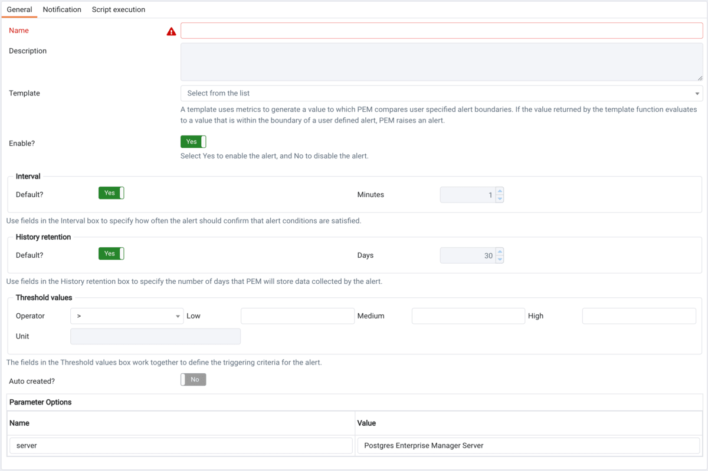

Use the fields on the `General` tab to provide information about the alert:

-   Enter the name of the alert in the `Name` field.
-   Use the drop-down listbox in the `Template` field to select a template for the alert. An alert template is a function that uses one (or more) metrics or parameters to generate a value to which PEM compares user-specified alert boundaries. If the value returned by the template function evaluates to a value that is within the boundary of a user-defined alert (as specified by the Operator and Threshold values fields), PEM raises an alert, adds a notice to the Alerts overview display, and performs any actions specified on the template.
-   Use the `Enable?` switch to specify if the alert is enabled (Yes) or disabled (No).
-   Use the controls in the `Interval` box to specify how often the alert should confirm if the alert conditions are satisfied. Use the Minutes selector to specify an interval value. Use the Default switch to set or reset the Minutes value to the default (recommended) value for the selected template.
-   Use controls in the `History retention` box to specify the number of days that PEM will store data collected by the alert. Use the `Days` selector to specify the number of days that the data will be stored. Use the Default switch to set or reset the `Days` value to the default value (30 days).
-   Use controls in the `Threshold values` box to define the triggering criteria for the alert. When the value specified in the Threshold Values fields evaluates to greater-than or less-than the system value (as specified with the Operator), PEM will raise a Low, Medium or High level alert:
-   Use the `Operator` drop-down listbox to select the operator that PEM will use when evaluating the current system values:
    -   Select a greater-than sign (>) to indicate that the alert should be triggered when the system values are greater than the values entered in the Threshold values fields.
    -   Select a less-than sign (&lt;) to indicate that the alert should be triggered when the system values are less than the values entered in the Threshold values fields.
-   Use the `threshold` fields to specify the values that PEM will compare to the system values to determine if an alert should be raised. Please note that you must specify values for all three thresholds (Low, Medium, and High):
    -   Enter a value that will trigger a low-severity alert in the `Low` field.
    -   Enter a value that will trigger a medium-severity alert in the `Medium` field.
    -   Enter a value that will trigger a high-severity alert in the `High` field.

The `Parameter Options` table contains a list of parameters that are required by the selected template; the table displays both pre-defined parameters, and parameters for which you must specify a value. Please note that you must specify a value for any parameter that displays a prompt in the Value column.

PEM can send a notification or execute a script if an alert is triggered, or if an alert is cleared. Use the `Notification` tab to specify how PEM will behave if an alert is raised.


Use the fields in the `Email notification` box to specify the Email group that will receive an email notification if the alert is triggered at the specified level. Use the [Email Groups](#creating-an-email-group) tab to create an email group that contains the address of the user or users that will be notified when an alert is triggered. To access the `Email Groups` tab, click the `Email Groups` icon located in the `Quick Links` menu of the `Manage Alerts` tab.

-   To instruct PEM to send an email when a specific alert level is reached, set the slider next to an alert level to Yes, and use the drop-down listbox to select the pre-defined user or group that will be notified.

Please note that you must configure the PEM Server to use an SMTP server to deliver email before PEM can send email notifications.


Use the `Webhook notification` box to specify one or multiple endpoints if the alert is triggered at the specified level. Use the [webhooks tab](#creating-webhook) to create a webhook endpoint that will receive the notifications when an alert is triggered. To access the `Webhooks` tab, click the `Webhooks` icon located in the `Quick Links` menu of the `Manage Alerts` tab.

-   Set the `Enable?` to `Yes` to send the alert notifictions to the webhook endpoint.
-   Set the `Override default configuration?` to `Yes` to set the customized alert levels as per the requirement. Once it is set to `Yes` all the alert levels are enabled to configure.
-   Use the dropdown to select a pre-defined endpoint that will be sent a notification for `Low alerts?`, `Medium alerts?`, `High alerts?` and `Cleared alerts?`.


Use the `Trap notification` options to configure trap notifications for this alert:

-   Set the `Send trap` slider to `Yes` to send SNMP trap notifications when the state of this alert changes.
-   Set the `SNMP Ver` to `v1`, `v2`, or `v3` to identify the SNMP version.
-   Use the `Low alert`, `Med alert` and `High alert` sliders to select the level(s) of alert that will trigger the trap. For example, if you set the slider next to High alert to Yes, PEM will send a notification when an alert with a high severity level is triggered.

Please note that you must configure the PEM Server to send notifications to an SNMP trap/notification receiver before notifications can be sent. For sending SNMP v3 traps, pemAgent will use 'User Security Model(USM)' which is in charge of authenticating, encrypting, and decrypting SNMP packets.

Also note while sending SNMP v3 traps, agent will create snmp_boot_counter file. This file will get created in location mentioned by batch_script_dir parameter in agent.cfg, if this parameter is not configured or if directory is not accessible due to authentication restrictions then in operating systems temporary directory, if that is also not possible then in user’s home directory.


Use the field in the `Nagios notification` box to instruct the PEM server to notify Nagios network-alerting software when the alert is triggered or cleared. For more details see [Using PEM with Nagios](#using-pem-with-nagios)

-   Set the `Submit passive service check result to Nagios` switch to `Yes` to instruct the PEM server to notify Nagios when the alert is triggered or cleared.


Use the fields in the `Script execution` box to (optionally) define a script that will be executed if an alert is triggered, and to specify details about the script execution.

-   Set the `Execute script` slider to `Yes` to instruct PEM to execute the provided script if an alert is triggered.

-   Set the `Execute on alert cleared` slider to `Yes` to instruct PEM to execute the provided script when the situation that triggered the alert has been resolved.

-   Use the radio buttons next to `Execute script on` to indicate that the script should execute on the PEM Server or the Monitored Server.

-   Provide the script that PEM should execute in the `Code` field. You can provide a batch/shell script, or SQL code. Within the script, you can use placeholders for the following:

    `%AlertName%` - this placeholder will be replaced with the name of the triggered alert.

    `%ObjectName%` - this placeholder will be replaced with the name of the server or agent on which the alert was triggered.

    `%ThresholdValue%` - this placeholder will be replaced with the threshold value reached by the metric when the alert triggered.

    `%CurrentValue%` - this placeholder will be replaced with the current value of the metric that triggered the alert.

    `%CurrentState%` - this placeholder will be replaced with the current state of the alert.

    `%OldState%` - this placeholder will be replaced with the previous state of the alert.

    `%AlertRaisedTime%` - this placeholder will be replaced with the time that the alert was raised, or the most recent time that the alert state was changed.

    To invoke a script on a Linux system, you must modify the entry for the `batch_script_user` parameter of the `agent.cfg` file and specify the user that should be used to run the script. You can either specify a non-root user or root for this parameter. If you do not specify a user, or the specified user does not exist, then the script will not be executed. Restart the agent after modifying the file.

    To invoke a script on a Windows system, set the registry entry for `AllowBatchJobSteps` to true and restart the PEM agent. PEM registry entries are located in HKEY_LOCAL_MACHINE/Software/Wow6432Node/EnterpriseDB/PEM/agent.

When you have defined the alert attributes, click the edit icon to close the alert definition editor, and then the save icon (in the upper-right corner of the `Alerts` table). To discard your changes, click the refresh icon; a popup will ask you to confirm that you wish to discard the changes.

!!! Note
    Suppose you need to use the alert configuration placeholder values in an external script. You can do it either by passing them as the command-line arguments or exporting them as environment variables. Please note that the external script must have proper execution permissions.

-   You can run the script with any of the placeholders as command-line argument.

    For eg:

    ```bash
    #!/bin/bash

    bash <path_to_script>/script.sh "%AlertName%  %AlertLevel% %AlertDetails%"
    ```

-   You can define the environment variables for any of the placeholders and then use those environment variables in the script.

    For eg:

    ```bash
    #!/bin/bash

    export AlertName=%AlertName%
    export AlertState=%AlertState%

    bash <path_to_script>/script.sh
    ```

**Modifying an Alert**

Use the `Alerts` table to manage an existing alert or create a new alert. Highlight an object in the PEM client tree control to view the alerts that monitor that object.


You can modify some properties of an alert in the `Alerts` table:

-   The `Alert name` column displays the name of the alert; to change the alert name, simply replace the name in the table, and click the save icon.
-   The `Alert template` column displays the name of the alert template that specifies properties used by the alert. You can use the drop-down listbox to change the alert template associated with an alert.
-   Use the `Alert enable?` switch to specify if an alert is enabled (Yes) or disabled (No).
-   Use the `Interval` column to specify how often PEM should check to see if the alert conditions are satisfied. Set the `Default` switch to `No` and specify an alternate value (in Minutes), or return the Default switch to `Yes` to reset the value to its default setting. By default, PEM will check the status of each alert once every minute.
-   Use the `History retention` field to specify the number of days that PEM will store data collected by the alert. Set the `Default` switch to `No` and specify an alternate value (in Days), or return the Default switch to `Yes` to reset the value to its default setting. By default, PEM will recommend storing historical data for 30 days.

After modifying an alert, click the save icon (located in the upper-right corner of the table) to make your changes persistent.

Click the edit icon to the left of an alert name to open an editor that provides access to the complete alert definition to modify other alert attributes.


Use fields on the `Alert details` dialog to modify the definition of the selected alert. When you've finished modifying the alert definition, click `Save` to preserve your changes, or `Cancel` to exit the dialog without saving any changes.

**Deleting an Alert**

To mark an alert for deletion, highlight the alert name in the Alerts table and click the delete icon to the left of the name; the alert will remain in the list, but in red strike-through font.

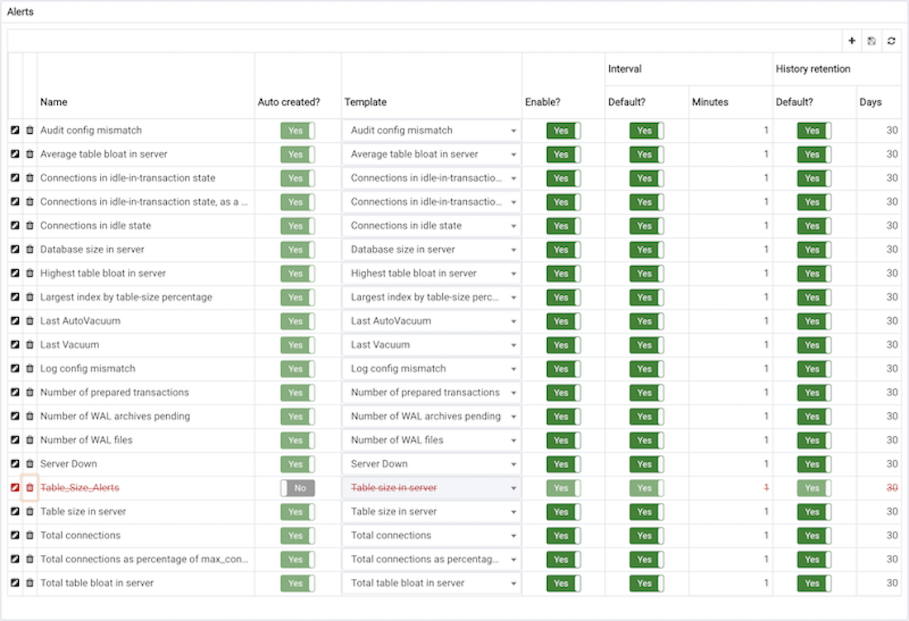

The delete icon acts as a toggle; you can undo the deletion by clicking the delete icon a second time; when you click the `Save` icon, the alert definition will be permanently deleted.

**Copying an Alert**

To speed up the deployment of alerts in the PEM system, you can copy alert definitions from one object to one or more target objects.

To copy alerts from an object, highlight the object in the PEM client tree control on the main PEM window, and select the `Copy Alerts...` option from the `Management` menu. When the `Manage Alerts` tab opens, click the `Copy Alerts` icon (located in the `Quick Links` toolbar) to open the `Copy Alert Configuration` dialog.

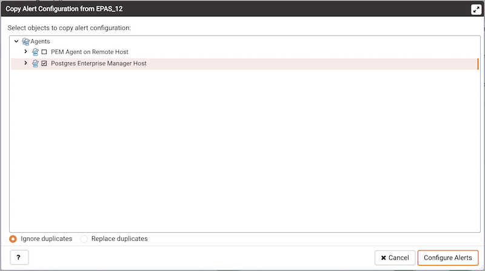

The `Copy Alert Configuration` dialog copies all alerts from the object highlighted in the PEM client tree control to the object or objects selected on the dialog. Expand the tree control to select a node or nodes to specify the target object(s). The tree control displays a red warning indicator next to the source object.

To copy alerts to multiple objects at once, select a parent node of the target(s). For example, to copy the alerts from one table to all tables in a schema, you can simply select the checkbox next to the schema. PEM will only copy alerts to targets that are of the same type as the source object.

Check the `Ignore duplicates` radio button to prevent PEM from updating any existing alerts on the target objects with the same name as those being copied. Use the `Replace duplicates` option to replace existing alerts with alerts of the same name from the source object.

Click the `Configure Alerts` button to proceed to copy the alerts from the source object to all objects of the same type in, or under those objects selected on the `Copy Alert Configuration` dialog.

#### Schedule an alert blackout

You can use the `Schedule Alert Blackout` option on the `Management` menu to schedule an alert blackout for your Postgres servers and PEM Agents during maintenance. Alerts will not be raised during a defined blackout period.

To schedule an alert blackout, click on the `Management` menu and select `Schedule Alert Blackout`.


When the `Schedule Alert Blackout` dialog opens, use the tabs on the dialog to define the blackout period for servers and agents. Open the `Server` tab and click the Add icon (+) at the top right corner to add new row.

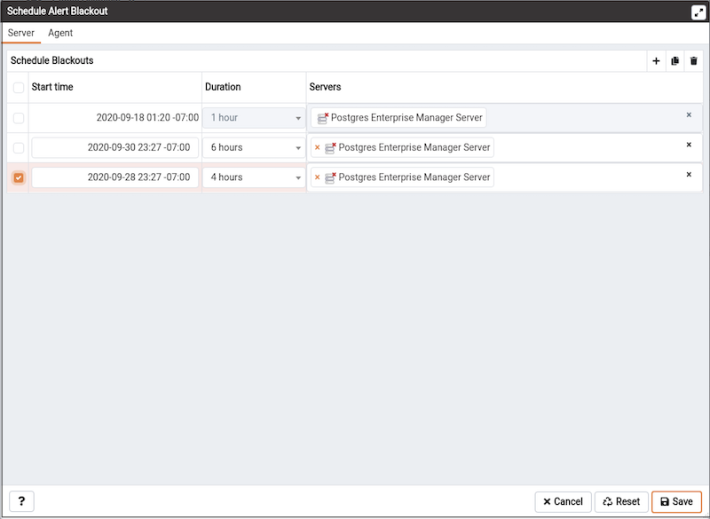

Use the fields on the `Server` tab to provide information about an alert blackout period:

-   Use the `Start time` field to provide the date and time to start the alert blackout.
-   Use the `Duration` field to provide the interval for which you want to blackout the alerts.
-   Use the `Servers` field to provide the server name for which you want to blackout the alerts. You can also select multiple servers to blackout the alerts for those servers simultaneously.

After providing details, you can save the details by clicking on `Save` button on the right bottom corner of the dialog. Once saved, it cannot be edited. The alerts will not be displayed on the `Alerts` dashboard for the scheduled interval of that particular server.

You can also schedule a blackout period for PEM Agents via the `Agent` tab on the dialog. Open the `Agent` tab and click the Add icon (+) at the top right corner to add new row.


Use the fields on the `Agent` tab to provide the information about about an alert blackout period:

-   Use the `Start time` field to provide the date and time to start the alert blackout.
-   Use the `Duration` field to provide the interval for which you want to blackout the alerts.
-   Use the `Agents` field to provide the Agent name for which you want to blackout the alerts. All server level alerts, for the servers bound to that particular agent will blackout.

After providing details, you can save the details by clicking on `Save` button on the right bottom corner of the dialog. Once saved, it cannot be edited. The alerts will not be displayed on the `Alert` dashboard for the scheduled interval for that PEM agent.

You can use `Clone` button from the top right corner of dialog, to clone the scheduling of alert blackout. Select the servers or agents you want to clone and then click on `Clone` button to create the cloned copy of all the selected servers or agents. You can edit newly created schedules as needed, and then click `Save`.

You can use `Delete` button from the top right corner of dialog to remove a scheduled alert blackout. Select the servers or agents and then click on highlighted `Delete` button in the right top corner to remove the scheduled alerts associated with that server or agent.

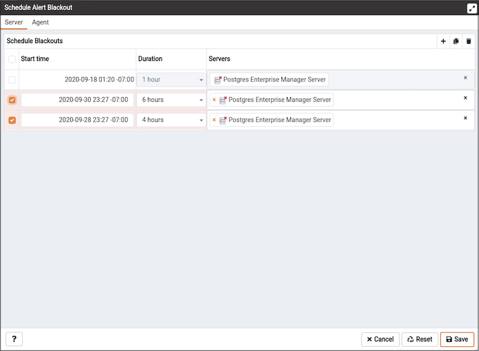

Select a server for which you wish to delete the scheduled alert backout and then click on the `Delete` button. The server will ask for confirmation before deleting that row.


You can use the `Reset` button to reset the details on the `Alert Blackout` dialog to the default settings. Please note that all saved blackouts will remain unaffected after resetting the current dialog values.

## Notifications

PEM can send a notification or execute a script if an alert is triggered, or if an alert is cleared. The Notifications can be send via following options:

-   SMTP
-   Webhooks
-   SNMP
-   Nagios

Use the `Notification` tab to specify how PEM will behave if an alert is raised.

### SMTP

Please note that you must configure the PEM Server to use an SMTP server to deliver email before PEM can send email notifications.

#### Creating an email group

Postgres Enterprise Manager monitors your system for conditions that require user attention. You can use an email group to specify the email addresses of users that the server will notify if current values deviate from threshold values specified in an alert definition. An email group has the flexibility to notify multiple users, or target specific users during user-defined time periods.

Use the `Email Groups` tab to configure groups of SMTP email recipients. To access the `Email Groups` tab, select `Manage Alerts...` from the PEM client's `Management` menu; when the `Manage Alerts` tab opens, select `Email Groups` from the Quick Links toolbar.

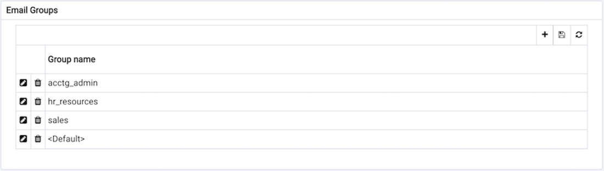

The `Email Groups` tab displays a list of the currently defined email groups. Highlight a group name and click the Edit icon (at the far left end of the row) to modify an existing group.

To define a new email group, click the Add icon (+) in the upper-right corner of the `Email Groups` table. The `Email Group` definition dialog opens.


Use the `Email Group` dialog to define an email group and its members:

-   Provide a name for the email group in the `Group Name` field.

Each row within the email group definition will associate a unique set of email addresses with a specific time period. When an alert is triggered, the server will evaluate the times specified in each row and send the message to those group members whose definitions are associated with the time that the alert triggered.

Click the Add icon (+) in the group members table to open the `Options` tab, and add the member addresses that will receive notifications for the time period specified:

-   Enter a comma-delimited list of recipient addresses in the `Reply` to Addresses field.
-   Enter a comma-delimited list of addresses that will receive a copy of the email in the `CC Addresses` field.
-   Enter a comma-delimited list of addresses that will receive a copy of the email (without the knowledge of other recipients) in the `Bcc Addresses` field.
-   Enter the email address that messages to this group should be sent from in the `From Address` field.
-   Use the `Subject prefix` field to provide a message that will be added to the start of each subject line when a notification is sent.
-   Use the `From Time` and `To Time` time selectors to specify the time range for notifications to the group member(s) that are identified on this row. Provide the From Time and To Time values in the locale of the PEM client host, and the PEM server will translate the time into other time zones as required.

When you've identified the member or members that will receive an email during a specific time period, click the Add icon to add a row to the table, and specify another time period and the email addresses that will be notified during those hours. When you've finished defining the email group, click the Save icon.

#### Deleting an Email Group

To delete an email group, highlight the name of the group in the `Email Group` table and click the Delete icon (located to the left of the group name).


The group name will be displayed in the `Email Group` table in red; click the Save icon to make the change persistent and remove the group from the table.

After creating the email group, you can use the `Manage Alerts` tab to set up the `Notification` details for an alert that will direct notifications to the group.

### Webhook

Please note that you must configure the PEM Server to use webhooks to receive notification of alert events on threshold value violations in your configured applications.

#### Creating a webhook

Postgres Enterprise Manager monitors your system for conditions that require user attention. You can use a webhook to create the endpoints that will receive a notification if current values deviate from threshold values specified in an alert definition. PEM sends a notification to multiple webhook endpoints, or to specific target webhook endpoints based on the events triggered.

Use the `Webhooks` tab to configure endpoint recipients. To access the `Webhooks` tab, select `Manage Alerts...` from the PEM client's `Management` menu; when the `Manage Alerts` tab opens, select `Webhooks` from the `Quick Links` toolbar.


The `Webhooks` tab displays a list of the currently defined recipient applications as endpoints. Highlight an endpoint and click the edit icon (at the far left end of the row) to modify an existing endpoint.

To define a new webhook, click the `Add` icon (+) in the upper-right corner of the table.

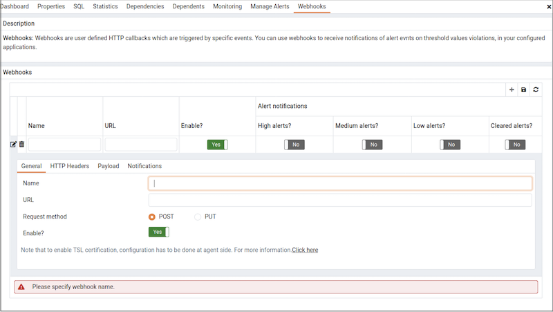

Use the `General` tab to define the basic details of the webhook:

-   Provide a name for the webhook in the `Name` field.
-   Specify a webhook URL where all the notifications will be delivered in the `URL` field.
-   Set the request method type used to make the call in the `Request Method` field i.e. `POST` or `PUT`.
-   By default `webhooks` will be enabled; to disable a webhook set `Enable?` to `No`.

!!! Note
    The above `Enable?` setting will work only if `enable_webhook` parameter is set to true in `agent.cfg` file. By default, `enable_webhook` parameter is set to true only for the Agent running on the PEM Server Host. For all other Agents running on other hosts, it needs to be set to true manually.

#### Defining webhook SSL configurations

You can define the Webhook SSL parameters in the respective agent configuration file or registry in windows. You can find the list of Webhook SSL parameters [PEM Agent Configuration Parameters](/pem/latest/pem_agent/03_managing_pem_agent/) section. If you add or remove any of the agent configuration parameters, you must restart the agent to apply them.

-   On 32 bit Windows systems, PEM registry entries for Webhooks are located in `HKEY_LOCAL_MACHINE\\Software\\EnterpriseDB\\PEM\\agent\\WEBHOOK`
-   On 64 bit Windows systems, PEM registry entries for Webhooks are located in `HKEY_LOCAL_MACHINE\\Software\\Wow6432Node\\EnterpriseDB\\PEM\\agent\\WEBHOOK`
-   On Linux systems, PEM configuration options for Webhooks are stored in the agent.cfg file, located (by default) in `/usr/edb/pem/agent/etc`


Use the `HTTP Headers` tab to define the header parameters to pass while calling the webhook endpoints:

-   All the values will be specified as a key and value pair.
-   Specify a key parameter in the `Key` field and a value in the `Value` field.
-   To add multiple `HTTP Headers`, click the `Add` icon (+) in the upper-right corner of the `HTTP Headers` table.
-   To delete the `HTTP Headers`, click on `Delete` icon to the left of the `Key`; the alert will remain in the list, but in strike-through font. Click the `Save` button to reflect the changes.
-   To edit the `HTTP Headers`, click on the `Edit` icon to the left of `Key`.


Use the `Payload` tab to define the JSON data to be sent to the endpoint when an alert is triggered:

-   `Type` specifies data to be sent in format type (i.e. JSON).

-   Use `Template` to configure JSON data sent to endpoints. Within the `Template`, you can use placeholders for the following:

    -   `%AlertID%` - the id of the triggered alert.
    -   `%AlertName%` - the name of the triggered alert.
    -   `%ObjectName%` - the name of the server or agent on which the alert was triggered.
    -   `%ObjectType%` - the type on which alert was generated.
    -   `%ThresholdValue%` - the threshold value reached by the metric when the alert triggered.
    -   `%CurrentValue%` - the current value of the metric that triggered the alert.
    -   `%CurrentState%` - the current state of the alert.
    -   `%OldState%` - the previous state of the alert.
    -   `%AlertRaisedTime%` - the time that the alert was raised, or the most recent time that the alert state was changed.
    -   `%AgentID%` - the id of the agent by which alert was generated.
    -   `%AgentName%` - the name of the agent by which alert was generated.
    -   `%ServerID%` - the id of the server on which alert was generated.
    -   `%ServerName%` - the name of the server on which alert was generated.
    -   `%ServerIP%` - the ip or address of the server on which alert was generated.
    -   `%ServerPort%` - the the port of the server on which alert was generated.
    -   `%DatabaseName%` - the name of the database on which alert was generated.
    -   `%SchemaName%` - the name of the schema on which alert was generated.
    -   `%PackageName%` - the name of the package on which alert was generated.
    -   `%DatabaseObjectName%` - the name of the database object name like table name, function name etc on which alert was generated.
    -   `%Parameters%` - the list of custom parameters used to generate the alert.
    -   `%AlertInfo%` - the detailed database object level information of the alert.

-   Click on the `Test Connection` button, to test notification delivery to the mentioned endpoint.


Use the `Notifications` tab to specify an alert level for webhook endpoints:

-   Set `All alerts` to `Yes` to enable all alert levels to send notifications.
-   To instruct PEM to send an notification when a specific alert level is reached, set the slider next to an alert level to `Yes`. Please note that you must set `All alerts` to `No` to configure an individual alert level.

#### Deleting a webhook

To mark a webhook for deletion, highlight the webhook name in the `Webhooks` table and click the delete icon to the left of the name; the alert will remain in the list, but in strike-through font.


The delete icon acts as a toggle; you can undo the deletion by clicking the delete icon a second time; when you save your work (by clicking the save icon), the webhook definition will be permanently deleted.

### SNMP

Please note that you must configure the PEM Server to send the notifications to an SNMP trap/notification receiver before notifications can be sent. Set the SNMP ver to v1, v2 or v3 to identify the SNMP version.

#### Example - Configure `SNMP V3` traps with `net-snmp` trap receiver

-   Set `snmp_security_engine_id` to `PEM_SNMP_AGENT` in plain text format in the Server Configuration dialog. 

-   Then convert the plain text value to hexadecimal format in order to use it in `snmptrapd.conf` file. (Please note that you can have hexadecimal value of `snmp_security_engine_id` up to 32 octets length).
    ```text
       echo PEM_SNMP_AGENT | hexdump -v -e '/1 "%02X"'
       50454D5F534E4D505F4147454E540A
    ```

-   Set the following parameters in the Server Configuration dialog:   
    -   `snmp_security_name` to `pem_snmp_user`
    -   `snmp_authentication_protocol` to `MD5`
    -   `snmp_authentication_password` to `pem_auth_pass`
    -   `snmp_privacy_protocol` to `DES`
    -   `snmp_privacy_password` to `pem_priv_pass`

-   The `snmptrapd.conf` will have the following values:

    ```text
       createUser -e 0x50454D5F534E4D505F4147454E540A pem_snmp_user MD5 pem_auth_pass DES pem_priv_pass
       authUser log pem_snmp_user
    ```

### Using PEM with Nagios

The PEM server can send a passive alert result to Nagios network-alerting software when a user-defined alert is triggered. To instruct the PEM server to notify Nagios of a triggered alert, you must:

-   Enable Nagios notification for each alert that will trigger a notification from the PEM server to Nagios. Please note that PEM alerting must be configured before you create the host.cfg file and services.cfg file.
-   Configure Nagios-related behaviors of the PEM server.
-   Create the host.cfg and services.cfg configuration files.
-   If necessary, modify the Nagios configuration file and restart the Nagios server.
-   Install the PEM Agent on the system where Nagios server is installed and register it with the PEM Server. Set `enable_nagios` configuration to `true` in the agent.cfg for that agent, and restart the agent service.

After configuring the server to enable Nagios alerting, any triggered alerts will send a passive check result to the Nagios service. The syntax of a passive alert is:

`<timestamp> PROCESS_SERVICE_CHECK_RESULT; <host_name> ; <service_name> ; <service_status> ;`

Where:

`timestamp` is the date and time that the alert was triggered.

`host_name` is the name of the server or agent.

`service_name` is the name of the alert.

`service_status` is the numeric service status value:

0 if the service status is OK
1 if the service status is WARNING
2 if the service status is CRITICAL
3 if the service status is UNKNOWN

The PEM server uses the following rules to evaluate the service status:

-   If the PEM alert level is CLEARED, the warning message will read OK.
-   If the PEM alert level is LOW, the warning message will read WARNING.
-   If the `is_nagios_medium_alert_as_critical` flag (specified in the PEM server configuration dialog) is set to FALSE and the alert level MEDIUM, the warning message will read WARNING.
-   If the `is_nagios_medium_alert_as_critical` flag (specified in the PEM server configuration dialog) is set to TRUE and the alert level is MEDIUM, the warning message will read CRITICAL.
-   If the PEM alert level is `HIGH`, the warning message will read `CRITICAL`.

#### Enabling Nagios notification for an alert

The PEM server maintains a unique set of notification properties for each enabled alert. Use the `Notification` tab of the `Manage Alerts` tab to specify that (when triggered), a given alert will send an alert notice to Nagios.

To modify the notification properties of an alert, right-click on the name of the object monitored by the alert, and select `Manage Alerts...` from the `Management` menu. When the `Manage Alerts` tab opens, locate the alert, and then click the edit button to the left of the alert name in the `Alerts` list. When the edit pane opens, select the `Notification` tab.


To enable Nagios notification, move the slider next to `Submit passive service check result` to Nagios to `Yes`; before exiting the `Manage Alerts` tab, click the save icon to preserve your changes.

#### Configuring Nagios-related behavior of the PEM Server

You can use the `Server Configuration` dialog to provide information about your Nagios configuration to the PEM server. To open `Server Configuration` dialog, select `Server Configuration...` from the PEM client's `Management` menu.


Four server configuration parameters specify information about your Nagios installation and PEM server behavior related to Nagios:

-   Use the `nagios_cmd_file_name` parameter to specify the location of the Nagios pipeline file that will receive passive check alerts from PEM. The default value of this parameter is `/usr/local/nagios/var/rw/nagios.cmd`. If your `nagios.cmd` file resides in an alternate location, specify the file location in the Value field.

-   Move the slider in the `nagios_enabled` parameter to `Yes` to instruct the PEM server to send passive check alerts to Nagios.

-   Use the `nagios_medium_alert_as_critical` slider to specify the warning severity that the PEM server will pass to Nagios if a medium alert is triggered:

    If the `is_nagios_medium_alert_as_critical` flag is set to FALSE and the alert level is MEDIUM, the warning message will read WARNING.

    If the `is_nagios_medium_alert_as_critical` flag is set to TRUE and the alert level is MEDIUM, the warning message will read CRITICAL.

-   Use the `nagios_spool_retention_time` parameter to specify the number of days of notification history that will be stored on the PEM server. The default value is 7 days.

After modifying parameter values, click the save icon (in the upper-right corner of the `Server Configuration` dialog) to preserve your changes.

#### Creating the hosts.cfg and services.cfg file

The `templates.cfg` file (by default, located in `/usr/local/nagios/etc/objects`) specifies the properties of a generic-host and generic-service. The properties specify the parameters used in the `hosts.cfg` and `services.cfg` files.

In most cases (when PEM is installed in a default configuration), you will not be required to modify the `templates.cfg` file before creating the `hosts.cfg` and `services.cfg` files. If necessary, you can modify the `templates.cfg` file to specify alternate values for parameters or to create new templates.

Before modifying the Nagios configuration file, use the following command to create a `hosts.cfg` file that contains information about the PEM hosts that reside on the local system:

`psql -U postgres -p 5433 -d pem -A -t -c "select pem.create_nagios_host_config('generic-host')" > /usr/local/nagios/etc/objects/hosts.cfg`

Then, use the following command to create a `services.cfg` file that contains information about the PEM services that reside on the local system:

`psql -U postgres -p 5433 -d pem -A -t -c "select pem.create_nagios_service_config('generic-service')" > /usr/local/nagios/etc/objects/services.cfg`

If you wish to use a `custom template.cfg` file entry, specify the entry name in place of generic-host or generic-service in the above commands.

#### Modifying the Nagios configuration file

After creating the `host.cfg` and `services.cfg` files, you must specify their location in the Nagios configuration file (by default, `/usr/local/nagios/etc/nagios.cfg`). Modify the configuration file, adding entries that specify the location of the files:

`cfg_file=/usr/local/etc/objects/hosts.cfg`

`cfg_file=/usr/local/etc/objects/services.cfg`

You can use the following command to confirm that Nagios is properly configured:

`/usr/local/nagios/bin/nagios -v /usr/local/nagios/etc/nagios.cfg`

After confirming that Nagios is configured correctly, restart the Nagios service:

`/usr/local/nagios/bin/nagios -d /usr/local/nagios/etc/nagios.cfg`
