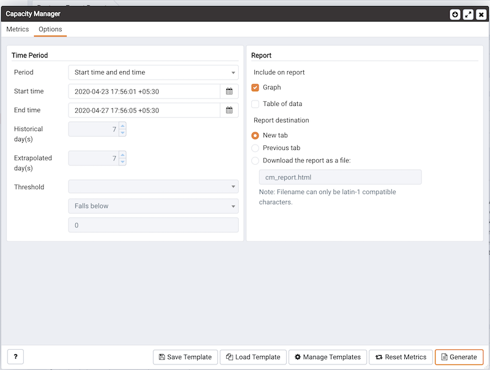

PEM's Capacity Manager analyzes collected statistics (metrics) to generate a graph or table that displays the historical usage statistics of an object, and can project the anticipated usage statistics for an object. You can configure Capacity Manager to collect and analyze metrics for a specific host, server, database, or database object.

You can tailor the content of the Capacity Manager report by choosing a specific metric (or metrics) to include in the report, the time range over which the metrics were gathered, and a high or low threshold for the metrics analyzed. You can also specify a start and end date for the Capacity Manager report. If the end date of the report specifies a time in the future, Capacity Manager will analyze the historical usage of the selected object to extrapolate the projected object usage in the future.

To open Capacity Manager, select the `Capacity Manager...` option from the PEM client `Management` menu; the Capacity Manager wizard opens, displaying a tree control on the `Metrics` tab.

Expand the tree control on the `Metrics` tab to review the metrics for the node that you wish to analyze. Check the box to the left of the name of the metric to include the metric in your report.

Capacity Manager will use the aggregation method specified with the Aggregation drop-down listbox (located at the bottom of the Metrics tab). The aggregation method instructs Capacity Manager how to evaluate and plot the metric values. Select from:

-   `Average`: Use the average of the values recorded during the time period.
-   `Maximum`: Use the maximum value recorded during the time period.
-   `Minimum`: Use the minimum value recorded during the time period.
-   `First`: Use the first value recorded during the time period.

To remove a metric from the Capacity Manager report, uncheck the box to the left of the name of a metric.

Move the slider next to `Graph/chart metrics individually?` to `Yes` to instruct Capacity Manager to produce a separate report for each metric selected on the Metrics tab. If the option is set to No, all selected metrics will be merged into a single graph or table.

Click the `Generate` button to display the report onscreen (accepting the default configuration options), or use the Options tab to customize sampling boundaries, report type and report destination. Please note that the times displayed on the Options tab are the time zone in which the PEM client resides.

Use the fields within the `Time Period` box to define the boundaries of the Capacity Manager report:

-   Use the `Period` drop-down listbox to select the type of time period you wish to use for the report. You can select:

| Start time and end time               | Specify a start date and an end date/time for the report.                                                                                                                                                     |
| ------------------------------------- | ------------------------------------------------------------------------------------------------------------------------------------------------------------------------------------------------------------- |
| Start time and threshold              | Specify a start date and time, and a threshold to determine the end time and date for the report.                                                                                                             |
| Historical days and extrapolated days | Specify a start date for the report that is a number of days in the past, and an end date that is a number of days in the future. This option is useful for report templates that do not specify fixed dates. |
| Historical days and threshold         | Specify a start date that is a number of days in the past, and end it when a threshold value is reached.                                                                                                      |

After specifying the type of time period for the report, select from other options in the Time Period box to define the time period for the report:

-   Use the date and time selectors next to the `Start time` field to specify the starting date and time of the sampling period, or select the number of Historical day(s) of data to include in the report. The date and time specified in the Start time field must not be later than the current date/time.

    By default, Capacity Manager will select a start time that is one week prior to the current date and time.

-   The end boundary for the report can be a time, a number of days in the future, or the point at which a selected metric reaches a user-specified threshold value. Use the date and time selectors next to the `End time` field to specify an end boundary for the report, or select the number of Extrapolated day(s) of data to include in the report. The time specified in the End time field must be later than the time specified in the Start time field.

    Note that if you select an end date and time in the future, Capacity Manager will use historical usage information to extrapolate anticipated future usage. Since the projected usage is based on the sampling of historical data, the accuracy of the future usage trend will improve with a longer sampling period.

    To specify a threshold value, use the drop-down listbox in the Threshold field to select a metric, an operator (Exceeds or Falls below), and enter a target value for the metric. If you choose to define the end of the report using a threshold, the Capacity Manager report will terminate when the value for the selected metric exceeds or falls below the specified value.

The `cm_max_end_date_in_years` configuration parameter defines a default time value for the end boundary of a Capacity Manager report. If you specify a threshold value as the end boundary of a report, and the anticipated usage of the boundary is not met before the maximum time has passed, the report will terminate at the time specified by the cm_max_date_in_years parameter. By default, cm_max_end_date_in_years is 5; you can use the Server Configuration dialog to modify the value of cm_max_end_date_in_years.

The fields in the `Report` box specify the report type and destination. Use the `Include on report` radio buttons to specify the type of report produced by Capacity Manager:

-   Select `Graph` to instruct Capacity Manager to display the report in the form of a line graph in the PEM client window.
-   Select `Table of data` to instruct Capacity Manager to display a table containing the report data in the PEM client window.
-   Select `Graph and table of data` to instruct Capacity Manager to display both a line graph and a data table in the PEM client window.

Use the `Report destination` radio buttons to instruct Capacity Manager where to display or save the report:

-   Select `New` tab to instruct Capacity Manager to display the report on a new tab in the PEM client. You must select New tab to display the first generation of a Capacity Manager report; for subsequent reports, you may select Previous tab.
-   Select `Previous` tab to instruct Capacity Manager to re-use a previously opened tab when displaying the report.
-   Select `Download` the report as a file and specify a file name to instruct Capacity Manager to write the report to the specified file.

When you have specified the report boundaries and selected the type and destination of the Capacity Manager report, click the `Generate` button to create the report.

Reports saved to file are stored in HTML format. You can review a Capacity Manager report with any web browser that supports Scalable Vector Graphics (SVG). Browsers that do not support SVG will be unable to display a Capacity Manager graph and may include unwanted characters.

## Capacity Manager templates

After defining a report, you can save the definition as a template for future reports. Capacity Manager report templates may be accessed by all PEM users. To save a report definition as a template:

1.  Use the `Metrics and Options` tabs to define your report.
2.  Click the `Save` button to open the `Save Template` dialog.

1.  Provide a report name in the `Title` field, select a location to store the template in the tree control.
2.  Click `OK`.

When creating a report, you can use the `Load Template` button to browse and open an existing template. Once opened, the report definition may be modified if required, and optionally saved again, either as a new template, or overwriting the original template.

Use the `Manage Templates` button open a dialog that allows you to rename or remove unwanted templates.
