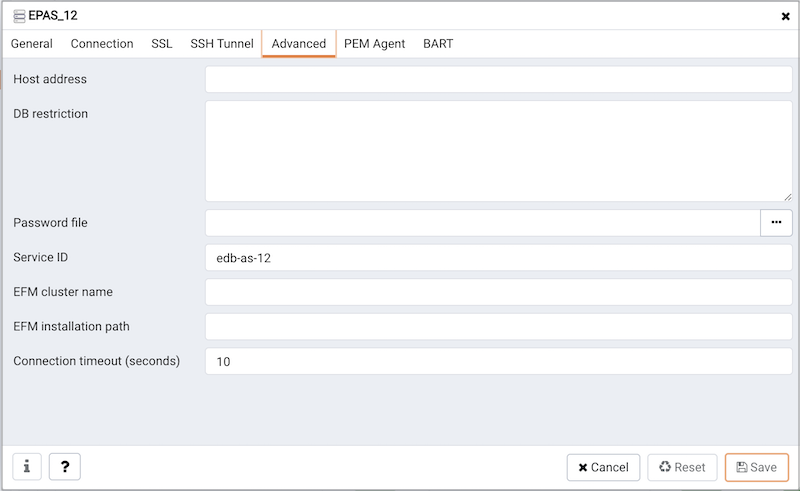
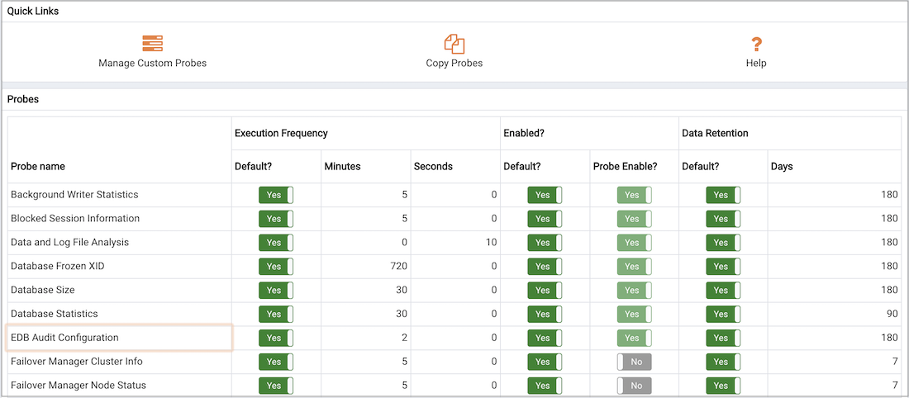
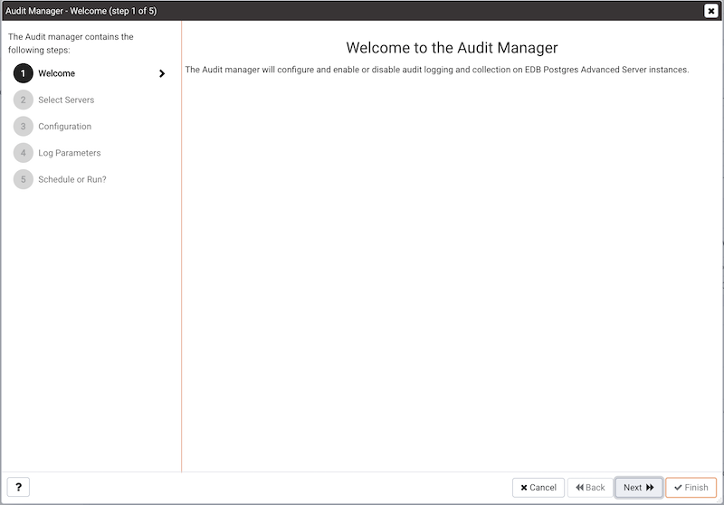
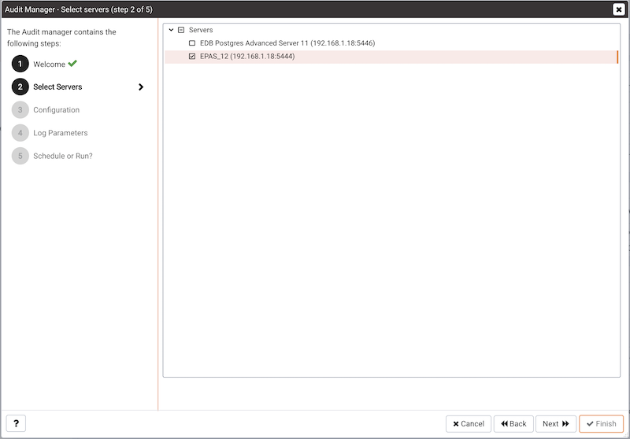
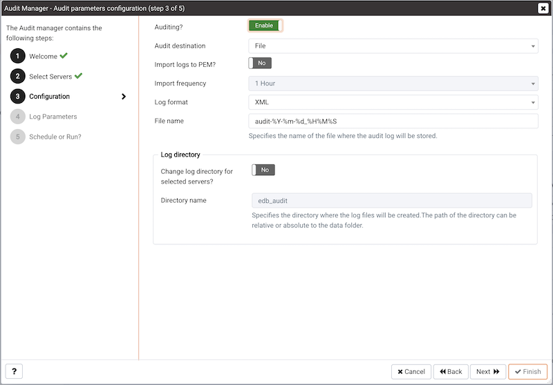
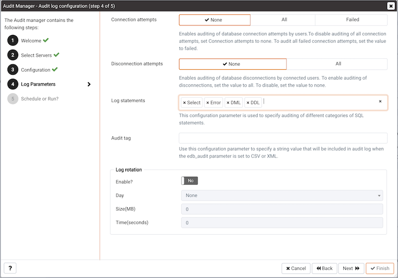
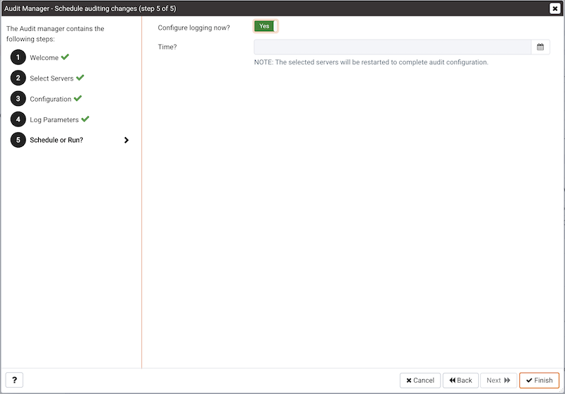
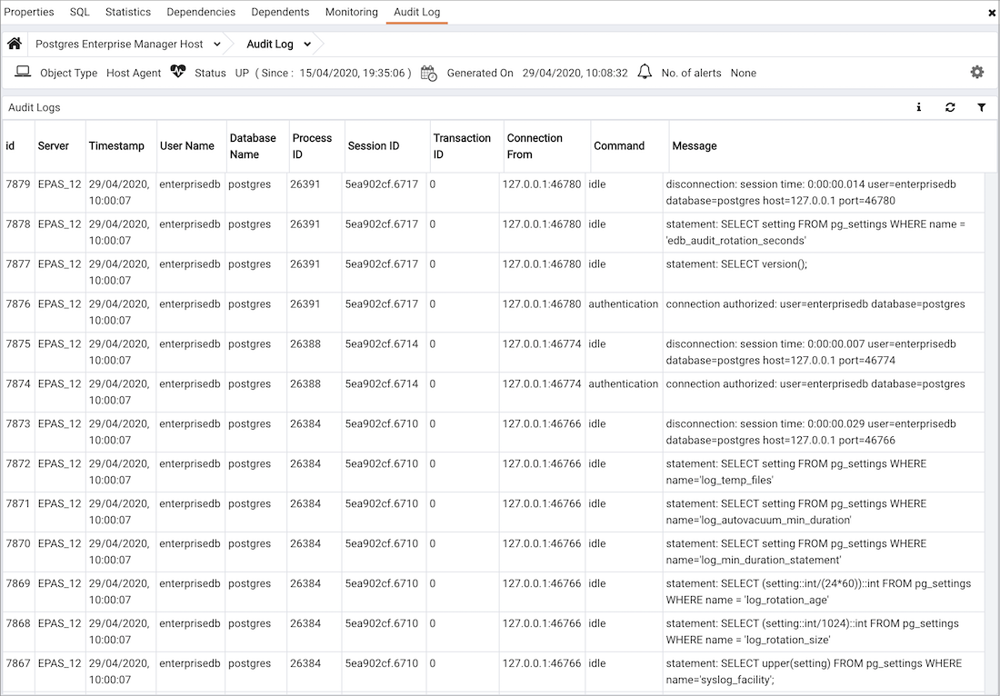
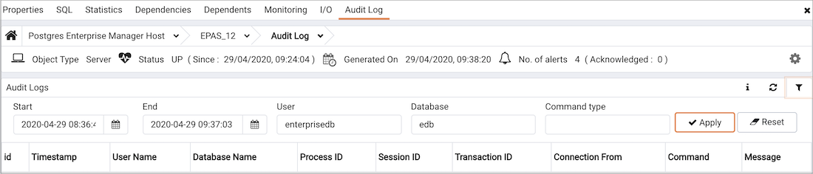

You can use the PEM Audit Manager to simplify audit log configuration for Advanced Server instances. With the Audit Manager, you can configure logging attributes such as:

-   How often log files are to be collected by PEM
-   The type of database activities that are included in the log files
-   How often (and when) log files are to be rotated

Audit logs may include the following activities:

-   All connections made to the database instance
-   Failed connection attempts
-   Disconnections from the database instance
-   All queries (SELECT statements)
-   All DML statements (INSERT, UPDATE, DELETE)
-   All DDL statements (e.g., CREATE, DROP, ALTER)

Once the audit logs are stored on the PEM server, you can use the Audit Log dashboard to review the information in an easy-to-read form. The Audit Log dashboard allows you to filter the log file by timestamp range (when an activity occurred), the database on which the activity occurred, the user performing the activity, or the type of command being invoked.

## Setting the Advanced Server instance service ID

To configure logging for an Advanced Server instance, the server must be a PEM-managed server with a bound agent, and the server registration must include the name of a service script. When registering a new server, include the service name in the Service ID field on the Advanced tab of the New Server dialog.

Before adding a service name to an existing (registered and connected) server, you must disconnect the server. Right click on the server name, and select `Disconnect server` from the context menu. Then, right click on the server name and select `Properties` from the context menu. Select the `Advanced` tab, and add a service name to the `Service ID` field.

The Service ID field allows the PEM server to stop and start the service.

-   The name of the Advanced Server 11 service script is `edb-as-12`.
-   The name of the Advanced Server 11 service script is `edb-as-11`.
-   The name of the Advanced Server 10 service script is `edb-as-10`.
-   The name of the Advanced Server 9.6 service script is `edb-as-9.6`.
-   The name of the Advanced Server 9.5 (or prior) service script is ppas-9.`x`, where `x` specifies the version.
-   The name of the PostgreSQL 9.6 service script is `postgresql-11`.
-   The name of the PostgreSQL 9.6 service script is `postgresql-10`.
-   The name of the PostgreSQL 9.6 service script is `postgresql-9.6`.

## Setting the EDB Audit Configuration probe

Before configuring audit logging of Advanced Server servers, you must ensure that the EDB Audit Configuration probe is enabled. To open the `Manage Probes` tab and check the status of the probe, right click on the name of a registered Advanced Server server in the tree control, and select `Manage Probes...` from the `Management` menu.

Ensure that the `Enabled` column in the `Probe Configuration` dialog is set to `Yes` for the `EDB Audit Configuration probe`.

If EDB Audit Configuration is not enabled, use the `Enabled?` switch on the Manage Probes tab to enable it.

## Configuring audit logging with the Audit Manager

To open the `Audit manager` wizard, select `Audit Manager...` from the `Management` menu. The `Audit manager - Welcome` dialog opens.

Click `Next` to continue.

Use the Select servers tree control to specify the servers to which the auditing configuration will be applied. To make a server available in the tree control, you must provide the `Service ID` on the `Advanced tab` of the `Create – Server` dialog when registering a server for monitoring by PEM. Note that only EDB Postgres Advanced Server supports auditing; PostgreSQL servers will not be included in the tree control.

Click `Next` to continue.

The `Auditing Parameters Configuration` dialog lets you enable or disable auditing and choose how often log records are collected into PEM.

Use the fields on the `Auditing parameters configuration` dialog to specify auditing preferences:

-   Use the `Auditing` switch to Enable or Disable auditing on the specified servers.

-   Use the `Audit destination` drop-down to select a destination for the audit logs; select File or Syslog. Please note this feature is supported on Advanced Server 10 and newer releases only.

-   Use the `Import logs to PEM` switch to instruct PEM to periodically import log records from each server to the PEM Server. Set the switch to Yes to import log files; the default is No.

-   Use the `Collection frequency` drop-down listbox to specify how often PEM will collect log records from monitored servers when log collection is enabled.

-   Use the `Log format` drop-down listbox to select the raw log format that will be written on each server. If log collection is enabled, the PEM server will use CSV format.

-   Use the `File name` field to specify the format used when generating log file names. By default, the format is set to `audit-%Y-%m-%d_%H%M%S` where:

    `audit` is the file name specified in the Audit Directory Name field  
    `Y` is the year that the log was stored  
    `m` is the month that the log was stored  
    `d` is the day that the log was stored  
    `H` is the hour that the log was stored  
    `M` is the minute that the log was stored  
    `S` is the second that the log was stored

-   Check the box next to `Change Log Directory for selected servers?` and use the `Audit Directory Name` field to specify a directory name to which the audit logs will be written. The directory will reside beneath the data directory on the PEM server.

-   Use fields in the `Log directory` box to specify information about the directory in which the log files will be saved:

    Move the `Change log directory for selected servers?` switch to Yes to enable the Directory name field.

    Use the `Directory name` field to specify the name of the directory on each server into which audit logs will be written. The directory specified will be created as a sub-directory of the data directory on the server.

Click `Next` to continue.

The `Audit log configuration` dialog is only available if you have enabled auditing on the Auditing parameters configuration dialog.

Use the controls on the `Audit log configuration` dialog to specify log configuration details that will be applied to each server:

-   Use the `Connection attempts` switch to specify if connection attempts should be logged:

    `None` to disable connection logging.

    `All` to indicate that all connection attempts will be logged.

    `Failed` to log any connection attempts that fail.

-   Use the `Disconnection attempts` switch to specify if disconnections should be logged. Specify:

    `None` to specify that disconnections should not be logged.

    `All` to enable disconnection logging.

-   Use the `Log statements` field to specify the statement types that will be logged. Click within the field, and select from:

    `Select` - All statements that include the `SELECT` keyword will be logged.

    `Error` - All statements that result in an error will be logged.

    `DML` - All DML (Data Modification Language) statements will be logged.

    `DDL` - All DDL (Data Definition Language) statements (those that add, delete or alter data) will be logged.

    Check the box next to `Select All` to select all statement types.

    Check the box next to `Unselect All` to deselect all statement types.

-   Use the `Audit tag` field to specify a tracking tag for the collected logs. Please note that audit tagging functionality is available only for supported versions of Advanced Server.

-   Use the fields in the `Log rotation` box to specify how the log files are managed on each server:

    Use the `Enable?` switch to specify that logfiles should be rotated. Please note that a new log file should be used periodically to prevent a single file becoming unmanageably large.

    Use the `Day drop-down` listbox to select a day or days on which the log file will be rotated.

    Use the `Size (MB)` field to specify a size in megabytes at which the log file will be rotated.

    Use the `Time (seconds)` field to specify the number of seconds between log file rotations.

Click `Next` to continue:

Use the `Schedule Auditing Changes` dialog to determine when auditing configuration changes are to take effect.

-   Select `Configure logging now?` if you want the auditing configuration changes to take place immediately. The affected database servers will be restarted so the auditing changes can take effect.
-   Use the `Time?` selector to schedule the auditing configuration changes to take place at some point in the future. Select the desired date and time from the drop-down lists. The affected database servers will be restarted at the specified date/time to put the auditing changes into effect.

Click `Finish` to complete the auditing configuration process.

The Audit Manager will schedule a job to apply the configuration to each server. The job will consist of two tasks: one to update the audit logging configuration on the server, and one to restart the server with the new configuration.

You can use the `Scheduled Tasks` tab to review a list of Scheduled jobs. To open the `Scheduled Tasks` tab, highlight the name of a server or agent and select `Scheduled Tasks...` from the `Management` menu.

## Viewing the log with the Audit Log dashboard

Use the Audit Log dashboard to view the audit log from Advanced Server database instances.

To open the `Audit Log` dashboard, right click on a server or agent node, and select `Audit Log Analysis` from the `Dashboards` menu. You can also open the Audit Log dashboard by navigating through the `Dashboards` menu (located on the `Management` menu).

The Audit Log dashboard displays the audit records in reverse chronological order (newest records at the top, oldest records towards the bottom).

To view older audit records that do not appear in the window, use the vertical scroll bar controlling the list of audit records (the innermost scroll bar of the two located on the right-hand side of the window). As you move the scroll bar towards the bottom of the window, older audit records are continuously loaded and displayed.

You can use filtering to limit the number of audit records that are displayed. Click `Show Filters` to expose the filters panel.

Use the fields in the `filters panel` to provide certain selection criteria for the audit records you wish to display.

-   Use the `Start` field to specify a start date for the report. Click the mouse button in the field to open a calendar and select a start date.
-   Use the `End` field to specify an end date for the report. Click the mouse button in the field to open a calendar and select an end date.
-   Use the `User` field to display only those entries where the activity was initiated by the given Postgres user.
-   Use the `Database` field to display only those entries where the activity was issued on the given database.
-   Use the `Command type` field to display only those entries where the activity was of the given type. Command types you can specify are idle, authentication, and SELECT. (For viewing SQL statements from user applications, specify the idle command type.)

Click `Filter` to apply the filtering criteria to the log entries.
