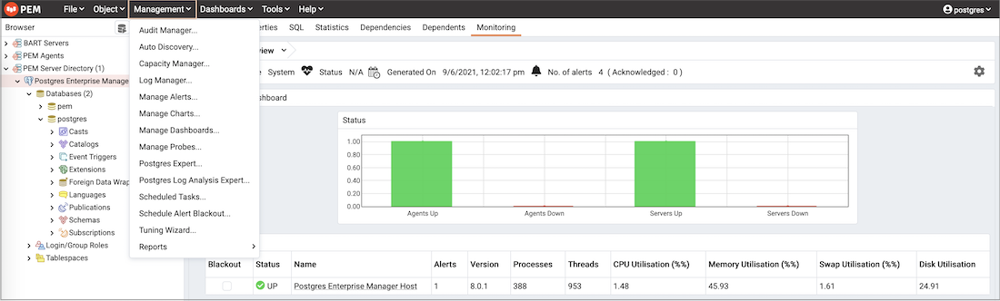

## Alerting

PEM continually monitors registered servers and compares performance metrics against pre-defined and user-specified thresholds that constitute good or acceptable performance for each statistic. Any deviation from an acceptable threshold value triggers an alert. An alert is a system-defined or user-defined set of conditions that PEM compares to the system statistics. Alerts call your attention to conditions on registered servers that require your attention.

### Viewing the alerts via Global dashboard

When your system statistics deviate from the boundaries specified for that statistic, the alert triggers, displaying a high (red), low (yellow), or medium (orange) severity warning in the left-most column of the `Alert Status` table on the `Global Overview` dashboard.


The PEM server includes a number of pre-defined alerts that are actively monitoring your servers. If the alert definition makes details available about the cause of the alert, you can click the down arrow to the right of the severity warning to access a dialog with detailed information about the condition that triggered the alert.


PEM also provides an interface that allows you to create customized alerts. Each alert uses metrics defined on an alert template. An alert template defines how the server will evaluate the statistics for a resource or metric. The PEM server includes a number of pre-defined alert templates, or you can create custom alert templates.

### Viewing the alerts via Alerts dashboard

Use the `Dashboards` menu (on the `Monitoring` tab) to access the `Alerts` dashboard. The `Alerts` dashboard displays a summary of the active alerts and the status of each alert:


The `Alerts Dashboard` header displays the date and time that the dashboard was last updated, and the number of current alerts.

The `Alerts Overview` section displays a graphic representation of the active alerts, as well as a count of the current high, low and medium alerts. The vertical bar on the left of the graph provides the count of the alerts displayed in each column. Hover over a bar to display the alert count for the selected alert severity in the upper-right hand corner of the graph.

The `Alert Details` table provides a list of the alerts that are currently triggered. The entries are prioritized from high-severity to lower-severity; each entry includes information that will allow you to identify the alert and recognize the condition that triggered the alert. Click the name of an alert to review detailed information about the alert definition.

The `Alert Errors` table displays configuration-related errors (eg. accidentally disabling a required probe, or improperly configuring an alert parameter). You can use the information provided in the Error Message column to identify and resolve the conflict that is causing the error.

#### Customizing the Alerts dashboard

You can customize tables and charts that appear on the Alerts dashboard. To customize a table or chart, click the Settings icon located in the upper-right corner.


Use fields on the Personalize chart configuration dialog to provide your display preferences:

-   Use the `Auto Refresh` field to specify the number of seconds between updates of the data displayed in the table or chart.
-   If applicable, use the `Download as` field to indicate if you would like a chart to be downloaded as a JPEG image or a PNG image.
-   If applicable, use the `Colours selectors` to specify the display colors that will be used on a chart.
-   If applicable, set the `Show Acknowledged Alerts` switch to Yes indicate that you would like the table to display alerts that you have acknowledged with a checkbox in the Ack'ed column. Set the field to No to indicate that the table should hide any acknowledged alerts. The switch acts as a toggle; acknowledged alerts are not purged from the table content until the time specified in the alert definition passes.

To save your customizations, click the `Save` icon (a check mark) in the upper-right corner; to delete any previous changes and revert to the default values, click the `Delete` icon. The `Save` and `Delete` drop-down menus allow you to specify if your preferences should be applied to `All Dashboards`, or to a selected server or database.

### Managing alerts

Use the PEM Client's `Manage Alerts` tab to define, copy, or manage alerts. To open the `Manage Alerts` tab, select `Manage Alerts` from the `Management` menu.


Use the `Quick Links` toolbar to open dialogs and tabs that will assist you when managing alerts:

-   Click `Copy Alerts` to open the `Copy Alert Configuration` dialog and copy an alert definition.
-   Click `Alert Templates` to open the `Alert Template` tab, and modify or create an alert template.
-   Click `Email Groups` to open the `Email Groups` tab, and modify or create an email group.
-   Click `Webhooks` to open the `Webhooks` tab, and create or manage the webhooks endpoints.
-   Click `Server Configurations` to open the `Server Configuration` dialog and review or modify server configuration settings.
-   Click `Help` to open the PEM online help in a new tab of the PEM web interface.

Use the table in the `Alerts` section of the `Manage Alerts` tab to create new alerts or manage existing alerts.

#### Alert templates

An alert template is a prototype that defines the properties of an alert. An alert instructs the server to compare the current state of the monitored object to a threshold (specified in the alert template) to determine if a situation exists that requires administrative attention.

You can use the `Alert Templates` tab to define a custom alert template or view the definitions of existing alert templates. To open the `Alert Templates` tab, select the `Manage Alerts...` menu option from the `Management` menu. When the `Manage Alerts` tab opens, select `Alert Templates` from the `Quick Links` toolbar.


Use the `Show System Template` drop-down listbox to filter the alert templates that are displayed in the `Alert Templates` table. Use the listbox to select a level of the PEM hierarchy to view all of the templates for the selected level.

**Defining a New Alert Template**

To define a new alert template, use the `Show System Template` drop-down listbox to select None, and click the `Add` icon (+) located in the upper-right corner of the alert template table. The alert template editor opens.


Use fields on the `General` tab to specify general information about the template:

-   Use the `Template name` field to specify a name for the new alert template.

-   Use the `Description` field to provide a description of the alert template.

-   Use the `Target type` drop-down listbox to select the type of object that will be the focus of the alert.

-   Use the `Applies to server` drop-down listbox to specify the server type (EDB Postgres Advanced Server or PostgreSQL) to which the alert will be applied; you can specify a single server type, or ALL.

-   Use the `History retention` field to specify the number of days that the result of the alert execution will be stored on the PEM server.

-   Use the `Threshold unit` field to specify the unit type of the threshold value.

-   Use fields in the `Auto create` box to indicate if PEM should use the template to generate an automatic alert. If enabled, PEM will automatically create an alert when a new server or agent (as specified by the Target type drop-down listbox) is added, and delete that alert when the target object is dropped.

    -   Move the `Auto create?` slider to `Yes` to indicate that PEM should automatically create alerts based on the template. If you modify an existing alert template, changing the Auto create? slider from No to Yes, PEM will create alerts on the existing agents and servers. Please note that if you change the slider from Yes to No, the default threshold values in existing alerts will be erased, and cannot be recovered.
    -   Use the `Operator` drop-down listbox to select the operator that PEM will use when evaluating the current system values.

    Select a greater-than sign (>) to indicate that the alert should be triggered when the system values are greater than the values entered in the Threshold values fields.

    Select a less-than sign (<) to indicate that the alert should be triggered when the system values are less than the values entered in the Threshold values fields.

-   Use the threshold fields to specify the values that PEM will compare to the system values to determine if an alert should be raised. Please note that you must specify values for all three thresholds (Low, Medium, and High):

    Enter a value that will trigger a low-severity alert in the `Low` field.

    Enter a value that will trigger a medium-severity alert in the `Medium` field.

    Enter a value that will trigger a high-severity alert in the `High` field.

-   Use the `Check frequency` field to specify the default number of minutes between alert executions. This value specifies how often the server will invoke the SQL code specified in the definition and compare the result to the threshold value specified in the template.


Use the fields on the `Probe Dependency` tab to specify the names of probes referred to in the SQL query specified on the SQL tab:

-   Use the `Probes` drop-down listbox to select from a list of the available probes; highlight a probe name, and click the `Add` button to add the probe to the list of probes used by the alert template. To remove a probe from the selected probes list, highlight the probe name, and click the `Delete` icon.


-   Use fields on the `Parameters` tab to define the parameters that will be used in the SQL code specified on the `SQL` tab. Click the `Add` icon (+) and:

    Use the `Name` field to specify the parameter name.

    Use the `Data type` drop-down listbox to specify the type of parameter.

    Use the `Unit` field to specify the type of unit specified by the parameter.

-   Use the `Code` field on the `SQL` tab to provide the text of the SQL query that the server will invoke when executing the alert. The SQL query will provide the result against which the threshold value is compared; if the alert result deviates from the specified threshold value, an alert will be raised.


Within the query, parameters defined on the `Parameters` tab should be referenced sequentially by the variable param\_`x`, where `x` indicates the position of the parameter definition within the parameter list. For example, param_1 refers to the first parameter in the parameter list, param_2 refers to the second parameter in the parameter list, and so on.

The query can also include the following pre-defined variables:

| **Variable Description** | **Variable Name**  |
| ------------------------ | ------------------ |
| agent identifier         | '${agent_id}'      |
| server identifier        | '${server_id}'     |
| database name            | '${database_name}' |
| schema name              | '${schema_name}'   |
| Table                    | '${object_name}'   |
| index                    | '${object_name}'   |
| sequence                 | '${object_name}'   |
| function name            | '${object_name}'   |

-   Use the `Detailed Information SQL` field to provide a SQL query that will be invoked if the alert is triggered. The result set of the query may be displayed as part of the detailed alert information on the `Alerts` dashboard or `Global Overview` dashboard.

!!! Note
    If the specified query is dependent on one or more probes from different levels within the PEM hierarchy (server, database, schema, etc.), and a probe becomes disabled, any resulting alerts will be displayed as follows:

-   If the alert definition and the probe referenced by the query are from the same level within the PEM hierarchy, the server will display any alerts that reference the alert template on the `Alert Error` table of the `Global Alert` dashboard.
-   If the alert definition and the probe referenced by the query are from different levels of the PEM hierarchy, the server will display any triggered alerts that reference the alert template on the `Alert Details` table of the hierarchy on which the alert was defined.

Click the `Save` icon to save the alert template definition and add the template name to the Alert Templates list. After saving a custom alert template, you can use the Alerting dialog to define an alert based on the template.

**Exporting or Importing Alert Templates**

!!! Tip "New Feature"
    Export and import of the alert templates to another PEM Server is available from 8.2.0 and later.

To `Export` the Alert Template, select any alert template from the `Alert Templates` tab and then select the `Export` icon in the upper-right corner of the table. Select `Save File` option and then select `ok`, it will generate the `JSON` file.


To `Import` the Alert Template, go to the `Alert Templates` tab and then select the `Import` icon in the upper-right corner.


Click on the `Browse` button to select the `JSON` file with the code to be imported and then click `Import`.


After selecting the file to import, you can select the following checkboxes:

-   `skip exiting` - If you select this checkbox then it will skip the alert template if it already exists.

-   `skip existing dependent probe` - The alert templates are dependent on probes. If you select this checkbox then it will skip the dependent probe if it already exists.

If both the checkboxes are selected and the alert template already exists, then it skips importing the alert template with below message:


If the `skip existing` checkbox is not selected and `skip dependent probe` is selected and the alert template already exists, then it will import the alert template successfully as below:


If both the checkboxes are not selected and the alert template does not exist, then it will successfully import the alert template as below:


**Modifying or Deleting an Alert Template**

To view the definition of an existing template (including PEM pre-defined alert templates), use the `Show System Template` drop-down listbox to select the type of object monitored. When you select the object type, the `Alert Templates` table will display the currently defined alert templates that correspond with that object type.

Highlight a Template Name in the list, and click the Edit icon (at the left end of the row) to review the template definition.

Use the tabs on the `Alert Templates` dialog to view detailed information about the alert template:

-   General information is displayed on the `General` tab.
-   The names of probes that provide data for the template are listed on the `Probe Dependency` tab.
-   The names of any parameters referred to in the SQL code are listed on the `Parameters` tab.
-   The SQL code that defines the behavior of the alert is displayed on the `SQL` tab.

To delete an alert template, select the template name in the alert templates table, and click the `Delete` icon (located to the upper-right corner of the table).  The alert history will persist for the length of time specified on the `History Retention` field in the template definition.

#### Audit log alerting

PEM provides alert templates that allow you to use the `Alerting` dialog to create an alert that will trigger when an `ERROR` or `WARNING` statement is written to a log file for a specific server or agent. To open the `Alerting` dialog, highlight the name of the server or agent in the PEM client Object browser tree control, and select `Alerting...` from the `Management` menu.

To create an alert that will notify you of ERROR or WARNING messages in the log file for a specific server, create an alert that uses one of the following alert templates:

Number of ERRORS in the logfile on server M in last X hours

Number of WARNINGS in the logfile on server M in last X hours

Number of ERRORS or WARNINGS in the logfile on server M in last X hours

To create an alert that will notify you of ERROR or WARNING messages for a specific agent, create an alert that uses one of the following alert templates:

Number of ERRORS in the logfile on agent M in last X hours

Number of WARNINGS in the logfile on agent M in last X hours

Number of ERRORS or WARNINGS in the logfile on agent M in last X hours

Please note that this functionality is supported only on Advanced Server.

#### Alerts

Use the PEM Client's `Manage Alerts` tab to define, copy, or manage alerts. To open the `Manage Alerts` tab, select `Manage Alerts` from the `Management` menu.

**Defining a New Alert**

The `Manage Alerts` tab displays a table of alerts that are defined on the object currently selected in the PEM client tree control. You can use the `Alerts` table to modify an existing alert, or to create a new alert.


To open the alert editor and create a new alert, click the Add icon (+) in the upper-right corner of the table. The editor opens as shown below.


Use the fields on the `General` tab to provide information about the alert:

-   Enter the name of the alert in the `Name` field.
-   Use the drop-down listbox in the `Template` field to select a template for the alert. An alert template is a function that uses one (or more) metrics or parameters to generate a value to which PEM compares user-specified alert boundaries. If the value returned by the template function evaluates to a value that is within the boundary of a user-defined alert (as specified by the Operator and Threshold values fields), PEM raises an alert, adds a notice to the Alerts overview display, and performs any actions specified on the template.
-   Use the `Enable?` switch to specify if the alert is enabled (Yes) or disabled (No).
-   Use the controls in the `Interval` box to specify how often the alert should confirm if the alert conditions are satisfied. Use the Minutes selector to specify an interval value. Use the Default switch to set or reset the Minutes value to the default (recommended) value for the selected template.
-   Use controls in the `History retention` box to specify the number of days that PEM will store data collected by the alert. Use the `Days` selector to specify the number of days that the data will be stored. Use the Default switch to set or reset the `Days` value to the default value (30 days).
-   Use controls in the `Threshold values` box to define the triggering criteria for the alert. When the value specified in the Threshold Values fields evaluates to greater-than or less-than the system value (as specified with the Operator), PEM will raise a Low, Medium or High level alert:
-   Use the `Operator` drop-down listbox to select the operator that PEM will use when evaluating the current system values:
    -   Select a greater-than sign (>) to indicate that the alert should be triggered when the system values are greater than the values entered in the Threshold values fields.
    -   Select a less-than sign (<) to indicate that the alert should be triggered when the system values are less than the values entered in the Threshold values fields.
-   Use the `threshold` fields to specify the values that PEM will compare to the system values to determine if an alert should be raised. Please note that you must specify values for all three thresholds (Low, Medium, and High):
    -   Enter a value that will trigger a low-severity alert in the `Low` field.
    -   Enter a value that will trigger a medium-severity alert in the `Medium` field.
    -   Enter a value that will trigger a high-severity alert in the `High` field.

The `Parameter Options` table contains a list of parameters that are required by the selected template; the table displays both pre-defined parameters, and parameters for which you must specify a value. Please note that you must specify a value for any parameter that displays a prompt in the Value column.

PEM can send a notification or execute a script if an alert is triggered, or if an alert is cleared. Use the `Notification` tab to specify how PEM will behave if an alert is raised.


Use the fields in the `Email notification` box to specify the Email group that will receive an email notification if the alert is triggered at the specified level. Use the [Email Groups](#creating-an-email-group) tab to create an email group that contains the address of the user or users that will be notified when an alert is triggered. To access the `Email Groups` tab, click the `Email Groups` icon located in the `Quick Links` menu of the `Manage Alerts` tab.

-   To instruct PEM to send an email when a specific alert level is reached, set the slider next to an alert level to Yes, and use the drop-down listbox to select the pre-defined user or group that will be notified.

Please note that you must configure the PEM Server to use an SMTP server to deliver email before PEM can send email notifications.


Use the `Webhook notification` box to specify one or multiple endpoints if the alert is triggered at the specified level. Use the [webhooks tab](#creating-webhook) to create a webhook endpoint that will receive the notifications when an alert is triggered. To access the `Webhooks` tab, click the `Webhooks` icon located in the `Quick Links` menu of the `Manage Alerts` tab.

-   Set the `Enable?` to `Yes` to send the alert notifictions to the webhook endpoint.
-   Set the `Override default configuration?` to `Yes` to set the customized alert levels as per the requirement. Once it is set to `Yes` all the alert levels are enabled to configure.
-   Use the dropdown to select a pre-defined endpoint that will be sent a notification for `Low alerts?`, `Medium alerts?`, `High alerts?` and `Cleared alerts?`.


Use the `Trap notification` options to configure trap notifications for this alert:

-   Set the `Send trap` slider to `Yes` to send SNMP trap notifications when the state of this alert changes.
-   Set the `SNMP Ver` to `v1`, `v2`, or `v3` to identify the SNMP version.
-   Use the `Low alert`, `Med alert` and `High alert` sliders to select the level(s) of alert that will trigger the trap. For example, if you set the slider next to High alert to Yes, PEM will send a notification when an alert with a high severity level is triggered.

Please note that you must configure the PEM Server to send notifications to an SNMP trap/notification receiver before notifications can be sent. For sending SNMP v3 traps, pemAgent will use 'User Security Model(USM)' which is in charge of authenticating, encrypting, and decrypting SNMP packets.

Also note while sending SNMP v3 traps, agent will create snmp_boot_counter file. This file will get created in location mentioned by batch_script_dir parameter in agent.cfg, if this parameter is not configured or if directory is not accessible due to authentication restrictions then in operating systems temporary directory, if that is also not possible then in user’s home directory.


Use the field in the `Nagios notification` box to instruct the PEM server to notify Nagios network-alerting software when the alert is triggered or cleared. For more details see [Using PEM with Nagios](#using-pem-with-nagios)

-   Set the `Submit passive service check result to Nagios` switch to `Yes` to instruct the PEM server to notify Nagios when the alert is triggered or cleared.


Use the fields in the `Script execution` box to (optionally) define a script that will be executed if an alert is triggered, and to specify details about the script execution.

-   Set the `Execute script` slider to `Yes` to instruct PEM to execute the provided script if an alert is triggered.

-   Set the `Execute on alert cleared` slider to `Yes` to instruct PEM to execute the provided script when the situation that triggered the alert has been resolved.

-   Use the radio buttons next to `Execute script on` to indicate that the script should execute on the PEM Server or the Monitored Server.

-   Provide the script that PEM should execute in the `Code` field. You can provide a batch/shell script, or SQL code. Within the script, you can use placeholders for the following:

    `%AlertName%` - this placeholder will be replaced with the name of the triggered alert.

    `%ObjectName%` - this placeholder will be replaced with the name of the server or agent on which the alert was triggered.

    `%ThresholdValue%` - this placeholder will be replaced with the threshold value reached by the metric when the alert triggered.

    `%CurrentValue%` - this placeholder will be replaced with the current value of the metric that triggered the alert.

    `%CurrentState%` - this placeholder will be replaced with the current state of the alert.

    `%OldState%` - this placeholder will be replaced with the previous state of the alert.

    `%AlertRaisedTime%` - this placeholder will be replaced with the time that the alert was raised, or the most recent time that the alert state was changed.

    To invoke a script on a Linux system, you must modify the entry for the `batch_script_user` parameter of the `agent.cfg` file and specify the user that should be used to run the script. You can either specify a non-root user or root for this parameter. If you do not specify a user, or the specified user does not exist, then the script will not be executed. Restart the agent after modifying the file.

    To invoke a script on a Windows system, set the registry entry for `AllowBatchJobSteps` to true and restart the PEM agent. PEM registry entries are located in HKEY_LOCAL_MACHINE/Software/Wow6432Node/EnterpriseDB/PEM/agent.

When you have defined the alert attributes, click the edit icon to close the alert definition editor, and then the save icon (in the upper-right corner of the `Alerts` table). To discard your changes, click the refresh icon; a popup will ask you to confirm that you wish to discard the changes.

!!! Note
    Suppose you need to use the alert configuration placeholder values in an external script. You can do it either by passing them as the command-line arguments or exporting them as environment variables. Please note that the external script must have proper execution permissions.

-   You can run the script with any of the placeholders as command-line argument.

    For eg:

    ```bash
    #!/bin/bash

    bash <path_to_script>/script.sh "%AlertName%  %AlertLevel% %AlertDetails%"
    ```

-   You can define the environment variables for any of the placeholders and then use those environment variables in the script.

    For eg:

    ```bash
    #!/bin/bash

    export AlertName=%AlertName%
    export AlertState=%AlertState%

    bash <path_to_script>/script.sh
    ```

**Modifying an Alert**

Use the `Alerts` table to manage an existing alert or create a new alert. Highlight an object in the PEM client tree control to view the alerts that monitor that object.


You can modify some properties of an alert in the `Alerts` table:

-   The `Alert name` column displays the name of the alert; to change the alert name, simply replace the name in the table, and click the save icon.
-   The `Alert template` column displays the name of the alert template that specifies properties used by the alert. You can use the drop-down listbox to change the alert template associated with an alert.
-   Use the `Alert enable?` switch to specify if an alert is enabled (Yes) or disabled (No).
-   Use the `Interval` column to specify how often PEM should check to see if the alert conditions are satisfied. Set the `Default` switch to `No` and specify an alternate value (in Minutes), or return the Default switch to `Yes` to reset the value to its default setting. By default, PEM will check the status of each alert once every minute.
-   Use the `History retention` field to specify the number of days that PEM will store data collected by the alert. Set the `Default` switch to `No` and specify an alternate value (in Days), or return the Default switch to `Yes` to reset the value to its default setting. By default, PEM will recommend storing historical data for 30 days.

After modifying an alert, click the save icon (located in the upper-right corner of the table) to make your changes persistent.

Click the edit icon to the left of an alert name to open an editor that provides access to the complete alert definition to modify other alert attributes.


Use fields on the `Alert details` dialog to modify the definition of the selected alert. When you've finished modifying the alert definition, click `Save` to preserve your changes, or `Cancel` to exit the dialog without saving any changes.

**Deleting an Alert**

To mark an alert for deletion, highlight the alert name in the Alerts table and click the delete icon to the left of the name; the alert will remain in the list, but in red strike-through font.


The delete icon acts as a toggle; you can undo the deletion by clicking the delete icon a second time; when you click the `Save` icon, the alert definition will be permanently deleted.

**Copying an Alert**

To speed up the deployment of alerts in the PEM system, you can copy alert definitions from one object to one or more target objects.

To copy alerts from an object, highlight the object in the PEM client tree control on the main PEM window, and select the `Copy Alerts...` option from the `Management` menu. When the `Manage Alerts` tab opens, click the `Copy Alerts` icon (located in the `Quick Links` toolbar) to open the `Copy Alert Configuration` dialog.


The `Copy Alert Configuration` dialog copies all alerts from the object highlighted in the PEM client tree control to the object or objects selected on the dialog. Expand the tree control to select a node or nodes to specify the target object(s). The tree control displays a red warning indicator next to the source object.

To copy alerts to multiple objects at once, select a parent node of the target(s). For example, to copy the alerts from one table to all tables in a schema, you can simply select the checkbox next to the schema. PEM will only copy alerts to targets that are of the same type as the source object.

Check the `Ignore duplicates` radio button to prevent PEM from updating any existing alerts on the target objects with the same name as those being copied. Use the `Replace duplicates` option to replace existing alerts with alerts of the same name from the source object.

Click the `Configure Alerts` button to proceed to copy the alerts from the source object to all objects of the same type in, or under those objects selected on the `Copy Alert Configuration` dialog.

#### Schedule an alert blackout

You can use the `Schedule Alert Blackout` option on the `Management` menu to schedule an alert blackout for your Postgres servers and PEM Agents during maintenance. Alerts will not be raised during a defined blackout period.

To schedule an alert blackout, click on the `Management` menu and select `Schedule Alert Blackout`.



When the `Schedule Alert Blackout` dialog opens, use the tabs on the dialog to define the blackout period for servers and agents. Open the `Server` tab and click the Add icon (+) at the top right corner to add new row.


Use the fields on the `Server` tab to provide information about an alert blackout period:

-   Use the `Start time` field to provide the date and time to start the alert blackout.
-   Use the `Duration` field to provide the interval for which you want to blackout the alerts.
-   Use the `Servers` field to provide the server name for which you want to blackout the alerts. You can also select multiple servers to blackout the alerts for those servers simultaneously.

After providing details, you can save the details by clicking on `Save` button on the right bottom corner of the dialog. Once saved, it cannot be edited. The alerts will not be displayed on the `Alerts` dashboard for the scheduled interval of that particular server.

You can also schedule a blackout period for PEM Agents via the `Agent` tab on the dialog. Open the `Agent` tab and click the Add icon (+) at the top right corner to add new row.


Use the fields on the `Agent` tab to provide the information about about an alert blackout period:

-   Use the `Start time` field to provide the date and time to start the alert blackout.
-   Use the `Duration` field to provide the interval for which you want to blackout the alerts.
-   Use the `Agents` field to provide the Agent name for which you want to blackout the alerts. All server level alerts, for the servers bound to that particular agent will blackout.

After providing details, you can save the details by clicking on `Save` button on the right bottom corner of the dialog. Once saved, it cannot be edited. The alerts will not be displayed on the `Alert` dashboard for the scheduled interval for that PEM agent.

You can use `Clone` button from the top right corner of dialog, to clone the scheduling of alert blackout. Select the servers or agents you want to clone and then click on `Clone` button to create the cloned copy of all the selected servers or agents. You can edit newly created schedules as needed, and then click `Save`.

You can use `Delete` button from the top right corner of dialog to remove a scheduled alert blackout. Select the servers or agents and then click on highlighted `Delete` button in the right top corner to remove the scheduled alerts associated with that server or agent.


Select a server for which you wish to delete the scheduled alert backout and then click on the `Delete` button. The server will ask for confirmation before deleting that row.


You can use the `Reset` button to reset the details on the `Alert Blackout` dialog to the default settings. Please note that all saved blackouts will remain unaffected after resetting the current dialog values.
