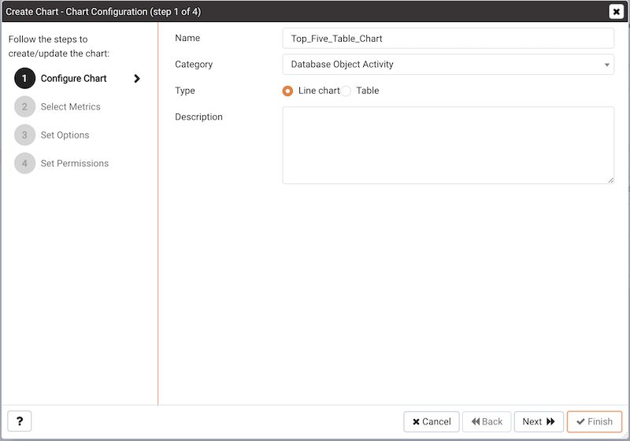
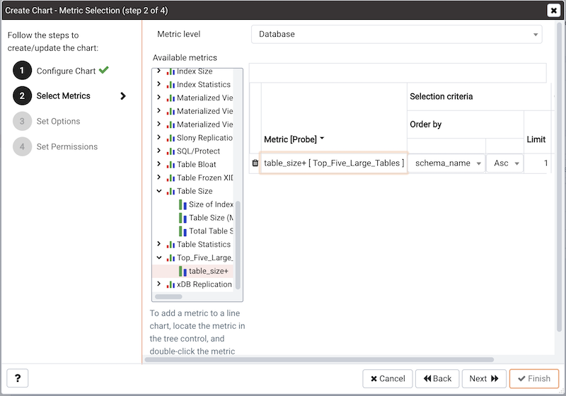
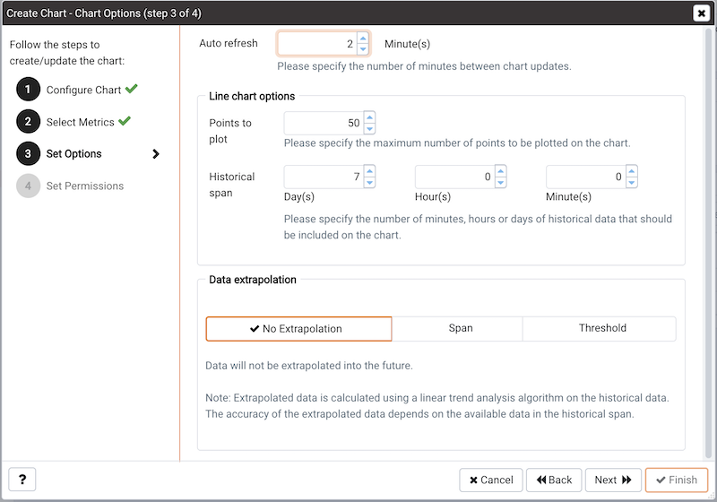

## Using the Manage Charts tab

You can use the `Manage Charts` tab to access dialogs that allow you to create or modify a custom line chart or table, or import a Capacity Manager template for use in a custom chart. After defining a chart, you can display the chart on a custom dashboard. To open the `Manage Charts` tab, select `Manage Charts...` from the PEM client `Management` menu.

The `Manage Charts` tab provides a `Quick Links` menu that allows you to access dialogs to:

-   `Create a New Chart` for use on a custom dashboard.
-   `Import a Capacity Manager` template to use as a template for creating a custom chart.
-   Access online `Help`.

The `Custom Charts` table displays a list of user-defined charts; when a chart is newly added, the font displays in green. When you add an additional chart or refresh the screen, the name of the chart is displayed in black.

Use the search box in the upper-right hand corner of the `Custom Charts` table to search through your custom charts. Specify a:

-   Chart name
-   Type
-   Level
-   Metrics Category

Use icons to the left of a charts name in the `Custom Charts` table to manage a chart:

-   Click the edit icon to open the `Chart Configuration` wizard and modify aspects of the chart or table.
-   Click the delete icon to delete the selected chart.

### Creating a custom chart

Click the `Create New Chart` icon in the `Quick Links` section of the `Manage Charts` tab to open the `Create Chart` wizard. The wizard will walk you through the steps required to define a new chart.

Use the fields on the `Configure Chart` dialog to specify general information about the chart:

-   Specify the name of the chart in the `Name` field.
-   Use the drop-down listbox in the `Category` field to specify the category in which this chart will be displayed; when adding a custom chart to a custom dashboard, the chart will be displayed for selection in the category specified.
-   Use the radio buttons in the `Type` field to specify if the chart will be a `Line chart` or a `Table`.
-   Provide a description of the chart in the `Description` field. The description will be displayed to the user viewing the chart (on a custom dashboard) when they click the information icon.

When you've completed the fields on the `Configure Chart` dialog, click `Next` to continue.

Use the fields on the `Select Metrics` dialog to select the metrics that will be displayed on the chart.

-   Use the `Metric level` drop-down listbox to specify the level of the PEM hierarchy from which you wish to select metrics. You can specify Agent, Database, or Server. Each level offers access to a unique set of probes and metrics.

-   Use the tree control in the Available metrics box to select the metrics that will be displayed on the chart.

    If you are creating a table, you may only select metrics from one probe; each node of the tree control lists the metrics returned by a single probe. Expand a node of the tree control, and check the boxes to the left of a metric name to include that metric data in the table.

    If you are creating a line chart, expand the nodes of the tree control and double-click each metric that you would like to include in the chart.

-   Use the fields in the Selected metrics panel to specify how the metric data will be displayed in your chart. The selection panel displays the name of the metric in the (non-modifiable) Metric \[Probe] column. You can:

    -   Click the garbage can icon to delete a metric from the list of selected metrics.
    -   Use the drop-down listboxes in the `Selection Criteria` column to specify the order of the data displayed.
    -   Use the `Limit` field to specify the number of rows in a table or lines in a chart:

    The maximum number of lines allowed in a chart is 32.

    The maximum number of rows allowed in a table is 100.

-   If you are creating a line chart, PEM supports comparisons of cross-hierarchy metrics.

    -   Click the `compare icon` to open a selection box that allows you to select one or more probe-specific attributes (i.e. CPUs, interfaces, databases, etc.) to compare in the chart.
    -   Click the `copy` icon to apply your selections to all of the metrics for the same probe. When the popup opens, click `Yes` to confirm that other selections for the same probe will be overwritten, or `No` to exit the popup without copying the attributes.

When you've completed the fields on the `Select Metrics` dialog, click `Next` to continue.

Use the fields on the `Set Options` dialog to specify display options for your chart:

-   Use the `Auto Refresh` field to specify the number of minutes between chart updates - choose a value from 1 to 120. The default auto refresh rate is 2 minutes.

Use fields under the Line chart options heading to specify display preferences for a line chart:

-   Use the `Points to plot` field to specify the maximum number of points that will be plotted on the chart.
-   Use the fields to the right of the Historical span label to specify how much historical data should be displayed on the chart:
-   Use the `Day(s)` field to specify the number of days of historical data that should be included on the chart.
-   Use the `Hour(s)` field to specify the number of hours of historical data that should be included on the chart.
-   Use the `Minute(s)` field to specify the number of minutes of historical data that should be included on the chart.

Use the fields in the `Data extrapolation` box to specify if PEM should generate extrapolated data based on historical data:

-   Click the `No Extrapolation` label to omit extrapolated data from the chart.
-   Click the `Span` label to use the Days and Hours selectors to specify the period of time spanned by the metrics on the chart.
-   Click the `Threshold` label to use threshold selectors to specify a maximum or minimum value for the chart.

When you've completed the fields on the `Set Options` dialog, click `Next` to continue.

Use the fields on the `Set Permissions` dialog to specify display options for your chart.

-   Set the `Share with all slider` to `Yes` to indicate that the chart will be available to all authorized users, or `No` to restrict access to the users or groups specified in the Access permissions field.
-   Use the `Access permissions` field to select the group or groups that will have access to the chart.

When you've finished defining the chart, click `Finish` to save your edits and add your chart to the list on the `Manage Charts` tab.

### Importing a Capacity Manager Template

Click the `Import Capacity Manager Template` icon in the Quick Links section of the `Manage Charts` tab to open the `Create Chart` dialog, and use a Capacity Manager template as a starting point for a chart or table.

When the `Create Chart` dialog opens, provide information about the custom chart:

-   Use the drop-down listbox in the `Import capacity template` field to select the name of the template on which the chart will be based.
-   Specify the name of the chart in the `Name` field.
-   Use the drop-down listbox in the `Category` field to specify the category in which this chart will be displayed. When adding a custom chart to a custom dashboard, the chart will be displayed for selection in the Category specified.
-   Use the radio buttons in the `Type` field to specify if the chart will be a `Line chart` or a `Table`.
-   Provide a description of the chart in the `Description` field. The description will be displayed to the user viewing the chart (on a custom dashboard) when they click the information icon.

Click `Next` to continue to the Select Metrics dialog.

The `Select Metrics` window allows you to review the metrics specified by the selected template. The bottom panel of the chart editor displays the metrics that will be included in the chart. The metrics included in the chart are not modifiable via the chart editor; to modify the metrics, you must use the Capacity Manager utility to update the template.

When you've reviewed the metrics, click `Next` to continue to the Set Options dialog.

Use the fields on the `Set Options` window to specify display options for your chart:

-   Use the `Auto Refresh` field to specify the number of minutes between chart updates - choose a value from 1 to 120. The default auto refresh rate is 2 minutes.

Use the fields in the `Data extrapolation` box to specify the time period covered by the chart. You can either:

-   click the `Historical days and extrapolated days` label and provide:
    -   the number of days of historical data that should be charted in the `Historical` field.
    -   the number of projected days that should be charted in the `Extrapolated` field.
-   or, click the Historical days and threshold label and provide:
    -   the number of days of historical data that should be charted in the `Historical` field
    -   the `threshold` value at which the chart will end.

When you've completed the Set Options window, click `Next` to continue.

Use the fields on the `Set Permissions` window to specify display options for your chart:

-   Set the `Share with all slider` to Yes to indicate that the chart will be available to all authorized users, or No to restrict access to the users or groups specified in the Access permissions field.
-   Use the `Access permissions` field to select the group or groups that will have access to the chart.

When you've finished defining the chart, click `Finish` to save your edits and add your chart to the list on the `Manage Charts` tab.
