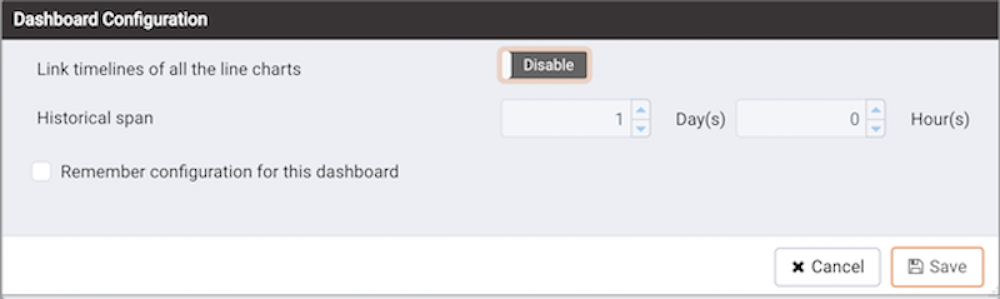
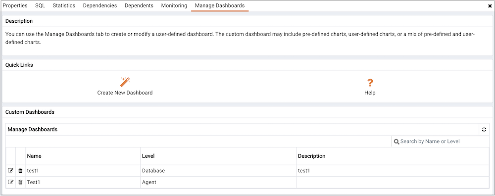
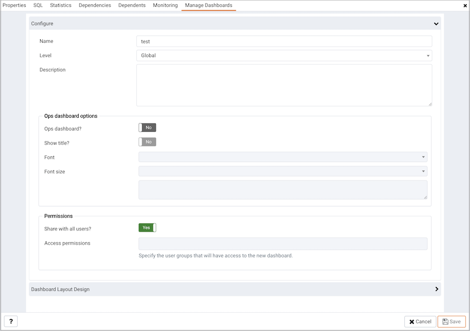
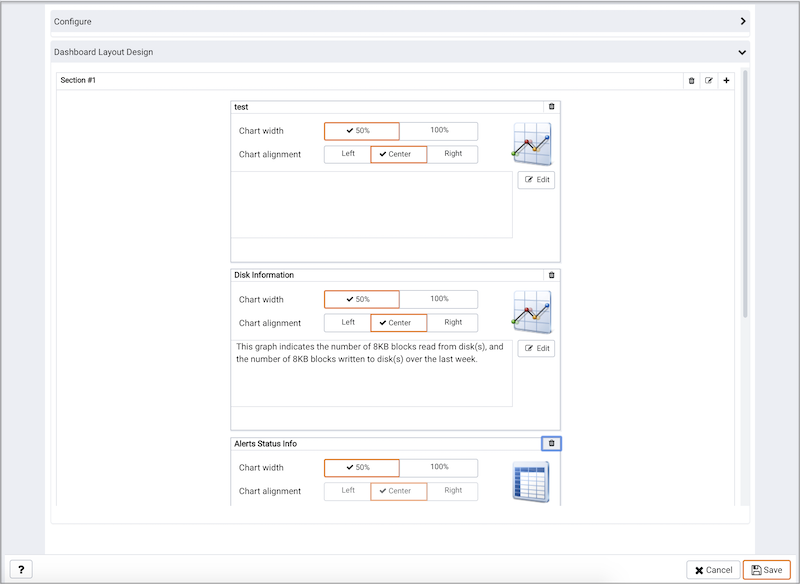
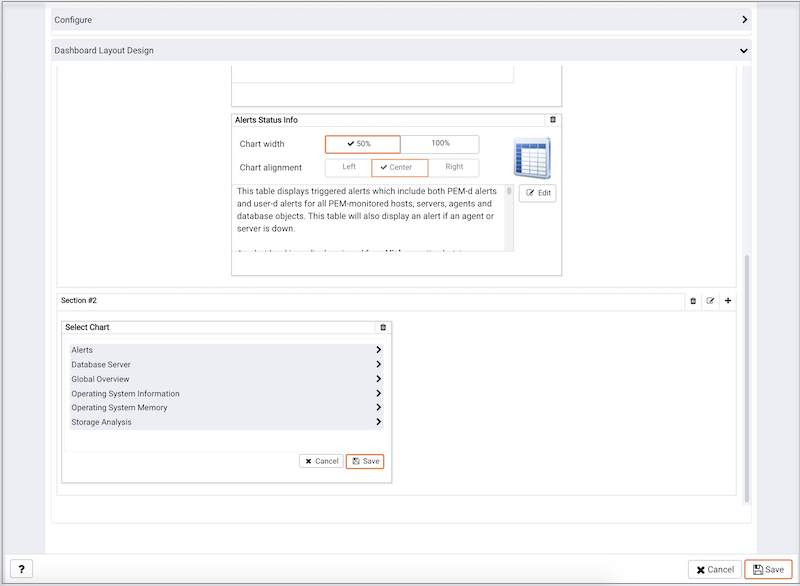
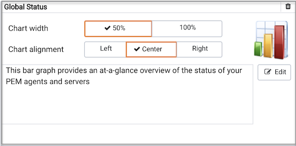

## Using dashboards to view performance information

PEM displays performance statistics through a number of dashboards; each dashboard contains a series of summary views that contain charts, graphs and tables that display the statistics related to the selected object.

The PEM client displays the `Global Overview` dashboard when it connects to the PEM server. Additional dashboards provide statistical information about monitored objects. These include the:

**Alerts Dashboard**

The Alerts dashboard displays the currently triggered alerts. If opened from the Global Overview, the dashboard displays the current alerts for all monitored nodes on the system; if opened from a node within a server, the report will reflect alerts related to that node, and all monitored objects that reside below that object in the tree control.

**Audit Log Analysis Dashboard**

For Advanced Server users, the Audit Log Analysis dashboard allows you to browse the audit logs that have been collected from instances that have audit logging and collection enabled.

**BDR Admin Dashboard**

The BDR Admin dashboard displays the overview of information about BDR node, BDR group, and BDR worker.

**BDR Group Monitoring Dashboard**

The BDR Group Monitoring dashboard displays the information about BDR group Subscription and BDR group replication slots.

**BDR Node Monitoring Dashboard**

The BDR Node Monitoring dashboard displays the information about BDR node slots, BDR node Replication rates, and BDR conflict history summary for the selected node. 

**Database Analysis Dashboard**

The Database Analysis dashboard displays performance statistics for the selected database.

**I/O Analysis Dashboard**

The I/O Analysis dashboard displays I/O activity across various areas such as object DML activity, log operations and more.

**Memory Analysis Dashboard**

The Memory Analysis dashboard supplies statistics concerning various memory-related metrics for the Postgres server.

**Object Activity Analysis Dashboard**

The Object Activity Analysis dashboard provides performance details on tables/indexes of a selected database.

**Operating System Analysis Dashboard**

The Operating System Analysis dashboard supplies information regarding the performance of the underlying machine’s operating system.

**Probe Log Analysis Dashboard**

The Probe Log Analysis dashboard displays any error messages returned by a PEM agent.

**Server Analysis Dashboard**

The Server Analysis dashboard provides general performance information about the overall operations of a selected Postgres server.

**Server Log Analysis Dashboard**

The Server Log Analysis dashboard allows you to filter and review the contents of server logs that are stored on the PEM server.

**Session Activity Analysis Dashboard**

The Session Activity Analysis dashboard provides information about the session workload and lock activity for the selected server

**Session Waits Analysis Dashboard**

The Session Waits Analysis dashboard provides an overview of the current DRITA wait events for an Advanced Server session.

**Storage Analysis Dashboard**

The Storage Analysis dashboard displays space-related metrics for tablespaces and objects.

**System Waits Analysis Dashboard**

The System Waits Analysis dashboard displays a graphical analysis of system wait information for an Advanced Server session.

**Streaming Replication Analysis Dashboard**

The Streaming Replication Analysis dashboard displays statistical information about WAL activity for a monitored server and allows you to monitor the status of Failover Manager clusters.

There are two ways to open a dashboard; you can:

-   Select an active dashboard name from the `Dashboards` menu (accessed via the Management menu).
-   Right click on the name of a monitored object in the tree control and select the name of the dashboard you would like to review from the Dashboards menu.

Each dashboard is displayed on the `Monitoring` tab in the main panel of the client window. After opening a dashboard, you can navigate to other dashboards within the same tab.

Each dashboard header includes navigation menus that allow you to navigate to other dashboards; use your browsers forward and back icons to scroll through previously-viewed dashboards. Use the Refresh icon to update the current dashboard.

Options on the `Dashboard Configuration` dialog allow you to link the time lines of all of the line graphs on the dashboard. To open the `Dashboard Configuration` dialog, click the Settings icon displayed in the dashboard header.

Use fields on the `Dashboard Configuration` dialog to control attributes of the charts displayed on the dashboard:

-   Set the Link timelines of all the line charts slider to Enable to indicate that the specified timeline should be applied to line graphs displayed on the dashboard; if set to Disable, your preferences will be preserved for later use, but will not modify the amount of data displayed.
-   Use the `Days` selector to specify the number of days of gathered data that should be displayed on line graphs.
-   Use the `Hour(s)` selector to specify the number of hours of gathered data that should be displayed on line graphs.
-   Check the box next to Remember configuration for this dashboard to indicate that the customized time span should be applied to the current dashboard only; if left unchecked, the time span will be applied globally to line graphs on all dashboards.

Please note that settings specified on the `Dashboard Configuration` dialog are applied only to the current user's session.

## Managing custom dashboards

PEM displays performance statistics through a number of system-defined dashboards; each dashboard contains a series of summary views that contain charts, graphs and tables that display statistics related to the selected object. You can use the `Manage Dashboards` tab to create and manage custom dashboards that display the information that is most relevant to your system.

To create a custom dashboard, click the `Create New Dashboard` link (located in the Quick Links section of the Manage Dashboards tab).

To modify an existing dashboard, click the edit icon to the left of a dashboard name. The dashboard editor will open, displaying the definition of the dashboard. When you've finished modifying the dashboard's definition, click the `Save` button to preserve your changes; click `Cancel` to exit without saving your changes.

To delete a dashboard, click the delete icon to the left of a dashboard name. A popup will ask you to confirm that you wish to delete the dashboard; click `OK` to delete the selected dashboard.

### Creating a custom dashboard

You can use the PEM dashboard editor to create or modify a user-defined dashboard. The custom dashboard may include pre-defined charts, user-defined charts or a mix of pre-defined and user-defined charts.

Use the fields in the `Configure` section to specify general information about the dashboard:

-   Specify a name for the dashboard in the `Name` field. The name specified will also be the title of the dashboard if the title is displayed.
-   Use the `Level` drop-down listbox to specify the level of the PEM hierarchy within the PEM client on which the dashboard will be displayed. A dashboard may be accessed via the Dashboards menu on a Global level, an Agent level, the Server level or the Database level. Each selected level within the list will expose a different set of metrics on which the custom dashboard's charts may be based.
-   Provide a description of the dashboard in the Description field.

Provide information in the fields in the `Ops dashboard options` box if the dashboard will be used as an Ops dashboard:

-   Set the `Ops Dashboard?` field to Yes to instruct the server to create a dashboard that is formatted for display on an Ops monitor.
-   Set the `Show Title?` field to Yes to display the dashboard name at the top of the Ops dashboard.
-   Use the `Font` drop-down list box to select a custom font style for the title. The selected font style will be displayed in the Preview box.
-   Use the `Font size` drop-down list box to select a custom font size for the title. The selected font style will be displayed in the Preview box.

Use the `Permissions` box to specify the users that will be able to view the new dashboard:

-   Set the `Share with all slider` to Yes to instruct the server to allow all Teams to access the dashboard, or set Share with all to No to enable the Access permissions field.
-   Use the `Access permissions` field to specify which roles can view the new dashboard. Click in the field, and select from the list of users to add a role to the list of users with dashboard access.

When you've completed the `Configure Dashboard` section, click the arrow in the upper-right corner to close the section, and access the `Dashboard Layout Design` section.

Click the edit icon in a section header to specify a section name; then, click the add icon (+) to add a chart to the section.

Use the arrows to the right of each chart category to display the charts available and select a chart.

Use the chart detail selectors to specify placement details for the chart:

-   Use the `Chart width` selector to indicate the width of the chart; select 50% to display the chart in half of the dashboard, or 100% to use the whole dashboard width.

-   Use the `Chart alignment` selector to indicate the position of the chart within the section:

    Select `Left` to indicate that the chart should be left-justified.

    Select `Center` to indicate that the chart should be centered.

    Select `Right` to indicate that the chart should be right-justified.

Please note that tables are always displayed centered.

When creating or editing a custom dashboard, you can use drag and drop to re-arrange the charts within a section or to move a chart to a different section.

To add another chart to your dashboard, click the add icon (+) in the section header. When you've finished editing the dashboard, click the `Save` button to save your edits and exit.

To exit without saving your changes, click the `Cancel` button.

### Creating an Ops dashboard

You can use the PEM dashboard editor to create a custom dashboard formatted for display on an Ops monitor. An Ops dashboard displays the specified charts and graphs, while omitting header information and minimizing extra banners, titles, and borders.

To create an `Ops dashboard`, provide detailed information about the Ops display in the `Ops dashboard options` section of the `Create Dashboard` dialog.

-   Set the `Ops Dashboard?` field to `Yes` to instruct the server to create a dashboard that is formatted for display on an Ops monitor.
-   Set the `Show Title?` field to `Yes` to display the dashboard name at the top of the Ops dashboard.
-   Use the `Font` drop-down list box to select a custom font style for the title. The selected font style will be displayed in the `Preview` box.
-   Use the `Font size` drop-down list box to select a custom font size for the title. The selected font style will be displayed in the `Preview` box.

After adding charts and tables to the Ops dashboard, click the `Save` button to save your work. You can then access the dashboard by navigating through the Dashboards menu of the hierarchy level specified in the `Level` field on the `New Dashboard` dialog.
