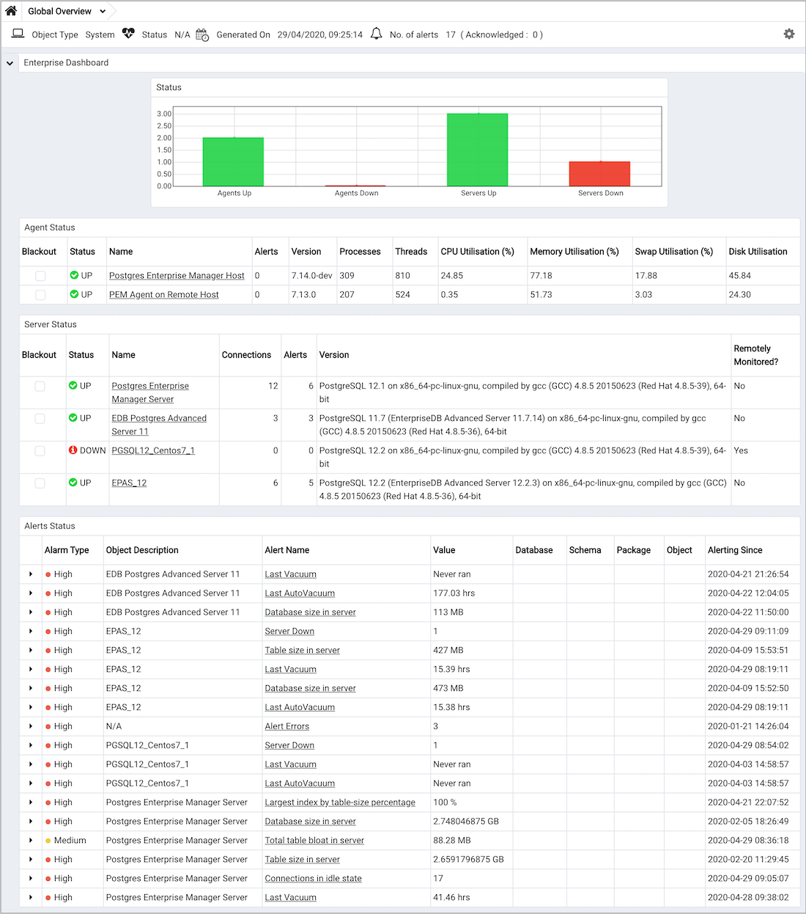

PEM contains built-in functionality that implements enterprise-wide performance monitoring of all managed servers. While you can customize many aspects of the various performance monitoring aspects of PEM, you can also elect to accept the recommended defaults that come out-of-the-box with the product.

The top-level dashboard is the `Global Overview`. The Global Overview presents a status summary of all the servers and agents that are being monitored by the PEM server, a list of the monitored servers, and the state of any currently triggered alerts.
