You can use the PEM Log Manager to simplify server log configuration for Postgres instances. With the Log Manager, you can modify all of your server log parameters with a click:

-   Where log files are written
-   How often log files are written
-   The type of information written to log files
-   The format of log file entries
-   Log rotation properties

To configure logging for a Postgres instance, the server must be registered as a PEM-managed server, and the registration information must include the name of a service script.

To open the `Log Manager`, select the `Log Manager...` option from the `Management` menu of the PEM client. The wizard opens, welcoming you to the Log Manager.

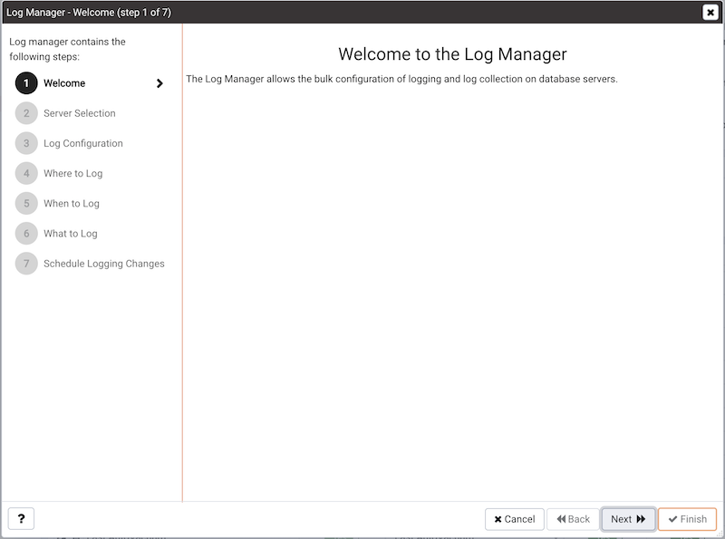

Click `Next` to continue to the `Server selection` dialog.

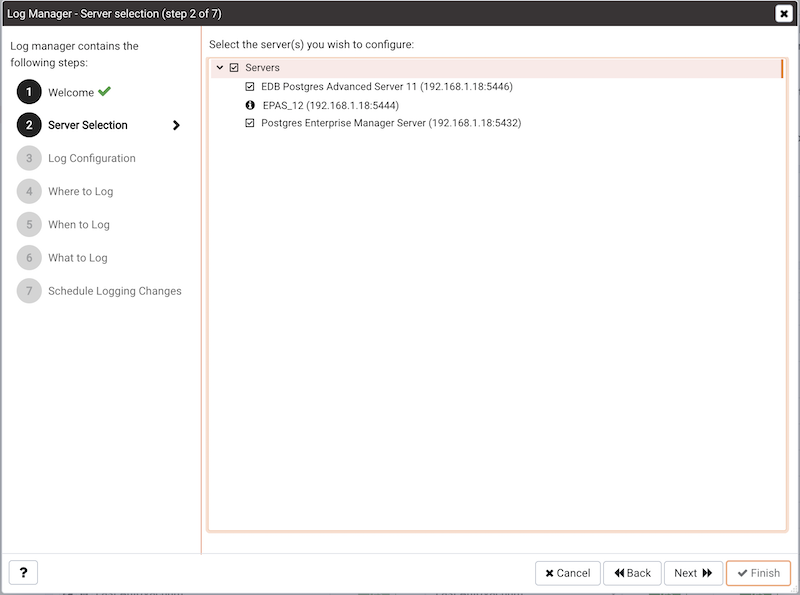

The `Server selection` dialog displays a list of the server connections monitored by PEM. Check the box next to the name of a server (or servers) to which the Log Manager wizard will apply the specified configuration. Log Manager is disabled for any server displaying a red exclamation mark to the left of its name in the Server selection tree control; there are several reasons that a server may not be enabled:

-   Only a server that specifies a `Service ID` on the `Advanced` tab of the `Properties` dialog can be configured by Log Manager.

    To provide a service ID, right click on the server name in the tree control, and select `Disconnect Server` from the context menu; if prompted, provide a password. Then, open the context menu for the server, and select `Properties`. Navigate to the `Advanced` tab, and provide the name of the service in the `Service ID` field; click `Save` to save your change and exit the dialog.

-   If the PEM agent bound to the server does not have sufficient privileges to restart the server, the server will be disabled.

-   If the PEM agent bound to the server is an older version than the associated PEM server, the server will be disabled.

Click `Next` to continue.

Use the options on the `Log configuration` dialog to specify how often log files will be inported to PEM and to specify log rotation details:

Options within the `Import Logs` box specify how often log files will be imported to PEM:

-   Use the switch next to the `Import logs to PEM` label to specify if log files will be imported to PEM and displayed on the Server Log Analysis dashboard.
-   Use the `Import Frequency` drop-down list box to specify how often log files are imported to PEM.

Use the fields in the `Log rotation configuration` box to specify the maximum length (lifespan or size) of a log file:

-   Use the `Rotation Size` field to specify the maximum size in megabytes of an individual log file. The default value is 10 MB; when set to 0, no limit is placed on the maximum size of a log file.
-   Use the `Rotation Time` field to specify the number of whole days that should be stored in each log file. The default value is 1 day.

Use the `Truncation on Rotation` switch to specify server behavior for time-based log file rotation:

-   Select `ON` to specify that the server should overwrite any existing log file that has the same name that a new file would take.
-   Select `OFF` to specify that the server should append any new log file entries to an existing log file with the same name that a new log file would take. This is the default behavior.

Click `Next` to continue.

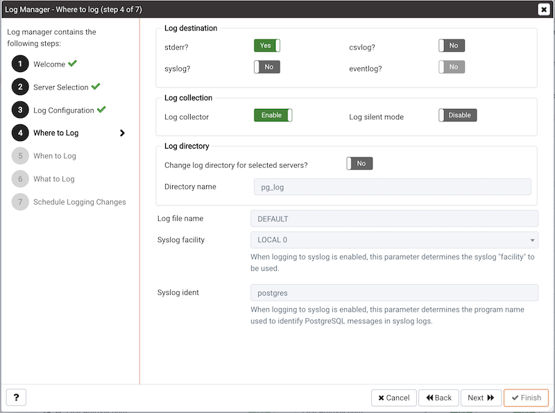

Use the fields on the `Where to log` dialog to specify where log files should be written.

-   Select an option from the `Log Destination` box to specify a destination for the server log output:
    -   Set the `stderr` switch to `Yes` to specify that log files should be written to stderr.
    -   Set the `csvlog` switch to `Yes` to specify that log files should be written to file in a comma-separated value format. This option is automatically enabled (and no longer editable) if you have selected `Import logs to PEM` on the `Schedule` dialog; if you are not importing server log files to PEM, this option is editable.
    -   Set the `syslog` switch to `Yes` to specify that log files should be written to the system log files.
    -   On Windows, set the `eventlog` switch to Yes to specify that log files should be written to the event log.

-   Use the options within the `Log collection` box to specify your collection preferences:
    -   Set the `Log Collector` switch to `Enable` to instruct the server to re-direct captured log messages (directed to STDERR) into log files.
    -   Set the `Log Silent Mode` switch to `Enable` to instruct the server to run silently in the background, disassociated from the controlling terminal.

-   Use options in the `Log Directory` box to specify log file location preferences:
    -   Set the `Change log directory for selected servers?` switch to `Yes` to specify that each set of log files should be maintained in a separate directory.
    -   Use the `Directory name` field to specify the directory to which log files will be written. The directory will reside beneath the pg_log directory under the installation directory of the monitored server.

-   Use the `Log File Name` field to specify a format for the log file name. If set to `DEFAULT`, the format is `enterprisedb-%Y-%m-%d_%H%M%S`, where:
    -   `enterprisedb` is the file name prefix
    -   `Y` is the year that the log was stored
    -   `m` is the month that the log was store
    -   `d` is the day that the log was stored
    -   `H` is the hour that the log was stored
    -   `M` is the minute that the log was store
    -   `S` is the second that the log was stored

-   When logging to syslog is enabled:

    -   Use the `Syslog Facility` drop-down list box to specify which syslog facility should be used.
    -   Use the `Syslog Ident` field to specify the program name that will identify Advanced Server entries in system logs.

Click `Next` to continue.

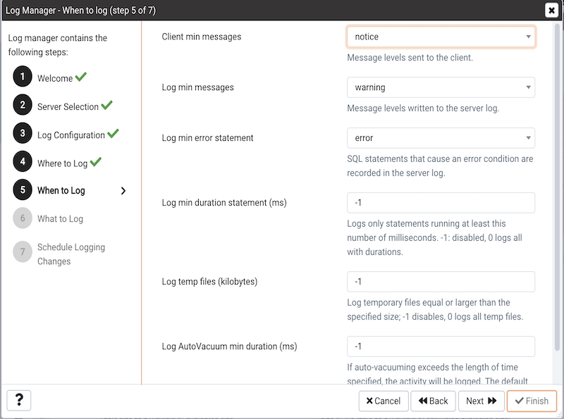

Use the fields on the `When to log` dialog to specify which events will initiate a log file entry. The severity levels (in order of severity, from most severe to least severe) are:

-   `panic` - Errors that cause all database sessions to abort.
-   `fatal` - Errors that cause a session to abort.
-   `log` - Information messages of interest to administrators.
-   `error` - Errors that cause a command to abort.
-   `warning` - Error conditions in which a command will complete but may not perform as expected.
-   `notice` - Items of interest to users. This is the default.
-   `info` - Information implicitly requested by the user.
-   `debug5` through `debug1` - Detailed debugging information useful to developers.
-   Use the `Client min messages` drop-down list box to specify the lowest severity level of message sent to the client application.
-   Use the `Log min messages` drop-down list box to specify the lowest severity level that will be written to the server log.
-   By default, when an error message is written to the server log, the text of the SQL statement that initiated the log entry is not included. Use the `Log min error statement` drop-down list box to specify a severity level that will trigger SQL statement logging. If a message is of the specified severity or higher, the SQL statement that produced the message will be written to the server log.
-   Use the `Log min duration statement` drop-down list box to specify a statement duration (in milliseconds); any statements that exceed the specified number of milliseconds will be written to the server log. A value of `-1` disables all duration-based logging; a value of `0` logs all statements and their duration.
-   Use the `Log temp files` field to specify a file size in kilobytes; when a temporary file reaches the specified size, it will be logged. A value of `-1` (the default) disables this functionality.
-   Use the `Log autoVacuum min duration` field to specify a time length in milliseconds; if auto-vacuuming exceeds the length of time specified, the activity will be logged. A value of `-1` (the default) disables this functionality.

Click `Next` to continue.

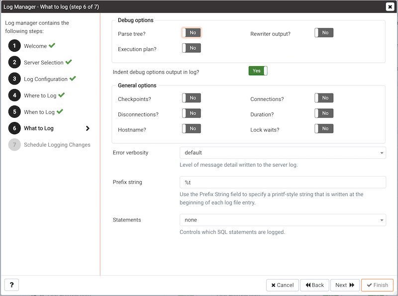

Use the fields on the `What to log` dialog to specify log entry options that are useful for debugging and auditing.

The switches in the `Debug options` box instruct the server to include information in the log files related to query execution that may be of interest to a developer:

-   Set the `Parse tree` switch to Yes to instruct the server to include the parse tree in the log file.
-   Set the `Rewriter output` switch to Yes to instruct the server to include query rewriter output in the log file.
-   Set the `Execution plan` switch to Yes to instruct the server to include the execution plan for each executed query in the log file.

When the `Indent Debug Options Output in Log` switch is set to `Yes`, the server indents each line that contains a parse tree entry, a query rewriter entry or query execution plan entry. While indentation makes the resulting log file more readable, it does result in a longer log file.

Use the switches in the `General Options` box to instruct the server to include auditing information in the log file:

-   Set the `Checkpoints` switch to `Yes` to include checkpoints and restartpoints in the server log.
-   Set the `Connections` switch to `Yes` to include each attempted connection to the server (as well as successfully authenticated connections) in the server log.
-   Set the `Disconnections` switch to `Yes` to include a server log entry for each terminated session that provides the session information and session duration.
-   Set the `Duration` switch to `Yes` to include the amount of time required to execute each logged statement in the server log.
-   Set the `Hostname` switch to `Yes` to include both the IP address and host name in each server log entry (by default, only the IP address is logged). Please note that this may cause a performance penalty.
-   Set the `Lock Waits` switch to `Yes` to instruct the server to write a log entry for any session that waits longer than the time specified in the deadlock_timeout parameter to acquire a lock. This is useful when trying to determine if lock waits are the cause of poor performance.

Use the `Error verbosity` drop-down list box to specify the detail written to each entry in the server log:

-   Select `default` to include the error message, DETAIL, HINT, QUERY and CONTEXT in each server log entry.
-   Select `terse` to log only the error message.
-   Select `verbose` to include the error message, the DETAIL, HINT, QUERY and CONTEXT error information, SQLSTATE error code and source code file name, the function name, and the line number that generated the error.

Use the `Prefix string` field to specify a printf-style string that is written at the beginning of each log file entry. For information about the options supported, please see the log_line_prefix documentation (in the Postgres core documentation), available at:

<http://www.postgresql.org/docs/current/static/runtime-config-logging.html>

Use the `Statements` drop-down list box to specify which SQL statements will be included in the server log. The default is none; valid options are:

-   Specify `none` to disable logging of SQL statements.
-   Specify `ddl` to instruct the server to log ddl (data definition language) statements, such as CREATE, ALTER, and DROP.
-   Specify `mod` to instruct the server to log all ddl statements, as well as all dml (data modification language) statements, such as INSERT, UPDATE, DELETE, TRUNCATE and COPY FROM.
-   Specify `all` to instruct the server to log all SQL statements.

Click `Next` to continue.

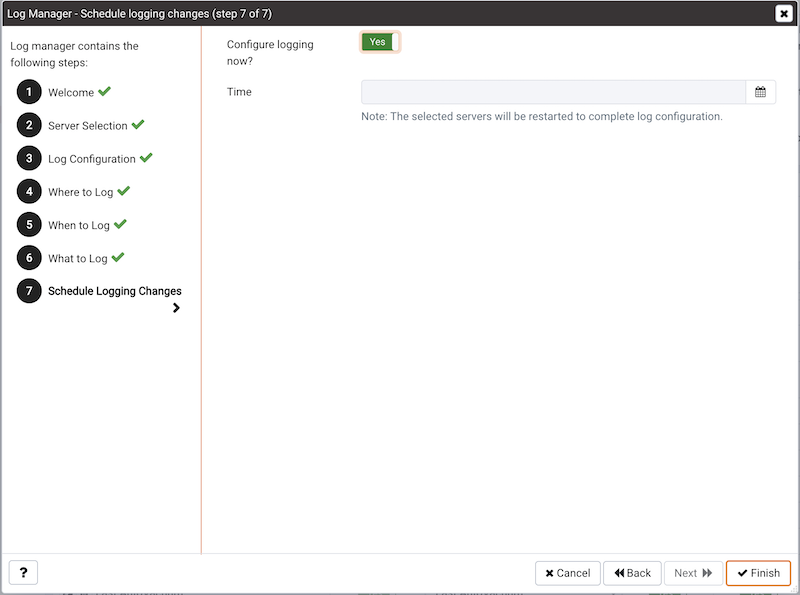

Use options on the `Schedule logging changes` dialog to specify when logging configuration changes will be applied:

-   Set the `Configure logging now` switch to `Yes` to specify that your configuration preferences will be enabled, and the server will restart when you have completed the Log Manager wizard.
-   Set `Configure logging now` to `No` to use the Schedule it for some other time calendar selector to specify a convenient time for logging configuration preferences to be applied, and the server to restart.

Note that when you apply the configuration changes specified by the Log Manager wizard, the server restart will temporarily interrupting use of the database server for users.

Click `Finish` to exit the wizard, and either restart the server, or schedule the server restart for the time specified on the scheduling dialog.

## Reviewing the Server Log Analysis dashboard

After invoking the Log Manager wizard, and importing your log files to PEM, you can use the `Server Log Analysis` dashboard to review the log files for a selected server. To open the `Server Log Analysis` dashboard, right-click on the name of a monitored server in the PEM client tree control, and navigate through the `Dashboards` menu, selecting `Server Log Analysis`.

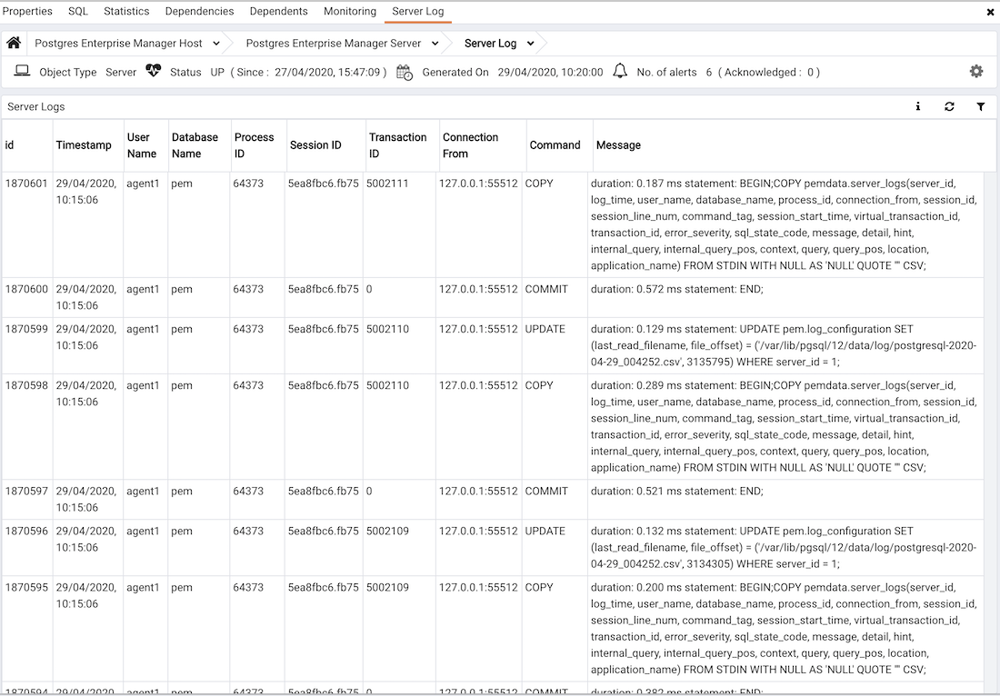

The header information on the `Server Log Analysis` dashboard displays the date and time that the server was started, the date and time that the page was last updated, and the current number of triggered alerts.

Entries in the `Server Log` table are displayed in chronological order, with the most-recent log entries first. Use the scroll bars to navigate through the log entries, or to view columns that are off of the display.

Headings at the top of the server log table identify the information stored in each column; hover over a column heading to view a tooltip that contains a description of the content of each column.

You can use filtering to limit the number of server log records that are displayed. Click `Show Filters` to expose the filters panel and define a filter.

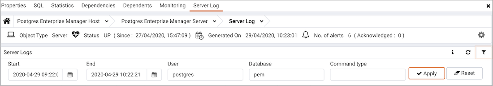

Use the fields within the `filter definition` box to describe the selection criteria that PEM will use to select a subset of a report for display:

-   Use the `From` field to specify a starting date for the displayed server log.
-   Use the `To` field to specify an ending date for the displayed server log.
-   Enter a role name in the `Username` field display only transactions performed by that user.
-   Enter a database name in the `Database field` to specify that the server should limit the displayed records to only those transactions that were performed against the specified database.
-   Use the `Command Type` field to specify a selection criteria for the commands that will be displayed in the filtered report.

When you've described the criteria by which you wish to filter the server logs, click `Filter` to display the filtered server log in the `Server Log` table.

## Postgres Log Analysis Expert

The PEM Log Analysis Expert analyzes the log files of servers that are registered with Postgres Enterprise Manager, and produces a report that provides an analysis of your Postgres cluster's usage based on log file entries. You can use information on the Log Analysis Expert reports to make decisions about optimizing your cluster usage and configuration to improve performance.

Before using the PEM Log Analysis Expert, you must specify the Service ID on the Advanced tab of the Server Properties dialog, and use the Log Manager wizard to enable log collection by the PEM server.

To open the `Postgres Log Analysis Expert` wizard, select the `Postgres Log Analysis Expert...` option from the `Management` menu of the PEM client. The wizard's `Welcome` dialog opens; click `Next` to continue:

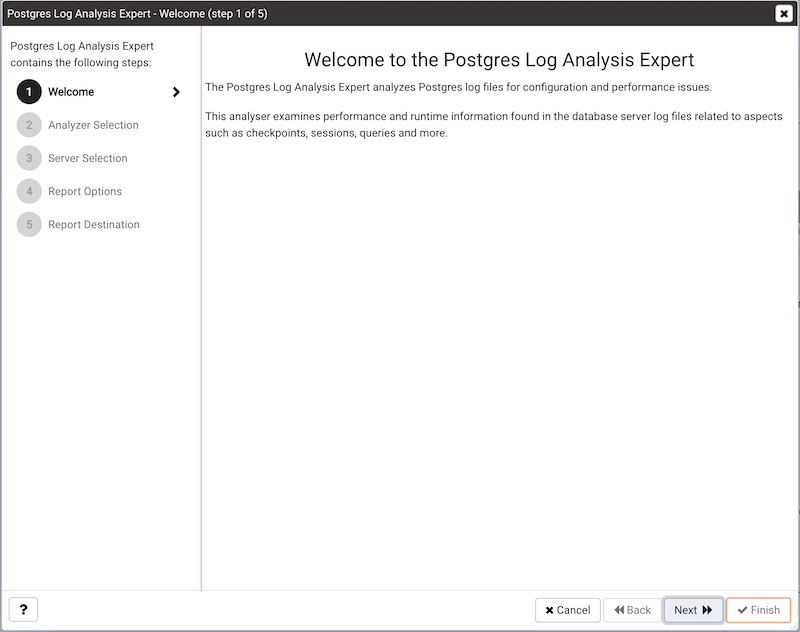

The wizard's `Analyzer selection` dialog displays a list of Analyzers from which you can select. Each Analyzer generates a corresponding table, chart, or graph that contains information gleaned from the log files.

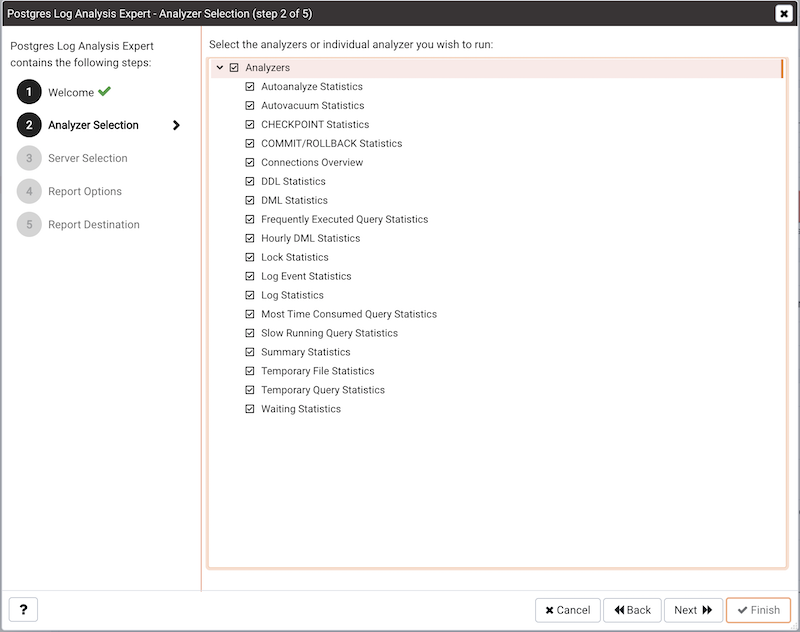

Check the box to the left of an Analyzer to indicate that the Log Analysis Expert should prepare the corresponding table, chart or graph. After making your selections, click `Next` to continue to the Server selection tree control.

Use the tree control to specify which servers you would like the Postgres Log Analysis Expert to analyze. If you select multiple servers, the resulting report will contain the corresponding result set for each server in a separate (but continuous) list. Click `Next` to continue to the Report options dialog.

Use the fields in the `Options` section to specify the analysis method and the maximum length of any resulting tables:

-   Use the `Aggregate method` drop-down to select the method used by the Log Analysis Expert to consolidate data for the selected time span. You can select from:
    -   `SUM` instructs the analyzer to calculate a value that is the sum of the collected values for the specified time span.
    -   `AVG` instructs the analyzer to calculate a value that is the average of the collected values for the specified time span.
    -   `MAX` instructs the analyzer to use the maximum value that occurs within a specified time span.
    -   `MIN` instructs the analyzer to use the minimum value that occurs within a specified time span.
-   Use the `Time span` field to specify the number of minutes that the analyzer will incorporate into each calculation for a point on a graph. For example, if the Time span is 5 minutes, and the Aggregate method is AVG, each point on the given graph will contain the average value of the activity that occurred within a five minute time span.
-   Use the `Rows limit` field to specify the maximum number of rows to include in a table.

Use the fields in the `Time Intervals` section to specify the time range that the Log Analysis Expert will analyze:

-   Set `Relative days` to Yes to enable the (+/-)From date field and specify the number of days before or after the date and time selected in the From field.
-   Use the `From` field to specify the starting date and time for the analysis.
-   Use the `To` field to specify the ending date and time for the analysis.
-   Use the `(+/-)` From date selector to specify the number of days before or after the From date that should be included in the analysis.

When you've specified the report options, click `Next` to continue to the Report destination dialog.

You can choose the default option and select `Finish` to view the Log Analysis Expert report in the PEM client's tabbed browser, or click the radio button next to Download the report to save a copy of the report to an HTML file for later use.

If you have specified that the report should be saved to a file, the report will be downloaded.

## Reviewing the Postgres Log Analysis Expert report

If you've elected to review the report immediately, the Postgres Log Analysis Expert report will be displayed in the PEM Client window. The report header displays the date and time that the report was generated, the time period that the report spans, and the aggregation method specified when defining the report. The name of the server for which information is displayed is noted at the start of each section of the report.

The report displays the tables, graphs and charts that were selected in the Log Analysis Expert wizard. Use the `Jump To` button (located in the lower-right hand corner of the screen) to navigate to a specific graphic.

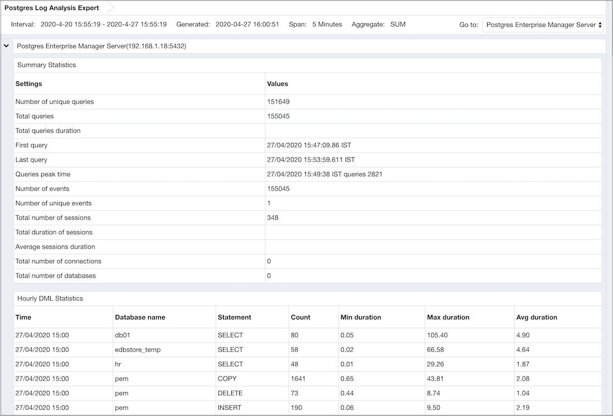

If the report contains an analysis of more than one monitored server, charts and tables will be displayed in sets; first the graphs, tables and charts that display statistics for one server, then the graphics for the next server in the report.
