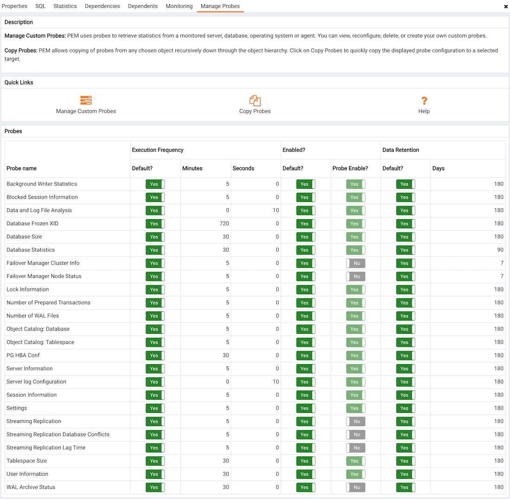

Before configuring PEM to retrieve statistics from an Advanced Server or PostgreSQL database that is part of an xDB replication scenario, you must manually install and configure xDB Replication. For more information about xDB replication solutions and documentation, please visit the EDB website at:

[http://www.enterprisedb.com/products-services-training/products-overview/xdb-replication-server-multi-master](http://www.enterprisedb.com/products-services-training/products-overview/xdb-%20replication-server-multi-master)

The PEM xDB Replication probe monitors lag data for clusters that use xDB multi-primary or single-primary replication that have a publication database that is an EDB Postgres Advanced Server or PostgreSQL database. Please note that if you have configured replication between other proprietary database hosts (i.e. Oracle or SQL Server) and Advanced Server or PostgreSQL, the probe cannot return lag information.

By default, the `xDB Replication` probe is disabled. To enable the `xDB Replication` probe, right click on the name of the server, and select `Connect` from the context menu; if prompted, provide authentication information. After connecting, expand the server node of the tree control, and highlight the name of the replicated database. Then, select `Manage Probes...` from the `Management` menu.

Use fields on the `Manage Probes` tab to configure the xDB Replication probe:

-   Move the `Default` slider to `No` to modify the Minutes and Seconds between probe executions.
-   Use the `Enabled?` slider to instruct PEM to execute the xDB Replication probe.
-   Set the `Default` slider in the `Data Retention` field to No to modify the number of days that PEM will store the information retrieved by the probe.

After enabling the probe, you can use the metrics returned to create custom charts and dashboards in the PEM client.
