## Notifications

PEM can send a notification or execute a script if an alert is triggered, or if an alert is cleared. The Notifications can be send via following options:

-   SMTP
-   Webhooks
-   SNMP
-   Nagios

Use the `Notification` tab to specify how PEM will behave if an alert is raised.

### SMTP

Please note that you must configure the PEM Server to use an SMTP server to deliver email before PEM can send email notifications.

#### Creating an email group

Postgres Enterprise Manager monitors your system for conditions that require user attention. You can use an email group to specify the email addresses of users that the server will notify if current values deviate from threshold values specified in an alert definition. An email group has the flexibility to notify multiple users, or target specific users during user-defined time periods.

Use the `Email Groups` tab to configure groups of SMTP email recipients. To access the `Email Groups` tab, select `Manage Alerts...` from the PEM client's `Management` menu; when the `Manage Alerts` tab opens, select `Email Groups` from the Quick Links toolbar.

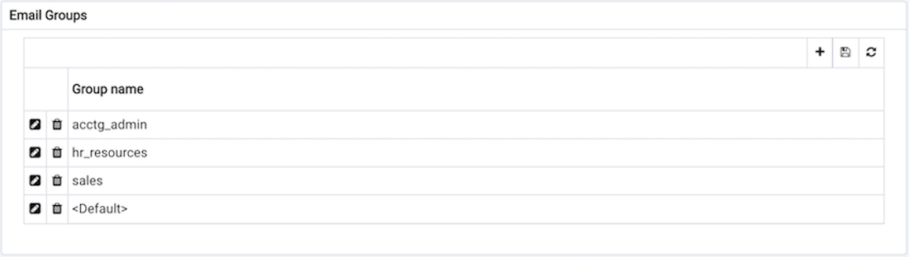

The `Email Groups` tab displays a list of the currently defined email groups. Highlight a group name and click the Edit icon (at the far left end of the row) to modify an existing group.

To define a new email group, click the Add icon (+) in the upper-right corner of the `Email Groups` table. The `Email Group` definition dialog opens.

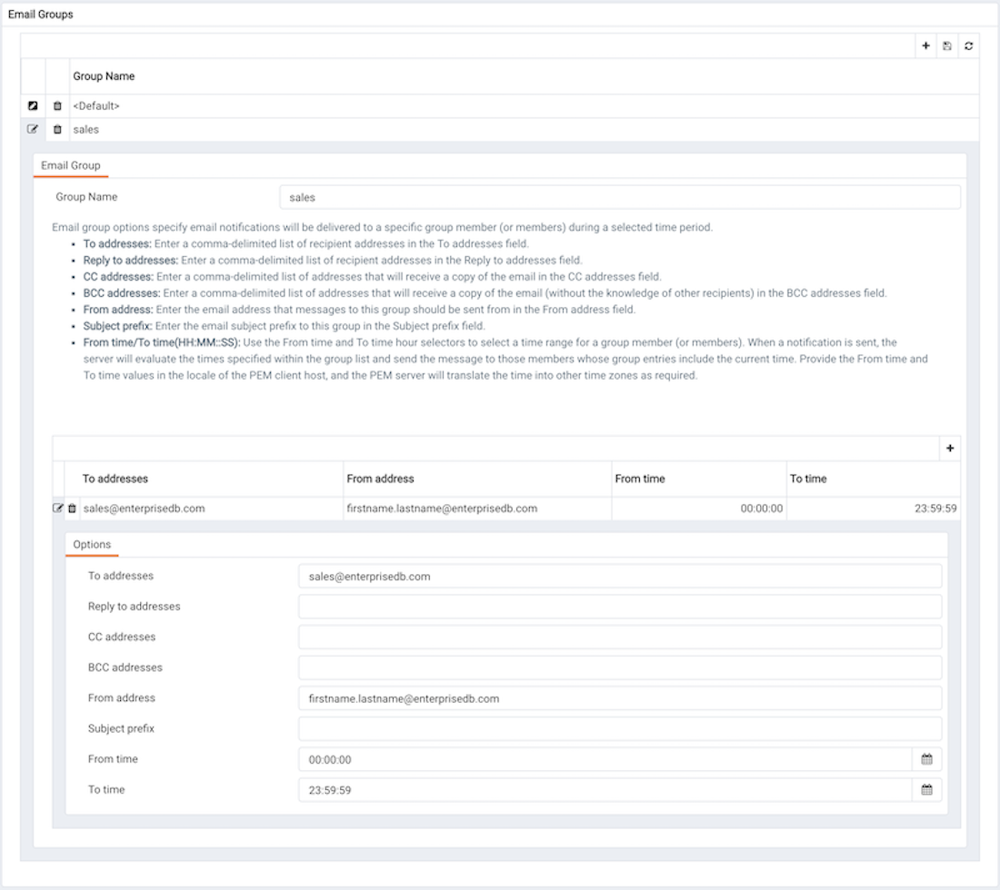

Use the `Email Group` dialog to define an email group and its members:

-   Provide a name for the email group in the `Group Name` field.

Each row within the email group definition will associate a unique set of email addresses with a specific time period. When an alert is triggered, the server will evaluate the times specified in each row and send the message to those group members whose definitions are associated with the time that the alert triggered.

Click the Add icon (+) in the group members table to open the `Options` tab, and add the member addresses that will receive notifications for the time period specified:

-   Enter a comma-delimited list of recipient addresses in the `Reply` to Addresses field.
-   Enter a comma-delimited list of addresses that will receive a copy of the email in the `CC Addresses` field.
-   Enter a comma-delimited list of addresses that will receive a copy of the email (without the knowledge of other recipients) in the `Bcc Addresses` field.
-   Enter the email address that messages to this group should be sent from in the `From Address` field.
-   Use the `Subject prefix` field to provide a message that will be added to the start of each subject line when a notification is sent.
-   Use the `From Time` and `To Time` time selectors to specify the time range for notifications to the group member(s) that are identified on this row. Provide the From Time and To Time values in the locale of the PEM client host, and the PEM server will translate the time into other time zones as required.

When you've identified the member or members that will receive an email during a specific time period, click the Add icon to add a row to the table, and specify another time period and the email addresses that will be notified during those hours. When you've finished defining the email group, click the Save icon.

#### Deleting an Email Group

To delete an email group, highlight the name of the group in the `Email Group` table and click the Delete icon (located to the left of the group name).

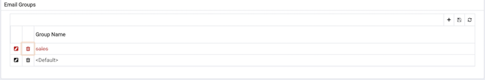

The group name will be displayed in the `Email Group` table in red; click the Save icon to make the change persistent and remove the group from the table.

After creating the email group, you can use the `Manage Alerts` tab to set up the `Notification` details for an alert that will direct notifications to the group.

### Webhook

Please note that you must configure the PEM Server to use webhooks to receive notification of alert events on threshold value violations in your configured applications.

#### Creating a webhook

Postgres Enterprise Manager monitors your system for conditions that require user attention. You can use a webhook to create the endpoints that will receive a notification if current values deviate from threshold values specified in an alert definition. PEM sends a notification to multiple webhook endpoints, or to specific target webhook endpoints based on the events triggered.

Use the `Webhooks` tab to configure endpoint recipients. To access the `Webhooks` tab, select `Manage Alerts...` from the PEM client's `Management` menu; when the `Manage Alerts` tab opens, select `Webhooks` from the `Quick Links` toolbar.

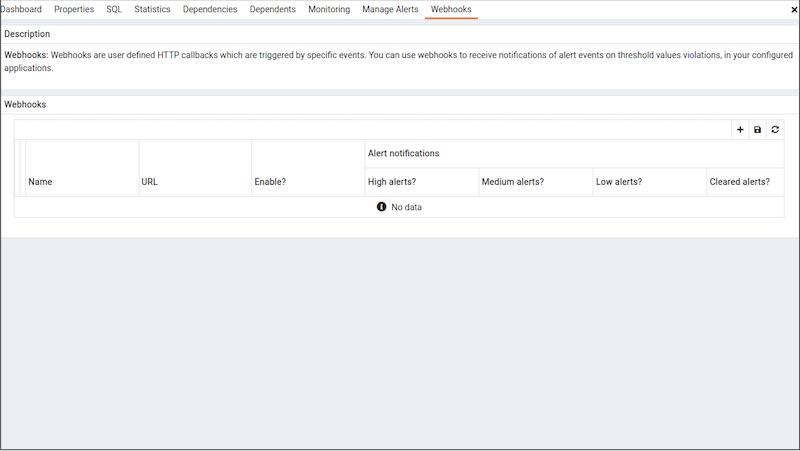

The `Webhooks` tab displays a list of the currently defined recipient applications as endpoints. Highlight an endpoint and click the edit icon (at the far left end of the row) to modify an existing endpoint.

To define a new webhook, click the `Add` icon (+) in the upper-right corner of the table.


Use the `General` tab to define the basic details of the webhook:

-   Provide a name for the webhook in the `Name` field.
-   Specify a webhook URL where all the notifications will be delivered in the `URL` field.
-   Set the request method type used to make the call in the `Request Method` field i.e. `POST` or `PUT`.
-   By default `webhooks` will be enabled; to disable a webhook set `Enable?` to `No`.

!!! Note
    The above `Enable?` setting will work only if `enable_webhook` parameter is set to true in `agent.cfg` file. By default, `enable_webhook` parameter is set to true only for the Agent running on the PEM Server Host. For all other Agents running on other hosts, it needs to be set to true manually.

#### Defining webhook SSL configurations

You can define the Webhook SSL parameters in the respective agent configuration file or registry in windows. You can find the list of Webhook SSL parameters [PEM Agent Configuration Parameters](/pem/latest/pem_agent/03_managing_pem_agent/) section. If you add or remove any of the agent configuration parameters, you must restart the agent to apply them.

-   On 32 bit Windows systems, PEM registry entries for Webhooks are located in `HKEY_LOCAL_MACHINE\\Software\\EnterpriseDB\\PEM\\agent\\WEBHOOK`
-   On 64 bit Windows systems, PEM registry entries for Webhooks are located in `HKEY_LOCAL_MACHINE\\Software\\Wow6432Node\\EnterpriseDB\\PEM\\agent\\WEBHOOK`
-   On Linux systems, PEM configuration options for Webhooks are stored in the agent.cfg file, located (by default) in `/usr/edb/pem/agent/etc`

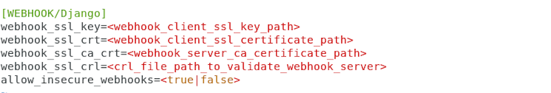

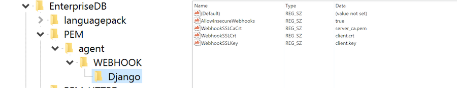

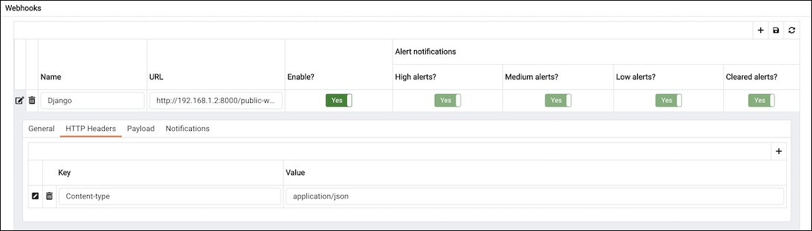

Use the `HTTP Headers` tab to define the header parameters to pass while calling the webhook endpoints:

-   All the values will be specified as a key and value pair.
-   Specify a key parameter in the `Key` field and a value in the `Value` field.
-   To add multiple `HTTP Headers`, click the `Add` icon (+) in the upper-right corner of the `HTTP Headers` table.
-   To delete the `HTTP Headers`, click on `Delete` icon to the left of the `Key`; the alert will remain in the list, but in strike-through font. Click the `Save` button to reflect the changes.
-   To edit the `HTTP Headers`, click on the `Edit` icon to the left of `Key`.


Use the `Payload` tab to define the JSON data to be sent to the endpoint when an alert is triggered:

-   `Type` specifies data to be sent in format type (i.e. JSON).

-   Use `Template` to configure JSON data sent to endpoints. Within the `Template`, you can use placeholders for the following:

    -   `%AlertID%` - the id of the triggered alert.
    -   `%AlertName%` - the name of the triggered alert.
    -   `%ObjectName%` - the name of the server or agent on which the alert was triggered.
    -   `%ObjectType%` - the type on which alert was generated.
    -   `%ThresholdValue%` - the threshold value reached by the metric when the alert triggered.
    -   `%CurrentValue%` - the current value of the metric that triggered the alert.
    -   `%CurrentState%` - the current state of the alert.
    -   `%OldState%` - the previous state of the alert.
    -   `%AlertRaisedTime%` - the time that the alert was raised, or the most recent time that the alert state was changed.
    -   `%AgentID%` - the id of the agent by which alert was generated.
    -   `%AgentName%` - the name of the agent by which alert was generated.
    -   `%ServerID%` - the id of the server on which alert was generated.
    -   `%ServerName%` - the name of the server on which alert was generated.
    -   `%ServerIP%` - the ip or address of the server on which alert was generated.
    -   `%ServerPort%` - the the port of the server on which alert was generated.
    -   `%DatabaseName%` - the name of the database on which alert was generated.
    -   `%SchemaName%` - the name of the schema on which alert was generated.
    -   `%PackageName%` - the name of the package on which alert was generated.
    -   `%DatabaseObjectName%` - the name of the database object name like table name, function name etc on which alert was generated.
    -   `%Parameters%` - the list of custom parameters used to generate the alert.
    -   `%AlertInfo%` - the detailed database object level information of the alert.

-   Click on the `Test Connection` button, to test notification delivery to the mentioned endpoint.

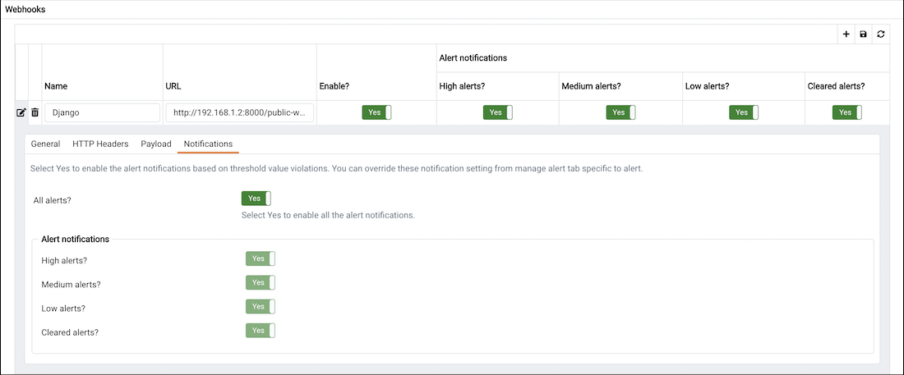

Use the `Notifications` tab to specify an alert level for webhook endpoints:

-   Set `All alerts` to `Yes` to enable all alert levels to send notifications.
-   To instruct PEM to send an notification when a specific alert level is reached, set the slider next to an alert level to `Yes`. Please note that you must set `All alerts` to `No` to configure an individual alert level.

#### Deleting a webhook

To mark a webhook for deletion, highlight the webhook name in the `Webhooks` table and click the delete icon to the left of the name; the alert will remain in the list, but in strike-through font.

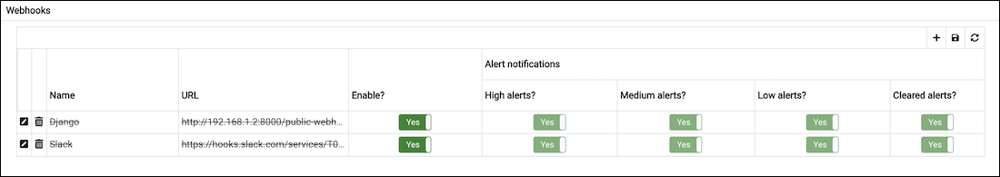

The delete icon acts as a toggle; you can undo the deletion by clicking the delete icon a second time; when you save your work (by clicking the save icon), the webhook definition will be permanently deleted.

### SNMP

Please note that you must configure the PEM Server to send the notifications to an SNMP trap/notification receiver before notifications can be sent. Set the SNMP ver to v1, v2 or v3 to identify the SNMP version.

#### Example - Configure `SNMP V3` traps with `net-snmp` trap receiver

-   Set `snmp_security_engine_id` to `PEM_SNMP_AGENT` in plain text format in the Server Configuration dialog. 

-   Then convert the plain text value to hexadecimal format in order to use it in `snmptrapd.conf` file. (Please note that you can have hexadecimal value of `snmp_security_engine_id` up to 32 octets length).
    ```text
       echo PEM_SNMP_AGENT | hexdump -v -e '/1 "%02X"'
       50454D5F534E4D505F4147454E540A
    ```

-   Set the following parameters in the Server Configuration dialog:   
    -   `snmp_security_name` to `pem_snmp_user`
    -   `snmp_authentication_protocol` to `MD5`
    -   `snmp_authentication_password` to `pem_auth_pass`
    -   `snmp_privacy_protocol` to `DES`
    -   `snmp_privacy_password` to `pem_priv_pass`

-   The `snmptrapd.conf` will have the following values:

    ```text
       createUser -e 0x50454D5F534E4D505F4147454E540A pem_snmp_user MD5 pem_auth_pass DES pem_priv_pass
       authUser log pem_snmp_user
    ```

### Using PEM with Nagios

The PEM server can send a passive alert result to Nagios network-alerting software when a user-defined alert is triggered. To instruct the PEM server to notify Nagios of a triggered alert, you must:

-   Enable Nagios notification for each alert that will trigger a notification from the PEM server to Nagios. Please note that PEM alerting must be configured before you create the host.cfg file and services.cfg file.
-   Configure Nagios-related behaviors of the PEM server.
-   Create the host.cfg and services.cfg configuration files.
-   If necessary, modify the Nagios configuration file and restart the Nagios server.
-   Install the PEM Agent on the system where Nagios server is installed and register it with the PEM Server. Set `enable_nagios` configuration to `true` in the agent.cfg for that agent, and restart the agent service.

After configuring the server to enable Nagios alerting, any triggered alerts will send a passive check result to the Nagios service. The syntax of a passive alert is:

`<timestamp> PROCESS_SERVICE_CHECK_RESULT; <host_name> ; <service_name> ; <service_status> ;`

Where:

`timestamp` is the date and time that the alert was triggered.

`host_name` is the name of the server or agent.

`service_name` is the name of the alert.

`service_status` is the numeric service status value:

0 if the service status is OK
1 if the service status is WARNING
2 if the service status is CRITICAL
3 if the service status is UNKNOWN

The PEM server uses the following rules to evaluate the service status:

-   If the PEM alert level is CLEARED, the warning message will read OK.
-   If the PEM alert level is LOW, the warning message will read WARNING.
-   If the `is_nagios_medium_alert_as_critical` flag (specified in the PEM server configuration dialog) is set to FALSE and the alert level MEDIUM, the warning message will read WARNING.
-   If the `is_nagios_medium_alert_as_critical` flag (specified in the PEM server configuration dialog) is set to TRUE and the alert level is MEDIUM, the warning message will read CRITICAL.
-   If the PEM alert level is `HIGH`, the warning message will read `CRITICAL`.

#### Enabling Nagios notification for an alert

The PEM server maintains a unique set of notification properties for each enabled alert. Use the `Notification` tab of the `Manage Alerts` tab to specify that (when triggered), a given alert will send an alert notice to Nagios.

To modify the notification properties of an alert, right-click on the name of the object monitored by the alert, and select `Manage Alerts...` from the `Management` menu. When the `Manage Alerts` tab opens, locate the alert, and then click the edit button to the left of the alert name in the `Alerts` list. When the edit pane opens, select the `Notification` tab.

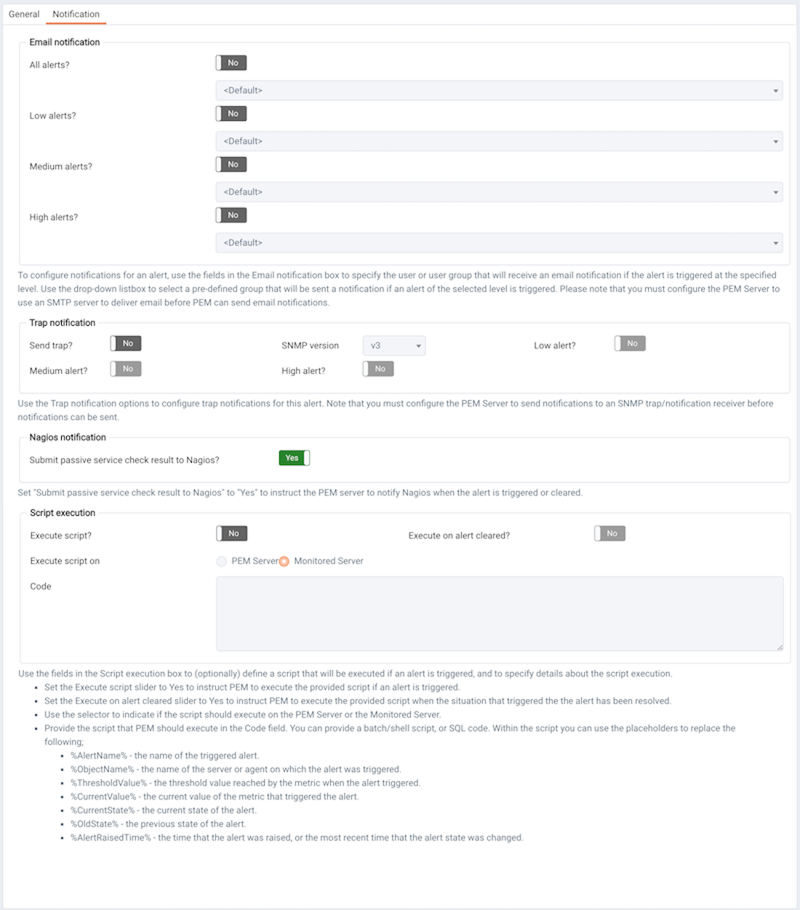

To enable Nagios notification, move the slider next to `Submit passive service check result` to Nagios to `Yes`; before exiting the `Manage Alerts` tab, click the save icon to preserve your changes.

#### Configuring Nagios-related behavior of the PEM Server

You can use the `Server Configuration` dialog to provide information about your Nagios configuration to the PEM server. To open `Server Configuration` dialog, select `Server Configuration...` from the PEM client's `Management` menu.

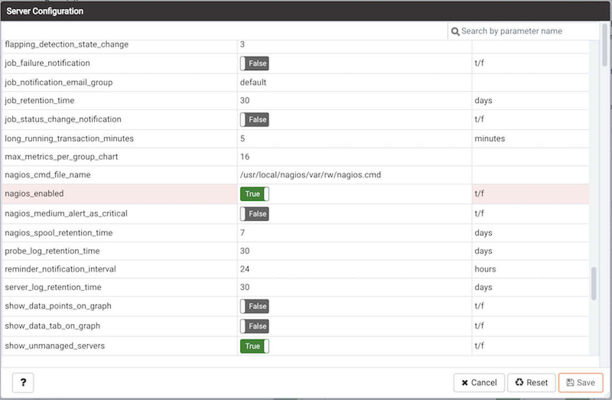

Four server configuration parameters specify information about your Nagios installation and PEM server behavior related to Nagios:

-   Use the `nagios_cmd_file_name` parameter to specify the location of the Nagios pipeline file that will receive passive check alerts from PEM. The default value of this parameter is `/usr/local/nagios/var/rw/nagios.cmd`. If your `nagios.cmd` file resides in an alternate location, specify the file location in the Value field.

-   Move the slider in the `nagios_enabled` parameter to `Yes` to instruct the PEM server to send passive check alerts to Nagios.

-   Use the `nagios_medium_alert_as_critical` slider to specify the warning severity that the PEM server will pass to Nagios if a medium alert is triggered:

    If the `is_nagios_medium_alert_as_critical` flag is set to FALSE and the alert level is MEDIUM, the warning message will read WARNING.

    If the `is_nagios_medium_alert_as_critical` flag is set to TRUE and the alert level is MEDIUM, the warning message will read CRITICAL.

-   Use the `nagios_spool_retention_time` parameter to specify the number of days of notification history that will be stored on the PEM server. The default value is 7 days.

After modifying parameter values, click the save icon (in the upper-right corner of the `Server Configuration` dialog) to preserve your changes.

#### Creating the hosts.cfg and services.cfg file

The `templates.cfg` file (by default, located in `/usr/local/nagios/etc/objects`) specifies the properties of a generic-host and generic-service. The properties specify the parameters used in the `hosts.cfg` and `services.cfg` files.

In most cases (when PEM is installed in a default configuration), you will not be required to modify the `templates.cfg` file before creating the `hosts.cfg` and `services.cfg` files. If necessary, you can modify the `templates.cfg` file to specify alternate values for parameters or to create new templates.

Before modifying the Nagios configuration file, use the following command to create a `hosts.cfg` file that contains information about the PEM hosts that reside on the local system:

`psql -U postgres -p 5433 -d pem -A -t -c "select pem.create_nagios_host_config('generic-host')" > /usr/local/nagios/etc/objects/hosts.cfg`

Then, use the following command to create a `services.cfg` file that contains information about the PEM services that reside on the local system:

`psql -U postgres -p 5433 -d pem -A -t -c "select pem.create_nagios_service_config('generic-service')" > /usr/local/nagios/etc/objects/services.cfg`

If you wish to use a `custom template.cfg` file entry, specify the entry name in place of generic-host or generic-service in the above commands.

#### Modifying the Nagios configuration file

After creating the `host.cfg` and `services.cfg` files, you must specify their location in the Nagios configuration file (by default, `/usr/local/nagios/etc/nagios.cfg`). Modify the configuration file, adding entries that specify the location of the files:

`cfg_file=/usr/local/etc/objects/hosts.cfg`

`cfg_file=/usr/local/etc/objects/services.cfg`

You can use the following command to confirm that Nagios is properly configured:

`/usr/local/nagios/bin/nagios -v /usr/local/nagios/etc/nagios.cfg`

After confirming that Nagios is configured correctly, restart the Nagios service:

`/usr/local/nagios/bin/nagios -d /usr/local/nagios/etc/nagios.cfg`
