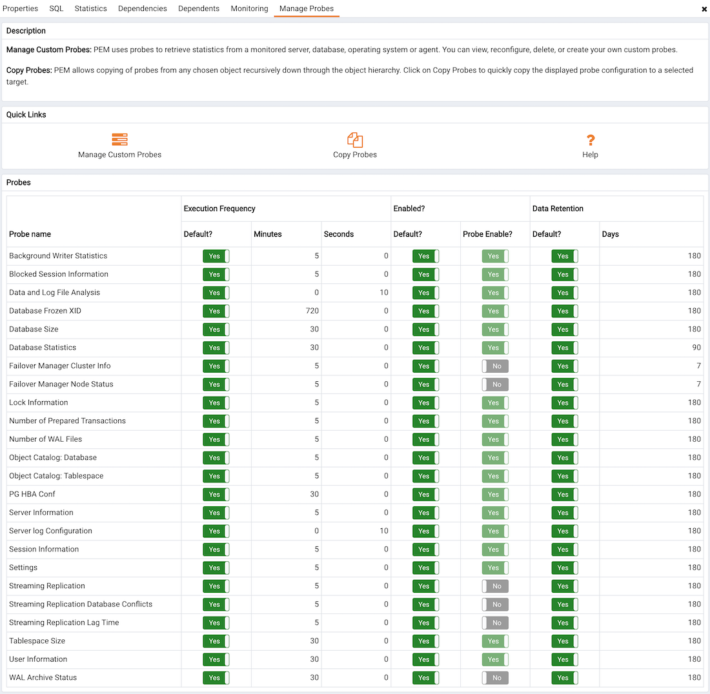
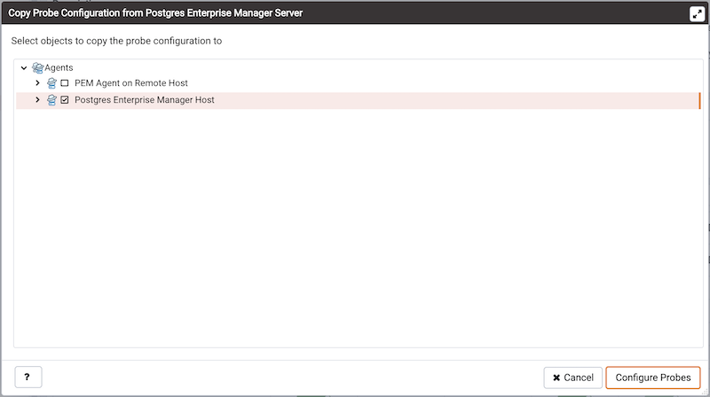

## Probes

A `probe` is a scheduled task that retrieves information about the database objects that are being monitored by the PEM agent. PEM uses the collected information to build the graphs displayed on each homepage. The `Manage Probes` tab (accessed via the `Management` menu) allows you to modify the data collection schedule and the length of time that PEM will retain information returned by a specific probe.

### System probes

Unless otherwise noted, Postgres Enterprise Manager enables the following probes at the server, database, schema, extension (starting with version 8.4), or agent levels:

| Probe Name                               | Information Monitored by Probe                                                                                                                                                                                                                                                                                                                                                                                                                                                                                                                       | Level    |
| ---------------------------------------- | ---------------------------------------------------------------------------------------------------------------------------------------------------------------------------------------------------------------------------------------------------------------------------------------------------------------------------------------------------------------------------------------------------------------------------------------------------------------------------------------------------------------------------------------------------- | -------- |
| Background Writer Statistics             | This probe monitors information about the background writer. The information includes: The number of timed checkpoints The number of requested checkpoints The number of buffers written (by checkpoint) The number of buffers written (by background writer) The number of background writer cycles The number of background buffers written The number of buffers allocated                                                                                                                                            | Server   |
| Barman Configuration                     | This probe returns information about the Barman tool global configuration.                                                                                                                                                                                                                                                                                                                                                                                                                                                                                                                                                                                                                                                         | Agent                    |
| Barman Information                       | This probe returns information about the Barman tool.                                                                                                                                                                                                                                                                                                                                                                                                                                                                                                                                                                                                                                                                              | Agent                    |
| Barman Server                            | This probe returns information about the respective database server configuration monitored by Barman.                                                                                                                                                                                                                                                                                                                                                                                                                                                                                                                                                                                                                             | Agent                    |
| Barman Server Status                     | This probe returns information about the respective database server status monitored by Barman.                                                                                                                                                                                                                                                                                                                                                                                                                                                                                                                                                                                                                                    | Agent                    |
| Barman Server Backup                     | This probe returns information about the backups of the respective database servers.                                                                                                                                                                                                                                                                                                                                                                                                                                                                                                                                                                                                                                               | Agent                    |
| Barman Server WAL Status                 | This probe returns information about the Barman server WAL files.                                                                                                                                                                                                                                                                                                                                                                                                                                                                                                                                                                                                                                                                  | Agent                    |
| Blocked Session Information              | This probe provides information about blocked sessions.                                                                                                                                                                                                                                                                                                                                                                                                                                                                                              | Server   |
| CPU Usage                                | This probe monitors CPU Usage information.                                                                                                                                                                                                                                                                                                                                                                                                                                                                                                           | Agent    |
| Data and Log File Analysis               | This probe monitors information about log files. The information includes: The name of the log file The directory in which the log file resides                                                                                                                                                                                                                                                                                                                                                                                              | Server   |
| Database Frozen XID                      | This probe monitors the frozen XID of each database.                                                                                                                                                                                                                                                                                                                                                                                                                                                                                                 | Server   |
| Database Size                            | This probe monitors information about the size of the monitored databases.The information includes: The time the information was gathered The database name The database size (in MB's).                                                                                                                                                                                                                                                                                                                                                 | Server   |
| Database Statistics                      | This probe monitors database statistics. The information includes: The number of backends The number of transactions committed The number of transactions rolled back The number of blocks read The number of blocks hit The number of rows returned The number of rows fetched The number of rows inserted The number of rows updated The number of rows deleted                                                                                                                                            | Server   |
| Disk Busy Info                           | This probe monitors information about disk activity. Note: This probe is not supported on Mac OS X, Solaris or HP-UX                                                                                                                                                                                                                                                                                                                                                                                                                             | Agent    |
| Disk Space                               | This probe monitors information about disk space usage. The information includes: The amount of disk space used The amount of disk space available                                                                                                                                                                                                                                                                                                                                                                                           | Agent    |
| EDB Audit Configuration                  | This probe monitors the audit logging configuration of EDB Postgres Advanced Server.                                                                                                                                                                                                                                                                                                                                                                                                                                                                 | Server   |
| Failover Manager Cluster Info            | This probe monitors a Failover Manager cluster, returning information about the cluster. This probe is disabled unless a cluster name and path of the Failover Manager binary is provided on the Server Properties dialog.                                                                                                                                                                                                                                                                                                                           | Server   |
| Failover Manager Node Status             | This probe monitors a Failover Manager cluster, returning detailed about each node within the cluster. This probe is disabled unless a cluster name and path of the Failover Manager binary is provided on the Server Properties dialog.                                                                                                                                                                                                                                                                                                             | Server   |
| Function Statistics                      | This probe monitors a database, retrieving information about functions. The information includes: Function names Argument types Return values                                                                                                                                                                                                                                                                                                                                                                                            | Database |
| Index Size                               | This probe monitors a database, retrieving information about indexes. The information includes: The name of the index The time the data was gathered The size of the index (in MB's)                                                                                                                                                                                                                                                                                                                                                     | Database |
| Index Statistics                         | This probe monitors index statistics. The information includes: The number of index scans The number of rows read The number of rows fetched The number of blocks read The number of blocks hit                                                                                                                                                                                                                                                                                                                                  | Database |
| Installed Packages                       | This probe monitors the packages that are currently installed. The information gathered includes: The name of the installed package The version of the installed package The date and time that the probe executed                                                                                                                                                                                                                                                                                                                       | Agent    |
| IO Analysis                              | This probe monitors disk I/O information in. The information includes: The number of blocks read The number of blocks written The date and time that the probe executed Note: This probe is not supported on Mac OS X                                                                                                                                                                                                                                                                                                                | Agent    |
| Load Average                             | This probe monitors CPU load averages. The information includes: The 1-minute load average The 5-minute load average The 15-minute load average Note: This probe is not supported on Windows                                                                                                                                                                                                                                                                                                                                         | Agent    |
| Lock Information                         | This probe monitors lock information. The information includes: The database name The lock type The lock mode The process holding the lock                                                                                                                                                                                                                                                                                                                                                                                           | Server   |
| Memory Usage                             | This probe monitors information about system memory usage.The information includes: Total RAM in MB Free RAM in MB Total swap memory in MB Free swap memory in MB Shared system memory in MB(It is used by tuning wizard to tune the memory parameters for the database server) - On non-windows system, it is `shmmax` value and read from `/proc/sys/kernel/shmmax`. - On windows, it is same as total memory.                                                                                                         | Agent    |
| Network Statistics                       | This probe monitors network statistics. The information includes: The interface IP address The number of packets sent The number of packets received The number of bytes sent The number of bytes received The link speed (in MB/second)                                                                                                                                                                                                                                                                                     | Agent    |
| Number of Prepared Transactions          | This probe stores the number of prepared transactions.                                                                                                                                                                                                                                                                                                                                                                                                                                                                                               | Server   |
| Number of WAL Files                      | This probe monitors the number of WAL files.                                                                                                                                                                                                                                                                                                                                                                                                                                                                                                         | Server   |
| Object Catalog: Database                 | This probe monitors a list of databases and their properties The information includes: The database name The database encoding type If the database allows user connections or system connections                                                                                                                                                                                                                                                                                                                                        | Server   |
| Object Catalog: Foreign Key              | This probe monitors a list of foreign keys and their properties. The information includes: The name of the table that contains the foreign key The name of the table that the foreign key references The name of the database in which the table resides The name of the schema in which the table resides                                                                                                                                                                                                                           | Schema   |
| Object Catalog: Function                 | This probe monitors a list of functions and their properties. The information includes: The name of the function The name of the schema in which the function resides The name of the database in which the function resides                                                                                                                                                                                                                                                                                                             | Schema   |
| Object Catalog: Index                    | This probe monitors a list of indexes and their properties. The information includes: The name of the index The name of the table that the index is associated with The name of the database in which the indexed table resides                                                                                                                                                                                                                                                                                                          | Schema   |
| Object Catalog: Schema                   | This probe monitors a list of schemas and their associated databases and servers.                                                                                                                                                                                                                                                                                                                                                                                                                                                                    | Database |
| Object Catalog: Sequence                 | This probe monitors a list of sequences and their properties.                                                                                                                                                                                                                                                                                                                                                                                                                                                                                        | Schema   |
| Object Catalog: Table                    | This probe monitors a list of table information. The information includes: The table name The name of the schema in which the table resides The name of the database in which the schema resides A Boolean indicator that indicates if the table has a primary key                                                                                                                                                                                                                                                                   | Schema   |
| Object Catalog: Tablespace               | This probe monitors a list of tablespaces.                                                                                                                                                                                                                                                                                                                                                                                                                                                                                                           | Server   |
| Operating System Information             | This probe monitors the operating system details and boot time.                                                                                                                                                                                                                                                                                                                                                                                                                                                                                      | Agent    |
| Package Catalog                          | This probe monitors the packages that are currently available for installation. The information gathered includes: The package name The package version                                                                                                                                                                                                                                                                                                                                                                                      | Agent    |
| PG HBA Conf                              | This probe monitors authentication configuration information from the pg_hba.conf file.                                                                                                                                                                                                                                                                                                                                                                                                                                                              | Server   |
| Server Information                       | This probe monitors server information.                                                                                                                                                                                                                                                                                                                                                                                                                                                                                                              | Server   |
| Session Information                      | This probe monitors session information. The information includes: The name of the session user The date and time that the session connected to the server The status of the session at the time that the information was gathered (idle, waiting, etc) The client address and port number                                                                                                                                                                                                                                           | Server   |
| Settings                                 | This probe monitors the values currently assigned to GUC variables.                                                                                                                                                                                                                                                                                                                                                                                                                                                                                  | Server   |
| SQL Protect                              | This probe monitors a server, retrieving information about SQL injection attacks.                                                                                                                                                                                                                                                                                                                                                                                                                                                                    | Server   |
| Slony Replication                        | This probe monitors lag data for clusters replicated using Slony.                                                                                                                                                                                                                                                                                                                                                                                                                                                                                    | Database |
| Streaming Replication                    | This probe monitors a cluster that is using streaming replication, retrieving information about: The sent Xlog location (in bytes) The write Xlog location (in bytes) The flush Xlog location (in bytes) The replay Xlog location (in bytes) The Xlog lag (in segments) The Xlog lag (in pages)                                                                                                                                                                                                                              | Server   |
| Streaming Replication Lag Time           | This probe monitors a cluster that is using streaming replication, retrieving lag information about: Replication lag time (in seconds) Current status of replication (running/paused)                                                                                                                                                                                                                                                                                                                                                        | Server   |
| Streaming Replication Database Conflicts | This probe monitors a database that is using streaming replication, retrieving information about any conflicts that arise. This includes information about queries that have been canceled due to: The # of drop tablespace conflicts The # of lock timeout conflicts The # of old snapshot conflicts The # of pinned buffer conflicts The # of deadlock conflicts                                                                                                                                                               | Server   |
| Table Bloat                              | This probe monitors information about the current table bloat. The information includes: The name of the table The name of the schema in which the table resides The estimated number of pages The estimated number of wasted pages The estimated number of bytes per row                                                                                                                                                                                                                                                        | Database |
| Table Frozen XID                         | This probe monitors the frozen XID of each table.                                                                                                                                                                                                                                                                                                                                                                                                                                                                                                    | Schema   |
| Table Size                               | This probe monitors information about table size. The information includes: Table size (in MB's) Total index size (in MB's) Total table size, with indexes and TOAST (in MB's)                                                                                                                                                                                                                                                                                                                                                           | Database |
| Table Statistics                         | This probe monitors table statistics. The information includes: The number of sequential scans The number of sequential scan rows The number of index scans The number of index scan rows The number of rows inserted The number of rows updated The number of rows deleted The number of live rows The number of dead rows The last VACUUM The last auto-vacuum The last ANALYZE The last auto-analyze The number of pages estimated by ANALYZE The number of rows estimated by ANALYZE | Database |
| Tablespace Size                          | This probe monitors a list of tablespaces and their sizes.                                                                                                                                                                                                                                                                                                                                                                                                                                                                                           | Server   |
| User Information                         | This probe monitors a list of the current users. The stored information includes: The user name The user type (superuser vs. non-superuser) The server to which the user is connected                                                                                                                                                                                                                                                                                                                                                    | Server   |
| WAL Archive Status                       | This probe monitors the status of the WAL archive. The stored information includes: The # of WAL archives done The # of WAL archives pending The last archive time The # of WAL archives failed The time of the last failure                                                                                                                                                                                                                                                                                                     | Server   |
| xDB Replication                          | This probe monitors lag data for clusters replicated using xDB replication.                                                                                                                                                                                                                                                                                                                                                                                                                                                                          | Database |

### BDR probes

To monitor the BDR Group via BDR dashboards, the following probes must be enabled. All these probes are configured at extension level.

!!! Note
    Prior to version 8.4, all these probes are available at the server level.

The user with `bdr_superuser` will be able to view information from all the following probes.

All the following probes works with `BDR Enterprise Edition`.

| Probe Name                         | Information Monitored by Probe                                                                                                                                                                                                                                                                                                                                                                                                                                                                                                                                                                                                                                                                                                                    | `bdr_monitor` role required? | Works with BDR SE? |
| ---------------------------------- | ------------------------------------------------------------------------------------------------------------------------------------------------------------------------------------------------------------------------------------------------------------------------------------------------------------------------------------------------------------------------------------------------------------------------------------------------------------------------------------------------------------------------------------------------------------------------------------------------------------------------------------------------------------------------------------------------------------------------------------------------- | ---------------------------- | ------------------ |
| BDR Conflict History Summary       | This probe returns information about row conflicts per conflict type. The stored information inlcudes: The local time of the conflict  The type of the conflict                                                                                                                                                                                                                                                                                                                                                                                                                                                                                                                                                                           | Yes                          | Yes                |
| BDR Global Locks                   | This probe returns information about global locks in a BDR Group. The stored information includes:  The name of the node where the global lock has originated The PID of the process holding the lock The type of lock (DDL or DML) The name of the locked relation(for DML Locks) or Keys(for advisory locks) The internal state of the lock acquistion process The list of backends waiting for the same global lock The time when the global lock acquire was initiated by origin node The time when the local node started trying to acquire the local lock The time acquire_stage last changed                                                                                                           | Yes                          | Yes                |
| BDR Group Camo Details             | This probe returns information about Camo's in BDR Group. The stored information includes: The name of the node The node name for whom this node is partner The node name for whom this node is origin The connection status The readiness status The number of pending or unresolved camo transactions The lsn of last applied wal log The lsn of last received wal log                                                                                                                                                                                                                                                                                                                                          | No                           | No                 |
| BDR Group Replication Slot Details | This probe returns information about replication slots in BDR Group. The stored information includes: The name of the BDR Group The name of the origin node The name of the target node The slot name on the origin node used by this subscription The active status The state of the replication (catchup,streaming,disconnected,..) The approximate lag time for reported write  The approximate lag time for reported flush The approximate lag time for reported replay The bytes difference between sent_lsn and current WAL write position The bytes difference between write_lsn and current WAL write position The bytes difference between flush_lsn and current WAL write position  | No                           | Yes                |
| BDR Group Subscription Summary     | This probe returns information about the summary of Subscriptions in the BDR Group. The stored information includes:  The name of the origin of the subscription The name of the target of the subscription The timestamp of the last replayed transaction The lag between now and time of last replayed transaction                                                                                                                                                                                                                                                                                                                                                                                                          | No                           | Yes                |
| BDR Monitor Group Raft             | This probe returns the status and message of a cluster-wide raft check.                                                                                                                                                                                                                                                                                                                                                                                                                                                                                                                                                                                                                                                                           | Yes                          | Yes                |
| BDR Group Raft Details             | This probe returns the information about raft consensus status from all the nodes in BDR Group. The stored information includes:  The name of the node The raft worker state on the node The node id of the RAFT_LEADER The raft election internal id The raft snapshot internal id                                                                                                                                                                                                                                                                                                                                                                                                                                           | Yes                          | Yes                |
| BDR Monitor Group Versions         | This prove returns the status and message of cluster-wide version check.                                                                                                                                                                                                                                                                                                                                                                                                                                                                                                                                                                                                                                                                          | Yes                          | Yes                |
| BDR Group Versions Details         | This probe returns the information about version details of the installed postgres, pglogical, bdr, and bdr edition for each node in the BDR Group. The stored information includes:  The name of the node The installed postgres version on the node The installed pglogical version on the node  The version of the BDR on the node The BDR edition (Standard/Enterprise)                                                                                                                                                                                                                                                                                                                                                   | No                           | Yes                |
| BDR Node Replication Rates         | This probe returns information about outgoing replication activity from a given node. The stored information includes: The name of the target peer node The latest sent position The latest position reported as replayed The approximate lag time for reported replay The bytes difference between replay_lsn and current WAL write position on origin The human readable bytes difference between replay_lsn and current WAL write position Approximate time required for the peer node to catchup to all the changes that are yet to be applied                                                                                                                                                                    | Yes                          | No                 |
| BDR Node Slots                     | This probe returns information about the mapping of local BDR nodes to replication slots, their status, and replication progress. The stored information includes: The name of the slot The name of the target node The name of the BDR Group The database name on the target node The PID of the process attached to the slot  The catalog XID needed by the slot The IP address of the client connection The latest sent position The latest position reported as replayed The approximate lag time for reported replay The Bytes difference between replay_lsn and current WAL write position The Human-readable bytes difference between replay_lsn and current WAL write position            | Yes                          | Yes                |
| BDR Node Summary                   | This probe returns information about all the nodes in the BDR Group. The stored information includes: The name of the Node The name of the BDR group the node is part of The consistent state of the node in human readable form The state which the node is trying to reach (during join or promotion) The name of subscribed repsets                                                                                                                                                                                                                                                                                                                                                                                        | Yes                          | Yes                |
| BDR Workers                        | This probe returns information about workers in BDR node. The stored information includes: The PID of the worker process The worker query start timestamp The worker state change timestamp The worker wait event type The worker wait event The worker state The worker role name The worker commit timestamp The worker local timestamp The name of the origin node The receive LSN The receive commit LSN The last exact replay LSN The last exact flush LSN The last exact replay timestamp The worker query                                                                                                                                                                  | Yes                          | Yes                |
| BDR Work Errors                    | This probe returns information aboutthe work errors in BDR node. The stored information includes: The process id of the worker causing the error The name of the BDR Group the node is part of The name of the origin node  The name of the source node  The name of the target node The name of the subscription The internal identifier of the role of this worker The name of the role of this worker The date and time of the error The age of the error The description of the error he context in which the error happened The remote relation id The subscription writer id The subscription writer name                                                                   | Yes                          | Yes                |

### Customizing probes

A probe is a scheduled task that returns a set of performance metrics about a specific monitored object. A probe retrieves statistics from a monitored server, database, operating system or agent. You can use the `Manage Probes` tab to override the default configuration and customize the behavior of each probe.

To open the `Manage Probes` tab, select `Manage Probes...` from the `Management` menu. The `Manage Probes` tab opens in the PEM client.

The `Manage Probes` tab provides a set of Quick Links that you can use to create and manage probes:

-   Click the `Manage Custom Probes` icon to open the `Custom Probes` tab and create or modify a custom probe.
-   Click the `Copy Probes` icon to open the Copy Probe dialog, and copy the probe configurations from the currently selected object to one or more monitored objects.

!!! Note
    At the moment the `Copy Probe` is not supported for the extension level probes.

A probe monitors a unique set of metrics for each specific object type (server, database, database object, or agent); select the name of an object in the tree control to review the probes for that object.

To modify the properties associated with a probe, highlight the name of a probe, and customize the settings that are displayed in the Probes table:

-   Move the `Default` switch in the `Execution Frequency` columns to `N` to enable the Minutes and Seconds selectors, and specify a non-default value for the length of time between executions of the probe.
-   Move the `Default` switch in the `Enabled?` column to `No` to change the state of the probe, and indicate if the probe is active or not active.

!!! Note
    If data from a disabled probe is used in a chart, the chart will display an information icon in the upper-left corner that allows you to enable the probe by clicking the provided link.

-   Move the `Default` switch in the `Data Retention` column to `No` to enable the Day(s) field and specify the number of days that information gathered by the probe is stored on the PEM server.

The `Manage Probes` tab may display information about probes that cannot be modified from the current node. If a probe cannot be modified from the current dialog, the switches are disabled. Generally, a disabled probe can be modified from a node that is higher in the hierarchy of the PEM client tree control; select another object in the tree control to modify which probes are displayed or enabled in the `Manage Probes` tab.

#### Creating a custom probe

You can use the `PEM Custom Probes` tab to create a new probe or modify an existing user-defined probe. To open the `Custom Probes` tab, select the `Manage Custom Probes...` icon from the `Manage Probes` tab.

Use the `Show System Probes?` switch to display or conceal the system probes on the `Custom Probes` tab.

You can use the `Custom Probes` tab to create a new probe or modify an existing probe. To create a new probe, click the `Add` icon in the upper-right corner of the tab; provide a name for the new probe in the `Probe Name` column. Then, select the `Edit` icon (located to the left of the probe name) to review or add the probe definition.

Use the fields on the `General` tab to modify the definition of an existing probe or to specify the properties of a new probe:

-   Use the `Probe Name` field to provide a name for a new probe.

-   Use the `Collection method` field to specify the probe type. Use the drop-down listbox to select:

    -   SQL - the probe will gather information via a SQL statement.
    -   WMI - the probe will gather information via a Windows Management Instrumentation extension.
    -   Batch - the probe will use a command-script or shell-script to gather information.

    Before creating a batch probe on a Linux system, you must modify the `agent.cfg` file, setting the `allow_batch_probes` parameter equal to `true`, and restart the PEM agent. The `agent.cfg` file is located in one of the following directories:

    -   If you have installed PEM using graphical installer: `/opt/edb/pem/agent/etc/agent.cfg`
    -   If you have installed PEM using RPM: `/usr/edb/pem/agent/etc/agent.cfg`

    On 64-bit Windows systems, agent settings are stored in the registry. Before creating a batch probe, modify the registry entry for the `AllowBatchProbes` registry entry and restart the PEM agent. PEM registry entries are located in `HKEY_LOCAL_MACHINE\Software\Wow6432Node\EnterpriseDB\PEM\agent`.

    Please note that batch probes are platform-specific. If you specify a collection method of Batch, you must specify a platform type in the Platform field.

    To invoke a script on a Linux system, you must modify the entry for `batch_script_user` parameter of `agent.cfg` file and specify the user that should be used to run the script. You can either specify a non-root user or root for this parameter. If you do not specify a user, or the specified user does not exist, then the script will not be executed. Restart the agent after modifying the file.

    To invoke a script on a Windows system, set the registry entry for `AllowBatchJobSteps` to true and restart the PEM agent.

-   Use the `Target Type` drop-down listbox to select the object type that the probe will monitor. Target type is disabled if Collection method is WMI.

-   Use the `Minutes` and `Seconds` selectors to specify how often the probe will collect data.

-   Use the `Probe Enable?` switch to specify if the probe in enabled by default. Specify Yes to enable the probe by default, or No to specify that the probe is disabled by default.

!!! Note
    If data from a disabled probe is used in a chart, the chart will display an information icon in the upper-left corner that allows you to enable the probe by clicking the provided link.

-   Use the `Data Retention` field to specify the number of days that gathered information will be retained in the probe's history table.
-   Use the switch next to `Discard from history` to specify if the server should create a history table for the probe. Select `Yes` to discard probe history, or `No` to retain the probe history in a table.
-   Use the `Platform` drop-down listbox to specify the type of platform that the probe will monitor. This field is enabled only when the Collection method is Batch.

Use the `Columns` tab to define the columns in which the probe data will be stored. Navigate to the `Columns` tab, and click the `Add` button (in the upper-right corner) to define a new column. After a providing a column name in the `Name` field, click the `Edit` button (to the left of the new column name) to provide information about the column:

-   Provide a descriptive name for the column in the `Name` field.

-   The `Internal Name` field is not enabled for user-defined probes.

-   Use the `Column Type` drop-down listbox to specify if the column is a Key column (a primary key) or a Non key column. Non-key columns are generally metric items (values that can be graphed).

-   Use the `Data Type` drop-down listbox to specify the type of data that will be stored in the column.

-   Use the `Unit` field to specify the unit of measure that applies to the metric stored in the column. This unit is displayed on the Y-Axis of a custom chart or a Capacity Manager chart. This is an optional field.

-   Use the `Graphable` switch to specify if the defined metric may be graphed, and that the probe should be accessible from the Capacity Manager or Manage Charts dialogs.

-   Use the `Is PIT` switch to specify if the metric should be stored by point-in-time.

    'Point-in-time' metrics are those metrics that change (increase or decrease) at any given point of time. For example, database size is a point-in-time metric; at any given point-in-time, the size of the database is fluctuating. Metrics that are not point-in-time (also referred to as cumulative metrics) are metrics whose size always increases over time. For example, Blocks Read and Tuples Read are cumulative metrics; the value stays the same or increases.

-   Use the `Calculate PIT` switch to specify that the server should calculate a point-in-time value for the metric data. `Calculate PIT` is disabled if `Is PIT` is `Yes`.

    PEM allows you to store point-in time-values of cumulative metrics as well. PEM subtracts the last collected value of a cumulative metric from the current value, and stores the difference as a point-in-time value.

Use the `Code` tab to specify the default code that will be executed by the probe:

-   If the probe is a SQL probe, you must specify the `SQL SELECT` statement invoked by the probe on the `Code` tab. The column names returned by the query must match the Internal Name specified on the `Columns` tab. The number of columns returned by the query, as well as the column name, data type, etc. must match the information specified on the `Columns` tab.

-   If the probe is a batch probe, you must specify the shell or .bat script that will be invoked when the probe runs. The output of the script should be as follows:

    The first line must contain the names of the columns provided on the `Columns` tab. Each column name should be separated by a tab (t) character. From the second line onwards, each line should contain the data for each column, separated by a tab character.

    If a specified column is defined as key column, you should ensure that the script does not produce duplicate data for that column across lines of output. The number of columns specified in the `Columns` tab and their names, data type, etc. should match with the output of the script output.

-   If the probe is a WMI probe, you must specify the WMI query as a `SELECT WMI` query. The column name referenced in the `SELECT` statement should be same as the name of the corresponding column specified on the `Column` tab. The column names returned by the query must match the `Internal Name` specified on the `Column` tab. The number of columns returned by the query, as well as the column name, data type, etc. must match the information specified on the Columns tab.

Use the `Alternate Code` tab to provide code that will be invoked if the probe fires on a specific version of the server. To provide version-specific code, move the `Applies to any server version?` switch to `No`, and click the `Add` button. Then, use the `Database Version(s)` drop-down listbox to select a version, and click the `Edit` button (to the left of the version name) to provide the code that will execute when the probe fires.

If you select a database version, and leave the `Probe Code` column blank, PEM will invoke the code specified on the `Code` tab when the probe executes on a server that matches that version.

When you've finished defining the probe, click the `Save` icon (in the corner of the `Custom Probes` tab) to save the definition, and make the probe data available for use on custom charts and graphs.

#### Exporting or importing a probe

!!! Tip "New Feature"
    Export and import of probes to another PEM Server is available from 8.2.0 and later.

To `Export` the probe, select any probe/s from the `Manage Custom Probes` tab and then select the `Export` icon in the upper-right corner of the table. Select `Save File` option and then select `ok`, it will generate the `JSON` file.

To `Import` the probe, go to the `Manage Custom Probes` tab and then select the `Import` icon in the upper-right corner of the table.

Click on the `Browse` button to select the `JSON` file with the probe code to be imported and then click `Import`.

After selecting the file to import you can select the `skip existing` checkbox. If selected then it will skip the probe if it already exists.

If the checkbox is selected and the probe already exists, then it skips importing the probe with the message as below:

If the checkbox is not selected and the probe already exists, then it does not import the probe and throws the below error:

!!! Note
    `Import` cannot overwrite the existing probe as it may be configured to retain historical data as per the configured retention policy.

If the checkbox is not selected and probe does not exist but the corresponding table in the `pem` schema exists, then it imports the probe successfully using the same table.

!!! Note
    It is possible that probe is deleted and not listed on `Manage Custom Probe` tab, but still the table holding the data of that probe exists in the `pem` schema.

#### Deleting a probe

You may delete only user-defined probes.  To delete a probe, select the probe name in the probes table, and select the `Delete` icon (located to the upper-right corner of the table).  The probe history will persist for the length of time specified on the `History Retention` field in the probe definition. During the deletion the probe definition is deleted and any corresponding tables are  dropped from the `pemdata` and `pemhistory` schemas.

System probes are the built-in probes provided by PEM, and are part of the PEM schema. You may only modify system probes; if you attempt to delete a system probe, you will receive an error from PEM.

#### Copying a probe

You can use the `Copy Probe Configuration...` dialog to copy probe definitions from one monitored object to one or more monitored objects of the same type. To open the `Copy Probe Configuration...` dialog, highlight the object from which you are copying probes in the PEM client tree control, and select `Manage Probes` from the `Management` menu. When the `Manage Probes` tab opens, click on `Copy Probe` to open the `Copy Probe Configuration` dialog:

The dialog will copy the probe definitions from the object through which the Copy Probe Configuration dialog was opened, to the location(s) selected on the tree control.

Note that if you specify a parent node in the `Copy Probe Configuration` tree control, PEM will copy the probe configurations to each object (of the same type) that resides under that node in the tree control. For example, to copy the probe definitions from one schema to all schemas that reside within a database, select only the parent database of the target schemas. Please note that a red warning symbol is displayed to the left of the name of a listed target object if that object is the source of the probe that is being copied.

When you have selected the target object or objects, click the `Configure Probes` button to copy the probe definitions to the location selected on the dialog.
