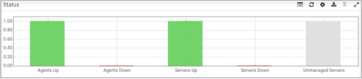

The PEM web interface is installed with the PEM server. When the server installation completes, you can open the PEM interface in your choice of browser by navigating to:

   `https://<ip_address_of_PEM_host>:8443/pem`

Where `ip_address_of_PEM_host` specifies the IP address of the host of the PEM server. The Postgres Enterprise Manager Login window opens:

Use the fields on the `Postgres Enterprise Manager Login` window to authenticate yourself with the PEM server:

-   Provide the name of a pem database user in the `Username` field. For the first user connecting, this will be the name provided when installing the PEM server.

-   Provide the password associated with the user in the `Password` field.

After providing your credentials, click `Login` to connect to PEM.

The PEM web interface opens, displaying the `Global Overview` Dashboard.

The `Browser` pane displays a tree control that provides access to information about the database objects that reside on each server. The tree control expands to display a hierarchical view of the servers and objects that are monitored by the PEM server.

## The PEM menu bar

The PEM menu bar provides access to commands and features that you can use to manage your database servers and the objects that reside on those servers. If an option is disabled:

-   The database server to which you are currently connected may not support the selected feature.

-   The selected menu option may not be valid for the current object (by design).

-   The role that you have used to connect to the server may have insufficient privileges to change the selected object.

Context-sensitive menus across the top of the PEM web interface allow you to customize your environment and provide access to the enterprise management features of PEM.

### The File menu

Use the `File` menu to access the following options:

| Menu Option          | Action                                                                                                             |
| -------------------- | ------------------------------------------------------------------------------------------------------------------ |
| Preferences          | Click to open the Preferences dialog to customize your PEM client settings.                                        |
| Lock Layout          | Click to open a sub-menu to select the level for locking the UI layout.                                            |
| Server Configuration | Click to open the Server Configuration dialog and update your PEM server configuration settings.                   |
| Reset Layout         | If a workspace panel is popped out by mistake or intentionally it can be reset back to default using Reset Layout. |

### The Object menu

The `Object` menu is context-sensitive. Use the `Object` menu to access the following options:

| Menu Option               | Action                                                                                                                                            |
| ------------------------- | ------------------------------------------------------------------------------------------------------------------------------------------------- |
| Create                    | Click `Create` to access a context menu that provides context-sensitive selections.                                                               |
| Refresh...                | Click to refresh the currently selected object.                                                                                                   |
| Delete/Drop               | Click to delete the currently selected object from the server.                                                                                    |
| Connect Server            | Click to open the Connect to Server dialog to establish a connection with a server.                                                               |
| CREATE Script             | Click to open the Query tool to edit or view the selected script.                                                                                 |
| Disconnect Server         | Click to refresh the currently selected object.                                                                                                   |
| BART                      | Click to access a context menu that provides options for removing BART configuration, taking a BART backup, or revalidate the BART configuration. |
| Clear Saved Password      | If you have saved the database server password, click to clear the saved password. Enabled only after password is saved.                          |
| Clear SSH Tunnel Password | If you have saved the ssh tunnel password, click to clear the saved password. Enabled only after password is saved.                               |
| Drop Cascade              | Click to delete the currently selected object and all dependent objects from the server.                                                          |
| Hide                      | Click to hide the currently selected group; to view hidden groups, enable the Show hidden groups option in Preferences.                           |
| Properties...             | Click to review or modify the currently selected object's properties.                                                                             |
| Trigger(s)                | Click to `Disable` or `Enable` trigger(s) for the currently selected table.                                                                       |
| Truncate                  | Click to remove all rows from a table (Truncate) or to remove all rows from a table and its child tables (Truncate Cascade).                      |
| View Data                 | Click to access a context menu that provides several options for viewing data.                                                                    |

### The Management menu

Use the `Management` menu to access the following PEM features:

| Menu Option                     | Action                                                                                                              |
| ------------------------------- | ------------------------------------------------------------------------------------------------------------------- |
| Audit Manager...                | Click to open the Audit Manager and configure auditing on your monitored servers.                                   |
| Auto Discovery...               | Click to open the Auto Discovery dialog to instruct a PEM agent to locate and bind monitored database servers.      |
| Capacity Manager...             | Click to open the Capacity Manager dialog and analyze historical or project future resource usage.                  |
| Log Manager...                  | Click to open the Log Manager dialog and configure log collection for a server.                                     |
| Manage Alerts...                | Click to access the Manage Alerts tab and create or modify alerting behavior.                                       |
| Manage Charts...                | Click to open the Manage Charts tab to create or modify PEM charts.                                                 |
| Manage Dashboards...            | Click to open the Manage Dashboards dialog to VACUUM, ANALYZE, REINDEX, or CLUSTER.                                 |
| Manage Probes...                | Click to open the Manage Probes dialog to VACUUM, ANALYZE, REINDEX, or CLUSTER.                                     |
| Postgres Expert...              | Click to open the Postgres Expert wizard and perform a static analysis of your servers and databases.               |
| Postgres Log Analysis Expert... | Click to access the Postgres Log Analysis Expert dialog analyze log file contents for usage trends.                 |
| Scheduled Tasks                 | Click to open the Scheduled Tasks tab and review tasks that are pending or recently completed.                      |
| Tuning Wizard...                | Click to open the Tuning Wizard dialog to generate a set of tuning recommendations for your server.                 |
| Reports                         | Click to open the Reports dialog to generate the system configuration report and core usage report for your server. |

### The Dashboards Menu

Use the context-sensitive `Dashboards` menu to access dashboards:

| Option                | Action                                                                            |
| --------------------- | --------------------------------------------------------------------------------- |
| Alerts                | Click to open the Alerts Dashboard for the selected node.                         |
| Audit Log             | Click to open the Audit Log Analysis Dashboard for the selected node.             |
| BDR Admin             | Click to open the BDR Admin Dashboard for the selected node.                      |
| BDR Group Monitoring  | Click to open the BDR Group Monitoring Dashboard for the selected node.           |
| BDR Node Monitoring   | Click to open the BDR Node Monitoring Dashboard for the selected node.            |
| Database Server       | Click to open the Database Analysis Dashboard for the selected node.              |
| I/O Analysis          | Click to open the I/O Analysis Dashboard for the selected node.                   |
| Memory                | Click to open the Memory Analysis Dashboard for the selected node.                |
| Object Activity       | Click to open the Object Activity Analysis Dashboard for the selected node.       |
| Operating System      | Click to open the Operating System Analysis Dashboard for the selected node.      |
| Probe Log             | Click to open the Probe Log Analysis Dashboard for the selected node.             |
| Server Log            | Click to open the Server Log Analysis Dashboard for the selected node.            |
| Session Activity      | Click to open the Session Activity Analysis Dashboard for the selected node.      |
| Storage               | Click to open the Storage Analysis Dashboard for the selected node.               |
| Streaming Replication | Click to open the Streaming Replication Analysis Dashboard for the selected node. |
| System Wait           | Click to open the System Wait Analysis Dashboard for the selected node.           |

### The Tools menu

Use the options on the `Tools` menu to access the following features:

| Option               | Action                                                                                                                                                                                                                    |
| -------------------- | ------------------------------------------------------------------------------------------------------------------------------------------------------------------------------------------------------------------------- |
| Schema Diff          | Click to open the Schema Diff dialog to compare the schema objects between two database schemas.                                                                                                                          |
| Search objects       | Click to open the Search Objects dialog to search the database objects within a database.                                                                                                                                 |
| Server               | Click to access the various server related tools such as Add Named Restore Point, Performance Diagnostics, Queue Server Startup, Queue Server Shutdown, Replace Cluster Primary, Switchover EFM Cluster and SQL Profiler. |
| Query Tool           | Click to open the Query tool for the currently selected object.                                                                                                                                                           |
| Reload Configuration | Click to update configuration files without restarting the server.                                                                                                                                                        |
| Pause replay of WAL  | Click to pause the replay of the WAL log.                                                                                                                                                                                 |
| Resume replay of WAL | Click to resume the replay of the WAL log.                                                                                                                                                                                |
| Import/Export...     | Click to open the Import/Export data... dialog to import or export data from a table.                                                                                                                                     |
| Maintenance...       | Click to open the Maintenance... dialog to VACUUM, ANALYZE, REINDEX, or CLUSTER.                                                                                                                                          |
| Backup...            | Click to open the Backup... dialog to backup database objects.                                                                                                                                                            |
| Backup Globals...    | Click to open the Backup Globals... dialog to backup cluster objects.                                                                                                                                                     |
| Backup Server...     | Click to open the Backup Server... dialog to backup a server.                                                                                                                                                             |
| Restore...           | Click to access the Restore dialog to restore database files from a backup.                                                                                                                                               |
| Grant Wizard...      | Click to access the Grant Wizard tool.                                                                                                                                                                                    |
| Schedule Backup      | Click to access the Schedule Backup dialog for BART backups.                                                                                                                                                              |

### The Help menu

Use the options on the `Help` menu to access the online help documents or to review information about the PEM installation:

| Option                            | Action                                                                           |
| --------------------------------- | -------------------------------------------------------------------------------- |
| Online Help                       | Click to open documentation for Postgres Enterprise Manager.                     |
| REST API Reference                | Click to open the REST API Reference.                                            |
| EDB Website                       | Click to open the EDB website in a browser window.                               |
| About Postgres Enterprise Manager | Click to locate versioning and user information for Postgres Enterprise Manager. |

## Controlling and customizing charts, graphs and tables

Use the icons in the upper-right corner of each graphic on a dashboard to control and customize the charts, graphs and tables displayed in the PEM client for your current user session.

The following table gives the information about icons:

| Icons                                    | Information                                                           |
| ---------------------------------------- | --------------------------------------------------------------------- |
|  | View information about the chart, graph, or table.                    |
|      | Refresh the content of a chart, graph or table.                       |
|  | Personalize the chart, graph, or table settings for the current user. |
|     | Download an image of the chart or graph.                              |
|  | View the legends that are used in the chart, graph, or table.         |
|   | Expand the chart or graph to full-screen.                             |

For more information about customizing the graphics displayed on the PEM dashboards, please see the PEM client online help.

## Online help and documentation

PEM contains built-in help that provides assistance in using the tool. To access the online help for PEM, select `Online Help` from the `Help` option on the `Help` menu.

The `Help` menu also provides quick access to the EDB website.
