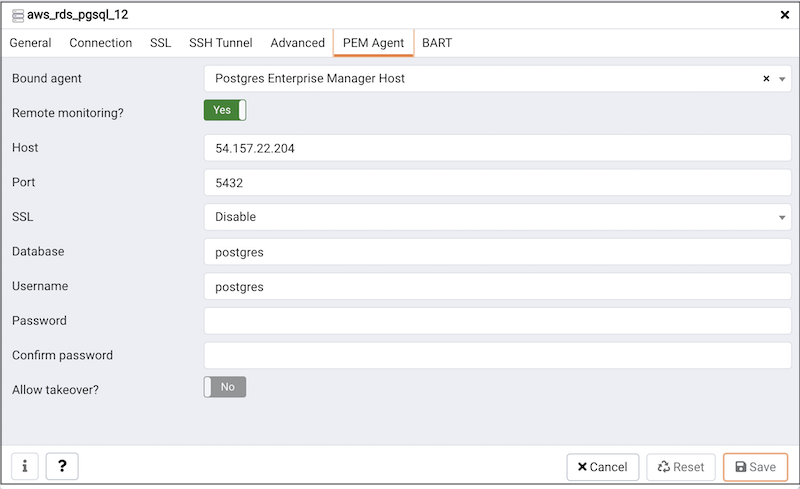

To monitor EDB Cloud running on Azure using PEM:

1.  Create an `EDB Cloud` account on Azure. For more details visit [EDB Cloud Documentation](https://www.enterprisedb.com/docs/edbcloud/latest/getting_started/).
 
1.  Register your `EDB Cloud Cluster` on your PEM Server:

    After creating the `EDB Cloud` account on Azure, use `Create - Server` dialog to add your `EDB Cloud Cluster` to the PEM Server. Using this dialog you can describe a new server connection, bind the server to a PEM Agent, and display the server to the PEM browser tree control.

    For detailed information on the `Create - Server` dialog and configuration details for each tab, see [Registering a Server](02_registering_server/#registering_server).

    The `PEM Agent` tab in the `Create - Server` dialog must have the `Remote Monitoring` field set to `Yes` to monitor the `EDB Cloud` on Azure using PEM Server.

    

    As the PEM Agent will be monitoring the `EDB Cloud` remotely, the functionality will be limited as described below:

    | Feature Name                 | Works with remote PEM Agent | Comments                                                                                                                                                                              |
    | ---------------------------- | --------------------------- | ------------------------------------------------------------------------------------------------------------------------------------------------------------------------------------- |
    | Audit Manager                | No                          |                                                                                                                                                                                       |
    | Capacity Manager             | Limited                     | There will be no correlation between the database server and operating system metrices.                                                                                               |
    | Log Manager                  | No                          |                                                                                                                                                                                       |
    | Manage Alerts                | Limited                     | When you run an alert script on the database server, it will run on the machine where the bound PEM Agent is running, and not on the actual database server machine.                  |
    | Manage Charts                | Yes                         |                                                                                                                                                                                       |
    | Manage Dashboards            | Limited                     | Some dashboards may not be able to show complete data. For example, the operating system information of the database server will not be displayed as it is not available.             |
    | Manage Probes                | Limited                     | Some of the PEM probes will not return information, and some of the functionalities may be affected. For details about probe functionality, see the [PEM Agent Guide](../pem_agent/). |
    | Postgres Expert              | Limited                     | The Postgres Expert will provide partial information as operating system information is not available.                                                                                |
    | Postgres Log Analysis Expert | No                          | The Postgres Log Analysis Expert will not be able to perform an analysis as it is dependent on the logs imported by log manager, which will not work as required.                     |
    | Scheduled Tasks              | Limited                     | Scheduled tasks will work only for database server; scripts will run on a remote Agent.                                                                                               |
    | Tuning Wizard                | No                          |                                                                                                                                                                                       |
    | System Reports               | Yes                         |                                                                                                                                                                                       |
    | Core Usage Reports           | Limited                     | The Core Usage report will not show complete information. For example, the platform, number of cores, and total RAM will not be displayed.                                            |
    | Managing BART                | No                          | BART requires password less authentication between two machines, where database server and BART are installed. An EDB Cloud on Azure doesn't allow to use host access.                |
