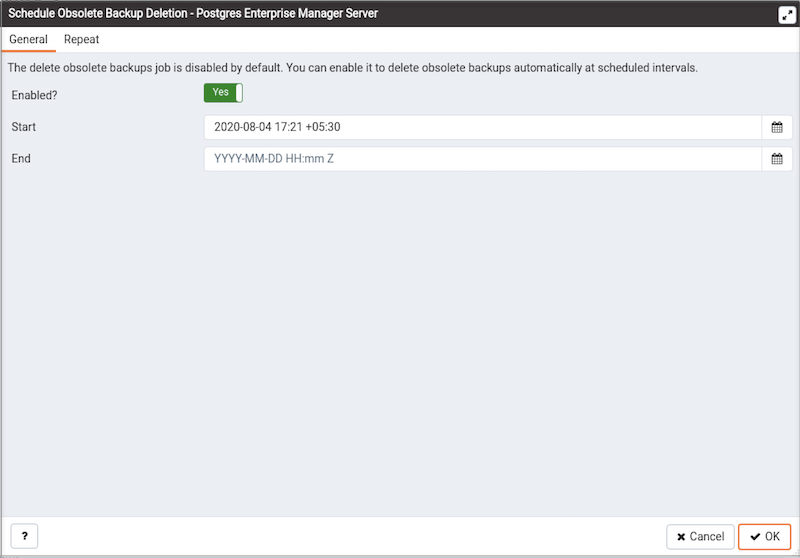

Postgres Enterprise Manager (PEM) is designed to assist database administrators, system architects, and performance analysts when administering, monitoring, and tuning PostgreSQL and Advanced Server database servers.

The EDB Backup and Recovery Tool (BART) is an administrative utility providing simplified backup and recovery management for multiple local or remote EDB Postgres Advanced Server and PostgreSQL database servers. For more information about BART, please visit the EDB website at:

<https://www.enterprisedb.com/enterprise-postgres/edb-postgres-backup-and-recovery-tool>

From PEM version 7.10 onwards, you can manage a BART server through PEM console. PEM provides a user-friendly interface that allows you to manage your BART server and perform all the BART operations from PEM console.

## Prerequisites

-   Before adding a BART server to the PEM console, you must manually install and configure BART on the BART host. For more information about installing and configuring BART, please see the [BART Installation Guide](https://www.enterprisedb.com/docs/bart/latest/bart_inst/).

!!! Note
    While integrating PEM with BART, the PEM Agent creates the backup directory required for BART, and ensures that the ownership and permissions on the directory are correct.

-   Before associating a database server with a BART server, you must install SSH on the database server and the BART server.

-   Before restoring a BART backup, you must install BART, a PEM agent, and SSH on the target server. SSH must also be installed on the BART server that you plan to use to restore.

-   To take a backup of the replica database servers, you must ensure that the latest *pg_basebackup* utility is installed on the database server that you want to manage through BART.

## Configuring a BART server

You can use the `Create–BART server` dialog to register an existing BART server with the PEM server. To access the dialog, right-click on the `BART Servers` node and select `Create-BART Server`.

Use the fields on the `General` tab to describe the general properties of the BART Server:

-   Use the `Agent Name` field to select the agent that you want to use for the BART server. Only those PEM agents that are supported for BART are listed in the drop-down list.

-   Use the `Server Name` field to specify a user-friendly name for the server. The name specified will identify the server in the Browser tree.

-   Use the `Host` field to specify the IP address of the host or agent where BART is installed.

-   Use the `User` field to specify the user name that will be used for performing all the BART operations. You can either use the `enterprisedb` (for Advanced Server) or `postgres` (for PostgreSQL) database user account or you can create a new BART user account. This user must be an operating system user who owns the BART backup catalog directory.

-   Use the `Installation path` field to specify the directory path where BART is installed on the host or BART server.

-   Use the `Backup path` field to specify the file system parent directory where all BART backups and archived WAL files will be stored.

-   Use the `pg_basebackup_path` field to specify the path to the `pg_basebackup` utility.

-   Use the `Xlog/WAL method` field to specify how the transaction log should be collected during the execution of pg_basebackup. The default option is `fetch`; it specifies that the transaction log files will be collected after the backup has completed. Set the `Xlog/WAL` method to `stream` to stream the transaction log in parallel with the full base backup creation. If streaming is used, the `max_wal_senders` configuration parameter in the `postgresql.conf` file for affected database servers must account for an additional session for the streaming of the transaction log (the setting must be a minimum of 2).

    For more information about Xlog/WAL methods, see [PostgreSQL core documentation](https://www.postgresql.org/docs/current/app-pgbasebackup.html).

-   Use the `Retention policy` field to specify the retention policy for the backup. This determines when an active backup should be marked as obsolete, and hence, be a candidate for deletion. You can specify the retention policy in terms of number of backup or in terms of duration (days, weeks, or months).

-   Use the `Log file` field to specify the path to BART log file. This is an optional field.

Use the fields on the `Misc` tab to describe the backup-related properties of the BART Server:

-   Use the `Scanner log file` field to specify the path to the Xlog/WAL scanner log file. This is an optional field; BART does not create a WAL scanner log file if you do not specify the path.

-   Use the `Socket dir path` field to specify the path to the socket directory where all BART sockets will be stored. The default directory is `/tmp`. This parameter is added from BART version 2.5.2 onwards.

-   Use the `Socket name` field to specify a user-friendly BART socket file name. Using this option overrides the default BART socket name generated using MD5 checksum. This parameter is added from BART version 2.5.6 onwards.

-   Use the `WAL compression?` switch to specify if you want to compress the archived Xlog/WAL files in Gzip format. To enable WAL compression, the gzip compression program must be present in the BART user account’s PATH. The WAL compression setting must not be enabled for those database servers where you need to take incremental backups.

-   Use the `Copy WALs during restore?` field to specify how the archived WAL files are collected when invoking the RESTORE operation. Set to enabled to copy the archived WAL files from the BART backup catalog to the `restore_path/archived_wals` directory prior to the database server archive recovery. Set to `disabled` to retrieve the archived WAL files directly from the BART backup catalog during the database server archive recovery. Enabling this option helps you save time during the restore operation.

-   Use the `Thread count` field to specify the number of worker threads for copying blocks or data files from the database server to the BART backup catalog. Specify a `thread count` of `1` if you want to take the backup using the `pg_basebackup` utility.

-   Use the `Batch size` field to specify the number of blocks of memory used for copying modified blocks. This is applicable only for incremental backups.

-   Use the `Scan interval` field to specify the number of seconds after which the WAL scanner should scan the new WAL files.

-   Use the `MBM scan timeout` field to specify the number of seconds to wait for MBM files before timing out. This is applicable only for incremental backups.

-   Use the `Workers` field to specify the number of parallel worker processes required to stream the modified blocks of an incremental backups to the restore host.

## Associating the BART server with a database server

After configuring the BART server, you must associate it with the database server whose backup you wish to manage with BART. You can do one of the following:

-   Use the PEM console to modify the properties of an existing monitored database server to map it to the newly configured BART server.

-   Use the PEM console to create a new monitored database server, and map it to the newly configured BART server.

To map the BART server to a new PEM database server, right-click the `PEM Server Directory` node and select `Create` > `Server`. Enter the details on all the generic tabs and then enter the BART-specific details on the `BART` tab.

Use the fields on the `General` tab to describe the general properties of the BART Server that will map to the PEM server:

-   Use the `BART server` field to select the BART server name. All the BART servers configured in the PEM console will be listed in this drop down list.

-   Use the `Server name` field to specify a name for the database server that you want to backup using the BART server. This name gets stored in the BART configuration file.

-   Use the `Description` field to specify the description of the database server.

-   Use the `Backup name` field to specify a template for user-defined names to be assigned to the backups of the database server. If you do not specify a backup name template, then the backup can only be referenced in BART sub-commands by the BART assigned, integer backup identifier.

-   Use the `Host address` field to specify the IP address of the database server that you want to configure for backup.

-   Use the `Port` field to specify the port to be used for the database that you want to backup.

-   Use the `User` field to specify the user of the database that you want to backup using BART through PEM console. If you want to enable incremental backups for this database server, then the user must be a superuser.

-   Use the `Password` field to specify the password for the user of the database that you want to backup.

-   Use the `Cluster Owner` field to specify the Linux operating system user account that owns the database cluster. This is typically `enterprisedb` for Advanced Server database clusters installed in the Oracle databases compatible mode, or `postgres` for PostgreSQL database clusters and for Advanced Server database clusters installed in the PostgreSQL databases compatible mode.

-   Use the `Archive command` field to specify the desired format of the archive command string to be used in the `bart.cfg` file. Inputs provided for the Archive command will overwrite the database server's `Postgresql.conf` file. Once the server gets added, the database server will be restarted or database configurations will be reloaded.

-   Use the `Archive path` field to store the archived WAL files. The default location is the BART backup catalog. This parameter is added from BART version 2.5.2 onwards.

-   Use the `Allow incremental backup?` switch to specify if incremental backup should be enabled for this database server.

-   Use the `Setup passwordless SSH?` switch to specify if you want to create SSH certificates to allow passwordless logins between the Database Server and the BART server. Ensure to bind a PEM agent before setting up the passwordless SSH authentication. Passwordless SSH will not work for a database server being remotely monitored by a PEM agent.

Use the fields on the `Misc` tab to describe the miscellaneous properties of the BART Server:

-   Use the `Override default configuration?` Switch to specify if you want to override the BART server configurations with the specific database server configurations.

-   Use the `Xlog` method to specify how the transaction log should be collected during the execution of `pg_basebackup`.

-   Use the `Retention policy` field to specify the retention policy for the backup. This determines when an active backup should be marked as obsolete, and hence, be a candidate for deletion. You can specify the retention policy in terms of number of backup or in terms of duration (days, weeks, or months).

-   Use the `WAL compression` switch to specify if you want to compress the archived Xlog/WAL files in Gzip format. To enable WAL compression, the gzip compression program must be present in the BART user account’s PATH. The wal_compression setting must not be enabled for those database servers where you need to take incremental backups.

-   Use the `Copy WALs during restore` field to specify how the archived WAL files are collected when invoking the RESTORE operation. Set to enabled to copy the archived WAL files from the BART backup catalog to the &lt;restore_path>/archived_wals directory prior to the database server archive recovery. Set to disabled to retrieve the archived WAL files directly from the BART backup catalog during the database server archive recovery.

-   Use the `Thread count` field to specify the number of threads to copy the blocks. You must set `thread count` to `1` if you want to take a backup with the `pg_basebackup` utility.

-   Use the `Batch size` field to specify the number of blocks of memory used for copying modified blocks, applicable only for incremental backups.

-   Use the `Scan interval` field to specify the number of seconds after which the WAL scanner should scan the new WAL files.

-   Use the `MBM scan timeout` field to specify the number of seconds to wait for MBM files before timing out, applicable only for incremental backups.

-   Use the `Workers` field to specify the number of parallel worker processes required to stream the modified blocks of an incremental backups to the restore host.

## Viewing the BART server details on a PEM dashboard

After associating the BART server with a database server, you can review the backup and restore details for that server on the PEM Dashboard. You can also perform operations such as restoration or deletion of a backup that is listed on the dashboard.

When you select a monitored BART server, details of all the associated database servers along with their backups and restore activities are displayed as a chart on the Dashboard in the `Backup and Restore Activities` panel. You can filter the list of backups on criteria specified in the filter boxes (database server, activity, or duration).

The `Managed Database servers` panel displays a list of all the database servers managed by that particular BART server along with their high-level details.

The `Initiated Server Backups` panel displayes a list of all the backups of the database servers managed by that particular BART server. You can filter the list to display the details of a particular database server. You can also filter the list on any criteria that you specify in the filter box. Typically, this filter works with any kind of string value (excluding date, time, and size) listed under the columns. For example, you can type `tar` to filter the list and display only those backups that are in tar format.

Backup details displayed include the `Backup Name`, `Backup ID`, `Status`, `Server Name`, `Start Time`, `Type`, `Parent ID`, `Format`, `Duration`, and `Size`. The `Status` column shows the status of the backups which can be one of the following: `In Progress`, `Active`, `Keep`, or `Obsolete`.

A backup is marked as `Obsolete` when the backup retention period has passed or if the number of retained backups (specified as the retention policy of the BART server) is met. If you want to make an exception so that a particular backup does not get marked as `Obsolete` even after the expiration of the retention policy, mark that particular backup as `Keep`. Similarly, if you mark a particular backup as `NoKeep`, the backup is re-evaluated to determine if its status should be changed back to `Obsolete` based on the current retention policy.

Please note that if any of the scheduled tasks for backup, restore, validate host, validate server or delete obsolete backup for any of the BART Server gets deleted, it will not display under the `BART Tool Activities` graph of BART Server's dashboard. However, it gets listed under the `Initiated Server Backups` list.

A pin in the first column under `Actions` indicates that a backup can be marked as *Keep* by clicking the pin; while an inverted pin indicates that the backup can be marked as *NoKeep*. The second column under `Actions` displays the `Restore` icon; you can perform the `Restore` operation by clicking on the icon.

You can delete all the `Obsolete` backups by clicking the `Delete Obsolete` button. You can also refresh the list of backups by clicking the `Refresh` button.

## Scheduling BART backups

To create or manage a backup, select `Schedule Backup` from the `Tools` menu. The dialog header displays general execution information about the backup:

-   `Logs`
-   `Last result`
-   `Database server`
-   `Last backup name`
-   `Started on`
-   `Type`
-   `Parent`
-   `Format`
-   `Verify checksum?`
-   `Use pg_basebackup?`

Click the Add icon (+) to add information about a scheduled backup. Enter the backup details in the schedule definition dialog:

Use the fields on the `General` tab to describe the general properties of the backup:

-   Use the `Database Server` field to specify the target database server that you want to back up.

-   Use the `Backup name` to specify a user-defined name for the backup.

-   Use the `Backup type` switch to specify the backup type I. e. full backup or incremental backup.

-   Use the `Parent backup` field to select the ID of the parent backup for incremental backup. This parent backup can either be a full or an incremental backup.

-   Use the `Format switch` to specify the output format of the backup i.e plain text or tar. For incremental backup, you need to select plain text only.

-   Use the `Gzip compression` switch to specify if gzip compression should be enabled for the backup. This option is applicable only for the tar format.

-   Use the `Compression level` field to specify the gzip compression level on the tar file output.

-   Use the `Thread count` field to specify the number of threads that will copy the blocks.

-   Use the `MBM scan timeout` field to specify the number of seconds to wait for required MBM files before timing out.

-   Use the `Verify checksum` field to specify if you want the application to verify the checksum of the backup.

-   Use the `pg_basebackup` field to specify if the pg_basebackup utility should be used for the backup. Typically, pg_basebackup utility is used only for backing up the replica servers since it cannot be used for incremental backups.

Provide scheduling details for the Backup on the `Schedule` tab:

-   Use the `Enabled?` switch to indicate if the schedule should be enabled (`Yes`) or disabled (`No`).

-   Use the calendar selector in the `Start` field to specify the starting date and time for the schedule.

-   Use the calendar selector in the `End` field to specify the ending date and time for the schedule.

Use the fields on the `Repeat` tab to specify the details about the schedule in a cron-style format. The schedule will execute on each date or time element selected on the `Repeat` tab. Click within a field to open a list of valid values for that field; click on a specific value to add that value to the list of selected values for the field. To clear the values from a field, click the `X` located at the right-side of the field.

Use the fields within the `Days` box to specify the days on which the schedule will execute:

-   Use the `Week Days` field to select the days on which the schedule will execute.

-   Use the `Month Days` field to select the numeric days on which the schedule will execute. Specify the Last Day to indicate that the schedule should be performed on the last day of the month, regardless of the date.

-   Use the `Months` field to select the months in which the schedule will execute.

Use the fields within the `Times` box to specify the times at which the schedule will execute:

-   Use the `Hours` field to select the hour at which the schedule will execute.

-   Use the `Minutes` field to select the minute at which the schedule will execute.

Use the fields on the `Notifications` tab to specify the email notification settings for a scheduled backup:

-   Use the `Send the notifications` field to specify when you want the email notifications to be sent.

-   Use the `Email group` field to specify the email group that should receive the email notification.

## Scheduling BART obsolete backups deletion

Use the `Schedule Obsolete Backup Deletion` dialog to schedule or modify a BART obsolete backup deletion.

Use context menu from database server where BART has been configured.

Provide information on the `General` tab to describe the scheduling details:

-   Use the `Enabled?` switch to indicate if the schedule should be enabled (`Yes`) or disabled (`No`).
-   Use the calendar selector in the `Start` field to specify the starting date and time for the schedule.
-   Use the calendar selector in the `End` field to specify the ending date and time for the schedule.

Use the fields on the `Repeat` tab to specify the details about the schedule in a cron-style format. The schedule will execute on each date or time element selected on the `Repeat` tab.  Click within a field to open a list of valid values for that field; click on a specific value to add that value to the list of selected values for the field. To clear the values from a field, click the `X` located at the right-side of the field.

Use the fields within the `Days` box to specify the days on which the schedule will execute:

-   Use the `Week Days` field to select the days on which the schedule will execute.
-   Use the `Month Days` field to select the numeric days on which the schedule will execute. Specify the Last Day to indicate that the schedule should be performed on the last day of the month, regardless of the date.
-   Use the `Months` field to select the months in which the schedule will execute.

Use the fields within the `Times` box to specify the times at which the schedule will execute:

-   Use the `Hours` field to select the hour at which the schedule will execute.
-   Use the `Minutes` field to select the minute at which the schedule will execute.

## Restoring BART backups

You can restore the backups that you have earlier created using BART server on a target remote host. When you select a particular BART server, all the associated backups are listed in the Dashboard under `Initiated Server Backups`.

To restore a backup, click the `Restore` icon next to the backup that you want to restore.

In the `Restore Backup` dialog, provide information in the fields on the `General` tab:

-   Use the `Target agent` field name to specify the name of the agent where you want to restore the backup.

-   Use the `Remote user` field to specify the use account on the remote database server host where you want to restore the backup.

-   Use the `Remote host address` field to specify the IP address of the remote host where you want to restore the backup.

-   Use the `SSH port` field to specify the SSH port to be used for restoring the backup.

-   Use the `Restore path` field to specify the path where you want to restore the backup.

-   Use the `Number of workers` field to specify processes to run in parallel to stream the modified blocks of an incremental backup to the restore location.

-   Use the `Setup passwordless SSH?` switch to specify if you want to create SSH certificates to allow passwordless logins between the BART server and the target host for restore.

On the `Advanced` tab, specify your preferences for advanced options for restoring the backup:

-   Use the `Copy WALs to restore path?` switch to specify if you want to copy WAL files to the restore path.

-   Use the `Point in time recovery` switch to specify if you want point in time recovery.

-   Use the `Timeline ID` field to specify the timeline ID to be used for replaying the archived WAL files for point-in-time recovery.

-   Use the `Transaction ID (XID)` field to specify the transaction ID for point-in-time recovery.

-   Use the `Timestamp` field to the timestamp to be used for restore.

!!! Note
    You can specify either `Transaction ID` or `Timestamp` for the point-in-time recovery.

Use the fields on the `Notifications` tab to specify the email notification settings for restoring the backup.

-   Use the `Send the notifications` field to specify when you want the email notifications to be sent.

-   Use the `Email group` field to specify the email group that should receive the email notification.
