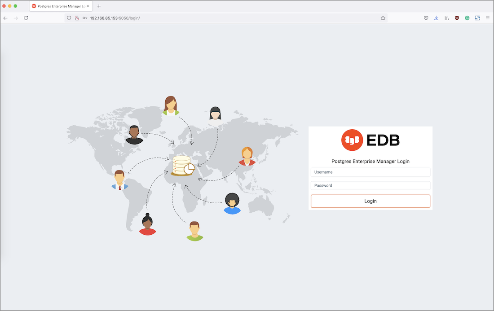

After installing a PEM Server and Agent, you can configure PEM to start monitoring and managing PostgreSQL or Advanced Server instances. The PEM Server installer installs the PEM web interface. You can use the interface to review information about objects that reside on monitored servers, or to review statistical information gathered by the PEM Server.

After installing and configuring PEM, you can use any supported browser to access the PEM web interface. Open your browser, and navigate to:

 `https://<ip_address_of_PEM_host>:8443/pem`

Where `ip_address_of_PEM_host` specifies the IP address of the host of the PEM Server. The `Postgres Enterprise Manager Web Login` window opens:

Use the fields on the `Postgres Enterprise Manager Login` window to authenticate yourself with the PEM Server:

-   Provide the name of a `pem` database user in the `Username` field. For the first user connecting, this will be the name provided when installing the PEM server.
-   Provide the password associated with the user in the `Password` field.

Click the `Login` button to connect to the PEM Server.

Before you can use the PEM web interface to manage or monitor a database server, you must *register* the server with the PEM Server. When you register a server, you describe the connection to the server, provide authentication information for the connection, and specify any management preferences (optionally binding an agent).

A server may be managed or unmanaged:

-   A `managed` server is bound to a PEM Agent. The PEM Agent will monitor the server to which it is bound, and perform tasks or report statistics for display on the PEM dashboards. A managed server has access to extended PEM functionality such as Package Management or Custom Alerting; when registering a server, you can also allow a managed server to be restarted by PEM as required.
-   An `unmanaged` server is not bound to a PEM Agent; you can create database objects on an unmanaged server, but extended PEM functionality (such as Package Management or Custom Alerting) is not supported on an unmanaged server.

You must also ensure the `pg_hba.conf` file of the server that you are registering allows connections from the host of the PEM web interface.

To access online help information about the PEM web interface, select `Help` from the menu bar. Additional information is available in .pdf and .html format from the [EDB website](https://www.enterprisedb.com/docs/pem/latest/)

-   The `PEM Administrator's Guide` contains information about registering and managing servers, agents, and users.
-   The `PEM Enterprise Features Guide` contains information about using the tools and wizards that are part of the web interface.
-   The `PEM Agent User Guide` contains helpful information about managing your PEM Agents.
-   The `PEM Upgrade and Migration Guide` contains information about upgrading PEM to its latest version from a previous version.
-   The `PEM PgBouncer Configuration Guide` contains information about using PgBouncer with your PEM installation.
