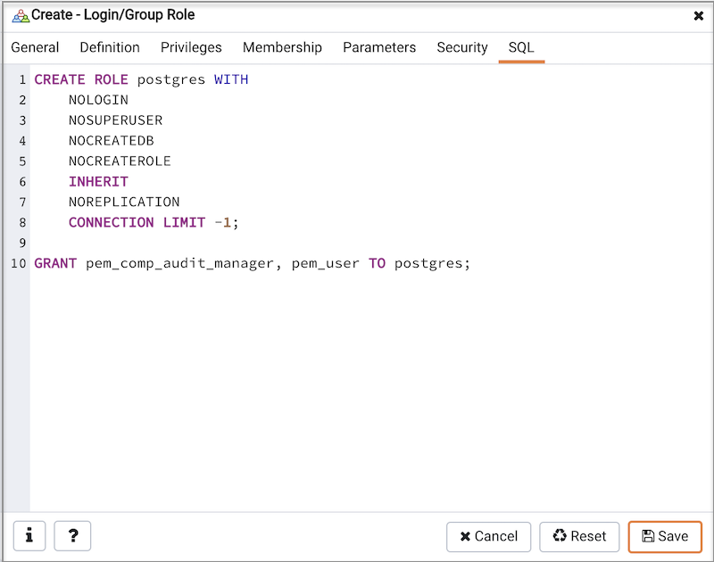

You can use the `Login/Group Role` dialog to allow a role with limited privileges to access PEM features such as the Audit Manager, Capacity Manager, or SQL Profiler. PEM pre-defined roles allow access to PEM functionality; roles that are assigned membership in these roles can access the associated feature.

When defining a user, use the `Membership` tab to specify the roles in which the new user is a member. The new user will share the privileges associated with each role in which it is a member. For a user to have access to PEM extended functionality, the role must be a member of the pem_user role and the pre-defined role that grants access to the feature. Use the `Roles` field to select pre-defined role names from a drop down list.

Check the checkbox to the right of the role name to allow administrative access to the functionality.

The `SQL` tab displays the SQL command that the server will execute when you click `Save`.

The examples shown above creates a login role named `acctg_clerk` that will have access to the Audit Manager; the role can make unlimited connections to the server at any given time.

You can use PEM pre-defined roles to allow access to the functionality listed in the table below:

| Value                            | Parent Role                  | Description                                                                                                                                                                                                                                                                                               |
| -------------------------------- | ---------------------------- | --------------------------------------------------------------------------------------------------------------------------------------------------------------------------------------------------------------------------------------------------------------------------------------------------------- |
| pem_super_admin                  |                              | Role for administration/management/configuration of all the objects within Postgres Enterprise Manager console.                                                                                                                                                                                           |
| pem_admin                        | pem_super_admin              | Role for administration/management/configuration of all the agents, servers, or monitored objects that are visible to a user having pem_admin role. A user with pem_admin role can view and manage only those objects where this role has been mentioned in the Team field under the server's properties. |
| pem_user                         |                              | Role for having read-only access to all the agents, servers, or monitored objects that are visible to a user having pem_user role. A user with pem_user role can view only those objects where this role has been mentioned in the Team field under the server's properties.                              |
| pem_config                       | pem_admin                    | Role for configuration management of Postgres Enterprise Manager.                                                                                                                                                                                                                                         |
| pem_component                    | pem_admin                    | Role to run/execute all wizard/dialog based components.                                                                                                                                                                                                                                                   |
| pem_rest_api                     | pem_admin                    | Role to access the REST API.                                                                                                                                                                                                                                                                              |
| pem_server_service_manager       | pem_admin                    | Role for allowing to restart/reload the monitored database server (if server-id provided).                                                                                                                                                                                                                |
| pem_manage_schedule_task         | pem_admin                    | Role to configure the schedule tasks.                                                                                                                                                                                                                                                                     |
| pem_manage_alert                 | pem_admin                    | Role for managing/configuring alerts, and its templates.                                                                                                                                                                                                                                                  |
| pem_config_alert                 | pem_config, pem_manage_alert | Role for configuring the alerts on any monitored objects.                                                                                                                                                                                                                                                 |
| pem_manage_probe                 | pem_admin                    | Role to create, update, delete the custom probes, and change custom probe configuration.                                                                                                                                                                                                                  |
| pem_config_probe                 | pem_config, pem_manage_probe | Role for probe configuration (history retention, execution frequency, enable/disble the probe) on all visible monitored objects.                                                                                                                                                                          |
| pem_database_server_registration | pem_admin                    | Role to register a database server.                                                                                                                                                                                                                                                                       |
| pem_comp_postgres_expert         | pem_component                | Role to run the Postgres Expert.                                                                                                                                                                                                                                                                          |
| pem_comp_auto_discovery          | pem_component                | Role to run the Auto discovery of a database server dialog.                                                                                                                                                                                                                                               |
| pem_comp_log_analysis_expert     | pem_component                | Role to run the Log Analysis Expert.                                                                                                                                                                                                                                                                      |
| pem_comp_sqlprofiler             | pem_component                | Role to run the SQL Profiler.                                                                                                                                                                                                                                                                             |
| pem_manage_efm                   | pem_admin                    | Role to manage Failover Manager functionalities.                                                                                                                                                                                                                                                          |
| pem_comp_capacity_manager        | pem_component                | Role to run the Capacity Manager.                                                                                                                                                                                                                                                                         |
| pem_comp_log_manager             | pem_component                | Role to run the Log Manager.                                                                                                                                                                                                                                                                              |
| pem_comp_audit_manager           | pem_component                | Role to run the Audit Manager.                                                                                                                                                                                                                                                                            |
| pem_comp_tuning_wizard           | pem_component                | Role to run the Tuning Wizard.                                                                                                                                                                                                                                                                            |
| pem_comp_bart                    | pem_component                | Role to configure and manage BART server.                                                                                                                                                                                                                                                                 |

!!! Note
    The difference between pem_admin role and pem_super_admin role is that a user with pem_admin role can view and manage only those objects where the role has been mentioned in the Team field under the server's properties, while a user with pem_super_admin role can view and manage all the objects within Postgres Enterprise Manager console.
