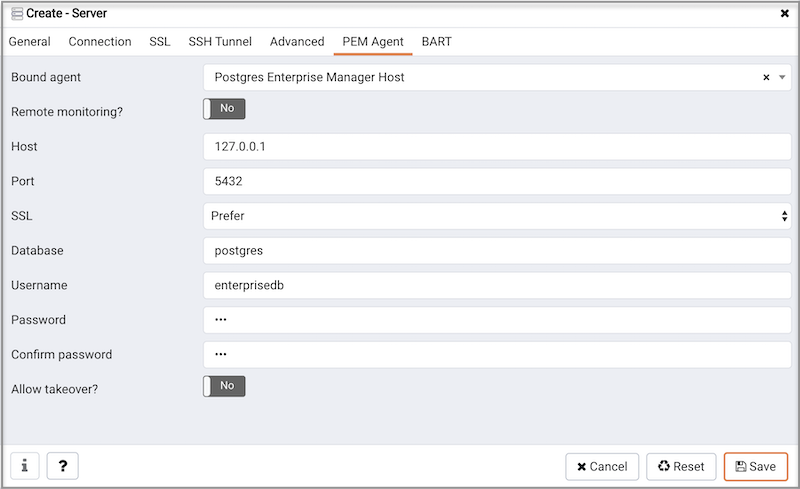

The PEM agent runs as a service (on Windows) or as a daemon (on Linux), and is responsible for implementing scheduled tasks on the PEM server on behalf of the server. The PEM server installer automatically installs and configures an agent that is responsible for monitoring the PEM server. The PEM agent installer will setup and configure the agent to start automatically at boot time, however the agent can also be manually [started](../03_pem_agent_start_pem_agent/#pem_agent_start_pem_agent) if required.

To create a binding for a registered server, right click on the name of the server in the tree control, and select `Properties` from the context menu. Open the `PEM Agent` tab:

Use the fields on the `PEM Agent` tab to associate the server (defined on the Connection tab) with a PEM agent:

Use fields on the `PEM Agent` tab to specify connection details for the PEM agent:

-   Specify `Yes` in the `Remote monitoring?` field to indicate that the PEM agent does not reside on the same host as the monitored server. When remote monitoring is enabled, agent level statistics for the monitored server will not be available for custom charts and dashboards, and the remote server will not be accessible by some PEM utilities (such as Audit Manager, Capacity Manager, Log Manager, Postgres Expert and Tuning Wizard).
-   Select an Enterprise Manager agent using the drop-down listbox to the right of the `Bound agent` label. One agent can monitor multiple Postgres servers.
-   Enter the IP address or socket path that the agent should use when connecting to the database server in the `Host` field. By default, the agent will use the host address shown on the `General` tab. On a Unix server, you may wish to specify a socket path, e.g. `/tmp`.
-   Enter the `Port` number that the agent will use when connecting to the server. By default, the agent will use the port defined on the `Properties` tab.
-   Use the drop-down listbox in the `SSL` field to specify an SSL operational mode; specify require, prefer, allow, disable, verify-ca or verify-full.
-   Use the `SSL` field to specify an SSL operational mode.

| Mode        | Specify:                                                                                                                                  |
| ----------- | ----------------------------------------------------------------------------------------------------------------------------------------- |
| require     | To require SSL encryption for transactions between the server and the agent.                                                              |
| prefer      | To use SSL encryption between the server and the agent if SSL encryption is available.                                                    |
| allow       | To allow the connection to use SSL if required by the server.                                                                             |
| disable     | To disable SSL encryption between the agent and the server.                                                                               |
| verify-ca   | To require SSL encryption, and to require the server to authenticate using a certificate registered by a certificate authority.           |
| verify-full | To require SSL encryption, and to require the server to authenticate using a certificate registered by a `trusted` certificate authority. |

> For information about using SSL encryption, see [Section 31.17 of the Postgres documentation](http://enterprisedb.com/docs/en/9.0/pg/libpq-ssl.html).

-   Use the `Database` field to specify the name of the Postgres Plus database to which the agent will initially connect.
-   Specify the name of the user that agent should use when connecting to the server in the `User name` field. Note that if the specified user is not a database superuser, then some of the features will not work as expected. If you are using Postgres version 10 or above, you can use the `pg_monitor` role to grant the required privileges to a non-superuser. For information about `pg_monitor` role, see [Default Roles](https://www.postgresql.org/docs/current/default-roles.html).
-   Specify the password that the agent should use when connecting to the server in the `Password` field, and verify it by typing it again in the `Confirm password` field. If you do not specify a password, you will need to configure the authentication for the agent manually; you can use a `.pgpass` file for example.
-   Specify `Yes` in the `Allow takeover?` field to specify that the server may be "taken over" by another agent. This feature allows an agent to take responsibility for the monitoring of the database server if, for example, the server has been moved to another host as part of a [high availability](02_pem_agent_ha/#pem_agent_ha) failover process.

pem_agent_config_params pem_agent_ha

