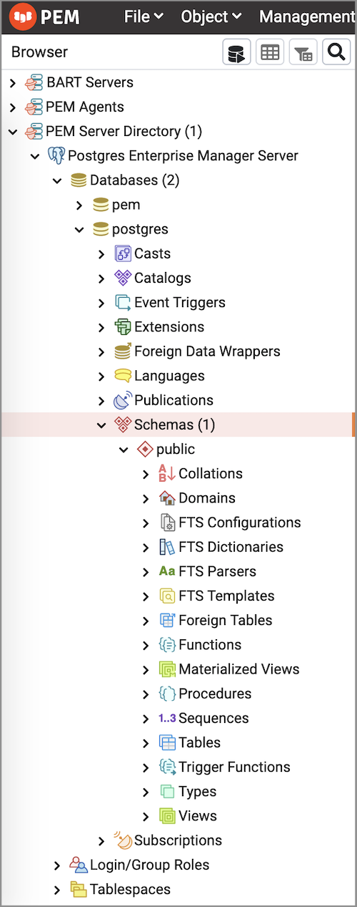

The browser toolbar provides shortcut buttons for frequently used features like View Data and the Query Tool which are most frequently used in PEM. This toolbar is visible on the Browser panel. Buttons get enabled/disabled based on the selected browser node.

-   Use the [Query Tool](05_keyboard_shortcuts/#query-tool) button to open the Query Tool in the current database context.
-   Use the [View Data](../08_toc_pem_developer_tools/04_editgrid/#editgrid) button to view/edit the data stored in a selected table.
-   Use the [Filtered Rows](../08_toc_pem_developer_tools/04_editgrid/01_viewdata_filter/#viewdata_filter) button to access the Data Filter popup to apply a filter to a set of data for viewing/editing.
