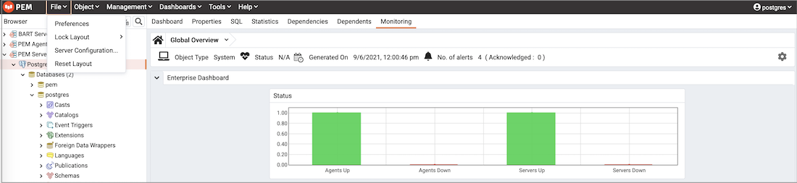
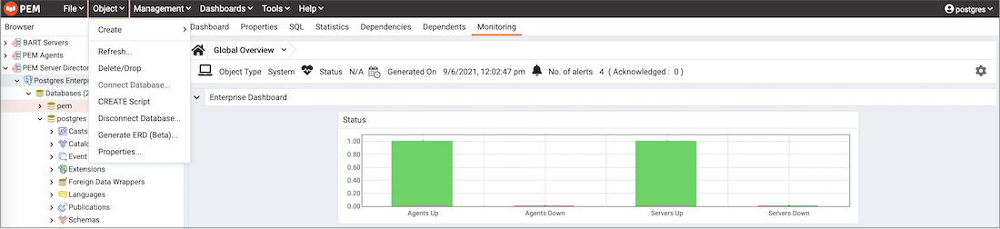
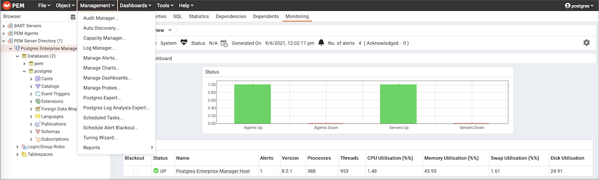
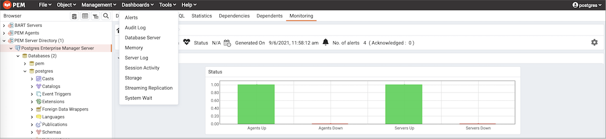
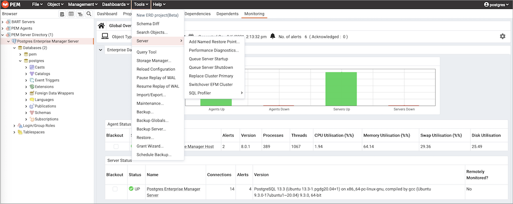
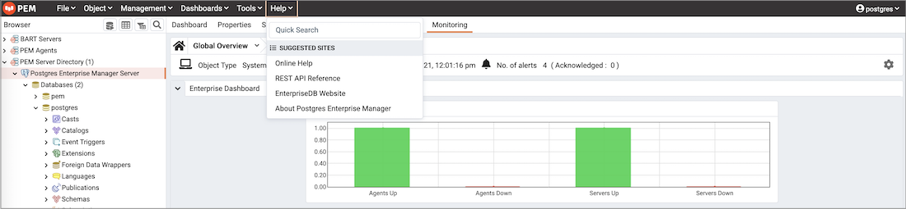

The PEM menu bar provides access to commands and features that you can use to manage your database servers and the objects that reside on those servers. If an option is disabled:

-   The database server to which you are currently connected may not support the selected feature.
-   The selected menu option may not be valid for the current object (by design).
-   The role that you have used to connect to the server may have insufficient privileges to change the selected object.

Context-sensitive menus across the top of the PEM web interface allow you to customize your environment and provide access to the enterprise management features of PEM.

**The File Menu**

Use the `File` menu to access the following options:

| Menu Option          | Action                                                                                                                                                                                |
| -------------------- | ------------------------------------------------------------------------------------------------------------------------------------------------------------------------------------- |
| Preferences          | Click to open the [Preferences](04_preferences/#preferences) dialog to customize your PEM client settings.                                                                            |
| Lock Layout          | Click to open a sub-menu to select the level for locking the UI layout. This can also be changed from the Browser -> Display settings tab [preferences](04_preferences/#preferences). |
| Server Configuration | Click to open the Server Configuration dialog and update your PEM server configuration settings.                                                                                      |
| Reset Layout         | If a workspace panel is popped out by mistake or intentionally it can be reset back to default using Reset Layout.                                                                    |

**The Object Menu**

The `Object` menu is context-sensitive. Use the `Object` menu to access the following options:

| Menu Option                | Action                                                                                                                                                               |
| -------------------------- | -------------------------------------------------------------------------------------------------------------------------------------------------------------------- |
| Create                     | Click `Create` to access a context menu that provides context-sensitive selections. Your selection opens a `Create` dialog for creating a new object.                |
| Refresh...                 | Click to refresh the currently selected object.                                                                                                                      |
| Connect Server             | Click to open the [Connect to Server](../01_toc_pem_getting_started/09_pem_connect_to_server/#pem_connect_to_server) dialog to establish a connection with a server. |
| CREATE Script              | Click to open the [Query tool](05_keyboard_shortcuts/#query-tool) to edit or view the selected script.                                                               |
| Disconnect Server/Database | Click to disconnect the selected server.                                                                                                                             |
| Remove Server              | Click to remove the selected server from the browser tree.                                                                                                           |
| BART                       | Click to access a context menu that provides options for removing BART configuration, taking a BART backup, or revalidate the BART configuration.                    |
| Clear Saved Password       | If you have saved the database server password, click to clear the saved password. Enabled only after password is saved.                                             |
| Clear SSH Tunnel Password  | If you have saved the ssh tunnel password, click to clear the saved password. Enabled only after password is saved.                                                  |
| Drop Cascade               | Click to delete the currently selected object and all dependent objects from the server.                                                                             |
| Properties...              | Click to review or modify the currently selected object's properties                                                                                                 |
| Delete/Drop                | Click to delete the currently selected object from the server.                                                                                                       |
| Connect Database           | Click to connect to selected database.                                                                                                                               |
| Trigger(s)                 | Click to `Disable` or `Enable` trigger(s) for the currently selected table.                                                                                          |
| Truncate                   | Click to remove all rows from a table (Truncate) or to remove all rows from a table and its child tables (Truncate Cascade).                                         |
| View/Edit Data             | Click to access a context menu that provides several options (All Rows, First 100 Rows, Last 100 Rows, Filtered Rows) for viewing data.                              |
| Count Rows                 | Click to count the number of rows of the selected table.                                                                                                             |
| Reset Statistics           | Click to reset the statistics of the selected table.                                                                                                                 |
| Scripts                    | Click to CREATE, DELETE, INSERT, SELECT and UPDATE script for the selected table.                                                                                    |

**The Management Menu**

Use the `Management` menu to access the following PEM features:

| Menu Option                     | Action                                                                                                                                                                                          |
| ------------------------------- | ----------------------------------------------------------------------------------------------------------------------------------------------------------------------------------------------- |
| Audit Manager...                | Click to open the [Audit Manager](../04_toc_pem_features/04_audit_manager/#audit_manager) and configure auditing on your monitored servers.                                                     |
| Auto Discovery...               | Click to open the [Auto Discovery](../01_toc_pem_getting_started/06_auto_discovery_dialog/#auto_discovery_dialog) dialog to instruct a PEM agent to locate and bind monitored database servers. |
| Capacity Manager...             | Click to open the [Capacity Manager](../04_toc_pem_features/08_capacity_manager/#capacity_manager) dialog and analyze historical or project future resource usage.                              |
| Log Manager...                  | Click to open the [Log Manager](../04_toc_pem_features/03_log_manager/#log_manager) dialog and configure log collection for a server.                                                           |
| Manage Alerts...                | Click to access the [Manage Alerts](../04_toc_pem_features/09_pem_alerting/01_pem_alerting_dialog/#pem_alerting_dialog) tab and create or modify alerting behavior.                             |
| Manage Charts...                | Click to open the [Manage Charts](../04_toc_pem_features/10_pem_manage_charts/#pem_manage_charts) tab to create or modify PEM charts.                                                           |
| Manage Dashboards...            | Click to open the [Manage Dashboards](../04_toc_pem_features/11_pem_manage_dashboards/01_pem_custom_dashboard/#pem_custom_dashboard) dialog to VACUUM, ANALYZE, REINDEX, or CLUSTER.            |
| Manage Probes...                | Click to open the [Manage Probes](../05_toc_pem_management_basics/04_maintenance/01_maintenance_dialog/#maintenance_dialog) dialog to VACUUM, ANALYZE, REINDEX, or CLUSTER.                     |
| Postgres Expert...              | Click to open the [Postgres Expert](../04_toc_pem_features/07_pem_postgres_expert/#pem_postgres_expert) wizard and perform a static analysis of your servers and databases.                     |
| Postgres Log Analysis Expert... | Click to access the [Postgres Log Analysis Expert](../04_toc_pem_features/05_pem_log_analysis_expert/#pem_log_analysis_expert) dialog analyze log file contents for usage trends.               |
| Scheduled Tasks...              | Click to open the [Scheduled Tasks](../04_toc_pem_features/18_pem_task_view/#pem_task_view) tab and review tasks that are pending or recently completed.                                        |
| Schedule Alert Blackout...      | Click to open the [Schedule Alert Blackout](../04_toc_pem_features/13_pem_alert_blackout/#pem_alert_blackout) dialog and schedule the alerts blackout for your servers and agents.              |
| Tuning Wizard...                | Click to open the [Tuning Wizard](../04_toc_pem_features/06_tuning_wizard/#tuning_wizard) dialog to generate a set of tuning recommendations for your server.                                   |
| Reports                         | Click to open the [Reports](../04_toc_pem_features/22_reports/#reports) dialog to generate the system configuration report and core usage report for your server.                               |

**The Dashboards Menu**

The `Dashboards` menu is context-sensitive; use the `Dashboards` menu to access the following options:

| Menu Option           | Action                                                                                                                                                                                           |
| --------------------- | ------------------------------------------------------------------------------------------------------------------------------------------------------------------------------------------------ |
| Alerts                | Click to open the [Alerts Dashboard](../04_toc_pem_features/01_dashboards/01_alerts_dashboard/#alerts_dashboard) for the selected node.                                                          |
| Audit Log             | Click to open the [Audit Log Analysis Dashboard](../04_toc_pem_features/01_dashboards/02_audit_log_dashboard/#audit_log_dashboard) for the selected node.                                        |
| BDR Admin             | Click to open the [BDR Admin Dashboard](../04_toc_pem_features/01_dashboards/03_bdr_dashboard/#bdr_dashboard) for the selected node.                                                             |
| BDR Group Monitoring  | Click to open the [BDR Group Monitoring Dashboard](../04_toc_pem_features/01_dashboards/03_bdr_dashboard/#bdr_dashboard) for the selected node.                                                  |
| BDR Node Monitoring   | Click to open the [BDR Node Monitoring Dashboard](../04_toc_pem_features/01_dashboards/03_bdr_dashboard/#bdr_dashboard) for the selected node.                                                   |
| Database Server       | Click to open the [Database Analysis Dashboard](../04_toc_pem_features/01_dashboards/04_database_analysis_dashboard/#database_analysis_dashboard) for the selected node.                         |
| Memory                | Click to open the [Memory Analysis Dashboard](../04_toc_pem_features/01_dashboards/07_memory_analysis_dashboard/#memory_analysis_dashboard) for the selected node                                |
| Server Log            | Click to open the [Server Log Analysis Dashboard](../04_toc_pem_features/01_dashboards/12_server_log_analysis_dashboard/#server_log_analysis_dashboard) for the selected node.                   |
| Session Activity      | Click to open the [Session Activity Analysis Dashboard](../04_toc_pem_features/01_dashboards/13_session_activity_analysis_dashboard/#session_activity_analysis_dashboard) for the selected node. |
| Storage               | Click to open the [Storage Analysis Dashboard](../04_toc_pem_features/01_dashboards/15_storage_analysis_dashboard/#storage_analysis_dashboard) for the selected node.                            |
| Streaming Replication | Click to open the [Streaming Replication Analysis Dashboard](../04_toc_pem_features/01_dashboards/17_str_replication_dashboard/#str_replication_dashboard) for the selected node.                |
| System Wait           | Click to open the [System Wait Analysis Dashboard](../04_toc_pem_features/01_dashboards/16_system_wait_dashboard/#system_wait_dashboard) for the selected node.                                  |
| I/O Analysis          | Click to open the [I/O Analysis Dashboard](../04_toc_pem_features/01_dashboards/06_io_analysis_dashboard/#io_analysis_dashboard) for the selected node.                                          |
| Object Activity       | Click to open the [Object Activity Analysis Dashboard](../04_toc_pem_features/01_dashboards/08_object_activity_analysis_dashboard/#object_activity_analysis_dashboard) for the selected node.    |
| Session Waits         | Click to open the [Session Waits Analysis Dasbhoard](../04_toc_pem_features/01_dashboards/14_session_waits_dashboard/#session_waits_dashboard) for the selected node.                            |
| Operating System      | Click to open the [Operating System Analysis Dashboard](../04_toc_pem_features/01_dashboards/09_os_analysis_dashboard/#os_analysis_dashboard) for the selected node.                             |
| Probe Log             | Click to open the [Probe Log Analysis Dashboard](../04_toc_pem_features/01_dashboards/10_probe_log_analysis_dashboard/#probe_log_analysis_dashboard) for the selected node.                      |
| Custom Dashboards     | Click to open the Custom Dashboards. It will list custom dashboards configured by the user.                                                                                                      |

**The Tools Menu**

Use the `Tools` menu to access the following options:

| Menu Option           | Action                                                                                                                                                                                                                    |
| --------------------- | ------------------------------------------------------------------------------------------------------------------------------------------------------------------------------------------------------------------------- |
| New ERD Porject(Beta) | Click to open the [ERD Tool](../08_toc_pem_developer_tools/06_erd_tool/#erd_tool) and start designing your database.                                                                                                      |
| Schema Diff           | Click to open the [Schema Diff](../08_toc_pem_developer_tools/05_schema_diff/#schema_diff_feature) dialog to compare the schema objects between two database schemas.                                                     |
| Search objects        | Click to open the Search Objects dialog to search the database objects within a database.                                                                                                                                 |
| Server                | Click to access the various server related tools such as Add Named Restore Point, Performance Diagnostics, Queue Server Startup, Queue Server Shutdown, Replace Cluster Primary, Switchover EFM Cluster and SQL Profiler. |
| Query Tool            | Click to open the [Query tool](05_keyboard_shortcuts/#query-tool) for the currently selected object.                                                                                                                      |
| Storage Manager       | Click to open the [Storage manager](../05_toc_pem_management_basics/05_storage_manager/#storage_manager) to upload, delete or download the backup files.                                                                  |
| Reload Configuration  | Click to update configuration files without restarting the server.                                                                                                                                                        |
| Pause replay of WAL   | Click to pause the replay of the WAL log.                                                                                                                                                                                 |
| Resume replay of WAL  | Click to resume the replay of the WAL log.                                                                                                                                                                                |
| Import/Export...      | Click to open the Import/Export data... dialog to import or export data from a table.                                                                                                                                     |
| Maintenance...        | Click to open the Maintenance... dialog to VACUUM, ANALYZE, REINDEX, or CLUSTER.                                                                                                                                          |
| Backup...             | Click to open the [Backup...](../05_toc_pem_management_basics/06_backup_dialog/#backup_dialog) dialog to backup database objects.                                                                                         |
| Backup Globals...     | Click to open the [Backup Globals...](../05_toc_pem_management_basics/07_backup_globals_dialog/#backup_globals_dialog) dialog to backup cluster objects.                                                                  |
| Backup Server...      | Click to open the [Backup Server...](../05_toc_pem_management_basics/08_backup_server_dialog/#backup_server_dialog) dialog to backup a server.                                                                            |
| Restore...            | Click to access the [Restore](../05_toc_pem_management_basics/09_restore_dialog/#restore_dialog) dialog to restore database files from a backup.                                                                          |
| Grant Wizard...       | Click to access the [Grant Wizard](../05_toc_pem_management_basics/01_grant_wizard/#grant_wizard) tool.                                                                                                                   |
| Schedule Backup       | Click to access the Schedule Backup dialog for BART backups.                                                                                                                                                              |

**The Help Menu**

Use the options on the `Help` menu to access online help documents or to review information about the PEM installation:

| Menu Option                       | Action                                                                                                                                                                                                                                                                                                                                                                                                                                                                                                               |
| --------------------------------- | -------------------------------------------------------------------------------------------------------------------------------------------------------------------------------------------------------------------------------------------------------------------------------------------------------------------------------------------------------------------------------------------------------------------------------------------------------------------------------------------------------------------- |
| Quick Search                      | Type your keywords in the Quick Search field. Typing atleast three characters will display all the matching possibilities under Menu items and the relevant documents under Help articles. Click on the options under Menu items to perform action of particular functionality or object. Click on any of the Help articles to open the help of that topic with highlighted text in a separate window. **Note**:- If any of the option under Menu items is disabled, then it will provide information via info icon. |
| Online Help                       | Click to open documentation for Postgres Enterprise Manager.                                                                                                                                                                                                                                                                                                                                                                                                                                                         |
| REST API Reference                | Click to open the REST API Reference.                                                                                                                                                                                                                                                                                                                                                                                                                                                                                |
| EnterpriseDB Website              | Click to open the EnterpriseDB website in a browser window.                                                                                                                                                                                                                                                                                                                                                                                                                                                          |
| About Postgres Enterprise Manager | Click to locate versioning and user information for Postgres Enterprise Manager.                                                                                                                                                                                                                                                                                                                                                                                                                                     |
