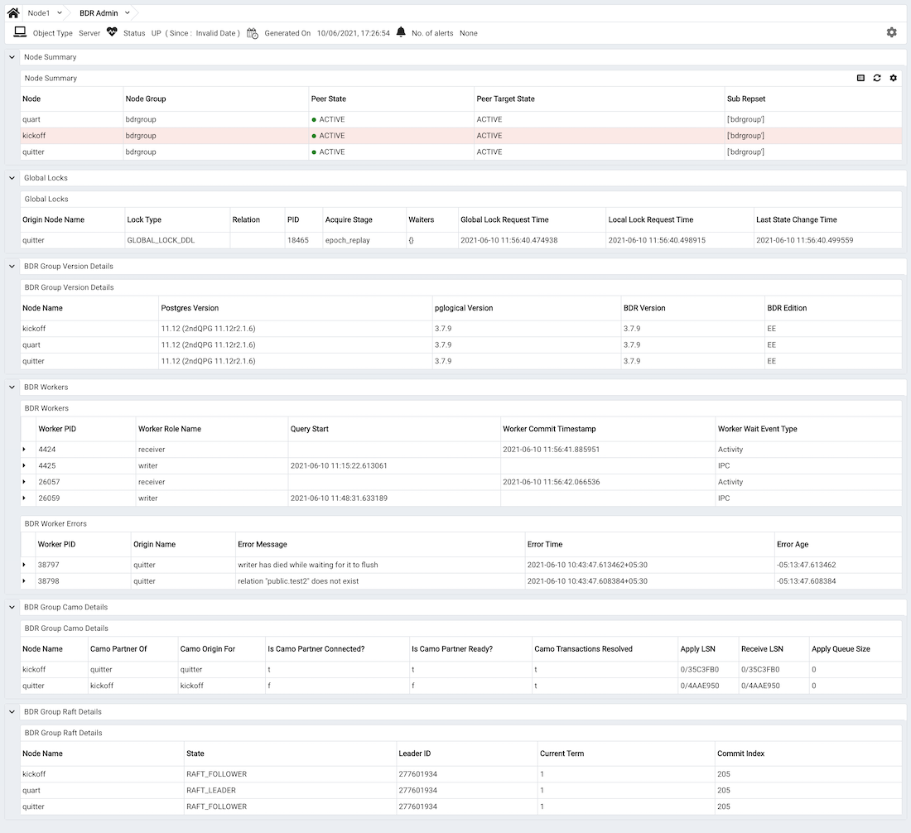

The `BDR Monitoring Dashboards` display the information about replication activities of the `BDR Nodes` in a `BDR Group`. There are three different dashboards for BDR:

-   BDR Admin Dashboard
-   BDR Group Monitoring Dashboard
-   BDR Node Monitoring Dashboard

To view the details on these dashboards, you must enable the probes on the BDR Nodes. By default, the [BDR Probes](../12_pem_manage_probes/03_pem_probe_config/01_pem_probes/#bdr_probes) are disabled. To enable the probes, highlight the name of the BDR Node in the PEM client browser tree control, and select `Manage Probes...` from the `Management` menu. Use the `Manage Probes..` tab to enable to Probes.

## BDR Admin Dashboard

To view the details on `BDR Admin Dashboard` enable the following probes:

-   BDR Group Camo Details
-   BDR Group Locks
-   BDR Group Raft Details
-   BDR Group Versions Details
-   BDR Node Summary
-   BDR Worker
-   BDR Worker Errors

Then highlight the `BDR Node` in the PEM client browser and select the `BDR Admin` from the `Dashboards` drop down menu.

The `Node Summary` table provides information about all the nodes of BDR Group:

-   The `Node` column displays the name of the BDR Node in the BDR Group.
-   The `Node Group` column displays the name of the BDR Group.
-   The `Peer State` column displays the status of the particular BDR Node.
-   The `Peer Target State` column displays the status of the other node which is tried to reach.
-   The `Sub Repset` column displays the name of the subscribed replication sets.

The `Global Locks` table provides information about BDR's global locking activity and progress od BDR Group:

-   The `Origin Node Name` column displays the name of the node from where the global lock is originated.
-   The `Lock Type` column displays the type of the Lock. The possible values are `GLOBAL_LOCK_DDL` or `GLOBAL_LOCK_DML`.
-   The `relation` column displays the name of the locked relation(for DML Locks) or keys(for advisory locks).
-   The `PID` column displays the PID of the process holding the lock.
-   The `Acquire Stage` column displays the internal state of the lock acquisition process.
-   The `Waiters` column displays the list of the backends waiting for the same global lock.
-   The `Global Lock Request Time` column displays the timestamp at which the process of acquiring the global lock started. It can be `Null` if time is unknown on the current node.
-   The `Local Lock Request Time` column displays the timestamp at which the local node tried to acquire the local lock for this global lock. This includes the time taken for the heavyweight session lock acquire, but does NOT include any time taken on DDL epochs or queue flushing. If the lock is re-acquired after local node restart, this will be the node restart time.
-   The `Last State Change Time` column displays the timestamp at which the `Acquire Stage` last changed.

The `BDR Group Version Details` table provides version information of the installed Postgres, pglogical, BDR, and BDR edition for each node:

-   The `Node Name` column displays the name of BDR Node in the BDR Group.
-   The `Postgres Version` column displays the version of the installed postgres on each BDR Node.
-   The `pglogical Version` column displays the version of the installed pglogical on each BDR Node.
-   The `BDR Version` column displays the version of the installed BDR extension on each BDR Node.
-   The `BDR Edition` column displays the Edition of the installed BDR extension on each BDR Node. The possible values are `EE` or `SE`.

The `BDR Workers` table provides information about the `BDR background worker processes`:

-   The `Worker PID` column displays the process id of the worker process.
-   The `Worker Role Name` column displays the role name of the worker processes. The possibile values are `receiver` or `writer`.
-   The `Query Start` column displays the query start timestamp when a particular query started executing.
-   The `Worker Commit Timestamp` column displays the timestamp at which the worker process committed the transaction.
-   The `Worker Wait Event Type` column displays the type of wait event for the worker process.

The `BDR Worker Errors` table provides information about the persistent log of errors from the BDR background worker processes.

-   The `Worker PID` column displays the process id of the worker process.
-   The `Origin Name` column displays the name of the BDR Node that initiated the error from the worker process.
-   The `Error Message` column displays the description of the error from the worker process.
-   The `Error Time` column displays the timestamp of the error from the worker process.
-   The `Error Age` column displays the time elapsed in years, months and days since the error occurred.

The `BDR Group Camo Details` table provides information relate to CAMO from all the BDR Nodes.

-   The `Node Name` column displays the name of BDR Node in the BDR Group.
-   The `Camo Partner of` column displays the node name for whom this node is partner.
-   The `Camo Origin For` column displays the node name for whom this node is origin.
-   The `Is Camo Partner Connected?` column displays the connection status of the camo partner.
-   The `Is Camo Partner Ready?` column displays the readiness status of the camo partner.
-   The `Camo Transactions Resolved` column displays if there are any pending and unresolved CAMO transactions.
-   The `Apply LSN` column displays the latest position reported as replayed.
-   The `Receive LSN` column displays the latest LSN of any change or message received.
-   The `Apply Queue Size` column displays the difference between apply_lsn and receive_lsn in bytes.

The `BDR Group Raft Details` table provides detail information about the BDR Group Raft:

-   The `Node Name` column displays the name of BDR Node in the BDR Group.
-   The `State` column displays the Raft worker state on the BDR Node.
-   The `Leader ID` column displays the Node id of the RAFT_LEADER.
-   The `Current Term` column displays the Raft election internal id.
-   The `Commit Index` column displays the Raft snapshot internal id.

## BDR Group Monitoring Dashboard

To view the details on the `BDR Group Monitoring` dashboard enable the following probes:

-   BDR Group Replication Slots Details
-   BDR Group Subscription Summary

Then highlight the `BDR Node` in the PEM client browser and select the `BDR Group Monitoring` from the `Dashboards` drop down menu.

-   The `BDR Group Subscription Lag` graph displays the delay to apply the transactions on subscribed nodes as compared to the origin. The delay in applying transactions between the subscribed node and origin is displayed with different colors on the graph. The vertical key on the left side of the graph indicates the delay to apply the transactions on subscribed nodes in seconds as compared to the origin.
-   The `BDR Group Replication Slots Replay Lag(Bytes)` graph displays the difference between the replay_lsn and current WAL write position in bytes. The difference among the different set of replication slots is displayed with different color on the graph. The vertical key on the left side of the graph indicates the difference in bytes.
-   The `BDR Group Replication Slots Replay Lag(seconds)` graph displays the approximate lag time for reported replay among the replication slots. The delay time between the subscribed replication slots is displayed with different colors on the graph. The vertical key on the left side of the graph indicates the lag time in seconds.
-   The `BDR Group Replication Slots Flush Lag(Bytes)` graph displays the difference between the flush_lsn and current WAL write position in bytes. The difference among the different set of replication slots is displayed with different colors on the graph. The vertical key on the left side of the graph indicates the difference in bytes.
-   The `BDR Group Replication Slots Flush Lag(seconds)` graph displays the approximate lag time for reported flush among the replication slots. The delay time between the subscribed replication slots is displayed with different colors on the graph. The vertical key on the left side of the graph indicates the lag time in seconds.
-   The `BDR Group Replication Slots Write Lag(Bytes)` graph displays the difference between the write_lsn and current WAL write position in bytes. The difference among the different set of subscribed replication slots is displayed with different colors on the graph. The vertical key on the left side of the graph indicates the difference in bytes.
-   The `BDR Group Replication Slots Write Lag(seconds)` graph displays the approximate lag time for reported write among the replication slots. The delay time between the subscribed replication slots is displayed with different colors on the graph. The vertical key on the left side of the graph indicates the lag time in seconds.
-   The `BDR Group Replication Slots Sent Lag(Bytes)` graph displays the difference between sent_lsn and WAL write position in bytes. The difference among the different set of subscribed replication slots is displayed with different colors on the graph. The vertical key on the left side of the graph indicates the difference in bytes.

## BDR Node Monitoring Dashboard

To view the details on the `BDR Node Monitoring` dashboard enable the following probes:

-   BDR Conflict History Summary
-   BDR Node Replicate Rates
-   BDR Node Slots

Then highlight the `BDR Node` in the PEM client browser and select the `BDR Node Monitoring` from the `Dashboards` drop down menu.

-   The `BDR Node Slots Replay Lag(Bytes)` graph displays the difference between the replay_lsn and current WAL write position in bytes for the particular BDR Node. The vertical key on the left side of the graph indicates the difference in bytes.
-   The `BDR Conflict History Summary` graph displays the summary on the conflict history per conflict type for the particular BDR Node. The vertical key on the left side of the graph indicates the number of row conflicts.
-   The `BDR Node Replication Replay Lag(Bytes)` graph displays the difference between the replay_lsn and current WAL write position on origin in bytes for the particular BDR Node. The vertical key on the left side of the graph indicates the difference in bytes.
-   The `BDR Group Replication Slots Replay Lag(seconds)` graph displays the approximate lag time for reported replay among the replication slots for the particular BDR Node. The vertical key on the left side of the graph indicates the lag time in seconds.
-   The `BDR Node Replication Apply Rates` graph displays the information about the outgoing replication activity from a given BDR Node. The vertical key on the left side of the graph.
