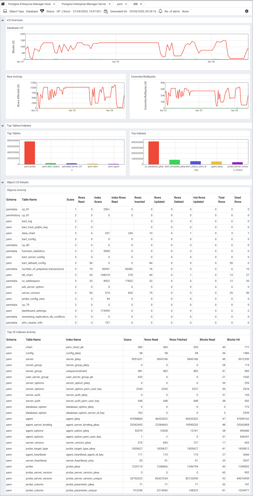
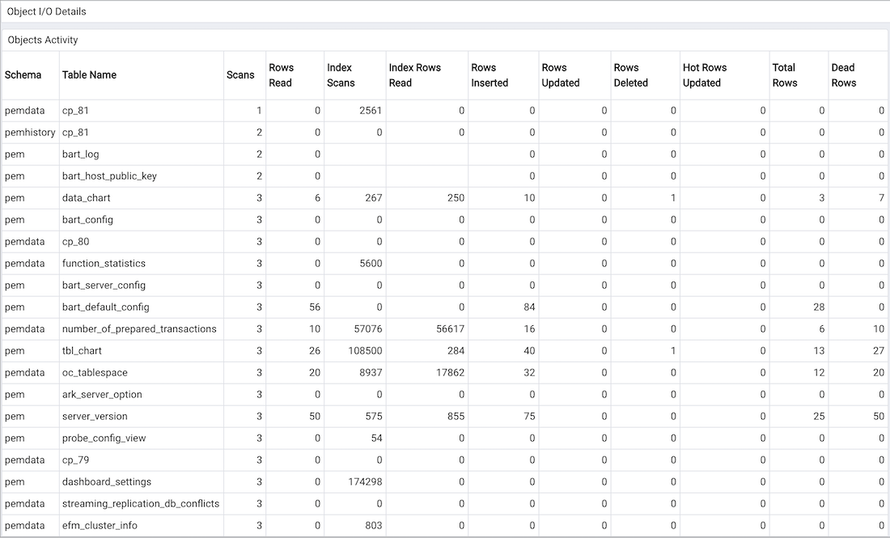

The I/O Analysis dashboard displays usage statistics for a specific database.

Use parameters on the [PEM Server Configurations](../02_pem_server_config/#pem_server_config) dialog to specify the auto-refresh rate for the dashboard. To access the `Server Configuration` dialog, select `Server Configuration...` from the PEM web interface `Management` menu.

The I/O Analysis dashboard header displays the date and time that the server started, the date and time that the I/O Analysis dashboard was last updated, and the number of alerts currently triggered for the specified database (and any monitored object that resides within that database).

The graphs in the `I/O Overview` provide information about the week's activity for the specified database:

-   The `Database I/O` graph displays the number of blocks read to and written from disk and memory buffers for the specified database over the course of the previous week.

> The vertical key on the left side of the graph charts the block count.

-   The `Row Activity` graph displays tuple activity for tables residing within the database over the last week.

> The vertical key on the left side of the graph charts the row count.

-   The `Checkpoints` graph displays the number of timed and untimed (requested) checkpoints written for the database over the last week.

> The vertical key on the left side of the graph displays the checkpoint count.
>
> > A checkpoint is a point in the transaction logging sequence at which all data files have been updated to reflect the information in the log, and data files are flushed to disk. Checkpoints can be automatically generated, or forced by use of the CHECKPOINT command. A timed checkpoint occurs when the checkpoints_timeout parameter time limit is met. An untimed (requested) checkpoint occurs when the checkpoint_segments parameter is met, or when a superuser issues the CHECKPOINT command. Frequent checkpointing can impose extra load on the server, but can reduce recovery time in the event of a crash or hardware failure.

The `Hot Tables/Indexes` section of the I/O Analysis dashboard provides an overview of the 5 most scanned tables and indexes that reside within the database.

-   The `Hot Tables` bar graph represents the comparative usage of the 5 most scanned tables that reside in the database; a vertical key displays the number of table scans.
-   The `Hot Indexes` bar graph represents the comparative usage of the 5 most scanned indexes that reside in the database; a vertical key displays the number of index scans.

The `Object I/O Details` section of the I/O Analysis dashboard provides tables that display the table and index activity for the selected database.

The `Tables Activity` table provides a detailed analysis of the activity for the 20 most active tables that reside within the database. Click a column heading to sort the table by the values within the column; click again to reverse the sort order.

-   The `Schema` column identifies the schema in which the table resides.
-   The `Table Name` column identifies the name of the table.
-   The `Scans` column displays the number of scans performed on the table.
-   The `Rows Read` column displays the number of rows read from the specified table.
-   The `Index Scans` column displays the number of index scans performed on the specified table.
-   The `Index Rows Read` column displays the number of rows read during index scans on the specified table.
-   The `Rows Inserted` column displays the number of rows inserted into the specified table.
-   The `Rows Updated` column displays the number of rows updated in the specified table.
-   The `Rows Deleted` column displays the number of rows deleted from the specified table.
-   The `Hot Rows Updated` column displays the number of hot row updates for the table; when a hot row update occurs, the new row occupies the same page as the previous row.
-   The `Total Rows` column displays the number of total rows in the table.
-   The `Dead Rows` column displays the number of rows that have been deleted, but have not been reclaimed via a VACUUM command or the AUTOVACUUM process.

The `Indexes Activity` table provides a detailed analysis of the activity for the 20 most active indexes. Click a column heading to sort the table by the values within the column; click again to reverse the sort order.

-   The `Schema` column identifies the schema in which the index resides.
-   The `Table Name` column identifies the name of the table on which the index is defined.
-   The `Index Name` column displays the name of the index.
-   The `Scans` column displays the number of index scans performed on the specified table.
-   The `Rows Read` column displays the number of tuples read during index scans on the specified table.
-   The `Rows Fetched` column displays the number of tuples fetched by index scans.
-   The `Blocks Read` column displays the number of index blocks read.
-   The `Blocks Hit` column displays the number of index blocks hit.
