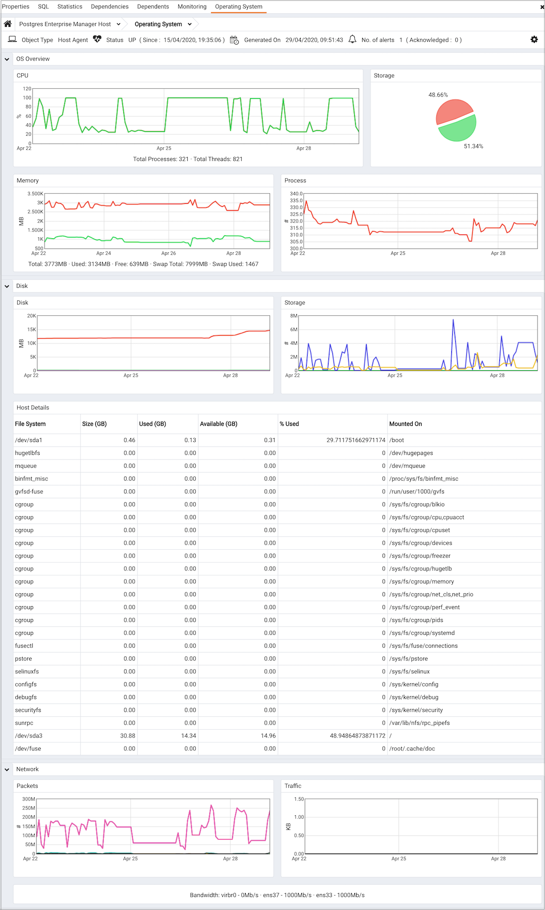
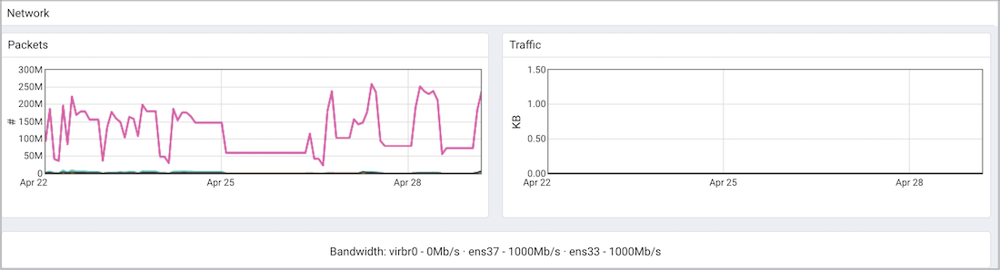

The `Operating System Analysis` dashboard provides a graphical analysis of the resource usage on the system hosting the selected agent.

Use parameters on the [PEM Server Configurations](../02_pem_server_config/#pem_server_config) dialog to specify the auto-refresh rate for the dashboard. To access the `Server Configuration` dialog, select `Server Configuration...` from the PEM web interface `Management` menu.

The `Operating System Analysis` dashboard header displays the date and time that the server was last booted, the date and time that the display was last updated, and the number of triggered alerts on the system.

The Operating System Analysis dashboard provides an overview of system resources. Within the `OS Overview` section:

-   The `CPU` graph represents the percentage of the CPU used at a given point in time. The vertical key on the left side of the graph indicates the percentage.
-   Segments of the `Storage` pie chart represent the free and used storage on the host.
-   The `Memory` graph displays the memory usage on the PEM server.
-   The `Process` graph plots the number of processes on the system. A vertical key on the left side of the graph displays the process count.

The `Disk` section of the `Operating System Analysis` dashboard displays charts and information about operating system disk usage.

-   The `Disk` graph displays the amount of disk space used. The vertical key on the left side of the chart displays the amount of disk space used (in Megabytes). Each horizontal line on the graph represents a different mounted file system; a file system key is provided in the `Legend`.

-   The `I/O` graph displays the blocks read from and written to disk. A vertical key on the left side of the graph provides a block count.

-   The `Host File System Details` table provides information about the host file system:

    > -   The `File System` column displays the name of the file system.
    > -   The `Size (GB)` column displays the size of the file system in Gigabytes.
    > -   The `Used (GB)` column displays the amount of the file system that is currently storing information.
    > -   The `Available (GB)` column displays the amount of space still available on the file system.
    > -   The `% Used` column displays the percentage of the total storage space in use.
    > -   The `Mounted On` column displays the directory or drove on which the file system is mounted.

Graphs in the `Network` section of the `Operating System Analysis` dashboard plot the network and packet traffic:

-   The `Packets` graph displays the number of packets sent and received across the network. The `Legend` provides a key to the color charted for each network interface. The vertical key on the left side of the graph indicates the packet count.
-   The `Traffic` graph displays the amount of data transferred across the network. The `Legend` provides a key to the color charted for each network interface. The vertical key on the left side of the graph displays the traffic, in KB.

Please note: The network bandwidth may not display if the monitored server is a Linux platform that resides in a virtual machine. This is expected behavior.
