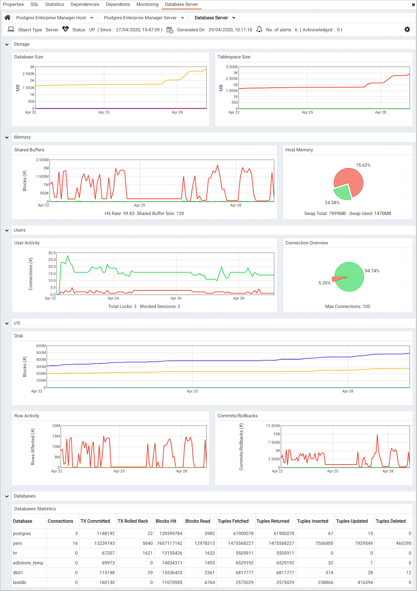
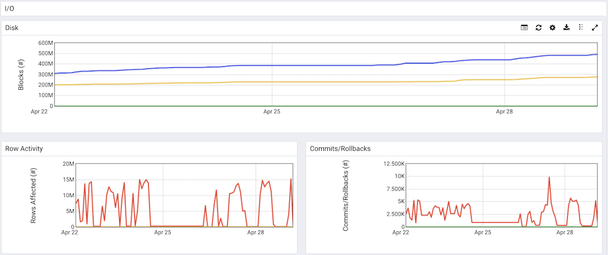
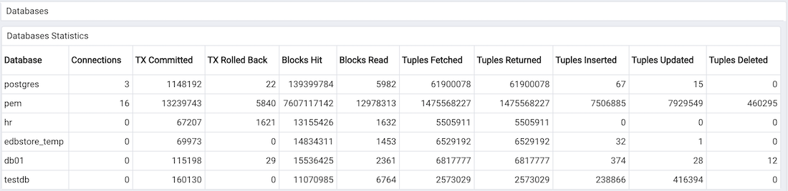

The Server Analysis dashboard provides a graphical analysis of a monitored server's usage statistics.

The Server Analysis dashboard header displays the date and time that the server was started, the date and time that the display was last updated, and the number of current alerts for items monitored by the PEM server.

Use parameters on the [PEM Server Configurations](../02_pem_server_config/#pem_server_config) dialog to specify the auto-refresh rate for the dashboard. To access the `Server Configuration` dialog, select `Server Configuration...` from the PEM web interface `Management` menu.

Graphs within the `Storage` section of the dashboard provide an analysis of the space consumed by databases and tablespaces on the server:

-   The `Database Size` graph displays the size (in Megabytes) of the 5 largest databases that reside on the PEM server. The `Legend` at the bottom of the graph associates each database name with a color in the graph.
-   The `Tablespace Size` graph displays the size (in Megabytes) of the 5 largest tablespaces that reside on the PEM server. The `Legend` at the bottom of the graph associates each tablespace name with a color in the graph.

The `Memory` section of the dashboard provides an overview of the efficiency of the buffer cache over the previous week, and an analysis of the current swap memory usage:

-   The `Shared Buffers` chart compares the number of data blocks found in the shared memory cache with the number of blocks read from disk. A high hit-to-miss ratio indicates an efficiently configured memory cache.
-   The `Host Memory` pie chart displays the current swap memory usage.

The `Users` section of the `Server Analysis` dashboard provides an overview of the user activity on the server:

-   The `User Activity` chart displays connection statistics gathered over the last week. The `Legend` at the bottom of the chart provides a key to the data displayed.
-   The `Connection Overview` pie chart compares the currently active connections to the currently idle connections.

The `I/O` section of the `Server Analysis` dashboard provides an overview of the transactions processed by the server over the last week:

-   The `Disk` chart displays the number of 8KB blocks read from disk, and the number of 8KB blocks written to disk over the last week.
-   The `Row Activity` chart plots row activity on tables stored on the server over the past week. The `Legend` at the bottom of the chart provides a key to the data displayed.
-   The `Commits/Rollbacks` chart displays the number of transactions committed and rolled back on the selected server within the last week. A vertical count on the left side of the graph indicates the aborted transaction count, while the `Legend` at the bottom of the chart provides a key to the commits and rollbacks charted.

The `Database Analysis` table displays a list of the monitored databases that reside on the server, and the statistics gathered for each database over the last week. Click a column heading to sort the table by the data displayed in the column; click again to reverse the sort order.

-   The `Database` column displays the database name.
-   The `Connections` column displays the number of current connections to the database.
-   The `TX Committed` column displays the number of transactions committed to the database within the last week.
-   The `TX Rolled Back` column displays the number of transactions rolled back within the last week.
-   The `Blocks Hit` column displays the number of blocks hit in the cache (in megabytes) within the last week.
-   The `Blocks Read` column displays the number of blocks read from memory (in megabytes) within the last week.
-   The `Tuples Fetched` column displays the number of tuples fetched within the last week.
-   The `Tuples Returned` column displays the number of tuples returned within the last week.
-   The `Tuples Inserted` column displays the number of tuples inserted into the database within the last week.
-   The `Tuples Updated` column displays the number of tuples updated in the database within the last week.
-   The `Tuples Deleted` column displays the number of tuples deleted from the database within the last week.
