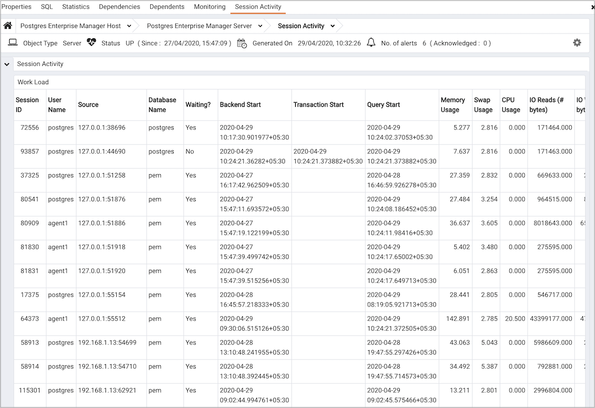

The Session Activity Analysis dashboard provides information about the session workload and lock activity for the selected server:

The Session Activity Analysis dashboard header displays the date and time that the server was started, the date and time that the dashboard was last updated and the number of current alerts for the server.

Use parameters on the [PEM Server Configurations](../02_pem_server_config/#pem_server_config) dialog to specify the auto-refresh rate for the `Session Activity Analysis` dashboard. To access the `Server Configuration` dialog, select `Server Configuration...` from the PEM client `Management` menu.

The `Session Workload` table provides information about the current session workload for the server. Click a column heading to sort the table data by the selected column; click the heading a second time to reverse the sort order. The Session Workload table displays the following information:

-   The `Session ID` column displays the process identifier for the session.
-   The `User Name` column displays the (role) name of the user that established the client connection to the server.
-   The `Source` column displays the IP address and port number of the client.
-   The `Database Name` column displays the name of the database to which the client is connected.
-   The `Waiting` column displays `Yes` if the session is waiting for a lock; `No` if the session is not waiting for a lock.
-   The `Backend Start` column displays the date and time that the client established a connection to the server.
-   The `Transaction Start` column displays the date and time that the current transaction started, if applicable.
-   The `Query Start` column displays the date and time that the current query started, if applicable.
-   The `Memory Usage` column displays the amount of memory used by the session; this column is not displayed if the server is remotely monitored.
-   The `Swap Usage` column displays the amount of swap space used by the session; this column is not displayed if the server is remotely monitored.
-   The `CPU Usage` column displays the amount of CPU resources used by the session; this column is not displayed if the server is remotely monitored.
-   The `IO Reads (#bytes)` column displays the number of bytes used by the session while reading transactions; this column is not displayed if the server is remotely monitored.
-   The `IO Writes (#bytes)` column displays the number of bytes used by the session while writing transactions; this column is not displayed if the server is remotely monitored.

The `Session Lock Activity` table displays a list of locks held by processes on the server. Click a column heading to sort the table data by the selected column; click the heading a second time to reverse the sort order. The Session Lock Activity table displays the following information:

-   The `Session ID` column displays the process ID for the session.
-   The `User Name` column displays the name of the user holding (or waiting for) the lock.
-   The `Source` column displays the IP address and port number of the client.
-   The `Database Name` column displays the name of the database to which the client is connected.
-   The `Blocked` column indicates if the lock request is blocked by another lock.
-   The `Blocked By` column specifies the session ID of the session that is holding the lock.
-   The `Lock Type` column displays the type of lock that is held by the client. Lock Type may be:

> -   `advisory` - a user-defined lock created by pg_advisory_lock() or pg_advisory_lock_shared()
> -   `extend` - a lock held while extending a table or index
> -   `object` - a lock held on a database object
> -   `page` - a lock held on a page (within the shared buffer cache)
> -   `relation` - a lock held on the metadata describing a table, view, or sequence (to prevent another session from altering the table, view, or sequence)
> -   `transactionid` - a lock held on a transaction ID (one session typically waits for another transaction to complete by waiting on the other session's transaction ID)
> -   `tuple` - lock held on a tuple (typically, a tuple which has been inserted, updated, or deleted, but not yet committed)
> -   `userlock` - a user-defined lock created with the LOCK statement
> -   `virtualxid` - a lock identified by a virtual transaction ID.

-   The `Object ID` column displays the OID of the relation, or NULL if the object is not a relation (of part of a relation).
-   The `Mode` column displays the name of the lock mode help (or sought) by the process.
-   The `Transaction Start` column displays the date and time that the transaction started.
