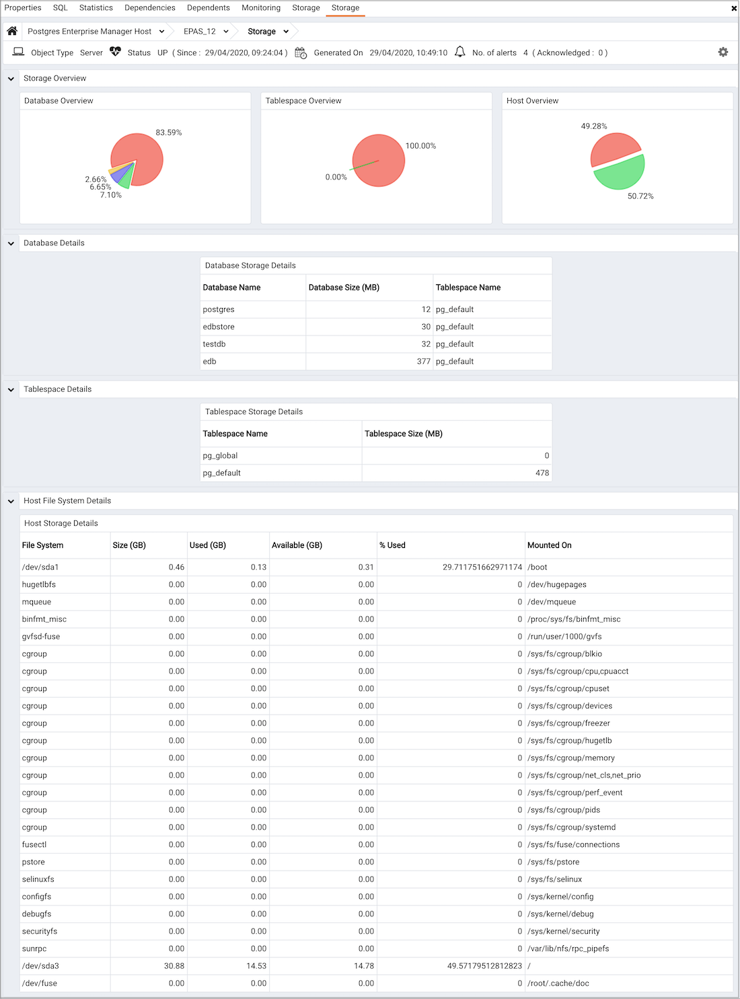

The `Storage Analysis` dashboard provides information about the size of objects stored on the server and about available storage space on the server.

Use parameters on the [PEM Server Configurations](../02_pem_server_config/#pem_server_config) dialog to specify the auto-refresh rate for the dashboard. To access the `Server Configuration` dialog, select `Server Configuration...` from the PEM web interface `Management` menu.

The Storage Analysis dashboard header displays the date and time that the PEM server started, the date and time that the dashboard was most recently updated, and the number of triggered alerts on objects monitored by the PEM server.

The Storage Overview section displays information about the size of databases, tablespaces and the host:

-   The `Database Overview` pie chart shows the relative size of monitored databases stored on the server. The key (located below the chart) matches the database name to the respective color on the chart.
-   The `Tablespace Overview` pie chart shows the relative size of tablespaces on the server. The key (located below the chart) matches the tablespace name to the respective color on the chart.
-   The `Host Overview` pie chart represents the amount of used and free storage space on the server as of the last probe execution.

The `Database Details` table displays the size of each database stored on the server. Click a column heading to sort the table by the specified column; click again to reverse the sort order.

-   The `Database Name` column displays the name of the database.
-   The `Database Size (MB)` column displays the size of the database in megabytes.
-   The `Tablespace Name` column displays the name of the default tablespace assigned to the database.

The `Tablespace Details` table lists the name and size (in megabytes) of each tablespace defined for the server. Click a column heading to sort the table by the specified column; click again to reverse the sort order.

The `Host File System Details` table displays information about the file systems that reside on the system that hosts the PEM server:

-   The `File System` column displays the name of the file system.
-   The `Size (GB)` column displays the size of the file system in megabytes.
-   The `Used (GB)` column displays the amount of the file system that is currently storing information.
-   The `Available (GB)` column displays the amount of space available on the file system.
-   The `% Used` column displays the percentage of the total storage space in use.
-   The `Mounted On` column displays the directory on which the file system is mounted.
