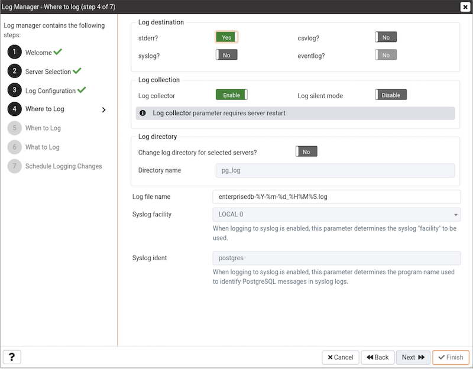

Use the Log Manager wizard to specify logging preferences for a Postgres database server. Log Manager supports Advanced Server and PostgreSQL versions 9.0 (and later). The Log Manager wizard assists in modifying configuration parameters that control:

-   Where log files are written.
-   How often log files are written.
-   The type of information written to log files.
-   The format of log file entries.

Before using Log Manager to define logging properties for a server, you must specify the name of the associated Advanced Server or PostgreSQL database server in the `Service ID` field on the `Advanced` tab of the `New Server Registration` (or `Properties`) dialog. If you do not specify the name of the service in the `Service ID` field, the server will not be made available for configuration on the `Server Selection` dialog.

For example, if you are setting logging preferences for an Advanced Server 9.4 instance that resides on a Linux host, set the `Service ID` field on the `Advanced` tab of the `Properties` dialog for the monitored server to `ppas-9.4`.

Note:  

-   Log manager depends on `Settings` & `Server log Configuration` probes to populate all the fields in the wizard. Therefore, ensure that those probes for selected servers are enabled. In addition, the execution frequency for those probes is set to a minimum to ensure that the log manager reflects the latest log configurations.
-   Please re-run the log manager if you have done any changes related to logging in the configuration files (e.g. `postgresql.conf`) manually. PEM does not reflect those changes automatically.

To run the Log Manager, select the `Log Manager` menu option from the `Management` menu of the PEM client. The wizard opens, welcoming you to the Log Manager:

Click `Next` to continue to the `Server selection` dialog:

The `Server selection` dialog displays a list of the server connections monitored by PEM. Check the box next to the name of a server (or servers) to which the Log Manager wizard will apply the specified configuration. Log Manager is disabled for any server displaying a red exclamation mark to the left of its name in the Server selection tree control; there are several reasons that a server may not be enabled:

> -   Only a server that specifies a `Service ID` on the `Advanced` tab of the `Properties` dialog can be configured by Log Manager.
>
> > To provide a service ID, right click on the server name in the tree control, and select `Disconnect Server` from the context menu; if prompted, provide a password. Then, open the context menu for the server, and select `Properties`. Navigate to the `Advanced` tab, and provide the name of the service in the `Service ID` field; click `Save` to save your change and exit the dialog.
>
> -   If the PEM agent bound to the server does not have sufficient privileges to restart the server, the server will be disabled.
> -   If the PEM agent bound to the server is an older version than the associated PEM server, the server will be disabled.

Click `Next` to continue:

Use options within the `Import logs` box to specify how often log files will be imported to PEM.

-   Set the `Import logs to PEM` switch to `Yes` to specify that log files will be imported to PEM, and displayed on the Server Log Analysis dashboard.
-   Use the `Import Frequency` drop-down list box to specify how often log files are imported to PEM. This option is only enabled when the `Import logs to PEM` option is enabled. The default value is 5 minutes.

Use the options in the `Log rotation configuration` box to specify the maximum length (lifespan or size) of a log file.

-   Use the `Rotation size` field to specify the maximum size in megabytes of an individual log file. The default value is 10 MB; when set to 0, no limit is placed on the maximum size of a log file.
-   Use the `Rotation time` field to specify the number of whole days that should be stored in each log file. The default value is 1 day.

Use the `Truncate on Rotation` switch to specify server behavior for time-based log file rotation:

-   Select `ON` to specify that the server should overwrite any existing log file that has the same name that a new file would take.
-   Select `OFF` to specify that the server should append any new log file entries to an existing log file with the same name that a new log file would take. This is the default behavior.

Click `Next` to continue to the `Where to Log` dialog:

Use the fields on the `Where to Log` dialog to specify where log files should be written. Select an option from the `Log destination` box to specify a destination for the server log output:

-   Set the `stderr` switch to `Yes` to specify that log files should be written to `stderr`. By default, server log entries are written to `stderr`.
-   Set the `csvlog` switch to `Yes` to specify that log files should be written to file in a comma-separated value format. This option is automatically enabled (and no longer editable) if you have selected `Import logs to PEM` on the `Schedule` dialog; if you are not importing server log files to PEM, this option is editable.
-   Set the `syslog` switch to `Yes` to specify that log files should be written to the system log files.
-   On Windows, set the `eventlog` switch to `Yes` to specify that log files should be written to the event log.

Use options in the `Log collection` box to specify collection preferences. Use the `Log Collector` switch to instruct the server to re-direct captured log messages (directed to STDERR) into log files:

-   Specify `Enable` to instruct the server to re-direct captured error messages to a log file. By default, Log Collector is enabled.
-   Specify `Disable` to instruct the server that it should not re-direct error messages to a log file.

Use the `Log Silent Mode` switch to instruct the server to run silently in the background, disassociated from the controlling terminal:

-   Select `Enable` to instruct the server to run silently in the background.
-   Select `Disable` to instruct the server to display log file entries on the controlling terminal as each log entry is written.

Use options in the Log Directory box to specify log file location preferences:

-   Set the `Change log directory for selected servers?` switch to `Yes` to specify that each set of log files should be maintained in a separate directory.
-   When `Log Collector` is enabled, you can use the `Directory name` field to specify the directory to which the log file will be written. By default, logs are written to the `pg_log` directory under the installation directory of the monitored server.

When `Import logs to PEM` is disabled, you can use the `Log file name` field to specify the filename to which the logs will be written. The 'DEFAULT' value in the `Log File Name` field represents 'postgresql-%Y-%m-%d\_%H%M%S.log' for all the PostgreSQL servers and 'enterprisedb-%Y-%m-%d\_%H%M%S.log' for all the Postgres Plus Advanced Servers.

When logging to `syslog` is enabled, you can use the `Syslog facility` drop-down list box to specify which syslog facility should be used.

When logging to `syslog` is enabled, you can use the `Syslog ident` field to specify the program name that will identify Advanced Server entries in system logs.

Note: Changing `eventlog` & `Log Collector` parameter requires database server restart

Click `Next` to continue:

Use the fields on the `When to Log` dialog to specify which events will initiate a log file entry. The severity levels (in order of severity, from most severe to least severe) are:

|                       |                                                                                    |
| --------------------- | ---------------------------------------------------------------------------------- |
| Severity              | Description                                                                        |
| panic                 | Errors that cause all database sessions to abort.                                  |
| fatal                 | Errors that cause a session to abort.                                              |
| log                   | Information messages of interest to administrators.                                |
| error                 | Errors that cause a command to abort.                                              |
| warning               | Error conditions in which a command will complete but may not perform as expected. |
| notice                | Items of interest to users. This is the default.                                   |
| info                  | Information implicitly requested by the user.                                      |
| debug5 through debug1 | Detailed debugging information useful to developers                                |

-   Use the `Client min messages` drop-down list box to specify the minimum severity level that will be sent to the client application. The default value is `notice`.
-   Use the `Log min messages` drop-down list box to specify the minimum severity level that will be written to the server log. The default value is `warning`.
-   By default, when an error message is written to the server log, the text of the SQL statement that initiated the log entry is not included. Use the `Log min error statement` drop-down list box to specify a severity level that will trigger SQL statement logging. If a message is of the specified severity or higher, the SQL statement that produced the message will be written to the server log. The default value is `error`.
-   Use the `Log min duration statement` field to specify a statement duration (in milliseconds); any statements that exceed the specified number of milliseconds will be written to the server log. The length of time that it took for the statement to execute will be included in the log entry. A value of -1 disables all duration-based logging; a value of 0 logs all statements and their duration. The default value is `-1`.
-   Use the `Log temp files` field to specify a file size in kilobytes; when a temporary file reaches the specified size, it will be logged. The default value is `-1`.
-   Use the `Log autoVacuum min duration` field to specify a time length in milliseconds; if auto-vacuuming exceeds the length of time specified, the activity will be logged. The default value is `-1`.

Click `Next` to continue to the `What to log` dialog:

Use the fields on the `What to log` dialog to specify log entry options that are useful for debugging and auditing.

The switches in the `Debug options` box instruct the server to include information in the log files related to query execution that may be of interest to a developer:

-   Set the `Parse tree` switch to `Yes` to instruct the server to include the parse tree in the log file. The default value is `No`.
-   Set the `Rewriter output` switch to `Yes` to instruct the server to include query rewriter output in the log file. The default value is `No`.
-   Set the `Execution plan` switch to `Yes` to instruct the server to include the execution plan for each executed query in the log file. The default value is `No`.

By default, `Indent Debug Options Output in Log` option is set to `No`. When this option is enabled, the server indents each line that contains a parse tree entry, a query rewriter entry or query execution plan entry. While indentation makes the resulting log file more readable, it results in a longer log file. To enable indentation of log file entries related to debugging, move the switch to `Yes`.

Use the switches in the `General options` box to instruct the server to include auditing information in the log file:

-   Set the `Checkpoints` switch to `Yes` to include checkpoints and restartpoints in the server log. By default, this is set to `No`.

-   Set the `Connections` switch to `Yes` to include each attempted connection to the server (as well as successfully authenticated connections) in the server log. By default, this is set to `No`.

-   Set the `Disconnections` switch to `Yes` to include a server log entry for each terminated session that provides the session information and session duration. By default, this is set to `No`.

-   Set the `Duration` switch to `Yes` to include the amount of time required to execute each logged statement in the server log. By default, this is set to `No`.

-   Set the `Hostname` switch to `Yes` to include both the IP address and host name in each server log entry (by default, only the IP address is logged). Please note that this may cause a performance penalty. By default, this is set to `No`.

-   Set the `Lock Waits` switch to `Yes` to instruct the server to write a log entry for any session that waits longer than the time specified in the `deadlock_timeout` parameter to acquire a lock. This is useful when trying to determine if lock waits are the cause of poor performance. By default, this is set to `No`.

-   Use the `Error verbosity` drop-down list box to specify the detail written to each entry in the server log.

    > -   Select `default` to include the error message, DETAIL, HINT, QUERY and CONTEXT in each server log entry.
    > -   Select `terse` to log only the error message, excluding the DETAIL, HINT, QUERY and CONTEXT information from each server log entry.
    > -   Select `verbose` to include the error message, the DETAIL, HINT, QUERY and CONTEXT error information, SQLSTATE error code and source code file name, the function name, and the line number that generated the error.

-   Use the `Prefix string` field to specify a printf-style string that is written at the beginning of each log file entry. The `Escape` characters in the following table represent the information described in the `Information` column. Some information is available to `Session` processes only; `Helper` processes can provide all of the information specified in the `Prefix String`. The default value is %t (timestamp without milliseconds).

You can include:

|                                  |                                                                                                                                   |                |
| -------------------------------- | --------------------------------------------------------------------------------------------------------------------------------- | -------------- |
| Escape                           | Information                                                                                                                       | Session/Helper |
|    %a   | Application Name                                                                                                                  | Session        |
|    %u   | User Name                                                                                                                         | Session        |
|    %d   | Database Name                                                                                                                     | Session        |
|    %r   | Remote host name or IP address, and remote port                                                                                   | Session        |
|    %h   | Remote host name or IP address                                                                                                    | Session        |
|    %p   | Process ID                                                                                                                        | Helper         |
|    %t   | Time stamp without milliseconds                                                                                                   | Helper         |
|    %m   | Time stamp with milliseconds                                                                                                      | Helper         |
| %i                               | Command tag: type of statement that generated the log entry                                                                       | Session        |
|    %e   | SQLSTATE error code                                                                                                               | Helper         |
|    %c   | Session identifier                                                                                                                | Helper         |
|    %l   | Line number of the log entry                                                                                                      | Helper         |
|    %s   | Process start time stamp                                                                                                          | Helper         |
|    %v   | Virtual transaction ID (backendID/localXID)                                                                                       | Helper         |
|    %x   | Transaction ID (`0` if not assigned)                                                                                              | Helper         |
| %q                               | Produces no output, but instructs non-session processes to stop at this point in the string; will be ignored by session processes | Helper         |
|    %%   | Literal %                                                                                                                         | Helper         |

-   Use the `Statements` drop-down list box to specify which SQL statements will be included in the server log. The default is `none`; valid options are:

    > -   `none` - Specify `none` to disable logging of SQL statements.
    > -   `ddl` - Specify `ddl` to instruct the server to log ddl (data definition language) statements, such as CREATE, ALTER, and DROP.
    > -   `mod` - Specify `mod` to instruct the server to log all `ddl` statements, as well as all `dml` (data modification language) statements, such as INSERT, UPDATE, DELETE, TRUNCATE and COPY FROM.
    > -   `all` - Specify `all` to instruct the server to log all SQL statements.

Click `Next` to continue:

Use the options on the `Schedule Logging Changes` dialog to select a time that logging configuration changes will be applied. Note that when you apply the configuration changes specified with the Log Manager wizard, the server will be restarted, temporarily interrupting use of the database server for users.

-   Set the `Configure Logging Now` switch to `Yes` to specify that PEM will configure logging and restart the server when you have completed the Log Manager wizard.
-   Set the `Configure Logging Now` switch to `No` and use the `Schedule it for some other time` date selector to specify a a convenient time for the server to restart.

Click `Finish` to complete the wizard, and either restart the server, or schedule the server restart for the time specified on the scheduling dialog.

When you have completed the Log Manager wizard, you can use the `Scheduled Tasks` dialog to confirm that the configuration file update and server restart have been scheduled.
