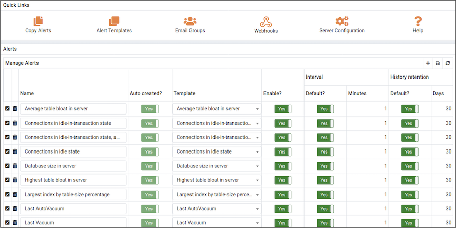
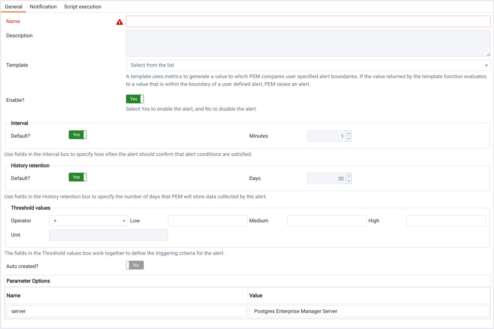
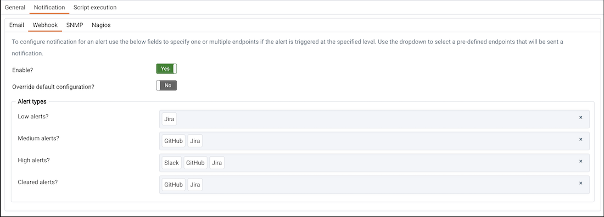
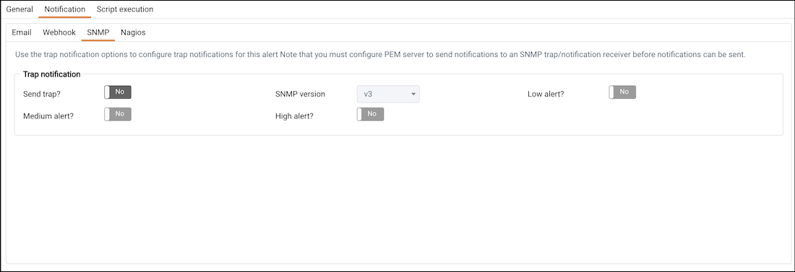
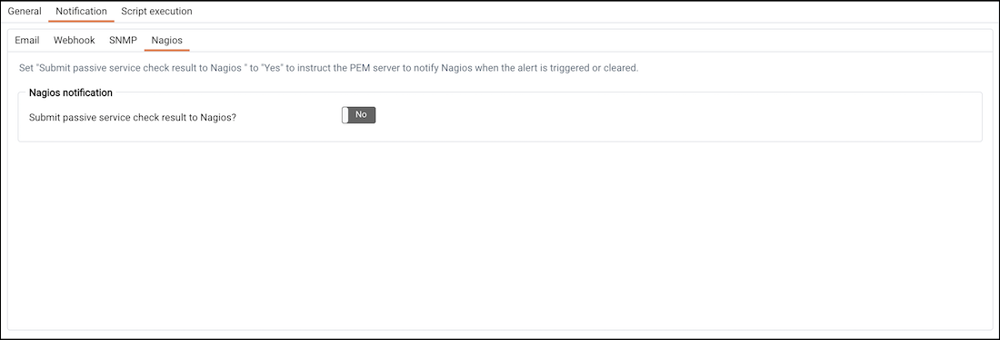
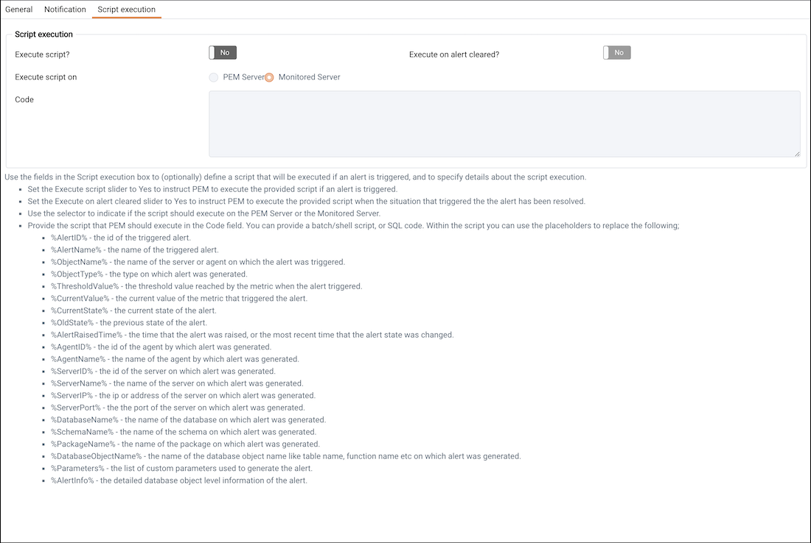
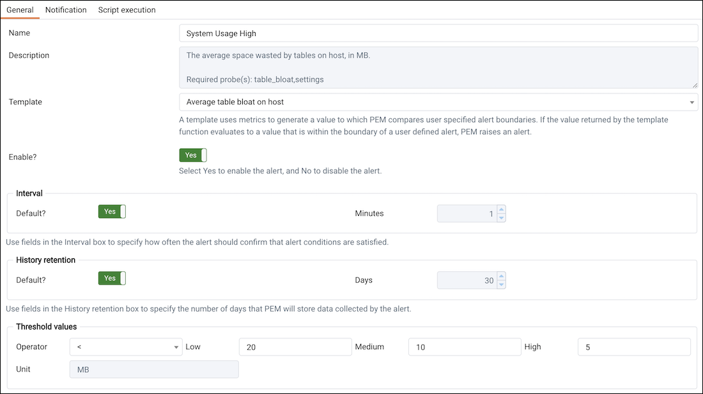
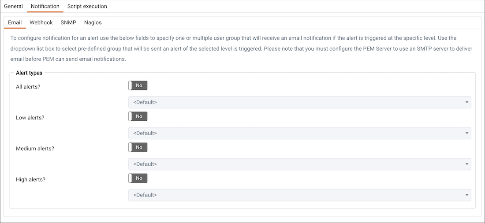
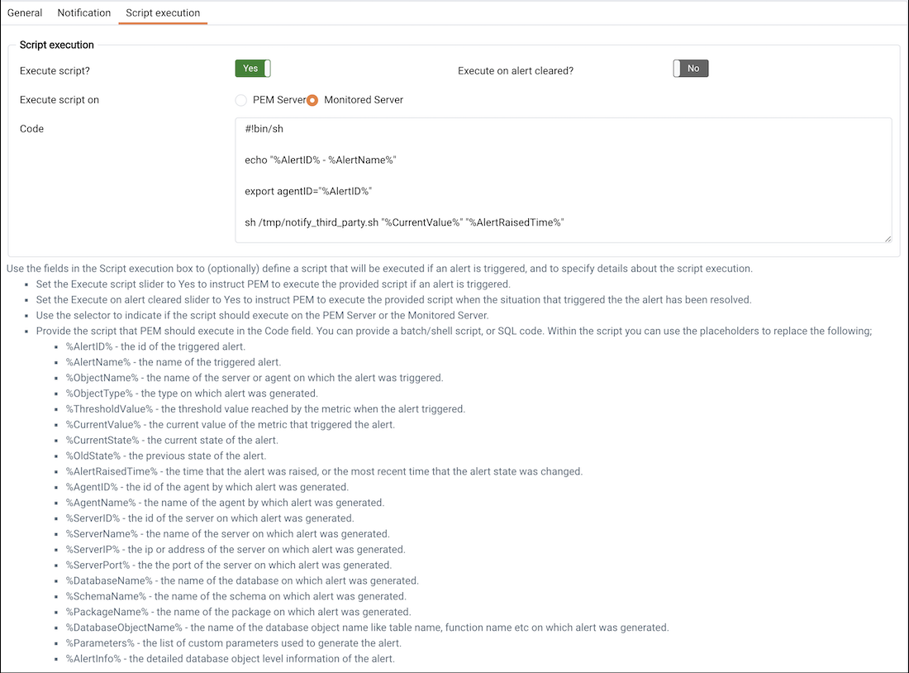

<div id="pem_alerting_dialog" class="registered_link"></div>

Use options accessed through the `Manage Alerts` tab to create, copy, or modify an alert. To open the `Manage Alerts` tab, select `Manage Alerts...` from the PEM client's `Management` menu.



Use the `Quick Links` toolbar to open dialogs and tabs that you can use to manage alerts and alerting behavior:

> -   Select `Copy Alerts` to open the [Copy Alert Configuration](02_pem_alert_copy/#pem_alert_copy) dialog and copy an alert definition.
> -   Select `Alert Templates` to open the [Alert Template](04_pem_custom_alert_templates/#pem_custom_alert_templates) tab, and create or modify an alert template.
> -   Select `Email Groups` to open the [Email Groups](05_pem_email_groups/#pem_email_groups) tab, and manage or create an email group.
> -   Select `Webhooks` to open the [Webhooks](06_pem_webhooks/#pem_webhooks) tab, and manage or create a webhook endpoint.
> -   Select `Server Configuration` to open the [server configuration](../02_pem_server_config/#pem_server_config) dialog and review or modify server configuration settings.
> -   Select `Help` to open the PEM online help.

The `Alerts` table displays the alerts that are defined for the item currently highlighted in the PEM client tree control. You can use the `Alerts` table to modify an existing alert, or to create a new alert.

## Creating a New Alert

To open the alert definition dialog and create a new alert, click the `Add` icon (+) in the upper-right corner of the table.



Use the fields on the `General` tab to provide information about the alert:

-   Enter the name of the alert in the `Name` field.
-   Use the drop-down listbox in the `Template` field to select a template for the alert. An alert template is a function that uses one (or more) metrics or parameters to generate a value to which PEM compares user-specified alert boundaries. If the value returned by the template function evaluates to a value that is within the boundary of a user-defined alert (as specified by the `Operator` and `Threshold values` fields), PEM raises an alert, adds a notice to the `Alerts overview` display, and performs any actions specified on the template.
-   Use the `Enable?` switch to specify if the alert is enabled (`Yes`) or disabled (`No`).
-   Use the controls in the `Interval` box to specify how often the alert should confirm if the alert conditions are satisfied. Use the `Minutes` selector to specify an interval value. Use the `Default` switch to set or reset the `Minutes` value to the default (recommended) value for the selected template.
-   Use controls in the `History retention` box to specify the number of days that PEM will store data collected by the alert. Use the `Days` selector to specify the number of days that the data will be stored. Use the `Default` switch to set or reset the `Days` value to the default value (30 days).
-   Use controls in the `Threshold values` box to define the triggering criteria for the alert. When the value specified in the `Threshold Values` fields evaluates to greater-than or less-than the system value (as specified with the `Operator`), PEM will raise a `Low`, `Medium` or `High` level alert:

> -   Use the `Operator` drop-down listbox to select the operator that PEM will use when evaluating the current system values.
>     -   Select a greater-than sign (>) to indicate that the alert should be triggered when the system values are greater than the values entered in the `Threshold values` fields.
>     -   Select a less-than sign (&lt;) to indicate that the alert should be triggered when the system values are less than the values entered in the `Threshold values` fields.
> -   Use the threshold fields to specify the values that PEM will compare to the system values to determine if an alert should be raised. Please note that you must specify values for all three thresholds (`Low`, `Medium`, and `High`):
>     -   Enter a value that will trigger a low-severity alert in the `Low` field.
>     -   Enter a value that will trigger a medium-severity alert in the `Medium` field.
>     -   Enter a value that will trigger a high-severity alert in the `High` field.

The `Parameter Options` table contains a list of parameters that are required by the selected template; the table displays both pre-defined parameters, and parameters for which you must specify a value. Please note that you must specify a value for any parameter that displays a prompt in the `Value` column.

Use the `Notification` tab to specify how PEM will behave if an alert is raised.


PEM can send a notification or execute a script if an alert is triggered, or if an alert is cleared.

Use the fields in the `Email` tab to specify the email group that will receive an email notification if the alert is triggered at the specified level. Use the [Email Groups](05_pem_email_groups/#pem_email_groups) tab to create an email group that contains the address of the user or users that will be notified when an alert is triggered. To access the `Email Groups` tab, click the `Email Groups` icon located in the `Quick Links` menu of the `Manage Alerts` tab.

To instruct PEM to send an email when a specific alert level is reached, set the slider next to an alert level to `Yes`, and use the drop-down listbox to select the pre-defined user or group that will be notified.

Please note that you must [configure the PEM Server](../02_pem_server_config/#pem_server_config) to use an SMTP server to deliver email before PEM can send email notifications.



Use the fields in the `Webhook` tab to specify the webhook endpoints that will receive a notification if the alert is triggered at the specified level. Use the [Webhooks](06_pem_webhooks/#pem_webhooks) tab to create an endpoint that contains the details of URL that will be notified when an alert is triggered along with other details like payload. To access the `Webhooks` tab, click the `Webhooks` icon located in `Quick Links` menu of the `Manage Alerts` tab.

By default `Webhook` notifications will be sent to created endpoints according to their default settings. To disable the `Webhook` set the slider next to `Enable` field to `No`.

Also to override default settings set the slider next to `Override default configuration?` to `Yes`, and use the drop-down listbox to select the pre-defined endpoints.



Use the `Trap notification` options to configure trap notifications for this alert:

-   Set the `Send trap` slider to `Yes` to send SNMP trap notifications when the state of this alert changes.
-   Set the `SNMP Ver` to `v1`, `v2`, or `v3` to identify the SNMP version.
-   Use the `Low alert`, `Med alert` and `High alert` sliders to select the level(s) of alert that will trigger the trap. For example, if you set the slider next to `High alert` to `Yes`, PEM will send a notification when an alert with a high severity level is triggered.

Please note that you must [configure the PEM Server](../02_pem_server_config/#pem_server_config) to send notifications to an SNMP trap/notification receiver before notifications can be sent. For sending SNMP v3 traps, pemAgent will use 'User Security Model(USM)' which is in charge of authenticating, encrypting, and decrypting SNMP packets.

Also note while sending SNMP v3 traps, agent will create snmp_boot_counter file. This file will get created in location mentioned by batch_script_dir parameter in agent.cfg, if this parameter is not configured or if directory is not accessible due to authentication restrictions then in operating systems temporary directory, if that is also not possible then in user’s home directory.

Please see [How SNMP traps are formed?](08_snmp_trap_details/#snmp_trap_details)



Use the field in the `Nagios notification` box to instruct the PEM server to notify Nagios network-alerting software when the alert is triggered or cleared. For detailed information about configuring and using Nagios with PEM, please see [Using PEM with Nagios](09_using_pem_with_nagios/#using_pem_with_nagios).

-   Set the `Submit passive service check result to Nagios` switch to `Yes` to instruct the PEM server to notify Nagios when the alert is triggered or cleared.



Use the fields in the `Script execution` tab to (optionally) define a script that will be executed if an alert is triggered, and to specify details about the script execution.

-   Set the `Execute script` slider to `Yes` to instruct PEM to execute the provided script if an alert is triggered.
-   Set the `Execute on alert cleared` slider to `Yes` to instruct PEM to execute the provided script when the situation that triggered the alert has been resolved.
-   Use the radio buttons next to `Execute script on` to indicate that the script should execute on the `PEM Server` or the `Monitored Server`.
-   Provide the script that PEM should execute in the `Code` field. You can provide a batch/shell script, or SQL code. Within the script, you can use placeholders for the following:
    -   `%AlertID%` - this placeholder will be replaced with the id of the triggered alert.
    -   `%AlertName%` - this placeholder will be replaced with the name of the triggered alert.
    -   `%ObjectName%` - this placeholder will be replaced with the name of the server or agent on which the alert was triggered.
    -   `%ObjectType%` - this placeholder will be replaced with the type of the object on which the alert was triggered.
    -   `%ThresholdValue%` - this placeholder will be replaced with the threshold value reached by the metric when the alert triggered.
    -   `%CurrentValue%` - this placeholder will be replaced with the current value of the metric that triggered the alert.
    -   `%CurrentState%` - this placeholder will be replaced with the current state of the alert.
    -   `%OldState%` - this placeholder will be replaced with the previous state of the alert.
    -   `%AlertRaisedTime%` - this placeholder will be replaced with the time that the alert was raised, or the most recent time that the alert state was changed.
    -   `%AgentID%` - this placeholder will be replaced with the id of the agent by which alert was generated.
    -   `%AgentName%` - this placeholder will be replaced with the name of the agent by which alert was generated.
    -   `%ServerID%` - this placeholder will be replaced with the id of the server on which alert was generated.
    -   `%ServerName%` - this placeholder will be replaced with the name of the server on which alert was generated.
    -   `%ServerIP%` - this placeholder will be replaced with the IP or address of the server on which alert was generated.
    -   `%ServerPort%` - this placeholder will be replaced with the port of the server on which alert was generated.
    -   `%DatabaseName%` - this placeholder will be replaced with the name of the database on which alert was generated.
    -   `%SchemaName%` - this placeholder will be replaced with the name of the schema on which alert was generated.
    -   `%PackageName%` - this placeholder will be replaced with the name of the package on which alert was generated.
    -   `%DatabaseObjectName%` - this placeholder will be replaced with the name of the database object on which alert was generated.
    -   `%Parameters%` - this placeholder will be replaced with the list of custom parameters used to generate the alert.
    -   `%AlertInfo%` - this placeholder will be replaced with the detailed database object level information of the alert.

When you have defined the alert attributes, click the edit icon to close the alert definition editor, and then the save icon (in the upper-right corner of the `Alerts` table). To discard your changes, click the refresh icon; a popup will ask you to confirm that you wish to discard the changes.

!!! Note
    Suppose you need to use the alert configuration placeholder values in an external script. You can do it either by passing them as the command-line arguments or exporting them as environment variables. Please note that the external script must have proper execution permissions.

    -   You can run the script with any of the placeholders as command-line argument.

        For eg:

        > ```bash
        > #!/bin/bash
        >
        > bash <path_to_script>/script.sh "%AlertName%  %AlertLevel% %AlertDetails%"
        > ```

    -   You can define the environment variables for any of the placeholders and then use those environment variables in the script.

        For eg:

        > ```bash
        > #!/bin/bash
        >
        > export AlertName=%AlertName%
        > export AlertState=%AlertState%
        >
        > bash <path_to_script>/script.sh
        > ```

## Modifying an Existing Alert

Use the `Alerts` table to manage an existing alert or create a new alert. Highlight an object in the PEM client tree control to view the alerts that monitor that object.


You can modify some properties of an existing alert in the `Alerts` table:

> -   The `Name` column displays the name of the alert; to change the alert name, simply replace the name in the table, and click the save icon.
> -   The `Auto created?` column indicates if the alert definition was automatically created; `Yes` indicates that the alert was created by PEM, and `No` indicates that the alert was manually created.
> -   The `Template` column displays the name of the alert template that specifies properties used by the alert. You can use the drop-down listbox to change the alert template associated with an alert.
> -   Use the `Enable?` switch to specify if an alert is enabled (Yes) or disabled (No).
> -   Use the `Interval` column to specify how often PEM should check to see if the alert conditions are satisfied. Set the `Default` switch to `No` and specify an alternate value (in `Minutes`), or return the `Default` switch to `Yes` to reset the value to its default setting. By default, PEM will check the status of each alert once every minute.
> -   Use the `History retention` field to specify the number of days that PEM will store data collected by the alert. Set the `Default` switch to `No` and specify an alternate value (in `Days`), or return the `Default` switch to `Yes` to reset the value to its default setting. By default, PEM will recommend storing historical data for 30 days.

Click the `Edit` icon to the left of an alert name to open the `Alert details` editor and access the complete alert definition. After modifying an alert in the editor, click the `Save` button to make your changes persistent.

## Deleting an Alert

To mark an alert for deletion, highlight the alert name in the `Alerts` table and click the delete icon to the left of the name; the alert will remain in the list, but in red strike-through font.


The delete icon acts as a toggle; you can undo the deletion by clicking the delete icon a second time; when you click the Save icon, the alert definition will be permanently deleted.

## Example

The screen shown below defines an alert (named System Usage High) that monitors the committed transactions on the system:



To re-create this example, highlight the name of a PEM Agent in the tree-control, and select `Manage Alerts...` from the PEM client `Management` menu. When the `Manage Alerts` tab opens, click the add icon (+) in the upper-right hand corner of the `Alerts` table to open the alert editor.

Fields on the `General` tab instruct PEM to use the Disk busy percentage template to create the alert. The PEM server will check the free memory available once every minute, and:

-   Trigger a low-severity alert if the free memory available drops below 20%
-   Trigger a medium-severity alert if the free memory available drops below 10%
-   Trigger a high-severity alert if the free memory available drops below 5%





Fields on the `Notifications` tab instruct PEM to:

-   Send an email notification to the `administrator` email group.
-   Submit a passive service check result to Nagios.
-   Execute the script shown in the `Code` field when the alert is triggered.

> -   To invoke a script on a Linux system, you must modify the entry for `batch_script_user` parameter of agent.cfg file and specify the user that should be used to run the script. You can either specify a non-root user or root for this parameter. If you do not specify a user, or the specified user does not exist, then the script will not be executed. Restart the agent after modifying the file. If pemagent is being run by a non-root user then the value of `batch_script_user` will be ignored and the script will be executed by the same non-root user that is being used for running the pemagent.
> -   To invoke a script on a Windows system, set the registry entry for `AllowBatchJobSteps` to true and restart the PEM agent. PEM registry entries are located in HKEY_LOCAL_MACHINE\\Software\\Wow6432Node\\EnterpriseDB\\PEM\\agent.

Click the edit icon to close the editor and add the example to the `Alert List`; click the save icon before closing the `Manage Alerts` tab to save your work.
