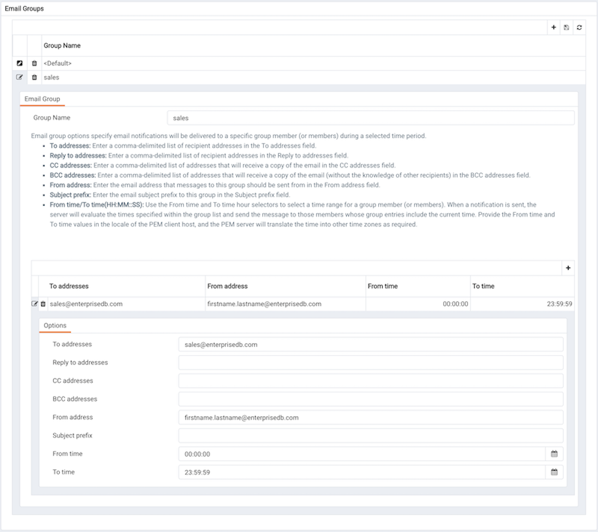

Postgres Enterprise Manager monitors your system for conditions that require user attention. You can use an email group to specify the email addresses of users that the server will notify if current values deviate from threshold values specified in an alert definition. An email group has the flexibility to notify multiple users, or target specific users during user-defined time periods.

Please note that you must configure the PEM Server to use an SMTP server to deliver email before PEM can send email notifications.

Use the `Email Groups` tab to configure groups of SMTP email recipients. To access the `Email Groups` tab, select `Manage Alerts...` from the PEM client's `Management` menu; when the `Manage Alerts` tab opens, select `Email Groups` from the `Quick Links` toolbar.

The `Email Groups` tab displays a list of the currently defined email groups. Highlight a group name and click the edit icon (at the far left end of the row) to modify an existing group.

To define a new email group, click the Add icon (+) in the upper-right corner of the table.

Use the `Email Group` tab to define an email group and its members:

-   Provide a name for the email group in the `Group name` field.

Each row within the email group definition will associate a unique set of email addresses with a specific time period. When an alert is triggered, the server will evaluate the times specified in each row and send the message to those group members whose definitions are associated with the time that the alert triggered.

Click the Add icon (+) in the group members table to open the `Options` tab, and add the member addresses that will receive notifications for the time period specified:

-   Enter a comma-delimited list of recipient addresses in the `Reply to addresses` field.
-   Enter a comma-delimited list of return addresses in the `Reply to addresses` field.
-   Enter a comma-delimited list of addresses that will receive a copy of the email in the `Cc addresses` field.
-   Enter a comma-delimited list of addresses that will receive a copy of the email (without the knowledge of other recipients) in the `Bcc addresses` field.
-   Enter the email address that messages to this group should be sent from in the `From address` field.
-   Provide a comment that will be used as a subject line prefix for any emails sent as part of a notification in the `Subject prefix` field.
-   Use the `From time` and `To time` time selectors to specify the time range for notifications to the group member(s) that are identified on this row of the email group dialog. When an alert is triggered, the server will evaluate the times specified in each row and send the message to those group members whose definitions include the current time. Provide the `From time` and `To time` values in the locale of the PEM client host, and the PEM server will translate the time into other time zones as required.

When you've identified the member or members that will receive an email during a specific time period, click the add icon to specify another time period and the email addresses that will be notified during those hours. When you've finished defining the email group, click the save icon.

## Deleting an Email Group

To mark an email group for deletion, highlight the group name in the `Email Groups` table and click the delete icon to the left of the name; the alert will remain in the list, but in red strike-through font.

The delete icon acts as a toggle; you can undo the deletion by clicking the delete icon a second time; when you click the save icon, the email group definition will be permanently deleted.
