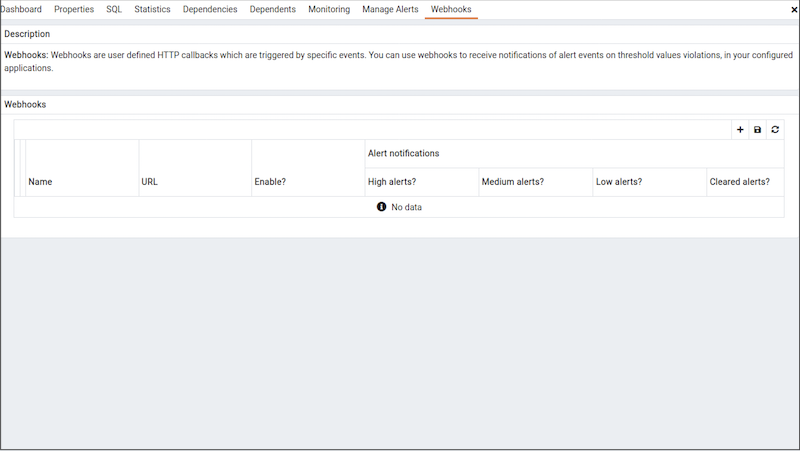
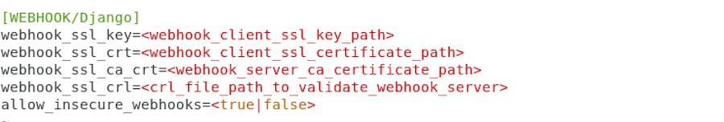
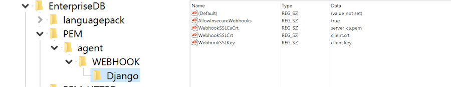
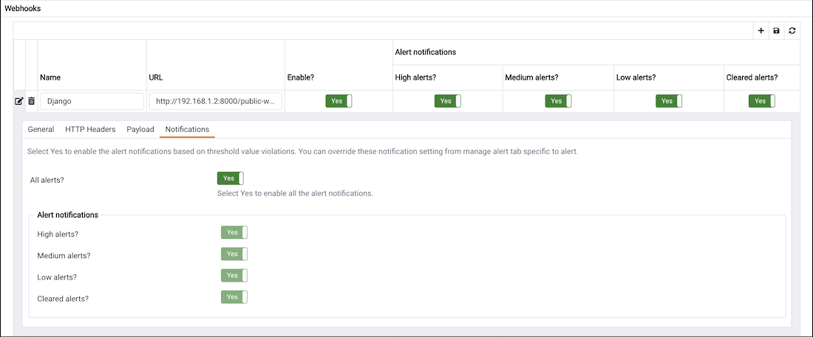
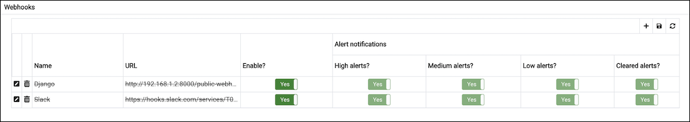

Postgres Enterprise Manager monitors your system for conditions that require user attention. You can use a webhook to create the endpoints that will receive a notification if current values deviate from threshold values specified in an alert definition. PEM sends a notification to multiple webhook endpoints, or to specific target webhook endpoints based on the events triggered.

Please note that you must configure the PEM Server to use webhooks to receive notification of alert events on threshold value violations in your configured applications.

Use the `Webhooks` tab to configure endpoint recipients. To access the `Webhooks` tab, select `Manage Alerts...` from the PEM client's `Management` menu; when the `Manage Alerts` tab opens, select `Webhooks` from the `Quick Links` toolbar.

The `Webhooks` tab displays a list of the currently defined recipient applications as endpoints. Highlight an endpoint and click the edit icon (at the far left end of the row) to modify an existing endpoint.

## Creating a Webhook

To define a new webhook, click the `Add` icon (+) in the upper-right corner of the table.

Use the `General` tab to define the basic details of the webhook:

-   Provide a name for the webhook in the `Name` field.
-   Specify a webhook URL where all the notifications will be delivered in the `URL` field.
-   Set the request method type used to make the call in the `Request Method` field i.e. `POST` or `PUT`.
-   By default `webhooks` will be enabled; to disable a webhook set `Enable?` to `No`.

!!! Note
    The above `Enable?` setting will work only if `enable_webhook` parameter is set to true in `agent.cfg` file. By default, `enable_webhook` parameter is set to true only for the Agent running on the PEM Server Host. For all other Agents running on other hosts, it needs to be set to true manually.

## Defining a Webhook SSL configurations

You can define the Webhook SSL parameters in the respective agent configuration file or registry in windows. You can find the list of Webhook SSL parameters in [PEM Agent Configuration Parameters](../../02_toc_pem_agent/02_pem_agent_binding/01_pem_agent_config_params/#pem_agent_config_params) section. If you add or remove any of the agent configuration parameters, you must restart the agent to apply them.

> -   On 32 bit Windows systems, PEM registry entries for Webhooks are located in HKEY_LOCAL_MACHINE\\Software\\EnterpriseDB\\PEM\\agent\\WEBHOOK
> -   On 64 bit Windows systems, PEM registry entries for Webhooks are located in HKEY_LOCAL_MACHINE\\Software\\Wow6432Node\\EnterpriseDB\\PEM\\agent\\WEBHOOK
> -   On Linux systems, PEM configuration options for Webhooks are stored in the agent.cfg file, located (by default) in /usr/edb/pem/agent/etc

Use the `HTTP Headers` tab to define the header parameters to pass while calling the webhook endpoints:

-   All the values will be specified as a key and value pair.
-   Specify a key parameter in the `Key` field and a value in the `Value` field.
-   To add multiple `HTTP Headers`, click the `Add` icon (+) in the upper-right corner of the `HTTP Headers` table.
-   To delete the `HTTP Headers`, click on `Delete` icon to the left of the `Key`; the alert will remain in the list, but in strike-through font. Click the `Save` button to reflect the changes.
-   To edit the `HTTP Headers`, click on the `Edit` icon to the left of `Key`.

Use the `Payload` tab to define the JSON data to be sent to the endpoint when an alert is triggered:

-   `Type` specifies data to be sent in format type (i.e. JSON).

-   Use `Template` to configure JSON data sent to endpoints. Within the `Template`, you can use placeholders for the following:

    > -   `%AlertID%` - the id of the triggered alert.
    > -   `%AlertName%` - the name of the triggered alert.
    > -   `%ObjectName%` - the name of the server or agent on which the alert was triggered.
    > -   `%ObjectType%` - the type on which alert was generated.
    > -   `%ThresholdValue%` - the threshold value reached by the metric when the alert triggered.
    > -   `%CurrentValue%` - the current value of the metric that triggered the alert.
    > -   `%CurrentState%` - the current state of the alert.
    > -   `%OldState%` - the previous state of the alert.
    > -   `%AlertRaisedTime%` - the time that the alert was raised, or the most recent time that the alert state was changed.
    > -   `%AgentID%` - the id of the agent by which alert was generated.
    > -   `%AgentName%` - the name of the agent by which alert was generated.
    > -   `%ServerID%` - the id of the server on which alert was generated.
    > -   `%ServerName%` - the name of the server on which alert was generated.
    > -   `%ServerIP%` - the ip or address of the server on which alert was generated.
    > -   `%ServerPort%` - the the port of the server on which alert was generated.
    > -   `%DatabaseName%` - the name of the database on which alert was generated.
    > -   `%SchemaName%` - the name of the schema on which alert was generated.
    > -   `%PackageName%` - the name of the package on which alert was generated.
    > -   `%DatabaseObjectName%` - the name of the database object name like table name, function name etc on which alert was generated.
    > -   `%Parameters%` - the list of custom parameters used to generate the alert.
    > -   `%AlertInfo%` - the detailed database object level information of the alert.

-   Click on the `Test Connection` button, to test notification delivery to the mentioned endpoint.

Use the `Notifications` tab to specify an alert level for webhook endpoints:

-   Set `All alerts` to `Yes` to enable all alert levels to send notifications.
-   To instruct PEM to send an notification when a specific alert level is reached, set the slider next to an alert level to `Yes`. Please note that you must set `All alerts` to `No` to configure an individual alert level.

## Deleting a Webhook

To mark a webhook for deletion, highlight the webhook name in the `Webhooks` table and click the delete icon to the left of the name; the alert will remain in the list, but in strike-through font.

The delete icon acts as a toggle; you can undo the deletion by clicking the delete icon a second time; when you save your work (by clicking the save icon), the webhook definition will be permanently deleted.
