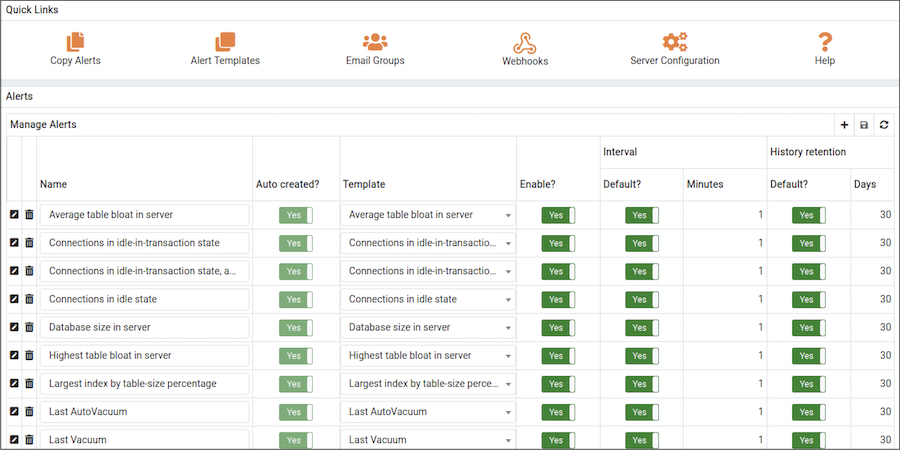

Postgres Enterprise Manager monitors a system for conditions that require user attention. An alert definition contains a system-defined or user-defined set of conditions that PEM compares to the system statistics; if the statistics deviate from the boundaries specified for that statistic, the alert triggers, displaying a `High` (red), `Low` (yellow) or `Medium` (orange) severity warning in the left-most column of the `Alerts Status` table on the `Global Overview` dashboard, and optionally sends a notification via email to [Email Groups](05_pem_email_groups/#pem_email_groups) or [SNMP trap/notification receivers](07_snmp_mib_generation/#snmp_mib_generation).

The PEM server includes a number of pre-defined alerts that are actively monitoring your servers. If the alert definition makes details available about the cause of the alert, you can click the down arrow to the right of the severity warning to access a dialog with detailed information about the condition that triggered the alert. Please note that Alert Details section lists top 10 entries only in the general tab.

PEM also provides an interface that allows you to create customized alerts. Each alert uses metrics defined on an alert template. An alert template defines how the server will evaluate the statistics for a resource or metric. The PEM server includes a number of pre-defined alert templates, or you can create custom alert templates.

## Using the Alerts Dashboard

Use the `Dashboards` menu (at the top of the `Global Overview` dashboard) to access the [Alerts Dashboard](../01_dashboards/01_alerts_dashboard/#alerts_dashboard). The Alerts Dashboard displays a summary of the active alerts and the status of each alert:

The `Alerts Overview` section displays a graphic representation of the active alerts, as well as a count of the current High, Low and Medium alerts. The vertical bar on the left of the graph provides the count of the alerts displayed in each column. Hover over a bar to display the alert count for the selected alert severity in the upper-right hand corner of the `Alerts Status` graph.

The `Alert Details` table provides a list of the alerts that are currently triggered. The entries are prioritized from high-severity to lower-severity; each entry includes information that will allow you to identify the alert and recognize the condition that triggered the alert. Click the name of an alert to review the alert definition, or the down arrow next to the alert icon to review the metrics that triggered the alert.

The `Alert Errors` table displays configuration-related errors (eg. accidentally disabling a required probe, or improperly configuring an alert parameter). You can use the information provided in the `Error Message` column to identify and resolve the conflict that is causing the error; for additional assistance, contact [EnterpriseDB Support](mailto:support@enterprisedb.com).

## Managing Alerts

PEM's `Manage Alerts` tab allows you to define custom alerts or modify existing alerts. To open the [Manage Alerts tab](01_pem_alerting_dialog/#pem_alerting_dialog), select `Manage Alerts...` from the `Management` menu. The Manage Alerts tab provides an easy way to review the alerts that are currently defined for the object that is highlighted in the PEM client tree control; simply select an object to see the alerts that are defined for that object.

The `Manage Alerts` tab also provides `Quick Links` that provide quick access to dialogs that allow you to:

> -   [Copy an alert](02_pem_alert_copy/#pem_alert_copy) from one object to one or more objects.
> -   [Create or modify an alert template](04_pem_custom_alert_templates/#pem_custom_alert_templates).
> -   [Create or Modify an email group](05_pem_email_groups/#pem_email_groups).
> -   Manage [PEM Server configuration](05_pem_email_groups/#pem_email_groups) details.
> -   Access the PEM online help.

You can configure an alert to notify Nagios network-alerting software when that alert is triggered. For more information, see [Using PEM with Nagios](09_using_pem_with_nagios/#using_pem_with_nagios).

To [create a new alert](01_pem_alerting_dialog/#pem_alerting_dialog), click the add icon in the upper-right corner of the `Alerts` table.

pem_alerting_dialog pem_alert_copy pem_alert_templates pem_custom_alert_templates pem_email_groups pem_webhooks snmp_mib_generation snmp_trap_details using_pem_with_nagios

