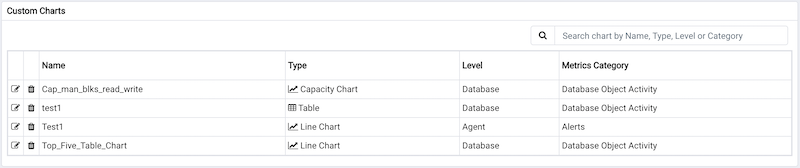

Selecting the `Import Capacity Manager Template` from the `Manage Charts` tab's `Quick Links` section opens the `Create Chart` dialog, allowing you to select from your saved Capacity Manager templates. When the dialog opens, use the `Import capacity template` drop-down listbox to select the template you would like to use for your chart.

Use the fields on the `Create Chart` dialog to provide information about the chart:

-   Specify the name of the chart in the `Name` field.
-   Use the drop-down listbox in the `Category` field to specify the category in which this chart will be displayed. When adding a custom chart to a custom dashboard, the chart will be displayed for selection in the `Category` specified.
-   Use the radio buttons in the `Type` field to specify if the chart will be a `Line chart` or a `Table`.
-   Provide a description of the chart in the `Description` field. The description will be displayed to the user viewing the chart (on a custom dashboard) when they click the information icon.

Click `Next` to continue to the `Select Metrics` window.

The `Select Metrics` window displays details about the metrics that are used by the template. When you've reviewed the metrics, click `Next` to continue to the `Set Options` window.

Use the fields on the `Set Options` window to specify display options for your chart:

-   Use the `Auto Refresh` field to specify the number of minutes between chart updates - choose a value from 1 to 999. The default auto refresh rate is 2 minutes.

-   Use the fields in the `Data extrapolation` box to specify the time period covered by the chart. You can either:

    -   click the `Historical days and extrapolated days` label and:
        -   specify the number of days of historical data that should be charted in the `Historical` field.
        -   specify the number of projected days that should be charted in the `Extrapolated` field.
    -   or, click the `Historical days and threshold` label and:
        -   provide the number of days of historical data that should be charted in the `Historical` field.
        -   use the threshold selection fields to specify the threshold value at which the chart will end.

When you've completed the `Set Options` window, click `Next` to continue.

After making any required modifications to the chart definition, click `Finish` to save your edits. PEM will open a popup, confirming that the edits have been saved:

## Exporting or Importing a Chart

From PEM 8.3 onwards, you can export or import the charts to another PEM Server.

To `Export` the Chart, select any chart from the `Charts` tab and then select the `Export` icon in the upper-right corner of the table. Select `Save File` option and then select `ok`, it will generate the `JSON` file.

To `Import` the Chart, go to the `Charts` tab and then select the `Import` icon in the upper-right corner.

Click on the `Browse` button to select the `JSON` file with the code to be imported and then click `Import`.

After selecting the file to import, you can select the following checkboxes:

-   `skip exiting` - If you select this checkbox then it will skip the chart if it already exists.
-   `skip existing dependent probe` - The charts are dependent on probes. If you select this checkbox then it will skip the dependent probe if it already exists.

If both the checkboxes are selected and the chart already exists, then it skips importing the chart with below message:

If the `skip existing` checkbox is not selected and `skip dependent probe` is selected and the chart already exists, then it will import the chart successfully as below:

If both the checkboxes are not selected and the chart does not exist, then it will successfully import the chart as below:

## Deleting an Chart

To delete an chart, select the template name in the charts table, and click the `Delete` icon (located to the upper-right corner of the table). The alert history will persist for the length of time specified on the `History Retention` field in the template definition.
