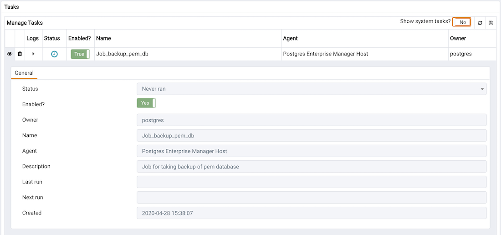
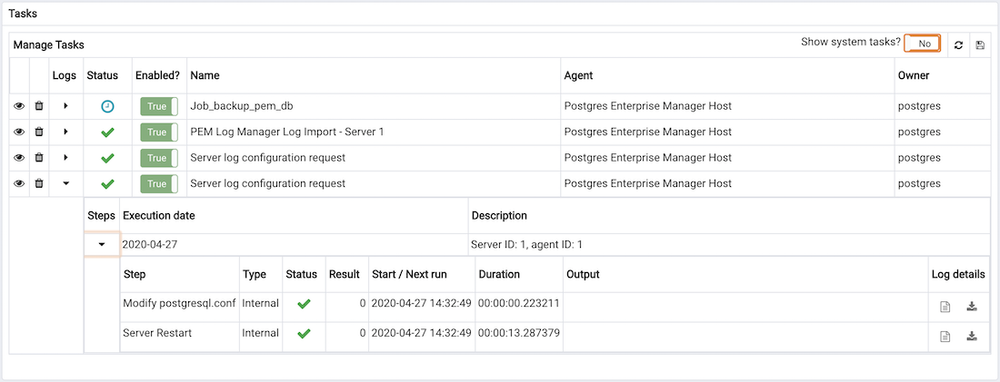

You can schedule the execution of user-defined tasks on registered servers for a time that is most convenient, and least intrusive to your users. Tasks may be one-off, or recurring and are comprised of one or more steps, which may be a SQL script, a batch/shell script, or an internal function in the PEM agent. You can view pending tasks on the *Scheduled Tasks tab.*

To open the `Scheduled Tasks` tab, select either a PEM Agent or a managed server in the tree control of the PEM client and select `Scheduled Tasks...` from the `Management` menu.

The tab features a legend, displaying the icons that identify the status of each task.

The `Manage Tasks` table displays a list of tasks. Set `Show system tasks?` to `Yes` to display system tasks; if it is set to `No`, only user-defined tasks are displayed. System tasks are displayed with a grey background, and may not be modified.

Use the `Refresh` icon to update the list of tasks displayed in the table. The table displays general information about each task.

-   The `Execution` drop-down provides access to detailed information about each step in the task.
-   The `Status` field lists the status of the current task.
-   The `Enabled?` switch displays `Yes` if the task is enabled; `No` if the task is disabled.
-   The `Name` field displays the name of the task.
-   The `Agent` or `Server` field displays the name of the agent responsible for executing the task or the server on which the task will execute.

Highlight the name of a user-defined task and click the `Edit` icon (to the left of a task name) to access detailed information about the selected task.

The `General` tab displays information about the scheduled task:

-   The `Status` field lists the status of the current task.
-   The `Enabled?` switch displays `Yes` if the task is enabled; `No` if the task is disabled.
-   The `Name` field displays the name of the task.
-   The `Agent` or `Server` field displays the name of the agent responsible for executing the task or the server on which the task will be performed.
-   The `Description` field displays a description of the task.
-   The `Last run` field displays the date and time of the last execution of the task.
-   The `Next run` field displays the date and time of the next scheduled execution of the task.
-   The `Created` field displays the date and time that the task was defined.

Highlight the name of a user-defined task and open the `Steps` arrow to review a list of the steps within the task.

The list of steps displays general information about each step in the task:

-   The `Execution date` field displays the date on which the step will execute. Step history is grouped by execution date; use the arrow to the left of an execution date to expand the node and review the task logs for that date.
-   The `Description` field displays a description of the step.

Use the arrow to the left of an execution date (in the `Steps` column) to view detailed information about the step:

-   The `Step` field displays a description of the step.
-   The `Type` field displays the task type.
-   The `Status` field lists the status of the current task.
-   If applicable, the `Result` field displays code generated during the execution of the step.
-   The `Start/Next run` field displays the date and time at which the task executed or will execute again.
-   The `Duration` field displays the length of time that the task required for execution.
-   The `Output` field displays the result set returned by the execution of the task. By default, it displays the first 250 characters. You can also change the display characters by changing the `Schedule Tasks` options in the `Preference` dialog.
-   The `Log details` field allows you to open the log in the new browser window and also download the complete log.

To delete a user-defined task, highlight the name of the task, and click the `Delete` icon located to the left of a task's name. The task will be marked for deletion, and removed when you click the `Save` icon (located in the upper-right corner of the `Manage Tasks` table.

**Note:** Tasks with no `Next run` date will automatically be removed from the PEM server when the last run date is more than [probe_log_retention_time](02_pem_server_config/01_pem_config_options/#pem_config_options) days ago.

Please note that if any of the scheduled tasks for backup, restore, validate host, validate server or delete obsolete backup for any of the BART Server gets deleted, it will not display under the `BART Tool Activities` graph of BART Server's dashboard. However, it gets listed under the `Initiated Server Backups` list.
