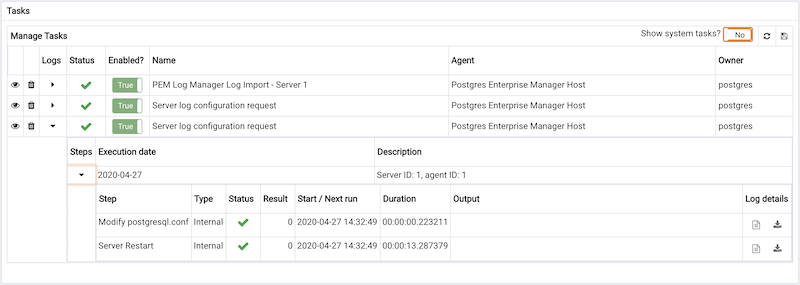

When PEM executes [scheduled tasks](./#pem_task_view), log records are created to record the status of each step of the task for diagnostic purposes. Log records can be viewed on the *Log Viewer* dialogue, opened from the [Scheduled Task dialogue](./#pem_task_view).

The dialogue displays the log data relating to each step of the task:

-   **Step** - The name of the step.
-   **Type** - The type of the step, one of SQL, Batch or Internal.
-   **Status** - The status of the step.
-   **Result** - The numeric result of the step. For a batch step, this will be the return code of the script.
-   **Start / Next Run** - The schedule for the next run.
-   **Duration** - The duration of the step.
-   **Output** - The output text from the step, if any.
